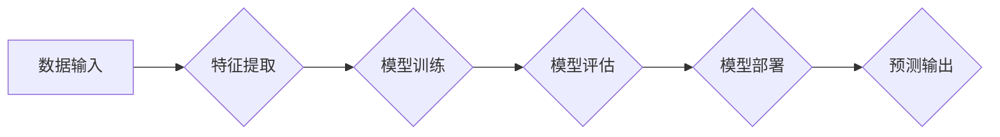

> 人工智能，深度学习，机器学习，自然语言处理，计算机视觉，伦理问题，未来趋势

## 1. 背景介绍

人工智能（AI）作为一项颠覆性技术，近年来取得了令人瞩目的进展。从语音识别到图像识别，从自动驾驶到医疗诊断，AI正在深刻地改变着我们的生活和工作方式。

### 1.1 AI发展历程回顾

AI的发展历程可以追溯到20世纪50年代，早期主要集中在规则式人工智能，依赖于人工编写的规则和知识库。随着计算机硬件和软件技术的进步，机器学习（ML）和深度学习（DL）等新兴技术应运而生，为AI的发展带来了新的机遇。

### 1.2 AI技术现状与挑战

目前，AI技术已经取得了显著的成果，但在某些领域仍然面临着挑战。例如，

* **数据依赖性:** AI模型的训练需要大量的数据，而高质量的数据往往难以获取。
* **可解释性问题:** 许多AI模型是“黑箱”模型，其决策过程难以解释，这限制了AI在一些安全关键领域中的应用。
* **伦理问题:** AI技术的应用可能引发一些伦理问题，例如算法偏见、隐私泄露等，需要引起足够的重视。

## 2. 核心概念与联系

### 2.1 机器学习

机器学习是AI的一个重要分支，它通过算法学习数据中的模式，从而提高预测或决策的准确性。

### 2.2 深度学习

深度学习是机器学习的一个子集，它使用多层神经网络来模拟人类大脑的学习过程。深度学习在图像识别、语音识别等领域取得了突破性的进展。

### 2.3 自然语言处理

自然语言处理（NLP）是让计算机理解和处理人类语言的技术。NLP在聊天机器人、机器翻译等领域有着广泛的应用。

### 2.4 计算机视觉

计算机视觉是让计算机“看”和理解图像的技术。计算机视觉在图像识别、目标检测等领域有着广泛的应用。

**Mermaid 流程图**



## 3. 核心算法原理 & 具体操作步骤

### 3.1 算法原理概述

深度学习算法的核心是多层神经网络。神经网络由多个节点（神经元）组成，每个节点都连接着其他节点，并通过权重来传递信息。通过训练，神经网络可以学习到数据的特征和模式，从而实现预测或决策。

### 3.2 算法步骤详解

1. **数据预处理:** 将原始数据转换为模型可以理解的格式。
2. **网络结构设计:** 根据任务需求设计神经网络的结构，包括层数、节点数、激活函数等。
3. **模型训练:** 使用训练数据训练神经网络，通过调整权重来最小化模型的损失函数。
4. **模型评估:** 使用测试数据评估模型的性能，例如准确率、召回率等。
5. **模型部署:** 将训练好的模型部署到实际应用场景中。

### 3.3 算法优缺点

**优点:**

* 能够学习到数据的复杂特征。
* 性能优于传统机器学习算法。
* 在图像识别、语音识别等领域取得了突破性进展。

**缺点:**

* 数据依赖性强，需要大量的数据进行训练。
* 计算资源消耗大，训练时间长。
* 可解释性差，难以理解模型的决策过程。

### 3.4 算法应用领域

深度学习算法在各个领域都有广泛的应用，例如：

* **图像识别:** 人脸识别、物体检测、图像分类等。
* **语音识别:** 语音转文本、语音助手等。
* **自然语言处理:** 机器翻译、文本摘要、情感分析等。
* **医疗诊断:** 疾病预测、图像分析等。
* **自动驾驶:** 路线规划、物体检测等。

## 4. 数学模型和公式 & 详细讲解 & 举例说明

### 4.1 数学模型构建

深度学习模型通常使用神经网络来模拟人类大脑的结构和功能。神经网络由多个层组成，每层包含多个神经元。每个神经元接收来自上一层的输入信号，并通过权重进行加权求和，然后通过激活函数进行非线性变换，最后输出到下一层。

### 4.2 公式推导过程

**激活函数:**

常用的激活函数包括 sigmoid 函数、ReLU 函数等。

* **sigmoid 函数:** $$f(x) = \frac{1}{1 + e^{-x}}$$

* **ReLU 函数:** $$f(x) = max(0, x)$$

**损失函数:**

损失函数用于衡量模型预测结果与真实值的差距。常用的损失函数包括均方误差（MSE）、交叉熵损失等。

* **均方误差 (MSE):** $$L = \frac{1}{n} \sum_{i=1}^{n} (y_i - \hat{y}_i)^2$$

其中，$y_i$ 是真实值，$\hat{y}_i$ 是模型预测值，$n$ 是样本数量。

### 4.3 案例分析与讲解

**图像分类:**

假设我们有一个图像分类任务，目标是将图像分类为不同的类别，例如猫、狗、鸟等。我们可以使用卷积神经网络（CNN）来解决这个问题。CNN 可以学习图像的特征，例如边缘、纹理等，并将其用于分类。

## 5. 项目实践：代码实例和详细解释说明

### 5.1 开发环境搭建

* Python 3.x
* TensorFlow 或 PyTorch 等深度学习框架
* Jupyter Notebook 或 VS Code 等代码编辑器

### 5.2 源代码详细实现

```python
import tensorflow as tf

# 定义模型结构
model = tf.keras.models.Sequential([
    tf.keras.layers.Conv2D(32, (3, 3), activation='relu', input_shape=(28, 28, 1)),
    tf.keras.layers.MaxPooling2D((2, 2)),
    tf.keras.layers.Conv2D(64, (3, 3), activation='relu'),
    tf.keras.layers.MaxPooling2D((2, 2)),
    tf.keras.layers.Flatten(),
    tf.keras.layers.Dense(10, activation='softmax')
])

# 编译模型
model.compile(optimizer='adam',
              loss='sparse_categorical_crossentropy',
              metrics=['accuracy'])

# 训练模型
model.fit(x_train, y_train, epochs=5)

# 评估模型
loss, accuracy = model.evaluate(x_test, y_test)
print('Test loss:', loss)
print('Test accuracy:', accuracy)
```

### 5.3 代码解读与分析

这段代码定义了一个简单的卷积神经网络模型，用于手写数字识别任务。

* **Conv2D:** 卷积层，用于学习图像的特征。
* **MaxPooling2D:** 最大池化层，用于降低特征图的大小，提高模型的鲁棒性。
* **Flatten:** 将多维特征图转换为一维向量。
* **Dense:** 全连接层，用于分类。

### 5.4 运行结果展示

训练完成后，我们可以使用测试数据评估模型的性能。

## 6. 实际应用场景

### 6.1 医疗诊断

AI可以辅助医生进行疾病诊断，例如通过分析医学影像识别肿瘤、预测患者的风险等。

### 6.2 金融风险管理

AI可以用于识别金融欺诈、评估信用风险、预测市场趋势等。

### 6.3 自动驾驶

AI是自动驾驶的核心技术，用于感知周围环境、规划路线、控制车辆等。

### 6.4 未来应用展望

AI技术的应用前景广阔，未来将应用于更多领域，例如：

* **个性化教育:** 根据学生的学习情况提供个性化的学习方案。
* **智能家居:** 通过语音控制、图像识别等技术，实现智能家居的自动化。
* **机器人技术:** 开发更加智能、灵活的机器人，用于工业生产、服务业等领域。

## 7. 工具和资源推荐

### 7.1 学习资源推荐

* **在线课程:** Coursera、edX、Udacity 等平台提供丰富的AI课程。
* **书籍:** 《深度学习》、《机器学习实战》等书籍。
* **开源项目:** TensorFlow、PyTorch 等开源深度学习框架。

### 7.2 开发工具推荐

* **Python:** AI开发的主要编程语言。
* **Jupyter Notebook:** 用于代码编写、数据分析和可视化。
* **VS Code:** 代码编辑器，支持Python和深度学习框架的插件。

### 7.3 相关论文推荐

* **《ImageNet Classification with Deep Convolutional Neural Networks》**
* **《Attention Is All You Need》**
* **《BERT: Pre-training of Deep Bidirectional Transformers for Language Understanding》**

## 8. 总结：未来发展趋势与挑战

### 8.1 研究成果总结

近年来，AI技术取得了显著的进展，在各个领域都有广泛的应用。深度学习算法成为AI发展的主流方向，并取得了突破性的成果。

### 8.2 未来发展趋势

* **模型规模和能力的提升:** 未来，AI模型将更加强大，能够处理更加复杂的任务。
* **模型解释性和可信度的提升:** 研究人员将致力于提高AI模型的可解释性和可信度，使其能够更好地应用于安全关键领域。
* **边缘计算和联邦学习:** AI将更加广泛地部署到边缘设备和分布式系统中，以提高效率和隐私保护。

### 8.3 面临的挑战

* **数据安全和隐私保护:** AI技术的应用需要大量的数据，如何保护数据安全和隐私是一个重要的挑战。
* **算法偏见和公平性:** AI算法可能存在偏见，导致不公平的结果，需要采取措施解决这个问题。
* **伦理问题:** AI技术的应用可能引发一些伦理问题，例如人工智能的责任和义务等，需要引起足够的重视。

### 8.4 研究展望

未来，AI研究将继续朝着更加智能、安全、可解释的方向发展。

## 9. 附录：常见问题与解答

### 9.1 什么是深度学习？

深度学习是一种机器学习的子集，它使用多层神经网络来模拟人类大脑的学习过程。

### 9.2 深度学习有哪些应用？

深度学习在各个领域都有广泛的应用，例如图像识别、语音识别、自然语言处理、医疗诊断等。

### 9.3 如何学习深度学习？

可以通过在线课程、书籍、开源项目等方式学习深度学习。

作者：禅与计算机程序设计艺术 / Zen and the Art of Computer Programming


<end_of_turn>