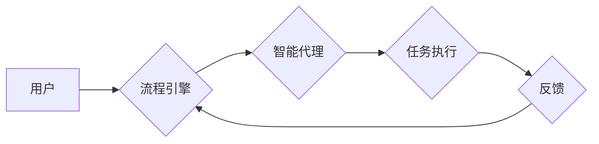

> Agentic Workflow,  智能工作流,  自动化,  机器学习,  流程引擎,  用户体验,  应用场景

## 1. 背景介绍

在当今数字化时代，企业和组织面临着日益复杂的业务流程和不断增长的工作量。传统的静态工作流难以适应快速变化的业务需求，而智能工作流则凭借其自动化、智能化和可扩展性，成为解决这些问题的关键技术之一。

Agentic Workflow 作为一种新型的智能工作流解决方案，通过结合机器学习、自然语言处理等先进技术，赋予工作流自主决策和执行的能力，从而实现更高效、更智能的业务流程管理。

## 2. 核心概念与联系

Agentic Workflow 的核心概念是将工作流视为一个由智能代理组成的网络。每个代理都拥有特定的知识和技能，能够根据预定义的规则和环境信息，自主地执行任务、做出决策并与其他代理进行交互。

**Agentic Workflow 架构**



**核心概念联系:**

* **用户:**  启动和监控工作流，提供初始输入和反馈。
* **流程引擎:**  管理工作流的执行流程，调度智能代理并协调任务执行。
* **智能代理:**  执行工作流中的特定任务，根据规则和环境信息做出决策。
* **任务执行:**  代理执行具体的工作，例如数据处理、信息检索、决策分析等。
* **反馈:**  代理执行结果反馈给流程引擎，用于调整工作流执行策略。

## 3. 核心算法原理 & 具体操作步骤

### 3.1  算法原理概述

Agentic Workflow 的核心算法基于强化学习和决策树算法。

* **强化学习:**  智能代理通过与环境交互，学习最佳的决策策略，以最大化奖励。
* **决策树:**  用于表示代理的决策规则，根据输入条件，选择相应的执行动作。

### 3.2  算法步骤详解

1. **环境建模:**  将工作流环境建模为一个状态空间，其中每个状态代表工作流的当前状态。
2. **代理初始化:**  为每个智能代理赋予初始状态和决策策略。
3. **状态转移:**  根据代理的执行动作，工作流状态发生转移。
4. **奖励函数:**  定义一个奖励函数，根据代理的执行结果和工作流目标，计算代理的奖励。
5. **策略更新:**  利用强化学习算法，根据代理的奖励和环境信息，更新代理的决策策略。
6. **重复执行:**  重复步骤3-5，直到代理学习到最佳的决策策略。

### 3.3  算法优缺点

**优点:**

* **自动化:**  智能代理能够自动执行任务，减少人工干预。
* **智能化:**  代理能够根据环境信息做出决策，适应变化的业务需求。
* **可扩展性:**  可以轻松添加新的代理和任务，扩展工作流功能。

**缺点:**

* **复杂性:**  设计和训练智能代理需要一定的专业知识和技术。
* **数据依赖:**  强化学习算法需要大量的数据进行训练。
* **透明度:**  智能代理的决策过程可能难以理解，缺乏透明度。

### 3.4  算法应用领域

Agentic Workflow 适用于各种需要自动化和智能化的业务流程，例如：

* **客户服务:**  自动处理客户咨询、投诉和订单。
* **供应链管理:**  优化物流配送、库存管理和采购流程。
* **金融服务:**  自动审批贷款、风险评估和交易处理。
* **医疗保健:**  自动预约挂号、处理病历和安排手术。

## 4. 数学模型和公式 & 详细讲解 & 举例说明

### 4.1  数学模型构建

Agentic Workflow 的数学模型可以基于马尔可夫决策过程 (MDP) 来构建。

* **状态空间 (S):**  工作流的当前状态，例如任务执行进度、资源可用性等。
* **动作空间 (A):**  代理可以执行的动作，例如执行任务、获取信息、决策等。
* **转移概率 (P):**  从一个状态到另一个状态的概率，取决于代理执行的动作。
* **奖励函数 (R):**  代理执行动作后获得的奖励，取决于状态和动作。
* **价值函数 (V):**  代理在某个状态下获得的长期奖励期望。

### 4.2  公式推导过程

强化学习算法的目标是找到一个最优的策略，使得代理在长期内获得最大的总奖励。常用的强化学习算法包括 Q-学习和 SARSA。

* **Q-学习:**  更新 Q 值函数，Q(s, a) 表示在状态 s 下执行动作 a 的期望奖励。

$$
Q(s, a) = Q(s, a) + \alpha [r + \gamma \max_{a'} Q(s', a') - Q(s, a)]
$$

* **SARSA:**  更新 Q 值函数，Q(s, a) 表示在状态 s 下执行动作 a 的期望奖励，并根据当前策略选择下一个动作。

$$
Q(s, a) = Q(s, a) + \alpha [r + \gamma Q(s', a') - Q(s, a)]
$$

其中:

* $\alpha$ 是学习率，控制着学习速度。
* $\gamma$ 是折扣因子，控制着未来奖励的权重。
* $r$ 是当前状态的奖励。
* $s'$ 是下一个状态。
* $a'$ 是下一个状态的动作。

### 4.3  案例分析与讲解

假设一个 Agentic Workflow 用于处理客户投诉。

* **状态空间:**  投诉的类型、处理进度、客户满意度等。
* **动作空间:**  分配客服、提供解决方案、转接其他部门等。
* **奖励函数:**  根据客户满意度和投诉处理时间来计算奖励。

通过强化学习算法，智能代理可以学习到最佳的投诉处理策略，例如优先处理紧急投诉、根据投诉类型分配合适的客服等。

## 5. 项目实践：代码实例和详细解释说明

### 5.1  开发环境搭建

* **操作系统:**  Linux/macOS/Windows
* **编程语言:**  Python
* **框架:**  TensorFlow/PyTorch
* **工具:**  Git、Docker

### 5.2  源代码详细实现

```python
# 智能代理类
class Agent:
    def __init__(self, env):
        self.env = env
        self.q_table = {}  # Q 值表

    def choose_action(self, state):
        # 根据 Q 值表选择动作
        return max(self.q_table[state], key=self.q_table[state].get)

    def learn(self, state, action, reward, next_state):
        # 更新 Q 值表
        self.q_table[state][action] = (1 - alpha) * self.q_table[state][action] + alpha * (reward + gamma * max(self.q_table[next_state].values()))

# 环境类
class Environment:
    # ...

# 主程序
if __name__ == "__main__":
    env = Environment()
    agent = Agent(env)
    # ...
```

### 5.3  代码解读与分析

* **Agent 类:**  定义智能代理，包含 Q 值表和选择动作的方法。
* **Environment 类:**  定义工作流环境，包含状态空间、动作空间、转移概率和奖励函数。
* **主程序:**  创建环境和代理，并进行强化学习训练。

### 5.4  运行结果展示

通过训练，智能代理可以学习到最佳的决策策略，并能够自动执行工作流任务。

## 6. 实际应用场景

Agentic Workflow 在多个领域都有着广泛的应用场景：

### 6.1  客户服务

* 自动处理客户咨询、投诉和订单。
* 提供个性化的客户服务体验。
* 提高客户满意度和服务效率。

### 6.2  供应链管理

* 优化物流配送、库存管理和采购流程。
* 预防供应链风险和中断。
* 降低运营成本和提高效率。

### 6.3  金融服务

* 自动审批贷款、风险评估和交易处理。
* 提高金融服务的效率和准确性。
* 降低金融风险和成本。

### 6.4  未来应用展望

随着人工智能技术的不断发展，Agentic Workflow 将在更多领域得到应用，例如：

* **医疗保健:**  自动预约挂号、处理病历和安排手术。
* **教育:**  个性化学习推荐和自动批改作业。
* **法律:**  自动分析法律文件和提供法律建议。

## 7. 工具和资源推荐

### 7.1  学习资源推荐

* **书籍:**  Reinforcement Learning: An Introduction by Sutton and Barto
* **在线课程:**  Coursera, Udacity, edX
* **博客:**  Towards Data Science, Machine Learning Mastery

### 7.2  开发工具推荐

* **流程引擎:**  Camunda, Activiti
* **机器学习框架:**  TensorFlow, PyTorch
* **编程语言:**  Python, Java

### 7.3  相关论文推荐

* **Agentic Workflow: A Framework for Intelligent Workflow Automation**
* **Reinforcement Learning for Workflow Optimization**
* **Deep Learning for Workflow Management**

## 8. 总结：未来发展趋势与挑战

### 8.1  研究成果总结

Agentic Workflow 作为一种新型的智能工作流解决方案，在自动化、智能化和可扩展性方面具有显著优势。通过结合强化学习和决策树算法，智能代理能够自主地执行任务、做出决策并与其他代理进行交互，从而实现更高效、更智能的业务流程管理。

### 8.2  未来发展趋势

* **更强大的机器学习模型:**  利用更先进的机器学习算法，例如深度学习，提高智能代理的决策能力和适应性。
* **更丰富的环境感知:**  增强智能代理的环境感知能力，例如通过传感器数据、外部API等，获取更全面的环境信息。
* **更强的协作能力:**  提高智能代理之间的协作能力，实现更复杂的业务流程协同。

### 8.3  面临的挑战

* **数据安全和隐私保护:**  Agentic Workflow 需要处理大量的数据，因此需要确保数据安全和隐私保护。
* **透明度和可解释性:**  智能代理的决策过程可能难以理解，需要提高透明度和可解释性，以便用户能够信任和理解代理的决策。
* **部署和维护成本:**  Agentic Workflow 的部署和维护成本可能较高，需要降低成本并提高易用性。

### 8.4  研究展望

未来，Agentic Workflow 将继续朝着更智能、更自动化、更安全的方向发展。研究者将继续探索更先进的机器学习算法、环境感知技术和协作机制，以构建更强大的智能工作流解决方案。

## 9. 附录：常见问题与解答

**Q1: Agentic Workflow 与传统工作流有什么区别？**

**A1:**  传统工作流是静态的，流程固定，而 Agentic Workflow 是动态的，流程可变，智能代理能够根据环境信息做出决策，适应变化的业务需求。

**Q2:  Agentic Workflow 需要多少数据才能训练智能代理？**

**A2:**  训练智能代理需要大量的历史数据，数据量取决于工作流的复杂度和代理的决策能力。

**Q3:  Agentic Workflow 是否会取代人类工作？**

**A3:**  Agentic Workflow 旨在自动化重复性、规则性的工作，释放人类的工作时间，以便专注于更具创造性和战略性的工作。


作者：禅与计算机程序设计艺术 / Zen and the Art of Computer Programming 
<end_of_turn>