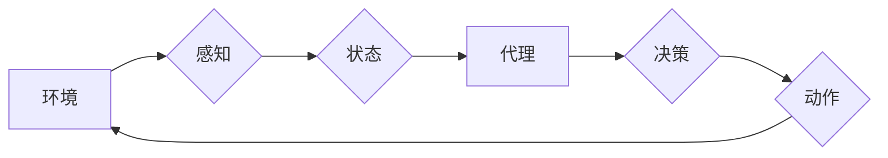

> AI系统,代理,智能体,决策,环境交互,强化学习,行为策略,状态空间

## 1. 背景介绍

在人工智能领域，代理的概念扮演着至关重要的角色。代理可以被理解为一个能够感知环境、做出决策并与环境交互的智能体。它代表着AI系统与外部世界进行交互的桥梁，是实现AI系统智能化的关键要素。

随着人工智能技术的不断发展，代理的概念也得到了越来越广泛的应用。从自动驾驶汽车到智能家居，从机器人控制到金融交易，代理都在各个领域发挥着重要的作用。

## 2. 核心概念与联系

**2.1 代理的概念**

代理是一个能够感知环境、做出决策并与环境交互的智能体。它可以是软件程序、机器人、甚至人类。代理的目标通常是最大化其自身的利益或完成特定的任务。

**2.2 环境的概念**

环境是指代理所处的外界世界。环境可以是物理世界，也可以是抽象的数字世界。环境会提供代理感知信息，并根据代理的行为做出相应的反馈。

**2.3 状态空间的概念**

状态空间是指代理所处环境的所有可能状态的集合。每个状态都描述了环境中所有相关变量的值。代理需要根据当前状态做出决策。

**2.4 行为策略的概念**

行为策略是指代理根据当前状态选择动作的规则。行为策略可以是基于规则的，也可以是基于学习的。

**2.5 奖励函数的概念**

奖励函数是一个将代理的行为映射到数值的函数。奖励函数用于指导代理的行为，使其朝着能够获得最大奖励的方向发展。

**2.6 代理与环境交互的流程图**



## 3. 核心算法原理 & 具体操作步骤

### 3.1 算法原理概述

代理学习和决策的核心算法通常是强化学习算法。强化学习算法通过代理与环境的交互，学习一个能够最大化奖励的行为策略。

### 3.2 算法步骤详解

1. **初始化:** 初始化代理的行为策略，并设置奖励函数。
2. **感知环境:** 代理感知环境，获取当前状态信息。
3. **决策:** 根据当前状态和行为策略，代理选择一个动作。
4. **执行动作:** 代理执行选择的动作，并观察环境的变化。
5. **获得奖励:** 环境根据代理的动作提供奖励。
6. **更新策略:** 代理根据奖励信息更新行为策略，使其朝着能够获得最大奖励的方向发展。
7. **重复步骤2-6:** 代理不断与环境交互，更新策略，直到达到预设的目标或终止条件。

### 3.3 算法优缺点

**优点:**

* 可以学习复杂的行为策略。
* 不需要事先定义所有规则。
* 可以适应不断变化的环境。

**缺点:**

* 训练过程可能很长。
* 需要大量的训练数据。
* 难以解释代理的行为决策。

### 3.4 算法应用领域

强化学习算法在许多领域都有广泛的应用，例如:

* 自动驾驶
* 机器人控制
* 游戏人工智能
* 金融交易
* 电力系统优化

## 4. 数学模型和公式 & 详细讲解 & 举例说明

### 4.1 数学模型构建

强化学习的数学模型通常基于马尔可夫决策过程 (MDP)。MDP 由以下几个要素组成:

* 状态空间 S: 所有可能的状态的集合。
* 动作空间 A: 在每个状态下可执行的动作的集合。
* 转移概率矩阵 P: 描述从一个状态到另一个状态的概率。
* 奖励函数 R: 描述在每个状态执行某个动作后获得的奖励。
* 折扣因子 γ: 控制未来奖励的权重。

### 4.2 公式推导过程

强化学习的目标是找到一个能够最大化预期累积奖励的行为策略 π。

预期累积奖励可以表示为:

$$
R(π) = E[∑_{t=0}^{∞} γ^t R(s_t, a_t)]
$$

其中:

* E 表示期望值。
* s_t 表示时间 t 的状态。
* a_t 表示时间 t 的动作。

### 4.3 案例分析与讲解

例如，考虑一个简单的强化学习问题: 一个机器人需要在迷宫中找到出口。

* 状态空间 S: 迷宫中的所有位置。
* 动作空间 A: 向上、向下、向左、向右四个方向移动。
* 转移概率矩阵 P: 描述机器人移动到不同位置的概率。
* 奖励函数 R: 当机器人到达出口时获得最大奖励，否则获得较小的奖励。
* 折扣因子 γ: 设置为 0.9，表示未来奖励的权重较高。

通过强化学习算法，机器人可以学习一个能够最大化预期累积奖励的行为策略，从而找到迷宫出口。

## 5. 项目实践：代码实例和详细解释说明

### 5.1 开发环境搭建

本项目使用 Python 语言进行开发，并使用 TensorFlow 库实现强化学习算法。

### 5.2 源代码详细实现

```python
import tensorflow as tf

# 定义状态空间和动作空间
state_space = 4
action_space = 4

# 定义神经网络模型
model = tf.keras.Sequential([
    tf.keras.layers.Dense(128, activation='relu', input_shape=(state_space,)),
    tf.keras.layers.Dense(action_space, activation='softmax')
])

# 定义损失函数和优化器
loss_fn = tf.keras.losses.CategoricalCrossentropy()
optimizer = tf.keras.optimizers.Adam()

# 训练模型
for episode in range(num_episodes):
    state = env.reset()
    done = False
    while not done:
        # 选择动作
        action = model.predict(state.reshape(1, -1))[0]
        # 执行动作
        next_state, reward, done, _ = env.step(action)
        # 更新模型
        with tf.GradientTape() as tape:
            # 计算损失
            loss = loss_fn(tf.one_hot(action, depth=action_space), model.predict(state.reshape(1, -1)))
        # 反向传播
        gradients = tape.gradient(loss, model.trainable_variables)
        # 更新参数
        optimizer.apply_gradients(zip(gradients, model.trainable_variables))
        # 更新状态
        state = next_state

```

### 5.3 代码解读与分析

这段代码实现了基于深度神经网络的强化学习算法。

* 首先定义了状态空间和动作空间。
* 然后构建了一个神经网络模型，用于预测动作概率。
* 使用损失函数和优化器训练模型。
* 在训练过程中，代理与环境交互，根据奖励信息更新模型参数。

### 5.4 运行结果展示

训练完成后，代理能够在环境中执行任务，并获得较高的奖励。

## 6. 实际应用场景

### 6.1 自动驾驶

在自动驾驶领域，代理可以被理解为自动驾驶汽车，它需要感知周围环境，做出决策并控制车辆行驶。强化学习算法可以帮助自动驾驶汽车学习复杂的驾驶策略，例如避障、变道、停车等。

### 6.2 机器人控制

在机器人控制领域，代理可以被理解为机器人，它需要感知周围环境，做出决策并控制机器人的运动。强化学习算法可以帮助机器人学习复杂的运动技能，例如抓取物体、导航、组装等。

### 6.3 游戏人工智能

在游戏人工智能领域，代理可以被理解为游戏角色，它需要感知游戏环境，做出决策并控制角色行动。强化学习算法可以帮助游戏角色学习复杂的策略，例如打怪、升级、完成任务等。

### 6.4 未来应用展望

随着人工智能技术的不断发展，代理在更多领域将发挥越来越重要的作用。例如，在医疗领域，代理可以帮助医生诊断疾病、制定治疗方案；在金融领域，代理可以帮助投资者进行投资决策；在教育领域，代理可以帮助学生学习新知识。

## 7. 工具和资源推荐

### 7.1 学习资源推荐

* **强化学习：强化学习算法与应用** (Sutton & Barto)
* **深度强化学习** (Mnih et al.)
* **OpenAI Gym** (https://gym.openai.com/)
* **TensorFlow** (https://www.tensorflow.org/)

### 7.2 开发工具推荐

* **Python**
* **TensorFlow**
* **PyTorch**
* **OpenAI Gym**

### 7.3 相关论文推荐

* **Deep Q-Network** (Mnih et al., 2015)
* **Policy Gradient Methods for Reinforcement Learning with Function Approximation** (Williams, 1992)
* **Proximal Policy Optimization Algorithms** (Schulman et al., 2017)

## 8. 总结：未来发展趋势与挑战

### 8.1 研究成果总结

近年来，强化学习算法取得了显著的进展，在许多领域取得了成功应用。

### 8.2 未来发展趋势

未来，强化学习算法将朝着以下几个方向发展:

* **更强大的模型:** 开发更强大的神经网络模型，能够学习更复杂的策略。
* **更有效的算法:** 开发更有效的强化学习算法，能够更快地学习，并解决更复杂的问题。
* **更广泛的应用:** 将强化学习算法应用到更多领域，例如医疗、金融、教育等。

### 8.3 面临的挑战

强化学习算法仍然面临一些挑战:

* **样本效率:** 强化学习算法需要大量的训练数据，这在某些情况下可能难以获得。
* **可解释性:** 强化学习算法的决策过程难以解释，这可能导致人们对算法的信任度降低。
* **安全性和可靠性:** 强化学习算法在某些情况下可能表现出不可预测的行为，这可能导致安全性和可靠性问题。

### 8.4 研究展望

未来，我们需要继续努力解决强化学习算法面临的挑战，并将其应用到更多领域，从而推动人工智能技术的进步。

## 9. 附录：常见问题与解答

**Q1: 强化学习算法与监督学习算法有什么区别？**

**A1:** 强化学习算法和监督学习算法都是机器学习算法，但它们的目标不同。监督学习算法的目标是学习一个能够将输入映射到输出的函数，而强化学习算法的目标是学习一个能够最大化预期累积奖励的行为策略。

**Q2: 强化学习算法需要多少训练数据？**

**A2:** 强化学习算法所需的训练数据量取决于具体问题和算法复杂度。一般来说，强化学习算法需要比监督学习算法更多的训练数据。

**Q3: 强化学习算法的决策过程如何解释？**

**A3:** 强化学习算法的决策过程通常难以解释，因为其决策过程是基于神经网络的，而神经网络的决策过程是复杂的。

**Q4: 强化学习算法的安全性和可靠性如何保证？**

**A4:** 强化学习算法的安全性和可靠性是一个重要的研究课题。目前，一些研究方法试图通过设计安全的奖励函数、限制代理的行为空间等方式来提高强化学习算法的安全性和可靠性。


作者：禅与计算机程序设计艺术 / Zen and the Art of Computer Programming 
<end_of_turn>