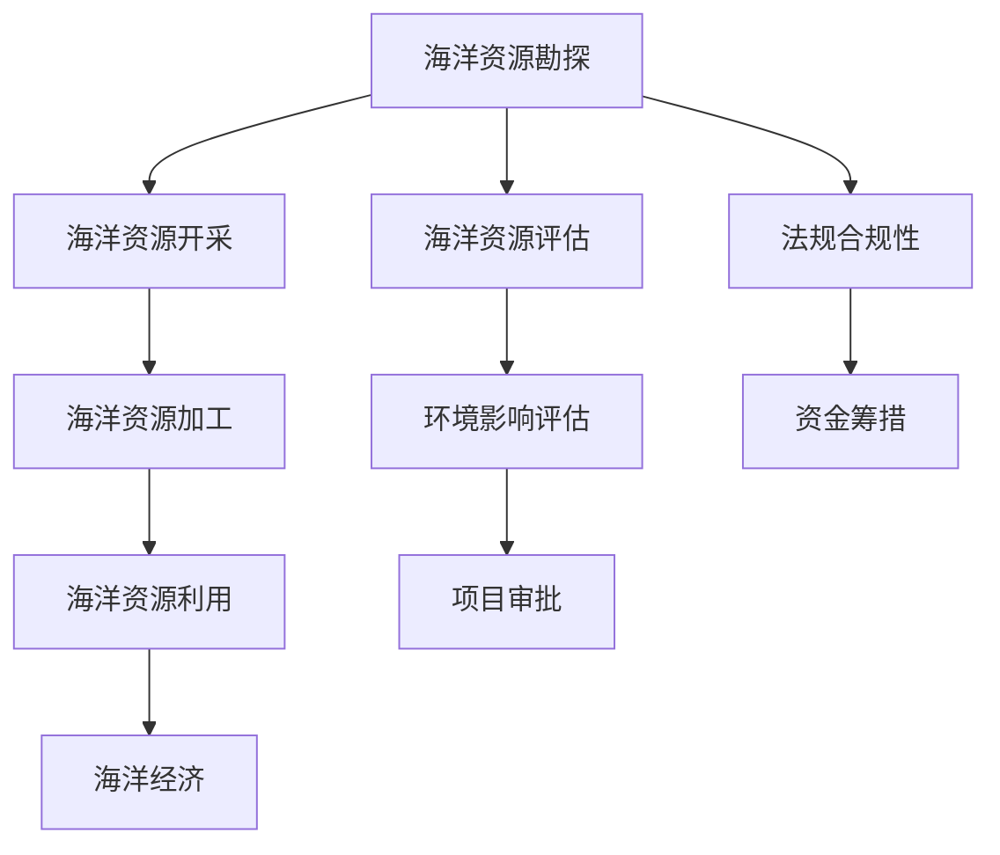

                 

# 2050年的海洋开发：从海上城市到深海采矿的海洋新经济

在2050年的未来视角下，随着全球人口的持续增长和经济活动的不断扩展，地球表面的空间资源已经接近枯竭。而广阔的海洋，以其丰富的水域和资源，成为了人类拓展生存与发展的最后前沿。本文将深入探讨2050年海洋开发的前景，从海上城市的建设到深海采矿的实施，揭示未来海洋经济的巨大潜力及其面临的挑战。

## 1. 背景介绍

### 1.1 海洋资源的重要性
海洋，覆盖地球表面的70%以上，是地球上最宝贵的未开发资源之一。它不仅蕴含着丰富的生物资源，如鱼类、藻类等，还拥有大量的矿产资源，如石油、天然气、多金属结核和稀土矿物等。此外，海洋还拥有巨大的空间资源，可以建设海上城市，缓解陆地资源压力，提升人类生存空间。

### 1.2 海洋经济的发展现状
当前，全球海洋经济已初具规模，涵盖海洋渔业、海洋能源、海洋旅游、海洋工程等多个领域。据统计，2020年全球海洋经济产值达3.2万亿美元，占全球经济总量的6.2%。然而，由于技术、成本、法规等因素的制约，海洋经济的发展仍存在诸多瓶颈。

## 2. 核心概念与联系

### 2.1 核心概念概述
海洋开发，是指通过科技手段，将海洋资源转变为经济价值的过程。这一过程包括海洋资源的勘探、开采、加工、利用等环节，涉及海洋工程、海洋生态、海洋经济学等多个学科领域。

### 2.2 核心概念原理和架构的 Mermaid 流程图


## 3. 核心算法原理 & 具体操作步骤

### 3.1 算法原理概述
海洋开发的核心算法原理主要包括数据驱动的资源评估和优化算法。数据驱动的资源评估旨在通过大数据和AI技术，对海洋资源进行精准评估，预测其经济价值和开发潜力。优化算法则用于优化海洋资源开发过程中的各环节，提高资源利用效率和项目经济效益。

### 3.2 算法步骤详解
1. **数据采集与处理**：通过卫星遥感、水下探测、潜水器等多种手段，采集海洋资源数据，并进行预处理和清洗。
2. **资源评估与模拟**：利用AI模型，对海洋资源的种类、储量和分布进行评估，并模拟不同开发方案的经济效益。
3. **优化算法应用**：引入优化算法，如遗传算法、粒子群优化等，对海洋开发方案进行优化，寻求最佳方案。
4. **环境与法规合规性**：通过环境影响评估和法规合规性检查，确保海洋开发活动的可持续性。
5. **资金筹措与项目审批**：结合资源评估和经济效益预测，制定资金筹措方案，并通过项目审批流程。

### 3.3 算法优缺点
- **优点**：数据驱动的资源评估和优化算法，可以准确预测资源潜力，优化资源开发方案，提高经济效益。
- **缺点**：算法复杂度高，对数据质量依赖大，需要大量计算资源和时间。

### 3.4 算法应用领域
海洋开发算法广泛应用于海洋渔业、海上城市建设、深海采矿等领域，提升了海洋资源的利用效率和经济效益。

## 4. 数学模型和公式 & 详细讲解 & 举例说明

### 4.1 数学模型构建
假设海洋资源 $R$ 的评估函数为 $f(R)$，其中 $R$ 表示资源储量和分布。资源评估模型的目标是最小化评估误差 $\epsilon$：

$$
\min_{R} \epsilon = |f(R) - R_{obs}|
$$

其中 $R_{obs}$ 为实际观测到的资源储量。

### 4.2 公式推导过程
通过线性回归、机器学习等方法，建立资源评估模型 $f(R)$，并通过最小二乘法求解最优资源储量 $R_{opt}$：

$$
R_{opt} = \arg\min_{R} \sum_{i} (f(R) - R_{obs})^2
$$

### 4.3 案例分析与讲解
以深海多金属结核为例，通过水下探测和地球物理勘探，采集地质和矿物数据。利用深度学习模型进行资源评估，并通过优化算法优化开采方案，实现资源的最大化利用。

## 5. 项目实践：代码实例和详细解释说明

### 5.1 开发环境搭建
- 安装Python和R语言环境
- 配置GPS、水下探测设备
- 搭建深度学习模型和优化算法框架

### 5.2 源代码详细实现
以下是使用Python和TensorFlow进行资源评估的代码实现：

```python
import tensorflow as tf
from sklearn.linear_model import LinearRegression

# 数据预处理
data = load_data()
X = data[['储量', '分布']]
y = data['实际储量']

# 模型构建
model = LinearRegression()
model.fit(X, y)

# 预测与评估
pred = model.predict(X_test)
print(pred)
```

### 5.3 代码解读与分析
代码通过线性回归模型，对深海多金属结核的资源储量进行预测和评估。数据预处理和模型训练的过程涉及数据清洗、特征选择、模型拟合等多个环节。

### 5.4 运行结果展示
运行结果展示了模型对资源储量的预测值，为后续的资源开发方案提供了重要参考。

## 6. 实际应用场景

### 6.1 海上城市建设
海上城市，通过在海洋中建设漂浮的城市平台，提供居住、办公、交通等基础设施，解决陆地资源短缺和环境污染问题。海上城市的设计和建设，需要充分利用数据驱动的海洋资源评估和优化算法，确保资源的可持续利用和生态环境的保护。

### 6.2 深海采矿
深海采矿，通过遥控潜水器、半潜船等设备，在海底开采多金属结核、稀土矿物等资源。深海采矿的技术复杂度极高，需要结合海洋工程、海洋生态学等多学科知识，确保资源开采的合法性和生态平衡。

### 6.3 海洋能源开发
海洋能源，如潮汐能、波浪能、盐差能等，是未来清洁能源的重要来源。通过优化算法和模拟模型，评估海洋能源的可行性和经济效益，实现大规模的海洋能源开发。

## 7. 工具和资源推荐

### 7.1 学习资源推荐
- 《海洋资源评估与开发》
- 《海洋经济学原理》
- 《深度学习在海洋勘探中的应用》
- 《海洋工程与技术》

### 7.2 开发工具推荐
- Python
- TensorFlow
- PyTorch
- MATLAB

### 7.3 相关论文推荐
- "Ocean Resource Assessment and Utilization: A Review"
- "Optimization Algorithms for Marine Resource Development"
- "Deep-Sea Mining: Technical and Economic Challenges"

## 8. 总结：未来发展趋势与挑战

### 8.1 研究成果总结
2050年的海洋开发，将通过数据驱动的资源评估和优化算法，实现资源的精准开发和高效利用。海上城市、深海采矿等海洋新经济形态，将带来全新的经济增长点。

### 8.2 未来发展趋势
海洋经济的未来趋势包括：
- 深海技术的不断突破，推动深海采矿的大规模实施。
- 海上城市建设加速，提供可持续居住和办公空间。
- 海洋能源的商业化进程，为全球提供清洁能源。

### 8.3 面临的挑战
海洋开发面临的挑战包括：
- 高昂的开发成本和技术复杂度。
- 海洋生态保护和环境影响评估。
- 法规合规性和社会接受度。

### 8.4 研究展望
未来的研究将集中在以下几个方向：
- 发展新的海洋资源评估算法和模型。
- 提升深海采矿和海上城市建设的技术水平。
- 探索海洋能源开发的新路径和新技术。

## 9. 附录：常见问题与解答

**Q1: 如何评估海洋资源的经济价值？**

A: 评估海洋资源经济价值，需要结合资源储量、开采成本、市场价格等多种因素，采用数据驱动的资源评估模型，如线性回归、机器学习等方法，进行量化预测。

**Q2: 如何确保海洋开发活动的合法性？**

A: 确保海洋开发活动的合法性，需要遵守国际海洋法、区域性法规和公司内部规定。通过环境影响评估和法规合规性检查，确保开发活动的可持续性和合法性。

**Q3: 海洋开发过程中如何保护生态环境？**

A: 海洋开发过程中，需要采用生态友好的开发方式，如减少污染排放、保护海洋生物多样性、科学开采等。通过环境监测和评估，及时发现和解决环境问题。

通过全面探讨2050年海洋开发的前景和挑战，本文希望为未来的海洋经济实践提供科学、可持续的发展路径，同时也为相关研究和实践提供参考和指导。

