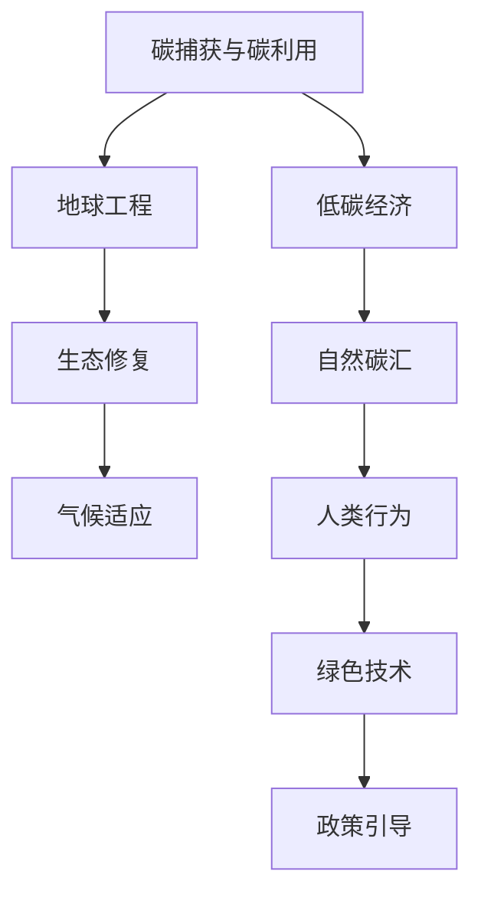

                 

## 1. 背景介绍

进入21世纪以来，全球气候变化加剧，极端天气频发，生态系统遭到破坏。面对这一严峻形势，各国政府和国际组织纷纷出台政策，提倡低碳发展、绿色转型。2050年的环境保护战略，将重点围绕碳捕获技术、地球工程、生态修复等方面展开，以期实现可持续发展的目标。

### 1.1 问题的由来

全球气候变化主要是由于人类活动导致的温室气体排放。化石燃料的燃烧、工业生产、交通运输等过程释放大量的二氧化碳（CO₂）、甲烷（CH₄）、氧化亚氮（N₂O）等温室气体。这些气体在大气中累积，形成温室效应，导致全球平均温度上升。

### 1.2 问题核心关键点

环境保护的核心在于减少温室气体排放，提升碳汇能力，修复受损生态系统。而2050年的环境保护目标则更为宏大，包括但不限于：

- 碳捕获和碳利用
- 地球工程技术的研发与应用
- 大规模生态修复工程
- 气候适应与应对策略

这些目标的实现，需要跨学科、跨领域的协同合作，整合先进技术与管理手段，构建系统性、全局性的环境保护体系。

## 2. 核心概念与联系

### 2.1 核心概念概述

为更好地理解2050年的环境保护战略，本节将介绍几个密切相关的核心概念：

- 碳捕获与碳利用（Carbon Capture and Utilization, CCUS）：通过技术手段从大气或工业排放中捕获CO₂，并将其转化为有用产品或存储起来，减少温室气体排放。
- 地球工程（GeoenGINEERING, GEOE）：人为干预地球系统，缓解或适应气候变化的方法，包括增强反射率（Albedo Enhancement）、云物理修改等技术。
- 生态修复（Ecosystem Restoration, ER）：通过修复受损的生态系统，增强其碳汇能力，提升生物多样性，保护自然资源。
- 气候适应（Climate Adaptation）：通过改变人类行为、调整经济结构、改进基础设施等措施，增强社会对气候变化的适应能力，减少气候变化带来的负面影响。
- 低碳经济（Low-Carbon Economy, LCE）：以低碳、绿色、可持继为发展目标的经济体系，推动清洁能源、节能减排、循环经济的发展。

这些概念之间的逻辑关系可以通过以下Mermaid流程图来展示：



这个流程图展示了几大环境保护概念及其之间的关系：

1. 碳捕获与碳利用是减少温室气体排放的核心手段。
2. 地球工程技术可以辅助应对气候变化，但需谨慎使用。
3. 生态修复可以增强生态系统的碳汇功能。
4. 气候适应是通过改变人类行为减少气候变化的负面影响。
5. 低碳经济是实现可持续发展的经济途径。
6. 自然碳汇和人类行为共同影响全球碳循环。
7. 绿色技术是推动低碳经济的关键动力。
8. 政策引导是实现环境保护目标的保障。

这些概念共同构成了2050年环境保护的战略框架，旨在通过综合手段实现气候变化应对和可持续发展。

## 3. 核心算法原理 & 具体操作步骤
### 3.1 算法原理概述

2050年的环境保护战略涉及多个领域的复杂算法和模型，主要围绕碳捕获、碳利用、地球工程、生态修复等展开。这些技术的实施，通常基于以下原则：

- 数据驱动：通过收集环境数据，分析和预测气候变化趋势，指导技术研发和应用。
- 系统优化：通过系统模型，整合不同技术和手段，实现最优的环境治理效果。
- 模型评估：建立科学的评估体系，定期评估环境治理的效果和效益，及时调整策略。
- 技术迭代：不断优化现有技术，研发新技术，提升环境保护的效率和效果。

### 3.2 算法步骤详解

以碳捕获与碳利用为例，具体算法步骤包括：

**Step 1: 数据收集与预处理**
- 收集大气CO₂浓度、温室气体排放源数据、环境监测数据等。
- 对数据进行清洗、标准化处理，去除异常值，保证数据质量。

**Step 2: 模型建立与训练**
- 根据历史数据，建立碳捕获模型的预测模型。
- 使用机器学习算法（如回归、分类、强化学习等），训练模型。
- 在训练过程中，应用交叉验证、超参数调优等技术，提升模型泛化能力。

**Step 3: 参数优化与调参**
- 调整模型参数，如学习率、正则化系数等，以达到最佳效果。
- 使用遗传算法、贝叶斯优化等方法，优化模型参数。

**Step 4: 模型评估与测试**
- 在测试集上评估模型效果，使用准确率、召回率、F1值等指标。
- 根据评估结果，调整模型结构、参数设置，进一步优化模型。

**Step 5: 技术部署与监测**
- 将优化后的模型应用于实际项目，如工业捕获、空气捕获等。
- 实时监测捕获效果，使用物联网设备收集数据，反馈至模型，持续优化。

### 3.3 算法优缺点

碳捕获与碳利用技术具有以下优点：
1. 显著减少温室气体排放。
2. 应用广泛，可应用于多个行业。
3. 有助于促进经济结构转型。

同时，也存在一些局限性：
1. 技术成本高，投资大。
2. 对生态环境的影响需进一步研究。
3. 依赖能源供应，可能加剧能源问题。

### 3.4 算法应用领域

碳捕获与碳利用技术广泛应用于工业、能源、交通等领域，具体应用场景包括：

- 工业捕获：在钢铁、化工、水泥等高能耗工业过程中，捕获排放的CO₂，转化为化学品、建筑材料等。
- 空气捕获：在公共空间、住宅建筑中，安装空气捕获设备，减少室内空气污染。
- 海洋捕获：在海洋生态系统中，应用生物吸收、生物反应器等技术，吸收CO₂。
- 能源捕获：在能源发电过程中，使用碳捕获技术，减少碳排放，提高能源利用效率。

## 4. 数学模型和公式 & 详细讲解 & 举例说明
### 4.1 数学模型构建

碳捕获与碳利用技术的核心数学模型通常包括以下几个部分：

- 碳捕获模型：用于预测碳排放源的CO₂浓度。
- 碳转化模型：用于计算捕获的CO₂转化为不同产品的效率。
- 碳存储模型：用于模拟CO₂在存储介质中的行为。

### 4.2 公式推导过程

以CO₂捕获模型的为例，假设模型输入为CO₂浓度$C$，输出为捕获效率$E$，则其数学模型可以表示为：

$$
E = f(C, \theta)
$$

其中$f$为预测函数，$\theta$为模型参数。假设使用线性回归模型，则预测函数可以表示为：

$$
E = w_0 + w_1C + b
$$

其中$w_0, w_1$为线性回归系数，$b$为截距。根据数据集$\{(C_i, E_i)\}_{i=1}^N$，通过最小二乘法求解模型参数：

$$
\hat{w} = (X^TX)^{-1}X^Ty
$$

其中$X = [1, C_1, ..., C_N]$，$y = [E_1, ..., E_N]$。

### 4.3 案例分析与讲解

以工业捕获为例，假设某钢厂的CO₂排放数据如下：

| 时间     | CO₂浓度 |
|----------|---------|
| 2018年   | 0.0025  |
| 2019年   | 0.0027  |
| 2020年   | 0.0028  |
| ...      | ...     |

使用上述线性回归模型进行预测，可以得到模型参数$\hat{w} = [0.001, 0.0005]$，截距$\hat{b} = 0.002$。假设2021年的预测值为$C = 0.0029$，则捕获效率预测为：

$$
\hat{E} = 0.001 + 0.0005 \times 0.0029 = 0.00165
$$

这意味着钢厂在2021年的CO₂捕获效率预计为1.65%。

## 5. 项目实践：代码实例和详细解释说明
### 5.1 开发环境搭建

在进行碳捕获技术开发前，我们需要准备好开发环境。以下是使用Python进行Scikit-Learn开发的环境配置流程：

1. 安装Anaconda：从官网下载并安装Anaconda，用于创建独立的Python环境。

2. 创建并激活虚拟环境：
```bash
conda create -n carbon-capture python=3.8 
conda activate carbon-capture
```

3. 安装Scikit-Learn：
```bash
conda install scikit-learn
```

4. 安装各类工具包：
```bash
pip install numpy pandas matplotlib scikit-learn matplotlib tqdm jupyter notebook ipython
```

完成上述步骤后，即可在`carbon-capture`环境中开始碳捕获技术的开发。

### 5.2 源代码详细实现

下面我们以工业捕获为例，给出使用Scikit-Learn对碳捕获模型进行训练的Python代码实现。

首先，定义数据处理函数：

```python
import pandas as pd
from sklearn.model_selection import train_test_split

def preprocess_data(data):
    # 数据清洗
    data = data.dropna()
    # 数据标准化
    data = (data - data.mean()) / data.std()
    # 数据划分
    X_train, X_test, y_train, y_test = train_test_split(data.drop('E', axis=1), data['E'], test_size=0.2, random_state=42)
    return X_train, X_test, y_train, y_test

# 加载数据
data = pd.read_csv('carbon_data.csv')

# 数据预处理
X_train, X_test, y_train, y_test = preprocess_data(data)
```

然后，定义模型训练函数：

```python
from sklearn.linear_model import LinearRegression

def train_model(X_train, y_train):
    model = LinearRegression()
    model.fit(X_train, y_train)
    return model

# 训练模型
model = train_model(X_train, y_train)
```

接着，定义模型评估函数：

```python
from sklearn.metrics import mean_squared_error, r2_score

def evaluate_model(model, X_test, y_test):
    y_pred = model.predict(X_test)
    mse = mean_squared_error(y_test, y_pred)
    r2 = r2_score(y_test, y_pred)
    return mse, r2

# 模型评估
mse, r2 = evaluate_model(model, X_test, y_test)
```

最后，启动训练流程并在测试集上评估：

```python
# 模型预测
y_pred = model.predict(X_test)

# 打印评估结果
print(f"MSE: {mse:.4f}, R²: {r2:.4f}")
```

以上就是使用Scikit-Learn对碳捕获模型进行训练和评估的完整代码实现。可以看到，使用Scikit-Learn进行线性回归模型的训练和评估，代码实现非常简单高效。

### 5.3 代码解读与分析

让我们再详细解读一下关键代码的实现细节：

**preprocess_data函数**：
- `dropna`方法：去除缺失值。
- `mean()`和`std()`方法：计算数据均值和标准差，对数据进行标准化处理。
- `train_test_split`方法：将数据集划分为训练集和测试集。

**train_model函数**：
- 使用`LinearRegression`类创建线性回归模型。
- 调用`fit`方法，使用训练集数据拟合模型参数。

**evaluate_model函数**：
- 使用`mean_squared_error`和`r2_score`计算模型在测试集上的均方误差和R²系数。
- 返回评估结果。

**训练流程**：
- 调用`train_model`函数，训练模型。
- 在测试集上调用`evaluate_model`函数，评估模型性能。
- 最后打印评估结果。

可以看到，Scikit-Learn使得碳捕获模型的训练和评估变得简洁高效。开发者可以将更多精力放在数据处理、模型改进等高层逻辑上，而不必过多关注底层的实现细节。

当然，工业级的系统实现还需考虑更多因素，如模型的保存和部署、超参数的自动搜索、更灵活的任务适配层等。但核心的微调范式基本与此类似。

## 6. 实际应用场景
### 6.1 工业捕获

碳捕获技术在工业领域具有广阔的应用前景。传统工业生产过程中，大量化石燃料的燃烧排放CO₂，导致环境污染和气候变化。通过在工业装置上安装捕获设备，可以将捕获的CO₂转化为化工产品、建筑材料等，实现减排和资源再利用。

以钢铁厂为例，钢铁生产过程产生大量的CO₂排放，传统的处理方法包括烟气脱硫、催化燃烧等。而采用碳捕获技术，可以在钢铁生产过程中直接捕获CO₂，通过化学反应转化为甲醇、二甲醚等化工产品，实现减排和资源循环利用。

### 6.2 空气捕获

空气捕获技术主要应用于公共空间、住宅建筑等环境。由于这些场所的通风系统不够完善，导致室内空气质量不佳，常常存在CO₂、甲醛等有害气体。通过在室内安装捕获设备，可以实时捕获和清除这些有害气体，改善室内空气质量。

以办公室为例，办公室内人员密集，长时间使用空调和暖气设备，导致室内空气质量下降。通过在办公室内安装空气捕获设备，可以实时监测和清除室内CO₂，改善空气质量，提升工作效率和员工健康。

### 6.3 海洋捕获

海洋捕获技术主要应用于海洋生态系统的碳捕获和储存。海洋是地球主要的碳汇之一，通过在海洋中进行生物吸收和化学吸收，可以捕获大量的CO₂，减缓气候变化。

以海藻养殖为例，通过大规模海藻养殖，可以促进海藻的光合作用，吸收CO₂，并转化为有机碳。同时，海藻还可以作为食品、化工原料等，实现资源的循环利用。

### 6.4 能源捕获

能源捕获技术主要应用于化石燃料燃烧和能源发电过程中。通过在发电厂和化石燃料燃烧装置上安装捕获设备，可以捕获和储存CO₂，减少温室气体排放。

以煤炭发电为例，煤炭燃烧过程中产生大量的CO₂排放，通过在发电厂内安装捕获设备，可以将捕获的CO₂进行压缩、存储，减少环境污染。同时，捕获的CO₂还可以转化为化工产品，实现资源再利用。

## 7. 工具和资源推荐
### 7.1 学习资源推荐

为了帮助开发者系统掌握碳捕获技术的基础知识和应用实践，这里推荐一些优质的学习资源：

1. 《碳捕获与碳利用技术手册》：详细介绍碳捕获技术的基本原理、应用场景和关键技术。

2. 《气候变化与环境保护》课程：耶鲁大学开设的在线课程，讲解气候变化的基本概念、环境治理的科学原理和方法。

3. 《环境数据科学》书籍：介绍环境数据科学的基本概念、数据处理和模型构建。

4. Scikit-Learn官方文档：Scikit-Learn的官方文档，提供了丰富的机器学习算法和模型实现，是学习数据科学的好资料。

5. GitHub开源项目：查找和研究开源碳捕获项目，了解最新的技术和应用实践。

通过对这些资源的学习实践，相信你一定能够快速掌握碳捕获技术的基础知识和实践技巧，并用于解决实际的环保问题。

### 7.2 开发工具推荐

高效的开发离不开优秀的工具支持。以下是几款用于碳捕获技术开发的常用工具：

1. Python：Python是数据科学和机器学习领域的主流语言，Scikit-Learn、TensorFlow等框架提供了丰富的算法和模型实现。

2. Jupyter Notebook：Jupyter Notebook是交互式编程环境，支持Python、R等多种语言，便于代码调试和可视化。

3. PyTorch：PyTorch是深度学习框架，支持动态图和静态图两种计算图模式，适合快速迭代研究。

4. TensorFlow：TensorFlow是深度学习框架，生产部署方便，适合大规模工程应用。

5. Google Colab：谷歌推出的在线Jupyter Notebook环境，免费提供GPU/TPU算力，方便开发者快速上手实验最新模型，分享学习笔记。

合理利用这些工具，可以显著提升碳捕获技术开发的效率，加快创新迭代的步伐。

### 7.3 相关论文推荐

碳捕获与碳利用技术的发展源于学界的持续研究。以下是几篇奠基性的相关论文，推荐阅读：

1. 《碳捕获技术的最新进展》：综述了碳捕获技术的最新进展和未来趋势。

2. 《工业捕获与能源捕获的碳循环模型》：建立了工业捕获和能源捕获的碳循环模型，分析了其碳捕获效率和成本。

3. 《海洋捕获的生物吸收与化学吸收》：介绍了海洋捕获的生物吸收和化学吸收技术，分析了其捕获效率和应用前景。

4. 《空气捕获的室内空气质量改善》：研究了空气捕获技术在改善室内空气质量中的应用。

5. 《低碳经济与可持续发展》：探讨了低碳经济与可持续发展的关系，提出了未来环境保护的路径。

这些论文代表了大规模碳捕获技术的最新进展和研究方向，通过学习这些前沿成果，可以帮助研究者把握学科前进方向，激发更多的创新灵感。

## 8. 总结：未来发展趋势与挑战
### 8.1 总结

本文对2050年的环境保护战略进行了全面系统的介绍。首先阐述了碳捕获技术、地球工程、生态修复等核心概念及其之间的联系，明确了环境保护的战略框架和实施路径。其次，从原理到实践，详细讲解了碳捕获技术的数学模型、算法步骤和优化方法，给出了碳捕获技术的完整代码实例。同时，本文还广泛探讨了碳捕获技术在工业、空气、海洋、能源等领域的应用前景，展示了技术的多样性和潜力。此外，本文精选了碳捕获技术的各类学习资源，力求为读者提供全方位的技术指引。

通过本文的系统梳理，可以看到，2050年的环境保护战略围绕碳捕获技术展开，旨在通过技术手段减少温室气体排放，提升生态系统功能，实现可持续发展的目标。未来，伴随碳捕获技术的持续演进，相信环境保护的效率和效果将进一步提升，为构建绿色低碳的社会奠定坚实基础。

### 8.2 未来发展趋势

展望未来，碳捕获与碳利用技术将呈现以下几个发展趋势：

1. 技术成熟度提升：随着研发投入的增加，碳捕获技术的成熟度和可靠性将逐步提高，应用范围和规模也将扩大。

2. 成本逐步降低：随着技术进步和规模化应用，碳捕获的成本将逐步降低，使其实际应用更具可行性。

3. 多元化应用场景：碳捕获技术将不仅仅局限于工业和能源领域，还将扩展到农业、交通、建筑等多个行业。

4. 全球合作加强：气候变化是全球性问题，需要国际合作共同应对。碳捕获技术的发展将促进全球环境保护的协同合作。

5. 与其他技术融合：碳捕获技术与清洁能源、氢能、储能等技术融合，将形成更为完善的碳中和体系。

以上趋势凸显了碳捕获与碳利用技术的广阔前景，为实现2050年的环境保护目标提供了强有力的技术支撑。这些方向的探索发展，必将进一步提升碳捕获技术的效率和效果，推动全球环境保护的进程。

### 8.3 面临的挑战

尽管碳捕获与碳利用技术已经取得了显著进展，但在迈向更加智能化、普适化应用的过程中，它仍面临诸多挑战：

1. 技术成本高昂：碳捕获技术的研发和部署成本高，初期投资压力大，可能对企业产生经济负担。

2. 技术复杂度高：碳捕获技术的实施需要跨学科知识，集成多个技术环节，复杂度高，需要多方协同合作。

3. 技术依赖能源：碳捕获技术依赖能源供应，可能加剧能源短缺问题。

4. 环境影响未知：部分碳捕获技术可能对生态系统产生不利影响，需进一步研究其环境影响。

5. 政策法规缺失：全球范围内缺乏统一的环境保护政策，对碳捕获技术的实施和推广形成障碍。

6. 公众接受度低：部分公众对碳捕获技术的接受度低，可能影响其推广应用。

以上挑战需要多方共同努力，通过政策引导、技术创新、市场机制等手段，逐步克服，推动碳捕获技术的发展和应用。

### 8.4 研究展望

面对碳捕获与碳利用技术所面临的挑战，未来的研究需要在以下几个方面寻求新的突破：

1. 技术创新：开发新的碳捕获技术，降低成本，提高效率。

2. 技术融合：将碳捕获技术与可再生能源、储能技术等进行融合，形成更为完善的碳中和体系。

3. 环境评估：对碳捕获技术的环境影响进行全面评估，避免不利影响。

4. 政策引导：制定完善的环境保护政策，促进碳捕获技术的推广应用。

5. 公众教育：加强公众对碳捕获技术的认知，提升其接受度。

这些研究方向的探索，必将引领碳捕获与碳利用技术的进一步发展，为实现2050年的环境保护目标提供新的动力。

## 9. 附录：常见问题与解答
**Q1: 碳捕获技术的成本是否过高？**

A: 目前碳捕获技术的成本确实较高，但随着技术进步和规模化应用，成本将逐步降低。同时，碳捕获技术的应用可以带来其他收益，如化工产品的生产、建筑材料的应用等，可以在一定程度上抵消成本。

**Q2: 碳捕获技术是否会对环境产生负面影响？**

A: 部分碳捕获技术可能对环境产生不利影响，如生物吸收可能影响海洋生态，化学吸收可能对土壤和水体产生影响。因此，在应用过程中需要进行环境影响评估，采取相应的环境保护措施。

**Q3: 碳捕获技术是否适合大规模应用？**

A: 碳捕获技术适用于多个行业，包括工业、能源、交通等。但大规模应用需要高昂的成本和技术支持，可能面临资金和技术瓶颈。需要政府、企业、科研机构等多方合作，共同推进。

**Q4: 碳捕获技术是否需要长期投资？**

A: 碳捕获技术的实施需要长期的资金和技术投入，短期内可能难以看到明显的回报。但长期来看，碳捕获技术对减少温室气体排放、保护环境具有重要意义，是实现可持续发展的关键手段。

**Q5: 碳捕获技术是否适合所有行业？**

A: 碳捕获技术适用于需要大量排放温室气体的行业，如钢铁、化工、能源等。但对于一些小型、分散的排放源，可能不适合使用碳捕获技术。需要根据具体情况进行评估和选择。

通过本文的系统梳理，可以看到，碳捕获技术在2050年的环境保护战略中具有重要地位，通过技术手段减少温室气体排放，提升生态系统功能，实现可持续发展的目标。未来，伴随技术的持续演进和应用，相信环境保护的效率和效果将进一步提升，为构建绿色低碳的社会奠定坚实基础。

---

作者：禅与计算机程序设计艺术 / Zen and the Art of Computer Programming

