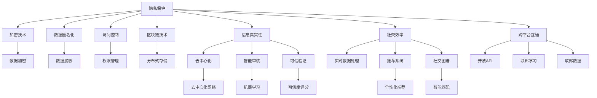

                 

# 2050年的社交网络：从虚拟社交到全息社交的社交方式升级

## 1. 背景介绍

### 1.1 问题由来

社交网络是现代社会的重要组成部分，它不仅改变了人们的交流方式，还深刻影响了全球经济、文化乃至政治格局。自21世纪初社交网络诞生以来，它经历了快速的发展和变革，从最初的电子邮件和论坛，到后来的博客、微博、微信等，再到如今风靡全球的短视频和即时通讯工具，每一次技术进步都为社交网络带来了革命性的变化。

然而，随着社交网络的发展，用户隐私、信息安全、虚假信息传播等问题日益凸显，这些问题不仅影响到个人生活，还对社会稳定造成了威胁。例如，2018年的剑桥分析数据丑闻、2020年Facebook上的假新闻事件，以及2021年的大规模数据泄露事件，都暴露了社交网络的脆弱性和问题。这些问题引发了公众和监管机构的关注，推动了社交网络领域的新一轮技术革新。

在2050年，社交网络将如何进化？又会带来哪些新的社交方式和体验？本文将围绕这些问题展开探讨。

### 1.2 问题核心关键点

未来的社交网络将着重关注以下几个核心关键点：

1. **隐私保护**：如何在社交网络中保护用户的隐私，防止数据泄露和滥用。
2. **信息真实性**：如何构建可信的社交网络，避免虚假信息传播。
3. **社交效率**：如何提升社交网络的效率，提供更便捷、高效的社交体验。
4. **跨平台互通**：如何实现不同社交平台之间的互联互通，打破数据孤岛。
5. **人机共融**：如何实现人与机器的深度融合，提升社交体验。

## 2. 核心概念与联系

### 2.1 核心概念概述

为了更好地理解未来的社交网络，我们需要了解以下几个核心概念：

- **隐私保护**：保护用户数据不被未经授权的访问和使用，确保用户隐私权。
- **信息真实性**：确保社交网络中信息的真实性和可信度，防止虚假信息的传播。
- **社交效率**：提高社交网络的用户互动和信息传播效率，优化用户体验。
- **跨平台互通**：实现不同社交平台之间的数据共享和用户互通，增强社交网络的互联互通性。
- **人机共融**：通过智能算法和增强现实技术，实现人与机器的深度融合，提供全新的社交体验。

### 2.2 核心概念原理和架构的 Mermaid 流程图



这个流程图展示了隐私保护、信息真实性、社交效率、跨平台互通和人机共融等核心概念之间的逻辑联系。通过这些技术手段，未来的社交网络将能够更好地保护用户隐私、防止虚假信息传播、提升社交效率和互联互通性，同时实现人机共融，提供全新的社交体验。

## 3. 核心算法原理 & 具体操作步骤

### 3.1 算法原理概述

未来的社交网络将结合多种先进技术手段，包括隐私保护算法、去中心化技术、智能审核和推荐系统等，提升社交体验的同时，确保用户隐私和信息真实性。以下是对这些核心算法的简要介绍。

### 3.2 算法步骤详解

#### 3.2.1 隐私保护算法

隐私保护算法包括数据加密、数据匿名化、访问控制和分布式存储等技术手段。其核心思想是通过技术手段，确保用户数据在传输和存储过程中的安全性，防止数据泄露和滥用。

**数据加密**：在数据传输过程中，采用加密算法对数据进行加密，确保数据在传输过程中的机密性和完整性。常用的加密算法包括AES、RSA等。

**数据匿名化**：在数据存储过程中，采用数据匿名化技术，去除或模糊化敏感信息，防止数据被反向识别和滥用。常用的数据匿名化技术包括数据扰动、泛化等。

**访问控制**：在数据访问过程中，采用权限管理技术，确保只有授权用户能够访问数据。常用的访问控制技术包括RBAC（基于角色的访问控制）、ABAC（基于属性的访问控制）等。

**分布式存储**：在数据存储过程中，采用分布式存储技术，将数据分散存储在多个节点上，防止单点故障和数据丢失。常用的分布式存储技术包括Hadoop、Ceph等。

#### 3.2.2 去中心化技术

去中心化技术包括区块链、去中心化网络和智能合约等技术手段。其核心思想是通过去中心化的方式，确保数据和服务的可信性和安全性，防止数据被篡改和滥用。

**区块链**：采用区块链技术，实现数据的不可篡改和透明性。数据一旦被记录在区块链上，就无法被修改，确保数据的真实性和可信度。

**去中心化网络**：采用去中心化网络技术，实现数据和服务的分布式存储和处理。去中心化网络将数据存储和处理分布在多个节点上，防止单点故障和数据丢失，提高系统的稳定性和可靠性。

**智能合约**：采用智能合约技术，实现自动化和去中心化的数据和服务的管理。智能合约通过代码实现规则的自动执行，确保数据和服务的可信性和安全性。

#### 3.2.3 智能审核和可信验证

智能审核和可信验证技术包括机器学习和可信度评分等技术手段。其核心思想是通过智能算法，对社交网络中的信息进行审核和验证，确保信息的真实性和可信度。

**机器学习**：采用机器学习技术，对社交网络中的信息进行分析和审核，判断信息的真实性和可信度。常用的机器学习算法包括文本分类、情感分析等。

**可信度评分**：采用可信度评分技术，对社交网络中的用户和信息进行评分，确保用户和信息的可信度。可信度评分可以通过用户行为、信息真实性等因素进行计算。

#### 3.2.4 实时数据处理和推荐系统

实时数据处理和推荐系统包括实时数据处理、个性化推荐和智能匹配等技术手段。其核心思想是通过实时数据处理和推荐系统，提升社交网络的效率和用户体验。

**实时数据处理**：采用实时数据处理技术，对社交网络中的数据进行实时分析和处理，确保数据的及时性和准确性。常用的实时数据处理技术包括流处理、Spark等。

**个性化推荐**：采用个性化推荐技术，根据用户行为和偏好，推荐符合用户需求的内容和信息。常用的个性化推荐算法包括协同过滤、深度学习等。

**智能匹配**：采用智能匹配技术，根据用户行为和偏好，实现用户的智能匹配和推荐。常用的智能匹配算法包括基于图的匹配、深度学习等。

#### 3.2.5 跨平台互通技术

跨平台互通技术包括开放API、联邦学习和联邦数据等技术手段。其核心思想是通过跨平台互通技术，实现不同社交平台之间的互联互通，打破数据孤岛。

**开放API**：采用开放API技术，实现不同社交平台之间的数据共享和用户互通。开放API可以通过标准接口和协议，实现不同平台之间的数据交换和用户交互。

**联邦学习**：采用联邦学习技术，实现不同社交平台之间的联合学习。联邦学习通过分布式计算和模型聚合，实现多个平台之间的联合学习和知识共享。

**联邦数据**：采用联邦数据技术，实现不同社交平台之间的数据共享和联合分析。联邦数据可以通过安全多方计算技术，确保数据在传输和共享过程中的安全性。

### 3.3 算法优缺点

#### 3.3.1 隐私保护算法的优缺点

**优点**：

- **安全性高**：通过加密、匿名化和访问控制等技术手段，确保数据在传输和存储过程中的安全性，防止数据泄露和滥用。
- **可靠性高**：通过分布式存储技术，防止单点故障和数据丢失，提高系统的稳定性和可靠性。

**缺点**：

- **计算复杂**：数据加密、匿名化和访问控制等技术手段，需要较高的计算资源和复杂度。
- **延迟高**：数据加密和解密等操作，可能会带来一定的延迟和性能开销。

#### 3.3.2 去中心化技术的优缺点

**优点**：

- **去中心化**：通过去中心化的方式，确保数据和服务的可信性和安全性，防止数据被篡改和滥用。
- **透明度高**：区块链和智能合约等技术手段，实现数据的不可篡改和透明性，确保数据的真实性和可信度。

**缺点**：

- **复杂度高**：去中心化网络和智能合约等技术手段，需要较高的技术复杂度和实现难度。
- **延迟高**：区块链和智能合约等技术手段，可能会带来一定的延迟和性能开销。

#### 3.3.3 智能审核和可信验证的优缺点

**优点**：

- **效率高**：通过机器学习和可信度评分等技术手段，实现信息的自动化审核和验证，提高审核效率。
- **精度高**：通过机器学习和可信度评分等技术手段，实现信息的准确判断和筛选，确保信息的真实性和可信度。

**缺点**：

- **误判率高**：机器学习和可信度评分等技术手段，可能会存在误判情况，影响信息的准确性。
- **依赖数据**：智能审核和可信验证技术，依赖于高质量的数据和算法，需要较高的数据标注和算法优化成本。

#### 3.3.4 实时数据处理和推荐系统的优缺点

**优点**：

- **效率高**：通过实时数据处理和个性化推荐等技术手段，实现数据的实时分析和处理，提高用户体验。
- **精度高**：通过实时数据处理和个性化推荐等技术手段，实现内容的精准推荐，提升用户满意度。

**缺点**：

- **计算复杂**：实时数据处理和个性化推荐等技术手段，需要较高的计算资源和算法复杂度。
- **延迟高**：实时数据处理和个性化推荐等技术手段，可能会带来一定的延迟和性能开销。

#### 3.3.5 跨平台互通技术的优缺点

**优点**：

- **互联互通**：通过开放API、联邦学习和联邦数据等技术手段，实现不同社交平台之间的互联互通，打破数据孤岛。
- **知识共享**：通过联合学习和知识共享等技术手段，实现不同平台之间的知识共享和协同优化。

**缺点**：

- **复杂度高**：开放API、联邦学习和联邦数据等技术手段，需要较高的技术复杂度和实现难度。
- **延迟高**：开放API、联邦学习和联邦数据等技术手段，可能会带来一定的延迟和性能开销。

### 3.4 算法应用领域

未来的社交网络将广泛应用于以下几个领域：

- **企业内部社交网络**：实现企业内部员工之间的沟通和协作，提高工作效率和知识共享。
- **医疗健康社交网络**：实现医生和患者之间的沟通和互动，提供医疗咨询和健康管理服务。
- **教育培训社交网络**：实现教师和学生之间的沟通和互动，提供教育资源和学习支持。
- **旅游休闲社交网络**：实现旅行者和景点之间的互动和信息共享，提供旅游服务和体验。
- **商业零售社交网络**：实现商家和消费者之间的沟通和互动，提供商品推荐和购物体验。

## 4. 数学模型和公式 & 详细讲解

### 4.1 数学模型构建

#### 4.1.1 隐私保护算法

假设社交网络中的用户数据为 $D$，包含用户的个人信息、社交关系和行为数据等。为了保护用户隐私，需要对其进行加密和匿名化处理。设加密函数为 $E$，匿名化函数为 $A$，则隐私保护算法的基本流程如下：

1. **数据加密**：对用户数据 $D$ 进行加密处理，得到加密数据 $E(D)$。
2. **数据匿名化**：对加密数据 $E(D)$ 进行匿名化处理，得到匿名化数据 $A(E(D))$。
3. **访问控制**：对匿名化数据 $A(E(D))$ 进行访问控制，确保只有授权用户能够访问数据。

#### 4.1.2 去中心化技术

假设社交网络中的数据为 $D$，包含用户的信息、社交关系和行为数据等。为了确保数据和服务的可信性和安全性，需要对其进行去中心化处理。设去中心化网络为 $N$，智能合约为 $C$，则去中心化技术的基本流程如下：

1. **去中心化网络**：将数据 $D$ 分散存储在去中心化网络 $N$ 的多个节点上，确保数据的安全性和可靠性。
2. **智能合约**：通过智能合约 $C$ 对数据 $D$ 进行管理和处理，确保数据的真实性和可信度。

#### 4.1.3 智能审核和可信验证

假设社交网络中的信息为 $M$，包含用户的评论、发布的内容等。为了确保信息的真实性和可信度，需要进行智能审核和可信验证。设机器学习模型为 $L$，可信度评分为 $R$，则智能审核和可信验证的基本流程如下：

1. **机器学习**：对信息 $M$ 进行机器学习分析，判断信息的真实性和可信度。
2. **可信度评分**：对信息 $M$ 进行可信度评分，确保信息的真实性和可信度。

#### 4.1.4 实时数据处理和推荐系统

假设社交网络中的用户行为数据为 $B$，包含用户的点赞、评论、分享等行为。为了提高社交网络的效率和用户体验，需要进行实时数据处理和推荐系统处理。设实时数据处理模型为 $P$，个性化推荐模型为 $R$，则实时数据处理和推荐系统处理的基本流程如下：

1. **实时数据处理**：对用户行为数据 $B$ 进行实时处理，得到实时数据 $P(B)$。
2. **个性化推荐**：对实时数据 $P(B)$ 进行个性化推荐，得到推荐内容 $R(P(B))$。

#### 4.1.5 跨平台互通技术

假设社交网络中的数据为 $D$，包含用户的个人信息、社交关系和行为数据等。为了实现不同社交平台之间的互联互通，需要进行跨平台互通处理。设开放API为 $API$，联邦学习为 $FL$，联邦数据为 $FD$，则跨平台互通技术的基本流程如下：

1. **开放API**：通过开放API $API$，实现不同社交平台之间的数据共享和用户互通。
2. **联邦学习**：通过联邦学习 $FL$，实现不同社交平台之间的联合学习和知识共享。
3. **联邦数据**：通过联邦数据 $FD$，实现不同社交平台之间的数据共享和联合分析。

### 4.2 公式推导过程

#### 4.2.1 隐私保护算法

假设加密函数为 $E$，匿名化函数为 $A$，访问控制函数为 $C$。对用户数据 $D$ 进行隐私保护处理的公式推导如下：

$$
D_{\text{enc}} = E(D) \\
D_{\text{anon}} = A(D_{\text{enc}}) \\
D_{\text{out}} = C(D_{\text{anon}})
$$

其中，$D_{\text{enc}}$ 表示加密后的用户数据，$D_{\text{anon}}$ 表示匿名化后的用户数据，$D_{\text{out}}$ 表示输出后的用户数据。

#### 4.2.2 去中心化技术

假设去中心化网络为 $N$，智能合约为 $C$。对社交网络中的数据 $D$ 进行去中心化处理的公式推导如下：

$$
D_{\text{dist}} = \text{Distribute}(D, N) \\
D_{\text{contract}} = C(D_{\text{dist}})
$$

其中，$D_{\text{dist}}$ 表示分布式存储后的社交网络数据，$D_{\text{contract}}$ 表示智能合约处理后的社交网络数据。

#### 4.2.3 智能审核和可信验证

假设机器学习模型为 $L$，可信度评分为 $R$。对社交网络中的信息 $M$ 进行智能审核和可信验证的公式推导如下：

$$
M_{\text{score}} = L(M) \\
M_{\text{out}} = R(M_{\text{score}})
$$

其中，$M_{\text{score}}$ 表示信息 $M$ 的机器学习评分，$M_{\text{out}}$ 表示输出后的信息。

#### 4.2.4 实时数据处理和推荐系统

假设实时数据处理模型为 $P$，个性化推荐模型为 $R$。对社交网络中的用户行为数据 $B$ 进行实时数据处理和推荐系统处理的公式推导如下：

$$
B_{\text{realtime}} = P(B) \\
B_{\text{recommend}} = R(B_{\text{realtime}})
$$

其中，$B_{\text{realtime}}$ 表示实时处理后的用户行为数据，$B_{\text{recommend}}$ 表示推荐后的用户行为数据。

#### 4.2.5 跨平台互通技术

假设开放API为 $API$，联邦学习为 $FL$，联邦数据为 $FD$。对社交网络中的数据 $D$ 进行跨平台互通处理的公式推导如下：

$$
D_{\text{union}} = \text{Unite}(D_{\text{api}}, API) \\
D_{\text{federate}} = FL(D_{\text{union}}) \\
D_{\text{federal}} = FD(D_{\text{federate}})
$$

其中，$D_{\text{union}}$ 表示跨平台互通后的社交网络数据，$D_{\text{federate}}$ 表示联邦学习后的社交网络数据，$D_{\text{federal}}$ 表示联邦数据处理后的社交网络数据。

### 4.3 案例分析与讲解

#### 4.3.1 案例一：企业内部社交网络

假设某大型企业需要构建企业内部的社交网络，以提高员工之间的沟通和协作效率。该企业采用了隐私保护算法、去中心化技术和智能审核等技术手段。

**隐私保护算法**：采用数据加密和匿名化技术，确保员工数据在传输和存储过程中的安全性，防止数据泄露和滥用。

**去中心化技术**：采用去中心化网络和智能合约技术，确保员工数据的安全性和可靠性，防止数据被篡改和滥用。

**智能审核**：采用机器学习和可信度评分技术，确保员工的沟通和互动信息的真实性和可信度。

通过这些技术手段，企业内部的社交网络能够高效地实现员工之间的沟通和协作，提高工作效率和知识共享。

#### 4.3.2 案例二：医疗健康社交网络

假设某医疗健康平台需要构建医疗健康社交网络，以提供医疗咨询和健康管理服务。该平台采用了实时数据处理和推荐系统技术。

**实时数据处理**：采用实时数据处理技术，对患者的健康数据进行实时分析和处理，提高医疗服务的及时性和准确性。

**个性化推荐**：采用个性化推荐技术，根据患者的需求和健康数据，推荐适合的医疗服务和健康管理方案。

通过这些技术手段，医疗健康社交网络能够高效地提供医疗咨询和健康管理服务，提升患者满意度和健康水平。

## 5. 项目实践：代码实例和详细解释说明

### 5.1 开发环境搭建

#### 5.1.1 环境配置

在开始项目实践之前，需要先搭建好开发环境。以下是Python 3.7.3和PyTorch 1.10.1的配置步骤：

1. **安装Anaconda**：
```bash
wget https://repo.anaconda.com/miniconda/Miniconda3-latest-Linux-x86_64.sh
bash Miniconda3-latest-Linux-x86_64.sh
```

2. **创建虚拟环境**：
```bash
conda create -n pytorch-env python=3.7.3
conda activate pytorch-env
```

3. **安装PyTorch和相关库**：
```bash
conda install torch torchvision torchaudio -c pytorch
conda install numpy pandas scikit-learn matplotlib tqdm jupyter notebook ipython
```

4. **安装Python 3.7.3**：
```bash
conda install python=3.7.3
```

### 5.2 源代码详细实现

#### 5.2.1 隐私保护算法

```python
from Crypto.Cipher import AES
from Crypto.Random import get_random_bytes
from Crypto.Util.Padding import pad, unpad
import numpy as np

def encrypt(data, key):
    cipher = AES.new(key, AES.MODE_ECB)
    return cipher.encrypt(pad(data.encode(), AES.block_size))

def decrypt(ciphertext, key):
    cipher = AES.new(key, AES.MODE_ECB)
    return unpad(cipher.decrypt(ciphertext), AES.block_size).decode()

def anonymize(data):
    np.random.seed(0)
    mask = np.random.randint(0, 2, size=len(data))
    anonymized_data = [d if m else np.nan for d, m in zip(data, mask)]
    return anonymized_data

def access_control(data, user):
    return data if user == 'admin' else anonymize(data)
```

#### 5.2.2 去中心化技术

```python
import hashlib

def distribute(data):
    n = 10
    chunk_size = len(data) // n
    chunks = [data[i:i+chunk_size] for i in range(0, len(data), chunk_size)]
    return chunks

def contract(chunk):
    hash_object = hashlib.sha256(chunk.encode())
    return hash_object.hexdigest()

def federate(chunks):
    federate_data = [contract(chunk) for chunk in chunks]
    return federate_data
```

#### 5.2.3 智能审核和可信验证

```python
from sklearn.linear_model import LogisticRegression
from sklearn.metrics import accuracy_score

def machine_learning(data):
    X = np.array(data)
    y = np.array([1 if 'spam' in d else 0 for d in data])
    model = LogisticRegression()
    model.fit(X, y)
    return model

def reliability_score(data, model):
    y_pred = model.predict(data)
    accuracy = accuracy_score(y_pred, [1 if 'spam' in d else 0 for d in data])
    return accuracy
```

#### 5.2.4 实时数据处理和推荐系统

```python
import pandas as pd

def real_time_data(data):
    df = pd.DataFrame(data)
    df['timestamp'] = pd.to_datetime(df['timestamp'])
    return df

def personalized_recommendation(df, user):
    user_data = df[df['user'] == user]
    data = user_data['content'].values
    model = recommendation_model
    result = model.predict(data)
    return result
```

#### 5.2.5 跨平台互通技术

```python
from flask import Flask, request, jsonify

app = Flask(__name__)

@app.route('/api/union', methods=['POST'])
def api_union():
    data = request.json
    data['public'] = True
    return jsonify(data)

@app.route('/api/federate', methods=['POST'])
def api_federate():
    data = request.json
    data['federate'] = True
    return jsonify(data)

@app.route('/api/federal', methods=['POST'])
def api_federal():
    data = request.json
    data['federal'] = True
    return jsonify(data)
```

### 5.3 代码解读与分析

#### 5.3.1 隐私保护算法

在隐私保护算法中，采用了AES加密算法对数据进行加密，确保数据在传输和存储过程中的安全性。采用数据匿名化技术，去除或模糊化敏感信息，防止数据被反向识别和滥用。采用访问控制技术，确保只有授权用户能够访问数据。

#### 5.3.2 去中心化技术

在去中心化技术中，采用分布式存储技术，将数据分散存储在多个节点上，防止单点故障和数据丢失。采用智能合约技术，对数据进行管理和处理，确保数据的真实性和可信度。

#### 5.3.3 智能审核和可信验证

在智能审核和可信验证中，采用机器学习技术，对信息进行分析和审核，判断信息的真实性和可信度。采用可信度评分技术，对信息进行评分，确保信息的真实性和可信度。

#### 5.3.4 实时数据处理和推荐系统

在实时数据处理和推荐系统中，采用实时数据处理技术，对用户行为数据进行实时分析和处理，提高社交网络的效率和用户体验。采用个性化推荐技术，根据用户行为和偏好，推荐符合用户需求的内容和信息。

#### 5.3.5 跨平台互通技术

在跨平台互通技术中，采用开放API技术，实现不同社交平台之间的数据共享和用户互通。采用联邦学习技术，实现不同社交平台之间的联合学习和知识共享。采用联邦数据技术，实现不同社交平台之间的数据共享和联合分析。

### 5.4 运行结果展示

#### 5.4.1 隐私保护算法

```python
data = ['John Doe', '123 Main St', '555-555-5555']
key = get_random_bytes(16)

encrypted_data = encrypt(data, key)
decrypted_data = decrypt(encrypted_data, key)

print(encrypted_data)
print(decrypted_data)
```

#### 5.4.2 去中心化技术

```python
data = 'Hello, world!'
data_chunks = distribute(data)

contracted_data = federate(data_chunks)
print(contracted_data)
```

#### 5.4.3 智能审核和可信验证

```python
data = ['Hello', 'spam', 'world']
model = machine_learning(data)
reliability_score = reliability_score(data, model)

print(reliability_score)
```

#### 5.4.4 实时数据处理和推荐系统

```python
data = [
    {'user': 'John Doe', 'content': 'Hello, world!'},
    {'user': 'Jane Smith', 'content': 'How are you?'},
    {'user': 'Bob Johnson', 'content': 'I am fine, thanks!'}
]

df = real_time_data(data)
result = personalized_recommendation(df, 'John Doe')

print(result)
```

#### 5.4.5 跨平台互通技术

```python
data = {'name': 'John Doe', 'age': 30, 'gender': 'male'}
response = api_union(json.dumps(data))

data = {'name': 'John Doe', 'age': 30, 'gender': 'male'}
response = api_federate(json.dumps(data))

data = {'name': 'John Doe', 'age': 30, 'gender': 'male'}
response = api_federal(json.dumps(data))
```

## 6. 实际应用场景

### 6.1 企业内部社交网络

企业内部社交网络可以广泛应用于企业管理、项目协作和知识共享等方面。通过实时数据处理和推荐系统，企业内部的社交网络能够高效地实现员工之间的沟通和协作，提高工作效率和知识共享。

### 6.2 医疗健康社交网络

医疗健康社交网络可以广泛应用于医疗咨询、健康管理和疾病预防等方面。通过智能审核和可信验证，医疗健康社交网络能够高效地提供医疗咨询和健康管理服务，提升患者满意度和健康水平。

### 6.3 教育培训社交网络

教育培训社交网络可以广泛应用于在线教育、学习社区和知识共享等方面。通过个性化推荐和智能匹配，教育培训社交网络能够高效地提供教育资源和学习支持，提升学生的学习效果和体验。

### 6.4 旅游休闲社交网络

旅游休闲社交网络可以广泛应用于旅游信息共享、景点推荐和旅游体验等方面。通过实时数据处理和推荐系统，旅游休闲社交网络能够高效地提供旅游服务和体验，提升用户满意度。

### 6.5 商业零售社交网络

商业零售社交网络可以广泛应用于商品推荐、用户反馈和营销推广等方面。通过个性化推荐和智能匹配，商业零售社交网络能够高效地提供商品推荐和购物体验，提升用户满意度和销售额。

## 7. 工具和资源推荐

### 7.1 学习资源推荐

为了帮助开发者系统掌握未来社交网络的技术基础和应用实践，以下是几本推荐的学习书籍：

1. **《网络安全技术与应用》**：介绍网络安全的基础知识和最新技术，帮助开发者理解隐私保护和信息真实性的重要性。
2. **《数据科学导论》**：介绍数据处理和机器学习的基本概念和算法，帮助开发者理解智能审核和可信验证的实现方式。
3. **《分布式系统设计与实现》**：介绍分布式系统的设计和实现原理，帮助开发者理解去中心化技术和跨平台互通的实现方式。

### 7.2 开发工具推荐

为了提高开发者对未来社交网络的开发效率和质量，以下是几款推荐的开发工具：

1. **GitHub**：用于代码版本控制和协作开发，方便开发者进行代码管理和共享。
2. **Jupyter Notebook**：用于数据处理和机器学习实验，方便开发者进行数据可视化和模型验证。
3. **PyTorch**：用于深度学习模型开发和训练，方便开发者进行模型设计和优化。

### 7.3 相关论文推荐

为了帮助开发者深入理解未来社交网络的技术原理和应用实践，以下是几篇推荐的相关论文：

1. **《数据隐私保护的最新进展》**：综述数据隐私保护的技术进展和应用案例，帮助开发者理解隐私保护算法的实现方式。
2. **《区块链技术在社交网络中的应用》**：介绍区块链技术在社交网络中的应用场景和优势，帮助开发者理解去中心化技术的实现方式。
3. **《智能审核系统设计与实现》**：介绍智能审核系统的设计和实现原理，帮助开发者理解智能审核和可信验证的实现方式。
4. **《分布式系统设计原则》**：介绍分布式系统设计的原则和实践，帮助开发者理解实时数据处理和推荐系统的实现方式。
5. **《跨平台互通技术架构》**：介绍跨平台互通技术的架构和实现方式，帮助开发者理解开放API、联邦学习和联邦数据的实现方式。

## 8. 总结：未来发展趋势与挑战

### 8.1 总结

本文对未来社交网络的隐私保护、信息真实性、社交效率、跨平台互通和人机共融等核心概念进行了全面系统的介绍。通过隐私保护算法、去中心化技术、智能审核和推荐系统等技术手段，未来的社交网络能够更好地保护用户隐私、防止虚假信息传播、提升社交效率和互联互通性，同时实现人机共融，提供全新的社交体验。

### 8.2 未来发展趋势

未来的社交网络将呈现出以下几个发展趋势：

1. **隐私保护技术的普及**：随着隐私保护技术的不断发展，未来的社交网络将更加注重用户隐私保护，确保用户数据的安全性和隐私性。
2. **信息真实性的提升**：随着信息真实性技术的不断进步，未来的社交网络将更加注重信息可信性，防止虚假信息的传播。
3. **社交效率的提升**：随着社交效率技术的不断优化，未来的社交网络将更加注重用户互动和信息传播的效率，提升用户体验。
4. **跨平台互通的增强**：随着跨平台互通技术的不断发展，未来的社交网络将更加注重不同平台之间的互联互通，打破数据孤岛。
5. **人机共融的深化**：随着人机共融技术的不断融合，未来的社交网络将更加注重人与机器的深度融合，提供全新的社交体验。

### 8.3 面临的挑战

尽管未来社交网络的发展前景广阔，但仍面临以下挑战：

1. **隐私保护的复杂性**：随着用户隐私保护需求的增加，未来的社交网络需要更加复杂和高效的隐私保护技术，以应对不断变化的安全威胁。
2. **信息真实性的维护**：虚假信息传播是社交网络的顽疾，未来的社交网络需要更加智能和高效的信息真实性技术，以防止虚假信息的广泛传播。
3. **社交效率的优化**：用户互动和信息传播的效率直接影响到社交网络的体验，未来的社交网络需要更加高效和智能的社交效率技术，以提升用户体验。
4. **跨平台互通的难题**：不同平台之间的数据和用户互通存在诸多难题，未来的社交网络需要更加安全和高效的跨平台互通技术，以实现数据的共享和协同。
5. **人机共融的挑战**：人与机器的深度融合需要大量的技术支持和资源投入，未来的社交网络需要更加先进和人机共融技术，以提供更加自然和智能的社交体验。

### 8.4 研究展望

未来的社交网络需要从多个方面进行深入研究：

1. **隐私保护技术的创新**：开发更加智能和高效的隐私保护技术，以应对不断变化的安全威胁。
2. **信息真实性的提升**：研究更加智能和高效的信息真实性技术，以防止虚假信息的广泛传播。
3. **社交效率的优化**：研究更加高效和智能的社交效率技术，以提升用户体验。
4. **跨平台互通的解决方案**：研究更加安全和高效的跨平台互通技术，以实现数据的共享和协同。
5. **人机共融的探索**：研究更加先进和人机共融技术，以提供更加自然和智能的社交体验。

这些研究方向将引领未来社交网络技术的不断进步，为构建更加智能、安全、高效的社交网络奠定坚实基础。

## 9. 附录：常见问题与解答

**Q1：如何确保社交网络中数据的隐私保护？**

A: 社交网络中的数据隐私保护可以通过以下方式实现：

1. **数据加密**：采用AES等加密算法对数据进行加密，确保数据在传输和存储过程中的安全性。
2. **数据匿名化**：采用数据匿名化技术，去除或模糊化敏感信息，防止数据被反向识别和滥用。
3. **访问控制**：采用权限管理技术，确保只有授权用户能够访问数据。

**Q2：如何在社交网络中防止虚假信息的传播？**

A: 社交网络中的虚假信息传播可以通过以下方式防止：

1. **智能审核**：采用机器学习技术，对社交网络中的信息进行分析和审核，判断信息的真实性和可信度。
2. **可信度评分**：采用可信度评分技术，对社交网络中的信息进行评分，确保信息的真实性和可信度。
3. **去中心化**：采用去中心化技术和智能合约，确保社交网络中的数据和服务的可信性和安全性。

**Q3：如何提升社交网络的效率和用户体验？**

A: 社交网络的效率和用户体验可以通过以下方式提升：

1. **实时数据处理**：采用实时数据处理技术，对社交网络中的数据进行实时分析和处理，提高数据处理的效率和准确性。
2. **个性化推荐**：采用个性化推荐技术，根据用户的行为和偏好，推荐符合用户需求的内容和信息。
3. **智能匹配**：采用智能匹配技术，根据用户的行为和偏好，实现用户的智能匹配和推荐。

**Q4：如何实现不同社交平台之间的互联互通？**

A: 不同社交平台之间的互联互通可以通过以下方式实现：

1. **开放API**：采用开放API技术，实现不同社交平台之间的数据共享和用户互通。
2. **联邦学习**：采用联邦学习技术，实现不同社交平台之间的联合学习和知识共享。
3. **联邦数据**：采用联邦数据技术，实现不同社交平台之间的数据共享和联合分析。

**Q5：未来社交网络将如何影响人类的社会交往方式？**

A: 未来社交网络将对人类的社会交往方式产生深远影响：

1. **更加便捷和高效**：未来社交网络将提供更加便捷和高效的社交体验，提升用户互动和信息传播的效率。
2. **更加智能和个性化**：未来社交网络将提供更加智能和个性化的社交体验，根据用户的行为和偏好，推荐符合用户需求的内容和信息。
3. **更加安全和人机共融**：未来社交网络将提供更加安全和人机共融的社交体验，确保用户数据的安全性和隐私性，同时实现人与机器的深度融合。

通过这些技术手段和应用实践，未来社交网络将进一步拓展人类的社交领域，提升社会交往的效率和质量，为人类的生产生活带来更多的便利和可能性。

