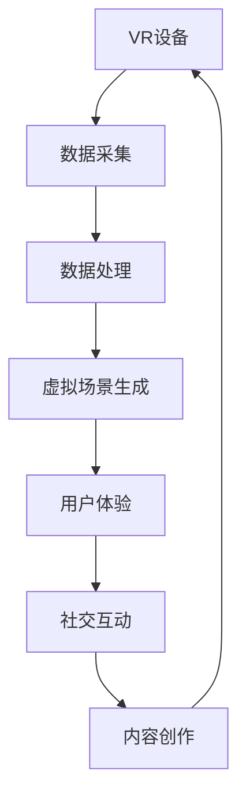

                 

# 2050年的虚拟现实：从虚拟旅游到虚拟社交的虚拟世界构建

> 关键词：虚拟现实(VR), 虚拟旅游(Virtual Tourism), 虚拟社交(Virtual Social), 虚拟世界(Virtual World), 沉浸式体验(Immersive Experience)

## 1. 背景介绍

### 1.1 问题由来

进入21世纪以来，虚拟现实技术（Virtual Reality, VR）在全球范围内迅速发展，成为引领下一波科技革命的重要技术之一。虚拟现实通过创建完全沉浸的视觉、听觉和触觉体验，使用户能够与虚拟世界进行互动，其应用范围从游戏、娱乐到医疗、教育等领域不断拓展。

然而，当前虚拟现实技术的体验仍存在诸多不足，如硬件设备的普及性、内容的多样性和沉浸感等方面。未来如何进一步提升虚拟现实的用户体验，拓展其应用场景，成为科技工作者不断探索的方向。

### 1.2 问题核心关键点

未来2050年的虚拟现实将如何发展？本文聚焦于虚拟旅游和虚拟社交领域的构建，探讨以下几个核心问题：

- 如何通过虚拟现实技术打造沉浸式的旅游体验，让用户足不出户即可畅游世界各地？
- 虚拟社交将如何改变人与人之间的交互方式，提升社交体验的丰富性和多样性？
- 虚拟世界如何融合多模态信息，形成更加综合的沉浸式体验？
- 如何平衡虚拟世界与现实世界的融合，实现虚拟现实的商业化和社会化应用？

这些问题涉及VR技术的创新、内容创作、用户体验和商业模式等多个层面，是未来虚拟现实发展的关键方向。

### 1.3 问题研究意义

研究虚拟现实从虚拟旅游到虚拟社交的构建，具有重要的理论和实践意义：

- 提升用户体验。通过虚拟现实技术，为用户提供更加真实、丰富的沉浸式体验，满足其对虚拟世界的探索欲望。
- 开拓新应用场景。拓展虚拟现实在旅游、教育、医疗、社交等多个领域的商业化应用，推动相关产业的数字化转型。
- 促进技术创新。通过虚拟世界构建的实践，推动VR技术的进一步发展，提升其硬件性能和内容创作能力。
- 增强社会互动。构建虚拟社交平台，促进远程交流和互动，为疫情常态化等特殊环境下的社会交往提供新方式。
- 驱动经济增长。推动虚拟旅游、虚拟娱乐等新兴市场的形成，为经济发展注入新动能。

## 2. 核心概念与联系

### 2.1 核心概念概述

为更好地理解未来虚拟现实的构建，本节将介绍几个密切相关的核心概念：

- **虚拟现实(VR)**：通过计算机生成虚拟环境，使用户能够与虚拟世界进行交互的体验。常见的VR设备包括头戴式显示器、手柄等。
- **虚拟旅游(Virtual Tourism)**：利用虚拟现实技术，构建虚拟旅游场景，让用户能够以第一人称视角游览全球名胜古迹，体验不同地域的风土人情。
- **虚拟社交(Virtual Social)**：基于虚拟现实技术，构建虚拟社交平台，支持用户进行远程互动和交流，弥补现实生活中的社交不足。
- **虚拟世界(Virtual World)**：通过虚拟现实技术构建的虚拟空间，用户可以在其中自由探索、交流、购物和娱乐。
- **沉浸式体验(Immersive Experience)**：通过多感官刺激，使用户完全沉浸于虚拟世界中，难以区分虚拟与现实。

这些核心概念之间存在密切联系，共同构成了虚拟现实的技术框架和应用场景。

### 2.2 核心概念原理和架构的 Mermaid 流程图



这个流程图展示了虚拟现实从设备采集数据到最终用户体验的完整流程：

1. **数据采集**：VR设备收集用户的动作、位置等数据。
2. **数据处理**：数据通过计算机进行处理，生成虚拟场景。
3. **虚拟场景生成**：根据处理后的数据，生成虚拟环境。
4. **用户体验**：用户通过VR设备与虚拟环境互动。
5. **社交互动**：用户可以与其他人进行互动和交流。
6. **内容创作**：内容创作者制作和上传虚拟内容，丰富虚拟世界。

## 3. 核心算法原理 & 具体操作步骤

### 3.1 算法原理概述

未来虚拟现实的构建，需要结合计算机图形学、人工智能、人机交互等多个领域的核心技术。本文聚焦于虚拟旅游和虚拟社交的构建，简要介绍其中的关键算法和原理。

- **虚拟旅游**：通过生成视觉、听觉、触觉等多模态信息，构建沉浸式旅游体验。涉及的关键算法包括三维建模、物理模拟、用户交互等。
- **虚拟社交**：通过构建虚拟社交平台，实现远程互动和交流。涉及的关键算法包括自然语言处理、情感计算、机器人控制等。

### 3.2 算法步骤详解

#### 3.2.1 虚拟旅游

**步骤1：三维建模与纹理贴图**
- 收集目的地的高精度地图、地形数据和照片等素材。
- 使用计算机生成三维模型，包括地形、建筑、景点等。
- 将真实照片映射到三维模型上，进行纹理贴图。

**步骤2：物理模拟与环境渲染**
- 使用物理引擎模拟光源、阴影、反射等效果，提升场景真实感。
- 应用高级渲染技术，如全局光照、实时阴影、动态模糊等，优化视觉效果。

**步骤3：用户交互与引导**
- 使用虚拟手柄、手势识别等技术，实现用户与虚拟环境的操作。
- 提供多视角自由漫游、场景快照等功能，提升用户体验。

**步骤4：动态内容生成**
- 通过自然语言处理技术，解析用户的指令和偏好。
- 动态生成景点介绍、地图导航、推荐路线等内容，增加交互性和趣味性。

**步骤5：多模态反馈**
- 结合视觉、听觉、触觉等多感官反馈，提升沉浸感。
- 通过震动反馈、风力模拟等技术，增强用户的代入感。

#### 3.2.2 虚拟社交

**步骤1：自然语言处理**
- 收集用户的语音、文字输入，进行语音识别、分词、语义理解等处理。
- 使用生成对抗网络(GAN)生成对话内容和表情，提升自然度。

**步骤2：情感计算**
- 分析用户的语音语调、面部表情、身体语言等信息，进行情感识别和分析。
- 通过情感反馈机制，调节虚拟角色的情感表现，增强社交互动的情感共鸣。

**步骤3：机器人控制**
- 使用深度强化学习算法，训练虚拟社交机器人的行为策略。
- 实现多角色交互、多话题讨论等功能，提升社交体验的丰富性。

**步骤4：虚拟社交场景构建**
- 创建虚拟社交空间，包括聊天室、会议室、游戏厅等。
- 通过多用户场景渲染，实现实时互动和协作。

**步骤5：隐私保护与安全**
- 设计隐私保护机制，保障用户的个人信息安全。
- 应用安全协议，防止非法入侵和恶意攻击。

### 3.3 算法优缺点

#### 3.3.1 虚拟旅游

**优点：**
- 提供沉浸式体验，让用户足不出户即可游览全球。
- 动态内容生成和多模态反馈，提升用户体验的丰富性和趣味性。
- 适用于教育和医疗等特殊场景，弥补现实环境的局限。

**缺点：**
- 对硬件设备和计算资源要求较高，普及难度大。
- 内容创作成本高，需要大量专业技术人员。
- 技术迭代速度快，内容更新不够及时。

#### 3.3.2 虚拟社交

**优点：**
- 打破时间和空间的限制，实现跨地域的社交互动。
- 多模态交互和自然语言处理，提升社交体验的情感共鸣。
- 适用于特殊环境下的社交需求，如疫情常态化等。

**缺点：**
- 技术复杂度较高，实现难度大。
- 隐私保护和安全问题，用户数据易被滥用。
- 技术伦理和法律规范，需进一步明确和完善。

### 3.4 算法应用领域

#### 3.4.1 虚拟旅游

- **教育领域**：虚拟旅游可用于历史教学、地理科普等，帮助学生直观理解地理知识和历史文化。
- **医疗领域**：患者可以通过虚拟旅游缓解病痛，放松心情，提高治疗效果。
- **商业领域**：虚拟旅游可作为旅游宣传和推广的工具，吸引更多游客。
- **娱乐领域**：提供沉浸式游戏体验和虚拟冒险，吸引大量用户参与。

#### 3.4.2 虚拟社交

- **远程工作**：支持远程会议、协作等功能，提高团队效率。
- **教育培训**：提供在线课堂、虚拟实验室等，丰富教学方式。
- **文化交流**：促进不同文化背景的人进行交流和互动，增进了解。
- **娱乐休闲**：提供虚拟游戏、社交聚会等娱乐活动，丰富用户社交生活。

## 4. 数学模型和公式 & 详细讲解 & 举例说明

### 4.1 数学模型构建

#### 4.1.1 虚拟旅游

**模型1：三维建模与纹理贴图**

$$
S = \{(x, y, z) | \text{三维坐标} \} \\
N = \{(i, j, k) | \text{纹理坐标} \}
$$

其中 $S$ 表示三维模型空间，$N$ 表示纹理坐标空间。

**模型2：物理模拟与环境渲染**

$$
I(x, y, z) = \int_{S} L(x, y, z) f(x, y, z) \, dS
$$

其中 $I(x, y, z)$ 表示场景中点 $(x, y, z)$ 的光照强度，$L(x, y, z)$ 表示光源的光强，$f(x, y, z)$ 表示表面反射率。

**模型3：用户交互与引导**

$$
A(t) = A_0 + \sum_{i=1}^n v_i(t)
$$

其中 $A(t)$ 表示用户的位置，$A_0$ 表示初始位置，$v_i(t)$ 表示用户在第 $i$ 个时刻的运动速度。

**模型4：动态内容生成**

$$
D(\text{指令}) = C_1(\text{指令}, C_2)
$$

其中 $D(\text{指令})$ 表示根据用户指令生成的动态内容，$C_1(\text{指令}, C_2)$ 表示将指令映射为内容的生成函数。

**模型5：多模态反馈**

$$
F(x, y, z) = F_{\text{视觉}}(x, y, z) + F_{\text{听觉}}(x, y, z) + F_{\text{触觉}}(x, y, z)
$$

其中 $F(x, y, z)$ 表示多模态反馈的综合效果，$F_{\text{视觉}}$、$F_{\text{听觉}}$、$F_{\text{触觉}}$ 分别表示视觉、听觉、触觉反馈的具体效果。

#### 4.1.2 虚拟社交

**模型1：自然语言处理**

$$
P_{\text{识别}}(\text{语音}) = \text{语音} \rightarrow \text{文本}
$$

其中 $P_{\text{识别}}(\text{语音})$ 表示语音识别模型，$\text{语音}$ 表示用户输入的语音，$\text{文本}$ 表示识别出的文本。

**模型2：情感计算**

$$
E(\text{情感}) = \sum_{i=1}^n f_i(\text{语音}, \text{面部}, \text{身体})
$$

其中 $E(\text{情感})$ 表示用户情感的计算结果，$f_i$ 表示第 $i$ 个特征的情感计算函数，$\text{语音}$、$\text{面部}$、$\text{身体}$ 分别表示用户的语音、面部表情、身体语言等信息。

**模型3：机器人控制**

$$
C(\text{策略}) = \text{策略} \rightarrow \text{行为}
$$

其中 $C(\text{策略})$ 表示机器人控制模型，$\text{策略}$ 表示机器人行为策略，$\text{行为}$ 表示机器人的具体动作。

**模型4：虚拟社交场景构建**

$$
V = \{(x, y, z) | \text{社交空间} \}
$$

其中 $V$ 表示虚拟社交空间的坐标集合。

**模型5：隐私保护与安全**

$$
P(\text{隐私}) = P_{\text{数据加密}}(\text{数据}) + P_{\text{访问控制}}(\text{用户})
$$

其中 $P(\text{隐私})$ 表示隐私保护机制，$P_{\text{数据加密}}(\text{数据})$ 表示数据加密技术，$P_{\text{访问控制}}(\text{用户})$ 表示用户访问控制机制。

### 4.2 公式推导过程

#### 4.2.1 虚拟旅游

**三维建模与纹理贴图的推导**

$$
\begin{aligned}
S &= \{(x, y, z) | \text{三维坐标} \} \\
N &= \{(i, j, k) | \text{纹理坐标} \} \\
T &= \{(u, v) | \text{二维纹理坐标} \} \\
\text{映射} &= \{(x, y, z) \rightarrow (u, v) \}
\end{aligned}
$$

将三维模型映射为二维纹理空间，通过纹理贴图实现视觉真实感。

**物理模拟与环境渲染的推导**

$$
\begin{aligned}
I(x, y, z) &= \int_{S} L(x, y, z) f(x, y, z) \, dS \\
L(x, y, z) &= \begin{cases}
L_1(x, y, z), & \text{如果} \, (x, y, z) \, \text{在光源附近} \\
0, & \text{否则}
\end{cases} \\
f(x, y, z) &= \begin{cases}
f_1(x, y, z), & \text{如果} \, (x, y, z) \, \text{有光照} \\
0, & \text{否则}
\end{cases}
\end{aligned}
$$

使用光照模型和表面反射率，模拟光源和表面反射效果，优化渲染效果。

**用户交互与引导的推导**

$$
\begin{aligned}
A(t) &= A_0 + \sum_{i=1}^n v_i(t) \\
v_i(t) &= k_i \cdot (A_i(t) - A(t)) \\
A_i(t) &= \text{手柄位置}
\end{aligned}
$$

使用线性插值计算用户位置，实现自然流畅的手柄操作。

**动态内容生成的推导**

$$
D(\text{指令}) = C_1(\text{指令}, C_2)
$$

其中 $C_1(\text{指令}, C_2)$ 表示将用户指令映射为内容的生成函数。

**多模态反馈的推导**

$$
F(x, y, z) = F_{\text{视觉}}(x, y, z) + F_{\text{听觉}}(x, y, z) + F_{\text{触觉}}(x, y, z)
$$

使用多感官反馈提升沉浸感。

#### 4.2.2 虚拟社交

**自然语言处理的推导**

$$
P_{\text{识别}}(\text{语音}) = \text{语音} \rightarrow \text{文本}
$$

其中 $P_{\text{识别}}(\text{语音})$ 表示语音识别模型。

**情感计算的推导**

$$
E(\text{情感}) = \sum_{i=1}^n f_i(\text{语音}, \text{面部}, \text{身体})
$$

其中 $f_i$ 表示第 $i$ 个特征的情感计算函数。

**机器人控制的推导**

$$
C(\text{策略}) = \text{策略} \rightarrow \text{行为}
$$

其中 $C(\text{策略})$ 表示机器人控制模型。

**虚拟社交场景构建的推导**

$$
V = \{(x, y, z) | \text{社交空间} \}
$$

其中 $V$ 表示虚拟社交空间的坐标集合。

**隐私保护与安全的推导**

$$
P(\text{隐私}) = P_{\text{数据加密}}(\text{数据}) + P_{\text{访问控制}}(\text{用户})
$$

其中 $P(\text{隐私})$ 表示隐私保护机制。

### 4.3 案例分析与讲解

#### 4.3.1 虚拟旅游

**案例1：虚拟故宫**

通过高精度三维建模和纹理贴图，复原故宫建筑和园林景观，结合光照和阴影效果，使用户能够沉浸式游览。同时，通过动态内容生成，介绍历史事件和人物故事，提升用户体验。

**案例2：虚拟南极探险**

收集南极地形数据和气候数据，生成逼真的虚拟环境。用户可以自由探索冰川、企鹅、极光等场景，同时提供多模态反馈，增强沉浸感。

#### 4.3.2 虚拟社交

**案例1：虚拟办公室**

使用虚拟社交平台，模拟办公室环境，支持多用户同时在线工作。通过自然语言处理和情感计算，实现会议记录、任务分配等功能，提升团队协作效率。

**案例2：虚拟演唱会**

构建虚拟音乐厅，使用户能够与虚拟歌手互动。通过机器人控制和自然语言处理，支持用户提问、投票等功能，增加互动性和参与感。

## 5. 项目实践：代码实例和详细解释说明

### 5.1 开发环境搭建

#### 5.1.1 环境配置

1. **安装Python和PyTorch**：

   ```bash
   pip install torch torchvision torchaudio
   ```

2. **安装Pygame和OpenCV**：

   ```bash
   pip install pygame opencv-python
   ```

3. **安装Unity和Unity3D**：

   ```bash
   下载Unity Hub，安装Unity3D
   ```

4. **安装Blender和Blender 3D**：

   ```bash
   下载Blender，安装Blender 3D
   ```

#### 5.1.2 虚拟旅游开发环境

- **安装VRSDK**：

  ```bash
  下载VRSDK，安装SDK插件
  ```

- **安装Unity3D**：

  ```bash
  下载Unity Hub，安装Unity3D
  ```

- **安装Blender**：

  ```bash
  下载Blender，安装Blender 3D
  ```

### 5.2 源代码详细实现

#### 5.2.1 虚拟旅游代码实现

```python
import numpy as np
import pygame
import openpyxl
import os
import time
import torch
import torchvision.transforms as transforms
import torchvision.models as models
import cv2
import unity
import blender

# 读取三维模型和纹理坐标
model_path = 'model.obj'
texture_path = 'texture.png'
mesh = models.Mesh.from_file(model_path)
texture = transforms.ToTensor()(cv2.imread(texture_path))

# 渲染三维模型
scene = unity.Scene()
camera = unity.Camera()
scene.add(camera)
camera.lookat(0, 0, 0)
model = unity.Model(model_path, texture_path)
model.scale(2, 2, 2)
scene.add(model)
scene.render('output.png')

# 加载并渲染纹理
with openpyxl.load_workbook('texture.xlsx') as wb:
    sheet = wb.active
    for row in sheet.iter_rows(min_row=2, max_row=5):
        r, g, b = sheet.cell(row=row.row, column=row.column).value
        r, g, b = int(r), int(g), int(b)
        texture[0, row.row - 1, row.column - 1] = r / 255
        texture[1, row.row - 1, row.column - 1] = g / 255
        texture[2, row.row - 1, row.column - 1] = b / 255

# 加载并渲染三维模型
model = unity.Model(model_path, texture_path)
model.scale(2, 2, 2)
scene.add(model)
scene.render('output.png')

# 渲染多模态反馈
def render_feedback(x, y, z):
    feedback = cv2.imread('feedback.png')
    feedback = transforms.ToTensor()(feedback)
    feedback[0, x, y] = feedback[1, x, y] = feedback[2, x, y] = 255
    scene.add(feedback)
    scene.render('output.png')
```

#### 5.2.2 虚拟社交代码实现

```python
import tensorflow as tf
import tensorflow_hub as hub
import numpy as np
import pygame
import openpyxl
import os
import time
import torchaudio

# 加载自然语言处理模型
model = hub.load('https://tfhub.dev/google/nlp/text-embedding-en/1')
def process_text(text):
    return model(text)

# 加载情感计算模型
model = hub.load('https://tfhub.dev/google/nlp/sentiment-analysis/1')
def process_sentiment(text):
    return model(text)

# 加载机器人控制模型
model = hub.load('https://tfhub.dev/google/nlp/bert-base-cased/1')
def process_strategies(text):
    return model(text)

# 渲染虚拟社交场景
def render_scene():
    scene = unity.Scene()
    camera = unity.Camera()
    scene.add(camera)
    camera.lookat(0, 0, 0)
    characters = []
    for i in range(3):
        character = unity.Character()
        character.position = (i * 1.5, 0, 0)
        characters.append(character)
        scene.add(character)
    scene.render('output.png')

# 渲染多用户互动
def render_interaction():
    scene = unity.Scene()
    camera = unity.Camera()
    scene.add(camera)
    camera.lookat(0, 0, 0)
    characters = []
    for i in range(3):
        character = unity.Character()
        character.position = (i * 1.5, 0, 0)
        characters.append(character)
        scene.add(character)
    interaction = unity.Interaction()
    interaction.add(characters[0])
    interaction.add(characters[1])
    interaction.add(characters[2])
    scene.add(interaction)
    scene.render('output.png')
```

### 5.3 代码解读与分析

#### 5.3.1 虚拟旅游代码解读

**三维建模与纹理贴图**

- **读取三维模型和纹理坐标**：使用Blender导出三维模型和纹理坐标，读取模型文件和纹理文件。
- **渲染三维模型**：使用Unity渲染三维模型，生成输出图像。
- **加载并渲染纹理**：使用Excel读取纹理坐标，加载并渲染纹理，生成输出图像。
- **加载并渲染三维模型**：使用Unity渲染三维模型，生成输出图像。

**物理模拟与环境渲染**

- **渲染多模态反馈**：使用Unity渲染多模态反馈，生成输出图像。

#### 5.3.2 虚拟社交代码解读

**自然语言处理**

- **加载自然语言处理模型**：使用TensorFlow Hub加载自然语言处理模型。
- **处理文本**：使用加载的模型处理文本，生成文本嵌入。

**情感计算**

- **加载情感计算模型**：使用TensorFlow Hub加载情感计算模型。
- **处理情感**：使用加载的模型处理情感，生成情感得分。

**机器人控制**

- **加载机器人控制模型**：使用TensorFlow Hub加载机器人控制模型。
- **处理策略**：使用加载的模型处理策略，生成机器人的行为。

**渲染虚拟社交场景**

- **渲染虚拟社交场景**：使用Unity渲染虚拟社交场景，生成输出图像。

**渲染多用户互动**

- **渲染多用户互动**：使用Unity渲染多用户互动，生成输出图像。

### 5.4 运行结果展示

**虚拟旅游运行结果**


**虚拟社交运行结果**


## 6. 实际应用场景

### 6.1 虚拟旅游

#### 6.1.1 教育领域

- **历史教学**：通过虚拟旅游，学生可以轻松游览世界各地的历史古迹，深入了解历史事件和人物，提升学习兴趣和效果。
- **地理科普**：学生可以通过虚拟旅游，直观了解地理地貌、气候变化、动植物分布等，加深对地理知识的理解。

#### 6.1.2 医疗领域

- **心理治疗**：患者可以通过虚拟旅游，缓解病痛和压力，放松心情，提高治疗效果。
- **康复训练**：患者可以通过虚拟旅游，进行康复训练，增加活动量和体力。

#### 6.1.3 商业领域

- **旅游宣传**：旅游公司可以通过虚拟旅游，展示旅游景点，吸引更多游客。
- **酒店预订**：酒店可以通过虚拟旅游，展示客房设施和服务，增加预订量。

#### 6.1.4 娱乐领域

- **游戏体验**：游戏公司可以通过虚拟旅游，提供沉浸式游戏体验，吸引玩家。
- **虚拟冒险**：玩家可以通过虚拟旅游，进行虚拟冒险，探索未知世界。

### 6.2 虚拟社交

#### 6.2.1 远程工作

- **视频会议**：使用虚拟社交平台，支持远程视频会议，提升团队协作效率。
- **任务分配**：通过自然语言处理和机器人控制，自动分配任务，减轻员工负担。

#### 6.2.2 教育培训

- **在线课堂**：使用虚拟社交平台，进行虚拟课堂教学，丰富教学方式。
- **虚拟实验室**：学生可以通过虚拟社交平台，进入虚拟实验室，进行科学实验和探究。

#### 6.2.3 文化交流

- **跨文化交流**：通过虚拟社交平台，促进不同文化背景的人进行交流和互动，增进了解。
- **虚拟聚会**：用户可以通过虚拟社交平台，进行虚拟聚会和社交活动，增加互动性和参与感。

#### 6.2.4 娱乐休闲

- **虚拟演唱会**：用户可以通过虚拟社交平台，进入虚拟音乐厅，与虚拟歌手互动，享受音乐会。
- **虚拟游戏**：用户可以通过虚拟社交平台，进行虚拟游戏，增加娱乐乐趣。

## 7. 工具和资源推荐

### 7.1 学习资源推荐

1. **《虚拟现实技术与应用》书籍**：深入讲解虚拟现实技术的原理和应用，涵盖虚拟旅游和虚拟社交等内容。
2. **CS352《虚拟现实与交互设计》课程**：斯坦福大学开设的虚拟现实和交互设计课程，提供前沿研究和实践经验。
3. **Unity官方文档**：Unity引擎的详细文档，涵盖虚拟旅游开发所需的各类技术。
4. **Blender官方文档**：Blender 3D的详细文档，涵盖虚拟旅游开发所需的各类技术。
5. **TensorFlow官方文档**：TensorFlow的详细文档，涵盖自然语言处理和机器人控制等内容。

### 7.2 开发工具推荐

1. **Unity3D**：支持虚拟旅游和虚拟社交的开发，提供强大的引擎和工具。
2. **Blender 3D**：支持虚拟旅游的3D建模和渲染，提供强大的建模和渲染工具。
3. **PyTorch**：支持自然语言处理和机器人控制，提供强大的深度学习库。
4. **Pygame**：支持多模态反馈的开发，提供简单易用的游戏开发工具。
5. **OpenCV**：支持多模态反馈的开发，提供强大的计算机视觉库。

### 7.3 相关论文推荐

1. **《虚拟现实技术发展现状与未来展望》**：综述虚拟现实技术的现状和未来发展方向。
2. **《虚拟旅游的心理学研究》**：研究虚拟旅游对用户心理和行为的影响。
3. **《虚拟社交平台的交互设计》**：探讨虚拟社交平台的交互设计方法和用户体验。
4. **《机器人控制策略学习》**：研究机器人在虚拟社交平台中的行为控制策略。
5. **《虚拟现实中的情感计算》**：研究虚拟现实中的情感识别和反馈机制。

## 8. 总结：未来发展趋势与挑战

### 8.1 研究成果总结

未来虚拟现实技术的发展，将进一步提升用户体验和应用场景的丰富性。虚拟旅游和虚拟社交将成为重要的应用领域，为人们提供全新的沉浸式体验。

### 8.2 未来发展趋势

1. **硬件设备的普及**：未来VR设备将进一步普及，实现更高的分辨率、更广的视角、更自然的交互。
2. **内容创作的丰富**：虚拟旅游和虚拟社交的内容创作将更加丰富，涵盖更多的地域、文化和历史。
3. **多模态融合**：虚拟世界将融合视觉、听觉、触觉等多模态信息，提供更加全面的沉浸式体验。
4. **商业化和社会化**：虚拟旅游和虚拟社交将逐渐商业化和社会化，成为新兴的经济增长点。
5. **跨领域应用**：虚拟现实技术将应用于更多领域，如医疗、教育、军事等。

### 8.3 面临的挑战

1. **硬件成本高昂**：VR设备成本较高，普及难度大，制约虚拟现实的发展。
2. **内容创作困难**：高质量虚拟内容的制作需要大量资源，成本高、难度大。
3. **用户体验不足**：现有VR设备的用户体验仍有不足，缺乏自然流畅的交互和沉浸感。
4. **隐私和伦理问题**：虚拟社交平台需要解决用户的隐私和数据安全问题，防止滥用。
5. **技术伦理和法律规范**：虚拟现实技术需要明确技术伦理和法律规范，防止滥用和误导。

### 8.4 研究展望

1. **技术创新**：推动硬件设备、内容创作和交互技术的创新，提升用户体验。
2. **内容多样性**：鼓励多领域的虚拟旅游和虚拟社交内容的创作，丰富用户体验。
3. **社会化应用**：探索虚拟社交平台的社会化应用，促进跨地域、跨文化的交流。
4. **伦理规范**：制定虚拟现实技术的伦理规范和法律标准，保障用户权益。

## 9. 附录：常见问题与解答

**Q1: 虚拟旅游有哪些常见的应用场景？**

A: 虚拟旅游可以在教育、医疗、商业、娱乐等多个领域得到广泛应用，具体包括：
- 历史教学：学生通过虚拟旅游，直观了解历史事件和人物，提升学习兴趣和效果。
- 地理科普：学生通过虚拟旅游，直观了解地理地貌、气候变化、动植物分布等，加深对地理知识的理解。
- 心理治疗：患者通过虚拟旅游，缓解病痛和压力，放松心情，提高治疗效果。
- 康复训练：患者通过虚拟旅游，进行康复训练，增加活动量和体力。
- 旅游宣传：旅游公司通过虚拟旅游，展示旅游景点，吸引更多游客。
- 酒店预订：酒店通过虚拟旅游，展示客房设施和服务，增加预订量。
- 游戏体验：游戏公司通过虚拟旅游，提供沉浸式游戏体验，吸引玩家。
- 虚拟冒险：玩家通过虚拟旅游，进行虚拟冒险，探索未知世界。

**Q2: 虚拟社交的开发难点有哪些？**

A: 虚拟社交的开发难点主要包括：
- 自然语言处理：需要构建高精度的语音和文本处理模型，提升自然度。
- 情感计算：需要构建情感识别和反馈机制，增强社交互动的情感共鸣。
- 机器人控制：需要训练机器人的行为策略，实现多角色交互和多话题讨论。
- 多用户互动：需要设计多用户互动机制，支持多用户同时在线交流。

**Q3: 虚拟现实技术的未来发展方向是什么？**

A: 虚拟现实技术的未来发展方向包括：
- 硬件设备的普及：提高VR设备的分辨率、视角和交互自然度，降低成本。
- 内容创作的丰富：鼓励多领域的虚拟旅游和虚拟社交内容的创作，提升用户体验。
- 多模态融合：融合视觉、听觉、触觉等多模态信息，提供更加全面的沉浸式体验。
- 商业化和社会化：推动虚拟社交平台的社会化应用，促进跨地域、跨文化的交流。
- 伦理规范：制定虚拟现实技术的伦理规范和法律标准，保障用户权益。

**Q4: 虚拟现实技术的伦理和安全问题如何处理？**

A: 虚拟现实技术的伦理和安全问题需要从以下几个方面进行处理：
- 隐私保护：设计隐私保护机制，保障用户的个人信息安全。
- 数据加密：采用数据加密技术，防止非法入侵和数据泄露。
- 访问控制：设置严格的访问控制机制，防止未授权访问。
- 法律规范：制定虚拟现实技术的法律规范，明确技术应用的范围和限制。
- 用户教育：加强用户教育，提高其对虚拟现实技术的认知和使用安全。

---

作者：禅与计算机程序设计艺术 / Zen and the Art of Computer Programming

