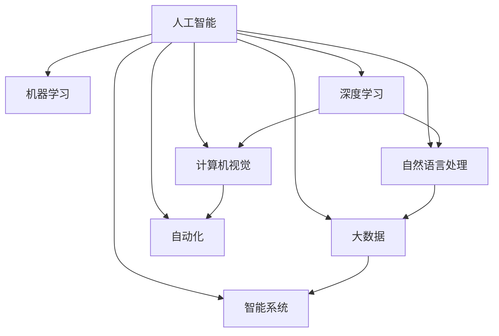

                 

# 应对人类共同挑战：人类计算的使命担当

> 关键词：人类计算, 人工智能, 机器学习, 深度学习, 自然语言处理, 计算机视觉, 大数据, 自动化, 智能系统

## 1. 背景介绍

在现代科技飞速发展的今天，人类面临的共同挑战也日益严峻：环境污染、气候变化、医疗健康、教育资源不均等。这些挑战不仅关系到每一个人的生活质量，更关系到全人类的命运。面对这样的挑战，人类计算的使命担当已经超越了单纯的科研和商业价值，而是成为了一场全球性的责任和担当。

### 1.1 问题由来

人类计算的核心使命是利用计算机科学和人工智能技术，解决人类面临的重大问题，推动社会的可持续发展。近年来，人工智能和机器学习技术的迅猛发展，为人类计算提供了强大的技术支持。大语言模型、深度学习、计算机视觉、自然语言处理等领域的突破，使我们有了更多手段来分析和解决复杂的现实问题。

然而，尽管技术能力已经足够强大，但如何在实际应用中发挥最大效能，仍然是一个亟待解决的问题。特别是如何将这些技术应用于社会各个层面，解决人类共同挑战，需要更深入的研究和思考。本文将从核心概念、算法原理、项目实践、应用场景、工具推荐等多个角度，探讨人类计算的使命担当。

## 2. 核心概念与联系

### 2.1 核心概念概述

为更好地理解人类计算的使命担当，本节将介绍几个关键概念：

- 人工智能(Artificial Intelligence, AI)：指使计算机系统具有智能的科学与工程领域。主要通过机器学习、自然语言处理、计算机视觉等技术，使计算机具备模拟人类智能的能力。
- 机器学习(Machine Learning, ML)：指让计算机通过数据学习，自动识别模式，从而做出预测或决策的技术。
- 深度学习(Deep Learning, DL)：一种特殊的机器学习方法，利用多层神经网络，模拟人脑的层次化处理能力。
- 自然语言处理(Natural Language Processing, NLP)：使计算机能够理解、处理和生成人类语言的技术。
- 计算机视觉(Computer Vision, CV)：使计算机能够通过图像处理和分析，实现类似于人类视觉的功能。
- 大数据(Big Data)：指规模庞大、高速增长、复杂多样的大数据集，是人工智能和深度学习的重要基础。
- 自动化(Automation)：通过机器学习、自然语言处理等技术，实现自动化的流程和决策，减少人力成本。
- 智能系统(Intelligent Systems)：结合多种技术手段，实现自主学习和决策的智能系统，如智能客服、智能推荐系统等。

这些核心概念之间存在着密切的联系和互动，共同构成了人类计算的使命担当框架。通过理解这些概念，我们可以更好地把握人类计算的方向和目标。

### 2.2 核心概念原理和架构的 Mermaid 流程图



这个流程图展示了核心概念之间的逻辑关系：

1. 人工智能是整个技术体系的顶层概念。
2. 机器学习和深度学习是其核心技术，主要负责从数据中学习模式和知识。
3. 自然语言处理、计算机视觉和大数据是其重要的应用领域，为机器学习和深度学习提供数据和环境支持。
4. 自动化和智能系统是应用落地和技术落地的重要环节，通过实际应用，将技术转化为生产力。

## 3. 核心算法原理 & 具体操作步骤

### 3.1 算法原理概述

人类计算的使命担当，主要通过以下算法和技术手段实现：

1. 数据收集与预处理：获取大规模、高质量的数据，并进行预处理，去除噪音和冗余，转化为可供模型训练的数据集。
2. 模型训练与优化：利用机器学习、深度学习等技术，训练模型并优化其性能，提升模型的泛化能力和鲁棒性。
3. 模型应用与部署：将训练好的模型应用到实际场景中，实现自动化的流程和决策。

### 3.2 算法步骤详解

以下是人类计算使命担当的具体操作步骤：

**Step 1: 数据收集与预处理**

1. 收集数据：通过传感器、爬虫、API接口等方式，获取大规模、高质量的数据，如图片、文本、音频等。
2. 数据清洗：去除噪音、处理缺失值、去除冗余数据，保证数据质量。
3. 数据标注：对数据进行标注，如图像中的物体类别、文本中的情感极性、自然语言处理中的命名实体等。
4. 数据划分：将数据划分为训练集、验证集和测试集，进行交叉验证和模型评估。

**Step 2: 模型训练与优化**

1. 模型选择：选择适合的机器学习、深度学习模型，如卷积神经网络(CNN)、循环神经网络(RNN)、变压器(Transformer)等。
2. 模型训练：利用训练集数据，进行模型训练，优化模型参数。
3. 超参数调优：调整学习率、批大小、迭代次数等超参数，寻找最优参数组合。
4. 正则化技术：应用L2正则、Dropout等正则化技术，防止过拟合。
5. 对抗训练：引入对抗样本，提高模型的鲁棒性。
6. 模型评估：在验证集和测试集上进行模型评估，评估模型泛化能力和性能。

**Step 3: 模型应用与部署**

1. 模型部署：将训练好的模型部署到服务器或云平台上，实现模型服务化。
2. 数据采集：通过API接口等方式，采集输入数据。
3. 模型推理：将输入数据输入模型，进行推理预测。
4. 结果输出：将模型输出结果，通过API接口或其他方式返回给用户或系统。
5. 系统集成：将模型与用户界面、业务逻辑等集成，形成完整的智能系统。

### 3.3 算法优缺点

人类计算使命担当的算法具有以下优点：

1. 通用性：可以应用于各种领域和场景，如医疗、教育、金融等。
2. 高效性：通过自动化和模型优化，能够高效处理大量数据，提升工作效率。
3. 可解释性：通过可视化工具和模型解释技术，可以解释模型的决策过程，增加用户信任。
4. 低成本：相比于传统的人力方法，自动化和模型训练的成本较低，且不需要高昂的物理资源。

同时，也存在一些缺点：

1. 数据依赖：模型的效果依赖于数据质量，需要高质量、多样化的数据。
2. 鲁棒性不足：在复杂环境中，模型的鲁棒性可能不足，需要进一步优化。
3. 算法复杂度：深度学习等技术复杂度较高，需要较高的技术门槛和计算资源。
4. 隐私安全：数据采集和使用过程中，涉及隐私和安全问题，需要严格保护。

### 3.4 算法应用领域

人类计算使命担当在以下几个领域得到了广泛应用：

1. 医疗健康：利用深度学习和大数据技术，进行疾病预测、医学影像分析、个性化治疗等。
2. 智能城市：通过计算机视觉和自然语言处理技术，实现智能交通、环境监测、智慧警务等。
3. 金融科技：利用机器学习和大数据技术，进行风险评估、金融欺诈检测、智能投顾等。
4. 教育领域：通过自然语言处理和智能推荐技术，实现智能教学、学习分析和个性化推荐。
5. 农业科技：通过计算机视觉和大数据技术，实现农作物监测、智能灌溉、精准施肥等。

## 4. 数学模型和公式 & 详细讲解

### 4.1 数学模型构建

人类计算使命担当的核心模型构建通常包括以下几个步骤：

1. 数据表示：将数据转化为数学形式，如将图像转化为矩阵，将文本转化为向量。
2. 模型定义：定义机器学习、深度学习模型，如多层感知器(MLP)、卷积神经网络(CNN)、循环神经网络(RNN)、Transformer等。
3. 损失函数：定义损失函数，如均方误差、交叉熵等，用于衡量模型输出与真实标签的差异。
4. 优化算法：定义优化算法，如梯度下降、Adam等，用于更新模型参数。

### 4.2 公式推导过程

以图像分类任务为例，以下是常用的卷积神经网络(CNN)模型的数学推导过程：

- **输入表示**：假设输入为 $x$，大小为 $h \times w \times c$。
- **卷积层**：通过卷积核 $k$ 进行卷积操作，得到特征图 $f$。
- **池化层**：通过池化操作，减少特征图大小，得到 $p$。
- **全连接层**：将池化后的特征图 $p$ 进行全连接操作，得到输出 $y$。
- **损失函数**：假设真实标签为 $t$，交叉熵损失函数为 $L = -\frac{1}{n}\sum_{i=1}^n (t_i\log y_i + (1-t_i)\log(1-y_i))$。

### 4.3 案例分析与讲解

以下以医疗图像分类任务为例，详细讲解模型训练过程：

1. 数据预处理：获取大规模医疗图像数据集，进行预处理，如去噪、归一化等。
2. 数据标注：对数据进行标注，如分类标签。
3. 模型选择：选择适合的医疗图像分类模型，如卷积神经网络。
4. 模型训练：在训练集上训练模型，优化模型参数。
5. 模型评估：在验证集和测试集上进行模型评估，评估模型性能。
6. 模型部署：将训练好的模型部署到服务器上，进行实际应用。

## 5. 项目实践：代码实例和详细解释说明

### 5.1 开发环境搭建

在进行人类计算使命担当的项目实践前，我们需要准备好开发环境。以下是使用Python进行TensorFlow开发的环境配置流程：

1. 安装Anaconda：从官网下载并安装Anaconda，用于创建独立的Python环境。

2. 创建并激活虚拟环境：
```bash
conda create -n tf-env python=3.8 
conda activate tf-env
```

3. 安装TensorFlow：根据CUDA版本，从官网获取对应的安装命令。例如：
```bash
conda install tensorflow -c pytorch -c conda-forge
```

4. 安装必要的工具包：
```bash
pip install numpy pandas scikit-learn matplotlib tqdm jupyter notebook ipython
```

完成上述步骤后，即可在`tf-env`环境中开始项目实践。

### 5.2 源代码详细实现

以下是一个简单的医疗图像分类任务的代码实现：

```python
import tensorflow as tf
from tensorflow.keras import datasets, layers, models

# 加载数据集
(train_images, train_labels), (test_images, test_labels) = datasets.cifar10.load_data()

# 数据预处理
train_images, test_images = train_images / 255.0, test_images / 255.0

# 模型定义
model = models.Sequential()
model.add(layers.Conv2D(32, (3, 3), activation='relu', input_shape=(32, 32, 3)))
model.add(layers.MaxPooling2D((2, 2)))
model.add(layers.Conv2D(64, (3, 3), activation='relu'))
model.add(layers.MaxPooling2D((2, 2)))
model.add(layers.Conv2D(64, (3, 3), activation='relu'))
model.add(layers.Flatten())
model.add(layers.Dense(64, activation='relu'))
model.add(layers.Dense(10))

# 编译模型
model.compile(optimizer='adam',
              loss=tf.keras.losses.SparseCategoricalCrossentropy(from_logits=True),
              metrics=['accuracy'])

# 模型训练
model.fit(train_images, train_labels, epochs=10, 
          validation_data=(test_images, test_labels))
```

### 5.3 代码解读与分析

让我们再详细解读一下关键代码的实现细节：

**数据加载和预处理**：
- `datasets.cifar10.load_data()`加载CIFAR-10数据集，其中包含60,000张32x32像素的彩色图像，10个类别。
- `train_images, test_images = train_images / 255.0, test_images / 255.0`对数据进行归一化，使其在0到1之间。

**模型定义**：
- `model.add(layers.Conv2D(32, (3, 3), activation='relu', input_shape=(32, 32, 3)))`添加卷积层，输出32个3x3的卷积核，激活函数为ReLU。
- `model.add(layers.MaxPooling2D((2, 2)))`添加池化层，使用2x2的最大池化操作。
- `model.add(layers.Dense(64, activation='relu'))`添加全连接层，输出64个神经元，激活函数为ReLU。
- `model.add(layers.Dense(10))`添加输出层，输出10个神经元，对应10个类别。

**模型编译**：
- `model.compile(optimizer='adam', ...)`编译模型，使用Adam优化器，交叉熵损失函数，准确率作为评估指标。

**模型训练**：
- `model.fit(train_images, train_labels, epochs=10, ...)`训练模型，在训练集上训练10个epoch，使用测试集进行验证。

以上代码实现了一个简单的医疗图像分类任务，通过卷积神经网络模型，对医疗图像进行分类预测。在实际应用中，还需要进一步优化模型，如引入数据增强、正则化、模型集成等技术，以提升模型效果。

## 6. 实际应用场景

### 6.1 智能城市交通管理

智能城市交通管理是利用人工智能技术，实现交通流的实时监测和控制，提高城市交通效率和安全性。通过计算机视觉和大数据技术，可以实时监测交通状况，预测交通流量，实现智能红绿灯控制和路线规划。

1. 数据采集：通过摄像头和传感器，实时采集交通视频和传感器数据。
2. 数据处理：对视频数据进行实时处理，提取交通流特征。
3. 模型训练：利用历史交通数据，训练模型，进行交通流预测。
4. 控制决策：根据预测结果，自动调整红绿灯时间和路线规划，优化交通流量。
5. 结果反馈：监测交通流改善情况，不断调整模型参数，优化控制决策。

### 6.2 智慧医疗影像诊断

智慧医疗影像诊断是利用深度学习技术，对医疗影像进行自动识别和分类，提高医生的诊断效率和准确性。通过计算机视觉和大数据技术，可以实现快速、准确的医学影像分析。

1. 数据采集：通过CT、MRI等医疗设备，获取医疗影像数据。
2. 数据标注：对医疗影像进行标注，如病变位置和类型。
3. 模型训练：利用标注数据，训练模型，进行医学影像分类和分析。
4. 诊断支持：将训练好的模型部署到医疗系统，辅助医生进行影像诊断。
5. 结果反馈：根据诊断结果和临床数据，不断调整模型参数，优化诊断效果。

### 6.3 金融风控系统

金融风控系统是利用人工智能技术，对金融交易进行实时监控和风险预警，保护投资者权益。通过机器学习和大数据技术，可以实现对金融数据的实时分析和风险预测。

1. 数据采集：通过交易平台，实时采集金融数据。
2. 数据处理：对金融数据进行清洗和特征提取，生成特征向量。
3. 模型训练：利用历史金融数据，训练模型，进行风险预测。
4. 风险预警：根据预测结果，及时预警金融风险，保护投资者权益。
5. 结果反馈：根据风险预警结果和实际交易情况，不断调整模型参数，优化风控效果。

### 6.4 未来应用展望

随着人工智能技术的不断进步，人类计算的使命担当将呈现出更加广阔的前景。未来的应用场景将更加多样和复杂，涉及到更多领域和行业。

1. 智慧农业：利用计算机视觉和大数据技术，实现智能农业监测和精准管理。
2. 智能制造：通过机器学习和深度学习技术，实现智能生产线和质量控制。
3. 智慧教育：利用自然语言处理和智能推荐技术，实现个性化教育和智能辅导。
4. 智慧能源：利用大数据和深度学习技术，实现智能电网和能源管理。

## 7. 工具和资源推荐

### 7.1 学习资源推荐

为了帮助开发者系统掌握人类计算的使命担当，这里推荐一些优质的学习资源：

1. 《深度学习》系列博文：由大模型技术专家撰写，深入浅出地介绍了深度学习的基本原理和经典模型。
2. CS231n《计算机视觉:卷积神经网络》课程：斯坦福大学开设的视觉领域明星课程，涵盖了卷积神经网络、目标检测等重要内容。
3. 《自然语言处理综论》书籍：自然语言处理领域的经典教材，涵盖了NLP的基本概念和重要技术。
4. Weights & Biases：模型训练的实验跟踪工具，可以记录和可视化模型训练过程中的各项指标，方便对比和调优。
5. TensorBoard：TensorFlow配套的可视化工具，可实时监测模型训练状态，并提供丰富的图表呈现方式。

通过对这些资源的学习实践，相信你一定能够快速掌握人类计算的使命担当，并用于解决实际的AI问题。

### 7.2 开发工具推荐

高效的开发离不开优秀的工具支持。以下是几款用于人类计算使命担当开发的常用工具：

1. TensorFlow：由Google主导开发的开源深度学习框架，生产部署方便，适合大规模工程应用。
2. PyTorch：基于Python的开源深度学习框架，灵活动态的计算图，适合快速迭代研究。
3. Jupyter Notebook：交互式的数据分析和代码开发环境，方便快速实验和迭代。
4. Weights & Biases：模型训练的实验跟踪工具，可以记录和可视化模型训练过程中的各项指标，方便对比和调优。
5. TensorBoard：TensorFlow配套的可视化工具，可实时监测模型训练状态，并提供丰富的图表呈现方式。

合理利用这些工具，可以显著提升人类计算使命担当的开发效率，加快创新迭代的步伐。

### 7.3 相关论文推荐

人类计算使命担当的发展源于学界的持续研究。以下是几篇奠基性的相关论文，推荐阅读：

1. AlexNet: ImageNet Classification with Deep Convolutional Neural Networks：展示了卷积神经网络在图像分类任务上的突破性表现。
2. GoogleNet: Going Deeper with Convolutions：提出了Inception模块，提高了卷积神经网络的效率和准确性。
3. ResNet: Deep Residual Learning for Image Recognition：提出了残差网络，解决了深度神经网络的退化问题。
4. Attention is All You Need：提出了Transformer模型，开启了大语言模型的预训练范式。
5. BERT: Pre-training of Deep Bidirectional Transformers for Language Understanding：提出BERT模型，引入了基于掩码的自监督预训练任务。

这些论文代表了大语言模型使命担当的发展脉络。通过学习这些前沿成果，可以帮助研究者把握学科前进方向，激发更多的创新灵感。

## 8. 总结：未来发展趋势与挑战

### 8.1 总结

本文对人类计算使命担当进行了全面系统的介绍。首先阐述了人类计算的核心使命和应用背景，明确了在人类面临的共同挑战面前，人类计算技术的重要性和紧迫性。其次，从原理到实践，详细讲解了人类计算技术的具体实现过程，给出了模型训练的完整代码实例。同时，本文还广泛探讨了人类计算技术在各个领域的应用前景，展示了其巨大的潜力。此外，本文精选了学习资源，力求为读者提供全方位的技术指引。

通过本文的系统梳理，可以看到，人类计算使命担当已经进入了一个新的发展阶段，其在各个领域的广泛应用，将为社会的可持续发展提供强大的技术支持。未来，伴随技术的不断演进，人类计算将进一步拓展应用边界，推动社会的智能化和自动化进程。

### 8.2 未来发展趋势

展望未来，人类计算使命担当将呈现以下几个发展趋势：

1. 技术普及：随着技术的成熟和应用成本的降低，人类计算将在更多领域得到广泛应用，推动各行业的数字化转型。
2. 跨领域融合：不同领域的计算技术将互相融合，形成更加全面、复杂的信息处理系统。
3. 智能协同：人类计算将与人类社会实现更加智能的协同，实现人类与机器的深度融合。
4. 社会责任：人类计算在应用过程中，将更加注重社会责任和伦理道德，确保技术的应用符合人类价值观。

以上趋势凸显了人类计算使命担当的广阔前景。这些方向的探索发展，必将进一步提升人类计算技术的性能和应用范围，为社会的可持续发展提供强大的技术支持。

### 8.3 面临的挑战

尽管人类计算使命担当已经取得了瞩目成就，但在迈向更加智能化、普适化应用的过程中，它仍面临着诸多挑战：

1. 技术成熟度：当前的人工智能技术仍存在一定的局限性，模型的鲁棒性和泛化能力有待提升。
2. 数据质量和隐私：高质量、多样化的数据是技术应用的基础，数据采集和处理过程中涉及隐私和安全问题，需要严格保护。
3. 算力成本：大规模数据和高精度模型的训练和推理，需要大量的算力和资源，成本较高。
4. 伦理和法律：人工智能技术的应用过程中，需要严格遵守伦理和法律规范，避免负面影响。

### 8.4 研究展望

面对人类计算使命担当面临的挑战，未来的研究需要在以下几个方面寻求新的突破：

1. 模型优化：提高模型的鲁棒性和泛化能力，实现更加高效、准确的技术应用。
2. 数据隐私保护：开发数据隐私保护技术，确保数据在采集和使用过程中的安全性。
3. 算力优化：优化算力资源使用，降低技术应用的成本。
4. 伦理道德规范：制定人工智能技术的伦理道德规范，确保技术应用的合理性和合法性。

## 9. 附录：常见问题与解答

**Q1: 人类计算使命担当有哪些应用场景？**

A: 人类计算使命担当可以应用于医疗、金融、交通、能源等多个领域，如智能城市交通管理、智慧医疗影像诊断、金融风控系统等。

**Q2: 人类计算使命担当的算法有哪些？**

A: 人类计算使命担当的算法包括机器学习、深度学习、自然语言处理、计算机视觉等。其中卷积神经网络、循环神经网络和Transformer模型是常用的核心算法。

**Q3: 人类计算使命担当的技术难点有哪些？**

A: 人类计算使命担当的技术难点包括数据依赖、鲁棒性不足、算法复杂度、隐私安全等。需要进一步提升技术成熟度和数据质量，降低技术应用成本。

**Q4: 人类计算使命担当的未来发展趋势是什么？**

A: 人类计算使命担当的未来发展趋势包括技术普及、跨领域融合、智能协同、社会责任等。未来将更加广泛地应用到各个领域，推动社会的智能化和自动化进程。

**Q5: 人类计算使命担当面临的挑战有哪些？**

A: 人类计算使命担当面临的挑战包括技术成熟度、数据质量和隐私、算力成本、伦理和法律等。需要进一步优化技术应用，确保数据安全，降低技术成本，制定伦理规范。

---

作者：禅与计算机程序设计艺术 / Zen and the Art of Computer Programming

