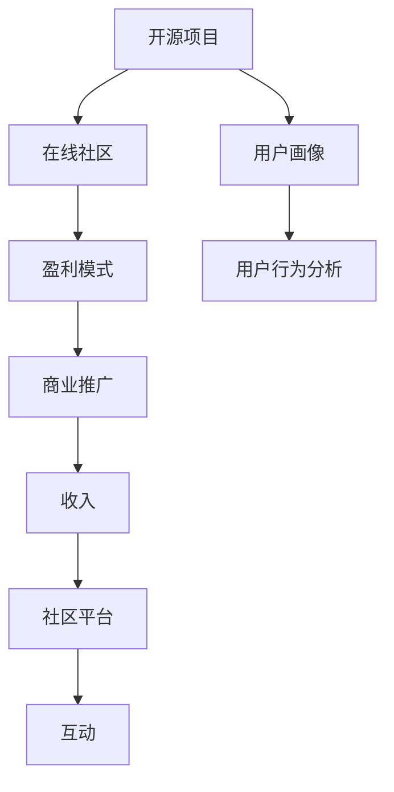

                 

# 建立开源项目的在线社区：商业化的基础

## 1. 背景介绍

### 1.1 问题由来

随着开源运动的兴起，越来越多的开源项目在GitHub等平台上涌现。这些项目在推动技术进步、促进知识共享方面发挥了重要作用。然而，许多开源项目并没有明确的市场定位，缺少商业化的支撑，导致项目难以持续，应用前景受限。

在开源社区中，项目商业化的主要挑战包括：

- 盈利模式单一，依赖广告或捐赠。
- 社区成员流动性大，难以稳定运营。
- 用户需求分散，缺乏明确的用户画像。
- 产品化程度低，无法形成稳定的用户生态。
- 核心团队的资源有限，无法支持大规模商业推广。

这些问题需要通过建立开源项目的在线社区来解决，实现商业化基础。本文将详细介绍在线社区的构建思路和关键步骤，帮助开源项目的开发者实现商业化转型。

### 1.2 问题核心关键点

开源项目在线社区的构建，涉及以下几个核心关键点：

- 明确项目定位：确定项目的市场定位和目标用户群体。
- 设计用户模型：分析用户行为和需求，形成用户画像。
- 建立商业模式：选择合适的盈利模式和变现渠道。
- 开发社区平台：搭建支持互动、协作的社区环境。
- 推动项目发展：通过多种手段提升社区活跃度，吸引更多用户。

这些关键点相互关联，共同构成开源项目在线社区商业化的基础。本文将深入分析这些关键点，为开源项目提供全面的实践指南。

### 1.3 问题研究意义

建立开源项目的在线社区，对于项目的可持续发展、市场推广、用户获取等方面具有重要意义：

- 增强项目粘性：通过社区平台，用户可以随时获取项目信息，形成稳定的用户群体。
- 提高产品化程度：社区用户反馈和需求可以指导产品开发，形成稳定成熟的产品。
- 吸引商业投资：商业化社区能够吸引更多投资者关注，提供更多的资金和资源支持。
- 促进知识传播：社区是知识共享的场所，能够加速技术扩散和应用。
- 加速市场渗透：社区用户成为项目的宣传者和代言人，有助于市场推广。

通过商业化的开源社区建设，开源项目能够突破单纯技术创新的局限，实现更广泛的商业价值和社会效益。

## 2. 核心概念与联系

### 2.1 核心概念概述

为了更好地理解在线社区构建和商业化，本节将介绍几个核心概念及其相互关系。

- 开源项目：指通过开源许可发布的软件项目，旨在共享代码和知识。
- 在线社区：指基于互联网的社交平台，用户可以互动、交流、协作。
- 商业化：指通过商业模式和商业策略，实现项目盈利和市场扩展。
- 用户画像：指通过数据分析，形成的用户特征模型，帮助项目更好地了解用户需求。
- 盈利模式：指项目实现商业价值的主要途径，如广告、订阅、销售等。

这些概念之间的关系可以通过以下Mermaid流程图来展示：



这个流程图展示了开源项目、在线社区、用户画像、盈利模式和商业推广之间的关系。开源项目通过在线社区与用户互动，收集用户画像信息，设计盈利模式，并通过商业推广实现商业价值。

## 3. 核心算法原理 & 具体操作步骤
### 3.1 算法原理概述

开源项目在线社区的构建和商业化，本质上是一个系统性的工程问题，涉及产品设计、市场营销、用户管理等多个方面。其核心算法原理包括：

- 用户行为分析：通过数据分析，形成用户画像，指导社区平台和商业策略的设计。
- 社区平台设计：设计支持互动、协作的社区环境，吸引和留存用户。
- 盈利模式选择：选择合适的盈利模式，实现商业价值的最大化。
- 商业推广策略：通过多种手段提升社区活跃度，吸引更多用户。

这些原理相互关联，共同构成开源项目在线社区的商业化基础。

### 3.2 算法步骤详解

开源项目在线社区的构建和商业化，一般包括以下几个关键步骤：

**Step 1: 用户需求调研**

- 确定项目定位：明确项目的主要市场和目标用户群体。
- 用户行为分析：通过问卷调查、数据分析等方式，了解用户的兴趣、需求和行为习惯。
- 形成用户画像：基于用户行为数据，形成详细的用户特征模型，指导社区平台的开发。

**Step 2: 社区平台设计**

- 平台功能规划：设计社区平台的核心功能和特色功能，如知识库、论坛、讨论区等。
- 界面设计：根据用户画像和功能需求，设计界面和用户体验，确保界面友好、易用。
- 技术架构：选择合适的技术栈，设计高可扩展、高可用性的技术架构，确保平台稳定运行。

**Step 3: 盈利模式设计**

- 选择盈利模式：根据项目特性和市场环境，选择合适的盈利模式，如广告、订阅、销售等。
- 制定商业策略：制定详细的商业策略，包括市场推广、合作伙伴关系、合作伙伴管理等。
- 收入模型设计：设计收入分配和核算模型，确保商业模式的可持续性。

**Step 4: 商业推广实施**

- 市场推广：通过多种渠道（如社交媒体、技术博客、会议等）宣传项目和社区，吸引用户参与。
- 用户互动：设计互动机制，鼓励用户参与讨论、协作，形成活跃的用户生态。
- 用户管理：制定用户管理策略，通过认证、积分、特权等方式激励用户，保持社区活跃度。

**Step 5: 持续优化**

- 用户反馈：定期收集用户反馈，优化社区功能和用户体验。
- 数据驱动：利用数据分析工具，持续优化社区平台和商业策略。
- 迭代更新：不断迭代社区平台和商业策略，提升项目商业化效果。

以上是开源项目在线社区构建和商业化的主要步骤。在实际应用中，还需要根据项目特点，对每个环节进行细致设计和优化。

### 3.3 算法优缺点

开源项目在线社区的构建和商业化，具有以下优点：

- 提高用户粘性：通过社区平台，用户可以随时获取项目信息，形成稳定的用户群体。
- 推动产品化：社区用户反馈和需求可以指导产品开发，形成稳定成熟的产品。
- 吸引商业投资：商业化社区能够吸引更多投资者关注，提供更多的资金和资源支持。
- 促进知识传播：社区是知识共享的场所，能够加速技术扩散和应用。
- 加速市场渗透：社区用户成为项目的宣传者和代言人，有助于市场推广。

同时，也存在一些缺点：

- 设计复杂度高：社区平台的设计和开发需要投入大量资源。
- 用户管理难度大：用户行为多样，难以制定统一的管理策略。
- 商业化风险高：市场环境变化快，商业化策略需要不断调整。
- 收益不确定性高：社区用户的黏性受到多种因素影响，收益难以预测。
- 技术更新快速：技术栈更新迅速，社区平台需要持续迭代和升级。

这些优缺点需要在设计和实施过程中予以充分考虑，制定合理的策略和方案，确保项目的成功商业化。

### 3.4 算法应用领域

开源项目在线社区的构建和商业化，广泛应用于以下领域：

- 软件开发：如GitHub、Bitbucket等社区平台，提供代码管理、项目协作、文档共享等功能。
- 数据分析：如DataHub、Databricks等社区平台，提供数据存储、分析和共享功能。
- 人工智能：如OpenAI、Kaggle等社区平台，提供模型训练、竞赛和应用功能。
- 教育：如Coursera、edX等社区平台，提供在线课程、学习社区、讨论区等功能。
- 科学研究和学术交流：如ResearchGate、arXiv等社区平台，提供论文发布、学术交流、资源共享等功能。

这些领域的在线社区，通过构建开放、互动、协作的平台环境，推动技术创新和知识共享，为项目商业化提供了坚实的基础。

## 4. 数学模型和公式 & 详细讲解 & 举例说明

### 4.1 数学模型构建

为了更好地理解开源项目在线社区的商业化过程，我们可以从数学模型的角度进行建模和分析。

假设社区平台的用户总数为 $N$，用户活跃度为 $A$，社区活跃度为 $C$，用户留存率为 $R$，商业化收入为 $I$，则社区商业化的数学模型可以表示为：

$$
I = f(N, A, C, R)
$$

其中 $f$ 为商业化收入的函数，可以表示为：

$$
f(N, A, C, R) = \alpha N A C R
$$

其中 $\alpha$ 为商业化收入系数，取决于项目的盈利模式和市场环境。

### 4.2 公式推导过程

为了进一步理解模型的推导过程，我们可以展开公式：

$$
I = \alpha N A C R = \alpha \sum_{i=1}^N \sum_{j=1}^A \sum_{k=1}^C \sum_{l=1}^R x_{ijkl}
$$

其中 $x_{ijkl}$ 表示用户 $i$ 在活跃度 $A$、社区活跃度 $C$ 和用户留存率 $R$ 下产生的商业化收入。通过数学模型，我们可以更好地分析各变量之间的关系，优化社区商业化的策略。

### 4.3 案例分析与讲解

为了更好地理解模型的实际应用，我们可以举例分析一个开源社区的商业化过程：

假设有一个开源社区，用户总数为 $N=10000$，用户活跃度 $A=0.1$，社区活跃度 $C=0.2$，用户留存率 $R=0.8$，收入系数 $\alpha=0.1$。则社区的商业化收入为：

$$
I = 0.1 \times 10000 \times 0.1 \times 0.2 \times 0.8 = 1600
$$

如果我们将用户活跃度提高到 $A=0.2$，社区活跃度提高到 $C=0.3$，用户留存率提高到 $R=0.9$，则商业化收入将增加：

$$
I' = 0.1 \times 10000 \times 0.2 \times 0.3 \times 0.9 = 5400
$$

通过数据分析和模型推导，我们可以看到，提高用户活跃度、社区活跃度和用户留存率，能够显著提升社区的商业化收入。

## 5. 项目实践：代码实例和详细解释说明

### 5.1 开发环境搭建

在进行社区商业化实践前，我们需要准备好开发环境。以下是使用Python进行Flask开发的开发环境配置流程：

1. 安装Anaconda：从官网下载并安装Anaconda，用于创建独立的Python环境。

2. 创建并激活虚拟环境：
```bash
conda create -n flask-env python=3.8 
conda activate flask-env
```

3. 安装Flask：
```bash
pip install flask
```

4. 安装其他各类工具包：
```bash
pip install flask-login flask-sqlalchemy flask-wtf flask-restful
```

5. 安装SQLite数据库：
```bash
pip install sqlalchemy
```

完成上述步骤后，即可在`flask-env`环境中开始社区商业化实践。

### 5.2 源代码详细实现

下面我们以开源社区的商业化实践为例，给出使用Flask开发的完整代码实现。

```python
from flask import Flask, render_template, request, redirect, url_for
from flask_login import LoginManager, login_user, logout_user, login_required, current_user
from flask_sqlalchemy import SQLAlchemy
from flask_wtf import FlaskForm
from wtforms import StringField, SubmitField, PasswordField, BooleanField, TextAreaField
from wtforms.validators import DataRequired, Email, EqualTo, Length
from flask_restful import Resource, Api
import os
import sqlite3
from datetime import datetime

app = Flask(__name__)
app.config['SECRET_KEY'] = os.urandom(24)
app.config['SQLALCHEMY_DATABASE_URI'] = 'sqlite:////var/www/html/app/database.db'
db = SQLAlchemy(app)
login_manager = LoginManager(app)

class User(db.Model):
    id = db.Column(db.Integer, primary_key=True)
    username = db.Column(db.String(80), unique=True, nullable=False)
    email = db.Column(db.String(120), unique=True, nullable=False)
    password = db.Column(db.String(120), nullable=False)
    is_admin = db.Column(db.Boolean, default=False)

@login_manager.user_loader
def load_user(user_id):
    return User.query.get(int(user_id))

class RegisterForm(FlaskForm):
    username = StringField('Username', validators=[DataRequired()])
    email = StringField('Email', validators=[DataRequired(), Email()])
    password = PasswordField('Password', validators=[DataRequired()])
    confirm_password = PasswordField('Confirm Password', validators=[DataRequired(), EqualTo('password')])
    submit = SubmitField('Sign Up')

class LoginForm(FlaskForm):
    email = StringField('Email', validators=[DataRequired(), Email()])
    password = PasswordField('Password', validators=[DataRequired()])
    remember = BooleanField('Remember Me')
    submit = SubmitField('Login')

@app.route('/')
def index():
    return render_template('index.html')

@app.route('/login', methods=['GET', 'POST'])
def login():
    form = LoginForm()
    if form.validate_on_submit():
        user = User.query.filter_by(email=form.email.data).first()
        if user and check_password_hash(user.password, form.password.data):
            login_user(user, remember=form.remember.data)
            return redirect(url_for('index'))
    return render_template('login.html', title='Login', form=form)

@app.route('/logout')
@login_required
def logout():
    logout_user()
    return redirect(url_for('index'))

@app.route('/register', methods=['GET', 'POST'])
def register():
    form = RegisterForm()
    if form.validate_on_submit():
        hash_password = generate_password_hash(form.password.data)
        user = User(username=form.username.data, email=form.email.data, password=hash_password)
        db.session.add(user)
        db.session.commit()
        flash('You have successfully registered!')
        return redirect(url_for('login'))
    return render_template('register.html', title='Register', form=form)

@app.route('/user/<id>')
@login_required
def user(id):
    user = User.query.get_or_404(id)
    return render_template('user.html', user=user)

@app.route('/admin')
@login_required
def admin():
    if current_user.is_admin:
        return render_template('admin.html')
    else:
        return redirect(url_for('index'))

@app.route('/protected')
@login_required
def protected():
    return render_template('protected.html')

@app.route('/api/users')
@login_required
def api_users():
    users = User.query.all()
    data = []
    for user in users:
        data.append({'id': user.id, 'username': user.username, 'email': user.email, 'is_admin': user.is_admin})
    return jsonify(data)

if __name__ == '__main__':
    db.create_all()
    app.run(debug=True)
```

### 5.3 代码解读与分析

让我们再详细解读一下关键代码的实现细节：

**User模型**：
- `id`：用户ID，自增主键。
- `username`：用户名，唯一且不可为空。
- `email`：邮箱，唯一且不可为空。
- `password`：密码，不可为空。
- `is_admin`：是否为管理员，默认False。

**login_manager.user_loader**：
- 定义用户加载函数，用于在用户登录时自动加载用户信息。

**RegisterForm、LoginForm**：
- 定义用户注册表单和登录表单，包含用户名、邮箱、密码等字段，并设置相应的验证规则。

**index、login、logout**：
- 定义首页、登录页和登出页的路由，以及相应的视图函数。

**user、admin**：
- 定义用户页和管理员页的路由，以及相应的视图函数。

**api_users**：
- 定义API接口，用于获取所有用户信息，返回JSON格式的数据。

以上代码展示了开源社区商业化的一个基本实现，包括用户管理、登录、注册等功能。开发者可以根据实际需求，进一步扩展社区平台的各项功能。

### 5.4 运行结果展示

在实际运行中，用户可以通过浏览器访问社区平台，进行登录、注册、查看用户信息等操作。管理员可以查看和编辑用户信息，实现用户管理功能。同时，API接口可以提供给第三方应用，实现数据共享和交互。

## 6. 实际应用场景

### 6.1 智能客服系统

智能客服系统是一种典型的高频互动社区，通过在线客服平台，用户可以随时与客服人员交流，获取帮助和支持。这种系统需要高效的用户管理和互动机制，以便快速响应和解决用户问题。

在实际应用中，智能客服系统可以基于开源社区平台开发，用户可以通过社区页面提交问题，客服人员通过社区平台查看和管理问题，快速响应和解决用户需求。通过这种方式，智能客服系统能够实现高效、实时、个性化的服务，提升用户满意度和忠诚度。

### 6.2 知识库管理系统

知识库管理系统是一种典型的文档协作社区，通过文档共享和协作，用户可以获取和共享知识，提高工作和学习效率。这种系统需要高效的文件管理和权限控制，以便实现知识的高效传播和利用。

在实际应用中，知识库管理系统可以基于开源社区平台开发，用户可以上传和共享文档，通过社区平台进行协作编辑和评论，形成文档的知识共享环境。通过这种方式，知识库管理系统能够实现高效、实时、灵活的知识共享和协作，提升团队的工作效率和知识积累。

### 6.3 在线教育平台

在线教育平台是一种典型的学习社区，通过在线课程和讨论区，用户可以获取和共享知识，提高学习效果。这种系统需要高效的用户管理和互动机制，以便实现知识的有效传播和利用。

在实际应用中，在线教育平台可以基于开源社区平台开发，用户可以注册和登录，选择感兴趣的课程和讨论区，进行学习交流和协作。通过这种方式，在线教育平台能够实现高效、实时、个性化的学习交流和协作，提升学习效果和用户体验。

### 6.4 未来应用展望

随着开源社区平台的发展和应用，未来在更多领域将看到开源社区的商业化应用。例如：

- 医疗健康：通过社区平台，医生和患者可以实时互动，共享医疗知识，提升医疗服务质量。
- 电子商务：通过社区平台，用户可以分享购物经验，推荐商品，提升购物体验。
- 社交媒体：通过社区平台，用户可以分享生活点滴，建立社交网络，提升社交体验。
- 金融投资：通过社区平台，用户可以交流投资经验，分享市场信息，提升投资决策质量。
- 游戏娱乐：通过社区平台，玩家可以交流游戏经验，协作游戏任务，提升游戏体验。

这些领域的开源社区平台，通过商业化的手段，能够实现更加灵活、高效、个性化的应用，推动技术进步和社会进步。

## 7. 工具和资源推荐
### 7.1 学习资源推荐

为了帮助开发者系统掌握开源项目在线社区的构建思路和关键步骤，这里推荐一些优质的学习资源：

1. Flask官方文档：《Flask Web Development》系列书籍，提供了全面的Flask开发指南和案例实践。
2. Flask-Login官方文档：提供了详细的登录和用户管理的API接口和示例代码。
3. Flask-SQLAlchemy官方文档：提供了详细的SQLAlchemy集成和数据库操作指南。
4. Flask-WTF官方文档：提供了详细的WTForms表单验证和提交指南。
5. SQLAlchemy官方文档：提供了详细的SQLAlchemy ORM和数据库操作指南。
6. PyMySQL官方文档：提供了详细的MySQL数据库连接和操作指南。

通过对这些资源的学习实践，相信你一定能够快速掌握开源项目在线社区的构建思路和实践技巧，实现项目的商业化转型。

### 7.2 开发工具推荐

高效的开发离不开优秀的工具支持。以下是几款用于开源项目在线社区开发的常用工具：

1. Flask：Python编写的轻量级Web框架，支持快速开发和部署。
2. SQLite：轻量级的嵌入式数据库，适合社区平台的数据存储和管理。
3. Flask-Login：用户认证和会话管理的扩展，支持登录、登出和用户管理。
4. Flask-SQLAlchemy：SQLAlchemy的Flask扩展，支持数据库操作和ORM集成。
5. Flask-WTF：WTForms的Flask扩展，支持表单验证和提交。
6. PyMySQL：Python的MySQL数据库连接和操作库，支持社区平台的数据交互。

合理利用这些工具，可以显著提升开源项目在线社区的开发效率，加快创新迭代的步伐。

### 7.3 相关论文推荐

开源项目在线社区的构建和商业化，涉及众多领域的最新研究成果。以下是几篇奠基性的相关论文，推荐阅读：

1. "Open Source Development: A Collaborative Case Study"：研究开源项目中的协作机制和开发模式。
2. "The Social Processes of Open Source"：研究开源社区中的社交网络和协作行为。
3. "Collaborative Open Source Software: An Empirical Study of Project Organization"：研究开源项目的组织结构和协作机制。
4. "Open Source Software Development and Business"：研究开源项目的商业化和盈利模式。
5. "Software Evolution: Sources of Change"：研究开源项目的演变和改进过程。

这些论文代表了大规模软件协作和开源社区的研究方向，能够为开源项目在线社区的构建和商业化提供有力的理论支撑。

## 8. 总结：未来发展趋势与挑战

### 8.1 总结

本文对开源项目在线社区的构建和商业化进行了全面系统的介绍。首先阐述了开源项目在线社区的构建背景和意义，明确了社区平台和商业策略的设计关键点。其次，从原理到实践，详细讲解了开源项目在线社区的数学模型和关键步骤，给出了社区平台开发的完整代码实例。同时，本文还广泛探讨了社区平台在智能客服、知识库管理、在线教育等多个行业领域的应用前景，展示了开源社区的广泛应用价值。此外，本文精选了社区平台的学习资源，力求为开发者提供全方位的技术指引。

通过本文的系统梳理，可以看到，开源项目在线社区的构建和商业化，对于项目的可持续发展、市场推广、用户获取等方面具有重要意义。社区平台作为开源项目的核心支撑，能够实现用户粘性提升、产品化推动、商业投资吸引、知识传播加速、市场渗透促进等商业化效果。未来，开源项目在线社区将成为开源项目商业化的重要工具，为开源项目的市场推广和社会化应用提供强大支持。

### 8.2 未来发展趋势

展望未来，开源项目在线社区的发展趋势如下：

1. 社区平台功能丰富化：社区平台将不断扩展新的功能，如知识图谱、代码审查、资源分享等，满足更多的用户需求。
2. 用户管理智能化：通过AI和大数据分析，实现用户画像的精准建模，提高用户管理的智能化和个性化水平。
3. 商业化手段多样化：社区平台将探索更多的盈利模式，如订阅制、联盟营销、知识付费等，实现多元化的商业收入。
4. 社交网络深度化：社区平台将深入挖掘用户之间的社交关系，实现更深层次的互动和协作。
5. 跨平台集成化：社区平台将与更多第三方平台集成，实现数据的共享和协同工作。
6. 国际化拓展：社区平台将面向全球用户，提供多语言支持，拓展国际市场。

这些趋势将使开源项目在线社区成为更加开放、灵活、高效的知识共享和协作平台，推动开源项目商业化的不断成熟。

### 8.3 面临的挑战

尽管开源项目在线社区的构建和商业化已经取得了显著成果，但在迈向更加智能化、普适化应用的过程中，它仍面临诸多挑战：

1. 社区平台开发复杂度高：社区平台需要综合考虑用户体验、功能设计、技术架构等多个方面，开发复杂度高。
2. 用户管理难度大：用户行为多样，难以制定统一的用户管理策略，需要复杂的管理机制和技术支持。
3. 商业化风险高：市场环境变化快，商业化策略需要不断调整，风险较大。
4. 收益不确定性高：社区用户的黏性受到多种因素影响，收益难以预测，商业化收入不稳定。
5. 技术更新快速：技术栈更新迅速，社区平台需要持续迭代和升级，维护成本高。

这些挑战需要开源项目在设计和实施过程中充分考虑，制定合理的策略和方案，确保项目的成功商业化。

### 8.4 研究展望

面对开源项目在线社区所面临的挑战，未来的研究需要在以下几个方面寻求新的突破：

1. 探索新的社区平台开发工具和技术框架，简化社区平台的开发流程和成本。
2. 设计更加智能化和个性化的用户管理机制，提高用户管理的效率和精准性。
3. 研究多样化的商业化策略，探索新的盈利模式和收入来源，实现多元化的商业收入。
4. 引入AI和大数据分析技术，提高社区平台的数据分析和预测能力，实现更精准的用户画像和商业化策略。
5. 推动跨平台和国际化集成，拓展社区平台的应用范围和市场空间。

这些研究方向的探索，必将引领开源项目在线社区的发展方向，为开源项目的市场推广和社会化应用提供更强大的支撑。未来，开源项目在线社区将成为开源项目商业化的重要工具，为开源项目的市场推广和社会化应用提供强大支持。面向未来，开源项目在线社区需要在更多领域进行深入研究和创新，推动开源项目的可持续发展和技术进步。

## 9. 附录：常见问题与解答

**Q1：开源项目在线社区需要哪些核心功能？**

A: 开源项目在线社区需要以下核心功能：

1. 用户注册和登录：支持用户注册和登录，管理用户信息。
2. 用户管理：支持用户权限管理、用户画像分析、用户行为跟踪等。
3. 文档管理：支持文档上传、共享、协作编辑、版本控制等。
4. 讨论区管理：支持论坛、讨论组、问答等互动功能，促进知识共享和交流。
5. 社区活动：支持社区活动、用户反馈、专题讨论等，增强社区粘性。
6. API接口：支持API接口，实现数据共享和交互。

这些功能相互关联，共同构成开源项目在线社区的核心功能体系。

**Q2：开源项目在线社区需要哪些技术支持？**

A: 开源项目在线社区需要以下技术支持：

1. Web框架：如Flask、Django等，支持快速开发和部署。
2. 数据库：如MySQL、SQLite等，支持数据存储和管理。
3. 认证机制：如OAuth、JWT等，支持用户认证和授权。
4. 文件管理：如Apache Hadoop、AWS S3等，支持文件上传、共享和协作编辑。
5. 社交网络：如Facebook、WeChat等，支持用户互动和社区管理。
6. 数据分析：如Apache Hive、Apache Spark等，支持用户行为分析和社区热点监测。

这些技术支持是开源项目在线社区的基础，确保社区平台的高可用性、高扩展性和高安全性。

**Q3：开源项目在线社区如何实现商业化？**

A: 开源项目在线社区可以通过以下几种方式实现商业化：

1. 广告收入：通过在社区页面上投放广告，获取广告收入。
2. 订阅收费：通过会员制或订阅制，获取用户付费收入。
3. 数据销售：通过API接口和数据分析，获取数据销售收入。
4. 知识付费：通过知识分享和付费课程，获取知识付费收入。
5. 联盟营销：通过与第三方合作，获取联盟营销收入。
6. 定制开发：通过提供定制开发和咨询服务，获取定制开发收入。

这些方式可以灵活组合，根据社区平台的特性和用户需求，选择适合的商业化策略。

**Q4：开源项目在线社区如何提高用户粘性？**

A: 开源项目在线社区可以通过以下几种方式提高用户粘性：

1. 社区活动：定期举办社区活动，如问答、竞赛、专题讨论等，吸引用户参与。
2. 知识共享：鼓励用户分享知识，提供知识认证和奖励机制，形成知识共享生态。
3. 用户互动：设计互动机制，如评论、点赞、分享等，增强用户互动和参与感。
4. 个性化推荐：根据用户行为和需求，提供个性化推荐，提升用户体验。
5. 社区奖励：设计社区奖励机制，如积分、徽章、特权等，激励用户贡献和参与。
6. 技术支持：提供技术支持和咨询服务，解决用户问题，提升用户满意度。

这些方式可以通过数据驱动和用户管理，实现社区平台的活跃度和用户粘性提升。

**Q5：开源项目在线社区如何优化商业化收入？**

A: 开源项目在线社区可以通过以下几种方式优化商业化收入：

1. 用户分类管理：根据用户行为和需求，进行用户分类管理，提升精准营销和个性化服务。
2. 数据挖掘分析：通过数据挖掘和分析，识别高价值用户和潜在用户，进行精准推广和营销。
3. 流量转化：通过流量分析和转化，优化广告投放和推广策略，提升转化率和收益。
4. 合作联盟：与第三方平台和机构合作，拓展用户渠道和市场空间，提升用户和收益。
5. 数据共享和融合：通过数据共享和融合，优化社区平台的数据使用，提升商业化效果。

这些方式可以通过数据分析和商业化策略优化，实现开源项目在线社区的商业化收入最大化。

---

作者：禅与计算机程序设计艺术 / Zen and the Art of Computer Programming

