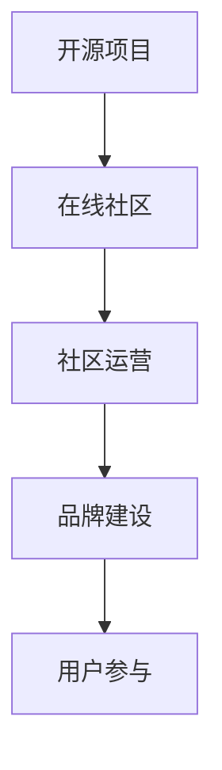

                 

# 建立开源项目的在线社区：社区运营和品牌建设

> 关键词：开源项目,在线社区,社区运营,品牌建设,开发者生态,用户参与

## 1. 背景介绍

随着开源技术的迅猛发展和社区合作的日益紧密，开源项目的在线社区建设成为了一个备受关注的议题。一个健康、活跃的开源社区不仅能吸引更多的开发者贡献代码，还能增强项目的可见性和影响力，构建起一个完整的开发者生态。品牌建设则是在此基础上的进一步升华，通过优秀的品牌形象和市场推广，将项目推广至更广泛的用户群体，实现商业价值和影响力最大化。本文将从社区运营和品牌建设两个角度，探讨如何构建一个高效、持续发展的开源项目在线社区。

### 1.1 社区运营的重要性
社区运营是开源项目成功的关键。一个活跃的社区能汇聚众多开发者，共同推动项目发展，解决问题，实现创新。社区运营不仅关注技术交流和技术改进，还包括社区管理、用户参与、文档维护等多个方面。优秀的社区运营可以提升项目的稳定性和可维护性，增强用户黏性，构建起一个良性互动的生态系统。

### 1.2 品牌建设的意义
品牌建设是指通过市场推广、用户教育等手段，提升项目的知名度和认可度，从而提升商业价值和用户参与度。一个良好的品牌形象不仅能吸引更多用户关注，还能提升项目在市场中的竞争力。品牌建设是开源项目走向商业化的重要一步，也是将技术影响力转化为商业价值的有效手段。

### 1.3 社区与品牌的关系
社区运营与品牌建设是相辅相成的。社区运营能为品牌建设提供基础，品牌建设则能进一步提升社区的影响力和吸引力。两者结合，才能实现开源项目的长期可持续发展和商业价值的最大化。

## 2. 核心概念与联系

### 2.1 核心概念概述

为更好地理解开源项目在线社区和品牌建设的内部联系，本节将介绍几个核心概念：

- **开源项目(Open Source Project, OSP)**：指源代码开放、软件授权许可自由的软件项目。开源项目鼓励开发者共享代码、知识和经验，推动技术进步和创新。
- **在线社区(Online Community)**：指通过互联网技术建立起来的虚拟社区，用户可以通过论坛、邮件、聊天室等方式进行交流、协作。在线社区为开源项目提供了交流、协作的平台。
- **社区运营(Community Management)**：指对在线社区进行管理和维护，包括用户管理、文档维护、技术交流等多个方面。优秀的社区运营能提升项目的稳定性和可维护性，增强用户黏性。
- **品牌建设(Brand Building)**：指通过市场推广、用户教育等手段，提升项目的知名度和认可度，从而提升商业价值和用户参与度。品牌建设是开源项目走向商业化的重要一步。

这些核心概念之间的逻辑关系可以通过以下Mermaid流程图来展示：



这个流程图展示了开源项目在线社区和品牌建设之间的联系：开源项目是基础，在线社区是交流、协作的平台，社区运营和品牌建设则是提升用户参与度和项目影响力的重要手段。

## 3. 核心算法原理 & 具体操作步骤
### 3.1 算法原理概述

开源项目在线社区和品牌建设的过程，本质上是一个社交网络的建立和维护过程。社区运营和品牌建设的核心在于通过社交网络提升项目的知名度和认可度，增强用户黏性，构建起一个良性互动的生态系统。

形式化地，假设开源项目为 $OSP$，社区用户为 $U$，用户之间的交互关系为 $R$。社区运营和品牌建设的目标是最大化用户参与度 $U_{participate}$，提升品牌知名度 $Brand_{awareness}$，其数学表达式为：

$$
Maximize \quad U_{participate} + Brand_{awareness}
$$

在实践中，我们通常使用社交网络分析、用户行为分析等方法，量化用户参与度、品牌知名度等指标，通过调整社区运营策略、优化品牌建设手段，实现上述目标。

### 3.2 算法步骤详解

开源项目在线社区和品牌建设的一般流程包括：

**Step 1: 构建社区平台**
- 选择合适的社区平台（如GitHub、Stack Overflow等），搭建开发、讨论、文档等板块。
- 设计用户界面和交互方式，确保易用性。

**Step 2: 吸引早期用户**
- 在开源社区和开发者社区推广项目，吸引早期用户。
- 通过邮件列表、博客等渠道与早期用户建立联系。

**Step 3: 鼓励用户参与**
- 通过问题跟踪、代码审查、文档编写等方式，鼓励用户参与。
- 提供开发者认证、贡献者排行榜等激励机制。

**Step 4: 社区管理**
- 设立社区管理委员会，定期组织会议和活动。
- 制定社区规范，管理用户行为。
- 处理用户投诉和争议，维护社区秩序。

**Step 5: 品牌建设**
- 制定品牌策略，确定项目Logo、颜色、口号等元素。
- 在社交媒体、技术博客、开源论坛等渠道推广品牌。
- 定期发布新闻、公告，提升品牌知名度。

**Step 6: 用户反馈和改进**
- 收集用户反馈，评估社区运营和品牌建设的成效。
- 根据反馈调整策略，持续改进。

### 3.3 算法优缺点

开源项目在线社区和品牌建设的优势在于：
1. 社区开放、透明，便于吸引更多的开发者和用户。
2. 开发者和用户通过协作，共同解决问题，推动技术创新。
3. 品牌建设能够提升项目的知名度和认可度，增加商业价值。

同时，这些方法也存在一定的局限性：
1. 需要大量时间和资源投入，社区管理和品牌建设周期较长。
2. 社区的稳定性和活跃度取决于用户参与度，用户流失风险较高。
3. 品牌推广需要专业知识，存在投入回报不确定的风险。
4. 品牌建设过程中，需要注意避免与已有知名品牌产生冲突。

尽管存在这些局限性，但就目前而言，社区运营和品牌建设仍是开源项目成功的关键。未来相关研究的重点在于如何提高社区的参与度和活跃度，同时降低品牌建设的风险，提升品牌推广的精准性。

### 3.4 算法应用领域

开源项目在线社区和品牌建设的方法在多种应用场景中得到了广泛的应用，例如：

- 软件开源项目：如Linux、Apache HTTP Server等，通过社区运营和品牌建设，吸引了大量的开发者和用户，成为业界的骨干力量。
- 硬件开源项目：如Raspberry Pi、OpenWrt等，通过社区运营和品牌建设，推动硬件的普及和创新。
- 科学开源项目：如Astropy、OpenAstronomyLibrary等，通过社区运营和品牌建设，推动天文研究的开放合作。
- 教育开源项目：如Scratch、EdX等，通过社区运营和品牌建设，推动教育的开放和普及。

除了上述这些经典场景外，开源项目在线社区和品牌建设也被创新性地应用到更多领域中，如医疗、金融、社交媒体等，为科技和社会发展提供了新的动力。

## 4. 数学模型和公式 & 详细讲解 & 举例说明

### 4.1 数学模型构建

本节将使用数学语言对开源项目在线社区和品牌建设的优化过程进行更加严格的刻画。

记开源项目为 $OSP$，社区用户为 $U$，用户之间的交互关系为 $R$。设社区运营策略为 $S$，品牌建设策略为 $B$，用户参与度为 $U_{participate}$，品牌知名度为 $Brand_{awareness}$。则社区运营和品牌建设的目标函数为：

$$
Maximize \quad U_{participate} + Brand_{awareness}
$$

根据用户行为分析，用户参与度可以表示为：

$$
U_{participate} = f(S, B)
$$

其中 $f$ 为社区运营策略和品牌建设策略的映射函数，描述了两者对用户参与度的影响。

品牌知名度可以表示为：

$$
Brand_{awareness} = g(S, B)
$$

其中 $g$ 为社区运营策略和品牌建设策略的映射函数，描述了两者对品牌知名度的影响。

在实践中，我们通常使用回归分析、统计分析等方法，对上述函数进行建模和优化。

### 4.2 公式推导过程

以下我们以GitHub项目为例，推导用户参与度与品牌知名度的关系：

假设社区运营策略 $S$ 包括问题跟踪、代码审查、文档编写等方式，品牌建设策略 $B$ 包括社交媒体推广、技术博客发布、开源论坛参与等。

1. 用户参与度计算：
   - 问题跟踪：记录用户提出的问题数量 $N_{issue}$，平均解决时间 $T_{issue}$。
   - 代码审查：记录用户提交的代码行数 $N_{code}$，平均审查时间 $T_{code}$。
   - 文档编写：记录用户编写文档的平均阅读量 $R_{doc}$，文档更新频率 $F_{doc}$。
   - 用户参与度 $U_{participate} = \alpha N_{issue} + \beta N_{code} + \gamma R_{doc} + \delta F_{doc}$

2. 品牌知名度计算：
   - 社交媒体推广：记录项目的社交媒体关注量 $N_{social}$，粉丝互动量 $T_{social}$。
   - 技术博客发布：记录项目的博客访问量 $N_{blog}$，文章评论量 $T_{blog}$。
   - 开源论坛参与：记录项目的论坛帖子量 $N_{forum}$，帖子回复量 $T_{forum}$。
   - 品牌知名度 $Brand_{awareness} = \alpha N_{social} + \beta N_{blog} + \gamma N_{forum} + \delta T_{social} + \epsilon T_{blog} + \zeta T_{forum}$

通过上述公式，我们可以建立社区运营策略和品牌建设策略对用户参与度和品牌知名度的影响关系。通过调整 $S$ 和 $B$，可以优化 $U_{participate}$ 和 $Brand_{awareness}$，提升开源项目的稳定性和可维护性，增强项目的商业价值。

### 4.3 案例分析与讲解

这里以Apache HTTP Server为例，分析其在社区运营和品牌建设方面的成功经验。

Apache HTTP Server是一个广泛使用的开源Web服务器软件。其社区运营和品牌建设的成功经验包括以下几点：

1. **活跃的社区管理**：Apache设有活跃的社区管理委员会，负责制定社区规范、处理用户投诉、组织会议和活动等。通过良好的社区管理，Apache吸引了众多开发者和用户，形成了良性互动的生态系统。

2. **多样化的参与方式**：Apache通过代码审查、问题跟踪、文档编写等方式，鼓励用户参与项目。同时，Apache还提供开发者认证、贡献者排行榜等激励机制，增强用户黏性。

3. **成功的品牌建设**：Apache通过在社交媒体、技术博客、开源论坛等渠道推广品牌，提升了项目的知名度和认可度。Apache定期发布新闻、公告，与开发者和用户保持紧密联系，形成了强大的品牌影响力。

4. **持续的改进与优化**：Apache社区和品牌建设并非一劳永逸，而是持续改进和优化的过程。通过用户反馈和社区讨论，Apache不断调整运营策略和品牌建设手段，保持项目的稳定性和可维护性。

## 5. 项目实践：代码实例和详细解释说明

### 5.1 开发环境搭建

在进行开源项目在线社区和品牌建设的实践前，我们需要准备好开发环境。以下是使用Python进行Flask开发的环境配置流程：

1. 安装Anaconda：从官网下载并安装Anaconda，用于创建独立的Python环境。

2. 创建并激活虚拟环境：
```bash
conda create -n flask-env python=3.8 
conda activate flask-env
```

3. 安装Flask：
```bash
pip install Flask
```

4. 安装各类工具包：
```bash
pip install numpy pandas scikit-learn matplotlib tqdm jupyter notebook ipython
```

完成上述步骤后，即可在`flask-env`环境中开始开发实践。

### 5.2 源代码详细实现

这里我们以构建一个开源社区平台为例，给出使用Flask框架进行社区平台开发的PyTorch代码实现。

首先，定义Flask应用：

```python
from flask import Flask, render_template, request

app = Flask(__name__)

@app.route('/')
def index():
    return render_template('index.html')
```

然后，定义社区平台的用户界面：

```python
from flask import Flask, render_template, request

app = Flask(__name__)

@app.route('/')
def index():
    return render_template('index.html')
```

最后，启动Flask应用：

```python
if __name__ == '__main__':
    app.run(debug=True)
```

以上就是使用Flask框架构建开源社区平台的基本代码实现。可以看到，Flask框架提供了简单易用的路由、模板渲染等功能，开发者可以轻松构建一个功能完善的社区平台。

### 5.3 代码解读与分析

让我们再详细解读一下关键代码的实现细节：

**Flask应用**：
- 使用Flask框架，定义一个Flask应用对象 `app`。
- 使用 `@app.route` 装饰器，将函数与路由关联。
- 在路由函数中，使用 `render_template` 渲染用户界面模板。

**用户界面模板**：
- 使用HTML和Javascript，构建用户界面。
- 通过表单提交、AJAX等技术，实现社区管理、代码提交、问题跟踪等功能。
- 通过CSS和Javascript，提升用户界面的交互性和美观性。

**社区管理**：
- 实现用户注册、登录、用户权限管理等功能。
- 记录用户提交的问题、代码、文档等信息，并进行分类管理。
- 实现代码审查、问题跟踪、文档编写等功能，鼓励用户参与。

**品牌建设**：
- 在社交媒体、技术博客、开源论坛等渠道推广项目。
- 定期发布新闻、公告，提升项目的知名度和认可度。
- 通过用户反馈和社区讨论，调整社区运营和品牌建设策略。

可以看到，通过Flask框架，开发者可以轻松构建一个功能完善的开源社区平台，实现用户管理、代码提交、问题跟踪等功能，同时通过社交媒体、技术博客等渠道，提升项目的品牌知名度和用户参与度。

## 6. 实际应用场景

### 6.1 开源软件开发

开源软件开发是开源项目在线社区和品牌建设的重要应用场景。在开源软件开发中，社区运营和品牌建设能够提升项目的稳定性和可维护性，增强用户黏性，构建起一个良性互动的生态系统。

通过社区运营和品牌建设，开源软件开发项目能够吸引更多的开发者和用户，推动项目的发展和技术创新。例如，Linux内核、Apache HTTP Server等经典开源项目，通过良好的社区运营和品牌建设，已经成为业界的骨干力量。

### 6.2 企业开源平台

企业开源平台也是开源项目在线社区和品牌建设的重要应用场景。通过社区运营和品牌建设，企业开源平台能够提升项目的知名度和认可度，增强商业价值，推动企业内部的技术创新和知识共享。

例如，谷歌的Open Source Program Office (OSPO)通过社区运营和品牌建设，推动了众多开源项目的商业化和落地应用。OSPO不仅提供技术支持和资金资助，还通过品牌推广和市场宣传，提升了谷歌在开源领域的品牌影响力。

### 6.3 教育开源项目

教育开源项目通过社区运营和品牌建设，推动教育的开放和普及。例如，Scratch编程平台通过社区运营和品牌建设，吸引了大量的教育工作者和学生，推动了编程教育的开放和普及。

Scratch平台通过社区运营，鼓励开发者提交代码和教程，为学生提供丰富的学习资源。通过品牌建设，Scratch平台在社交媒体、教育博客等渠道推广，提升了项目的知名度和认可度。

## 7. 工具和资源推荐

### 7.1 学习资源推荐

为了帮助开发者系统掌握开源项目在线社区和品牌建设的理论基础和实践技巧，这里推荐一些优质的学习资源：

1. 《社区管理与品牌建设》系列博文：由开源社区和品牌建设专家撰写，深入浅出地介绍了社区管理、品牌建设等前沿话题。

2. GitHub开源社区：GitHub不仅是代码托管平台，也是一个庞大的开源社区。通过GitHub，开发者可以学习到社区管理和品牌建设的实践经验。

3. 《开源社区与品牌建设》书籍：全面介绍了开源社区和品牌建设的理论和实践，是学习社区管理和品牌建设的重要参考。

4. Open Source Initiative（OSI）：OSI是开源社区的重要组织，提供开源社区的标准和最佳实践。通过OSI，开发者可以学习到社区管理和品牌建设的规范和标准。

5. PyCon开源社区：PyCon是Python开发者大会，每年吸引了众多开发者参加。通过PyCon，开发者可以学习到社区管理和品牌建设的先进经验。

通过对这些资源的学习实践，相信你一定能够快速掌握开源项目在线社区和品牌建设的精髓，并用于解决实际的社区管理问题。

### 7.2 开发工具推荐

高效的开发离不开优秀的工具支持。以下是几款用于开源社区和品牌建设的常用工具：

1. GitHub：全球最大的开源社区平台，提供代码托管、问题跟踪、社区管理等功能，是开源社区建设的重要工具。

2. GitLab：与GitHub功能类似，提供了代码托管、问题跟踪、社区管理等功能，适合企业和开源项目的协作开发。

3. JIRA：项目管理工具，用于记录问题跟踪、任务分配、进度管理等功能，是开源社区管理的重要工具。

4. Slack：团队协作工具，用于沟通交流、文件共享等功能，是开源社区管理的重要工具。

5. Docker：容器化工具，用于封装和管理开源项目的应用环境，方便部署和扩展。

6. Jenkins：持续集成工具，用于自动化构建和测试开源项目，提升开发效率。

合理利用这些工具，可以显著提升开源社区和品牌建设的开发效率，加快创新迭代的步伐。

### 7.3 相关论文推荐

开源社区和品牌建设的研究源于学界的持续研究。以下是几篇奠基性的相关论文，推荐阅读：

1. The Role of Community in Open Source Software Development：研究开源社区对软件开发的贡献，探讨社区管理对项目成功的关键作用。

2. Brand Building in Open Source Software：研究品牌建设对开源项目的影响，探讨品牌建设策略的有效性。

3. Community Participation in Open Source Software Development：研究社区参与对开源项目的影响，探讨社区运营策略的有效性。

4. Success in Open Source Projects：研究开源项目的成功因素，探讨社区管理和品牌建设的作用。

5. Open Source Project Branding：研究开源项目品牌建设的策略，探讨品牌推广的渠道和方法。

这些论文代表了大语言模型微调技术的发展脉络。通过学习这些前沿成果，可以帮助研究者把握学科前进方向，激发更多的创新灵感。

## 8. 总结：未来发展趋势与挑战

### 8.1 总结

本文对开源项目在线社区和品牌建设的理论基础和实践技巧进行了全面系统的介绍。首先阐述了社区运营和品牌建设的重要性，明确了开源项目社区建设和品牌建设的总体目标。其次，从原理到实践，详细讲解了开源项目在线社区和品牌建设的数学模型和操作步骤，给出了社区平台开发的完整代码实例。同时，本文还广泛探讨了开源项目在线社区和品牌建设在开源软件开发、企业开源平台、教育开源项目等多个领域的应用前景，展示了社区运营和品牌建设的重要价值。最后，本文精选了社区运营和品牌建设的学习资源，力求为开发者提供全方位的技术指引。

通过本文的系统梳理，可以看到，开源项目在线社区和品牌建设是开源项目成功的关键。优秀的社区运营和品牌建设能够提升项目的稳定性和可维护性，增强用户黏性，构建起一个良性互动的生态系统。未来，随着开源社区和品牌建设的持续演进，开源项目必将在更广阔的应用领域绽放异彩，深刻影响社会的技术进步和文化创新。

### 8.2 未来发展趋势

展望未来，开源项目在线社区和品牌建设将呈现以下几个发展趋势：

1. 社区管理智能化。随着人工智能和大数据技术的发展，社区管理将更加智能化、自动化。通过智能算法，自动化分析社区数据，提升社区管理的效率和效果。

2. 品牌建设多样化。品牌建设不再局限于传统的社交媒体、技术博客等渠道，将进一步拓展到视频、直播等新兴媒体，提升品牌传播的广度和深度。

3. 社区生态化。开源社区将更加注重生态化建设，通过开发者、用户、贡献者等多方协同，构建一个开放、互动、互惠的生态系统。

4. 品牌推广精准化。品牌推广将更加精准，通过大数据分析和个性化推荐，实现品牌推广的精准投放，提升品牌建设的ROI。

5. 用户参与持续化。通过持续的用户互动和反馈，社区运营和品牌建设将更加符合用户需求，提升用户的满意度和忠诚度。

6. 社区治理透明化。开源社区将更加注重透明度和公开性，通过社区规范、用户反馈等方式，提升社区治理的公正性和可信度。

以上趋势凸显了开源项目在线社区和品牌建设技术的广阔前景。这些方向的探索发展，必将进一步提升开源项目的稳定性和可维护性，增强用户黏性，构建起一个良性互动的生态系统。

### 8.3 面临的挑战

尽管开源项目在线社区和品牌建设已经取得了瞩目成就，但在迈向更加智能化、普适化应用的过程中，它仍面临着诸多挑战：

1. 社区管理复杂度提升。随着开源社区规模的扩大和复杂度的提升，社区管理难度也将加大，需要更多的专业知识和智能算法支持。

2. 品牌建设投入成本高。品牌建设需要投入大量时间和资源，如何平衡投入和回报，需要更多的策略优化。

3. 用户参与度波动。社区用户的参与度受到多种因素影响，如何保持用户的长期参与，需要持续的激励和引导。

4. 品牌冲突风险。品牌建设过程中，可能与已有知名品牌产生冲突，如何规避风险，需要更多的市场调研和策略调整。

5. 用户反馈处理难度大。社区管理需要及时响应用户反馈，处理各种复杂问题，需要更多的人力和智能算法支持。

6. 品牌安全风险。品牌建设过程中，可能面临各种安全威胁，如何保障品牌安全，需要更多的技术和管理手段。

正视开源项目在线社区和品牌建设面临的这些挑战，积极应对并寻求突破，将是大语言模型微调走向成熟的必由之路。相信随着学界和产业界的共同努力，这些挑战终将一一被克服，开源项目在线社区和品牌建设必将在构建人机协同的智能时代中扮演越来越重要的角色。

### 8.4 研究展望

面向未来，开源项目在线社区和品牌建设的研究需要在以下几个方面寻求新的突破：

1. 引入智能算法。通过智能算法，优化社区管理和品牌建设策略，提升管理的效率和效果。

2. 拓展品牌推广渠道。引入新兴媒体和新技术，拓展品牌推广渠道，提升品牌传播的广度和深度。

3. 构建社区生态。通过开发者、用户、贡献者等多方协同，构建一个开放、互动、互惠的社区生态系统。

4. 优化用户参与方式。通过持续的用户互动和反馈，优化用户参与方式，提升用户的满意度和忠诚度。

5. 提升品牌安全性。通过技术和管理的结合，提升品牌安全性，保障品牌的安全和可信。

6. 引入伦理约束。在品牌建设过程中，引入伦理导向的评估指标，过滤和惩罚有偏见、有害的输出倾向，确保品牌建设的公正性和可信度。

这些研究方向将推动开源项目在线社区和品牌建设技术的进一步发展，为开源项目的长期稳定发展和商业价值的最大化提供新的动力。

## 9. 附录：常见问题与解答

**Q1：开源项目在线社区建设的关键是什么？**

A: 开源项目在线社区建设的关键在于良好的社区管理和用户参与。社区管理需要制定明确的规范和流程，处理用户投诉和争议，组织各种活动。用户参与需要提供多种参与方式，如代码审查、问题跟踪、文档编写等，同时提供激励机制，如开发者认证、贡献者排行榜等。

**Q2：开源项目品牌建设的主要手段有哪些？**

A: 开源项目品牌建设的主要手段包括社交媒体推广、技术博客发布、开源论坛参与等。通过这些渠道，能够提升项目的知名度和认可度，增强商业价值和用户参与度。

**Q3：开源项目在线社区建设过程中需要注意哪些问题？**

A: 开源项目在线社区建设过程中需要注意的问题包括用户管理、社区规范、问题跟踪、文档维护等。社区规范需要明确用户行为标准，问题跟踪需要及时响应和解决用户反馈，文档维护需要确保文档的及时更新和质量保障。

**Q4：开源项目品牌建设过程中需要注意哪些问题？**

A: 开源项目品牌建设过程中需要注意的问题包括品牌定位、品牌传播、品牌安全等。品牌定位需要明确品牌的目标受众和核心价值，品牌传播需要选择合适的渠道和策略，品牌安全需要保障品牌的使用规范和法律合规。

**Q5：开源项目在线社区和品牌建设有哪些最佳实践？**

A: 开源项目在线社区和品牌建设的最佳实践包括社区管理委员会、用户反馈机制、品牌策略制定等。社区管理委员会负责社区的规范制定和问题处理，用户反馈机制用于及时响应和解决用户反馈，品牌策略制定需要明确品牌的目标和传播手段。

通过对这些问题的回答，相信你一定能够对开源项目在线社区和品牌建设的理论基础和实践技巧有更深入的理解，并用于解决实际的社区管理和品牌建设问题。

---

作者：禅与计算机程序设计艺术 / Zen and the Art of Computer Programming

