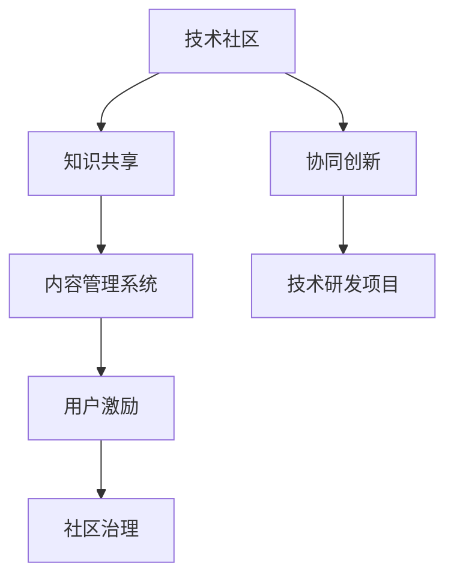

                 

# 建立技术社区：影响力与机遇

## 1. 背景介绍

### 1.1 问题由来
在信息爆炸和数字化转型的浪潮下，技术社区已成为连接技术工作者、促进技术交流与创新的重要平台。无论是开源项目、在线论坛还是技术会议，它们都扮演着知识共享、经验交流和协同创新的关键角色。技术社区不仅能促进技术人才的成长，还能推动技术前沿的探索和应用，甚至在宏观层面影响经济和社会的发展。

### 1.2 问题核心关键点
技术社区的核心价值在于其创造的知识共享效应和社区内的协同创新能力。但这种效应的实现，离不开有效的运营模式和治理机制。如何吸引高质量的技术贡献者，如何在社区内构建良好的交流氛围，如何通过有效的激励机制促进社区健康发展，这些问题都亟需解决。

### 1.3 问题研究意义
研究如何建立和维护一个高效、健康、具有广泛影响力的技术社区，对于推动技术创新、促进知识共享、培养技术人才具有重要意义。技术社区的成功案例如GitHub、Stack Overflow等，证明了技术社区在推动技术进步和产业发展中的巨大潜力。本文将探讨技术社区的核心要素、构建策略及其影响机制，为建设技术社区提供实践参考和理论指导。

## 2. 核心概念与联系

### 2.1 核心概念概述

为了更好地理解技术社区的构建和运营，本文将介绍几个关键概念：

- 技术社区（Technical Community）：由技术工作者组成的，通过技术交流、知识共享和协同创新实现共同目标的社群。可以是线上社区如GitHub、Stack Overflow，也可以是线下聚会如Meetup、Tech Conference等。
- 知识共享（Knowledge Sharing）：社区成员通过分享、讨论、协作等方式，将专业知识、经验、工具、资源等向社区中其他成员传播，形成知识溢出的良性循环。
- 协同创新（Collaborative Innovation）：社区成员共同参与技术研发、项目开发、论文撰写等活动，利用集体的智慧和资源，解决复杂的技术难题。
- 运营模式（Operational Model）：技术社区的组织、管理和运作方式，包括社区治理、内容管理、用户激励等方面。
- 治理机制（Governance Mechanism）：社区的决策、监督和执行机制，确保社区规则的公平、透明和高效运行。

这些概念之间的逻辑关系可以通过以下Mermaid流程图来展示：



这个流程图展示了大规模技术社区的运作逻辑：

1. 技术社区通过知识共享和协同创新，形成知识溢出的良性循环。
2. 知识共享和协同创新需要高效的内容管理系统来支撑，保证信息的高效流通和利用。
3. 技术研发和创新项目是社区的核心活动之一，通过用户激励和社区治理，激发成员参与的积极性。

## 3. 核心算法原理 & 具体操作步骤
### 3.1 算法原理概述

技术社区的运营模式和治理机制设计，本质上是一个多目标优化问题。社区的目标包括吸引高质量的成员、促进内容分享、提升用户参与度、保持社区活力等。这些目标之间相互影响，需要综合考虑，不能偏废。

例如，对于知识共享和协同创新，社区需要通过有效的激励机制来吸引成员积极贡献知识和技术，同时也需要通过合理的规则和惩罚机制来确保知识共享的公平性和有效性。对于用户激励，社区需要设计多样化的奖励体系，如积分系统、徽章认证等，以激励成员积极参与。对于社区治理，社区需要建立透明、公正的决策和监督机制，确保社区规则的合理性和执行力。

### 3.2 算法步骤详解

基于上述分析，以下是构建技术社区的核心步骤：

**Step 1: 确定社区目标**
- 根据社区定位和需求，明确社区的主要目标和优先级。例如，社区是聚焦于技术交流，还是侧重于技术研发和创新。

**Step 2: 设计社区运营框架**
- 确定社区的组织结构、管理方式和运营流程。例如，是采用委员会制还是理事会制，如何处理社区争议等。

**Step 3: 构建知识共享平台**
- 选择合适的技术工具和平台，如GitHub、Stack Overflow、Slack等，搭建社区的知识共享基础设施。

**Step 4: 设计激励和惩罚机制**
- 设计多样化的用户激励策略，如积分系统、徽章认证等，以促进社区活跃度和知识共享。
- 制定严格的社区规则和惩罚措施，确保知识共享的公平性和有效性。

**Step 5: 实施社区治理**
- 建立透明、公正的社区治理机制，确保决策和执行的透明性和公平性。
- 设立社区监督机构，如社区理事会、管理员等，监督社区规则的执行和社区成员的行为。

**Step 6: 持续优化和迭代**
- 定期收集社区反馈，分析社区运行状况，优化社区运营策略和治理机制。
- 不断引入新的工具和技术，提升社区的运营效率和用户体验。

### 3.3 算法优缺点

构建技术社区的算法具有以下优点：
1. 通过明确社区目标和设计合理的运营模式，可以有效吸引高质量的成员，促进知识共享和协同创新。
2. 通过激励和惩罚机制，可以提升用户参与度和社区活力，避免社区内出现不活跃、不公正的情况。
3. 通过透明的治理机制，确保社区规则的公平性和执行力，减少社区内部的摩擦和冲突。

但该方法也存在一些局限性：
1. 社区运营和管理需要持续投入，运营成本较高。
2. 社区规则和激励机制的制定需要科学严谨，需要充分的社区调研和实践验证。
3. 社区成员的多样性可能导致规则执行和社区治理的复杂性增加。
4. 社区的活力和吸引力受到外部环境和市场竞争的影响，可能存在不稳定因素。

尽管存在这些局限性，但构建一个高效、健康、具有广泛影响力的技术社区仍然是可能的，关键在于科学的设计和持续的优化。

### 3.4 算法应用领域

技术社区的概念不仅限于技术交流和协同创新，其影响力还广泛渗透到科技创新的各个方面。以下是一些典型的应用领域：

- **开源项目**：如GitHub、Gitee等平台，聚集了全球的开发者和技术贡献者，促进了大量的开源项目和技术的共享和创新。
- **在线技术社区**：如Stack Overflow、知乎等，提供了一个问答交流的平台，帮助技术工作者解决实际问题，分享技术经验。
- **科技公司内部**：许多科技公司内部也建立了自己的技术社区，如Google的TensorFlow、Facebook的PyTorch等，促进了公司内部的技术交流和创新。
- **科技会议和活动**：如TechCrunch Disrupt、CES等大型科技会议和活动，为技术社区提供了一个展示和交流的平台。

## 4. 数学模型和公式 & 详细讲解 & 举例说明

### 4.1 数学模型构建

构建技术社区的目标优化问题可以表示为：

$$
\max_{x} f(x) = \alpha_1 g_1(x) + \alpha_2 g_2(x) + \alpha_3 g_3(x)
$$

其中，$g_1(x)$、$g_2(x)$、$g_3(x)$分别表示社区吸引度、知识共享度、用户参与度等目标函数，$\alpha_1$、$\alpha_2$、$\alpha_3$为各目标函数权重。

### 4.2 公式推导过程

假设社区成员数为$N$，知识共享度为$K$，用户参与度为$U$，社区吸引度为$A$。则社区目标函数可以表示为：

$$
f(x) = A \cdot N + K \cdot N + U \cdot N
$$

其中，$A$、$K$、$U$分别表示社区吸引度、知识共享度、用户参与度。

### 4.3 案例分析与讲解

以GitHub社区为例，其知识共享和协同创新主要通过以下几个方面实现：

- **开源项目贡献**：成员通过提交代码、修改文档、参与讨论等方式，共享和协作开发开源项目。
- **技术讨论和交流**：成员通过Issues、Pull Requests、Wiki等平台，分享技术问题、交流技术经验。
- **用户激励**：GitHub通过Star、Fork、Watch等方式，激励成员积极参与和贡献。
- **社区治理**：GitHub有完善的社区治理机制，包括代码审查、项目维护、贡献者认证等，确保社区规则的公平性和有效性。

## 5. 项目实践：代码实例和详细解释说明
### 5.1 开发环境搭建

在进行技术社区实践前，我们需要准备好开发环境。以下是使用Python进行Flask开发的环境配置流程：

1. 安装Python：从官网下载并安装Python，建议使用最新版本的Python 3.x。
2. 安装Flask：通过pip安装Flask，这是一个轻量级的Web框架，适合开发技术社区的前端界面。
3. 安装相关库：安装Flask支持的库，如SQLAlchemy、WTForms、Jinja2等，用于处理数据、表单和模板。
4. 搭建开发环境：使用Flask搭建技术社区的前端界面，提供知识共享、社区治理等功能。

### 5.2 源代码详细实现

下面以构建一个简单的技术社区为例，展示如何使用Flask搭建社区前端界面。

**Flask社区代码示例**

```python
from flask import Flask, request, render_template
from flask_sqlalchemy import SQLAlchemy

app = Flask(__name__)
app.config['SQLALCHEMY_DATABASE_URI'] = 'sqlite:///community.db'
db = SQLAlchemy(app)

class User(db.Model):
    id = db.Column(db.Integer, primary_key=True)
    username = db.Column(db.String(80), unique=True, nullable=False)
    email = db.Column(db.String(120), unique=True, nullable=False)
    password = db.Column(db.String(120), nullable=False)

@app.route('/')
def index():
    users = User.query.all()
    return render_template('index.html', users=users)

@app.route('/login', methods=['GET', 'POST'])
def login():
    if request.method == 'POST':
        user = User.query.filter_by(username=request.form['username']).first()
        if user and user.password == request.form['password']:
            return 'Login successful'
        else:
            return 'Invalid username or password'
    else:
        return render_template('login.html')

if __name__ == '__main__':
    app.run(debug=True)
```

**代码解读与分析**

- 创建Flask应用实例，并配置SQLAlchemy连接数据库。
- 定义User模型，用于存储社区成员信息。
- 定义路由函数，实现社区首页、登录等功能。
- 使用Flask的render_template方法渲染HTML模板，展示社区成员信息。

### 5.3 运行结果展示

运行上述代码，访问http://localhost:5000，即可看到社区首页和登录界面。

## 6. 实际应用场景
### 6.1 开源项目社区

开源项目社区如GitHub，已经成为全球开发者协作的重要平台。GitHub通过提供代码托管、版本控制、协作工具等功能，支持开发者在社区内共享和协同开发代码。GitHub的社区治理机制包括代码审查、项目维护、贡献者认证等，确保社区规则的公平性和有效性。通过社区的持续优化和迭代，GitHub已成为开发者最信赖的开源平台之一。

### 6.2 技术问答社区

技术问答社区如Stack Overflow，通过问答形式，帮助开发者解决实际技术问题，分享技术经验。Stack Overflow的社区治理机制包括评分系统、话题分类、问题标签等，确保社区讨论的高效性和质量。Stack Overflow的成功经验在于其明确的问题导向和高质量的知识共享，成为技术工作者的重要参考资料。

### 6.3 公司内部社区

公司内部社区如Google的TensorFlow社区，促进了公司内部的技术交流和创新。TensorFlow社区通过提供丰富的学习资源、项目开发、技术讨论等功能，帮助开发者解决技术难题，推动公司的技术创新和项目开发。通过社区的持续优化和迭代，TensorFlow社区已成为Google技术创新的重要驱动力。

## 7. 工具和资源推荐
### 7.1 学习资源推荐

为了帮助开发者系统掌握技术社区的构建和运营理论，这里推荐一些优质的学习资源：

1. 《The Art of Community》：社区构建专家Jill Chivers的著作，系统介绍了社区运营的理论和实践，适用于技术社区的建设者和管理员。
2. GitHub的社区治理指南：GitHub社区的运营经验，涵盖了社区规则、用户激励、争议处理等方面，具有很高的参考价值。
3. Stack Overflow社区手册：Stack Overflow社区的管理经验，包括社区规则、用户行为、社区活动等方面，适用于技术问答社区的管理者。
4. Flask官方文档：Flask Web框架的官方文档，提供了丰富的社区开发资源和示例，适用于技术社区的前端开发。
5. Flask社区示例项目：Flask社区的示例项目，展示了社区开发的基本功能和实现方式，适用于技术社区的初学者。

通过对这些资源的学习实践，相信你一定能够快速掌握技术社区的构建和运营技巧，并用于解决实际的社区管理问题。

### 7.2 开发工具推荐

高效的开发离不开优秀的工具支持。以下是几款用于技术社区开发的常用工具：

1. Flask：轻量级的Web框架，简单易用，适合快速开发社区界面。
2. Django：全栈Web框架，功能强大，适合构建复杂的社区系统。
3. GitHub：全球最大的开源平台，提供丰富的代码托管、版本控制、协作工具等功能。
4. Stack Overflow：全球最大的技术问答社区，提供丰富的问答交流平台和社区治理机制。
5. Slack：在线协作工具，支持社区内部的实时沟通和协作。

合理利用这些工具，可以显著提升技术社区的开发效率，加快创新迭代的步伐。

### 7.3 相关论文推荐

技术社区的构建和运营技术发展迅速，以下是几篇奠基性的相关论文，推荐阅读：

1. "Community Dynamics in the Age of Social Media"：探讨社交媒体平台上的社区动态，揭示社区形成和演变的规律。
2. "Collaborative Innovation in Online Platforms"：研究在线平台上的协同创新机制，分析平台成功和失败的原因。
3. "Community-Based Innovation: A Review and Research Directions"：回顾社区驱动的创新研究，提出未来的研究方向。
4. "The Future of Online Communities"：展望在线社区的未来发展趋势，提出未来的技术和应用方向。
5. "Building and Managing Online Communities"：介绍社区构建和管理的最佳实践，提供实用的指导建议。

这些论文代表了大规模技术社区的构建和运营研究的发展脉络。通过学习这些前沿成果，可以帮助研究者把握学科前进方向，激发更多的创新灵感。

## 8. 总结：未来发展趋势与挑战
### 8.1 总结

本文对技术社区的构建和运营进行了全面系统的介绍。首先阐述了技术社区的核心价值和运营模式，明确了社区的目标和优先级。其次，从原理到实践，详细讲解了社区构建的数学模型和核心步骤，给出了社区开发和运营的完整代码实例。同时，本文还广泛探讨了技术社区在开源项目、技术问答、公司内部等多个领域的应用前景，展示了社区建设的巨大潜力。此外，本文精选了社区构建的技术资源，力求为读者提供全方位的技术指引。

通过本文的系统梳理，可以看到，技术社区的构建和运营对于推动技术创新、促进知识共享、培养技术人才具有重要意义。技术社区的成功案例如GitHub、Stack Overflow等，证明了社区在推动技术进步和产业发展中的巨大潜力。未来，伴随社区技术和工具的持续演进，技术社区必将在构建人机协同的智能时代中扮演越来越重要的角色。

### 8.2 未来发展趋势

展望未来，技术社区的构建和发展将呈现以下几个趋势：

1. **多平台融合**：技术社区将跨越传统的平台边界，实现跨平台、跨应用的协同创新。例如，GitHub和Slack的整合，提供了更加无缝的协作体验。
2. **社区智能**：社区将引入AI技术，通过机器学习算法优化内容推荐、用户匹配等功能，提升社区的互动性和活跃度。例如，通过推荐系统推荐高质量问题和答案，提升社区质量。
3. **社区生态化**：社区将与更多的外部资源和服务集成，形成更加丰富多样的社区生态。例如，社区可以集成知识图谱、数据分析、项目管理等工具，提供更全面的服务。
4. **社区治理自动化**：社区将引入自动化治理工具，通过算法和规则自动处理社区争议和违规行为，提升社区治理的效率和公平性。例如，通过社区规则自动检测和违规行为自动处理，减少人工干预。

这些趋势凸显了技术社区的广阔前景。社区的持续优化和创新，将为技术工作者提供更加高效、便捷、智能的工作环境，推动技术的进一步发展。

### 8.3 面临的挑战

尽管技术社区的构建和发展前景广阔，但在迈向更加智能化、普适化应用的过程中，仍然面临诸多挑战：

1. **社区运营成本高**：技术社区的运营和维护需要持续投入，成本较高。社区如何平衡运营成本和社区效益，是一个重要问题。
2. **社区规则执行难**：社区的规则和治理机制需要科学严谨，但执行过程中可能遇到诸多困难，例如用户争议、违规行为等。
3. **社区用户多样性**：社区成员的多样性可能导致规则执行和社区治理的复杂性增加，如何确保社区的公平性和有效性是一个挑战。
4. **社区生态脆弱**：社区的生态和活力受外部环境和市场竞争的影响，可能存在不稳定因素，如何保证社区的长久发展是一个挑战。

尽管存在这些挑战，但通过科学的设计和持续的优化，技术社区仍有望实现长期发展。

### 8.4 研究展望

面对技术社区面临的挑战，未来的研究需要在以下几个方面寻求新的突破：

1. **社区自动化治理**：开发自动化的社区治理工具，通过算法和规则自动处理社区争议和违规行为，提升社区治理的效率和公平性。
2. **社区智能推荐**：利用机器学习和自然语言处理技术，优化内容推荐、用户匹配等功能，提升社区的互动性和活跃度。
3. **社区知识图谱**：构建社区知识图谱，将社区内的知识进行结构化存储和关联，提升社区的知识共享和协同创新能力。
4. **社区生态融合**：探索社区与其他生态系统的融合方式，如与数据分析、项目管理等系统的集成，提升社区的服务和价值。

这些研究方向的探索，必将引领技术社区向更高层次发展，为技术工作者提供更加高效、便捷、智能的工作环境，推动技术的进一步发展。

## 9. 附录：常见问题与解答

**Q1：如何吸引高质量的技术贡献者？**

A: 社区的高质量技术贡献者通常具有强烈的自我驱动能力和专业技能。吸引高质量贡献者的方法包括：
- 提供清晰的社区目标和价值主张，明确社区的使命和愿景。
- 提供良好的社区体验和激励机制，如积分系统、徽章认证等，鼓励高质量的贡献。
- 定期举办社区活动和技术交流会，促进成员之间的互动和合作。

**Q2：社区的用户激励机制有哪些？**

A: 社区的用户激励机制多种多样，常见的包括：
- 积分系统：通过积分记录用户的贡献和活跃度，激励用户积极参与。
- 徽章认证：通过发放徽章表彰用户的重要贡献，提升用户的荣誉感和成就感。
- 排名和等级：通过排名和等级制度激励用户提升技术水平和社区地位。
- 资源奖励：通过提供免费的工具、课程、书籍等资源，激励用户积极贡献。

**Q3：如何处理社区争议和违规行为？**

A: 社区争议和违规行为的治理需要科学严谨的机制和工具，常见的包括：
- 明确的社区规则和惩罚措施，确保规则的公平性和执行力。
- 自动化检测和处理违规行为，通过算法和规则自动识别违规行为并采取措施。
- 社区管理员和监督机构的介入，处理复杂的争议和违规行为，确保社区的稳定和安全。

**Q4：社区的生态系统如何构建？**

A: 社区的生态系统需要与更多的外部资源和服务集成，常见的包括：
- 集成数据分析和知识管理工具，提升社区的知识共享和协同创新能力。
- 集成项目管理工具，提升社区的项目开发和协作效率。
- 集成在线学习平台和课程资源，提升社区成员的技能和知识水平。

这些问题的解答，希望能够为你提供实践参考和理论指导，助力构建高效、健康、具有广泛影响力的技术社区。

---

作者：禅与计算机程序设计艺术 / Zen and the Art of Computer Programming

