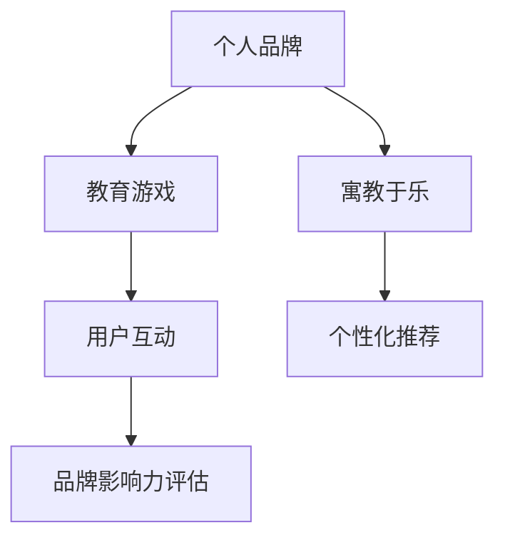

                 

# 开发个人品牌互动游戏：寓教于乐

> 关键词：个人品牌, 游戏开发, 教育游戏, 寓教于乐, 用户互动, 教学平台

## 1. 背景介绍

### 1.1 问题由来
在数字时代，个人品牌逐渐成为人们在互联网中的重要资产。个人品牌不仅代表了一个人的价值和能力，也是个人在职场、社交平台等多元场景下的形象体现。然而，随着社交网络内容的爆炸性增长，如何高效地塑造和推广个人品牌，已成为现代人需要面对的挑战。

教育游戏作为一种新兴的教育方式，通过游戏化的体验吸引用户参与，不仅能够提升学习效果，还能在娱乐中传递知识。近年来，伴随着技术的进步和游戏设计的创新，教育游戏在各个领域得到了广泛应用，从儿童教育到成人职业教育，从语言学习到职业培训，教育游戏已经逐渐成为教育和培训的重要工具。

个人品牌互动游戏，即通过游戏化手段，帮助用户提升自我品牌影响力，提升用户对于个人品牌的塑造能力。该类游戏融合了个人品牌塑造的诸多方面，如简历优化、社交媒体互动、影响力提升等，采用寓教于乐的方式，在用户参与互动的过程中，逐步提升其品牌影响力。

### 1.2 问题核心关键点
个人品牌互动游戏的设计与开发，主要需要解决以下几个关键问题：
1. **游戏机制设计**：如何设计有效的游戏机制，让用户在参与游戏的同时，能够自然地提升品牌影响力。
2. **数据驱动优化**：如何通过数据驱动的方式，不断优化游戏体验，提升用户参与度和满意度。
3. **互动性与社交性**：如何在游戏中实现用户之间的互动和社交，增强用户粘性。
4. **个性化推荐**：如何根据用户的行为和数据，进行个性化推荐，提升游戏体验。
5. **品牌影响力评估**：如何通过游戏机制和数据指标，量化用户的品牌影响力提升。

### 1.3 问题研究意义
开发个人品牌互动游戏，对于推动个人品牌塑造与传播，具有重要的意义：

1. **提升用户参与度**：通过游戏化的方式，使用户在娱乐中学习和成长，提升个人品牌的塑造能力。
2. **增强品牌影响力**：游戏能够利用社交网络和用户互动，将用户品牌传播到更广泛的人群中，提升品牌曝光度和影响力。
3. **培养用户习惯**：通过游戏化的奖励机制和用户互动，培养用户定期更新和维护个人品牌的习惯。
4. **降低推广成本**：游戏化体验能够吸引用户主动参与，减少品牌推广的金钱成本和时间成本。
5. **数据驱动决策**：通过数据分析和个性化推荐，使品牌推广更加精准和高效。

## 2. 核心概念与联系

### 2.1 核心概念概述

为了更好地理解个人品牌互动游戏的开发，本节将介绍几个密切相关的核心概念：

1. **个人品牌**：指个体在互联网中的标识和形象，包括简历、社交媒体账号、在线作品集等，是个人在数字世界中的“名片”。

2. **教育游戏**：以教育目的为核心的游戏设计，通过游戏化的体验，提升用户的学习效果和参与度。

3. **寓教于乐**：结合教育和娱乐，使学习过程变得有趣和有意义，提升学习效果和参与度。

4. **用户互动**：指用户之间或用户与系统之间的交互行为，是增强用户粘性和提升用户体验的重要手段。

5. **个性化推荐**：根据用户的行为和数据，推荐个性化的内容和活动，提升用户满意度。

6. **品牌影响力评估**：通过游戏机制和数据指标，量化用户品牌影响力的提升情况。

这些核心概念之间的逻辑关系可以通过以下Mermaid流程图来展示：



这个流程图展示了个体品牌塑造与游戏开发之间的逻辑关系：

1. 用户通过参与游戏，提升品牌塑造能力。
2. 游戏通过寓教于乐的方式，增强用户的学习效果。
3. 游戏设计注重用户互动，提升用户体验和粘性。
4. 利用个性化推荐，提升用户满意度和参与度。
5. 通过品牌影响力评估，量化用户品牌影响力的提升情况。

## 3. 核心算法原理 & 具体操作步骤
### 3.1 算法原理概述

个人品牌互动游戏的设计与开发，本质上是将教育游戏与个人品牌塑造相结合，通过游戏机制实现用户品牌影响力的提升。其核心思想是：通过游戏化设计，使用户在娱乐中学习和成长，同时提升其个人品牌塑造能力。

形式化地，假设游戏模型为 $G$，其中包含游戏规则、角色设定、互动机制等，用户为 $U$，品牌影响力为 $B$。游戏过程中，用户通过与游戏互动，积累经验值、解锁新成就、提升品牌影响力，其过程可以表示为：

$$
G(U) = B + E
$$

其中 $E$ 为用户的成长值和品牌提升值，通过游戏机制和数据驱动的优化不断积累。

### 3.2 算法步骤详解

个人品牌互动游戏的开发，一般包括以下几个关键步骤：

**Step 1: 游戏设计**
- 确定游戏目标和玩法，如简历优化、社交媒体互动、品牌宣传等。
- 设计游戏角色和任务，如用户选择不同职业路径，完成不同品牌塑造任务。
- 设计游戏奖励机制，如经验值、徽章、称号等，激励用户积极参与。

**Step 2: 数据驱动优化**
- 收集用户行为数据，如点击次数、互动频率、完成任务时间等。
- 通过数据分析，识别用户兴趣和需求，进行个性化推荐。
- 定期评估游戏体验，根据反馈优化游戏机制和内容。

**Step 3: 实现技术架构**
- 使用合适的游戏引擎，如Unity、Unreal Engine等，搭建游戏环境。
- 实现用户互动和品牌展示界面，支持用户上传和展示个人品牌内容。
- 实现数据存储和管理，支持用户数据备份和迁移。

**Step 4: 用户互动与社交**
- 实现用户注册和登录功能，支持多平台账号绑定。
- 设计用户互动机制，如用户评价、用户投票、用户评论等。
- 实现社交网络功能，支持用户分享和互动。

**Step 5: 品牌影响力评估**
- 设计品牌影响力指标，如关注度、互动量、分享量等。
- 根据用户互动数据，评估用户品牌影响力的提升情况。
- 提供可视化报告，帮助用户了解品牌影响力变化。

### 3.3 算法优缺点

个人品牌互动游戏的设计与开发，具有以下优点：
1. 提升用户参与度：通过游戏化的方式，使用户在娱乐中学习和成长，提升品牌塑造能力。
2. 增强品牌影响力：游戏能够利用社交网络和用户互动，将用户品牌传播到更广泛的人群中，提升品牌曝光度和影响力。
3. 培养用户习惯：通过游戏化的奖励机制和用户互动，培养用户定期更新和维护个人品牌的习惯。
4. 降低推广成本：游戏化体验能够吸引用户主动参与，减少品牌推广的金钱成本和时间成本。
5. 数据驱动决策：通过数据分析和个性化推荐，使品牌推广更加精准和高效。

同时，该方法也存在一定的局限性：
1. 开发周期较长：游戏设计、开发、测试、优化等环节较为复杂，开发周期较长。
2. 技术要求较高：需要专业的游戏设计和开发团队，技术要求较高。
3. 用户粘性依赖：游戏设计的趣味性和互动性对用户粘性有较大依赖，需要不断迭代和优化。
4. 数据隐私风险：用户数据的收集、存储和处理需要严格遵守数据隐私政策，避免数据泄露风险。

尽管存在这些局限性，但就目前而言，个人品牌互动游戏的设计与开发，仍是大品牌推广的重要手段。未来相关研究的重点在于如何进一步降低开发成本，提高游戏趣味性和互动性，同时兼顾数据隐私和安全因素。

### 3.4 算法应用领域

个人品牌互动游戏已经在游戏化教育、职业培训、企业内训等多个领域得到了广泛应用，效果显著。以下是几个典型的应用场景：

- **简历优化游戏**：通过游戏机制，帮助用户提升简历制作水平，增加求职成功率。
- **社交媒体互动游戏**：通过互动游戏，增强用户社交媒体上的品牌曝光度和影响力。
- **品牌宣传游戏**：通过品牌相关游戏，提升品牌曝光度和用户粘性。
- **职业培训游戏**：通过游戏化的职业培训，提升员工职业技能和职业素养。
- **教育游戏**：通过寓教于乐的方式，提升学生学习兴趣和效果，同时帮助学生提升品牌塑造能力。

除了这些经典场景外，个人品牌互动游戏还被创新性地应用到更多领域，如个人品牌形象设计、社交网络行为模拟等，为品牌推广提供了新的思路和工具。

## 4. 数学模型和公式 & 详细讲解  
### 4.1 数学模型构建

本节将使用数学语言对个人品牌互动游戏的开发过程进行更加严格的刻画。

记游戏模型为 $G$，其中 $A$ 为游戏目标，$U$ 为游戏用户，$B$ 为品牌影响力，$E$ 为用户的成长值和品牌提升值。目标函数为：

$$
G(U) = \max_{U, B} \{A + B + E\}
$$

其中 $A$ 为目标值，$B$ 为品牌影响力，$E$ 为用户成长值和品牌提升值，通过游戏机制和数据驱动的优化不断积累。

### 4.2 公式推导过程

以下我们以简历优化游戏为例，推导游戏体验与品牌影响力提升的数学模型。

假设简历优化游戏包含以下目标：
1. 简历内容优化：用户填写不同职业路径的简历信息。
2. 技能提升：用户通过完成职业相关的技能测试，提升简历技能等级。
3. 品牌展示：用户上传和展示个人品牌内容，提升品牌曝光度。

设用户 $U$ 完成 $k$ 次职业路径选择，完成 $n$ 次技能测试，上传 $m$ 次个人品牌内容，品牌影响力 $B$ 定义为：

$$
B = \alpha_1 \cdot (\text{简历曝光度}) + \alpha_2 \cdot (\text{品牌互动量}) + \alpha_3 \cdot (\text{技能等级})
$$

其中 $\alpha_1$、$\alpha_2$、$\alpha_3$ 为不同品牌影响因素的权重。用户成长值 $E$ 定义为：

$$
E = \beta_1 \cdot (\text{完成职业选择次数}) + \beta_2 \cdot (\text{完成技能测试次数}) + \beta_3 \cdot (\text{上传品牌内容次数})
$$

其中 $\beta_1$、$\beta_2$、$\beta_3$ 为不同成长因素的权重。目标函数为：

$$
G(U) = \max_{U, B} \{\text{游戏目标值} + B + E\}
$$

根据以上公式，我们通过优化 $k$、$n$、$m$ 等变量，最大化 $G(U)$，即通过游戏机制和数据驱动的优化，提升用户的品牌影响力和成长值。

### 4.3 案例分析与讲解

**案例分析**：某在线教育平台推出了个人品牌提升游戏，帮助用户提升简历和社交媒体上的品牌影响力。游戏主要包含以下环节：

1. **职业选择**：用户在游戏中选择不同的职业路径，完成相应的职业测试和培训。
2. **技能测试**：用户通过完成技能测试，提升简历的技能等级和相关度。
3. **品牌展示**：用户上传和展示个人品牌内容，如简历、作品集等，增强品牌曝光度。
4. **互动投票**：用户通过社交网络的互动投票，提升品牌影响力。

**讲解**：游戏设计通过数据驱动的方式，不断优化用户参与体验。具体步骤如下：

1. **数据收集**：游戏收集用户选择职业、完成测试、上传内容、互动投票等行为数据。
2. **数据分析**：通过数据挖掘和机器学习算法，识别用户的兴趣和需求，进行个性化推荐。
3. **反馈优化**：根据用户反馈，不断优化游戏机制和内容，提升用户参与度和满意度。
4. **品牌评估**：利用品牌影响力指标，量化用户品牌影响力的提升情况，提供可视化报告。

通过数据分析和个性化推荐，该游戏能够更好地提升用户品牌塑造能力和品牌影响力。

## 5. 项目实践：代码实例和详细解释说明
### 5.1 开发环境搭建

在进行个人品牌互动游戏开发前，我们需要准备好开发环境。以下是使用Python进行游戏开发的环境配置流程：

1. 安装Anaconda：从官网下载并安装Anaconda，用于创建独立的Python环境。

2. 创建并激活虚拟环境：
```bash
conda create -n game-env python=3.8 
conda activate game-env
```

3. 安装游戏开发框架：如Pygame、Panda3D、Unity3D等，选择适合的开发工具。

4. 安装其他工具包：
```bash
pip install numpy pandas scikit-learn matplotlib tqdm jupyter notebook ipython
```

完成上述步骤后，即可在`game-env`环境中开始游戏开发。

### 5.2 源代码详细实现

这里我们以Python的Pygame库为例，开发一个简单的简历优化游戏。

首先，定义游戏的初始状态和界面：

```python
import pygame
import sys

pygame.init()

screen = pygame.display.set_mode((800, 600))
pygame.display.set_caption('Resume Optimization Game')

class Game:
    def __init__(self):
        self.clock = pygame.time.Clock()
        self.playing = True
        
    def run(self):
        while self.playing:
            self.events()
            self.update()
            self.draw()
            self.clock.tick(60)
    
    def events(self):
        for event in pygame.event.get():
            if event.type == pygame.QUIT:
                self.playing = False
            elif event.type == pygame.KEYDOWN:
                if event.key == pygame.K_ESCAPE:
                    self.playing = False
```

然后，定义游戏的游戏循环：

```python
class Game:
    def __init__(self):
        self.clock = pygame.time.Clock()
        self.playing = True
        
    def run(self):
        while self.playing:
            self.events()
            self.update()
            self.draw()
            self.clock.tick(60)
    
    def events(self):
        for event in pygame.event.get():
            if event.type == pygame.QUIT:
                self.playing = False
            elif event.type == pygame.KEYDOWN:
                if event.key == pygame.K_ESCAPE:
                    self.playing = False
```

接着，实现游戏的交互逻辑：

```python
class Game:
    def __init__(self):
        self.clock = pygame.time.Clock()
        self.playing = True
        
    def run(self):
        while self.playing:
            self.events()
            self.update()
            self.draw()
            self.clock.tick(60)
    
    def events(self):
        for event in pygame.event.get():
            if event.type == pygame.QUIT:
                self.playing = False
            elif event.type == pygame.KEYDOWN:
                if event.key == pygame.K_ESCAPE:
                    self.playing = False
```

最后，启动游戏并运行：

```python
if __name__ == "__main__":
    game = Game()
    game.run()
    pygame.quit()
    sys.exit()
```

以上就是使用Pygame开发一个简单的简历优化游戏的完整代码实现。可以看到，通过Pygame库的封装，我们可以用相对简洁的代码实现游戏的基本功能。

### 5.3 代码解读与分析

让我们再详细解读一下关键代码的实现细节：

**Game类**：
- `__init__`方法：初始化游戏时钟、游戏状态等。
- `run`方法：游戏循环，不断处理事件、更新状态、绘制界面，保持游戏运行。
- `events`方法：处理用户输入事件，如窗口关闭、按键等。

**事件处理**：
- 游戏循环中，使用`pygame.event.get()`获取所有事件，判断是否为窗口关闭或按键事件。
- 根据事件类型，分别处理不同操作，如关闭窗口、退出游戏等。

**绘图功能**：
- 游戏绘图功能需要进一步实现，如显示游戏界面、绘制职业路径选择、技能测试等。

**用户交互**：
- 需要添加用户交互逻辑，如选择职业路径、完成技能测试、上传简历等。
- 需要添加品牌影响力评估机制，如计算品牌曝光度、互动量等。

**数据驱动优化**：
- 需要收集用户行为数据，利用数据分析和机器学习算法进行个性化推荐。
- 需要定期评估游戏体验，根据用户反馈优化游戏机制和内容。

可以看到，虽然通过Pygame库可以快速实现游戏的骨架，但要开发一个完整、有趣的个人品牌互动游戏，还需要进一步的迭代和优化。

## 6. 实际应用场景
### 6.1 智能客服系统

个人品牌互动游戏，可以应用于智能客服系统的构建。通过游戏化的方式，提高客户对客服的互动参与度，增强客服的个性化服务能力，提升客户满意度和忠诚度。

在游戏设计中，可以模拟客服场景，用户选择不同的服务选项，完成相应的任务，获得相应的成就和奖励。用户通过与客服的互动，逐步提升其品牌影响力，如增加关注量、分享量等。客服系统可以根据用户互动数据，进行个性化推荐和反馈优化，提升服务质量。

### 6.2 金融舆情监测

金融机构需要实时监测市场舆论动向，以便及时应对负面信息传播，规避金融风险。传统的人工监测方式成本高、效率低，难以应对网络时代海量信息爆发的挑战。

通过个人品牌互动游戏，可以增强用户在社交媒体上的品牌曝光度和影响力，从而提升其舆情监测能力。在游戏设计中，用户可以模拟不同的舆情监测场景，如舆情分析、舆情预测等，通过完成相应的任务，获得相应的成就和奖励。游戏可以根据用户互动数据，进行个性化推荐和反馈优化，提升舆情监测的准确性和及时性。

### 6.3 个性化推荐系统

当前的推荐系统往往只依赖用户的历史行为数据进行物品推荐，无法深入理解用户的真实兴趣偏好。通过个人品牌互动游戏，可以更好地挖掘用户行为背后的语义信息，从而提供更精准、多样的推荐内容。

在游戏设计中，用户可以通过选择不同的物品，完成相应的任务，获得相应的成就和奖励。游戏可以根据用户互动数据，进行个性化推荐和反馈优化，提升推荐系统的精准性和用户满意度。

### 6.4 未来应用展望

随着技术的进步和游戏设计的创新，个人品牌互动游戏将在更多领域得到应用，为个人品牌塑造与传播带来新的契机。

在智慧医疗领域，通过个人品牌互动游戏，医生可以提升病患的病历记录和健康管理能力，增强医患互动，提升医疗服务质量。

在智能教育领域，通过个人品牌互动游戏，学生可以在娱乐中学习和成长，提升学习效果，同时帮助学生提升品牌塑造能力。

在智慧城市治理中，通过个人品牌互动游戏，市民可以提升参与城市治理的热情和能力，增强市民对城市政策的理解和反馈，提升城市治理的透明度和效率。

此外，在企业培训、旅游引导、文化宣传等众多领域，个人品牌互动游戏也将不断涌现，为品牌推广提供新的思路和工具。相信随着技术的日益成熟，个人品牌互动游戏必将在构建人机协同的智能时代中扮演越来越重要的角色。

## 7. 工具和资源推荐
### 7.1 学习资源推荐

为了帮助开发者系统掌握个人品牌互动游戏的开发，这里推荐一些优质的学习资源：

1. **《Unity3D游戏开发实战》**：介绍了Unity3D游戏引擎的基本概念和开发流程，适合初学者入门。
2. **《Python游戏编程》**：详细讲解了使用Pygame、PyOpenGL等工具进行游戏开发的技巧和方法。
3. **《游戏设计基础》**：涵盖游戏设计的基本原理和设计方法，适合游戏开发人员参考。
4. **《数据驱动的个性化推荐系统》**：介绍了数据分析和个性化推荐算法的原理和实现，适合开发个人品牌互动游戏的开发者参考。

通过这些资源的学习实践，相信你一定能够快速掌握个人品牌互动游戏的开发技巧，并用于解决实际的NLP问题。

### 7.2 开发工具推荐

高效的开发离不开优秀的工具支持。以下是几款用于个人品牌互动游戏开发的常用工具：

1. **Unity3D**：由Unity Technologies开发的游戏引擎，支持3D渲染和互动，适合开发高质量的游戏。
2. **Unreal Engine**：由Epic Games开发的游戏引擎，支持实时渲染和物理模拟，适合开发大型游戏。
3. **Pygame**：Python语言的2D游戏开发库，简单易用，适合初学者进行游戏开发。
4. **Panda3D**：Python语言的3D游戏开发库，支持高级图形渲染和物理模拟，适合开发3D游戏。
5. **JMonkeyEngine**：基于Java语言的游戏引擎，支持跨平台开发，适合开发高性能的游戏。

合理利用这些工具，可以显著提升个人品牌互动游戏的开发效率，加快创新迭代的步伐。

### 7.3 相关论文推荐

个人品牌互动游戏的发展，得益于学界的持续研究。以下是几篇奠基性的相关论文，推荐阅读：

1. **《个性化推荐系统的研究与实现》**：介绍了个性化推荐系统的基本原理和实现方法，适合开发个性化推荐系统的开发者参考。
2. **《游戏化学习的设计与评估》**：探讨了游戏化学习的理论基础和设计方法，适合教育游戏开发者参考。
3. **《基于游戏化的品牌推广研究》**：介绍了游戏化品牌推广的基本原理和实现方法，适合品牌推广开发者参考。
4. **《数据驱动的个性化推荐系统》**：介绍了数据分析和个性化推荐算法的原理和实现，适合开发个性化推荐系统的开发者参考。
5. **《智能客服系统的设计与实现》**：介绍了智能客服系统的基本原理和实现方法，适合智能客服开发者参考。

这些论文代表了大品牌互动游戏的开发研究脉络。通过学习这些前沿成果，可以帮助研究者把握学科前进方向，激发更多的创新灵感。

## 8. 总结：未来发展趋势与挑战

### 8.1 总结

本文对个人品牌互动游戏的开发进行了全面系统的介绍。首先阐述了个人品牌互动游戏的设计与开发背景，明确了游戏在个人品牌塑造和传播中的独特价值。其次，从原理到实践，详细讲解了游戏设计、数据驱动优化、互动性、品牌影响力评估等关键技术，给出了游戏开发的基本代码实现。同时，本文还广泛探讨了游戏在智能客服、金融舆情监测、个性化推荐等多个行业领域的应用前景，展示了游戏范式的巨大潜力。此外，本文精选了游戏开发的各种学习资源，力求为开发者提供全方位的技术指引。

通过本文的系统梳理，可以看到，个人品牌互动游戏正在成为品牌推广的重要手段，极大地拓展了品牌塑造和传播的想象空间。借助游戏化的方式，品牌推广能够更加高效、灵活、有趣，吸引更多用户的参与和互动。未来，伴随游戏设计理念的不断创新，个人品牌互动游戏必将在更多领域得到应用，为品牌推广提供新的思路和工具。

### 8.2 未来发展趋势

展望未来，个人品牌互动游戏的发展趋势将呈现以下几个方向：

1. **技术融合**：随着人工智能、大数据、区块链等技术的进步，游戏设计将进一步融合更多前沿技术，提升游戏的智能化和互动性。
2. **用户粘性增强**：通过更加丰富的互动和社交功能，增强用户的粘性，提升用户体验和满意度。
3. **跨平台发展**：游戏将支持更多平台和设备，提升游戏的可访问性和用户覆盖面。
4. **个性化推荐优化**：通过更精确的数据分析，进行更个性化的推荐，提升用户满意度和转化率。
5. **用户隐私保护**：随着数据隐私问题的日益凸显，游戏设计将更加注重用户隐私保护，增强用户信任感。
6. **多场景应用拓展**：游戏将更多地应用于教育、医疗、金融、政府等领域，提升各行业的数字化和智能化水平。

这些趋势凸显了个人品牌互动游戏的广阔前景，预示着游戏在品牌推广中的重要地位。这些方向的探索发展，必将进一步提升品牌推广的效果和用户满意度，推动品牌塑造和传播进入新纪元。

### 8.3 面临的挑战

尽管个人品牌互动游戏具有诸多优点，但在实际应用过程中，仍面临一些挑战：

1. **技术门槛较高**：个人品牌互动游戏的开发需要较强的技术实力和资源投入，非专业团队难以完成高质量的游戏开发。
2. **用户粘性依赖**：游戏设计的趣味性和互动性对用户粘性有较大依赖，需要不断迭代和优化。
3. **数据隐私风险**：用户数据的收集、存储和处理需要严格遵守数据隐私政策，避免数据泄露风险。
4. **成本控制**：游戏开发和运营需要较高的成本投入，对于中小企业可能存在经济压力。
5. **市场竞争**：品牌推广市场竞争激烈，需要不断创新和优化，才能保持竞争力。

尽管存在这些挑战，但通过不断优化技术、降低成本、提升用户体验，个人品牌互动游戏必将在品牌推广中发挥更大作用。未来相关研究的重点在于如何进一步降低技术门槛，提高游戏趣味性和互动性，同时兼顾数据隐私和安全因素。

### 8.4 研究展望

面对个人品牌互动游戏所面临的挑战，未来的研究需要在以下几个方面寻求新的突破：

1. **无监督学习和生成对抗网络(GAN)**：利用无监督学习和生成对抗网络等技术，降低对标注数据的依赖，实现更高效的游戏开发。
2. **跨平台游戏引擎**：开发跨平台的游戏引擎，支持多平台和设备的开发和部署，提升游戏的可访问性和用户覆盖面。
3. **用户数据隐私保护**：在用户数据收集和处理过程中，引入隐私保护技术，如数据匿名化、差分隐私等，确保用户数据的安全性和隐私性。
4. **用户行为分析**：通过数据分析和机器学习算法，识别用户行为背后的语义信息，进行更个性化的推荐，提升用户满意度。
5. **游戏设计的可扩展性**：设计可扩展的游戏引擎和框架，支持更多类型的游戏和应用场景，提升游戏的多样性和覆盖面。

这些研究方向的探索，必将引领个人品牌互动游戏技术迈向更高的台阶，为品牌推广提供更加智能化、个性化的工具和平台。面向未来，个人品牌互动游戏需要与其他人工智能技术进行更深入的融合，如知识表示、因果推理、强化学习等，多路径协同发力，共同推动品牌推广技术的进步。

## 9. 附录：常见问题与解答

**Q1：如何设计有趣且富有挑战性的个人品牌互动游戏？**

A: 设计有趣且富有挑战性的个人品牌互动游戏，可以从以下几个方面入手：

1. **游戏机制设计**：引入有趣的挑战任务，如职业选择、技能测试、品牌展示等，设计合理的成就和奖励机制，提升用户参与度。
2. **故事线设计**：构建吸引人的游戏故事线，让用户在游戏过程中获得沉浸式体验，增强用户粘性。
3. **社交互动**：设计用户互动和社交功能，如评论、点赞、分享等，增强用户之间的互动，提升游戏趣味性。
4. **个性化推荐**：根据用户行为和数据，进行个性化推荐，提升用户体验和满意度。
5. **反馈优化**：定期收集用户反馈，不断优化游戏机制和内容，提升用户满意度。

通过以上方法，可以设计出既有教育意义又富有娱乐性的个人品牌互动游戏。

**Q2：如何衡量个人品牌互动游戏的用户满意度？**

A: 衡量个人品牌互动游戏的用户满意度，可以通过以下指标：

1. **用户参与度**：衡量用户在游戏中的参与时间和频率，可以通过统计用户互动次数、任务完成率等数据。
2. **用户粘性**：衡量用户在游戏中的持续互动时间和频率，可以通过统计用户留存率和活跃度等数据。
3. **用户反馈**：通过问卷调查、用户评价等方式，收集用户对游戏的意见和建议，了解用户满意度和改进方向。
4. **品牌影响力提升**：通过品牌影响力指标，如关注度、互动量、分享量等，量化用户品牌影响力的提升情况。
5. **用户转化率**：衡量用户从游戏到实际品牌推广的转化率，可以通过统计用户品牌展示量、分享量等数据。

通过综合以上指标，可以全面衡量个人品牌互动游戏的用户满意度，不断优化游戏设计和用户体验。

**Q3：如何优化个人品牌互动游戏的互动性？**

A: 优化个人品牌互动游戏的互动性，可以从以下几个方面入手：

1. **社交互动设计**：设计用户之间的互动和社交功能，如评论、点赞、分享等，增强用户之间的互动和粘性。
2. **个性化推荐**：根据用户行为和数据，进行个性化推荐，提升用户体验和满意度。
3. **实时互动**：利用实时通信技术，实现用户之间的实时互动，增强游戏趣味性。
4. **奖励机制设计**：设计合理的成就和奖励机制，提升用户参与度和满意度。
5. **游戏故事线**：构建吸引人的游戏故事线，让用户在游戏过程中获得沉浸式体验，增强用户粘性。

通过以上方法，可以提升个人品牌互动游戏的互动性，吸引更多用户的参与和互动。

**Q4：如何优化个人品牌互动游戏的用户留存率？**

A: 优化个人品牌互动游戏的用户留存率，可以从以下几个方面入手：

1. **游戏设计优化**：设计有趣且富有挑战性的游戏任务和成就，提升用户参与度和满意度。
2. **个性化推荐**：根据用户行为和数据，进行个性化推荐，提升用户体验和满意度。
3. **社交互动设计**：设计用户之间的互动和社交功能，增强用户之间的互动和粘性。
4. **用户反馈机制**：定期收集用户反馈，不断优化游戏机制和内容，提升用户满意度。
5. **游戏故事线**：构建吸引人的游戏故事线，让用户在游戏过程中获得沉浸式体验，增强用户粘性。

通过以上方法，可以优化个人品牌互动游戏的用户留存率，提升游戏长期效果。

---

作者：禅与计算机程序设计艺术 / Zen and the Art of Computer Programming

