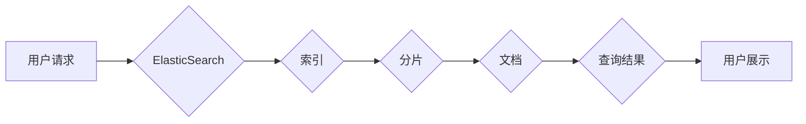

ElasticSearch, Document, Index, Shard, Lucene, JSON, Query, Search, Full-Text Search

## 1. 背景介绍

ElasticSearch 作为一款开源的分布式搜索和分析引擎，在海量数据搜索、分析和可视化方面展现出强大的能力。其核心是基于 Lucene 的全文检索技术，能够高效地处理海量文本数据。ElasticSearch 的数据存储和检索方式与传统数据库有所不同，它采用了一种基于文档的模型，将数据存储为 JSON 格式的文档，并将其组织到索引中。

## 2. 核心概念与联系

ElasticSearch 的核心概念包括：

* **索引 (Index):** 索引类似于数据库中的表，用于组织和存储文档。每个索引包含多个分片。
* **分片 (Shard):** 分片是索引的物理分片，数据被均匀地分布到不同的分片中。分片可以分布在不同的节点上，实现数据并行处理和高可用性。
* **文档 (Document):** 文档是 ElasticSearch 中的基本数据单元，存储为 JSON 格式的字符串。每个文档包含一系列字段，每个字段包含一个值。
* **字段 (Field):** 字段是文档中数据的属性，例如标题、内容、作者等。每个字段可以定义不同的数据类型，例如文本、数字、日期等。

**Mermaid 流程图:**



## 3. 核心算法原理 & 具体操作步骤

### 3.1  算法原理概述

ElasticSearch 的核心算法基于 Lucene，它使用倒排索引和 BM25 算法实现高效的全文检索。

* **倒排索引:** 倒排索引是一种数据结构，用于快速查找包含特定词条的文档。它将词条映射到包含该词条的文档列表中。
* **BM25 算法:** BM25 算法是一种用于计算查询词条与文档的相关性的算法。它考虑了词条的频率、文档长度等因素，并返回一个分数，表示查询词条与文档的相关程度。

### 3.2  算法步骤详解

1. **数据分词:** 将文本数据拆分成单个词条。
2. **构建倒排索引:** 将每个词条映射到包含该词条的文档列表中。
3. **查询处理:** 当用户提交查询时，ElasticSearch 会将查询词条转换为倒排索引，并根据 BM25 算法计算查询词条与文档的相关性分数。
4. **结果排序:** 根据相关性分数对查询结果进行排序，并返回给用户。

### 3.3  算法优缺点

**优点:**

* 高效的全文检索能力
* 支持多种数据类型
* 分布式架构，可扩展性强

**缺点:**

* 对结构化数据处理能力有限
* 查询复杂度较高

### 3.4  算法应用领域

ElasticSearch 的核心算法广泛应用于以下领域:

* 搜索引擎
* 数据分析
* 监控和日志分析
* 欺诈检测
* 个性化推荐

## 4. 数学模型和公式 & 详细讲解 & 举例说明

### 4.1  数学模型构建

BM25 算法的核心是计算查询词条与文档的相关性分数。该算法基于以下数学模型:

$$
score(q, d) = \sum_{t \in q} \frac{tf(t, d) \cdot idf(t) \cdot (k_1 + 1)}{tf(t, d) + k_1 \cdot (1 - b + b \cdot \frac{dl}{avgdl})}
$$

其中:

* $q$ 是查询词条
* $d$ 是文档
* $t$ 是查询词条或文档中的词条
* $tf(t, d)$ 是词条 $t$ 在文档 $d$ 中的频率
* $idf(t)$ 是词条 $t$ 的逆向文档频率
* $k_1$ 和 $b$ 是 BM25 算法中的两个参数
* $dl$ 是文档 $d$ 的长度
* $avgdl$ 是所有文档的平均长度

### 4.2  公式推导过程

BM25 算法的公式推导过程比较复杂，涉及到信息检索理论和统计学知识。

### 4.3  案例分析与讲解

假设我们有一个查询词条 "ElasticSearch"，以及一个文档包含以下内容:

"ElasticSearch 是一个开源的分布式搜索和分析引擎。"

我们可以使用 BM25 算法计算查询词条与文档的相关性分数。

## 5. 项目实践：代码实例和详细解释说明

### 5.1  开发环境搭建

ElasticSearch 的安装和配置过程比较简单，可以参考官方文档进行操作。

### 5.2  源代码详细实现

```python
from elasticsearch import Elasticsearch

# 连接 ElasticSearch 服务器
es = Elasticsearch([{'host': 'localhost', 'port': 9200}])

# 创建索引
es.indices.create(index='my_index', ignore=400)

# 创建文档
doc = {
    'title': 'ElasticSearch 文档',
    'content': 'ElasticSearch 是一个开源的分布式搜索和分析引擎。'
}
es.index(index='my_index', doc_type='_doc', body=doc)

# 查询文档
query = {
    'query': {
        'match': {
            'content': 'ElasticSearch'
        }
    }
}
results = es.search(index='my_index', body=query)

# 打印查询结果
print(results['hits']['hits'])
```

### 5.3  代码解读与分析

这段代码演示了如何使用 Python 库 `elasticsearch` 连接 ElasticSearch 服务器，创建索引，添加文档，并执行查询操作。

### 5.4  运行结果展示

运行这段代码后，会打印出包含匹配查询词条 "ElasticSearch" 的文档列表。

## 6. 实际应用场景

ElasticSearch 在各种实际应用场景中发挥着重要作用，例如:

* **搜索引擎:** ElasticSearch 可以构建高效的搜索引擎，支持全文检索、过滤、排序等功能。
* **日志分析:** ElasticSearch 可以收集和分析海量日志数据，帮助用户快速定位问题和进行故障诊断。
* **监控和告警:** ElasticSearch 可以监控系统性能指标，并根据预设规则发送告警通知。
* **数据可视化:** ElasticSearch 可以与 Kibana 等数据可视化工具集成，生成各种图表和报表，帮助用户洞察数据趋势。

### 6.4  未来应用展望

随着大数据和人工智能技术的快速发展，ElasticSearch 的应用场景将更加广泛。未来，ElasticSearch 可能在以下领域发挥更大的作用:

* **机器学习:** ElasticSearch 可以与机器学习算法集成，实现数据分析、预测和推荐等功能。
* **物联网:** ElasticSearch 可以处理海量物联网数据，帮助用户进行设备监控、故障诊断和数据分析。
* **云计算:** ElasticSearch 可以部署在云平台上，提供弹性、可扩展的搜索和分析服务。

## 7. 工具和资源推荐

### 7.1  学习资源推荐

* ElasticSearch 官方文档: https://www.elastic.co/guide/en/elasticsearch/reference/current/index.html
* ElasticSearch 中文社区: https://www.elastic.co/cn/community

### 7.2  开发工具推荐

* Elasticsearch Python Client: https://elasticsearch-py.readthedocs.io/en/master/
* Kibana: https://www.elastic.co/products/kibana

### 7.3  相关论文推荐

* Elasticsearch: A Scalable, Distributed Search Engine
* BM25: A Function for Ranking Search Results

## 8. 总结：未来发展趋势与挑战

### 8.1  研究成果总结

ElasticSearch 作为一款成熟的搜索和分析引擎，已经取得了显著的成果。其基于 Lucene 的全文检索技术、分布式架构和丰富的功能，使其在海量数据处理方面展现出强大的能力。

### 8.2  未来发展趋势

ElasticSearch 的未来发展趋势包括:

* **更强大的机器学习功能:** ElasticSearch 将进一步集成机器学习算法，实现数据分析、预测和推荐等功能。
* **更完善的云原生支持:** ElasticSearch 将更加注重云原生架构，提供更弹性、可扩展的搜索和分析服务。
* **更丰富的应用场景:** ElasticSearch 将应用于更多领域，例如物联网、金融、医疗等。

### 8.3  面临的挑战

ElasticSearch 也面临一些挑战，例如:

* **数据安全:** 如何保障海量数据的安全性和隐私性。
* **性能优化:** 如何进一步提升 ElasticSearch 的性能，应对海量数据处理的需求。
* **生态系统建设:** 如何构建更完善的 ElasticSearch 生态系统，吸引更多开发者和用户。

### 8.4  研究展望

未来，ElasticSearch 将继续朝着更强大、更智能、更安全的方向发展。研究者们将继续探索新的算法、架构和应用场景，推动 ElasticSearch 在数据处理领域取得更大的突破。

## 9. 附录：常见问题与解答

### 9.1  常见问题

* ElasticSearch 和 MySQL 的区别是什么？
* 如何配置 ElasticSearch 的分片和副本？
* 如何使用 Kibana 进行数据可视化？

### 9.2  解答

* ElasticSearch 和 MySQL 都是数据存储系统，但 ElasticSearch 专注于全文检索和分析，而 MySQL 是关系型数据库，更适合存储结构化数据。
* 分片和副本是 ElasticSearch 的核心概念，用于实现数据并行处理和高可用性。可以通过配置文件或 API 进行配置。
* Kibana 是 ElasticSearch 的数据可视化工具，可以生成各种图表和报表，帮助用户洞察数据趋势。

作者：禅与计算机程序设计艺术 / Zen and the Art of Computer Programming


<end_of_turn>