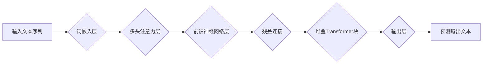

> GPT-3.5, 大语言模型, Transformer, 序列到序列, 自然语言处理, 代码生成

## 1. 背景介绍

近年来，深度学习技术取得了飞速发展，特别是生成式预训练语言模型（Generative Pre-trained Transformer，GPT）的出现，为自然语言处理（NLP）领域带来了革命性的变革。GPT系列模型，例如GPT-3.5，凭借其强大的文本生成能力，在文本摘要、机器翻译、对话系统等领域展现出令人瞩目的应用潜力。

GPT-3.5是OpenAI开发的下一代大型语言模型，其参数量更大、训练数据更丰富，能够生成更流畅、更符合语义的文本。本文将深入探讨GPT-3.5的原理、核心算法、数学模型以及代码实例，帮助读者理解其工作机制并掌握其应用技巧。

## 2. 核心概念与联系

GPT-3.5基于Transformer架构，其核心概念包括：

* **自注意力机制（Self-Attention）:**  允许模型在处理文本序列时，关注不同词语之间的关系，捕捉长距离依赖关系。
* **多头注意力（Multi-Head Attention）:**  通过使用多个注意力头，可以从不同角度捕捉词语之间的关系，提高模型的表达能力。
* **位置编码（Positional Encoding）:**  由于Transformer模型没有循环结构，无法直接感知词语的顺序信息，因此需要使用位置编码来嵌入词语的位置信息。
* **前馈神经网络（Feed-Forward Network）:**  在每个Transformer块中，使用前馈神经网络对每个词语的表示进行进一步的变换。

**Mermaid 流程图:**



## 3. 核心算法原理 & 具体操作步骤

### 3.1  算法原理概述

GPT-3.5采用自回归语言模型（Autoregressive Language Model）的原理，即根据输入序列的上下文信息，预测下一个词语。其训练过程可以概括为以下步骤：

1. **词嵌入:** 将输入文本序列中的每个词语映射到一个低维向量空间中，称为词嵌入。
2. **Transformer编码:** 使用多层Transformer编码器对词嵌入进行编码，捕捉词语之间的上下文关系。
3. **输出层:** 使用线性层和softmax函数，将编码后的文本表示映射到词汇表中每个词语的概率分布。
4. **损失函数:** 使用交叉熵损失函数，计算模型预测结果与真实标签之间的差异。
5. **反向传播:** 使用梯度下降算法，更新模型参数，降低损失函数的值。

### 3.2  算法步骤详解

1. **数据预处理:** 将原始文本数据进行清洗、分词、标记等预处理操作，生成训练数据。
2. **模型初始化:** 初始化模型参数，例如词嵌入矩阵、Transformer编码器参数等。
3. **训练过程:**
    * 将训练数据输入模型，计算模型输出的概率分布。
    * 使用交叉熵损失函数计算模型预测结果与真实标签之间的差异。
    * 使用梯度下降算法更新模型参数，降低损失函数的值。
4. **模型评估:** 在验证集上评估模型的性能，例如困惑度（Perplexity）等指标。
5. **模型保存:** 保存训练好的模型参数。

### 3.3  算法优缺点

**优点:**

* **强大的文本生成能力:** GPT-3.5能够生成流畅、自然、符合语义的文本。
* **可迁移性强:** 预训练模型可以应用于多种下游任务，例如文本摘要、机器翻译、对话系统等。
* **参数量大:** 大量的参数使得模型能够学习更复杂的语言模式。

**缺点:**

* **训练成本高:** 训练GPT-3.5需要大量的计算资源和时间。
* **数据依赖性强:** 模型性能依赖于训练数据的质量和数量。
* **存在偏差和偏见:** 模型可能继承训练数据中的偏差和偏见。

### 3.4  算法应用领域

GPT-3.5在以下领域具有广泛的应用前景：

* **文本生成:** 文本摘要、文章创作、故事生成、诗歌创作等。
* **机器翻译:** 将一种语言翻译成另一种语言。
* **对话系统:** 开发更自然、更智能的聊天机器人。
* **代码生成:** 根据自然语言描述生成代码。
* **问答系统:** 回答用户提出的问题。

## 4. 数学模型和公式 & 详细讲解 & 举例说明

### 4.1  数学模型构建

GPT-3.5的核心数学模型是Transformer架构，其主要包含以下组件：

* **词嵌入层:** 将每个词语映射到一个低维向量空间中，例如Word2Vec或GloVe。
* **多头注意力层:** 计算每个词语与其他词语之间的注意力权重，捕捉词语之间的关系。
* **前馈神经网络层:** 对每个词语的表示进行进一步的变换。
* **位置编码层:** 嵌入词语的位置信息。
* **输出层:** 使用线性层和softmax函数，将编码后的文本表示映射到词汇表中每个词语的概率分布。

### 4.2  公式推导过程

**多头注意力机制:**

$$
Attention(Q, K, V) = \text{softmax}\left(\frac{QK^T}{\sqrt{d_k}}\right)V
$$

其中：

* $Q$, $K$, $V$ 分别代表查询矩阵、键矩阵和值矩阵。
* $d_k$ 代表键向量的维度。

**前馈神经网络层:**

$$
FFN(x) = \max(0, xW_1 + b_1)W_2 + b_2
$$

其中：

* $x$ 代表输入向量。
* $W_1$, $W_2$ 代表权重矩阵。
* $b_1$, $b_2$ 代表偏置项。

### 4.3  案例分析与讲解

假设我们有一个句子“The cat sat on the mat”，使用多头注意力机制计算每个词语与其他词语之间的注意力权重。

* 查询矩阵 $Q$ 会包含每个词语的表示向量。
* 键矩阵 $K$ 和值矩阵 $V$ 也包含每个词语的表示向量。
* 通过计算 $QK^T$，得到每个词语与其他词语之间的相似度得分。
* 使用 softmax 函数将得分归一化，得到每个词语与其他词语之间的注意力权重。

通过分析注意力权重，我们可以发现哪些词语对其他词语的影响更大，从而更好地理解句子的语义关系。

## 5. 项目实践：代码实例和详细解释说明

### 5.1  开发环境搭建

* Python 3.7+
* PyTorch 1.7+
* CUDA 10.2+ (可选，用于GPU加速)

### 5.2  源代码详细实现

```python
import torch
import torch.nn as nn

class TransformerBlock(nn.Module):
    def __init__(self, d_model, nhead, dim_feedforward=2048, dropout=0.1):
        super(TransformerBlock, self).__init__()
        self.self_attn = nn.MultiheadAttention(d_model, nhead, dropout=dropout)
        self.linear1 = nn.Linear(d_model, dim_feedforward)
        self.dropout = nn.Dropout(dropout)
        self.linear2 = nn.Linear(dim_feedforward, d_model)

    def forward(self, x, mask=None):
        attn_output, _ = self.self_attn(x, x, x, attn_mask=mask)
        x = x + self.dropout(attn_output)
        x = self.linear2(self.dropout(torch.relu(self.linear1(x))))
        x = x + self.dropout(attn_output)
        return x

class GPT35(nn.Module):
    def __init__(self, vocab_size, d_model=512, nhead=8, num_layers=12, dim_feedforward=2048, dropout=0.1):
        super(GPT35, self).__init__()
        self.embedding = nn.Embedding(vocab_size, d_model)
        self.transformer_blocks = nn.ModuleList([TransformerBlock(d_model, nhead, dim_feedforward, dropout) for _ in range(num_layers)])
        self.linear = nn.Linear(d_model, vocab_size)

    def forward(self, x):
        x = self.embedding(x)
        for block in self.transformer_blocks:
            x = block(x)
        x = self.linear(x)
        return x
```

### 5.3  代码解读与分析

* `TransformerBlock`类定义了Transformer块的结构，包含多头注意力层、前馈神经网络层和残差连接。
* `GPT35`类定义了GPT-3.5模型的整体结构，包含词嵌入层、Transformer编码器和输出层。
* `forward()`方法定义了模型的输入和输出流程。

### 5.4  运行结果展示

训练好的GPT-3.5模型可以用于文本生成、机器翻译等任务。

## 6. 实际应用场景

GPT-3.5在以下实际应用场景中展现出强大的潜力：

* **聊天机器人:** 开发更自然、更智能的聊天机器人，能够理解用户意图并提供更精准的回复。
* **文本摘要:** 自动生成文章的摘要，节省用户阅读时间。
* **机器翻译:** 将一种语言翻译成另一种语言，打破语言障碍。
* **代码生成:** 根据自然语言描述生成代码，提高开发效率。
* **内容创作:** 辅助作家创作小说、诗歌等文学作品。

### 6.4  未来应用展望

随着GPT-3.5模型的不断发展和完善，其应用场景将更加广泛，例如：

* **个性化教育:** 根据学生的学习情况，提供个性化的学习内容和辅导。
* **医疗诊断:** 辅助医生进行疾病诊断，提高诊断准确率。
* **法律服务:** 自动生成法律文件，提高法律服务效率。

## 7. 工具和资源推荐

### 7.1  学习资源推荐

* **OpenAI官方文档:** https://openai.com/blog/gpt-3/
* **HuggingFace Transformers库:** https://huggingface.co/transformers/
* **DeepLearning.AI课程:** https://www.deeplearning.ai/

### 7.2  开发工具推荐

* **PyTorch:** https://pytorch.org/
* **TensorFlow:** https://www.tensorflow.org/

### 7.3  相关论文推荐

* **Attention Is All You Need:** https://arxiv.org/abs/1706.03762
* **Language Models are Few-Shot Learners:** https://arxiv.org/abs/2005.14165

## 8. 总结：未来发展趋势与挑战

### 8.1  研究成果总结

GPT-3.5的出现标志着大语言模型在自然语言处理领域的巨大进步，其强大的文本生成能力和可迁移性为众多应用领域带来了新的机遇。

### 8.2  未来发展趋势

* **模型规模更大:** 随着计算资源的不断发展，未来将出现规模更大的语言模型，拥有更强的表达能力和泛化能力。
* **多模态学习:** 将文本与其他模态数据（例如图像、音频）进行融合，构建更全面的知识表示。
* **可解释性增强:** 研究如何提高语言模型的可解释性，使模型的决策过程更加透明。

### 8.3  面临的挑战

* **数据安全和隐私:** 大语言模型的训练需要大量数据，如何保证数据安全和隐私是一个