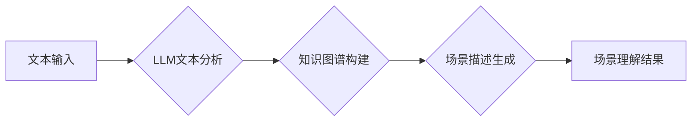

> Large Language Model (LLM), 场景理解, 自然语言处理 (NLP), 深度学习, 知识图谱, 跨模态理解

## 1. 背景介绍

随着人工智能技术的飞速发展，大型语言模型 (LLM) 已经展现出强大的文本处理能力，在自然语言理解、文本生成、机器翻译等领域取得了突破性进展。然而，LLM 的能力在场景理解任务中仍然存在局限性。场景理解是指理解特定语境下的文本信息，并从中提取关键信息、关系和意图。它是一个复杂的任务，需要模型具备对语言、世界知识和场景结构的深刻理解。

传统的场景理解方法主要依赖于规则引擎和手工设计的特征提取方法，难以应对复杂、多样的场景。而 LLM 的出现为场景理解任务带来了新的机遇。由于其强大的文本表示能力和海量知识储备，LLM 可以学习到更丰富的语义信息，并更好地理解场景的上下文和结构。

## 2. 核心概念与联系

**2.1 场景理解的定义**

场景理解是指从文本、图像、音频等多模态数据中提取关键信息，构建场景的完整描述，并理解场景中实体之间的关系和事件的发生顺序。

**2.2 LLM在场景理解中的应用**

LLM 可以通过以下方式应用于场景理解任务：

* **文本语义分析:** LLM 可以分析文本中的关键词、短语和句式结构，提取场景中的关键实体、事件和关系。
* **知识图谱构建:** LLM 可以利用其强大的知识表示能力，构建场景相关的知识图谱，并从中提取场景的结构和逻辑关系。
* **跨模态理解:** LLM 可以结合图像、音频等多模态数据，进行跨模态的场景理解，获得更全面的场景描述。

**2.3 场景理解的挑战**

* **语义歧义:** 自然语言具有高度的语义歧义，LLM 需要能够理解不同语境下的词义和句义。
* **场景复杂度:** 现实世界的场景往往非常复杂，包含大量实体、事件和关系，LLM 需要能够处理这种复杂性。
* **数据稀缺:** 场景理解任务的数据往往比较稀缺，LLM 需要能够从有限的数据中学习到有效的知识。

**2.4 Mermaid 流程图**



## 3. 核心算法原理 & 具体操作步骤

**3.1 算法原理概述**

LLM 在场景理解任务中的核心算法主要包括：

* **Transformer模型:** Transformer模型是一种基于注意力机制的深度学习模型，能够有效地捕捉文本中的长距离依赖关系，并学习到丰富的语义表示。
* **BERT模型:** BERT模型是一种预训练语言模型，通过在大量的文本数据上进行预训练，学习到丰富的语言知识，可以用于各种自然语言理解任务，包括场景理解。
* **知识图谱嵌入:** 知识图谱嵌入技术将知识图谱中的实体和关系映射到低维向量空间，使得模型能够更好地理解知识关系和场景结构。

**3.2 算法步骤详解**

1. **文本预处理:** 对输入文本进行清洗、分词、词性标注等预处理操作，以便于模型理解。
2. **LLM文本分析:** 使用预训练的LLM模型对预处理后的文本进行分析，提取关键实体、事件和关系。
3. **知识图谱构建:** 将提取到的信息构建成知识图谱，并利用知识图谱嵌入技术将实体和关系映射到低维向量空间。
4. **场景描述生成:** 根据构建的知识图谱，生成场景的描述文本，包括场景的背景、人物、事件等信息。
5. **场景理解结果输出:** 将生成的场景描述文本作为场景理解的结果输出。

**3.3 算法优缺点**

* **优点:**
    * 能够处理复杂、多样的场景。
    * 能够学习到丰富的语义信息和知识关系。
    * 能够生成完整的场景描述文本。
* **缺点:**
    * 需要大量的训练数据。
    * 计算成本较高。
    * 仍然存在语义歧义和场景复杂度等挑战。

**3.4 算法应用领域**

* **智能客服:** 理解用户咨询场景，提供更精准的回复。
* **自动驾驶:** 理解道路场景，辅助车辆决策。
* **医疗诊断:** 理解患者病历，辅助医生诊断。
* **新闻报道:** 理解新闻事件场景，生成更准确的新闻报道。

## 4. 数学模型和公式 & 详细讲解 & 举例说明

**4.1 数学模型构建**

LLM 的核心数学模型是 Transformer 模型，其主要结构包括：

* **编码器:** 用于将输入文本序列编码成隐藏状态向量。
* **解码器:** 用于根据编码器输出的隐藏状态向量生成输出文本序列。

**4.2 公式推导过程**

Transformer 模型的注意力机制的核心公式如下：

$$
Attention(Q, K, V) = softmax(\frac{QK^T}{\sqrt{d_k}})V
$$

其中：

* $Q$：查询矩阵
* $K$：键矩阵
* $V$：值矩阵
* $d_k$：键向量的维度
* $softmax$：softmax 函数

**4.3 案例分析与讲解**

假设我们有一个句子 "The cat sat on the mat"，我们需要使用 Transformer 模型对其进行编码。

1. 将句子中的每个单词转换为词向量。
2. 将词向量作为查询矩阵 $Q$，键矩阵 $K$ 和值矩阵 $V$ 输入到注意力机制中。
3. 通过注意力机制计算每个单词之间的相关性，并生成隐藏状态向量。
4. 将隐藏状态向量作为输入，传递到解码器中，生成输出文本序列。

## 5. 项目实践：代码实例和详细解释说明

**5.1 开发环境搭建**

* Python 3.7+
* PyTorch 1.7+
* Transformers 库

**5.2 源代码详细实现**

```python
from transformers import AutoModelForSequenceClassification, AutoTokenizer

# 加载预训练模型和词典
model_name = "bert-base-uncased"
tokenizer = AutoTokenizer.from_pretrained(model_name)
model = AutoModelForSequenceClassification.from_pretrained(model_name)

# 输入文本
text = "The cat sat on the mat"

# 文本预处理
inputs = tokenizer(text, return_tensors="pt")

# 模型推理
outputs = model(**inputs)

# 获取预测结果
predicted_class = outputs.logits.argmax().item()

# 打印预测结果
print(f"Predicted class: {predicted_class}")
```

**5.3 代码解读与分析**

* 使用 `transformers` 库加载预训练的 BERT 模型和词典。
* 对输入文本进行预处理，转换为模型可识别的格式。
* 使用模型进行推理，获取预测结果。
* 打印预测结果。

**5.4 运行结果展示**

运行上述代码，可以得到模型对输入文本的预测结果。例如，如果模型预测结果为 0，则表示文本属于类别 0。

## 6. 实际应用场景

**6.1 智能客服**

LLM 可以理解用户咨询场景，并提供更精准的回复。例如，用户咨询 "我的订单状态如何？"，LLM 可以从用户历史记录中提取订单信息，并查询订单状态，给出准确的回复。

**6.2 自动驾驶**

LLM 可以理解道路场景，辅助车辆决策。例如，LLM 可以识别道路上的交通标志、行人、车辆等信息，并根据这些信息判断车辆行驶路线和速度。

**6.3 医疗诊断**

LLM 可以理解患者病历，辅助医生诊断。例如，LLM 可以从患者病历中提取症状、病史、检查结果等信息，并根据这些信息辅助医生进行诊断。

**6.4 未来应用展望**

LLM 在场景理解任务中的应用前景广阔，未来可能在以下领域得到更广泛的应用：

* **虚拟助手:** 更智能、更自然的虚拟助手，能够理解用户的意图，并提供更精准的帮助。
* **教育领域:** 个性化学习系统，能够根据学生的学习情况，提供个性化的学习内容和指导。
* **娱乐领域:** 更沉浸式的游戏体验，能够理解玩家的行为和意图，并提供更逼真的游戏场景。

## 7. 工具和资源推荐

**7.1 学习资源推荐**

* **论文:**
    * "BERT: Pre-training of Deep Bidirectional Transformers for Language Understanding"
    * "Attention Is All You Need"
* **博客:**
    * Jay Alammar's Blog: https://jalammar.github.io/
    * The Gradient: https://thegradient.pub/

**7.2 开发工具推荐**

* **Transformers 库:** https://huggingface.co/transformers/
* **PyTorch:** https://pytorch.org/

**7.3 相关论文推荐**

* "XLNet: Generalized Autoregressive Pretraining for Language Understanding"
* "RoBERTa: A Robustly Optimized BERT Pretraining Approach"
* "T5: Text-to-Text Transfer Transformer"

## 8. 总结：未来发展趋势与挑战

**8.1 研究成果总结**

LLM 在场景理解任务中取得了显著的进展，能够处理复杂、多样的场景，并生成更完整的场景描述文本。

**8.2 未来发展趋势**

* **模型规模和能力的提升:** 未来 LLMs 的规模和能力将会进一步提升，能够理解更复杂的场景和关系。
* **多模态场景理解:** LLMs 将会更加融合多模态数据，例如文本、图像、音频等，进行更全面的场景理解。
* **场景理解的个性化:** LLMs 将会更加个性化，能够根据用户的需求和偏好，提供更精准的场景理解结果。

**8.3 面临的挑战**

* **数据稀缺:** 场景理解任务的数据往往比较稀缺，需要开发新的数据获取和合成方法。
* **模型解释性:** LLMs 的决策过程往往比较复杂，难以解释模型的推理过程，需要开发新的模型解释方法。
* **伦理问题:** LLMs 的应用可能会带来一些伦理问题，例如数据隐私、算法偏见等，需要进行深入的伦理研究和规范。

**8.4 研究展望**

未来，LLM 在场景理解任务中的研究将更加注重模型的解释性、鲁棒性和安全性，并探索 LLMs 在更多领域的应用。


## 9. 附录：常见问题与解答

**9.1 如何选择合适的LLM模型？**

选择合适的LLM模型取决于具体的场景理解任务和数据特点。

* **任务类型:** 不同的任务类型需要不同的模型架构，例如文本分类、情感分析、问答等。
* **数据规模:** 数据规模越大，模型的规模和复杂度可以更高。
* **计算资源:** 模型的规模和复杂度会影响训练和推理的计算资源需求。

**9.2 如何处理场景理解任务中的语义歧义？**

可以使用以下方法处理场景理解任务中的语义歧义：

* **上下文信息:** 利用上下文信息来 disambiguate 歧义词。
* **知识图谱:** 利用知识图谱中的语义关系来 disambiguate 歧义词。
* **多模型融合:** 使用多个模型进行预测，并融合预测结果来减少歧义的影响。

**9.3 如何评估场景理解模型的性能？**

常用的场景理解模型性能评估指标包括：

* **准确率:** 模型预测正确的比例。
* **召回率:** 模型能够召回所有正确答案的比例。
* **F1-score:** 准确率和召回率的 harmonic mean。
* **BLEU score:** 模型生成的场景描述文本与参考文本的相似度。


作者：禅与计算机程序设计艺术 / Zen and the Art of Computer Programming 
<end_of_turn>