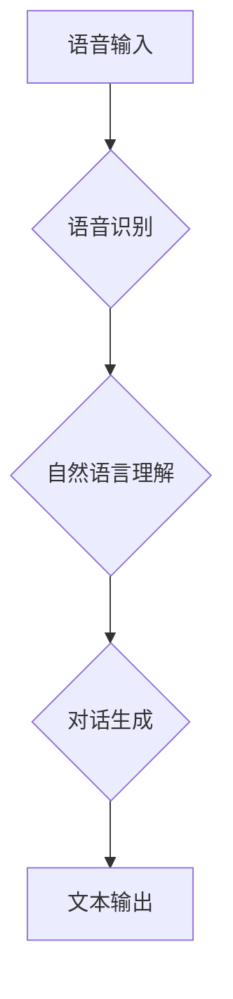

> 深度学习、虚拟助理、自然语言处理、语音识别、对话系统、Python、TensorFlow

## 1. 背景介绍

虚拟助理，如 Siri、Alexa 和 Google Assistant，已经成为我们生活中不可或缺的一部分。它们能够理解我们的语音指令，并执行相应的任务，例如设置提醒、播放音乐、查询天气预报等。深度学习技术的快速发展为虚拟助理的智能化提供了强大的技术支撑。

深度学习是一种机器学习的子领域，它利用多层神经网络来模拟人类大脑的学习过程。深度学习算法能够从海量数据中自动提取特征，从而实现对自然语言、语音、图像等复杂数据的理解和处理。

## 2. 核心概念与联系

虚拟助理的核心功能包括语音识别、自然语言理解和对话生成。深度学习在这些功能中发挥着至关重要的作用。

**Mermaid 流程图：**



**核心概念原理和架构：**

* **语音识别:** 将语音信号转换为文本。深度学习模型，例如循环神经网络（RNN）和卷积神经网络（CNN），能够学习语音信号的特征，并将其映射到相应的文本。
* **自然语言理解:** 理解文本的语义和意图。深度学习模型，例如Transformer，能够捕捉文本中的长距离依赖关系，并理解文本的上下文信息。
* **对话生成:** 生成自然流畅的文本回复。深度学习模型，例如生成对抗网络（GAN），能够学习对话的语义和风格，并生成符合语境的文本回复。

## 3. 核心算法原理 & 具体操作步骤

### 3.1  算法原理概述

深度学习算法的核心是多层神经网络。神经网络由多个层组成，每层包含多个神经元。每个神经元接收来自上一层的输入，并对其进行处理，然后将处理后的结果传递给下一层。通过训练神经网络，使其能够从数据中学习特征和模式。

### 3.2  算法步骤详解

1. **数据准备:** 收集和预处理训练数据，例如语音数据、文本数据等。
2. **模型构建:** 设计和构建深度学习模型，例如RNN、CNN、Transformer等。
3. **模型训练:** 使用训练数据训练深度学习模型，调整模型参数，使其能够准确地识别语音、理解文本和生成对话。
4. **模型评估:** 使用测试数据评估模型的性能，例如准确率、召回率、F1-score等。
5. **模型部署:** 将训练好的模型部署到虚拟助理系统中，使其能够实时处理用户请求。

### 3.3  算法优缺点

**优点:**

* 能够从海量数据中自动提取特征，无需人工特征工程。
* 能够学习复杂的数据模式，实现对自然语言、语音等复杂数据的理解和处理。
* 性能优于传统机器学习算法。

**缺点:**

* 训练数据量大，需要大量的计算资源和时间。
* 模型解释性差，难以理解模型的决策过程。
* 对数据质量要求高，数据噪声会影响模型性能。

### 3.4  算法应用领域

深度学习算法广泛应用于虚拟助理、语音识别、自然语言处理、图像识别、机器翻译等领域。

## 4. 数学模型和公式 & 详细讲解 & 举例说明

### 4.1  数学模型构建

深度学习模型通常由多个层组成，每层包含多个神经元。每个神经元接收来自上一层的输入，并对其进行处理，然后将处理后的结果传递给下一层。

**神经网络层:**

* **输入层:** 接收原始数据，例如语音信号的波形或文本的单词序列。
* **隐藏层:** 对数据进行特征提取和表示学习。
* **输出层:** 生成最终的输出，例如文本、语音或类别标签。

**激活函数:**

激活函数用于引入非线性，使神经网络能够学习复杂的数据模式。常见的激活函数包括ReLU、Sigmoid和Tanh。

### 4.2  公式推导过程

深度学习模型的训练过程是通过优化模型参数来最小化损失函数。损失函数衡量模型预测结果与真实结果之间的差异。

**损失函数:**

$$
L = \frac{1}{N} \sum_{i=1}^{N} \mathcal{L}(y_i, \hat{y}_i)
$$

其中：

* $L$ 是损失函数
* $N$ 是样本数量
* $\mathcal{L}$ 是单个样本的损失函数
* $y_i$ 是真实标签
* $\hat{y}_i$ 是模型预测结果

**梯度下降:**

梯度下降算法用于优化模型参数，使其能够最小化损失函数。

$$
\theta = \theta - \alpha \nabla L(\theta)
$$

其中：

* $\theta$ 是模型参数
* $\alpha$ 是学习率
* $\nabla L(\theta)$ 是损失函数对参数的梯度

### 4.3  案例分析与讲解

**语音识别案例:**

假设我们训练一个语音识别模型，目标是将语音信号转换为文本。

* 输入层接收语音信号的波形数据。
* 隐藏层使用CNN提取语音信号的特征。
* 输出层使用RNN生成文本序列。

训练过程中，使用语音数据和对应的文本转录作为训练数据，通过梯度下降算法优化模型参数，使其能够准确地将语音信号转换为文本。

## 5. 项目实践：代码实例和详细解释说明

### 5.1  开发环境搭建

* Python 3.x
* TensorFlow 或 PyTorch
* CUDA 和 cuDNN (可选，用于GPU加速)

### 5.2  源代码详细实现

```python
# 使用 TensorFlow 构建一个简单的语音识别模型

import tensorflow as tf

# 定义模型结构
model = tf.keras.Sequential([
    tf.keras.layers.Conv1D(filters=32, kernel_size=3, activation='relu', input_shape=(1024, 1)),
    tf.keras.layers.MaxPooling1D(pool_size=2),
    tf.keras.layers.LSTM(units=128),
    tf.keras.layers.Dense(units=10, activation='softmax')
])

# 编译模型
model.compile(optimizer='adam',
              loss='sparse_categorical_crossentropy',
              metrics=['accuracy'])

# 训练模型
model.fit(x_train, y_train, epochs=10)

# 评估模型
loss, accuracy = model.evaluate(x_test, y_test)
print('Loss:', loss)
print('Accuracy:', accuracy)
```

### 5.3  代码解读与分析

* **模型结构:** 该模型使用卷积神经网络（CNN）提取语音信号的特征，然后使用循环神经网络（RNN）学习语音信号的时序信息，最后使用全连接层生成文本序列。
* **编译模型:** 使用Adam优化器、稀疏类别交叉熵损失函数和准确率作为评估指标。
* **训练模型:** 使用训练数据训练模型，训练10个 epochs。
* **评估模型:** 使用测试数据评估模型的性能。

### 5.4  运行结果展示

训练完成后，可以将模型部署到虚拟助理系统中，使其能够实时处理用户语音请求。

## 6. 实际应用场景

### 6.1  智能家居控制

虚拟助理可以理解用户的语音指令，控制智能家居设备，例如灯光、空调、电视等。

### 6.2  个人助理

虚拟助理可以帮助用户管理日程安排、设置提醒、发送邮件、查找信息等。

### 6.3  客服机器人

虚拟助理可以作为客服机器人，回答用户常见问题，提供技术支持。

### 6.4  未来应用展望

随着深度学习技术的不断发展，虚拟助理的应用场景将更加广泛，例如：

* **个性化服务:** 虚拟助理能够根据用户的喜好和需求提供个性化的服务。
* **跨语言理解:** 虚拟助理能够理解多种语言，实现跨语言的沟通。
* **情感识别:** 虚拟助理能够识别用户的 emosi，并提供相应的回应。

## 7. 工具和资源推荐

### 7.1  学习资源推荐

* **书籍:**
    * 《深度学习》
    * 《Python深度学习》
* **在线课程:**
    * Coursera
    * edX
    * Udacity

### 7.2  开发工具推荐

* **TensorFlow:** 开源深度学习框架
* **PyTorch:** 开源深度学习框架
* **Keras:** 高级深度学习API

### 7.3  相关论文推荐

* **Attention Is All You Need:** https://arxiv.org/abs/1706.03762
* **BERT: Pre-training of Deep Bidirectional Transformers for Language Understanding:** https://arxiv.org/abs/1810.04805

## 8. 总结：未来发展趋势与挑战

### 8.1  研究成果总结

深度学习技术在虚拟助理领域取得了显著的进展，使得虚拟助理更加智能化、人性化。

### 8.2  未来发展趋势

* **更强大的模型:** 研究更强大的深度学习模型，例如Transformer变体，以提高虚拟助理的理解和生成能力。
* **多模态交互:** 支持多模态交互，例如语音、文本、图像、视频，使虚拟助理更加智能和人性化。
* **个性化定制:** 基于用户的行为和偏好，提供个性化的虚拟助理服务。

### 8.3  面临的挑战

* **数据隐私:** 虚拟助理需要处理大量用户数据，如何保护用户隐私是一个重要的挑战。
* **模型解释性:** 深度学习模型的决策过程难以解释，如何提高模型的透明度和可解释性是一个重要的研究方向。
* **安全性和可靠性:** 虚拟助理需要保证安全性和可靠性，防止恶意攻击和错误行为。

### 8.4  研究展望

未来，虚拟助理将更加智能、人性化、安全可靠，成为我们生活中不可或缺的一部分。


## 9. 附录：常见问题与解答

**Q1: 如何选择合适的深度学习框架？**

**A1:** TensorFlow 和 PyTorch 是两个流行的深度学习框架，各有优缺点。TensorFlow 更适合于生产环境，PyTorch 更适合于研究和开发。

**Q2: 如何处理语音数据？**

**A2:** 需要使用语音识别算法将语音信号转换为文本。常见的语音识别算法包括HMM、DNN 和 Transformer。

**Q3: 如何评估虚拟助理的性能？**

**A3:** 可以使用准确率、召回率、F1-score 等指标评估虚拟助理的性能。

**作者：禅与计算机程序设计艺术 / Zen and the Art of Computer Programming**<end_of_turn>