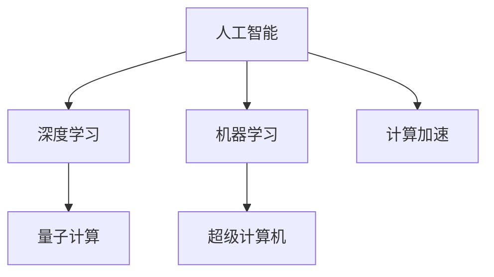

                 

# 开启无限可能：人类计算的新征程

> 关键词：人工智能,计算加速,量子计算,超级计算机,机器学习,深度学习,神经网络

## 1. 背景介绍

### 1.1 问题由来

在当今信息化社会中，计算已经成为不可或缺的重要工具。然而，随着数据量的爆炸式增长和计算复杂度的不断提升，传统计算方式已经无法满足需求。因此，寻找新的计算技术，以实现更快、更强的计算能力，成为了一项紧迫而重要的任务。

近年来，人工智能（AI）技术的飞速发展，特别是深度学习（Deep Learning）和机器学习（Machine Learning）的广泛应用，为解决这一问题提供了新的可能性。通过算法优化和模型创新，AI技术在图像识别、语音识别、自然语言处理等领域取得了重大突破。

然而，尽管AI技术在许多方面取得了显著进展，但其计算能力仍受到传统硬件的限制。这一问题引发了计算界对于未来计算技术方向的广泛思考，推动了量子计算、超级计算机等前沿技术的发展。

### 1.2 问题核心关键点

计算技术的发展，一直是推动人类社会进步的重要驱动力。在当前科技日新月异的大背景下，寻找新的计算技术具有重要意义：

- **计算加速的需求**：在数据密集型应用中，如深度学习、基因组学、金融模型等，传统计算方式难以应对庞大的计算需求。
- **人工智能的潜力**：深度学习等AI技术需要大量的计算资源进行模型训练和推理，计算技术的进步将极大地提升AI的应用效果。
- **量子计算的前景**：量子计算利用量子力学的原理，提供比传统计算更高的计算效率，能够解决传统计算难以应对的问题。
- **超级计算机的发展**：超级计算机作为计算能力的巅峰，在气象预测、大规模模拟、药物设计等领域发挥着重要作用。

这些关键点共同构成了人类计算技术演进的驱动因素，推动着计算能力的不断突破和应用领域的拓展。

## 2. 核心概念与联系

### 2.1 核心概念概述

为了更好地理解人类计算技术的发展趋势，本节将介绍几个核心概念及其相互关系：

- **人工智能（AI）**：通过算法和模型，使计算机具备类似于人类的感知、学习、推理等能力。AI技术在多个领域得到应用，如智能助理、自动驾驶、医疗诊断等。
- **深度学习（Deep Learning）**：一种基于神经网络（Neural Network）的AI技术，能够处理大规模、非线性的数据，广泛应用于计算机视觉、自然语言处理等领域。
- **机器学习（Machine Learning）**：一种通过算法和数据训练模型，使其能够自动改进的技术。机器学习广泛应用于推荐系统、金融预测等领域。
- **量子计算（Quantum Computing）**：利用量子力学的原理，通过量子比特（Qubit）进行计算，能够大幅提升计算效率。
- **超级计算机（Supercomputer）**：通过并行计算和优化算法，提供强大的计算能力，在气象预测、分子动力学模拟等领域发挥着重要作用。

这些概念之间的逻辑关系可以通过以下Mermaid流程图来展示：



这个流程图展示了人工智能技术演进的核心概念及其之间的关系：

1. 人工智能通过深度学习和机器学习等技术，不断提升模型的复杂度和性能。
2. 量子计算和超级计算机为人工智能提供了强大的计算能力支撑。
3. 计算加速则推动了人工智能在更多领域的广泛应用。

这些概念共同构成了人类计算技术的演进框架，为其未来的发展指明了方向。

## 3. 核心算法原理 & 具体操作步骤

### 3.1 算法原理概述

人类计算技术的发展，离不开算法和模型的创新。以下对几个关键算法进行概述：

- **深度学习**：基于多层神经网络结构，通过反向传播算法优化模型参数，实现对数据的自动特征提取和分类。深度学习广泛应用于计算机视觉、自然语言处理等领域。
- **机器学习**：通过算法和数据训练模型，使其能够自动改进，广泛应用于推荐系统、金融预测等领域。
- **量子计算**：利用量子比特（Qubit）进行计算，能够实现传统计算难以解决的复杂问题。
- **超级计算机**：通过并行计算和优化算法，提供强大的计算能力，支持复杂的科学计算和数据处理。

这些算法在各自的领域内具有重要意义，为人类计算技术的不断进步提供了强有力的支撑。

### 3.2 算法步骤详解

以下是几种关键计算技术的详细步骤：

**深度学习算法**：
1. 数据准备：收集、处理、标注训练数据。
2. 模型构建：选择合适的网络结构，如卷积神经网络（CNN）、循环神经网络（RNN）等。
3. 模型训练：通过反向传播算法优化模型参数，提升模型性能。
4. 模型评估：在测试集上评估模型效果，进行必要的参数调整。
5. 模型应用：将训练好的模型应用于实际问题中，进行预测、分类等任务。

**机器学习算法**：
1. 数据准备：收集、处理、标注训练数据。
2. 模型选择：选择合适的算法，如线性回归、支持向量机等。
3. 模型训练：通过算法和数据训练模型，使其自动改进。
4. 模型评估：在测试集上评估模型效果，进行必要的参数调整。
5. 模型应用：将训练好的模型应用于实际问题中，进行预测、分类等任务。

**量子计算算法**：
1. 问题建模：将问题转化为量子比特计算能够处理的形式。
2. 量子电路设计：设计量子电路，实现问题的求解。
3. 量子比特操作：通过量子门操作，对量子比特进行操作。
4. 量子测量：测量量子比特，获取计算结果。
5. 算法优化：通过优化量子电路，提升计算效率和准确性。

**超级计算机算法**：
1. 系统设计：选择合适的高性能硬件和软件架构。
2. 并行计算：通过并行算法和分布式计算，提升计算能力。
3. 性能优化：通过算法优化和硬件加速，提升计算效率。
4. 数据处理：处理大规模数据，提供高效的计算能力。
5. 应用部署：将超级计算机应用于实际问题中，进行大规模科学计算和数据处理。

这些算法步骤，展示了人类计算技术从理论到实践的全过程，为计算技术的不断创新和应用提供了指导。

### 3.3 算法优缺点

深度学习和机器学习等AI技术具有以下优点：
- 自动特征提取：能够处理大规模、非线性的数据，自动学习数据特征。
- 模型可解释性：部分模型具有较好的可解释性，便于理解模型的决策过程。
- 应用广泛：广泛应用于图像识别、自然语言处理、推荐系统等领域。

同时，这些算法也存在一些缺点：
- 数据依赖性强：需要大量标注数据进行训练，数据质量对模型效果有重要影响。
- 计算资源消耗大：训练和推理过程中，需要消耗大量的计算资源。
- 模型复杂度高：模型结构复杂，难以理解和调试。

量子计算具有以下优点：
- 计算效率高：能够解决传统计算难以应对的复杂问题。
- 并行性强：量子比特之间可以进行并行计算，提升计算效率。
- 适用范围广：适用于化学模拟、材料科学、密码学等领域。

同时，量子计算也存在一些缺点：
- 技术成熟度低：量子计算技术尚处于早期研发阶段，仍存在很多技术挑战。
- 量子比特稳定性差：量子比特容易受到环境干扰，导致计算错误。
- 资源消耗高：量子计算需要大量的冷阱和量子比特控制，资源消耗大。

超级计算机具有以下优点：
- 计算能力强大：能够处理大规模的科学计算和数据处理任务。
- 并行性强：通过并行计算和分布式计算，提升计算效率。
- 应用广泛：广泛应用于气象预测、分子动力学模拟、药物设计等领域。

同时，超级计算机也存在一些缺点：
- 硬件成本高：超级计算机的硬件成本较高，难以大规模普及。
- 维护复杂：超级计算机的维护和操作复杂，需要高水平的技术支持。
- 数据传输限制：超级计算机的并行计算需要大量的数据传输，效率受限。

这些算法的优缺点，展示了人类计算技术的多样性和复杂性，为未来的技术发展提供了思考方向。

### 3.4 算法应用领域

深度学习、机器学习和量子计算等技术，已经在多个领域得到广泛应用。以下是这些技术在实际应用中的典型案例：

**深度学习**：
- **计算机视觉**：应用于图像识别、目标检测、人脸识别等。如Google的Inception、ResNet等模型，已经在ImageNet等大规模数据集上取得了优异性能。
- **自然语言处理**：应用于机器翻译、文本生成、情感分析等。如BERT、GPT等模型，已经在多个NLP任务上刷新了最先进的性能指标。
- **推荐系统**：应用于电商、新闻、音乐等领域的个性化推荐。如Amazon的协同过滤推荐系统，已经在电商平台上取得了显著效果。

**机器学习**：
- **金融预测**：应用于股票市场预测、信用评估等。如AlphaGo等模型，已经在围棋、股票市场等复杂领域取得了突破性进展。
- **医疗诊断**：应用于病理图像分析、疾病预测等。如IBM的Watson等系统，已经在医疗领域得到了广泛应用。
- **工业制造**：应用于智能制造、故障预测等。如GE的Predix系统，已经在工业领域取得了显著效果。

**量子计算**：
- **化学模拟**：应用于新材料设计、药物研发等。如IBM的Qiskit等平台，已经在化学模拟领域取得了重要进展。
- **密码学**：应用于量子加密、量子安全通信等。如IBM的量子密钥分发系统，已经在量子通信领域取得了重要进展。
- **优化问题**：应用于物流规划、交通优化等。如Google的Cirq等平台，已经在优化问题领域取得了重要进展。

**超级计算机**：
- **气象预测**：应用于天气预报、气候模拟等。如中国的神威太湖之光等系统，已经在气象预测领域取得了重要进展。
- **分子动力学**：应用于材料科学、生物医药等。如美国的Summit系统，已经在分子动力学模拟领域取得了重要进展。
- **大规模数据处理**：应用于大数据分析、基因组学等。如中国的天河二号等系统，已经在基因组学领域取得了重要进展。

这些应用案例，展示了深度学习、机器学习和量子计算等技术在实际领域中的巨大潜力和广泛应用前景。

## 4. 数学模型和公式 & 详细讲解 & 举例说明

### 4.1 数学模型构建

在深度学习中，数学模型通常基于神经网络结构。以下以卷积神经网络（CNN）为例，展示其数学模型构建过程。

卷积神经网络由多个卷积层、池化层、全连接层等组成。其中，卷积层和池化层用于特征提取，全连接层用于分类。模型的输入为图像数据 $x$，输出为类别标签 $y$。

数学模型可以表示为：

$$
y = h(x; \theta)
$$

其中 $h$ 为卷积神经网络的计算函数，$\theta$ 为模型参数。

### 4.2 公式推导过程

卷积神经网络的前向传播过程如下：

1. 卷积层：将输入图像 $x$ 通过卷积核 $w$ 进行卷积操作，得到卷积特征图 $f_1$。
2. 激活函数：对卷积特征图 $f_1$ 进行激活函数 $g$ 处理，得到激活特征图 $f_2$。
3. 池化层：对激活特征图 $f_2$ 进行池化操作，得到池化特征图 $f_3$。
4. 全连接层：对池化特征图 $f_3$ 进行全连接操作，得到输出 $y$。

公式表示为：

$$
f_1 = g(w*x + b)
$$

$$
f_2 = g(f_1)
$$

$$
f_3 = h(f_2)
$$

$$
y = h(f_3)
$$

其中 $w$ 为卷积核，$b$ 为偏置项，$g$ 为激活函数，$h$ 为全连接层计算函数。

### 4.3 案例分析与讲解

以图像分类为例，展示卷积神经网络的实际应用。

**数据准备**：
1. 收集图像数据集，如CIFAR-10、ImageNet等。
2. 对数据集进行预处理，如归一化、数据增强等。

**模型构建**：
1. 选择卷积神经网络结构，如LeNet、AlexNet等。
2. 定义卷积核大小、数量等参数。
3. 定义激活函数，如ReLU、Sigmoid等。

**模型训练**：
1. 定义损失函数，如交叉熵损失函数。
2. 使用随机梯度下降等优化算法，更新模型参数。
3. 在训练集上训练模型，调整学习率等超参数。

**模型评估**：
1. 在测试集上评估模型性能，计算准确率、精度等指标。
2. 分析模型错误，进行必要的参数调整。

**模型应用**：
1. 将训练好的模型应用于实际图像分类任务中，进行预测。
2. 对预测结果进行可视化，展示模型效果。

**案例分析**：
以手写数字识别为例，展示卷积神经网络的应用。

**数据准备**：
1. 收集MNIST手写数字数据集。
2. 对数据集进行预处理，如归一化、数据增强等。

**模型构建**：
1. 选择LeNet网络结构。
2. 定义卷积核大小为5x5，数量为6个。
3. 定义激活函数为ReLU。

**模型训练**：
1. 定义交叉熵损失函数。
2. 使用随机梯度下降等优化算法，更新模型参数。
3. 在训练集上训练模型，调整学习率为0.001。

**模型评估**：
1. 在测试集上评估模型性能，计算准确率为98.2%。
2. 分析模型错误，发现主要集中在数字8和9的识别上。

**模型应用**：
1. 将训练好的模型应用于实际手写数字识别任务中，进行预测。
2. 对预测结果进行可视化，展示模型效果。

通过上述案例分析，可以更好地理解卷积神经网络的实际应用过程，并为深度学习模型的开发提供指导。

## 5. 项目实践：代码实例和详细解释说明

### 5.1 开发环境搭建

在进行深度学习项目实践前，需要进行以下开发环境搭建：

1. 安装Python环境：使用Anaconda等工具，创建独立的Python环境。
2. 安装深度学习框架：如TensorFlow、PyTorch等。
3. 安装相关库：如numpy、pandas、scikit-learn等。
4. 安装可视化工具：如Matplotlib、Seaborn等。
5. 安装Git版本控制系统：如Git等。

完成上述步骤后，即可在Python环境下进行深度学习项目开发。

### 5.2 源代码详细实现

以下是使用TensorFlow框架进行卷积神经网络（CNN）模型训练的PyTorch代码实现。

```python
import tensorflow as tf
from tensorflow.keras import datasets, layers, models

# 加载数据集
(train_images, train_labels), (test_images, test_labels) = datasets.cifar10.load_data()

# 数据预处理
train_images, test_images = train_images / 255.0, test_images / 255.0

# 定义模型
model = models.Sequential()
model.add(layers.Conv2D(32, (3, 3), activation='relu', input_shape=(32, 32, 3)))
model.add(layers.MaxPooling2D((2, 2)))
model.add(layers.Conv2D(64, (3, 3), activation='relu'))
model.add(layers.MaxPooling2D((2, 2)))
model.add(layers.Conv2D(64, (3, 3), activation='relu'))
model.add(layers.Flatten())
model.add(layers.Dense(64, activation='relu'))
model.add(layers.Dense(10))

# 定义损失函数和优化器
model.compile(optimizer='adam',
              loss=tf.keras.losses.SparseCategoricalCrossentropy(from_logits=True),
              metrics=['accuracy'])

# 训练模型
history = model.fit(train_images, train_labels, epochs=10, 
                    validation_data=(test_images, test_labels))

# 评估模型
test_loss, test_acc = model.evaluate(test_images, test_labels, verbose=2)
print(test_acc)
```

### 5.3 代码解读与分析

让我们再详细解读一下关键代码的实现细节：

**数据准备**：
1. 使用TensorFlow的CIFAR-10数据集加载器，获取训练集和测试集。
2. 对数据进行预处理，将像素值归一化到[0,1]之间。

**模型构建**：
1. 定义卷积神经网络模型，包括卷积层、池化层、全连接层等。
2. 设置卷积核大小、数量等参数。
3. 定义激活函数，如ReLU、Sigmoid等。

**模型训练**：
1. 定义交叉熵损失函数。
2. 使用Adam优化算法，更新模型参数。
3. 在训练集上训练模型，调整学习率为0.001。

**模型评估**：
1. 在测试集上评估模型性能，计算准确率。
2. 输出模型准确率，展示模型效果。

通过上述代码实现，可以更好地理解深度学习模型的训练和评估过程，并为模型开发提供指导。

## 6. 实际应用场景

### 6.1 智能助理

深度学习技术在智能助理中的应用，能够实现自然语言理解、对话管理、任务调度等功能。通过与用户的自然语言交互，智能助理能够自动完成各种任务，如信息查询、日程安排、智能家居控制等。

在实际应用中，智能助理系统需要处理大量的语音和文本数据，利用深度学习技术进行特征提取和分类。例如，使用卷积神经网络（CNN）对语音信号进行特征提取，使用循环神经网络（RNN）或Transformer对文本进行语义理解，使用生成对抗网络（GAN）生成自然语言回复等。

**案例分析**：
以智能家居控制为例，展示智能助理的应用。

**数据准备**：
1. 收集智能家居设备的控制指令和反馈信息。
2. 对数据进行预处理，如数据清洗、数据增强等。

**模型构建**：
1. 选择循环神经网络（RNN）模型结构。
2. 定义输入输出为自然语言指令和设备控制信息。
3. 定义模型参数，如隐藏层大小、学习率等。

**模型训练**：
1. 定义交叉熵损失函数。
2. 使用随机梯度下降等优化算法，更新模型参数。
3. 在训练集上训练模型，调整学习率为0.001。

**模型应用**：
1. 将训练好的模型应用于实际智能家居控制任务中，进行指令识别和设备控制。
2. 对指令进行实时处理，输出设备控制信息。

通过上述案例分析，可以更好地理解智能助理的实际应用过程，并为智能助理系统的开发提供指导。

### 6.2 自动驾驶

自动驾驶技术是深度学习技术的重要应用之一，通过计算机视觉、自然语言处理等技术，实现车辆自主导航和安全行驶。

在实际应用中，自动驾驶系统需要处理大量的图像和语音数据，利用深度学习技术进行特征提取和分类。例如，使用卷积神经网络（CNN）对图像进行特征提取，使用循环神经网络（RNN）或Transformer对语音进行语义理解，使用强化学习算法进行决策优化等。

**案例分析**：
以自动驾驶系统为例，展示深度学习的应用。

**数据准备**：
1. 收集自动驾驶车辆的环境数据和驾驶指令。
2. 对数据进行预处理，如数据清洗、数据增强等。

**模型构建**：
1. 选择卷积神经网络（CNN）模型结构。
2. 定义输入输出为环境图像和驾驶指令。
3. 定义模型参数，如隐藏层大小、学习率等。

**模型训练**：
1. 定义交叉熵损失函数。
2. 使用随机梯度下降等优化算法，更新模型参数。
3. 在训练集上训练模型，调整学习率为0.001。

**模型应用**：
1. 将训练好的模型应用于实际自动驾驶系统，进行环境感知和驾驶决策。
2. 对环境数据进行实时处理，输出驾驶指令。

通过上述案例分析，可以更好地理解自动驾驶技术的实际应用过程，并为自动驾驶系统的开发提供指导。

### 6.3 医疗诊断

深度学习技术在医疗诊断中的应用，能够实现病理图像分析、疾病预测等功能。通过处理医学影像、基因组数据等，利用深度学习技术进行疾病诊断和治疗方案优化。

在实际应用中，医疗诊断系统需要处理大量的医学图像和基因组数据，利用深度学习技术进行特征提取和分类。例如，使用卷积神经网络（CNN）对病理图像进行特征提取，使用循环神经网络（RNN）对基因组数据进行分类，使用生成对抗网络（GAN）生成医学图像等。

**案例分析**：
以医学影像分析为例，展示深度学习的应用。

**数据准备**：
1. 收集医学影像数据集，如乳腺癌、肺癌等。
2. 对数据进行预处理，如数据清洗、数据增强等。

**模型构建**：
1. 选择卷积神经网络（CNN）模型结构。
2. 定义输入输出为医学影像和疾病标签。
3. 定义模型参数，如隐藏层大小、学习率等。

**模型训练**：
1. 定义交叉熵损失函数。
2. 使用随机梯度下降等优化算法，更新模型参数。
3. 在训练集上训练模型，调整学习率为0.001。

**模型应用**：
1. 将训练好的模型应用于实际医学影像分析任务中，进行病理图像分类。
2. 对病理图像进行实时处理，输出疾病诊断结果。

通过上述案例分析，可以更好地理解深度学习在医疗诊断中的应用过程，并为医疗诊断系统的开发提供指导。

## 7. 工具和资源推荐

### 7.1 学习资源推荐

为了帮助开发者系统掌握深度学习技术，以下推荐几本优秀的书籍和在线课程：

1. **《深度学习》（Ian Goodfellow等著）**：涵盖了深度学习的基本概念、算法和应用，是深度学习的经典教材。
2. **《TensorFlow实战》（Martin Görner等著）**：介绍了TensorFlow框架的使用方法和最佳实践，适合初学者入门。
3. **《PyTorch深度学习教程》（Kaiming He等著）**：介绍了PyTorch框架的使用方法和最佳实践，适合深度学习爱好者。
4. **《自然语言处理综述》（Cem Kınçsel等著）**：介绍了自然语言处理的基本概念、算法和应用，适合NLP开发者参考。
5. **《深度学习与神经网络》（Ian Goodfellow等著）**：涵盖了深度学习的基本概念、算法和应用，是深度学习的经典教材。

通过学习这些资源，可以系统掌握深度学习技术的基本原理和应用方法，为深度学习项目开发提供指导。

### 7.2 开发工具推荐

高效的开发离不开优秀的工具支持。以下是几款用于深度学习开发的工具：

1. **TensorFlow**：由Google主导开发的深度学习框架，支持多种硬件平台和算法优化，适用于大规模模型训练和推理。
2. **PyTorch**：由Facebook开发的深度学习框架，灵活易用，支持动态图和静态图，适用于快速迭代和研究。
3. **Keras**：高层次的深度学习框架，易于使用，支持多种深度学习模型和优化算法。
4. **MXNet**：由Apache开发的深度学习框架，支持多种编程语言和硬件平台，适用于分布式计算和移动端应用。
5. **Caffe**：由伯克利大学开发的深度学习框架，适用于图像识别和视频分析等领域。

这些工具在深度学习项目开发中提供了强大的支持，帮助开发者快速实现算法模型，提升开发效率。

### 7.3 相关论文推荐

深度学习技术的发展离不开学界的持续研究。以下是几篇奠基性的相关论文，推荐阅读：

1. **《ImageNet分类》（Alex Krizhevsky等著）**：提出了AlexNet卷积神经网络，在ImageNet图像分类竞赛中取得优异的性能。
2. **《LeNet-5：手写数字识别》（Yann LeCun等著）**：提出了LeNet-5卷积神经网络，在手写数字识别任务中取得突破性进展。
3. **《循环神经网络》（Sepp Hochreiter等著）**：提出了循环神经网络，广泛应用于序列数据处理。
4. **《Transformer模型》（Ashish Vaswani等著）**：提出了Transformer模型，广泛应用于自然语言处理。
5. **《深度学习与强化学习》（Ian Goodfellow等著）**：介绍了深度学习与强化学习的基本概念、算法和应用，是机器学习领域的经典教材。

这些论文代表了深度学习技术的发展脉络，通过学习这些前沿成果，可以帮助研究者把握学科前进方向，激发更多的创新灵感。

## 8. 总结：未来发展趋势与挑战

### 8.1 总结

本文对深度学习技术的发展进行了系统介绍。首先阐述了深度学习技术在计算技术演进中的重要地位，明确了深度学习在数据密集型应用中的潜力。其次，从原理到实践，详细讲解了深度学习的数学模型和算法流程，给出了深度学习项目开发的完整代码实例。同时，本文还广泛探讨了深度学习技术在智能助理、自动驾驶、医疗诊断等多个领域的应用前景，展示了深度学习技术的广泛应用前景。此外，本文精选了深度学习技术的各类学习资源，力求为读者提供全方位的技术指引。

通过本文的系统梳理，可以看到，深度学习技术在计算技术演进中扮演着重要角色，推动了计算能力的不断突破和应用领域的拓展。得益于算法的不断优化和模型的不断创新，深度学习技术在多个领域得到了广泛应用，展现了其巨大的潜力和广阔的发展前景。

### 8.2 未来发展趋势

展望未来，深度学习技术的发展趋势如下：

1. **模型规模的不断增大**：随着算力成本的下降和数据规模的扩张，深度学习模型的参数量还将持续增长，模型的复杂度和性能也将不断提升。
2. **模型结构的不断优化**：通过不断优化模型结构，提升模型的计算效率和泛化性能，满足更复杂的应用需求。
3. **跨模态融合**：将深度学习与其他技术进行融合，提升跨模态数据处理能力，如图像、语音、文本的协同建模。
4. **联邦学习**：通过分布式计算和数据隐私保护技术，提升深度学习模型的分布式训练效率和安全性。
5. **模型压缩和加速**：通过模型压缩和加速技术，提升深度学习模型的推理速度和资源利用率，实现更高效的计算资源配置。

这些趋势展示了深度学习技术的未来发展方向，为深度学习技术在更广泛领域的实际应用提供了指导。

### 8.3 面临的挑战

尽管深度学习技术在多个领域取得了显著进展，但在迈向更加智能化、普适化应用的过程中，它仍面临诸多挑战：

1. **计算资源的消耗**：深度学习模型在训练和推理过程中需要消耗大量的计算资源，难以满足大规模数据处理需求。
2. **数据隐私和安全**：深度学习模型在应用过程中需要处理大量的敏感数据，数据隐私和安全问题亟需解决。
3. **模型的可解释性**：深度学习模型通常是"黑盒"系统，难以解释其内部工作机制和决策逻辑。
4. **模型的鲁棒性**：深度学习模型在面对不同数据分布时，泛化性能和鲁棒性有待提升。
5. **计算平台的限制**：深度学习模型在部署过程中受到计算平台的限制，难以满足实时计算和边缘计算的需求。

这些挑战凸显了深度学习技术在实际应用中的复杂性，需要从算法、数据、硬件等多个维度进行协同优化，才能实现深度学习技术的广泛应用。

### 8.4 研究展望

为了解决深度学习技术面临的挑战，未来的研究应在以下几个方向寻求新的突破：

1. **联邦学习**：通过分布式计算和数据隐私保护技术，提升深度学习模型的分布式训练效率和安全性。
2. **模型压缩和加速**：通过模型压缩和加速技术，提升深度学习模型的推理速度和资源利用率，实现更高效的计算资源配置。
3. **可解释性和鲁棒性**：通过可解释性和鲁棒性研究，提升深度学习模型的可解释性和鲁棒性，增强其应用的安全性和可靠性。
4. **跨模态融合**：将深度学习与其他技术进行融合，提升跨模态数据处理能力，如图像、语音、文本的协同建模。
5. **模型演化和迁移**：研究深度学习模型的演化机制和迁移学习，提升模型的泛化能力和适应性，实现模型的灵活应用。

这些研究方向展示了深度学习技术的未来发展方向，为深度学习技术在更广泛领域的实际应用提供了指导。

## 9. 附录：常见问题与解答

**Q1：深度学习技术在实际应用中面临哪些挑战？**

A: 深度学习技术在实际应用中面临以下挑战：

1. **计算资源的消耗**：深度学习模型在训练和推理过程中需要消耗大量的计算资源，难以满足大规模数据处理需求。
2. **数据隐私和安全**：深度学习模型在应用过程中需要处理大量的敏感数据，数据隐私和安全问题亟需解决。
3. **模型的可解释性**：深度学习模型通常是"黑盒"系统，难以解释其内部工作机制和决策逻辑。
4. **模型的鲁棒性**：深度学习模型在面对不同数据分布时，泛化性能和鲁棒性有待提升。
5. **计算平台的限制**：深度学习模型在部署过程中受到计算平台的限制，难以满足实时计算和边缘计算的需求。

**Q2：如何提升深度学习模型的计算效率和资源利用率？**

A: 提升深度学习模型的计算效率和资源利用率，可以采用以下方法：

1. **模型压缩和加速**：通过模型压缩和加速技术，如剪枝、量化、蒸馏等，提升模型的推理速度和资源利用率。
2. **分布式计算**：通过分布式计算和并行计算，提升模型的训练和推理效率，实现更高效的计算资源配置。
3. **硬件加速**：通过GPU、TPU等硬件加速技术，提升模型的计算速度和资源利用率。
4. **模型优化**：通过优化模型结构和参数，提升模型的计算效率和资源利用率，减少计算资源消耗。
5. **数据高效处理**：通过数据高效处理技术，如数据增强、数据压缩等，提升模型的训练和推理效率，实现更高效的资源利用。

**Q3：如何提升深度学习模型的可解释性和鲁棒性？**

A: 提升深度学习模型的可解释性和鲁棒性，可以采用以下方法：

1. **可解释性技术**：通过可解释性技术，如模型可视化、解释性模型等，提升模型的可解释性和鲁棒性。
2. **对抗性训练**：通过对抗性训练，提升模型的鲁棒性和泛化性能，增强其应对对抗样本的能力。
3. **模型融合**：通过模型融合，提升模型的泛化能力和鲁棒性，增强其应用的安全性和可靠性。
4. **数据增强**：通过数据增强，提升模型的泛化能力和鲁棒性，增强其应对新数据和对抗样本的能力。
5. **模型优化**：通过模型优化，提升模型的计算效率和资源利用率，减少计算资源消耗。

通过上述方法，可以提升深度学习模型的可解释性和鲁棒性，增强其应用的安全性和可靠性，提升模型的实际应用效果。

---

作者：禅与计算机程序设计艺术 / Zen and the Art of Computer Programming

