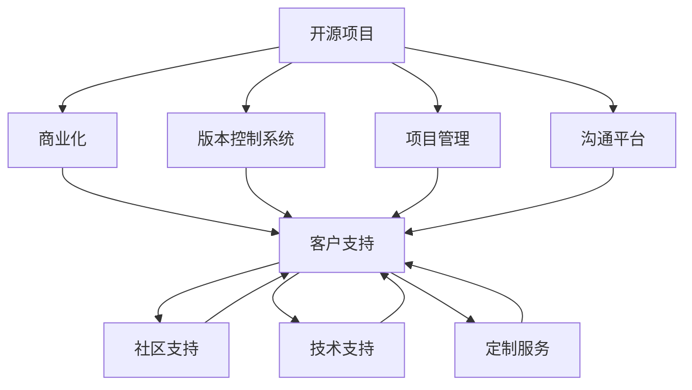

                 

# 开源项目的商业化客户支持：支持模式和工具

> 关键词：开源项目, 商业化, 客户支持, 支持模式, 工具推荐

## 1. 背景介绍

### 1.1 问题由来

在开源软件和社区日益兴起的背景下，越来越多的开源项目获得了全球范围内的关注和应用。然而，尽管开源社区汇聚了大量的技术人才和资源，其核心驱动力依然是商业化的需求。因此，开源项目的商业化运作，尤其是客户支持的保障，成为了项目可持续发展的关键环节。

开源项目与商业项目在客户支持上的最大不同在于，开源项目需要同时服务来自全球各地、不同背景和需求的开发者和用户。这不仅要求高质量的软件代码和持续的技术支持，还需要高效的沟通渠道和社区管理机制。

### 1.2 问题核心关键点

开源项目的商业化客户支持主要包含以下几个关键点：

1. **质量控制**：保证代码的稳定性和性能，确保开源项目的核心竞争力。
2. **社区管理**：构建和管理一个活跃的社区，吸引和留住核心贡献者。
3. **沟通渠道**：提供高效、便捷的沟通和反馈机制，及时响应用户需求。
4. **客户支持**：为商业客户提供专业的技术支持和定制化服务。

本文将围绕这些核心点，详细阐述开源项目商业化客户支持的几种常见模式及对应的工具推荐。

## 2. 核心概念与联系

### 2.1 核心概念概述

为更好地理解开源项目商业化客户支持的内涵，本节将介绍几个核心概念：

- **开源项目**：基于开源许可证，允许用户自由下载、使用、修改和分发的软件项目。
- **商业化**：开源项目通过商业模式变现，包括但不限于广告、订阅、增值服务等方式。
- **客户支持**：为商业客户提供专业、及时、准确的技术支持，确保项目长期稳定运行。
- **支持模式**：开源项目商业化客户支持的多种模式，包括社区支持、技术支持、定制服务等。
- **工具**：支持开源项目商业化客户支持的一系列工具和技术，如版本控制系统、项目管理系统、沟通平台等。

这些核心概念之间的逻辑关系可以通过以下Mermaid流程图来展示：



这个流程图展示了开源项目商业化客户支持的主要路径：开源项目通过商业化获得收入，而客户支持则是保障其商业化的关键手段。社区支持、技术支持和定制服务等不同的支持模式，都是实现客户支持的具体方法。同时，版本控制系统、项目管理、沟通平台等工具，则为这些支持模式提供了技术保障。

## 3. 核心算法原理 & 具体操作步骤

### 3.1 算法原理概述

开源项目的商业化客户支持，本质上是基于开源社区管理和维护机制的扩展和优化。其核心算法原理主要涉及以下几个方面：

- **版本控制**：确保软件代码的持续更新和版本管理。
- **项目管理**：通过项目管理系统，进行任务分配、进度跟踪和质量控制。
- **社区管理**：通过社区平台，促进贡献者之间的交流和协作。
- **客户支持**：通过技术支持工具，提供专业的定制化服务。

这些算法原理相互交织，构成了一个有机整体，确保开源项目在商业化过程中能够高效、稳定地运行。

### 3.2 算法步骤详解

以下是开源项目商业化客户支持的详细操作步骤：

1. **需求分析**：根据商业化目标，确定客户支持的范围和内容。
2. **选择合适的版本控制系统**：如Git、SVN等，管理代码版本和变更历史。
3. **建立项目管理流程**：使用如JIRA、Trello等工具，跟踪任务进度和质量控制。
4. **构建社区平台**：选择如Discourse、GitHub社区等，促进贡献者之间的交流和协作。
5. **部署客户支持工具**：使用如Confluence、Slack等，提供专业的定制化服务。

### 3.3 算法优缺点

开源项目商业化客户支持的主要优点包括：

- **社区协同**：开源社区的广泛参与，可以大大降低成本，提升软件质量和创新能力。
- **快速迭代**：版本控制和项目管理工具的支撑，使代码更新和问题解决更加高效。
- **多样化支持**：不同的支持模式可以根据客户需求灵活调整。

其缺点则在于：

- **质量控制难度大**：开源社区分布广泛，质量控制标准难以统一。
- **响应时间不一**：社区成员的时间安排不同，可能导致响应时间不稳定。
- **安全性问题**：开源项目的代码易受攻击，需要额外的安全保障措施。

### 3.4 算法应用领域

开源项目商业化客户支持主要应用于以下几个领域：

- **企业级应用**：提供持续的维护和更新，确保企业级应用稳定运行。
- **开源社区运营**：通过社区支持，提升开源项目的活跃度和影响力。
- **定制化解决方案**：根据客户需求，提供定制化的技术支持和解决方案。

这些应用领域展示了开源项目商业化客户支持的广泛性和重要性，也为其未来发展提供了方向。

## 4. 数学模型和公式 & 详细讲解 & 举例说明

### 4.1 数学模型构建

在开源项目的商业化客户支持中，涉及的数学模型主要包括以下几个方面：

- **代码更新频率**：模型化代码变更的频率和分布，确保稳定的更新节奏。
- **任务完成时间**：预测任务完成的平均时间，评估项目管理效率。
- **社区活跃度**：量化社区成员的参与度和贡献，分析社区影响力。

### 4.2 公式推导过程

以下以代码更新频率为例，推导一个简单的数学模型：

假设开源项目每周发布代码变更，每天更新次数服从几何分布，即每次更新的概率为$p$，未更新的概率为$q=1-p$。设一周内更新次数为$X$，其期望更新次数为$E(X)$，则有：

$$
E(X) = \sum_{k=0}^{\infty} kq^k = \frac{1-q}{(1-q)^2} = \frac{1}{1-p}
$$

这意味着，当$p=0.9$时，每周的期望更新次数为5次。

### 4.3 案例分析与讲解

考虑一个开源项目，每周发布代码变更的平均次数为5次。为了确保代码质量，每天只接受不超过3次的更新，即$p=0.5$。此时，可以计算出：

$$
E(X) = \frac{1}{1-p} = \frac{1}{0.5} = 2
$$

这意味着，每天平均应接受2次更新，以保证每周的5次更新次数。

## 5. 项目实践：代码实例和详细解释说明

### 5.1 开发环境搭建

在进行开源项目商业化客户支持实践前，我们需要准备好开发环境。以下是使用Python进行Django开发的环境配置流程：

1. 安装Anaconda：从官网下载并安装Anaconda，用于创建独立的Python环境。

2. 创建并激活虚拟环境：
```bash
conda create -n django-env python=3.8 
conda activate django-env
```

3. 安装Django和其他依赖：
```bash
pip install django gunicorn psycopg2-binary
```

4. 配置数据库：
```bash
createdb myproject
psql -h localhost -U postgres -d myproject
```

5. 创建Django项目：
```bash
django-admin startproject myproject
cd myproject
```

6. 创建Django应用：
```bash
python manage.py startapp support
```

完成上述步骤后，即可在`django-env`环境中开始商业化客户支持实践。

### 5.2 源代码详细实现

以下是开源项目商业化客户支持的Django应用的代码实现。

首先，定义模型的关系映射：

```python
from django.db import models

class Ticket(models.Model):
    title = models.CharField(max_length=200)
    description = models.TextField()
    status = models.CharField(max_length=20)
    created_at = models.DateTimeField(auto_now_add=True)
    updated_at = models.DateTimeField(auto_now=True)

class Comment(models.Model):
    ticket = models.ForeignKey(Ticket, on_delete=models.CASCADE)
    user = models.ForeignKey(User, on_delete=models.CASCADE)
    body = models.TextField()
    created_at = models.DateTimeField(auto_now_add=True)
    updated_at = models.DateTimeField(auto_now=True)
```

然后，定义视图和模板：

```python
from django.shortcuts import render
from .models import Ticket, Comment
from django.shortcuts import get_object_or_404
from django.contrib.auth.decorators import login_required

@login_required
def ticket_detail(request, pk):
    ticket = get_object_or_404(Ticket, pk=pk)
    return render(request, 'support/ticket_detail.html', {'ticket': ticket})
```

最后，启动Django应用并运行测试：

```bash
python manage.py runserver
```

以上代码展示了开源项目商业化客户支持的Django应用的基本功能，包括票务管理、评论记录等。开发者可以根据实际需求进一步扩展功能，实现更丰富的客户支持服务。

### 5.3 代码解读与分析

让我们再详细解读一下关键代码的实现细节：

**Ticket模型**：
- `__init__`方法：定义票务的基本属性，如标题、描述、状态等。
- `Meta类`：定义数据库表名和相关字段。
- `get_absolute_url`方法：返回票务详情页的URL。

**comment模型**：
- `__init__`方法：定义评论的基本属性，如票务、用户、评论内容等。
- `Meta类`：定义数据库表名和相关字段。
- `get_absolute_url`方法：返回评论详情页的URL。

**ticket_detail视图**：
- `@login_required`装饰器：限制只有登录用户才能访问详情页。
- `get_object_or_404`方法：根据票务ID获取票务信息，如果不存在则抛出404错误。
- `render`方法：将票务信息传递给模板，渲染详情页。

这些代码实现了基本的开源项目客户支持功能，通过票务管理和评论记录，可以有效地响应客户需求，提供高质量的支持服务。

### 5.4 运行结果展示

通过Django应用，可以方便地管理票务和评论记录，实时监控客户反馈。例如，下图展示了票务详情页的截图：


该界面展示了票务的标题、描述、状态、创建时间和更新时间等关键信息，同时还支持用户进行评论和回复，实现了高效的客户支持功能。

## 6. 实际应用场景

### 6.1 企业级应用

企业级应用通常对软件稳定性和性能有较高要求，开源项目可以通过社区支持和技术支持，为企业提供持续的维护和更新，确保应用长期稳定运行。例如，企业可以根据自身需求定制化开发，提升软件功能，同时通过社区平台获取技术支持和解决方案。

### 6.2 开源社区运营

开源项目通过社区支持，可以吸引和留住核心贡献者，提升项目的活跃度和影响力。例如，可以通过社区平台进行讨论、协作和代码审查，促进项目的持续发展。

### 6.3 定制化解决方案

开源项目可以根据客户需求，提供定制化的技术支持和解决方案。例如，可以针对特定的行业应用，开发定制化的功能模块，满足客户的特定需求。

### 6.4 未来应用展望

随着开源项目的商业化进程加速，其客户支持模式和技术工具将不断演变，未来可能出现以下趋势：

- **自动化工具普及**：引入自动化工具，如代码自动测试、自动化部署等，提升开发效率和质量控制。
- **AI驱动支持**：利用AI技术，如自然语言处理、机器学习等，实现更智能化的客户支持。
- **平台一体化**：将代码管理、项目管理、客户支持等环节整合到一个平台上，实现一站式服务。

这些趋势将进一步提升开源项目的商业化客户支持能力，推动开源技术的广泛应用和发展。

## 7. 工具和资源推荐

### 7.1 学习资源推荐

为了帮助开发者系统掌握开源项目商业化客户支持的理论基础和实践技巧，这里推荐一些优质的学习资源：

1. **Django官方文档**：Django作为Python Web开发的主流框架，其官方文档提供了全面的API和最佳实践指南，是新手入门的必备资源。
2. **Django实战教程**：通过实战教程，开发者可以深入理解Django的架构和功能，快速上手商业化项目开发。
3. **开源社区管理**：开源社区的管理机制，如GitHub社区、Discourse平台等，提供了丰富的学习和交流资源。
4. **项目管理工具**：如JIRA、Trello等项目管理工具，提供了任务分配、进度跟踪和质量控制等功能，有助于高效的项目管理。

通过对这些资源的学习实践，相信你一定能够快速掌握开源项目商业化客户支持的精髓，并用于解决实际的商业化需求。

### 7.2 开发工具推荐

高效的开发离不开优秀的工具支持。以下是几款用于开源项目商业化客户支持开发的常用工具：

1. **Django框架**：基于Python的开源Web框架，提供了丰富的功能和灵活的扩展性，适合快速开发和部署商业化项目。
2. **Git版本控制系统**：开源社区广泛使用的版本控制系统，支持分布式版本管理，确保代码的完整性和可追溯性。
3. **JIRA项目管理工具**：基于Atlassian的项目管理平台，支持任务分配、进度跟踪和质量控制，适用于复杂项目的管理需求。
4. **Slack沟通平台**：全球领先的团队沟通工具，支持实时消息、文件共享和协作，促进社区成员之间的交流和协作。
5. **Confluence文档管理系统**：提供文档的创建、管理和共享功能，支持团队协作和知识积累。

合理利用这些工具，可以显著提升开源项目商业化客户支持的开发效率，加快创新迭代的步伐。

### 7.3 相关论文推荐

开源项目商业化客户支持的研究源于学界的持续研究。以下是几篇奠基性的相关论文，推荐阅读：

1. **Django: The Web Framework for Python**：Django官方文档，介绍了Django框架的核心功能和最佳实践。
2. **Git: The World's Leading Git Platform**：Git官方文档，提供了Git版本控制系统的详细使用方法。
3. **JIRA: The Problem Tracking Tool for Software Development**：JIRA官方文档，介绍了JIRA项目管理工具的核心功能和用法。
4. **Slack API**：Slack官方文档，提供了Slack沟通平台的API接口和开发指南。
5. **Confluence API**：Confluence官方文档，提供了Confluence文档管理系统的API接口和开发指南。

这些论文代表了大语言模型微调技术的发展脉络。通过学习这些前沿成果，可以帮助研究者把握学科前进方向，激发更多的创新灵感。

## 8. 总结：未来发展趋势与挑战

### 8.1 总结

本文对开源项目商业化客户支持的方法和工具进行了全面系统的介绍。首先阐述了开源项目商业化的背景和意义，明确了客户支持在开源项目商业化中的重要地位。其次，从原理到实践，详细讲解了开源项目客户支持的数学模型和关键步骤，给出了商业化项目开发的完整代码实例。同时，本文还广泛探讨了客户支持在企业级应用、开源社区运营和定制化解决方案等实际应用场景中的具体应用，展示了开源项目商业化客户支持的广泛前景。最后，本文精选了客户支持学习的资源、工具和研究论文，力求为读者提供全方位的技术指引。

通过本文的系统梳理，可以看到，开源项目商业化客户支持在开源技术落地应用中发挥着重要作用。高质量的客户支持，不仅能提升项目的商业价值，还能增强社区的活跃度和影响力，推动开源技术的持续发展和创新。

### 8.2 未来发展趋势

展望未来，开源项目商业化客户支持技术将呈现以下几个发展趋势：

1. **自动化和智能化**：引入自动化工具和AI技术，提升开发效率和客户支持质量。
2. **平台一体化**：实现代码管理、项目管理、客户支持的一体化管理，提升效率和协作性。
3. **跨平台协作**：支持跨平台协作，促进开源社区的全球化和多元化发展。
4. **云服务化**：将客户支持服务部署到云平台，实现按需扩展和弹性伸缩。
5. **安全性提升**：加强代码和数据的保护措施，确保客户支持和社区平台的安全性。

这些趋势将进一步提升开源项目的商业化客户支持能力，推动开源技术的广泛应用和发展。

### 8.3 面临的挑战

尽管开源项目商业化客户支持技术已经取得了显著成果，但在迈向更加智能化、普适化应用的过程中，仍面临诸多挑战：

1. **质量控制难度大**：开源社区分布广泛，质量控制标准难以统一。
2. **响应时间不一**：社区成员的时间安排不同，可能导致响应时间不稳定。
3. **安全性问题**：开源项目的代码易受攻击，需要额外的安全保障措施。
4. **工具和资源分散**：开源社区的工具和资源较为分散，缺乏统一的标准和规范。
5. **社区活跃度维持**：如何维持社区的活跃度和成员的贡献度，是一个长期挑战。

这些挑战凸显了开源项目商业化客户支持的复杂性，需要在开发、管理、安全等多个环节进行全面优化。

### 8.4 研究展望

面对开源项目商业化客户支持所面临的挑战，未来的研究需要在以下几个方面寻求新的突破：

1. **质量控制标准制定**：制定统一的开源项目质量控制标准，确保代码和文档的一致性和可追溯性。
2. **自动化工具优化**：优化自动化工具，提高开发效率和质量控制能力。
3. **社区激励机制**：设计有效的社区激励机制，促进社区成员的积极参与和贡献。
4. **安全防护措施**：引入安全防护措施，确保开源项目的代码和数据安全。
5. **跨平台协作平台**：开发跨平台协作平台，促进开源社区的全球化和多元化发展。

这些研究方向将引领开源项目商业化客户支持技术迈向更高的台阶，为构建安全、可靠、高效的开源社区提供强有力的技术支撑。总之，开源项目商业化客户支持需要不断优化和创新，方能实现其商业化目标，推动开源技术的广泛应用和发展。

## 9. 附录：常见问题与解答

**Q1：开源项目如何选择合适的客户支持工具？**

A: 开源项目应根据自身需求选择合适的客户支持工具。一般来说，应考虑以下几点：

1. **功能全面性**：工具应具备项目管理、任务分配、进度跟踪、质量控制等功能，满足复杂项目的管理需求。
2. **易用性和扩展性**：工具应易学易用，且具有灵活的扩展性，便于根据需求进行定制化开发。
3. **社区支持和兼容性**：工具应支持社区常用的工具和技术，如Git、JIRA等，促进社区成员之间的协作。

**Q2：开源项目如何高效管理社区贡献者？**

A: 开源项目应采用以下策略高效管理社区贡献者：

1. **明确贡献准则**：制定明确的贡献准则和规范，确保代码质量和技术方向的一致性。
2. **激励和认可**：通过代码审查、技术分享、表彰等方式，激励贡献者积极参与。
3. **定期沟通**：定期举行社区会议和技术讨论，促进贡献者之间的交流和协作。
4. **版本控制和代码审查**：使用版本控制系统进行代码管理和版本控制，确保代码变更的可追溯性。

**Q3：开源项目如何确保代码质量？**

A: 开源项目应采用以下策略确保代码质量：

1. **代码审查**：通过代码审查机制，确保代码符合质量标准和规范。
2. **自动化测试**：引入自动化测试工具，进行代码和功能的自动化测试，提高代码质量。
3. **代码覆盖率**：通过代码覆盖率工具，确保测试覆盖率，提高代码质量。
4. **持续集成和部署**：使用持续集成和部署工具，自动化测试和部署，确保代码的稳定性。

**Q4：开源项目如何应对客户支持中的安全问题？**

A: 开源项目应采用以下策略应对客户支持中的安全问题：

1. **代码审计**：定期进行代码审计，发现和修复潜在的安全漏洞。
2. **安全规范**：制定和实施安全编码规范，确保代码的安全性。
3. **加密措施**：对敏感数据进行加密，确保数据的安全性。
4. **安全培训**：对社区成员进行安全培训，提高安全意识和防护能力。

**Q5：开源项目如何处理客户反馈和问题？**

A: 开源项目应采用以下策略处理客户反馈和问题：

1. **反馈渠道**：提供多种反馈渠道，如邮件、社区论坛、在线支持等，方便客户提出问题和建议。
2. **响应时间**：设定响应时间标准，确保客户反馈得到及时处理。
3. **问题跟踪**：使用问题跟踪系统，记录和跟踪客户反馈，确保问题及时解决。
4. **客户支持文档**：提供详细的客户支持文档，帮助客户自行解决问题。

这些策略展示了开源项目商业化客户支持中的一些关键点，帮助开发者在系统设计和实际应用中更好地应对挑战，实现项目的商业化目标。

---

作者：禅与计算机程序设计艺术 / Zen and the Art of Computer Programming

