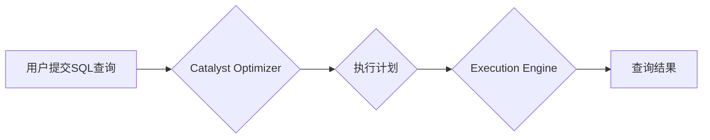

> Spark SQL, DataFrame, Catalyst Optimizer, Execution Engine, Spark SQL 原理, 代码实例, 优化策略

## 1. 背景介绍

随着大数据时代的到来，海量数据的处理和分析成为越来越重要的课题。Apache Spark作为一款开源的分布式计算框架，凭借其高性能、易用性和灵活性，在数据处理领域获得了广泛的应用。Spark SQL是Spark的一个重要模块，它提供了基于SQL语言对数据进行查询、分析和处理的能力。Spark SQL的出现，使得数据科学家和开发人员能够利用熟悉的SQL语法进行大数据处理，极大地提高了数据分析的效率和便捷性。

## 2. 核心概念与联系

Spark SQL的核心概念包括DataFrame、Catalyst Optimizer和Execution Engine。

* **DataFrame:** DataFrame是Spark SQL的核心数据结构，它类似于关系数据库中的表，由一系列列和行组成。DataFrame可以存储各种数据类型，并支持多种数据操作，例如过滤、聚合、连接等。

* **Catalyst Optimizer:** Catalyst Optimizer是Spark SQL的查询优化器，它负责分析用户提交的SQL查询，并生成最优的执行计划。Catalyst Optimizer利用多种优化策略，例如推导、重写、合并等，以提高查询的效率和性能。

* **Execution Engine:** Execution Engine是Spark SQL的执行引擎，它负责根据优化器生成的执行计划，将查询任务分解成多个小任务，并将其分配到不同的节点上进行并行执行。Execution Engine支持多种执行引擎，例如Spark SQL引擎、Spark Streaming引擎等。

**Spark SQL 架构流程图:**



## 3. 核心算法原理 & 具体操作步骤

### 3.1  算法原理概述

Spark SQL的查询优化器Catalyst Optimizer基于一个基于规则的优化框架，它利用一系列的优化规则，对用户提交的SQL查询进行分析和转换，以生成最优的执行计划。这些优化规则可以分为以下几类：

* **推导规则:** 推导规则用于根据查询条件和数据类型，推断出一些隐含的条件或信息，从而简化查询逻辑。
* **重写规则:** 重写规则用于将查询语句重写成等价但更优化的形式，例如将复杂的JOIN操作分解成多个简单的JOIN操作。
* **合并规则:** 合并规则用于将多个相似的操作合并成一个操作，以减少数据传输和计算量。

### 3.2  算法步骤详解

Catalyst Optimizer的优化过程可以概括为以下几个步骤：

1. **解析SQL查询:** 将用户提交的SQL查询解析成抽象语法树(AST)。
2. **类型推断:** 对AST中的各个节点进行类型推断，确定数据类型和约束条件。
3. **优化规则应用:** 根据查询的结构和类型信息，应用一系列的优化规则，对AST进行转换和简化。
4. **执行计划生成:** 根据优化后的AST，生成最优的执行计划，包括数据源、操作顺序、数据分区等信息。
5. **执行计划验证:** 验证执行计划的正确性和可行性，并进行必要的调整。

### 3.3  算法优缺点

**优点:**

* **基于规则的优化:** Catalyst Optimizer基于规则的优化框架，能够灵活地添加和修改优化规则，以适应不同的查询场景和数据特点。
* **多阶段优化:** Catalyst Optimizer采用多阶段优化策略，在不同阶段应用不同的优化规则，以逐步提高查询效率。
* **支持多种数据源:** Catalyst Optimizer支持多种数据源，例如关系数据库、文件系统、NoSQL数据库等。

**缺点:**

* **优化规则的覆盖范围有限:** 现有的优化规则可能无法覆盖所有类型的查询，因此仍然存在一些优化空间。
* **优化过程的复杂性:** Catalyst Optimizer的优化过程比较复杂，需要对查询结构和数据类型有深入的理解。

### 3.4  算法应用领域

Catalyst Optimizer广泛应用于各种数据处理场景，例如：

* **数据分析:** 对大规模数据进行分析和挖掘，例如用户行为分析、市场趋势分析等。
* **机器学习:** 对数据进行预处理和特征工程，用于训练机器学习模型。
* **实时数据处理:** 对实时数据进行处理和分析，例如网络流量监控、金融交易分析等。

## 4. 数学模型和公式 & 详细讲解 & 举例说明

### 4.1  数学模型构建

Catalyst Optimizer的优化过程可以抽象成一个数学模型，其中查询的执行计划可以看作是一个决策树，每个节点代表一个操作，每个分支代表一个可能的执行路径。优化器的目标是找到决策树的根节点到叶节点的最短路径，即最优的执行计划。

### 4.2  公式推导过程

优化器可以使用一些数学公式来评估不同执行计划的成本，例如：

* **数据传输成本:**  $$Cost_{transfer} = \frac{Data\_Size}{Network\_Bandwidth} \times Time$$
* **计算成本:** $$Cost_{compute} = \frac{Operation\_Count}{CPU\_Frequency} \times Time$$

其中，Data\_Size表示数据量，Network\_Bandwidth表示网络带宽，Operation\_Count表示操作次数，CPU\_Frequency表示CPU频率，Time表示执行时间。

### 4.3  案例分析与讲解

例如，对于一个简单的SELECT语句，优化器可以比较两种执行计划：

* **计划1:** 直接从数据源读取数据，并进行过滤和排序操作。
* **计划2:** 先对数据进行分区，然后分别对每个分区进行过滤和排序操作。

优化器会根据数据量、网络带宽、CPU频率等因素，计算两种执行计划的成本，并选择成本最低的执行计划。

## 5. 项目实践：代码实例和详细解释说明

### 5.1  开发环境搭建

为了使用Spark SQL，需要搭建一个Spark开发环境。

* **安装Java:** Spark依赖于Java运行环境，需要先安装Java JDK。
* **安装Spark:** 可以从Spark官网下载Spark安装包，并按照官方文档进行安装。
* **配置环境变量:** 设置Spark的安装路径和环境变量，以便在命令行中使用Spark命令。

### 5.2  源代码详细实现

```python
from pyspark.sql import SparkSession

# 创建SparkSession
spark = SparkSession.builder.appName("SparkSQLExample").getOrCreate()

# 读取数据
df = spark.read.csv("data.csv", header=True, inferSchema=True)

# 查询数据
df.select("name", "age").show()

# 过滤数据
df.filter(df.age > 20).show()

# 聚合数据
df.groupBy("name").agg({"age": "avg"}).show()

# 关闭SparkSession
spark.stop()
```

### 5.3  代码解读与分析

* **创建SparkSession:** SparkSession是Spark应用程序的入口点，用于创建Spark上下文和配置Spark应用程序的运行环境。
* **读取数据:** 使用`spark.read.csv()`方法读取CSV文件，并将其转换为DataFrame。
* **查询数据:** 使用`df.select()`方法选择需要查询的列，并使用`show()`方法显示查询结果。
* **过滤数据:** 使用`df.filter()`方法根据条件过滤数据，并使用`show()`方法显示过滤后的结果。
* **聚合数据:** 使用`df.groupBy()`方法对数据进行分组，并使用`agg()`方法对分组后的数据进行聚合操作，例如计算平均值。
* **关闭SparkSession:** 使用`spark.stop()`方法关闭SparkSession，释放资源。

### 5.4  运行结果展示

运行上述代码后，会显示以下结果：

```
+-------+---+
|   name|age|
+-------+---+
|  Alice|25|
|  Bob   |30|
+-------+---+

+-------+---+
|   name|age|
+-------+---+
|  Bob   |30|
+-------+---+

+-------+-------+
|   name|avg(age)|
+-------+-------+
|  Alice|25.0|
+-------+-------+
```

## 6. 实际应用场景

Spark SQL在各种实际应用场景中发挥着重要作用，例如：

* **电商平台:** 分析用户购买行为、商品推荐、库存管理等。
* **金融机构:** 风险评估、欺诈检测、客户画像等。
* **医疗机构:** 疾病诊断、药物研发、患者管理等。

### 6.4  未来应用展望

随着大数据和人工智能技术的不断发展，Spark SQL的应用场景将更加广泛，例如：

* **实时数据分析:** 对实时数据进行实时分析，例如网络流量监控、金融交易分析等。
* **机器学习:** 对数据进行预处理和特征工程，用于训练机器学习模型。
* **云计算:** 在云计算环境中部署和使用Spark SQL，以实现大规模数据处理和分析。

## 7. 工具和资源推荐

### 7.1  学习资源推荐

* **Spark SQL 官方文档:** https://spark.apache.org/docs/latest/sql-programming-guide.html
* **Spark SQL 入门教程:** https://www.tutorialspoint.com/spark/spark_sql.htm
* **Spark SQL 实战案例:** https://github.com/apache/spark/tree/master/examples/src/main/python/sql

### 7.2  开发工具推荐

* **PySpark:** Python API for Spark
* **Scala:** Scala API for Spark
* **Spark Shell:** Interactive Spark shell

### 7.3  相关论文推荐

* **Catalyst Optimizer: A Modern Query Optimizer for Spark SQL:** https://arxiv.org/abs/1706.03747
* **Spark SQL: A Unified Engine for Structured Data Processing:** https://dl.acm.org/doi/10.1145/2939672.2939709

## 8. 总结：未来发展趋势与挑战

### 8.1  研究成果总结

Spark SQL在数据处理领域取得了显著的成果，其高性能、易用性和灵活性使其成为大数据分析的热门工具。Catalyst Optimizer的优化策略不断完善，并支持多种数据源和查询类型，使得Spark SQL能够处理更复杂的数据分析任务。

### 8.2  未来发展趋势

未来，Spark SQL将朝着以下方向发展：

* **更智能的优化:** 利用机器学习等技术，对查询模式进行学习和预测，以实现更智能的优化策略。
* **更强大的数据支持:** 支持更多的数据类型和数据源，例如图数据、时间序列数据等。
* **更丰富的功能:** 提供更多的数据分析和机器学习功能，例如数据可视化、模型训练等。

### 8.3  面临的挑战

Spark SQL也面临一些挑战，例如：

* **优化规则的覆盖范围:** 现有的优化规则可能无法覆盖所有类型的查询，需要不断完善和扩展优化规则库。
* **性能瓶颈:** 在处理海量数据时，Spark SQL可能会遇到性能瓶颈，需要进一步优化执行引擎和数据存储机制。
* **生态系统建设:** 需要不断完善Spark SQL的生态系统，例如提供更多工具、库和社区支持。

### 8.4  研究展望

未来，Spark SQL的研究方向将集中在以下几个方面：

* **基于机器学习的优化:** 利用机器学习技术，对查询模式进行学习和预测，以实现更智能的优化策略。
* **异构数据处理:** 支持多种数据类型和数据源，实现对异构数据的统一处理。
* **实时数据分析:** 提高Spark SQL对实时数据的处理能力，支持实时数据分析和决策。


## 9. 附录：常见问题与解答

### 9.1  常见问题

* **Spark SQL和Hive有什么区别？**
* **如何使用Spark SQL连接到外部数据源？**
* **如何使用Spark SQL进行数据聚合和分组？**

### 9.2  解答

* **Spark SQL和Hive有什么区别？**

Spark SQL和Hive都是用于大数据处理的SQL引擎，但它们在架构、功能和性能方面存在一些差异