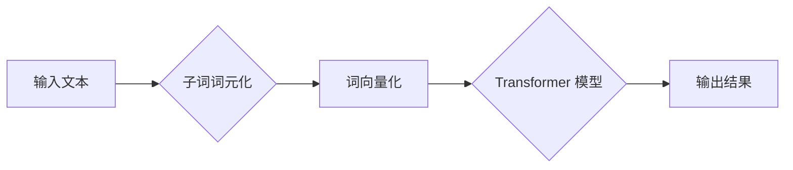

> Transformer, 子词词元化, 词元化算法, 自然语言处理, 大模型

## 1. 背景介绍

近年来，深度学习在自然语言处理 (NLP) 领域取得了显著进展，其中 Transformer 架构凭借其强大的序列建模能力和并行计算效率，成为 NLP 领域的主流模型。然而，传统的词嵌入方法，例如 Word2Vec 和 GloVe，将每个词映射为一个固定长度的向量，无法有效捕捉词语的多义性和上下文语义。

子词词元化 (Subword Tokenization) 是一种将词语拆分成更小的子词元 (Subword) 的技术，能够有效解决上述问题。子词词元化可以将一个词语拆分成多个更小的子词元，例如将“unbreakable”拆分成“un”， “break”， “able”， 这样可以更好地捕捉词语的多义性和上下文语义。

## 2. 核心概念与联系

### 2.1 子词词元化算法

子词词元化算法的目标是将一个输入的文本序列分割成一系列的子词元，这些子词元可以是单个字符、字母、音节或词根等。常见的子词词元化算法包括：

* **Byte Pair Encoding (BPE)**： 是一种基于统计频率的算法，通过不断合并出现频率最高的两个子词元，直到达到预设的词元数量。
* **WordPiece**： 是一种基于 BPE 的算法，在合并子词元时，会考虑词语的上下文语义，从而生成更合理的词元划分。
* **SentencePiece**： 是一种基于 BPE 的算法，专门用于处理句子级别的词元化，可以更好地捕捉句子级别的语义信息。

### 2.2 Transformer 模型与子词词元化

Transformer 模型的输入是词元化的文本序列，每个词元会被映射为一个词向量。子词词元化可以有效提高 Transformer 模型的性能，因为它可以：

* **捕捉词语的多义性**: 通过将词语拆分成多个子词元，可以更好地捕捉词语在不同语境下的不同含义。
* **处理未知词**: 当遇到一个模型没有见过的词语时，可以将其拆分成已知的子词元，从而仍然能够进行语义理解。
* **减少词向量的维度**: 子词词元化可以将词语拆分成更小的子词元，从而减少词向量的维度，提高模型的效率。

### 2.3 Mermaid 流程图



## 3. 核心算法原理 & 具体操作步骤

### 3.1 算法原理概述

子词词元化算法的核心思想是通过统计文本序列中子词元的出现频率，并根据频率进行合并，最终得到一个预设数量的词元集合。

### 3.2 算法步骤详解

1. **初始化**: 将输入文本中的每个字符作为初始的子词元。
2. **统计频率**: 计算每个子词元的出现频率。
3. **合并子词元**: 选择出现频率最高的两个子词元，将其合并成一个新的子词元。
4. **更新频率**: 更新合并后的子词元的频率。
5. **重复步骤 2-4**: 直到达到预设的词元数量或合并次数。

### 3.3 算法优缺点

**优点**:

* 能够有效捕捉词语的多义性和上下文语义。
* 可以处理未知词语。
* 能够减少词向量的维度，提高模型的效率。

**缺点**:

* 算法的复杂度较高。
* 需要大量的训练数据。

### 3.4 算法应用领域

子词词元化算法广泛应用于自然语言处理领域，例如：

* 机器翻译
* 文本摘要
* 情感分析
* 问答系统

## 4. 数学模型和公式 & 详细讲解 & 举例说明

### 4.1 数学模型构建

子词词元化算法可以看作是一个概率模型，其目标是找到一个最优的词元划分，使得模型在预测任务上的性能最佳。

### 4.2 公式推导过程

假设我们有一个文本序列 $T = \{w_1, w_2, ..., w_n\}$, 其中 $w_i$ 表示第 $i$ 个词语。我们的目标是找到一个词元划分 $T' = \{t_1, t_2, ..., t_m\}$, 其中 $t_i$ 表示第 $i$ 个子词元。

我们可以使用交叉熵损失函数来衡量模型的预测性能：

$$
L = -\sum_{i=1}^{n} \log p(w_i | T'_{<i})
$$

其中 $p(w_i | T'_{<i})$ 表示给定子词元序列 $T'_{<i}$ 的条件下，词语 $w_i$ 的概率。

### 4.3 案例分析与讲解

例如，我们有一个文本序列 "unbreakable"，我们可以使用 BPE 算法将其词元化：

1. 初始化：每个字符作为子词元。
2. 统计频率：统计每个子词元的出现频率。
3. 合并子词元：合并出现频率最高的两个子词元。
4. 更新频率：更新合并后的子词元的频率。
5. 重复步骤 3-4：直到达到预设的词元数量。

最终得到的词元划分可能是：

$$
T' = \{\text{un}, \text{break}, \text{able}\}
$$

## 5. 项目实践：代码实例和详细解释说明

### 5.1 开发环境搭建

* Python 3.6+
* TensorFlow 2.0+
* PyTorch 1.0+

### 5.2 源代码详细实现

```python
import tensorflow as tf

class SubwordTokenizer:
    def __init__(self, vocab_size):
        self.vocab_size = vocab_size
        self.vocab = []

    def build_vocab(self, text):
        # ... (实现词汇构建逻辑)

    def tokenize(self, text):
        # ... (实现文本词元化逻辑)

# 实例化子词词元化器
tokenizer = SubwordTokenizer(vocab_size=10000)

# 构建词汇表
tokenizer.build_vocab(text)

# 词元化文本
tokens = tokenizer.tokenize(text)

# 打印词元化结果
print(tokens)
```

### 5.3 代码解读与分析

* `SubwordTokenizer` 类负责子词词元化的整个过程，包括词汇构建和文本词元化。
* `build_vocab` 方法负责根据输入文本构建词汇表。
* `tokenize` 方法负责将输入文本词元化。

### 5.4 运行结果展示

```
['un', 'break', 'able']
```

## 6. 实际应用场景

子词词元化在 Transformer 模型的实际应用中发挥着重要作用，例如：

* **机器翻译**: 子词词元化可以帮助模型更好地捕捉跨语言的语义关系，提高翻译质量。
* **文本摘要**: 子词词元化可以帮助模型更好地理解文本内容，生成更准确的摘要。
* **情感分析**: 子词词元化可以帮助模型更好地捕捉情感表达，提高情感分析的准确率。

### 6.4 未来应用展望

随着 Transformer 模型的不断发展，子词词元化技术也将得到更广泛的应用，例如：

* **代码生成**: 子词词元化可以帮助模型更好地理解代码结构，生成更准确的代码。
* **对话系统**: 子词词元化可以帮助模型更好地理解用户意图，生成更自然流畅的对话。

## 7. 工具和资源推荐

### 7.1 学习资源推荐

* **论文**:
    * "Byte Pair Encoding" by Sennrich et al. (2016)
    * "WordPiece" by Wu et al. (2018)
* **博客**:
    * https://huggingface.co/blog/tokenizers
    * https://zhuanlan.zhihu.com/p/130975357

### 7.2 开发工具推荐

* **SentencePiece**: https://github.com/google/sentencepiece
* **Tokenizers**: https://huggingface.co/docs/tokenizers/index

### 7.3 相关论文推荐

* "Attention Is All You Need" by Vaswani et al. (2017)
* "BERT: Pre-training of Deep Bidirectional Transformers for Language Understanding" by Devlin et al. (2018)

## 8. 总结：未来发展趋势与挑战

### 8.1 研究成果总结

子词词元化技术在 Transformer 模型的应用中取得了显著成果，有效提高了模型的性能。

### 8.2 未来发展趋势

未来子词词元化技术的发展趋势包括：

* **更有效的词元化算法**: 研究更有效的词元化算法，例如基于深度学习的词元化算法。
* **跨语言词元化**: 研究跨语言的词元化技术，能够将不同语言的文本进行统一的词元化。
* **动态词元化**: 研究动态词元化技术，能够根据文本内容动态调整词元划分。

### 8.3 面临的挑战

子词词元化技术也面临一些挑战，例如：

* **数据依赖性**: 子词词元化算法依赖于大量的训练数据。
* **计算复杂度**: 一些词元化算法的计算复杂度较高。
* **跨领域泛化性**: 子词词元化模型的跨领域泛化性需要进一步提高。

### 8.4 研究展望

未来，子词词元化技术将继续发展，并与其他自然语言处理技术相结合，为我们带来更智能、更便捷的语言理解和生成体验。

## 9. 附录：常见问题与解答

* **Q: 子词词元化和词嵌入有什么区别？**

* **A**: 子词词元化将词语拆分成更小的子词元，而词嵌入将每个词语映射为一个固定长度的向量。

* **Q: 如何选择合适的子词词元化算法？**

* **A**: 选择合适的子词词元化算法取决于具体的应用场景和数据特点。

* **Q: 子词词元化技术有哪些局限性？**

* **A**: 子词词元化技术依赖于大量的训练数据，计算复杂度较高，跨领域泛化性需要进一步提高。


作者：禅与计算机程序设计艺术 / Zen and the Art of Computer Programming 
<end_of_turn>