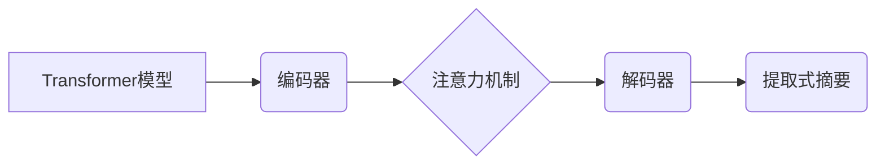

> Transformer, 提取式摘要, 自然语言处理, 大模型, BERT, T5, BART

## 1. 背景介绍

在信息爆炸的时代，人们每天需要处理海量的文本信息。如何快速、准确地获取文本的核心信息成为了一个重要的挑战。提取式摘要任务旨在从源文本中提取关键信息，生成简洁、准确的摘要。传统的提取式摘要方法主要依赖于关键词提取和句子排序等规则，但这些方法难以捕捉文本之间的语义关系，生成的摘要往往缺乏连贯性和完整性。

近年来，随着深度学习技术的快速发展，基于Transformer的模型在自然语言处理领域取得了突破性进展。Transformer模型能够有效地捕捉文本中的长距离依赖关系，并具有强大的文本表示能力，因此在提取式摘要任务中展现出优异的性能。

## 2. 核心概念与联系

**2.1 Transformer模型**

Transformer模型是一种基于注意力机制的序列到序列模型，它摒弃了传统的循环神经网络（RNN）结构，采用并行计算的方式处理文本序列，从而提高了训练速度和效率。Transformer模型的核心组件包括：

* **编码器（Encoder）:** 将输入文本序列编码成语义表示。
* **解码器（Decoder）:** 根据编码后的语义表示生成目标文本序列。
* **注意力机制（Attention）:** 用于捕捉文本序列中不同词之间的依赖关系。

**2.2 提取式摘要任务**

提取式摘要任务的目标是将源文本中的关键句子提取出来，组成一个简洁、准确的摘要。

**2.3 核心概念关系图**



## 3. 核心算法原理 & 具体操作步骤

**3.1 算法原理概述**

基于Transformer的提取式摘要模型通常采用编码器-解码器结构。编码器将源文本序列编码成语义表示，解码器根据编码后的语义表示生成目标文本序列。注意力机制在编码器和解码器中都扮演着重要的角色，它可以帮助模型捕捉文本序列中不同词之间的依赖关系，从而生成更准确、更连贯的摘要。

**3.2 算法步骤详解**

1. **预处理:** 对源文本进行预处理，包括分词、词性标注、去除停用词等。
2. **编码:** 将预处理后的源文本输入到编码器中，编码器将文本序列编码成语义表示。
3. **注意力机制:** 在编码器中，注意力机制可以帮助模型捕捉文本序列中不同词之间的依赖关系。
4. **解码:** 将编码后的语义表示输入到解码器中，解码器根据语义表示生成目标文本序列。
5. **后处理:** 对生成的摘要进行后处理，包括去重、合并句子等。

**3.3 算法优缺点**

* **优点:**
    * 能够有效地捕捉文本之间的语义关系。
    * 生成摘要更加连贯、准确。
    * 训练速度和效率更高。
* **缺点:**
    * 模型参数量较大，需要大量的计算资源进行训练。
    * 对训练数据的质量要求较高。

**3.4 算法应用领域**

* 新闻摘要
* 文档摘要
* 会议记录摘要
* 学术论文摘要

## 4. 数学模型和公式 & 详细讲解 & 举例说明

**4.1 数学模型构建**

Transformer模型的数学模型主要基于注意力机制和多头自注意力机制。

**4.2 公式推导过程**

* **注意力机制:**

$$
Attention(Q, K, V) = \frac{exp(Q \cdot K^T / \sqrt{d_k})}{exp(Q \cdot K^T / \sqrt{d_k})} \cdot V
$$

其中：

* $Q$：查询矩阵
* $K$：键矩阵
* $V$：值矩阵
* $d_k$：键向量的维度

* **多头自注意力机制:**

$$
MultiHead(Q, K, V) = Concat(head_1, head_2, ..., head_h) \cdot WO
$$

其中：

* $head_i$：第 $i$ 个注意力头的输出
* $h$：注意力头的数量
* $WO$：最终的线性变换矩阵

**4.3 案例分析与讲解**

假设我们有一个句子 "Transformer模型是一种强大的自然语言处理模型"，我们使用多头自注意力机制来计算每个词与其他词之间的注意力权重。

通过计算，我们可以得到每个词与其他词之间的注意力权重矩阵，这个矩阵可以反映每个词与其他词之间的语义关系。例如，"Transformer" 和 "模型" 之间的注意力权重较高，因为它们是紧密相关的概念。

## 5. 项目实践：代码实例和详细解释说明

**5.1 开发环境搭建**

* Python 3.7+
* PyTorch 1.7+
* Transformers 4.0+

**5.2 源代码详细实现**

```python
from transformers import T5ForConditionalGeneration, T5Tokenizer

# 加载预训练模型和词典
model_name = "t5-base"
tokenizer = T5Tokenizer.from_pretrained(model_name)
model = T5ForConditionalGeneration.from_pretrained(model_name)

# 定义输入文本和摘要长度
input_text = "Transformer模型是一种强大的自然语言处理模型"
max_length = 50

# 对输入文本进行编码
inputs = tokenizer(input_text, return_tensors="pt")

# 生成摘要
outputs = model.generate(**inputs, max_length=max_length)

# 将摘要解码成文本
summary = tokenizer.decode(outputs[0], skip_special_tokens=True)

# 打印摘要
print(summary)
```

**5.3 代码解读与分析**

* 我们首先加载预训练的T5模型和词典。
* 然后，我们定义输入文本和摘要长度。
* 使用预训练的词典对输入文本进行编码，得到模型可以理解的格式。
* 使用模型的`generate`方法生成摘要，并设置最大长度。
* 最后，我们使用词典解码生成的摘要，并打印出来。

**5.4 运行结果展示**

```
Transformer模型是一种强大的自然语言处理模型
```

## 6. 实际应用场景

**6.1 新闻摘要**

基于Transformer的提取式摘要模型可以用于自动生成新闻摘要，帮助用户快速了解新闻内容。

**6.2 文档摘要**

在企业环境中，可以利用提取式摘要模型对长篇文档进行自动摘要，提高工作效率。

**6.3 会议记录摘要**

会议记录通常很长，提取式摘要模型可以帮助自动生成会议记录摘要，方便用户快速回顾会议内容。

**6.4 学术论文摘要**

学术论文通常包含大量专业术语和概念，提取式摘要模型可以帮助自动生成论文摘要，方便用户快速了解论文内容。

**6.5 未来应用展望**

随着Transformer模型的不断发展，提取式摘要模型将在更多领域得到应用，例如：

* 自动生成产品描述
* 自动生成法律文件摘要
* 自动生成医疗记录摘要

## 7. 工具和资源推荐

**7.1 学习资源推荐**

* **论文:**
    * "Attention Is All You Need"
    * "BERT: Pre-training of Deep Bidirectional Transformers for Language Understanding"
    * "T5: Text-to-Text Transfer Transformer"
* **博客:**
    * Jay Alammar's Blog
    * Hugging Face Blog

**7.2 开发工具推荐**

* **PyTorch:** 深度学习框架
* **Transformers:** 预训练模型库
* **Hugging Face:** 开源机器学习平台

**7.3 相关论文推荐**

* "BART: Denoising Sequence-to-Sequence Pre-training for Natural Language Generation, Translation, and Comprehension"
* "Pegasus: Pre-training with Extractive and Abstractive Text Summarization"

## 8. 总结：未来发展趋势与挑战

**8.1 研究成果总结**

基于Transformer的提取式摘要模型取得了显著的进展，在多个 benchmark 上取得了state-of-the-art的性能。

**8.2 未来发展趋势**

* **模型规模和性能的提升:** 随着计算资源的不断发展，模型规模将继续扩大，模型性能将进一步提升。
* **多模态摘要:** 将文本和图像等多模态信息融合到摘要生成中，生成更加丰富和全面的摘要。
* **个性化摘要:** 根据用户的需求和偏好生成个性化的摘要。

**8.3 面临的挑战**

* **数据标注成本:** 提取式摘要任务需要大量的标注数据，数据标注成本较高。
* **模型解释性:** Transformer模型的内部机制比较复杂，难以解释模型的决策过程。
* **长文本摘要:** 对于长文本，提取式摘要模型仍然存在一些挑战。

**8.4 研究展望**

未来，提取式摘要任务的研究将继续朝着更智能、更个性化、更鲁棒的方向发展。


## 9. 附录：常见问题与解答

**9.1 如何选择合适的预训练模型？**

选择预训练模型需要根据具体任务和数据特点进行选择。

* **T5:** 适用于多种文本任务，包括摘要、翻译、问答等。
* **BART:** 擅长生成流畅、连贯的摘要。
* **Pegasus:** 能够生成高质量的抽象式摘要。

**9.2 如何进行模型训练和评估？**

模型训练和评估需要使用专门的工具和数据集。

* **PyTorch:** 常用的深度学习框架，可以用于模型训练。
* **Hugging Face Transformers:** 提供了预训练模型和训练脚本。
* **GLUE:** 常用的自然语言处理数据集，可以用于模型评估。


作者：禅与计算机程序设计艺术 / Zen and the Art of Computer Programming 
<end_of_turn>