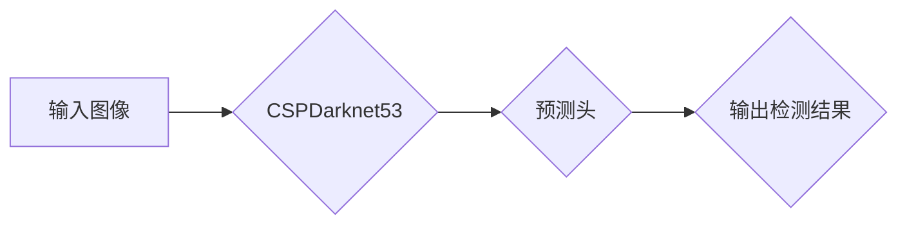

> YOLO,目标检测,深度学习,计算机视觉,图像识别,YOLOv7,实时检测,高效算法

## 1. 背景介绍

在当今数据爆炸的时代，目标检测技术作为计算机视觉领域的核心技术之一，在安防监控、自动驾驶、医疗诊断、机器人导航等众多领域发挥着越来越重要的作用。目标检测的目标是识别图像或视频中存在的物体，并对其进行定位和分类。

传统的目标检测方法通常依赖于手工设计的特征提取器和分类器，效率低下且难以适应复杂场景。随着深度学习技术的兴起，基于深度学习的目标检测算法取得了显著的进展。其中，YOLO (You Only Look Once) 系列算法凭借其速度快、精度高、易于训练的特点，成为目标检测领域的一大热门。

YOLOv7是YOLO系列算法的最新版本，在继承了YOLOv5的优点的基础上，进一步提升了检测精度和速度，并引入了新的架构设计和训练策略。本文将深入讲解YOLOv7的原理、算法流程、代码实现以及实际应用场景，帮助读者全面理解YOLOv7的目标检测技术。

## 2. 核心概念与联系

YOLOv7的核心思想是将目标检测任务转化为回归问题，即直接预测目标的边界框坐标和类别概率。它采用了一种端到端的训练方式，将图像输入到神经网络中，直接输出目标的检测结果。

YOLOv7的架构设计主要包括以下几个部分：

* **特征提取网络:** YOLOv7采用CSPDarknet53作为特征提取网络，该网络结构具有较高的特征提取能力和计算效率。
* **预测头:** 预测头负责根据特征图预测目标的边界框坐标和类别概率。YOLOv7的预测头采用了一种新的设计，可以有效地提高检测精度。
* **损失函数:** YOLOv7使用了一种改进的损失函数，可以更好地平衡定位精度和分类精度。

**Mermaid 流程图:**



## 3. 核心算法原理 & 具体操作步骤

### 3.1  算法原理概述

YOLOv7的核心算法原理是将图像划分为多个网格单元，每个网格单元负责预测该区域内是否存在目标，以及目标的边界框坐标和类别概率。

YOLOv7采用了一种新的预测头设计，可以有效地提高检测精度。该预测头将特征图划分为多个通道，每个通道负责预测一个目标的边界框坐标和类别概率。

### 3.2  算法步骤详解

1. **图像预处理:** 将输入图像调整到预设的大小，并进行归一化处理。
2. **特征提取:** 将预处理后的图像输入到CSPDarknet53网络中，提取图像特征。
3. **预测:** 将提取到的特征图输入到预测头中，预测每个网格单元内目标的边界框坐标和类别概率。
4. **后处理:** 对预测结果进行非极大值抑制和边界框回归，得到最终的检测结果。

### 3.3  算法优缺点

**优点:**

* **速度快:** YOLOv7的检测速度非常快，可以达到每秒数十帧的实时检测能力。
* **精度高:** YOLOv7的检测精度在目标检测领域处于领先水平。
* **易于训练:** YOLOv7的训练过程相对简单，只需要少量数据即可达到较好的效果。

**缺点:**

* **对小目标检测能力有限:** YOLOv7对小目标的检测能力相对较弱。
* **容易受到背景干扰:** YOLOv7容易受到复杂背景的干扰，导致检测结果不准确。

### 3.4  算法应用领域

YOLOv7在目标检测领域具有广泛的应用前景，例如：

* **安防监控:** 人脸识别、入侵检测、车辆识别等。
* **自动驾驶:** 行人检测、车辆检测、交通标志识别等。
* **医疗诊断:** 肿瘤检测、器官识别、病灶定位等。
* **机器人导航:** 物体识别、路径规划、避障等。

## 4. 数学模型和公式 & 详细讲解 & 举例说明

### 4.1  数学模型构建

YOLOv7的目标检测模型可以看作是一个多层神经网络，其输入是图像，输出是每个网格单元内目标的边界框坐标和类别概率。

YOLOv7的数学模型主要包括以下几个部分：

* **特征提取网络:** 使用卷积神经网络提取图像特征。
* **预测头:** 使用全连接层和激活函数预测目标的边界框坐标和类别概率。
* **损失函数:** 使用交叉熵损失函数和边界框回归损失函数优化模型参数。

### 4.2  公式推导过程

YOLOv7的损失函数由两个部分组成：

* **分类损失:** 使用交叉熵损失函数计算预测类别概率与真实类别概率之间的差异。
* **回归损失:** 使用均方误差损失函数计算预测边界框坐标与真实边界框坐标之间的差异。

**公式:**

```latex
L = L_{cls} + L_{bbox}
```

其中，$L_{cls}$ 是分类损失，$L_{bbox}$ 是边界框回归损失。

### 4.3  案例分析与讲解

假设我们有一个图像，其中包含一个猫的物体。YOLOv7模型会将图像划分为多个网格单元，每个网格单元负责预测该区域内是否存在目标，以及目标的边界框坐标和类别概率。

如果某个网格单元预测到该区域内存在一个猫的物体，那么该网格单元的输出结果将包含猫的边界框坐标和猫的类别概率。

## 5. 项目实践：代码实例和详细解释说明

### 5.1  开发环境搭建

YOLOv7的开发环境搭建需要以下软件：

* Python 3.7+
* PyTorch 1.7+
* CUDA 11.0+
* OpenCV 4.5+

### 5.2  源代码详细实现

YOLOv7的源代码可以从官方GitHub仓库下载：https://github.com/ultralytics/yolov7

### 5.3  代码解读与分析

YOLOv7的源代码主要包含以下几个部分：

* **模型定义:** 定义YOLOv7的网络结构。
* **数据加载:** 加载训练数据和验证数据。
* **训练:** 训练YOLOv7模型。
* **推理:** 使用训练好的模型进行目标检测。

### 5.4  运行结果展示

训练好的YOLOv7模型可以用于对图像进行目标检测。

## 6. 实际应用场景

YOLOv7在目标检测领域具有广泛的应用场景，例如：

### 6.1  安防监控

YOLOv7可以用于人脸识别、入侵检测、车辆识别等安防监控任务。

### 6.2  自动驾驶

YOLOv7可以用于行人检测、车辆检测、交通标志识别等自动驾驶任务。

### 6.3  医疗诊断

YOLOv7可以用于肿瘤检测、器官识别、病灶定位等医疗诊断任务。

### 6.4  未来应用展望

随着深度学习技术的不断发展，YOLOv7在未来将会有更广泛的应用场景，例如：

* **智能零售:** 商品识别、库存管理、顾客行为分析等。
* **智慧城市:** 交通管理、环境监测、公共安全等。
* **工业自动化:** 机器视觉、缺陷检测、质量控制等。

## 7. 工具和资源推荐

### 7.1  学习资源推荐

* **YOLOv7官方文档:** https://docs.ultralytics.com/
* **PyTorch官方文档:** https://pytorch.org/docs/stable/
* **深度学习书籍:** 《深度学习》、《动手学深度学习》

### 7.2  开发工具推荐

* **PyCharm:** Python开发环境
* **VS Code:** 代码编辑器
* **Jupyter Notebook:** 数据分析和可视化工具

### 7.3  相关论文推荐

* **YOLOv7: Trainable Object Detection with Efficient Architecture:** https://arxiv.org/abs/2207.13770

## 8. 总结：未来发展趋势与挑战

### 8.1  研究成果总结

YOLOv7在目标检测领域取得了显著的进展，其速度快、精度高、易于训练的特点使其成为目标检测领域的一大热门。

### 8.2  未来发展趋势

未来目标检测技术的发展趋势包括：

* **更高效的算法设计:** 追求更快的检测速度和更低的计算成本。
* **更强的泛化能力:** 能够适应更复杂和多变的场景。
* **更细粒度的目标检测:** 能够识别更小的目标和更细粒度的类别。

### 8.3  面临的挑战

目标检测技术还面临着一些挑战，例如：

* **小目标检测能力:** 对于尺寸较小的目标，检测精度仍然存在不足。
* **背景干扰:** 复杂背景容易导致检测结果不准确。
* **数据标注成本:** 目标检测模型的训练需要大量的标注数据，标注成本较高。

### 8.4  研究展望

未来目标检测技术的研究方向包括：

* **改进小目标检测算法:** 研究新的算法和技术，提高对小目标的检测精度。
* **增强鲁棒性:** 研究提高目标检测模型对背景干扰和噪声的鲁棒性。
* **探索无监督学习:** 研究无监督学习方法，降低目标检测模型的训练成本。

## 9. 附录：常见问题与解答

### 9.1  常见问题

* **YOLOv7的检测速度如何？**

YOLOv7的检测速度非常快，可以达到每秒数十帧的实时检测能力。

* **YOLOv7的精度如何？**

YOLOv7的精度在目标检测领域处于领先水平。

* **如何训练YOLOv7模型？**

YOLOv7的训练过程相对简单，只需要少量数据即可达到较好的效果。

### 9.2  解答

* **YOLOv7的检测速度和精度取决于模型的复杂度和训练数据的大小。**
* **YOLOv7的训练过程可以使用官方提供的脚本进行。**
* **更多关于YOLOv7的详细信息可以参考官方文档和GitHub仓库。**

作者：禅与计算机程序设计艺术 / Zen and the Art of Computer Programming


<end_of_turn>