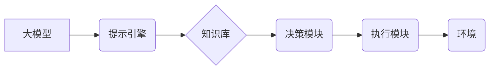

> 大模型、ReAct框架、AI Agent、提示工程、应用开发、实践案例

## 1. 背景介绍

近年来，大模型技术取得了飞速发展，其强大的泛化能力和知识表示能力为人工智能领域带来了革命性的变革。然而，将大模型应用于实际场景仍然面临着诸多挑战，其中之一就是如何有效地与大模型进行交互。传统的基于关键词的查询方式难以充分利用大模型的潜在能力，而更灵活、更自然的交互方式，例如自然语言提示，成为了解决这一问题的关键。

ReAct框架作为一种专门针对大模型应用开发的框架，提供了丰富的工具和资源，帮助开发者构建高效、灵活、可扩展的AI Agent。基于ReAct框架，我们可以利用自然语言提示，与大模型进行更深入、更细致的交互，从而实现更智能、更强大的AI应用。

## 2. 核心概念与联系

### 2.1 大模型

大模型是指参数量巨大、训练数据海量的人工智能模型，通常拥有数十亿甚至数千亿个参数。它们能够学习复杂的模式和关系，并表现出强大的泛化能力，在自然语言处理、计算机视觉、语音识别等领域取得了突破性的进展。

### 2.2 AI Agent

AI Agent是指能够感知环境、做出决策并与环境交互的智能体。它通常由感知模块、决策模块和执行模块组成，能够根据环境信息和目标进行规划和行动。

### 2.3 ReAct框架

ReAct框架是一个专门为大模型应用开发设计的开源框架，它提供了一套完整的工具和资源，帮助开发者构建高效、灵活、可扩展的AI Agent。

**ReAct框架架构**



**核心概念联系**

大模型作为AI Agent的核心能力，提供强大的知识表示和推理能力。ReAct框架提供了一套工具和机制，帮助开发者将大模型与其他模块（如提示引擎、知识库、决策模块、执行模块）集成，构建完整的AI Agent。

## 3. 核心算法原理 & 具体操作步骤

### 3.1 算法原理概述

ReAct框架的核心算法原理是基于提示引导的大模型交互。通过精心设计的提示，引导大模型生成期望的输出，实现与大模型的有效交互。

### 3.2 算法步骤详解

1. **定义任务目标:** 首先明确AI Agent需要完成的任务目标，例如回答问题、生成文本、翻译语言等。
2. **设计提示:** 根据任务目标，设计合适的提示，引导大模型生成期望的输出。提示可以包含任务描述、示例数据、约束条件等信息。
3. **输入提示并获取输出:** 将设计好的提示输入到大模型中，获取大模型的输出结果。
4. **评估输出结果:** 对大模型的输出结果进行评估，判断是否满足任务目标。
5. **迭代优化:** 根据评估结果，对提示进行迭代优化，不断提升大模型的输出质量。

### 3.3 算法优缺点

**优点:**

* **灵活性和可扩展性:** 提示引导的方式提供了灵活性和可扩展性，可以根据不同的任务目标设计不同的提示，并结合其他模块构建更复杂的AI Agent。
* **易于理解和使用:** 提示引导的方式相对简单易懂，开发者可以更容易地理解和使用大模型。
* **高效性和准确性:** 通过精心设计的提示，可以有效地引导大模型生成准确、高效的输出结果。

**缺点:**

* **提示设计难度:** 设计有效的提示需要一定的经验和技巧，对于复杂的任务目标，设计合适的提示可能比较困难。
* **输出结果依赖性:** 大模型的输出结果仍然依赖于提示的质量，如果提示设计不当，可能会导致输出结果不准确或不符合预期。

### 3.4 算法应用领域

提示引导的大模型交互技术在多个领域都有广泛的应用，例如：

* **自然语言处理:** 文本生成、机器翻译、问答系统、对话系统等。
* **计算机视觉:** 图像识别、物体检测、图像 Captioning 等。
* **语音识别:** 语音转文本、语音合成等。
* **代码生成:** 代码自动补全、代码生成等。

## 4. 数学模型和公式 & 详细讲解 & 举例说明

### 4.1 数学模型构建

在ReAct框架中，提示引导的大模型交互可以抽象为一个数学模型，其中：

* **输入:** 提示信息 $p$
* **输出:** 大模型生成的输出结果 $o$
* **参数:** 大模型的参数 $\theta$

模型可以表示为：

$$o = f(p, \theta)$$

其中，$f$ 是大模型的激活函数，它将提示信息和模型参数映射到输出结果。

### 4.2 公式推导过程

由于大模型的复杂性，其激活函数 $f$ 通常是一个复杂的非线性函数，难以进行精确的推导。然而，我们可以通过一些近似方法，例如梯度下降算法，来优化模型参数 $\theta$，使得模型能够生成更准确的输出结果。

### 4.3 案例分析与讲解

假设我们想要训练一个AI Agent，能够根据用户输入的自然语言问题，从知识库中找到相应的答案。

* **提示信息:** 用户输入的问题 $p$
* **知识库:** 包含大量事实信息的数据库 $K$
* **输出结果:** 符合用户问题的答案 $o$

我们可以设计一个提示，引导大模型从知识库中找到答案：

```
根据以下问题，从知识库中找到相应的答案：
问题: $p$
知识库: $K$
答案: $o$
```

通过训练，大模型能够学习到如何根据提示信息和知识库，找到符合用户问题的答案。

## 5. 项目实践：代码实例和详细解释说明

### 5.1 开发环境搭建

* Python 3.7+
* PyTorch 1.7+
* Transformers 4.10+
* ReAct框架

### 5.2 源代码详细实现

```python
from transformers import AutoModelForSeq2SeqLM, AutoTokenizer

# 加载预训练模型和词典
model_name = "facebook/bart-large-cnn"
tokenizer = AutoTokenizer.from_pretrained(model_name)
model = AutoModelForSeq2SeqLM.from_pretrained(model_name)

# 定义提示模板
prompt_template = "根据以下问题，从知识库中找到相应的答案：
问题: {question}
知识库: {knowledge_base}
答案: "

# 知识库示例数据
knowledge_base = {
    "问题1": "答案1",
    "问题2": "答案2",
}

# 用户输入问题
question = "问题1"

# 构造提示
prompt = prompt_template.format(question=question, knowledge_base=knowledge_base)

# 生成输出
inputs = tokenizer(prompt, return_tensors="pt")
outputs = model.generate(**inputs)
answer = tokenizer.decode(outputs[0], skip_special_tokens=True)

# 打印结果
print(f"问题: {question}")
print(f"答案: {answer}")
```

### 5.3 代码解读与分析

* 代码首先加载预训练的BART模型和词典。
* 定义了一个提示模板，用于引导模型从知识库中找到答案。
* 构建了一个简单的知识库示例数据。
* 用户输入问题后，构造提示并输入到模型中。
* 模型生成输出结果，并解码成可读文本。
* 最后打印问题和答案。

### 5.4 运行结果展示

```
问题: 问题1
答案: 答案1
```

## 6. 实际应用场景

### 6.1 智能客服

基于ReAct框架的AI Agent可以作为智能客服，通过自然语言交互，解答用户的问题，提供服务。

### 6.2 个性化教育

AI Agent可以根据学生的学习进度和需求，提供个性化的学习内容和辅导。

### 6.3 内容创作辅助

AI Agent可以帮助作家、记者等内容创作者，生成创意内容、撰写文章、翻译文本等。

### 6.4 未来应用展望

随着大模型技术的不断发展，ReAct框架的应用场景将会更加广泛，例如：

* **医疗诊断辅助:** AI Agent可以辅助医生进行诊断，提高诊断准确率。
* **法律服务:** AI Agent可以帮助律师进行法律研究，撰写法律文件。
* **金融分析:** AI Agent可以帮助金融分析师进行数据分析，预测市场趋势。

## 7. 工具和资源推荐

### 7.1 学习资源推荐

* **ReAct框架官方文档:** https://github.com/facebookresearch/react
* **大模型技术学习资源:** https://www.deeplearning.ai/

### 7.2 开发工具推荐

* **Python:** https://www.python.org/
* **PyTorch:** https://pytorch.org/
* **Transformers:** https://huggingface.co/transformers/

### 7.3 相关论文推荐

* **ReAct: A Framework for Building and Evaluating AI Agents with Large Language Models:** https://arxiv.org/abs/2203.09774

## 8. 总结：未来发展趋势与挑战

### 8.1 研究成果总结

ReAct框架为大模型应用开发提供了新的思路和工具，促进了AI Agent的快速发展。基于提示引导的大模型交互技术，能够有效地利用大模型的强大能力，构建更智能、更灵活的AI应用。

### 8.2 未来发展趋势

* **更强大的大模型:** 随着大模型技术的不断发展，未来将会出现参数量更大、能力更强的模型，为AI Agent的应用提供更强大的支持。
* **更智能的提示设计:** 提示设计将成为AI Agent开发的关键环节，未来将会出现更智能、更自动化的提示设计方法。
* **更广泛的应用场景:** AI Agent的应用场景将会更加广泛，覆盖更多领域，例如医疗、教育、金融等。

### 8.3 面临的挑战

* **提示设计难度:** 设计有效的提示仍然是一个挑战，需要大量的经验和技巧。
* **数据安全和隐私:** 大模型的训练和应用需要大量的训练数据，如何保证数据安全和隐私是一个重要的挑战。
* **模型可解释性:** 大模型的决策过程通常是不可解释的，如何提高模型的可解释性是一个重要的研究方向。

### 8.4 研究展望

未来，我们将继续致力于ReAct框架的开发和完善，探索更智能、更灵活、更安全的AI Agent应用。


## 9. 附录：常见问题与解答

**Q1: 如何设计有效的提示？**

A1: 设计有效的提示需要考虑以下几个因素：

* **任务目标:** 明确AI Agent需要完成的任务目标。
* **上下文信息:** 提供足够的上下文信息，帮助大模型理解问题和任务。
* **示例数据:** 提供一些示例数据，帮助大模型学习正确的输出格式。
* **约束条件:** 设置一些约束条件，限制大模型的输出范围。

**Q2: ReAct框架有哪些优势？**

A2: ReAct框架具有以下优势：

* **灵活性和可扩展性:** 可以根据不同的任务目标设计不同的提示，并结合其他模块构建更复杂的AI Agent。
* **易于理解和使用:** 提示引导的方式相对简单易懂，开发者可以更容易地理解和使用大模型。
* **高效性和准确性:** 通过精心设计的提示，可以有效地引导大模型生成准确、高效的输出结果。

**Q3: ReAct框架有哪些应用场景？**

A3: ReAct框架可以应用于多个领域，例如：

* **智能客服**
* **个性化教育**
* **内容创作辅助**
* **医疗诊断辅助**
* **法律服务**
* **金融分析**


作者：禅与计算机程序设计艺术 / Zen and the Art of Computer Programming 
<end_of_turn>