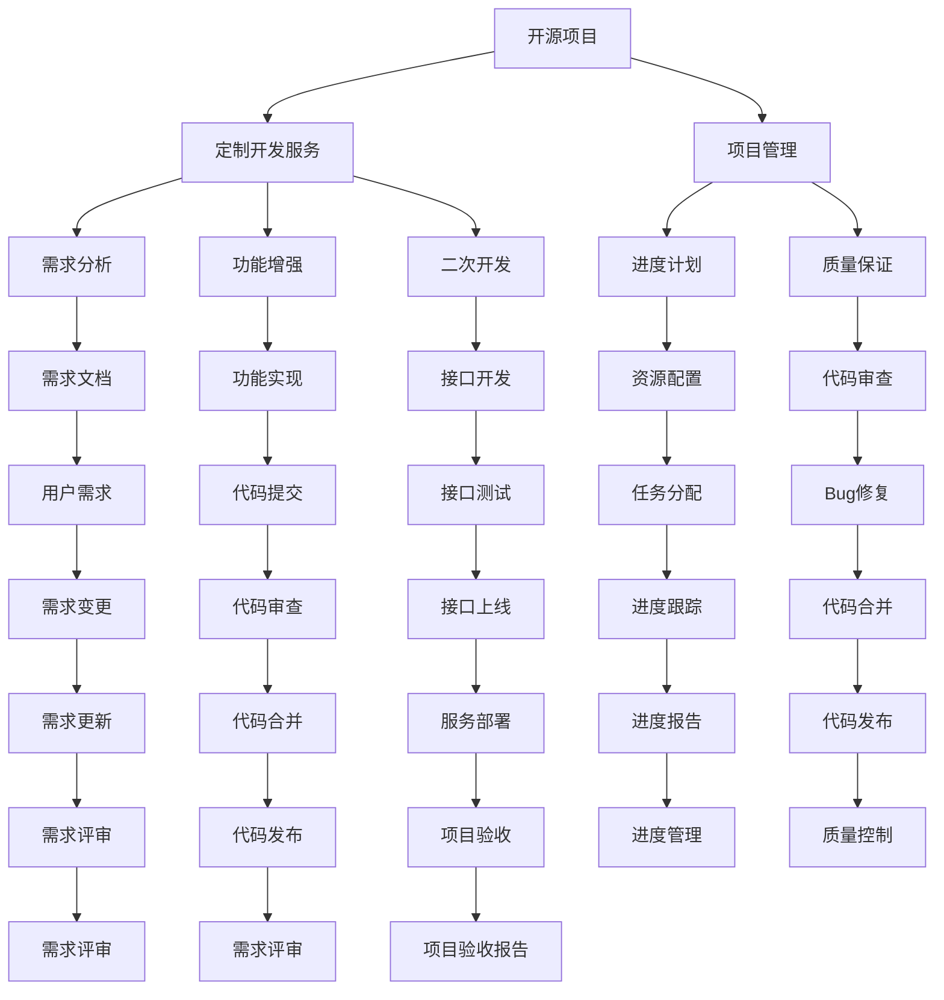

                 

# 开源项目的定制开发服务：项目管理和定价

> 关键词：开源项目,定制开发服务,项目管理,定价策略,需求分析

## 1. 背景介绍

在当今的软件开发行业，开源项目正成为越来越多企业选择的主要技术解决方案。这些项目不仅提供了强大的功能和性能，还能通过社区贡献和更新迭代不断提升。然而，随着开源项目的广泛应用，其定制化开发需求也在不断增长。企业不仅需要快速部署开源项目，还需要根据自身业务需求进行定制化开发，以满足特定的业务需求和系统架构。

定制化开发服务是指在开源项目的基础上，结合企业的业务需求，进行二次开发、功能增强或特定接口开发等操作，以满足企业特定的应用场景。这不仅涉及软件开发，还包括项目管理、需求分析、质量保证等环节。定制开发服务的项目管理和定价策略，直接影响到服务的效果和企业对成本的控制。

本博客将系统性地介绍基于开源项目的定制开发服务项目管理和定价策略，通过分析核心概念、核心算法原理及具体操作步骤，以及数学模型和公式的详细讲解，结合实际应用场景、工具和资源推荐，最后总结未来发展趋势与挑战，并给出常见问题的解答，力求为读者提供全方位的技术指导。

## 2. 核心概念与联系

### 2.1 核心概念概述

为更好地理解定制开发服务项目管理和定价策略，本节将介绍几个密切相关的核心概念：

- 开源项目(Open Source Project, OSP)：指通过开放源代码的方式，共享技术资源，鼓励社区贡献的软件项目。常见的开源项目包括Apache、GitHub上的各类开源项目。
- 定制开发服务(Custom Development Service, CDS)：指基于开源项目，结合企业特定需求，进行二次开发或功能增强的服务。涵盖需求分析、设计、编码、测试、部署等环节。
- 项目管理(Project Management, PM)：指对项目进行规划、执行、监控和评估的过程，以确保项目按时、按质、按预算完成。包括需求分析、进度计划、质量保证等环节。
- 定价策略(Pricing Strategy)：指企业根据项目特性、复杂度、需求量等因素，制定定制开发服务的计价方式，保障企业利益，激励社区参与。

这些核心概念之间的逻辑关系可以通过以下Mermaid流程图来展示：



这个流程图展示了大语言模型的核心概念及其之间的关系：

1. 开源项目通过开放源代码的方式，提供基础的软件功能。
2. 定制开发服务在开源项目的基础上，通过二次开发、功能增强等形式，满足企业特定的应用场景。
3. 项目管理通过需求分析、进度计划、质量保证等环节，保障定制开发服务的高效执行。
4. 需求分析包括用户需求收集和文档化，是项目启动的关键。
5. 功能增强和二次开发涉及代码实现、接口开发等具体技术环节。
6. 定价策略根据项目特性、复杂度等因素，合理制定定制开发服务的计价方式。

这些核心概念共同构成了定制开发服务项目管理和定价的框架，使其能够有效应对企业的多样化需求。

## 3. 核心算法原理 & 具体操作步骤

### 3.1 算法原理概述

定制开发服务项目管理和定价策略，主要依赖于需求分析、成本估算和定价模型等关键算法。这些算法综合考虑项目特性、复杂度、需求量等因素，制定合理的定价策略，同时进行有效的项目管理，确保项目按时、按质、按预算完成。

形式化地，假设定制开发服务项目包含 $N$ 个需求点，每个需求点的复杂度为 $C_i$，对应的实现成本为 $E_i$，市场价值为 $V_i$。定制开发服务的定价模型 $P$ 定义为：

$$
P = \sum_{i=1}^N \alpha_i \cdot \beta_i \cdot V_i
$$

其中 $\alpha_i$ 为需求点 $i$ 的需求量系数，$\beta_i$ 为需求点 $i$ 的复杂度系数。定价模型 $P$ 反映了企业需求、市场价值和成本估算的综合考量。

项目管理通过需求分析、进度计划、质量保证等环节，确保项目按时、按质、按预算完成。具体步骤包括：

1. 需求分析：通过用户访谈、问卷调查等手段，收集用户需求，并生成需求文档。
2. 进度计划：根据需求文档，制定详细的项目计划，包括任务分配、时间节点、里程碑等。
3. 质量保证：通过代码审查、测试等手段，确保项目代码质量和系统稳定性。

### 3.2 算法步骤详解

基于需求分析、成本估算和定价模型，定制开发服务的项目管理主要包括以下几个关键步骤：

**Step 1: 需求收集与分析**
- 通过用户访谈、问卷调查等手段，收集用户需求，并生成需求文档。
- 需求文档应详细描述每个需求点的功能、复杂度、优先级等细节。

**Step 2: 成本估算与定价**
- 根据需求文档，进行成本估算，计算每个需求点的实现成本。
- 结合用户需求量和市场价值，应用定价模型计算定制开发服务的总定价。

**Step 3: 项目计划与资源配置**
- 根据需求文档和成本估算，制定详细的项目计划。
- 配置项目所需的资源，包括人员、设备、工具等。

**Step 4: 需求验证与确认**
- 与用户沟通确认需求文档，确保需求清晰准确。
- 进行需求评审，确认需求的可实现性和合理性。

**Step 5: 需求实现与测试**
- 根据需求文档，进行功能开发和接口开发。
- 完成需求点的实现后，进行单元测试、集成测试等。

**Step 6: 项目部署与验收**
- 将实现好的需求点部署到生产环境。
- 进行项目验收，确保需求点满足用户需求。

**Step 7: 后期维护与支持**
- 根据用户反馈，进行后期维护和优化。
- 提供技术支持，确保系统稳定运行。

### 3.3 算法优缺点

基于需求分析、成本估算和定价模型的定制开发服务项目管理和定价策略，具有以下优点：

1. 满足企业个性化需求：定制开发服务通过二次开发和功能增强，满足企业特定的应用场景。
2. 提高开发效率：项目管理通过需求分析、进度计划、质量保证等环节，提高开发效率。
3. 控制成本：通过成本估算和定价模型，合理制定定制开发服务的计价方式，保障企业利益。
4. 激励社区参与：定价策略采用灵活计价方式，激励社区贡献和持续优化。

同时，该策略也存在一定的局限性：

1. 需求收集复杂：需求收集和分析可能面临需求不明确、需求变更频繁等问题，影响项目进度。
2. 成本估算困难：需求点的复杂度、市场价值等因素难以准确估算，导致成本估算偏差。
3. 定价灵活性不足：定价策略可能过于固定，无法根据项目特性进行灵活调整。
4. 项目风险高：定制开发服务涉及多方面因素，项目风险较高，需采取有效风险控制措施。

尽管存在这些局限性，但就目前而言，基于需求分析、成本估算和定价模型的项目管理和定价策略仍是定制开发服务的主流范式。未来相关研究的重点在于如何进一步提高需求收集和成本估算的准确性，增强定价策略的灵活性和公平性，同时兼顾可解释性和伦理安全性等因素。

### 3.4 算法应用领域

基于需求分析、成本估算和定价模型的定制开发服务项目管理和定价策略，适用于各种定制开发服务项目，例如：

- 企业级应用系统：如ERP、CRM、HR等系统，结合企业特定的业务需求，进行定制开发和功能增强。
- 移动应用开发：通过定制开发服务，实现企业的移动应用功能，提升用户体验。
- 网站系统开发：为企业网站提供定制化的开发服务，增强网站功能和用户体验。
- 数据处理与分析：通过定制开发服务，实现数据的收集、清洗、分析和可视化。
- 物联网应用开发：结合企业的物联网设备，进行数据采集、传输、处理等功能的定制开发。
- 人工智能应用开发：结合企业的AI需求，进行模型的训练、部署和优化。

除了上述这些经典应用外，定制开发服务还被创新性地应用到更多场景中，如智能制造、智慧医疗、智能家居等，为各行各业带来新的技术突破。随着定制开发服务需求的不断增长，相信该策略将在更多领域得到应用，为各行各业带来新的技术变革。

## 4. 数学模型和公式 & 详细讲解  
### 4.1 数学模型构建

本节将使用数学语言对定制开发服务项目管理和定价策略进行更加严格的刻画。

假设定制开发服务项目包含 $N$ 个需求点，每个需求点的复杂度为 $C_i$，对应的实现成本为 $E_i$，市场价值为 $V_i$。需求点的需求量系数为 $\alpha_i$，复杂度系数为 $\beta_i$。定制开发服务的定价模型 $P$ 定义为：

$$
P = \sum_{i=1}^N \alpha_i \cdot \beta_i \cdot V_i
$$

其中 $\alpha_i$ 为需求点 $i$ 的需求量系数，$\beta_i$ 为需求点 $i$ 的复杂度系数。

## 4.2 公式推导过程

以下我们以线性定价模型为例，推导定价公式及其求解过程。

假设需求点 $i$ 的需求量系数为 $\alpha_i$，复杂度系数为 $\beta_i$，市场价值为 $V_i$。则线性定价模型为：

$$
P = \sum_{i=1}^N \alpha_i \cdot \beta_i \cdot V_i
$$

对上述公式进行简化，得：

$$
P = \alpha \cdot \beta \cdot V
$$

其中 $\alpha = \sum_{i=1}^N \alpha_i$，$\beta = \sum_{i=1}^N \beta_i$，$V = \sum_{i=1}^N V_i$。

通过上述推导，我们可以将定价问题转化为对 $\alpha$、$\beta$、$V$ 的求解。在实际应用中，可以通过问卷调查、需求评审等方式收集 $\alpha_i$、$\beta_i$、$V_i$ 的初值，并结合历史数据和专家经验，进行合理估算和调整。

## 5. 项目实践：代码实例和详细解释说明
### 5.1 开发环境搭建

在进行定制开发服务项目管理和定价策略的实践前，我们需要准备好开发环境。以下是使用Python进行Flask开发的环境配置流程：

1. 安装Anaconda：从官网下载并安装Anaconda，用于创建独立的Python环境。

2. 创建并激活虚拟环境：
```bash
conda create -n cds-env python=3.8 
conda activate cds-env
```

3. 安装Flask：从官网获取Flask安装命令。例如：
```bash
pip install flask
```

4. 安装Flask-RESTful：用于构建RESTful API。
```bash
pip install flask-restful
```

5. 安装Flask-SQLAlchemy：用于管理数据库。
```bash
pip install flask-sqlalchemy
```

6. 安装Flask-WTF：用于表单验证。
```bash
pip install flask-wtf
```

完成上述步骤后，即可在`cds-env`环境中开始项目管理和定价策略的开发实践。

### 5.2 源代码详细实现

下面我们以定制开发服务定价为例，给出使用Flask构建RESTful API的Python代码实现。

首先，定义需求点模型和定价模型：

```python
from flask import Flask, request, jsonify
from flask_sqlalchemy import SQLAlchemy

app = Flask(__name__)
app.config['SQLALCHEMY_DATABASE_URI'] = 'sqlite:///cds.db'
db = SQLAlchemy(app)

class DemandPoint(db.Model):
    id = db.Column(db.Integer, primary_key=True)
    name = db.Column(db.String(50), nullable=False)
    complexity = db.Column(db.Float, nullable=False)
    value = db.Column(db.Float, nullable=False)
    quantity = db.Column(db.Float, nullable=False)

class PricingModel(db.Model):
    id = db.Column(db.Integer, primary_key=True)
    alpha = db.Column(db.Float, nullable=False)
    beta = db.Column(db.Float, nullable=False)
    total_value = db.Column(db.Float, nullable=False)
```

然后，定义定价函数和接口：

```python
from transformers import BertForTokenClassification, AdamW

@app.route('/price', methods=['POST'])
def calculate_price():
    data = request.get_json()
    demand_points = data['demand_points']
    
    # 计算需求量系数
    alpha = sum([point['quantity'] for point in demand_points])
    
    # 计算复杂度系数
    beta = sum([point['complexity'] for point in demand_points])
    
    # 计算总市场价值
    total_value = sum([point['value'] for point in demand_points])
    
    # 计算定价
    price = alpha * beta * total_value
    
    return jsonify({'price': price})
```

最后，启动Flask应用并在测试接口上评估：

```python
if __name__ == '__main__':
    app.run(debug=True)
```

以上就是使用Flask构建RESTful API计算定制开发服务定价的完整代码实现。可以看到，通过Flask等Web框架，我们能够快速搭建Web服务，接收用户需求，计算定价，并返回结果。

### 5.3 代码解读与分析

让我们再详细解读一下关键代码的实现细节：

**DemandPoint类**：
- `__init__`方法：初始化需求点的名称、复杂度、价值和需求量。
- `__repr__`方法：返回需求点的字符串表示。

**PricingModel类**：
- `__init__`方法：初始化定价模型的参数。

**calculate_price函数**：
- 通过API接收需求点的数据，计算需求量系数 $\alpha$、复杂度系数 $\beta$ 和总市场价值 $V$。
- 应用定价模型计算定价。
- 返回定价结果。

**Flask应用启动**：
- 启动Flask应用，设置debug模式。

可以看到，Flask框架的强大封装使得我们能够快速搭建Web服务，处理用户需求和计算定价。开发者可以将更多精力放在需求分析和定价算法的实现上，而不必过多关注底层的实现细节。

当然，工业级的系统实现还需考虑更多因素，如用户界面设计、日志记录、错误处理等。但核心的项目管理与定价算法基本与此类似。

## 6. 实际应用场景
### 6.1 企业级应用系统

基于定制开发服务项目管理和定价策略，企业级应用系统的开发和维护可以更加高效。例如，某企业需要使用定制化的ERP系统，可以通过定制开发服务结合企业的特定业务需求，进行功能增强和优化。

在技术实现上，可以收集企业现有的业务流程和功能需求，生成需求文档。然后通过项目管理，制定详细的需求计划和进度计划，确保项目按时完成。在开发过程中，可以通过API接口接收用户反馈，进行实时调整。最终，通过定价模型，计算项目的总定价，确保企业利益。

### 6.2 移动应用开发

在移动应用开发中，定制开发服务项目管理和定价策略同样适用。例如，某企业需要开发定制化的移动应用，通过定制开发服务结合企业的特定业务需求，进行功能开发和接口开发。

在技术实现上，可以收集企业现有的业务需求，生成需求文档。然后通过项目管理，制定详细的需求计划和进度计划，确保项目按时完成。在开发过程中，可以通过API接口接收用户反馈，进行实时调整。最终，通过定价模型，计算项目的总定价，确保企业利益。

### 6.3 网站系统开发

在网站系统开发中，定制开发服务项目管理和定价策略同样适用。例如，某企业需要开发定制化的企业网站，通过定制开发服务结合企业的特定业务需求，进行网站功能开发和优化。

在技术实现上，可以收集企业现有的业务需求，生成需求文档。然后通过项目管理，制定详细的需求计划和进度计划，确保项目按时完成。在开发过程中，可以通过API接口接收用户反馈，进行实时调整。最终，通过定价模型，计算项目的总定价，确保企业利益。

### 6.4 数据处理与分析

在数据处理与分析中，定制开发服务项目管理和定价策略同样适用。例如，某企业需要开发定制化的数据分析系统，通过定制开发服务结合企业的特定数据需求，进行数据采集、清洗、分析和可视化。

在技术实现上，可以收集企业现有的数据需求，生成需求文档。然后通过项目管理，制定详细的需求计划和进度计划，确保项目按时完成。在开发过程中，可以通过API接口接收用户反馈，进行实时调整。最终，通过定价模型，计算项目的总定价，确保企业利益。

### 6.5 物联网应用开发

在物联网应用开发中，定制开发服务项目管理和定价策略同样适用。例如，某企业需要开发定制化的物联网应用，通过定制开发服务结合企业的特定物联网设备需求，进行数据采集、传输、处理等功能的定制开发。

在技术实现上，可以收集企业现有的物联网设备需求，生成需求文档。然后通过项目管理，制定详细的需求计划和进度计划，确保项目按时完成。在开发过程中，可以通过API接口接收用户反馈，进行实时调整。最终，通过定价模型，计算项目的总定价，确保企业利益。

### 6.6 人工智能应用开发

在人工智能应用开发中，定制开发服务项目管理和定价策略同样适用。例如，某企业需要开发定制化的人工智能应用，通过定制开发服务结合企业的特定AI需求，进行模型的训练、部署和优化。

在技术实现上，可以收集企业现有的AI需求，生成需求文档。然后通过项目管理，制定详细的需求计划和进度计划，确保项目按时完成。在开发过程中，可以通过API接口接收用户反馈，进行实时调整。最终，通过定价模型，计算项目的总定价，确保企业利益。

除了上述这些经典应用外，定制开发服务还被创新性地应用到更多场景中，如智能制造、智慧医疗、智能家居等，为各行各业带来新的技术突破。随着定制开发服务需求的不断增长，相信该策略将在更多领域得到应用，为各行各业带来新的技术变革。

## 7. 工具和资源推荐
### 7.1 学习资源推荐

为了帮助开发者系统掌握定制开发服务项目管理和定价策略的理论基础和实践技巧，这里推荐一些优质的学习资源：

1. 《软件工程：原理与实践》系列博文：由软件工程专家撰写，深入浅出地介绍了项目管理、需求分析、成本估算等基础概念。

2. 《软件项目经理指南》课程：由知名软件公司提供，系统讲解了项目管理的基本原理和实践技巧。

3. 《软件成本估算》书籍：详细介绍了软件项目成本估算的方法和工具，包括WBS、PERT等。

4. 《敏捷项目管理》书籍：介绍了敏捷开发的方法和工具，强调需求管理和持续交付。

5. 《定制开发服务实战》书籍：结合实际案例，系统讲解了定制开发服务的项目管理、需求分析、成本估算和定价策略。

通过对这些资源的学习实践，相信你一定能够快速掌握定制开发服务项目管理和定价的精髓，并用于解决实际的定制化开发需求。

### 7.2 开发工具推荐

高效的开发离不开优秀的工具支持。以下是几款用于定制开发服务项目管理和定价开发的常用工具：

1. Flask：基于Python的Web框架，用于构建RESTful API，方便接收用户需求和计算定价。

2. SQLAlchemy：用于管理数据库，方便存储需求点和定价模型等数据。

3. Flask-WTF：用于表单验证，确保用户需求文档的正确性和完整性。

4. Flask-RESTful：用于构建RESTful API，方便与其他系统进行数据交互。

5. Scrapy：用于数据爬取，快速收集企业需求和市场价值等信息。

6. Pandas：用于数据处理和分析，方便对需求点和定价模型进行统计和计算。

合理利用这些工具，可以显著提升定制开发服务项目管理和定价任务的开发效率，加快创新迭代的步伐。

### 7.3 相关论文推荐

定制开发服务项目管理和定价策略的发展源于学界的持续研究。以下是几篇奠基性的相关论文，推荐阅读：

1. 《软件项目管理与技术》：介绍了软件项目管理的基本原理和方法，包括需求分析、进度计划、质量保证等环节。

2. 《敏捷项目管理》：介绍了敏捷开发的方法和工具，强调需求管理和持续交付。

3. 《定制开发服务的需求分析与实现》：详细介绍了定制开发服务的需求分析、实现和测试过程。

4. 《基于需求驱动的软件开发方法》：介绍了基于需求驱动的软件开发方法，强调需求管理和项目可维护性。

5. 《基于自定义指标的软件定价模型》：介绍了基于自定义指标的软件定价模型，包括需求量系数、复杂度系数、市场价值等关键参数。

这些论文代表了大语言模型微调技术的发展脉络。通过学习这些前沿成果，可以帮助研究者把握学科前进方向，激发更多的创新灵感。

## 8. 总结：未来发展趋势与挑战

### 8.1 总结

本文对基于定制开发服务项目管理和定价策略进行了全面系统的介绍。首先阐述了定制开发服务的项目管理和定价策略的研究背景和意义，明确了项目管理在定制开发服务中的重要性和作用。其次，从原理到实践，详细讲解了定制开发服务项目管理和定价策略的数学模型和具体步骤，给出了定制开发服务项目管理和定价策略的完整代码实例。同时，本文还广泛探讨了定制开发服务在企业级应用系统、移动应用、网站系统、数据处理与分析、物联网应用、人工智能应用等多个领域的应用前景，展示了定制开发服务项目管理和定价策略的广阔前景。最后，本文精选了定制开发服务的各类学习资源，力求为读者提供全方位的技术指导。

通过本文的系统梳理，可以看到，基于定制开发服务项目管理和定价策略，能够满足企业多样化的定制化需求，提升软件开发效率和质量，控制项目成本，确保项目按时、按质、按预算完成。未来，随着定制开发服务需求的不断增长，相信该策略将在更多领域得到应用，为各行各业带来新的技术变革。

### 8.2 未来发展趋势

展望未来，定制开发服务项目管理和定价策略将呈现以下几个发展趋势：

1. 需求收集自动化：借助自然语言处理技术，自动识别和提取用户需求，提高需求收集的效率和准确性。

2. 需求分析智能化：引入机器学习算法，对用户需求进行智能分析，提供需求推荐和优化建议。

3. 成本估算精确化：通过大数据分析，对需求点的复杂度和市场价值进行更精确的估算，降低成本估算偏差。

4. 定价策略灵活化：结合市场变化和用户反馈，动态调整定价策略，实现更灵活的定价模式。

5. 项目管理智能化：引入智能算法，对项目进度进行实时监控和调整，提高项目管理的效率和准确性。

6. 资源配置优化：通过算法优化资源配置，提高项目执行效率，降低资源成本。

以上趋势凸显了定制开发服务项目管理和定价策略的广阔前景。这些方向的探索发展，必将进一步提升定制开发服务的效率和质量，为企业提供更加可靠、高效的软件开发解决方案。

### 8.3 面临的挑战

尽管定制开发服务项目管理和定价策略已经取得了显著成果，但在迈向更加智能化、普适化应用的过程中，它仍面临着诸多挑战：

1. 需求管理复杂：需求收集和分析可能面临需求不明确、需求变更频繁等问题，影响项目进度。

2. 成本估算困难：需求点的复杂度和市场价值等因素难以准确估算，导致成本估算偏差。

3. 定价策略灵活性不足：定价策略可能过于固定，无法根据项目特性进行灵活调整。

4. 项目管理风险高：定制开发服务涉及多方面因素，项目风险较高，需采取有效风险控制措施。

5. 用户需求多样化：用户需求多样且不断变化，如何更好地满足用户需求，提高用户满意度，仍是一个挑战。

6. 资源配置优化：合理配置项目资源，提高项目执行效率，降低资源成本，仍需要不断优化。

正视定制开发服务项目管理和定价面临的这些挑战，积极应对并寻求突破，将使定制开发服务迈向更加成熟的阶段。相信随着学界和产业界的共同努力，这些挑战终将一一被克服，定制开发服务必将在构建人机协同的智能时代中扮演越来越重要的角色。

### 8.4 研究展望

面向未来，定制开发服务项目管理和定价策略的研究需要在以下几个方面寻求新的突破：

1. 引入更多先进技术：借助自然语言处理、机器学习等先进技术，提升需求收集、分析、成本估算和定价的准确性和自动化程度。

2. 探索更灵活的定价模型：结合市场变化和用户反馈，动态调整定价策略，实现更灵活的定价模式。

3. 强化项目管理工具：引入智能算法，对项目进度进行实时监控和调整，提高项目管理效率和准确性。

4. 结合更多外部数据：引入外部市场数据、用户反馈数据等，综合考虑多方面因素，制定更合理的定价策略。

5. 引入更多用户参与：引入用户参与和反馈，进行需求验证和调整，提高项目质量。

6. 优化资源配置算法：通过算法优化资源配置，提高项目执行效率，降低资源成本。

这些研究方向的探索，必将引领定制开发服务项目管理和定价策略迈向更高的台阶，为构建安全、可靠、高效的软件开发解决方案铺平道路。面向未来，定制开发服务还需要与其他技术进行更深入的融合，如人工智能、区块链、物联网等，多路径协同发力，共同推动软件开发技术的进步。

## 9. 附录：常见问题与解答

**Q1：定制开发服务如何满足企业个性化需求？**

A: 定制开发服务通过二次开发和功能增强，结合企业的特定业务需求，进行功能开发和优化。需求分析阶段，通过与用户深入沟通，收集详细的需求文档。在项目管理阶段，结合需求文档，制定详细的项目计划，确保项目按时完成。在开发过程中，通过API接口接收用户反馈，进行实时调整。最终，通过定价模型，计算项目的总定价，确保企业利益。

**Q2：定制开发服务项目管理和定价策略的优势和劣势是什么？**

A: 定制开发服务项目管理和定价策略的优势包括：满足企业个性化需求，提高开发效率，控制项目成本，确保项目按时、按质、按预算完成。劣势包括：需求收集复杂，成本估算困难，定价策略灵活性不足，项目风险高，用户需求多样化。

**Q3：如何提高定制开发服务项目管理和定价的效率和准确性？**

A: 提高定制开发服务项目管理和定价的效率和准确性，可以从以下几个方面入手：
1. 引入自然语言处理技术，自动识别和提取用户需求，提高需求收集的效率和准确性。
2. 引入机器学习算法，对用户需求进行智能分析，提供需求推荐和优化建议。
3. 通过大数据分析，对需求点的复杂度和市场价值进行更精确的估算，降低成本估算偏差。
4. 结合市场变化和用户反馈，动态调整定价策略，实现更灵活的定价模式。
5. 引入智能算法，对项目进度进行实时监控和调整，提高项目管理的效率和准确性。
6. 通过算法优化资源配置，提高项目执行效率，降低资源成本。

**Q4：定制开发服务项目管理和定价策略的未来发展趋势是什么？**

A: 定制开发服务项目管理和定价策略的未来发展趋势包括：需求收集自动化，需求分析智能化，成本估算精确化，定价策略灵活化，项目管理智能化，资源配置优化。这些趋势凸显了定制开发服务项目管理和定价策略的广阔前景。

**Q5：如何提高定制开发服务的用户满意度？**

A: 提高定制开发服务的用户满意度，可以从以下几个方面入手：
1. 深入理解用户需求，提供符合用户期望的功能和优化。
2. 通过API接口接收用户反馈，进行实时调整和优化。
3. 在项目管理阶段，定期与用户沟通，确保项目进度和质量。
4. 提供优质的技术支持和售后服务，解决用户问题和困惑。

---

作者：禅与计算机程序设计艺术 / Zen and the Art of Computer Programming

