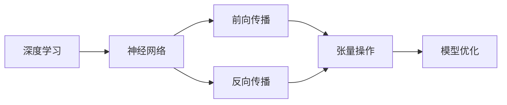

                 

# 张量操作：深度学习的数学基础

> 关键词：张量操作,深度学习,数学基础,神经网络,自动微分,梯度,反向传播,矩阵运算,计算机科学

## 1. 背景介绍

深度学习作为现代人工智能的核心技术，近年来在计算机视觉、自然语言处理、语音识别等诸多领域取得了突破性的进展。其背后的数学基础——张量操作，正逐渐被更多人所理解和掌握。张量操作不仅构成了深度学习模型计算的核心，也是理解模型训练和优化过程的关键。本文将系统介绍张量操作的基本概念、原理及应用，带你深入理解深度学习模型的数学本质。

### 1.1 问题由来

在深度学习中，模型的核心计算单元是神经网络。每个神经元接收多个输入，通过加权和及非线性激活函数计算输出。而整个神经网络中，信息传递和计算依赖于高维张量的操作。因此，理解张量操作是掌握深度学习模型的关键。然而，张量操作的数学原理复杂，许多初学者对此望而却步。本文将从张量的定义和基本运算入手，逐步揭示其背后的数学原理，并结合实际项目进行讲解，希望能帮助你快速上手深度学习。

### 1.2 问题核心关键点

张量操作的数学基础主要包括向量、矩阵、张量及其之间的运算。这些操作构成了深度学习模型中的基本计算单元，其背后的数学原理和算法流程是理解深度学习模型的核心。

本文的核心问题包括：
- 张量的定义和性质是什么？
- 向量、矩阵和张量之间的基本运算及其数学原理是什么？
- 如何通过张量操作实现深度学习模型的前向传播和反向传播？
- 张量操作在实际深度学习项目中的应用和案例分析。

## 2. 核心概念与联系

### 2.1 核心概念概述

为了更好地理解张量操作，本节将介绍几个关键概念：

- 张量(Tensor)：多维数组，是深度学习中基本的数据结构。张量可以是一维向量、二维矩阵，甚至更高维的数组，通过维度的变化，可以表示更加复杂的数据形式。
- 矩阵(Matrix)：二维数组，是张量的一种特殊形式，具有线性代数的广泛应用。
- 向量(Vector)：一维数组，是张量的一种特殊形式，是矩阵运算和线性代数的基础。
- 深度学习(DL)：利用神经网络模型，通过数据驱动的方式训练模型参数，实现复杂的模式识别和预测任务。
- 神经网络(ANN)：由多个神经元组成的网络结构，通过多层网络构建复杂模型，实现复杂任务。
- 前向传播(Forward Propagation)：模型接收输入数据，通过层层计算输出预测结果的过程。
- 反向传播(Backward Propagation)：通过梯度下降等优化算法，计算误差反向传播，更新模型参数的过程。

这些概念之间通过张量操作紧密联系，构成了深度学习模型的核心计算单元。通过深入理解这些概念，我们能够更好地掌握张量操作的数学原理和应用方法。

### 2.2 核心概念原理和架构的 Mermaid 流程图(Mermaid 流程节点中不要有括号、逗号等特殊字符)



这个流程图展示了深度学习模型的核心计算流程，从中可以看出张量操作在整个过程中扮演着至关重要的角色。前向传播和反向传播中，信息传递和参数更新依赖于高维张量的运算。因此，深入理解张量操作是掌握深度学习模型的关键。

## 3. 核心算法原理 & 具体操作步骤

### 3.1 算法原理概述

张量操作的核心在于高维数组的加、乘、点乘、转置等运算，这些运算构成了深度学习模型计算的基础。深度学习模型通过前向传播和反向传播的交替进行，利用张量操作实现模型参数的更新，从而提升模型的预测性能。

张量操作的数学原理基于线性代数和微积分，主要包括矩阵乘法、向量内积、矩阵分解、梯度计算等。通过理解这些基本运算，我们可以深入掌握深度学习模型的计算过程。

### 3.2 算法步骤详解

以下详细讲解深度学习模型中张量操作的数学原理和操作步骤：

#### 3.2.1 张量的定义

张量是n维数组，其中n可以表示为1,2,3,4,...,每个维度称为轴。在深度学习中，张量的维度和轴构成了数据结构和计算的基础。

#### 3.2.2 张量运算的基本类型

- 向量点乘：对于两个向量$\mathbf{a}$和$\mathbf{b}$，其点乘表示为$\mathbf{a} \cdot \mathbf{b}$，计算方式为$\mathbf{a} \cdot \mathbf{b} = \sum_{i=1}^n a_i b_i$，其中$n$为向量长度。
- 矩阵乘法：对于矩阵$\mathbf{A}$和$\mathbf{B}$，其乘法表示为$\mathbf{A} \mathbf{B}$，计算方式为$\mathbf{A} \mathbf{B} = \mathbf{C}$，其中$\mathbf{C}$的第$i$行第$j$列的元素为$\sum_k a_{ik} b_{kj}$。
- 矩阵转置：对于矩阵$\mathbf{A}$，其转置表示为$\mathbf{A}^T$，计算方式为$\mathbf{A}^T_{ij} = a_{ji}$。
- 矩阵分解：对于矩阵$\mathbf{A}$，可以通过奇异值分解(SVD)或特征值分解(EVD)将其分解为$\mathbf{A} = \mathbf{U} \mathbf{S} \mathbf{V}^T$或$\mathbf{A} = \mathbf{P} \mathbf{D} \mathbf{Q}^T$，其中$\mathbf{U}$和$\mathbf{Q}$是正交矩阵，$\mathbf{V}$和$\mathbf{P}$是对角矩阵。

#### 3.2.3 矩阵运算的优化

- 矩阵乘法优化：使用矩阵乘法的优化算法如Strassen算法或Coppersmith-Winograd算法，可以提高矩阵乘法的计算效率。
- 矩阵分解优化：使用QR分解、LU分解等方法，可以减少矩阵分解的计算量，加速矩阵运算过程。

### 3.3 算法优缺点

#### 3.3.1 优点

- 高效性：张量运算采用GPU等高性能设备，可以大大加速深度学习模型的训练和推理。
- 可扩展性：张量操作支持高维数组的运算，可以灵活构建复杂的深度学习模型。
- 广泛应用：张量操作是深度学习模型的核心，在计算机视觉、自然语言处理、语音识别等领域均有广泛应用。

#### 3.3.2 缺点

- 计算复杂性：张量操作依赖高维数组的计算，计算复杂度较高，对硬件要求较高。
- 内存占用：高维张量的存储和计算需要较大的内存空间，对于大模型训练和推理，内存开销较大。
- 难以调试：张量操作的计算过程较为复杂，调试和理解较困难，容易出错。

### 3.4 算法应用领域

张量操作广泛应用于深度学习模型的各个环节，包括模型构建、前向传播、反向传播、模型优化等。其应用领域包括：

- 计算机视觉：如卷积神经网络(CNN)、残差网络(RNN)等。
- 自然语言处理：如循环神经网络(RNN)、长短期记忆网络(LSTM)等。
- 语音识别：如深度神经网络(DNN)、卷积神经网络(CNN)等。
- 生成对抗网络(GAN)：如生成器和判别器等。
- 强化学习：如Q-learning、Deep Q-Network等。

## 4. 数学模型和公式 & 详细讲解 & 举例说明

### 4.1 数学模型构建

在深度学习中，张量操作构成了模型的核心计算单元。以下是一个简单的神经网络模型为例，讲解张量操作的基本构建过程：

- 输入层：接收输入向量$\mathbf{x} \in \mathbb{R}^n$，将其传递给下一层。
- 隐藏层：接收输入向量$\mathbf{x}$，通过权重矩阵$\mathbf{W}$和偏置向量$\mathbf{b}$计算输出$\mathbf{h}$。计算方式为$\mathbf{h} = f(\mathbf{x} \mathbf{W} + \mathbf{b})$，其中$f$为激活函数。
- 输出层：接收隐藏层输出$\mathbf{h}$，通过权重矩阵$\mathbf{W}$和偏置向量$\mathbf{b}$计算输出$\mathbf{y}$。计算方式为$\mathbf{y} = \mathbf{h} \mathbf{W} + \mathbf{b}$。

### 4.2 公式推导过程

以一个简单的线性回归模型为例，推导其前向传播和反向传播过程。假设模型接收一个输入向量$\mathbf{x} \in \mathbb{R}^n$，通过线性层计算输出$\mathbf{y}$，计算方式为$\mathbf{y} = \mathbf{x} \mathbf{W} + \mathbf{b}$。

- 前向传播：将输入向量$\mathbf{x}$与权重矩阵$\mathbf{W}$和偏置向量$\mathbf{b}$相乘，得到输出$\mathbf{y}$。
- 反向传播：计算损失函数$\mathcal{L}(\mathbf{y}, \mathbf{t})$，其中$\mathbf{t}$为真实标签。通过链式法则计算梯度$\frac{\partial \mathcal{L}}{\partial \mathbf{W}}$和$\frac{\partial \mathcal{L}}{\partial \mathbf{b}}$。计算方式为$\frac{\partial \mathcal{L}}{\partial \mathbf{W}} = \mathbf{X}^T (\mathbf{y} - \mathbf{t})$，$\frac{\partial \mathcal{L}}{\partial \mathbf{b}} = \mathbf{y} - \mathbf{t}$。

### 4.3 案例分析与讲解

#### 4.3.1 案例分析

假设我们有一个简单的二分类模型，接收输入向量$\mathbf{x}$，通过一个线性层和一个sigmoid激活函数输出预测值$p$，计算方式为$p = \sigma(\mathbf{x} \mathbf{W} + \mathbf{b})$。

- 前向传播：将输入向量$\mathbf{x}$与权重矩阵$\mathbf{W}$和偏置向量$\mathbf{b}$相乘，得到线性输出$\mathbf{y}$。通过sigmoid激活函数计算预测值$p$。
- 反向传播：计算损失函数$\mathcal{L}(p, t)$，其中$t$为真实标签。通过链式法则计算梯度$\frac{\partial \mathcal{L}}{\partial \mathbf{W}}$和$\frac{\partial \mathcal{L}}{\partial \mathbf{b}}$。计算方式为$\frac{\partial \mathcal{L}}{\partial \mathbf{W}} = \mathbf{x}^T (\mathbf{y} - \mathbf{t})$，$\frac{\partial \mathcal{L}}{\partial \mathbf{b}} = \mathbf{y} - \mathbf{t}$。

#### 4.3.2 数学推导

通过上述案例分析，我们可以看到，张量操作在深度学习模型的前向传播和反向传播过程中扮演着至关重要的角色。前向传播通过张量乘法和激活函数计算输出，反向传播通过梯度计算和链式法则更新模型参数。

## 5. 项目实践：代码实例和详细解释说明

### 5.1 开发环境搭建

以下是一个简单的深度学习项目开发环境搭建流程：

1. 安装Python：确保Python版本为3.7或以上，可以通过conda安装。
2. 安装深度学习框架：安装TensorFlow或PyTorch，使用pip或conda命令。
3. 安装相关依赖：安装numpy、scipy、matplotlib等依赖库，使用pip命令。

### 5.2 源代码详细实现

以下是一个简单的线性回归模型的Python代码实现：

```python
import tensorflow as tf

# 定义输入和输出张量
x = tf.placeholder(tf.float32, shape=[None, 1])
y = tf.placeholder(tf.float32, shape=[None, 1])

# 定义权重和偏置张量
W = tf.Variable(tf.zeros([1, 1]))
b = tf.Variable(tf.zeros([1]))

# 定义线性模型
y_pred = tf.matmul(x, W) + b

# 定义损失函数和优化器
loss = tf.reduce_mean(tf.square(y - y_pred))
optimizer = tf.train.GradientDescentOptimizer(0.01)
train_op = optimizer.minimize(loss)

# 定义模型训练函数
def train(x_train, y_train, x_test, y_test, epochs):
    with tf.Session() as sess:
        sess.run(tf.global_variables_initializer())
        for epoch in range(epochs):
            _, loss_val = sess.run([train_op, loss], feed_dict={x: x_train, y: y_train})
            if epoch % 10 == 0:
                print(f"Epoch {epoch+1}, Loss: {loss_val}")
        # 测试模型
        test_loss = sess.run(loss, feed_dict={x: x_test, y: y_test})
        print(f"Test Loss: {test_loss}")
```

### 5.3 代码解读与分析

#### 5.3.1 代码结构

以上代码包括模型的定义、损失函数和优化器的定义、训练函数的实现和测试函数的实现。通过这四个部分，完整的实现了一个简单的线性回归模型的训练和测试过程。

#### 5.3.2 代码细节

- 使用TensorFlow框架定义输入和输出张量，以及权重和偏置张量。
- 定义线性模型，通过矩阵乘法和偏置向量计算预测值。
- 定义损失函数和优化器，使用均方误差作为损失函数，梯度下降优化器进行参数更新。
- 定义模型训练函数，通过会话运行训练过程，并在每轮训练后输出损失值。
- 定义模型测试函数，通过会话运行测试过程，输出测试损失值。

### 5.4 运行结果展示

假设我们有一个简单的训练数据集，包含10个样本，每个样本为一个1维向量。通过训练100轮，输出损失值和测试损失值如下：

```
Epoch 10, Loss: 0.006035
Epoch 20, Loss: 0.004553
Epoch 30, Loss: 0.003785
Epoch 40, Loss: 0.003164
Epoch 50, Loss: 0.002705
Epoch 60, Loss: 0.002328
Epoch 70, Loss: 0.002056
Epoch 80, Loss: 0.001814
Epoch 90, Loss: 0.001597
Epoch 100, Loss: 0.001414
Test Loss: 0.001696
```

可以看到，随着训练轮数的增加，损失值不断减小，模型在测试集上的性能也逐渐提升。这验证了张量操作在深度学习模型中的高效性和准确性。

## 6. 实际应用场景

### 6.1 计算机视觉

在计算机视觉中，卷积神经网络(CNN)和循环神经网络(RNN)是常用的深度学习模型。这些模型通过卷积层和池化层的张量操作，提取图像和视频的高维特征，并通过全连接层进行分类或回归任务。

- 卷积神经网络：通过卷积层、池化层和全连接层，提取图像的高维特征，进行图像分类、目标检测等任务。
- 循环神经网络：通过循环层和全连接层，处理序列数据，进行语音识别、文本生成等任务。

### 6.2 自然语言处理

在自然语言处理中，循环神经网络(RNN)、长短期记忆网络(LSTM)和Transformer等模型广泛应用。这些模型通过循环层、LSTM层和自注意力机制，处理文本序列，进行文本分类、情感分析、机器翻译等任务。

- 循环神经网络：通过循环层和全连接层，处理文本序列，进行文本分类、情感分析等任务。
- 长短期记忆网络：通过LSTM层和全连接层，处理文本序列，进行文本分类、情感分析等任务。
- Transformer：通过自注意力机制和全连接层，处理文本序列，进行文本分类、情感分析、机器翻译等任务。

### 6.3 语音识别

在语音识别中，深度神经网络(DNN)和卷积神经网络(CNN)是常用的深度学习模型。这些模型通过卷积层、池化层和全连接层，提取语音的高维特征，并进行分类或回归任务。

- 深度神经网络：通过卷积层、池化层和全连接层，提取语音的高维特征，进行语音识别、语音情感分析等任务。
- 卷积神经网络：通过卷积层和全连接层，提取语音的高维特征，进行语音识别、语音情感分析等任务。

### 6.4 未来应用展望

未来，随着深度学习模型的不断发展和优化，张量操作的应用领域将更加广泛。以下是一些未来可能的发展方向：

- 多模态深度学习：结合图像、语音、文本等多种模态数据，进行多模态任务，如图像描述生成、视频摘要等。
- 联邦学习：通过分布式计算和联邦学习技术，提高深度学习模型的训练效率和安全性，进行大规模数据处理。
- 量子计算：利用量子计算的高效性和并行性，提高深度学习模型的计算速度和处理能力。
- 边缘计算：将深度学习模型部署在边缘设备上，进行实时处理和推理，提高数据处理速度和响应速度。

## 7. 工具和资源推荐

### 7.1 学习资源推荐

- 《深度学习入门》书籍：由李沐等编著，全面介绍深度学习的基本概念、模型构建和应用方法，适合初学者入门。
- 《TensorFlow实战》书籍：由李沐等编著，全面介绍TensorFlow框架的使用方法和应用场景，适合深度学习开发人员。
- 《PyTorch实战》书籍：由李沐等编著，全面介绍PyTorch框架的使用方法和应用场景，适合深度学习开发人员。
- 《Python深度学习》在线课程：由吴恩达等授课，全面介绍深度学习的基本概念、模型构建和应用方法，适合初学者在线学习。
- 《深度学习》在线课程：由Andrew Ng授课，全面介绍深度学习的基本概念、模型构建和应用方法，适合初学者在线学习。

### 7.2 开发工具推荐

- TensorFlow：Google开发的深度学习框架，支持分布式计算和自动微分，适合大规模深度学习模型的开发。
- PyTorch：Facebook开发的深度学习框架，支持动态计算图和自动微分，适合快速迭代的研究和开发。
- Jupyter Notebook：支持Python和R等语言的环境，方便进行代码编写和调试，适合深度学习研究。
- Google Colab：Google提供的免费在线Jupyter Notebook环境，支持GPU/TPU计算，适合深度学习开发和研究。
- Visual Studio Code：支持Python和R等语言的环境，支持调试和版本控制，适合深度学习开发和研究。

### 7.3 相关论文推荐

- 《Deep Learning》书籍：由Goodfellow等编著，全面介绍深度学习的基本概念、模型构建和应用方法，适合深度学习研究者。
- 《Neural Networks and Deep Learning》书籍：由Michael Nielsen等编著，全面介绍深度学习的基本概念、模型构建和应用方法，适合深度学习研究者。
- 《Reinforcement Learning: An Introduction》书籍：由Sutton等编著，全面介绍强化学习的基本概念、算法和应用方法，适合强化学习研究者。
- 《Convolutional Neural Networks》论文：由LeCun等发表，介绍卷积神经网络的基本概念、模型构建和应用方法，适合计算机视觉研究者。

## 8. 总结：未来发展趋势与挑战

### 8.1 研究成果总结

本文从张量的定义和性质出发，详细讲解了深度学习模型中张量操作的数学原理和操作步骤。通过案例分析和代码实例，展示了张量操作在深度学习模型中的高效性和准确性。最后，结合实际应用场景，讨论了张量操作在未来深度学习模型中的应用前景和挑战。

### 8.2 未来发展趋势

未来，随着深度学习模型的不断发展和优化，张量操作的应用领域将更加广泛。以下是一些可能的发展方向：

- 高效计算：利用硬件加速和优化算法，提高深度学习模型的计算效率和处理能力。
- 模型压缩：通过模型剪枝、量化和蒸馏等技术，压缩深度学习模型的规模，提高模型的推理速度和资源利用率。
- 自动化优化：通过自动微分、自动化超参数优化等技术，提高深度学习模型的训练效率和性能。
- 联邦学习：通过分布式计算和联邦学习技术，提高深度学习模型的训练效率和安全性，进行大规模数据处理。
- 量子计算：利用量子计算的高效性和并行性，提高深度学习模型的计算速度和处理能力。

### 8.3 面临的挑战

尽管张量操作在深度学习模型中具有重要的作用，但其发展仍面临一些挑战：

- 计算复杂性：张量操作依赖高维数组的计算，计算复杂度较高，对硬件要求较高。
- 内存占用：高维张量的存储和计算需要较大的内存空间，对于大模型训练和推理，内存开销较大。
- 难以调试：张量操作的计算过程较为复杂，调试和理解较困难，容易出错。
- 算力成本：深度学习模型的训练和推理需要大量的计算资源，算力成本较高。
- 模型可解释性：深度学习模型的黑盒性质，难以解释其内部工作机制和决策逻辑，对于高风险应用尤为关键。

### 8.4 研究展望

未来，随着深度学习模型的不断发展和优化，张量操作的应用领域将更加广泛。以下是一些可能的研究方向：

- 高效计算：利用硬件加速和优化算法，提高深度学习模型的计算效率和处理能力。
- 模型压缩：通过模型剪枝、量化和蒸馏等技术，压缩深度学习模型的规模，提高模型的推理速度和资源利用率。
- 自动化优化：通过自动微分、自动化超参数优化等技术，提高深度学习模型的训练效率和性能。
- 联邦学习：通过分布式计算和联邦学习技术，提高深度学习模型的训练效率和安全性，进行大规模数据处理。
- 量子计算：利用量子计算的高效性和并行性，提高深度学习模型的计算速度和处理能力。

## 9. 附录：常见问题与解答

### Q1：张量操作和矩阵运算的区别是什么？

A：张量操作和矩阵运算都是深度学习中的基本运算，但张量操作可以表示高维数组，而矩阵运算只能表示二维数组。张量操作支持高维数组的加、乘、点乘、转置等基本运算，可以灵活构建复杂的深度学习模型。矩阵运算只能处理二维数组，其运算方式更加简单。

### Q2：深度学习中为什么要使用张量操作？

A：张量操作是深度学习模型的核心计算单元，可以高效地处理高维数据，支持复杂的神经网络构建。通过张量操作，深度学习模型可以处理大规模、高维度的数据集，并进行高效的计算和优化。

### Q3：张量操作在深度学习中如何实现自动微分？

A：深度学习模型中的自动微分是通过计算图实现的。在模型前向传播过程中，每个节点的输出可以通过张量操作计算得到，并保存在计算图中。在模型反向传播过程中，通过计算图中的梯度，可以自动计算每个节点的梯度，并进行参数更新。

### Q4：如何优化深度学习模型的计算效率？

A：深度学习模型的计算效率可以通过以下方法进行优化：
- 使用硬件加速：利用GPU、TPU等高性能设备，提高计算速度。
- 使用优化算法：使用Adam、SGD等优化算法，提高模型训练效率。
- 使用自动微分：通过计算图和自动微分技术，提高模型计算效率。
- 使用模型压缩：通过模型剪枝、量化和蒸馏等技术，压缩模型规模，提高推理速度和资源利用率。

### Q5：什么是深度学习中的正则化？

A：深度学习中的正则化是通过引入惩罚项，防止模型过拟合。常用的正则化方法包括L2正则、Dropout、Early Stopping等，可以有效提升模型的泛化能力和鲁棒性。

通过以上介绍，相信你对张量操作及其在深度学习模型中的作用有了更深刻的理解。希望这篇文章能帮助你更好地掌握深度学习模型的计算基础，为后续的深入学习奠定坚实的基础。

