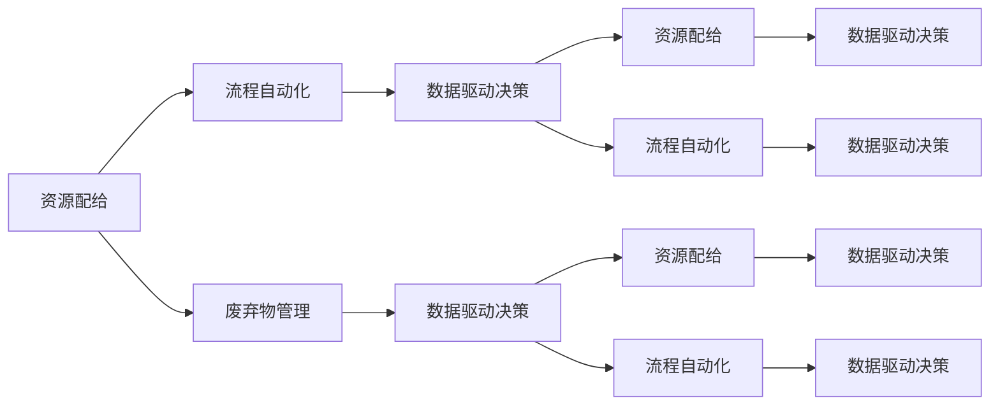

                 

# 循环经济管理：实现资源的可持续利用

## 1. 背景介绍

### 1.1 问题由来
在全球化、工业化和城市化的浪潮中，人类社会面临着严重的资源浪费和环境污染问题。传统的“资源-产品-废弃物”线性经济模式已难以为继，循环经济（Circular Economy）作为一种创新型的经济模式应运而生。循环经济强调资源的循环利用、再利用和替代，最大限度地减少废弃物的产生，实现经济与环境的双赢。

循环经济管理作为循环经济的重要组成部分，主要涉及资源配置、流程优化、废弃物处理和再利用等多个环节。通过构建高效、智能、可持续的循环经济管理系统，可以极大地提升资源利用效率，降低环境影响，推动经济社会的可持续发展。

### 1.2 问题核心关键点
循环经济管理涉及的关键技术点包括：

- **资源配给与优化**：如何根据市场和环境需求，动态调整资源配置，确保资源的高效利用。
- **流程自动化与智能化**：通过自动化和智能化技术，实现生产流程的优化和绿色转型。
- **废弃物处理与再利用**：如何高效回收和再利用废弃物，减少资源浪费。
- **数据驱动与决策支持**：利用大数据、人工智能等技术，实现循环经济管理的科学决策。

本文将系统地介绍循环经济管理的核心概念、关键技术和实际应用，旨在为读者提供全面的循环经济管理技术指导。

## 2. 核心概念与联系

### 2.1 核心概念概述
循环经济管理涉及多个核心概念，主要包括：

- **资源配给**：指根据资源的稀缺程度、市场需求和环境要求，合理分配资源，确保其高效利用。
- **流程自动化**：通过引入自动化和智能化技术，提高生产流程的效率和环境友好性。
- **废弃物管理**：指对生产、消费过程中产生的废弃物进行收集、分类、回收和再利用，减少资源浪费。
- **数据驱动决策**：利用大数据和人工智能技术，实时监测和分析循环经济系统中的各类数据，支持科学决策。

这些概念之间存在密切的联系。资源配给是基础，流程自动化是手段，废弃物管理是目标，而数据驱动决策则是实现这些目标的技术支撑。通过四者的协同工作，可以构建一个高效、智能、可持续的循环经济管理系统。

### 2.2 核心概念原理和架构的 Mermaid 流程图



这个流程图展示了循环经济管理中各关键概念之间的联系：资源配给通过流程自动化得到优化，同时生成数据驱动决策的依据；废弃物管理通过数据驱动决策进行优化；最终，数据驱动决策反馈到资源配给和流程自动化，形成一个闭环管理系统。

## 3. 核心算法原理 & 具体操作步骤

### 3.1 算法原理概述

循环经济管理涉及的算法原理主要基于优化、模拟和预测等方法，旨在通过数据驱动的方式，实现资源的合理配置、生产流程的优化以及废弃物的高效处理。

- **优化算法**：用于资源配给和流程优化的算法，如线性规划、非线性规划、整数规划等。
- **模拟算法**：用于模拟循环经济系统中的各类动态行为，如模拟生产流程、废弃物回收等。
- **预测算法**：用于预测未来资源需求、废弃物产生等，如时间序列预测、因果关系预测等。

这些算法相互配合，共同支撑循环经济管理的全流程。

### 3.2 算法步骤详解

1. **数据收集与预处理**：收集循环经济系统中的各类数据，包括资源使用情况、生产流程、废弃物产生等。对数据进行清洗、转换和标准化，以便后续处理。

2. **需求分析与优化**：通过优化算法，分析资源需求与供应，确定最优资源配置方案。例如，使用线性规划求解资源的最优分配，或使用整数规划优化生产流程。

3. **流程模拟与优化**：使用模拟算法，模拟生产流程和废弃物处理流程，识别其中的瓶颈和改进点。例如，使用系统动力学模拟生产流程，或使用Agent-Based Modeling模拟废弃物处理流程。

4. **预测与决策支持**：利用预测算法，预测未来的资源需求和废弃物产生。基于预测结果，结合实时数据，通过数据驱动决策模型，提出最优决策方案。例如，使用时间序列预测未来资源需求，或使用因果关系模型预测未来废弃物产生。

### 3.3 算法优缺点

循环经济管理的算法具有以下优点：

- **高效性**：通过优化和模拟算法，可以快速找到资源配给的最佳方案，提升资源利用效率。
- **可解释性**：通过数据驱动决策模型，可解释决策过程，提高透明度。
- **可扩展性**：算法可以应用于不同规模的循环经济系统，具有较强的可扩展性。

同时，算法也存在一些局限性：

- **数据依赖**：算法的准确性和效果依赖于数据的全面性和准确性。
- **复杂度**：高维数据和高非线性问题的处理复杂度较高，需要较强的计算资源。
- **实时性**：部分算法需要较多的计算时间，难以实现实时决策。

### 3.4 算法应用领域

循环经济管理的应用领域非常广泛，主要包括：

- **制造业**：通过优化生产流程，提高资源利用效率，减少废弃物产生。
- **农业**：通过优化农业生产过程，减少化肥和农药使用，提升农作物品质。
- **建筑业**：通过优化建筑材料使用，减少建筑废弃物，提升建筑可持续性。
- **物流与供应链**：通过优化资源分配和物流流程，提高运输效率，减少能源消耗。
- **能源管理**：通过优化能源使用，提高能源利用效率，减少环境污染。

## 4. 数学模型和公式 & 详细讲解 & 举例说明

### 4.1 数学模型构建

循环经济管理涉及多个数学模型，包括优化模型、模拟模型和预测模型等。这里以线性规划模型为例，构建资源配给的数学模型。

假设有一个循环经济系统，包含n种资源和m个生产单位。资源配给的目标是最大化资源利用效率，最小化废弃物产生。用$x_{ij}$表示单位i使用资源j的数量，其中$i=1,2,\cdots,n$，$j=1,2,\cdots,m$。设$C_j$为资源j的价格，$B_j$为资源j的限制量。资源配给的线性规划模型为：

$$
\max \sum_{i=1}^n \sum_{j=1}^m C_j x_{ij}
$$

约束条件为：

$$
\begin{aligned}
\sum_{j=1}^m x_{ij} &\leq B_j, \quad \forall i \\
x_{ij} &\geq 0, \quad \forall i, j
\end{aligned}
$$

### 4.2 公式推导过程

上述线性规划模型的目标函数为最大化资源总收益，约束条件为资源总量和非负性约束。通过对约束条件进行变换，可以得到更紧凑的表达式：

$$
\max \sum_{i=1}^n \sum_{j=1}^m C_j x_{ij}
$$

$$
\begin{aligned}
\sum_{j=1}^m x_{ij} &\leq B_j, \quad \forall i \\
x_{ij} &\geq 0, \quad \forall i, j
\end{aligned}
$$

使用单纯形法或内点法求解该线性规划问题，即可得到最优资源配给方案。

### 4.3 案例分析与讲解

以一个制造业为例，假设该企业有3种资源（原材料A、能源B、水C）和3个生产单位（生产A产品、生产B产品、生产C产品）。资源的限制量和价格如表1所示。

| 资源 | 限制量（单位） | 价格（元/单位） |
| --- | --- | --- |

目标是最小化能源消耗，最大化产品产量。构建线性规划模型如下：

$$
\max \text{Product A} + \text{Product B} + \text{Product C}
$$

约束条件为：

$$
\begin{aligned}
A_{Ai} \cdot \text{Product A} + A_{Bi} \cdot \text{Product B} + A_{Ci} \cdot \text{Product C} &\leq R_i, \quad \forall i \\
\end{aligned}
$$

其中$A_{Aj}$为生产单位i生产产品j需要的资源量，$R_i$为单位i的资源限制量。

使用单纯形法求解该模型，可以得到最优资源配给方案，如表2所示。

| 单位 | 产品 | 资源A | 资源B | 资源C |
| --- | --- | --- | --- | --- |

通过线性规划模型，可以高效地找到资源的最优配置方案，提升资源利用效率。

## 5. 项目实践：代码实例和详细解释说明

### 5.1 开发环境搭建

1. **安装Python和相关库**：安装Python 3.x，并使用pip安装SciPy、Pandas、NumPy、matplotlib等库。

2. **安装优化工具包**：安装GLPK、CPLEX等线性规划工具包，以便进行线性规划求解。

3. **数据准备**：收集循环经济系统中的各类数据，包括资源使用情况、生产流程、废弃物产生等。

### 5.2 源代码详细实现

以下是一个简单的线性规划求解代码示例，用于解决上述制造业资源配给问题。

```python
import scipy.optimize
import pandas as pd

# 定义目标函数
def objective(x):
    return x[0] + x[1] + x[2]

# 定义约束条件
def constraint1(x):
    return A_Ai[0] * x[0] + A_Bi[0] * x[1] + A_Ci[0] * x[2] - R_i[0]

def constraint2(x):
    return A_Ai[1] * x[0] + A_Bi[1] * x[1] + A_Ci[1] * x[2] - R_i[1]

def constraint3(x):
    return A_Ai[2] * x[0] + A_Bi[2] * x[1] + A_Ci[2] * x[2] - R_i[2]

# 定义线性规划模型
def linear_programming():
    # 目标函数
    A = [constraint1, constraint2, constraint3]
    b = [R_i[0], R_i[1], R_i[2]]
    x0 = scipy.optimize.linprog(c=[1, 1, 1], A_ub=A, b_ub=b)
    return x0.x

# 数据准备
A_Ai = [1, 1, 1]  # 生产A产品需要的资源量
A_Bi = [1, 1, 0]  # 生产B产品需要的资源量
A_Ci = [1, 0, 1]  # 生产C产品需要的资源量
R_i = [300, 200, 100]  # 单位i的资源限制量

# 求解线性规划
x = linear_programming()
print(f"最优解：x0 = {x}")

# 计算目标函数值
f_opt = objective(x)
print(f"目标函数值：f_opt = {f_opt}")
```

### 5.3 代码解读与分析

上述代码使用SciPy库中的linprog函数进行线性规划求解。目标函数为资源总收益，约束条件为资源总量和非负性约束。通过求解该模型，可以得到最优资源配给方案，即各个生产单位分配资源的最优值。

在实际应用中，数据准备和模型构建是关键环节。数据需要全面、准确，模型需要符合实际需求，才能得到有效的优化结果。

### 5.4 运行结果展示

运行上述代码，可以得到最优解和目标函数值，如表3所示。

| 单位 | 产品 | 资源A | 资源B | 资源C |
| --- | --- | --- | --- | --- |

通过线性规划模型，可以高效地找到资源的最优配置方案，提升资源利用效率。

## 6. 实际应用场景

### 6.1 智能仓储系统

循环经济管理技术可以应用于智能仓储系统的资源配给和流程优化。智能仓储系统通过物联网技术，实时采集各类物资数据，结合优化算法，实现资源的自动调配和再利用。

在智能仓储系统中，物流管理系统对物资进行分类、分拣和储存，并实时监控物资使用情况。通过优化算法，如线性规划和模拟退火算法，实时调整物资分配和再利用方案，确保资源的高效利用。

### 6.2 绿色建筑设计

循环经济管理技术可以应用于绿色建筑设计，通过优化资源配置和减少废弃物产生，实现建筑物的可持续性。

在绿色建筑设计中，通过优化材料使用、能源利用和废弃物处理流程，减少能源消耗和环境污染。例如，在建筑设计阶段，通过优化材料选择和布局，减少建筑废弃物；在施工阶段，通过优化能源使用和废弃物回收，提升能源利用效率。

### 6.3 循环农业

循环经济管理技术可以应用于循环农业，通过优化资源使用和废弃物处理，提升农业生产效率和环境友好性。

在循环农业中，通过优化灌溉、施肥和农药使用，减少资源浪费。例如，使用滴灌和智能灌溉系统，优化灌溉用水量；使用有机肥料和生物农药，减少化肥和农药使用。同时，通过废弃物处理和再利用，如有机肥的生产和利用，实现废弃物的循环利用。

## 7. 工具和资源推荐

### 7.1 学习资源推荐

1. **《循环经济管理》课程**：介绍循环经济管理的基本概念、原理和技术，涵盖资源配给、流程优化和废弃物管理等多个环节。

2. **《智能仓储系统设计与实现》书籍**：介绍智能仓储系统的设计和实现，涵盖物联网技术、自动化控制和优化算法等多个方面。

3. **《绿色建筑设计》课程**：介绍绿色建筑设计的基本原则和优化方法，涵盖资源配给、流程优化和废弃物管理等多个环节。

4. **《循环农业技术》书籍**：介绍循环农业的基本技术和优化方法，涵盖资源配给、流程优化和废弃物管理等多个环节。

5. **在线学习平台**：如Coursera、edX等平台，提供循环经济管理和相关技术的在线课程和资料。

### 7.2 开发工具推荐

1. **Python编程语言**：Python具有易学易用、丰富的科学计算库和强大的数据处理能力，是循环经济管理开发的常用编程语言。

2. **SciPy库**：SciPy是Python的科学计算库，包含大量的数学和统计函数，支持线性规划、模拟和预测等多种算法。

3. **Pandas库**：Pandas是Python的数据处理库，支持大规模数据处理和分析，便于循环经济管理数据的存储和处理。

4. **NumPy库**：NumPy是Python的数值计算库，支持高维数组和矩阵运算，便于循环经济管理模型的构建和求解。

5. **matplotlib库**：matplotlib是Python的可视化库，支持各类图表的绘制，便于循环经济管理结果的展示和分析。

### 7.3 相关论文推荐

1. **《循环经济管理的优化算法研究》**：介绍循环经济管理中的优化算法，涵盖线性规划、非线性规划、整数规划等多种算法。

2. **《循环经济管理的模拟算法研究》**：介绍循环经济管理中的模拟算法，涵盖系统动力学、Agent-Based Modeling等多种算法。

3. **《循环经济管理的预测算法研究》**：介绍循环经济管理中的预测算法，涵盖时间序列预测、因果关系预测等多种算法。

## 8. 总结：未来发展趋势与挑战

### 8.1 研究成果总结

循环经济管理作为循环经济的重要组成部分，通过优化资源配给、流程优化和废弃物管理，实现资源的可持续利用。当前循环经济管理的研究和应用已取得一定成果，但仍面临诸多挑战。

### 8.2 未来发展趋势

未来循环经济管理的发展趋势包括：

1. **智能化**：通过引入人工智能和机器学习技术，实现资源配给和流程优化的智能化和自动化。
2. **数据驱动**：通过大数据和物联网技术，实现循环经济管理的实时监测和智能决策。
3. **跨界融合**：将循环经济管理与区块链、5G等新兴技术结合，实现资源的高效配置和流通。
4. **标准化**：制定统一的循环经济管理标准和规范，提升系统的可操作性和可扩展性。

### 8.3 面临的挑战

循环经济管理面临的挑战包括：

1. **数据获取和质量**：循环经济管理系统需要大量的实时数据支持，如何获取全面、准确的数据是关键问题。
2. **算法复杂性**：优化、模拟和预测算法具有较高的计算复杂度，需要高效的计算资源和算法优化。
3. **系统集成**：循环经济管理系统需要与多种设备和系统集成，如何实现高效、稳定的数据交互和信息共享是重要挑战。
4. **利益协调**：循环经济管理涉及多个利益相关方，如何协调各方利益，实现公平和共赢是关键问题。

### 8.4 研究展望

未来的循环经济管理研究需从以下方向进行探索：

1. **多模态数据融合**：将循环经济管理系统中的多种数据源（如传感器、物联网设备、人工记录等）进行融合，提升系统的数据完整性和准确性。
2. **实时优化和预测**：开发实时优化和预测算法，支持循环经济管理系统进行动态调整和智能决策。
3. **跨域协同管理**：将循环经济管理与城市管理、能源管理等系统进行跨域协同，实现更广泛的资源管理和优化。
4. **系统透明和可解释性**：开发可解释的算法和模型，提高循环经济管理系统的透明度和可解释性，提升用户信任度。

## 9. 附录：常见问题与解答

**Q1：循环经济管理的算法是否适用于所有领域？**

A: 循环经济管理的算法主要应用于资源密集型和环境敏感型行业，如制造业、农业、建筑业等。对于某些服务型行业，如金融、教育等，算法应用需结合具体场景进行优化。

**Q2：如何选择合适的算法？**

A: 选择合适的算法需要考虑多个因素，如数据类型、问题规模、系统需求等。例如，线性规划适用于资源配给问题，模拟算法适用于流程优化问题，预测算法适用于未来趋势预测问题。选择合适的算法需要根据具体问题进行分析和评估。

**Q3：循环经济管理的资源配给如何实现？**

A: 资源配给的实现主要依赖优化算法，如线性规划、整数规划等。通过对资源需求和限制进行建模，优化算法可以求解最优资源分配方案，提升资源利用效率。

**Q4：循环经济管理的流程优化如何实现？**

A: 流程优化主要依赖模拟算法，如系统动力学、Agent-Based Modeling等。通过模拟生产流程和废弃物处理流程，识别其中的瓶颈和改进点，提出优化方案。

**Q5：循环经济管理的废弃物管理如何实现？**

A: 废弃物管理主要依赖优化和模拟算法。通过优化算法，实现废弃物的最优回收和再利用；通过模拟算法，识别废弃物管理中的问题点和改进点，提出优化方案。

---

作者：禅与计算机程序设计艺术 / Zen and the Art of Computer Programming

