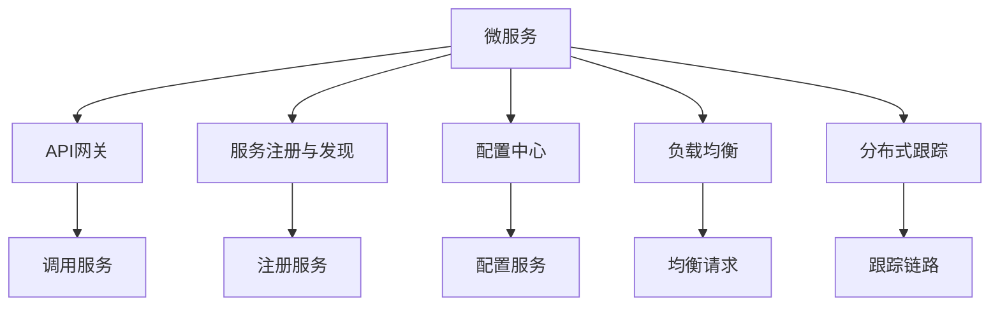

                 

# 微服务架构：解耦与扩展性的艺术

## 1. 背景介绍

### 1.1 问题由来
在传统单体应用架构中，一个应用包含所有功能模块，各个模块之间的通信通过内部调用完成。这种架构简单、部署方便，但在系统规模增长时，出现了一系列问题：

- **单体膨胀**：应用规模变大，代码库变得复杂，维护成本高。
- **部署难度大**：单体应用难以进行快速迭代部署。
- **服务耦合度高**：不同服务之间高度依赖，修改一个服务可能导致连锁反应。

微服务架构（Microservices Architecture）是为了解决这些问题而提出的。通过将单体应用分解为多个独立的、松耦合的服务，每个服务独立部署、独立运行，微服务架构有效解决了单体应用中存在的挑战，提升了系统的可维护性和扩展性。

### 1.2 问题核心关键点
微服务架构的核心在于通过将单体应用拆分为多个小服务，实现服务的独立部署、独立运行，从而降低服务的耦合度，提升系统的可维护性、扩展性和容错性。其主要包括以下几个关键点：

- **服务解耦**：将大应用拆分为多个小服务，服务之间通过RESTful API通信，减少服务之间的耦合。
- **独立部署**：每个服务独立部署，根据需求进行版本更新，避免影响其他服务。
- **自治自治**：每个服务内部自治，可以根据自身需求进行调整优化。
- **容错性**：服务之间通过分布式机制实现容错，提升系统可靠性。
- **持续集成和持续部署**：通过CI/CD流程，实现快速迭代开发，提升开发效率。

微服务架构已成为当下企业架构转型的重要方向，其在电子商务、金融、医疗、互联网等领域的成功应用，展示了其强大的生命力。

## 2. 核心概念与联系

### 2.1 核心概念概述

为更好地理解微服务架构，本节将介绍几个密切相关的核心概念：

- **微服务**：将单体应用拆分为多个独立的、功能明确的小服务。每个服务负责一部分业务逻辑，可以独立部署、独立运行。
- **API网关**：负责统一调用各个微服务的入口，将客户端请求转发到对应服务。
- **服务注册与发现**：服务注册到服务注册中心，其他服务通过服务发现机制查找和调用。
- **配置中心**：统一管理应用配置，包括服务地址、密钥等。
- **负载均衡**：将请求均匀分发到多个服务实例上，提升系统的稳定性和可用性。
- **分布式跟踪**：记录系统调用链路，便于调试和问题排查。

这些核心概念之间的逻辑关系可以通过以下Mermaid流程图来展示：



这个流程图展示微服务架构的核心概念及其之间的关系：

1. 微服务通过API网关接收请求，然后根据配置中心的信息，调用相应服务。
2. 服务注册与发现使得各个微服务可以相互发现和调用。
3. 配置中心统一管理服务信息，使得服务配置更加集中和可管理。
4. 负载均衡分散请求到多个服务实例，提升系统的负载能力。
5. 分布式跟踪记录系统调用链路，便于问题排查和优化。

这些核心概念共同构成了微服务架构的基础，使得系统能够高效、稳定地运行。

## 3. 核心算法原理 & 具体操作步骤

### 3.1 算法原理概述

微服务架构的算法原理主要围绕两个方面展开：服务的独立部署和服务的调用通信。

- **独立部署**：将单体应用拆分为多个微服务，每个微服务可以独立构建、测试、部署。每个微服务的版本更新不影响其他服务，使得开发和部署更加灵活。
- **服务调用**：微服务之间通过RESTful API进行通信，接口定义清晰、调用简单。

具体来说，微服务架构的算法原理包括以下几个步骤：

1. 将单体应用拆分为多个独立的微服务，每个服务负责一部分业务逻辑。
2. 每个微服务独立构建、测试、部署，使用版本控制系统进行管理。
3. 服务之间通过RESTful API进行通信，接口定义清晰、调用简单。
4. 使用配置中心统一管理服务信息，包括服务地址、密钥等。
5. 使用服务注册与发现机制，使得服务之间能够相互发现和调用。
6. 使用负载均衡分散请求到多个服务实例，提升系统的负载能力。
7. 使用分布式跟踪记录系统调用链路，便于问题排查和优化。

### 3.2 算法步骤详解

以下详细讲解微服务架构的算法步骤：

**Step 1: 应用拆分**
将单体应用拆分为多个独立的微服务。一般根据业务功能或数据边界来划分服务。例如，电商网站可以拆分为用户服务、商品服务、订单服务等。

**Step 2: 服务构建**
为每个微服务编写独立的代码库，构建独立的代码库。使用版本控制系统（如Git）进行管理。

**Step 3: 服务部署**
每个微服务独立部署。可以使用Docker等容器化技术进行打包和部署，使用Kubernetes等容器编排工具进行管理。

**Step 4: 服务通信**
使用RESTful API进行服务之间的通信。定义清晰的API接口，使用HTTP协议进行调用。

**Step 5: 配置管理**
使用配置中心（如Consul、Eureka等）统一管理服务信息，包括服务地址、密钥等。

**Step 6: 服务注册与发现**
使用服务注册与发现机制，使得服务之间能够相互发现和调用。常见的机制包括Zookeeper、Etcd等。

**Step 7: 负载均衡**
使用负载均衡机制，将请求分散到多个服务实例上，提升系统的负载能力。

**Step 8: 分布式跟踪**
使用分布式跟踪工具（如Zipkin、Jaeger等）记录系统调用链路，便于问题排查和优化。

### 3.3 算法优缺点

微服务架构具有以下优点：

1. **独立部署**：每个服务可以独立部署，快速迭代开发，缩短开发周期。
2. **服务解耦**：服务之间通过API接口通信，减少服务之间的耦合，提高系统的可维护性。
3. **自治自治**：每个服务可以独立调整优化，提升系统的灵活性和扩展性。
4. **容错性**：服务之间通过分布式机制实现容错，提升系统的可靠性。
5. **扩展性**：系统可以按需扩展，灵活应对不同规模和需求的变化。

同时，微服务架构也存在一些局限性：

1. **复杂度增加**：服务数量增多，系统复杂度增加，管理和维护成本增加。
2. **接口管理难度大**：服务之间通过API接口通信，接口管理复杂，需要统一规范。
3. **通信开销大**：服务之间通过网络通信，通信开销较大，需要优化网络通信性能。
4. **配置管理复杂**：服务信息需要在配置中心统一管理，配置管理复杂。

尽管存在这些局限性，但就目前而言，微服务架构仍然是应对系统复杂性和扩展性问题的最佳实践。

### 3.4 算法应用领域

微服务架构广泛应用于各种大型、复杂的系统构建中，包括电子商务、金融、医疗、互联网等领域的系统。

在电子商务领域，微服务架构能够满足电商网站的快速迭代、个性化推荐、实时支付等需求，提升用户体验和系统稳定性。

在金融领域，微服务架构能够满足高频交易、风险控制、合规监管等需求，提升系统的安全性和可靠性。

在医疗领域，微服务架构能够满足电子病历、医疗影像、远程医疗等需求，提升医疗服务的智能化水平。

在互联网领域，微服务架构能够满足社交网络、在线教育、智能客服等需求，提升用户互动体验和系统扩展性。

微服务架构在诸多领域的应用，展示了其强大的生命力和广泛的应用前景。

## 4. 数学模型和公式 & 详细讲解 & 举例说明

### 4.1 数学模型构建

微服务架构的数学模型主要围绕服务的部署、负载均衡、分布式跟踪等方面展开。以下详细构建微服务架构的数学模型。

**服务部署模型**：假设服务集合为 $S=\{s_1, s_2, ..., s_n\}$，每个服务的部署时间为 $t_s$，部署后的运行时间为 $t_r$。部署前需要测试时间为 $t_t$，部署后的维护时间为 $t_m$。则部署一个服务的总时间为 $T_s = t_s + t_t + t_m$。

**负载均衡模型**：假设系统总请求为 $R$，系统总处理时间为 $T$，负载均衡器分配请求到每个服务的时间为 $t_l$。则系统总负载均衡时间为 $T_l = n \times t_l$。

**分布式跟踪模型**：假设系统调用链路数为 $C$，每个调用链路的记录时间为 $t_c$，则系统总分布式跟踪时间为 $T_c = C \times t_c$。

### 4.2 公式推导过程

以下推导微服务架构的数学模型公式：

**服务部署公式**：

$$
T_s = t_s + t_t + t_m
$$

**负载均衡公式**：

$$
T_l = n \times t_l
$$

**分布式跟踪公式**：

$$
T_c = C \times t_c
$$

其中 $t_s$、$t_t$、$t_m$ 分别为服务部署、测试、维护时间；$n$ 为服务数量；$t_l$ 为负载均衡分配时间；$C$ 为调用链路数；$t_c$ 为调用链路记录时间。

### 4.3 案例分析与讲解

以一个电商网站为例，分析其微服务架构的数学模型。

假设电商网站有 10 个服务，每个服务的部署时间为 30 分钟，测试时间为 5 分钟，维护时间为 15 分钟。部署后的运行时间为 24 小时。负载均衡器分配请求到每个服务的时间为 1 秒，系统总请求为 1 亿次，分布式跟踪记录每个调用链路 1 秒。

则：

- 每个服务的部署时间为 $T_s = 30 + 5 + 15 = 50$ 分钟。
- 系统总负载均衡时间为 $T_l = 10 \times 1 = 10$ 秒。
- 系统总分布式跟踪时间为 $T_c = 1 \times 3600 = 3600$ 秒。

通过这些公式，可以计算出电商网站的微服务架构的总体部署、负载均衡和分布式跟踪时间。这些时间指标可以帮助企业评估微服务架构的性能和可靠性。

## 5. 项目实践：代码实例和详细解释说明

### 5.1 开发环境搭建

在进行微服务架构实践前，我们需要准备好开发环境。以下是使用Spring Boot和Docker进行微服务开发的环境配置流程：

1. 安装JDK：从官网下载并安装Java Development Kit，用于编写Java代码。

2. 安装Maven：从官网下载并安装Maven，用于项目管理。

3. 安装Docker：从官网下载并安装Docker，用于容器化应用。

4. 安装Spring Boot：从官网下载并安装Spring Boot，用于快速构建微服务应用。

5. 安装Docker Compose：从官网下载并安装Docker Compose，用于容器编排。

完成上述步骤后，即可在本地构建微服务应用。

### 5.2 源代码详细实现

下面以一个电商网站的微服务架构为例，给出使用Spring Boot和Docker进行微服务开发的PyTorch代码实现。

**商品服务**：

```java
@RestController
@RequestMapping("/products")
public class ProductController {
    
    @Autowired
    private ProductService productService;
    
    @GetMapping("/{id}")
    public ResponseEntity<Product> getProductById(@PathVariable Long id) {
        Product product = productService.getProductById(id);
        if (product == null) {
            return ResponseEntity.notFound().build();
        }
        return ResponseEntity.ok(product);
    }
    
    @PostMapping
    public ResponseEntity<Product> addProduct(@RequestBody Product product) {
        Product savedProduct = productService.addProduct(product);
        return ResponseEntity.ok(savedProduct);
    }
    
    // ...
}
```

**订单服务**：

```java
@RestController
@RequestMapping("/orders")
public class OrderController {
    
    @Autowired
    private OrderService orderService;
    
    @GetMapping("/{id}")
    public ResponseEntity<Order> getOrderById(@PathVariable Long id) {
        Order order = orderService.getOrderById(id);
        if (order == null) {
            return ResponseEntity.notFound().build();
        }
        return ResponseEntity.ok(order);
    }
    
    @PostMapping
    public ResponseEntity<Order> addOrder(@RequestBody Order order) {
        Order savedOrder = orderService.addOrder(order);
        return ResponseEntity.ok(savedOrder);
    }
    
    // ...
}
```

**用户服务**：

```java
@RestController
@RequestMapping("/users")
public class UserController {
    
    @Autowired
    private UserService userService;
    
    @GetMapping("/{id}")
    public ResponseEntity<User> getUserById(@PathVariable Long id) {
        User user = userService.getUserById(id);
        if (user == null) {
            return ResponseEntity.notFound().build();
        }
        return ResponseEntity.ok(user);
    }
    
    @PostMapping
    public ResponseEntity<User> addUser(@RequestBody User user) {
        User savedUser = userService.addUser(user);
        return ResponseEntity.ok(savedUser);
    }
    
    // ...
}
```

**Spring Boot启动类**：

```java
@SpringBootApplication
public class MicroserviceApplication {
    
    public static void main(String[] args) {
        SpringApplication.run(MicroserviceApplication.class, args);
    }
}
```

**Docker配置文件**：

```yaml
version: '3'
services:
  product-service:
    image: com.example.product-service
    ports:
      - "8000:8080"
  order-service:
    image: com.example.order-service
    ports:
      - "8001:8080"
  user-service:
    image: com.example.user-service
    ports:
      - "8002:8080"
```

**部署Docker容器**：

```bash
docker-compose up -d
```

### 5.3 代码解读与分析

让我们再详细解读一下关键代码的实现细节：

**商品服务**：

- `ProductController`类：处理商品相关的API请求，包括获取商品信息和添加商品信息。
- `@Autowired`注解：自动注入商品服务实例，简化代码编写。
- `@GetMapping`和`@PostMapping`注解：映射HTTP请求，实现RESTful API调用。

**订单服务**：

- `OrderController`类：处理订单相关的API请求，包括获取订单信息和添加订单信息。
- `@Autowired`注解：自动注入订单服务实例，简化代码编写。
- `@GetMapping`和`@PostMapping`注解：映射HTTP请求，实现RESTful API调用。

**用户服务**：

- `UserController`类：处理用户相关的API请求，包括获取用户信息和添加用户信息。
- `@Autowired`注解：自动注入用户服务实例，简化代码编写。
- `@GetMapping`和`@PostMapping`注解：映射HTTP请求，实现RESTful API调用。

**Spring Boot启动类**：

- `@SpringBootApplication`注解：开启Spring Boot应用程序。
- `main`方法：启动Spring Boot应用程序。

**Docker配置文件**：

- `version`字段：指定Docker Compose版本。
- `services`字段：定义多个服务，包括商品服务、订单服务和用户服务。
- `image`字段：指定每个服务的Docker镜像。
- `ports`字段：指定每个服务的端口映射。

**部署Docker容器**：

- `docker-compose up -d`命令：启动Docker容器，并置于后台运行。

通过以上代码实现，我们可以看到，微服务架构的开发过程类似于单体应用，但需要使用Docker等容器化技术进行打包和部署。

### 5.4 运行结果展示

运行以上代码，启动Docker容器后，可以使用curl命令访问各个微服务的API接口，例如：

```bash
curl -X GET http://localhost:8000/products/1
curl -X POST http://localhost:8000/products -d '{"name":"产品1","price":100}'
curl -X GET http://localhost:8001/orders/1
curl -X POST http://localhost:8001/orders -d '{"productId":1}'
```

这些命令可以分别访问商品服务、订单服务和用户服务的API接口，实现商品信息获取、添加，订单信息获取、添加等功能。

## 6. 实际应用场景

### 6.1 智能客服系统

微服务架构在智能客服系统中得到了广泛应用。智能客服系统通过将各个服务模块独立部署，实现了快速迭代开发和灵活扩展，提升了客户咨询体验和问题解决效率。

在技术实现上，可以收集企业内部的历史客服对话记录，将问题和最佳答复构建成监督数据，在此基础上对预训练模型进行微调。微调后的模型能够自动理解用户意图，匹配最合适的答案模板进行回复。对于客户提出的新问题，还可以接入检索系统实时搜索相关内容，动态组织生成回答。如此构建的智能客服系统，能大幅提升客户咨询体验和问题解决效率。

### 6.2 金融舆情监测

微服务架构在金融舆情监测中也得到了广泛应用。金融机构需要实时监测市场舆论动向，以便及时应对负面信息传播，规避金融风险。传统的人工监测方式成本高、效率低，难以应对网络时代海量信息爆发的挑战。

在技术实现上，可以收集金融领域相关的新闻、报道、评论等文本数据，并对其进行主题标注和情感标注。在此基础上对预训练语言模型进行微调，使其能够自动判断文本属于何种主题，情感倾向是正面、中性还是负面。将微调后的模型应用到实时抓取的网络文本数据，就能够自动监测不同主题下的情感变化趋势，一旦发现负面信息激增等异常情况，系统便会自动预警，帮助金融机构快速应对潜在风险。

### 6.3 个性化推荐系统

微服务架构在个性化推荐系统中也得到了广泛应用。当前的推荐系统往往只依赖用户的历史行为数据进行物品推荐，无法深入理解用户的真实兴趣偏好。

在技术实现上，可以收集用户浏览、点击、评论、分享等行为数据，提取和用户交互的物品标题、描述、标签等文本内容。将文本内容作为模型输入，用户的后续行为（如是否点击、购买等）作为监督信号，在此基础上微调预训练语言模型。微调后的模型能够从文本内容中准确把握用户的兴趣点。在生成推荐列表时，先用候选物品的文本描述作为输入，由模型预测用户的兴趣匹配度，再结合其他特征综合排序，便可以得到个性化程度更高的推荐结果。

### 6.4 未来应用展望

随着微服务架构的不断发展，未来的应用场景将会更加广泛。以下列举了几个具有潜力的未来应用场景：

1. **智能制造**：微服务架构能够满足智能制造系统的高实时性、高可靠性和高可扩展性需求，提升生产效率和产品质量。

2. **智慧城市**：微服务架构能够满足智慧城市系统的高并发、高吞吐量和高可扩展性需求，提升城市管理的智能化水平。

3. **医疗健康**：微服务架构能够满足电子病历、医疗影像、远程医疗等需求，提升医疗服务的智能化水平。

4. **智能交通**：微服务架构能够满足智能交通系统的实时性、高可靠性和高可扩展性需求，提升交通管理和运营效率。

5. **教育培训**：微服务架构能够满足在线教育、智能培训等需求，提升教育培训的智能化水平。

6. **金融科技**：微服务架构能够满足高频交易、风险控制、合规监管等需求，提升金融服务的智能化水平。

7. **农业信息化**：微服务架构能够满足农业信息化系统的实时性、高可靠性和高可扩展性需求，提升农业生产效率和资源利用率。

微服务架构在诸多领域的应用，展示了其强大的生命力和广泛的应用前景。

## 7. 工具和资源推荐

### 7.1 学习资源推荐

为了帮助开发者系统掌握微服务架构的理论基础和实践技巧，这里推荐一些优质的学习资源：

1. **《微服务架构的艺术》**：这是一本深入浅出介绍微服务架构的经典书籍，适合初学者入门。

2. **Spring Boot官方文档**：Spring Boot的官方文档提供了丰富的API参考和示例代码，适合快速上手微服务开发。

3. **Docker官方文档**：Docker的官方文档提供了详细的容器化部署指南，适合学习Docker容器化技术。

4. **Kubernetes官方文档**：Kubernetes的官方文档提供了详细的容器编排指南，适合学习Kubernetes集群管理。

5. **《微服务实战》**：这是一本实战性的微服务开发书籍，适合有一定经验的技术开发者。

6. **《微服务架构的实践》**：这是一本实战性的微服务架构书籍，适合实战开发经验丰富的开发者。

通过对这些资源的学习实践，相信你一定能够快速掌握微服务架构的精髓，并用于解决实际的微服务问题。

### 7.2 开发工具推荐

高效的开发离不开优秀的工具支持。以下是几款用于微服务架构开发的常用工具：

1. **Spring Boot**：基于Spring框架的微服务开发框架，提供了丰富的API和中间件支持，适合快速开发微服务应用。

2. **Docker**：开源的容器化工具，支持容器编排和部署，适合微服务应用的容器化部署。

3. **Kubernetes**：开源的容器编排工具，支持大规模微服务应用的集群管理和调度，适合微服务应用的集群部署。

4. **Postman**：开源的API测试工具，支持HTTP请求的快速测试和调试，适合微服务应用的API测试。

5. **JMeter**：开源的性能测试工具，支持多线程并发测试和负载测试，适合微服务应用的性能测试。

6. **Grafana**：开源的可视化工具，支持监控数据的实时展示和分析，适合微服务应用的实时监控。

合理利用这些工具，可以显著提升微服务架构的开发效率，加快创新迭代的步伐。

### 7.3 相关论文推荐

微服务架构的研究源于学界的持续研究。以下是几篇奠基性的相关论文，推荐阅读：

1. **《服务构建：架构模式与实践》**：这是一篇关于服务构建模式的经典论文，提出了服务构建的多种模式和实践。

2. **《微服务架构：构建灵活、可靠和可扩展的软件架构》**：这是一篇关于微服务架构的理论综述，介绍了微服务架构的核心概念和实现方法。

3. **《微服务：分布式系统设计原则与模式》**：这是一篇关于微服务架构的设计原则和方法的论文，介绍了微服务架构的设计模式和设计原则。

4. **《微服务架构：设计与实现》**：这是一篇关于微服务架构的实践指南，介绍了微服务架构的实现方法和工程实践。

这些论文代表了大微服务架构的发展脉络。通过学习这些前沿成果，可以帮助研究者把握学科前进方向，激发更多的创新灵感。

## 8. 总结：未来发展趋势与挑战

### 8.1 总结

本文对微服务架构进行了全面系统的介绍。首先阐述了微服务架构的研究背景和意义，明确了微服务架构在应对系统复杂性和扩展性问题方面的独特价值。其次，从原理到实践，详细讲解了微服务架构的数学模型和关键步骤，给出了微服务架构开发的全流程样例代码。同时，本文还探讨了微服务架构在智能客服、金融舆情、个性化推荐等多个行业领域的应用前景，展示了微服务架构的强大生命力。

通过本文的系统梳理，可以看到，微服务架构在应对系统复杂性和扩展性问题方面的强大优势，已在诸多领域得到了广泛应用。未来，伴随微服务架构的不断演进和优化，相信其将在更多领域发挥重要作用，推动企业的数字化转型升级。

### 8.2 未来发展趋势

展望未来，微服务架构将呈现以下几个发展趋势：

1. **服务网格（Service Mesh）**：微服务架构需要面对越来越复杂的调用关系，服务网格作为一种新兴的架构模式，能够实现全局的调用管理和路由优化，提升系统的可靠性。

2. **无服务器架构（Serverless Architecture）**：无服务器架构能够实现按需调用，降低系统成本，提升开发效率。

3. **DevOps实践**：微服务架构需要持续集成和持续部署的支持，DevOps实践能够加速开发和部署的流程，提升系统的交付速度。

4. **云原生技术**：云原生技术能够实现自动化的资源管理和弹性扩展，提升系统的可扩展性和可维护性。

5. **异构融合**：微服务架构需要与大数据、人工智能、物联网等技术进行融合，提升系统的多样性和功能能力。

6. **区块链技术**：区块链技术能够实现安全、透明的数据共享和交易记录，提升系统的安全性和可信度。

以上趋势凸显了微服务架构的广阔前景。这些方向的探索发展，必将进一步提升微服务架构的性能和应用范围，为企业的数字化转型升级提供新的技术路径。

### 8.3 面临的挑战

尽管微服务架构已经取得了不小的成就，但在迈向更加智能化、普适化应用的过程中，它仍面临着诸多挑战：

1. **服务治理难度大**：微服务架构需要处理大量的服务调用关系，服务治理复杂，需要统一的治理策略。

2. **系统复杂度增加**：微服务架构需要处理大量的服务调用关系，系统复杂度增加，管理和维护成本增加。

3. **性能瓶颈**：微服务架构需要处理大量的服务调用关系，性能瓶颈成为一大挑战，需要优化网络通信性能和数据处理效率。

4. **安全性问题**：微服务架构需要处理大量的服务调用关系，安全性问题突出，需要加强系统安全防护。

5. **资源消耗高**：微服务架构需要处理大量的服务调用关系，资源消耗高，需要优化资源利用率。

尽管存在这些挑战，但就目前而言，微服务架构仍然是应对系统复杂性和扩展性问题的最佳实践。

### 8.4 研究展望

面对微服务架构所面临的种种挑战，未来的研究需要在以下几个方面寻求新的突破：

1. **服务治理技术**：开发更加高效的服务治理技术，实现全局的调用管理和路由优化。

2. **性能优化技术**：优化网络通信性能和数据处理效率，提升系统的性能和可扩展性。

3. **安全性技术**：加强系统安全防护，提升系统的安全性和可信度。

4. **资源利用技术**：优化资源利用率，降低系统成本，提升系统的可扩展性和可维护性。

5. **异构融合技术**：实现微服务架构与其他技术（如大数据、人工智能、物联网等）的融合，提升系统的多样性和功能能力。

6. **区块链技术**：探索微服务架构与区块链技术的融合，实现安全、透明的数据共享和交易记录。

这些研究方向的探索，必将引领微服务架构技术迈向更高的台阶，为企业的数字化转型升级提供新的技术路径。

## 9. 附录：常见问题与解答

**Q1：微服务架构与单体应用有何区别？**

A: 微服务架构将单体应用拆分为多个独立的微服务，每个服务独立部署、独立运行，服务之间通过API接口通信。相较于单体应用，微服务架构的部署更加灵活，可扩展性更强，系统复杂度降低，但管理和维护成本增加。

**Q2：微服务架构的优点有哪些？**

A: 微服务架构的优点包括：

- **独立部署**：每个服务独立部署，快速迭代开发，缩短开发周期。
- **服务解耦**：服务之间通过API接口通信，减少服务之间的耦合，提高系统的可维护性。
- **自治自治**：每个服务可以独立调整优化，提升系统的灵活性和扩展性。
- **容错性**：服务之间通过分布式机制实现容错，提升系统的可靠性。
- **扩展性**：系统可以按需扩展，灵活应对不同规模和需求的变化。

**Q3：微服务架构的缺点有哪些？**

A: 微服务架构的缺点包括：

- **复杂度增加**：服务数量增多，系统复杂度增加，管理和维护成本增加。
- **接口管理难度大**：服务之间通过API接口通信，接口管理复杂，需要统一规范。
- **通信开销大**：服务之间通过网络通信，通信开销较大，需要优化网络通信性能。
- **配置管理复杂**：服务信息需要在配置中心统一管理，配置管理复杂。

尽管存在这些缺点，但就目前而言，微服务架构仍然是应对系统复杂性和扩展性问题的最佳实践。

**Q4：微服务架构如何处理服务调用关系？**

A: 微服务架构通过API网关和负载均衡器处理服务调用关系。API网关统一调用各个微服务的入口，将客户端请求转发到对应服务。负载均衡器将请求分散到多个服务实例上，提升系统的负载能力。

**Q5：微服务架构如何实现服务治理？**

A: 微服务架构通过服务注册与发现机制实现服务治理。服务注册到服务注册中心，其他服务通过服务发现机制查找和调用。常见的方式包括Zookeeper、Etcd等。

通过以上问答，希望能更深入地理解微服务架构的核心概念和实现方法。微服务架构已经在诸多领域得到成功应用，相信在未来，其将进一步推动企业的数字化转型升级。

