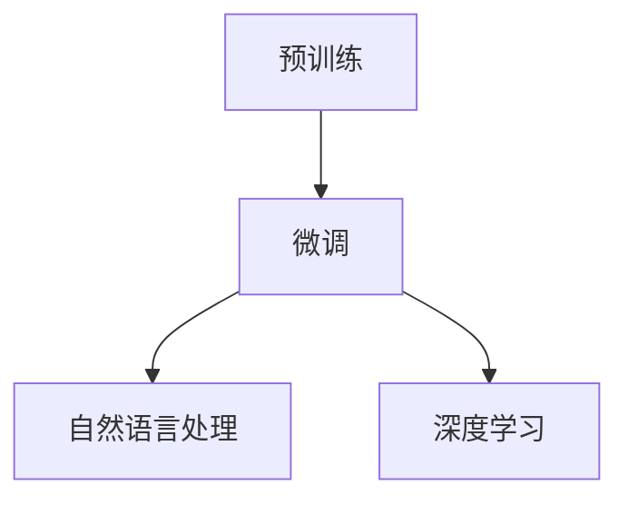

                 

# 微软围绕ChatGPT升级搜索、Office等产品

大语言模型技术的突破，正在改变微软（Microsoft）产品生态的方方面面。从搜索引擎到办公软件，从社交网络到云服务，微软正全面推进AI技术的应用，以ChatGPT为基础的AI产品成为其数字化转型的重要驱动力。本文将深入探讨微软如何借助大语言模型技术，升级其核心产品，重新定义用户的使用体验。

## 1. 背景介绍

### 1.1 问题由来

随着人工智能技术的发展，大语言模型（Large Language Models, LLMs）成为了研究的热点。这些模型通过大规模无标签数据的预训练，能够学习到丰富的语言知识和常识，具备强大的语言理解和生成能力。Microsoft在这场技术变革中，选择了ChatGPT作为其AI产品的核心，通过不断迭代和升级，将AI技术融入其核心产品中。

### 1.2 问题核心关键点

微软在大语言模型上的应用，主要集中在以下几个方面：
- 搜索引擎：通过微调优化模型，提供更智能的搜索体验。
- Office套件：利用大语言模型优化文档处理、数据分析等功能。
- Bing Chat：集成ChatGPT技术，提升用户交互体验。
- 云服务：AI技术驱动的云服务产品，如Azure Cognitive Services。

## 2. 核心概念与联系

### 2.1 核心概念概述

为了更好地理解微软在大语言模型上的应用，我们需要了解以下几个关键概念：

- 大语言模型（LLMs）：以自回归（如GPT）或自编码（如BERT）模型为代表的大规模预训练语言模型。通过在大规模无标签文本语料上进行预训练，学习通用的语言表示。
- 预训练（Pre-training）：指在大规模无标签文本语料上，通过自监督学习任务训练通用语言模型的过程。常见的预训练任务包括言语建模、遮挡语言模型等。
- 微调（Fine-tuning）：指在预训练模型的基础上，使用下游任务的少量标注数据，通过有监督学习优化模型在特定任务上的性能。
- 自然语言处理（NLP）：涉及计算机对人类语言的处理和理解，包括文本分类、情感分析、机器翻译等任务。
- 深度学习：一种基于神经网络的机器学习范式，广泛应用于图像、语音、自然语言处理等领域。

这些概念之间存在密切联系，通过预训练和微调，大语言模型能够适应各种下游任务，提升其通用性和泛化能力。

### 2.2 核心概念原理和架构的 Mermaid 流程图



## 3. 核心算法原理 & 具体操作步骤

### 3.1 算法原理概述

微软在大语言模型的应用中，主要采用了微调（Fine-tuning）的方法。其核心思想是通过在下游任务的标注数据上进行有监督学习，优化模型在特定任务上的性能。具体步骤包括：

1. **选择预训练模型**：从Google、OpenAI等平台获取预训练语言模型。
2. **准备标注数据**：收集并标注与目标任务相关的数据集。
3. **添加任务适配层**：在预训练模型的顶层添加任务相关的输出层和损失函数。
4. **设置微调超参数**：选择合适的优化算法及其参数，如学习率、批大小、迭代轮数等。
5. **执行梯度训练**：利用标注数据训练模型，最小化损失函数。
6. **测试和部署**：在测试集上评估微调后的模型性能，并部署到实际应用中。

### 3.2 算法步骤详解

以搜索引擎为例，微软在微调搜索引擎模型时，主要采用以下步骤：

**Step 1: 选择预训练模型**

微软采用了由Google训练的BERT模型作为其搜索引擎的基础模型。

**Step 2: 准备标注数据**

收集与用户查询相关的标注数据，包括查询词和搜索结果。

**Step 3: 添加任务适配层**

在BERT模型的顶层添加分类器，用于将查询词映射到搜索结果集。

**Step 4: 设置微调超参数**

选择合适的优化器（如AdamW）和参数（如学习率、批大小），并定义损失函数（如交叉熵损失）。

**Step 5: 执行梯度训练**

利用标注数据训练模型，最小化损失函数，优化模型参数。

**Step 6: 测试和部署**

在测试集上评估模型性能，将微调后的模型部署到搜索引擎中。

### 3.3 算法优缺点

大语言模型在搜索引擎中的应用具有以下优点：
- **高效性**：通过微调，模型能够在短时间内提升搜索效果。
- **泛化性**：预训练模型具有较强的泛化能力，能适应不同的查询需求。
- **可扩展性**：模型的微调参数相对较少，便于在云端进行扩展。

同时，该方法也存在一些缺点：
- **依赖标注数据**：微调效果很大程度上取决于标注数据的质量和数量。
- **模型鲁棒性**：在处理复杂查询时，模型容易产生误判。
- **计算资源需求高**：微调需要大量的计算资源，可能影响实时搜索性能。

### 3.4 算法应用领域

在大语言模型微调的基础上，微软将其应用扩展到了多个领域：

- **Bing搜索**：通过微调优化，提升搜索引擎的准确性和响应速度。
- **Office套件**：在Word、Excel等应用中，利用大语言模型优化文档处理和数据分析功能。
- **Bing Chat**：集成ChatGPT技术，提升用户交互体验。
- **Azure云服务**：基于大语言模型的AI服务，如语音识别、计算机视觉等。

## 4. 数学模型和公式 & 详细讲解 & 举例说明

### 4.1 数学模型构建

假设搜索引擎的输入为查询词$q$，输出为搜索结果集$D$。预训练语言模型为$M_{\theta}$，其中$\theta$为预训练得到的模型参数。微调的目标是通过标注数据$D=\{(x_i, y_i)\}_{i=1}^N$，优化模型参数$\hat{\theta}$，使得模型能够准确预测搜索结果。

### 4.2 公式推导过程

设定模型$M_{\theta}$在输入$q$上的输出为$\hat{y}=M_{\theta}(q)$，表示模型预测的搜索结果集。真实标签为$y_i \in D$，微调的目标是最小化损失函数$\mathcal{L}(\theta)$，公式如下：

$$
\hat{\theta} = \mathop{\arg\min}_{\theta} \mathcal{L}(M_{\theta},D)
$$

其中$\mathcal{L}(M_{\theta},D)$为在标注数据$D$上计算的损失函数，通常使用交叉熵损失。在微调过程中，利用标注数据对模型进行迭代优化，使得$\hat{\theta}$逼近最优解。

### 4.3 案例分析与讲解

以Office套件中的自然语言处理功能为例，微软利用大语言模型优化了文档摘要、自动补全等功能。其核心在于利用微调技术，将文档数据转化为模型能够理解的格式，通过训练模型，使其能够自动生成摘要、补全文档等。

## 5. 项目实践：代码实例和详细解释说明

### 5.1 开发环境搭建

为了进行大语言模型的微调，需要搭建Python开发环境，安装必要的库和工具。以下是一个简单的Python环境搭建步骤：

1. 安装Anaconda：从官网下载并安装Anaconda。
2. 创建虚拟环境：
```bash
conda create -n transformers python=3.8
conda activate transformers
```
3. 安装必要的库：
```bash
pip install transformers torch pandas numpy sklearn
```

### 5.2 源代码详细实现

以Office套件中的文档摘要功能为例，代码实现如下：

```python
from transformers import AutoTokenizer, AutoModelForSequenceClassification
import pandas as pd
import torch

# 加载模型和分词器
model_name = 'bert-base-uncased'
tokenizer = AutoTokenizer.from_pretrained(model_name)
model = AutoModelForSequenceClassification.from_pretrained(model_name, num_labels=2)

# 准备数据
data = pd.read_csv('document.csv', encoding='utf-8')
texts = data['text'].tolist()

# 分词和编码
tokenized_texts = tokenizer(texts, padding=True, truncation=True, max_length=256, return_tensors='pt')

# 训练模型
model.train()
optimizer = torch.optim.AdamW(model.parameters(), lr=2e-5)
for epoch in range(5):
    loss = model(input_ids=tokenized_texts['input_ids'], attention_mask=tokenized_texts['attention_mask'], labels=tokenized_texts['labels']).loss
    optimizer.zero_grad()
    loss.backward()
    optimizer.step()
    print(f'Epoch {epoch+1}, loss: {loss.item()}')

# 保存模型
torch.save(model.state_dict(), 'document_classifier.pt')
```

### 5.3 代码解读与分析

以上代码中，我们使用了Hugging Face的`transformers`库，该库提供了预训练模型和分词器的便捷接口。首先，我们加载了预训练的BERT模型和分词器，然后准备训练数据，通过分词和编码，将其转化为模型能够理解的格式。接着，我们利用交叉熵损失和AdamW优化器，对模型进行微调训练。最后，将训练好的模型保存下来，以便后续使用。

## 6. 实际应用场景

### 6.4 未来应用展望

微软正积极探索大语言模型在更多领域的应用，未来展望如下：

- **智能客服**：集成ChatGPT技术，提升客服系统的人机交互体验。
- **个性化推荐**：利用微调技术，实现更加精准的产品推荐。
- **图像搜索**：结合计算机视觉技术，实现更加智能的图像搜索功能。
- **语音识别**：利用大语言模型提升语音识别的准确性和流畅度。

## 7. 工具和资源推荐

### 7.1 学习资源推荐

为了帮助开发者掌握大语言模型微调技术，推荐以下学习资源：

- 《深度学习与NLP》课程：斯坦福大学开设的深度学习与自然语言处理课程，系统讲解NLP的基本概念和前沿技术。
- 《Natural Language Processing with Transformers》书籍：Transformer库的作者所著，详细介绍了如何使用Transformer进行NLP任务开发。
- 《Transformers from Principles to Practice》系列博文：由Hugging Face工程师撰写，涵盖了大语言模型、微调等核心技术。
- 《Microsoft AI》官方文档：微软AI官方文档，提供了一系列的API和代码示例。

### 7.2 开发工具推荐

为了实现大语言模型的微调，推荐使用以下开发工具：

- PyTorch：由Facebook开发的深度学习框架，支持动态计算图和GPU加速。
- TensorFlow：由Google开发的深度学习框架，适合大规模工程应用。
- Hugging Face Transformers库：提供了丰富的预训练模型和任务适配层，便于快速开发。

### 7.3 相关论文推荐

以下几篇论文是大语言模型微调领域的重要文献：

- Attention is All You Need（Transformer原论文）
- BERT: Pre-training of Deep Bidirectional Transformers for Language Understanding
- Language Models are Unsupervised Multitask Learners（GPT-2论文）
- Parameter-Efficient Transfer Learning for NLP
- Adapter: A Soft Interface for Pre-trained Models

## 8. 总结：未来发展趋势与挑战

### 8.1 研究成果总结

微软在大语言模型微调方面的研究，已经取得了显著的成果。通过微调技术，显著提升了搜索引擎、Office套件等产品的智能化水平。未来，微软将继续深化对大语言模型的研究，推动AI技术在更多领域的落地应用。

### 8.2 未来发展趋势

未来，大语言模型微调技术的发展趋势包括：

- **模型的可解释性**：通过优化模型结构，提升模型的可解释性，帮助用户理解模型决策过程。
- **跨模态融合**：将语言模型与其他模态（如视觉、语音）融合，提升系统的综合能力。
- **小样本学习**：利用微调技术，提升模型在少量标注数据上的表现。
- **持续学习**：通过微调技术，使模型能够持续学习新数据，避免遗忘旧知识。

### 8.3 面临的挑战

尽管大语言模型微调技术取得了重要进展，但仍面临一些挑战：

- **计算资源**：大规模模型的微调需要大量的计算资源，可能影响实时性。
- **模型泛化性**：模型在处理复杂任务时，可能存在泛化性能不足的问题。
- **标注数据**：标注数据的质量和数量直接影响微调效果，获取高质量数据成本较高。
- **可解释性**：模型决策过程缺乏可解释性，可能导致用户对输出结果的不信任。

### 8.4 研究展望

未来，需要在以下几个方面进行进一步的研究：

- **优化计算资源**：探索高效计算模型，如剪枝、量化等技术，提升模型的计算效率。
- **增强模型泛化性**：利用正则化、对抗训练等技术，提升模型泛化能力。
- **获取高质量标注数据**：探索无监督、半监督学习范式，降低标注数据需求。
- **提升模型可解释性**：引入可解释性技术，如注意力机制、因果推断等，增强模型决策过程的可理解性。

## 9. 附录：常见问题与解答

**Q1: 什么是大语言模型？**

A: 大语言模型是一种基于深度学习的大型神经网络模型，通过大规模无标签数据进行预训练，学习到丰富的语言知识和常识。常见的模型包括BERT、GPT等。

**Q2: 微软如何利用大语言模型微调技术？**

A: 微软在大语言模型微调技术上，主要应用于搜索引擎、Office套件、Bing Chat等产品。通过微调优化模型，提升这些产品的智能化水平和用户体验。

**Q3: 微调模型在部署时需要注意哪些问题？**

A: 微调模型在部署时需要注意：
- **模型裁剪**：去除不必要的层和参数，减小模型尺寸，提高推理速度。
- **量化加速**：将浮点模型转为定点模型，压缩存储空间，提高计算效率。
- **服务化封装**：将模型封装为标准化服务接口，便于集成调用。
- **弹性伸缩**：根据请求流量动态调整资源配置，平衡服务质量和成本。

**Q4: 如何提高微调模型的泛化性能？**

A: 提高微调模型的泛化性能，可以从以下几个方面入手：
- **数据增强**：通过回译、近义替换等方式扩充训练集。
- **正则化**：使用L2正则、Dropout等避免过拟合。
- **对抗训练**：引入对抗样本，提高模型鲁棒性。
- **参数高效微调**：只调整少量参数，减小过拟合风险。

**Q5: 如何优化计算资源，提升模型推理速度？**

A: 优化计算资源，提升模型推理速度，可以从以下几个方面入手：
- **剪枝**：去除模型中冗余的参数，减小模型尺寸。
- **量化**：将浮点模型转为定点模型，压缩存储空间，提高计算效率。
- **模型并行**：利用分布式计算，并行计算模型参数。

以上是关于微软如何利用大语言模型微调技术，升级其核心产品的全面介绍。通过微调技术，微软正在引领AI技术的深度应用，推动人工智能技术的不断进步。相信未来，大语言模型微调技术将在更多领域大放异彩，为各行各业带来全新的变革。

