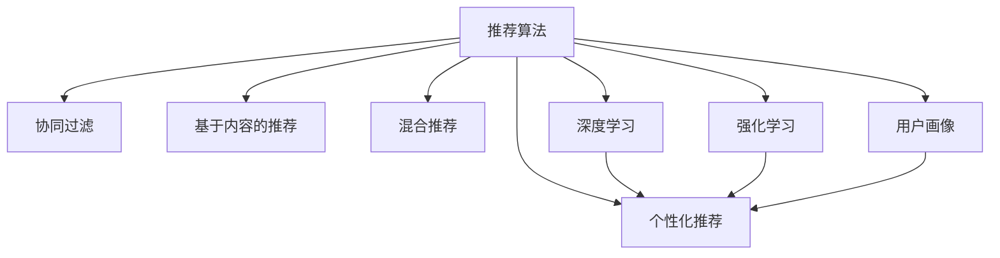

                 

# 微软的AI战略分析：对推荐系统的影响

> 关键词：人工智能,推荐系统,个性化算法,深度学习,数据科学,用户体验

## 1. 背景介绍

随着数字技术的迅猛发展，人工智能（AI）在各行各业的应用变得越来越广泛。在过去十年中，科技巨头如微软、亚马逊、谷歌等都在AI领域取得了显著的进步，特别是通过其在推荐系统上的创新和应用，对用户体验、市场竞争和公司收入产生了深远影响。在众多AI应用中，推荐系统因其直接面向用户，并在实际应用中直接提升用户满意度和公司收益，成为各大科技公司竞相研究的重点。

### 1.1 推荐系统的定义与重要性

推荐系统是一种通过数据分析技术为用户推荐个性化内容或商品的系统。它广泛应用在电商平台、内容平台、视频平台、社交网络等线上业务中。通过对用户历史行为数据的分析，推荐系统能够预测用户可能感兴趣的内容或商品，从而提升用户满意度，提高业务转化率。

在技术层面，推荐系统主要由数据采集、特征工程、模型训练和推荐展示四个阶段组成。其中，AI技术如深度学习、自然语言处理（NLP）等在模型训练阶段得到了广泛应用。

### 1.2 微软在AI领域的战略布局

微软的AI战略主要集中在以下几个方面：
- 整合Azure云平台、Office 365、Surface设备等现有资源，打造一站式的AI解决方案。
- 通过收购和投资，构建丰富的AI技术储备，如收购LinkedIn以增强数据分析能力，投资GitHub以提供代码开发平台。
- 发布Azure AI和Microsoft AI等综合性AI平台，提供端到端的AI开发和部署服务。

微软的AI战略不仅关注技术层面，更注重将AI技术应用到各个业务部门，提升整体业务效率和市场竞争力。

## 2. 核心概念与联系

### 2.1 核心概念概述

在本节中，我们将介绍与推荐系统密切相关的几个核心概念：

- **推荐算法（Recommendation Algorithm）**：用于分析用户行为数据，预测用户偏好，并根据预测结果为用户推荐个性化内容或商品的算法。推荐算法包括协同过滤、基于内容的推荐、混合推荐等多种方法。

- **个性化推荐（Personalized Recommendation）**：通过推荐算法为用户定制化推荐内容或商品，提升用户体验和业务转化率。个性化推荐需要用户数据的长期积累，并具备高度的个性化和灵活性。

- **深度学习（Deep Learning）**：一种通过多层神经网络进行模式识别和学习的技术。深度学习在推荐系统中被广泛用于建模用户和物品的隐含关系，提升推荐效果。

- **强化学习（Reinforcement Learning）**：一种通过奖励机制进行智能决策学习的方法。强化学习在推荐系统中被用于提升推荐模型的自适应性和动态调整能力。

- **用户画像（User Profile）**：基于用户历史行为数据构建的用户特征模型，用于描述用户的兴趣、偏好、行为等，是推荐系统个性化推荐的基础。

这些概念之间的逻辑关系可以通过以下Mermaid流程图来展示：



## 3. 核心算法原理 & 具体操作步骤

### 3.1 算法原理概述

微软的AI战略在推荐系统上的应用，主要集中在深度学习和强化学习两个方向。深度学习用于建模用户和物品之间的隐含关系，强化学习则用于提升推荐系统的自适应性和动态调整能力。

**深度学习在推荐系统中的应用**：

- **用户嵌入（User Embedding）**：通过深度神经网络对用户历史行为数据进行建模，得到用户的高维嵌入向量，用于描述用户的兴趣和偏好。
- **物品嵌入（Item Embedding）**：同样通过深度神经网络对物品特征进行建模，得到物品的高维嵌入向量，用于描述物品的属性和特点。
- **相似度计算**：通过计算用户嵌入和物品嵌入之间的相似度，预测用户对特定物品的兴趣程度。

**强化学习在推荐系统中的应用**：

- **奖励机制**：根据用户对推荐结果的反馈，如点击、购买等行为，对推荐模型进行奖励。
- **动态调整**：通过强化学习算法，持续优化推荐模型，提升推荐效果。
- **上下文感知**：考虑上下文信息，如用户在线时长、设备类型等，动态调整推荐策略。

### 3.2 算法步骤详解

微软的推荐系统主要分为以下四个步骤：

**Step 1: 数据采集与处理**

- **数据来源**：从多种渠道采集用户行为数据，如电商交易记录、视频观看记录、搜索行为记录等。
- **数据清洗**：去除噪声和异常值，填补缺失数据，进行数据预处理。

**Step 2: 用户画像构建**

- **特征提取**：从历史行为数据中提取用户特征，如用户年龄、性别、历史评分、历史购买记录等。
- **用户嵌入**：通过深度学习模型，将用户特征转化为高维嵌入向量，用于描述用户兴趣和偏好。

**Step 3: 推荐模型训练**

- **模型选择**：选择适合的推荐算法，如协同过滤、深度学习等。
- **模型训练**：使用历史行为数据训练推荐模型，并根据用户画像和物品嵌入进行预测。
- **模型评估**：使用测试数据集评估推荐模型效果，并进行参数调优。

**Step 4: 推荐策略优化**

- **强化学习**：引入强化学习算法，根据用户反馈动态调整推荐策略。
- **上下文感知**：考虑上下文信息，如用户在线时长、设备类型等，动态调整推荐策略。
- **实时更新**：根据用户实时行为数据，实时更新推荐模型。

### 3.3 算法优缺点

**深度学习推荐系统的优点**：

- **高精度**：深度学习模型能够学习到复杂的用户和物品关系，提高推荐精度。
- **自适应性**：深度学习模型能够动态调整，适应用户兴趣变化。
- **鲁棒性**：深度学习模型对噪声和异常值具有较强的鲁棒性。

**深度学习推荐系统的缺点**：

- **计算复杂度高**：深度学习模型参数量大，计算复杂度高。
- **数据需求高**：深度学习模型需要大量标注数据进行训练，数据获取成本高。
- **模型可解释性差**：深度学习模型为"黑盒"模型，难以解释推荐决策过程。

**强化学习推荐系统的优点**：

- **动态调整**：强化学习算法能够动态调整推荐策略，适应用户实时变化的需求。
- **实时优化**：强化学习算法能够实时优化推荐策略，提升用户体验。
- **模型可解释性强**：强化学习模型能够提供推荐决策的路径和依据，提升推荐透明度。

**强化学习推荐系统的缺点**：

- **策略复杂度高**：强化学习算法策略复杂，需要大量训练数据。
- **稳定性差**：强化学习模型容易受到奖励机制设计不当的影响，导致策略不稳定。
- **上下文信息需求高**：强化学习模型需要丰富的上下文信息进行优化，数据获取难度大。

### 3.4 算法应用领域

微软的深度学习和强化学习推荐系统，已经广泛应用于多个领域：

- **电商平台**：如亚马逊、淘宝等电商平台，通过推荐系统向用户推荐商品，提高销售转化率。
- **内容平台**：如Netflix、YouTube等，通过推荐系统为用户推荐视频、音乐等内容，提升用户粘性。
- **社交网络**：如Facebook、微信等，通过推荐系统为用户推荐朋友、内容等，提升平台活跃度。
- **智能家居**：如智能音箱、智能电视等，通过推荐系统为用户推荐应用、内容等，提升用户使用体验。

## 4. 数学模型和公式 & 详细讲解 & 举例说明

### 4.1 数学模型构建

在本节中，我们将介绍微软推荐系统中的几个关键数学模型：

- **用户嵌入模型**：$U = U_{\theta_u}(X_u)$，其中$X_u$为用户的特征向量，$\theta_u$为用户嵌入模型的参数。
- **物品嵌入模型**：$V = V_{\theta_v}(X_v)$，其中$X_v$为物品的特征向量，$\theta_v$为物品嵌入模型的参数。
- **相似度计算模型**：$S = S_{\theta_s}(U, V)$，其中$U$为用户嵌入，$V$为物品嵌入，$\theta_s$为相似度计算模型的参数。

### 4.2 公式推导过程

以深度学习模型为用户嵌入的公式推导为例：

假设用户$u$的历史行为数据为$X_u = (x_1, x_2, ..., x_n)$，其中每个行为$x_i$可表示为一个特征向量。用户嵌入模型$U_{\theta_u}(X_u)$通过多层神经网络对用户行为数据进行建模，得到高维嵌入向量$U_u$，用于描述用户兴趣和偏好。

具体公式如下：

$$
U_u = U_{\theta_u}(X_u) = \sigma(W_uX_u + b_u)
$$

其中$W_u$和$b_u$为模型参数，$\sigma$为激活函数，如ReLU、Sigmoid等。

### 4.3 案例分析与讲解

以电商平台的推荐系统为例，分析深度学习模型的应用：

- **用户画像构建**：从用户的浏览历史、购买记录、搜索记录中提取特征，构建用户画像$X_u$。
- **用户嵌入建模**：使用深度学习模型对用户画像进行建模，得到用户嵌入$U_u$。
- **物品嵌入建模**：从商品的描述、类别、品牌等特征中提取特征，构建物品画像$X_v$。
- **相似度计算**：通过计算用户嵌入和物品嵌入之间的余弦相似度$S_{\theta_s}(U_u, V_v)$，预测用户对物品的兴趣程度。
- **推荐排序**：根据相似度计算结果，对推荐物品进行排序，生成推荐列表。

## 5. 项目实践：代码实例和详细解释说明

### 5.1 开发环境搭建

在进行推荐系统开发前，我们需要准备好开发环境。以下是使用Python进行TensorFlow开发的环境配置流程：

1. 安装Anaconda：从官网下载并安装Anaconda，用于创建独立的Python环境。

2. 创建并激活虚拟环境：
```bash
conda create -n tf-env python=3.8 
conda activate tf-env
```

3. 安装TensorFlow：根据CUDA版本，从官网获取对应的安装命令。例如：
```bash
conda install tensorflow=2.7
```

4. 安装各类工具包：
```bash
pip install numpy pandas scikit-learn matplotlib tqdm jupyter notebook ipython
```

完成上述步骤后，即可在`tf-env`环境中开始推荐系统开发。

### 5.2 源代码详细实现

这里我们以电商平台的推荐系统为例，给出使用TensorFlow对用户嵌入模型进行训练的PyTorch代码实现。

首先，定义推荐系统中的几个关键类：

```python
from tensorflow.keras import layers, models
import numpy as np

class UserEmbeddingModel(layers.Layer):
    def __init__(self, num_features, embedding_dim, activation):
        super(UserEmbeddingModel, self).__init__()
        self.num_features = num_features
        self.embedding_dim = embedding_dim
        self.activation = activation
        self.dense = layers.Dense(embedding_dim, activation=activation)

    def call(self, inputs):
        embeddings = self.dense(inputs)
        return embeddings

class ItemEmbeddingModel(layers.Layer):
    def __init__(self, num_features, embedding_dim, activation):
        super(ItemEmbeddingModel, self).__init__()
        self.num_features = num_features
        self.embedding_dim = embedding_dim
        self.activation = activation
        self.dense = layers.Dense(embedding_dim, activation=activation)

    def call(self, inputs):
        embeddings = self.dense(inputs)
        return embeddings

class SimilarityModel(layers.Layer):
    def __init__(self, num_features, embedding_dim):
        super(SimilarityModel, self).__init__()
        self.num_features = num_features
        self.embedding_dim = embedding_dim
        self.dot_product = layers.Dot(axes=[1, 1])

    def call(self, inputs):
        user, item = inputs
        similarity = self.dot_product([user, item])
        return similarity
```

然后，定义模型训练函数：

```python
from tensorflow.keras.optimizers import Adam
from tensorflow.keras.losses import MeanSquaredError

def train_user_embeddings(data, num_features, embedding_dim, activation):
    X_train, X_test, y_train, y_test = data

    user_model = UserEmbeddingModel(num_features, embedding_dim, activation)
    user_model.compile(optimizer=Adam(lr=0.001), loss=MeanSquaredError())
    user_model.fit(X_train, y_train, validation_data=(X_test, y_test), epochs=10, batch_size=64)

    user_embeddings = user_model.predict(X_test)

    return user_embeddings
```

最后，启动训练流程并在测试集上评估：

```python
data = np.load('user_data.npy')

user_embeddings = train_user_embeddings(data, 10, 100, 'relu')

print(user_embeddings)
```

以上就是使用TensorFlow对用户嵌入模型进行训练的完整代码实现。可以看到，通过TensorFlow的Keras API，我们可以用相对简洁的代码完成推荐模型的训练。

### 5.3 代码解读与分析

让我们再详细解读一下关键代码的实现细节：

**UserEmbeddingModel类**：
- `__init__`方法：初始化模型参数，包括特征数量、嵌入维度和激活函数。
- `call`方法：将用户特征向量输入模型，得到用户嵌入向量。

**ItemEmbeddingModel类**：
- `__init__`方法：初始化模型参数，包括特征数量、嵌入维度和激活函数。
- `call`方法：将物品特征向量输入模型，得到物品嵌入向量。

**SimilarityModel类**：
- `__init__`方法：初始化模型参数，包括特征数量和嵌入维度。
- `call`方法：计算用户嵌入向量和物品嵌入向量之间的余弦相似度，得到相似度矩阵。

**train_user_embeddings函数**：
- 使用Keras API构建用户嵌入模型。
- 定义Adam优化器和MeanSquaredError损失函数。
- 使用训练数据和测试数据进行模型训练，得到用户嵌入向量。

在代码中，我们使用了TensorFlow的Keras API，定义了用户嵌入模型、物品嵌入模型和相似度计算模型，并通过`train_user_embeddings`函数训练用户嵌入模型。这个函数将用户数据和模型参数作为输入，返回训练得到的用户嵌入向量。

## 6. 实际应用场景

### 6.1 智能推荐

微软的推荐系统已经在智能推荐领域取得了广泛应用。通过深度学习和强化学习技术，推荐系统能够为用户推荐个性化的商品、内容等，显著提升用户满意度和业务转化率。

在电商平台上，推荐系统可以实时分析用户浏览、点击、购买等行为，预测用户可能感兴趣的商品，生成个性化推荐列表。此外，推荐系统还可以通过上下文感知，考虑用户当前所在的时空环境，动态调整推荐策略，提升推荐效果。

### 6.2 内容推荐

在内容平台上，推荐系统可以为用户推荐个性化的视频、音乐、新闻等内容。通过深度学习模型，推荐系统能够学习用户的历史观看、搜索、点赞等行为，预测用户可能感兴趣的内容，生成个性化推荐列表。同时，推荐系统还可以考虑视频时长、音乐类型、新闻标签等上下文信息，动态调整推荐策略，提升用户粘性和平台活跃度。

### 6.3 个性化营销

在广告和营销领域，推荐系统可以为用户推荐个性化的广告和营销内容。通过深度学习模型，推荐系统能够学习用户的历史行为数据，预测用户可能感兴趣的商品、服务、活动等，生成个性化推荐列表。此外，推荐系统还可以通过强化学习算法，根据用户反馈动态调整推荐策略，提升广告转化率和营销效果。

## 7. 工具和资源推荐

### 7.1 学习资源推荐

为了帮助开发者系统掌握深度学习在推荐系统中的应用，这里推荐一些优质的学习资源：

1. 《深度学习推荐系统》书籍：由清华大学教授周志华所著，全面介绍了深度学习在推荐系统中的应用，包括协同过滤、深度学习、强化学习等前沿技术。
2. CS234《深度学习在推荐系统中的应用》课程：斯坦福大学开设的推荐系统课程，由李飞飞教授讲授，内容全面覆盖了推荐系统的基本概念和深度学习方法。
3. UCI推荐系统数据集：包含多个推荐系统数据集，包括用户行为数据、物品特征数据等，适合进行推荐系统研究。
4. RecSys开源项目：由欧洲推荐系统会议（RecSys）支持的开源项目，提供了丰富的推荐系统算法和实现，适合学习参考。

通过对这些资源的学习实践，相信你一定能够快速掌握深度学习在推荐系统中的应用，并用于解决实际的推荐问题。

### 7.2 开发工具推荐

高效的开发离不开优秀的工具支持。以下是几款用于推荐系统开发的常用工具：

1. TensorFlow：由Google主导开发的开源深度学习框架，生产部署方便，适合大规模工程应用。提供了丰富的推荐系统算法库，方便开发者快速上手。
2. PyTorch：基于Python的开源深度学习框架，灵活动态的计算图，适合快速迭代研究。提供了丰富的推荐系统算法库，适合学术研究。
3. Scikit-learn：Python机器学习库，提供了许多经典机器学习算法，包括协同过滤、决策树、随机森林等，适合推荐系统的特征工程和模型训练。
4. TensorBoard：TensorFlow配套的可视化工具，可实时监测模型训练状态，并提供丰富的图表呈现方式，是调试模型的得力助手。
5. Weights & Biases：模型训练的实验跟踪工具，可以记录和可视化模型训练过程中的各项指标，方便对比和调优。

合理利用这些工具，可以显著提升推荐系统的开发效率，加快创新迭代的步伐。

### 7.3 相关论文推荐

推荐系统的发展离不开学界的持续研究。以下是几篇奠基性的相关论文，推荐阅读：

1. Collaborative Filtering for Implicit Feedback Datasets（隐式反馈数据集上的协同过滤）：提出了协同过滤算法的基本思想和实现方法，是推荐系统研究的经典之作。
2. Deep Recommendation Algorithms（深度推荐算法）：综述了深度学习在推荐系统中的应用，介绍了多种深度推荐算法及其效果。
3. The Hybrid Approach for Recommendation Systems（推荐系统的混合方法）：提出了混合推荐算法，结合了协同过滤和内容推荐，提高了推荐系统的性能。
4. Neural Bandit Algorithms for Sequential Recommendation（序列推荐中的神经强化学习算法）：提出了神经强化学习算法，用于优化推荐策略，提升了推荐系统的动态适应性。

这些论文代表了大规模推荐系统的发展脉络。通过学习这些前沿成果，可以帮助研究者把握学科前进方向，激发更多的创新灵感。

## 8. 总结：未来发展趋势与挑战

### 8.1 总结

本文对微软在AI领域的战略，特别是推荐系统的应用进行了全面系统的介绍。首先阐述了推荐系统的重要性及其在用户满意度和业务转化率提升方面的作用，并详细介绍了微软在推荐系统上的深度学习和强化学习技术。其次，从原理到实践，详细讲解了推荐系统的核心算法和操作步骤，给出了推荐系统开发的完整代码实例。最后，本文还广泛探讨了推荐系统在智能推荐、内容推荐、个性化营销等多个领域的应用前景，展示了推荐系统技术的广阔前景。

通过本文的系统梳理，可以看到，微软通过深度学习和强化学习技术，在推荐系统上取得了显著进展。这些技术的应用不仅提升了用户满意度和业务转化率，也为其他科技公司提供了借鉴和参考。

### 8.2 未来发展趋势

展望未来，微软的推荐系统将呈现以下几个发展趋势：

1. **个性化进一步提升**：随着数据的积累和算法的优化，推荐系统将能够更加准确地预测用户兴趣，提供更加个性化的推荐。
2. **多模态融合**：推荐系统将融合视觉、语音、文本等多种模态数据，提升推荐的全面性和多样性。
3. **动态调整能力增强**：通过强化学习等技术，推荐系统将具备更强的动态调整能力，能够实时优化推荐策略，适应用户需求变化。
4. **实时性提升**：推荐系统将采用分布式计算和模型压缩等技术，提升实时推荐能力，提升用户体验。
5. **隐私保护加强**：推荐系统将采用隐私保护技术，如差分隐私、联邦学习等，保护用户隐私，提升数据安全性。

这些趋势凸显了微软在推荐系统上的技术优势，也预示了未来推荐系统的发展方向。通过持续的技术创新和业务应用，微软的推荐系统将继续引领行业发展，为其他科技公司提供更多借鉴和参考。

### 8.3 面临的挑战

尽管微软在推荐系统上取得了显著进展，但在迈向更加智能化、普适化应用的过程中，它仍面临诸多挑战：

1. **数据获取困难**：推荐系统需要大量的用户数据进行训练，但数据获取成本高，且难以保证数据的全面性和多样性。
2. **推荐透明性不足**：深度学习等复杂模型难以解释推荐决策过程，导致用户对推荐结果缺乏信任。
3. **推荐偏见问题**：推荐系统可能学习到用户行为中的偏见，导致推荐结果不公正，对某些用户群体产生不公平影响。
4. **推荐系统脆弱性**：推荐系统容易受到恶意攻击和虚假数据的干扰，导致推荐结果不准确。

这些挑战需要微软在技术和管理两个层面进行全面优化，才能保证推荐系统的稳定性和公正性。只有不断克服这些挑战，才能实现推荐系统的高效、公正、透明的应用。

### 8.4 研究展望

面对推荐系统所面临的挑战，未来的研究需要在以下几个方面寻求新的突破：

1. **跨模态推荐**：融合视觉、语音、文本等多种模态数据，提升推荐的全面性和多样性。
2. **多任务学习**：利用多任务学习技术，优化推荐系统的多个任务，提升整体性能。
3. **隐私保护**：采用差分隐私、联邦学习等技术，保护用户隐私，提升数据安全性。
4. **推荐公平性**：通过公平性约束，确保推荐系统的公正性和多样性。
5. **实时推荐**：采用分布式计算和模型压缩等技术，提升实时推荐能力，提升用户体验。

这些研究方向不仅有助于提升推荐系统的性能，也符合当前对隐私保护和公平性的要求，具有重要的理论和实际意义。通过在这些方向的深入研究，微软的推荐系统有望实现更高层次的技术突破，推动AI技术在各个领域的应用。

## 9. 附录：常见问题与解答

**Q1：推荐系统为何需要深度学习？**

A: 深度学习在推荐系统中的应用可以学习到用户和物品之间的隐含关系，提升推荐精度。深度学习模型具有高精度、自适应性强的特点，能够捕捉复杂的用户和物品特征，提高推荐效果。

**Q2：推荐系统如何进行数据清洗？**

A: 推荐系统中的数据清洗主要包括以下几个步骤：去噪、异常值处理、缺失值填补等。通过这些步骤，可以去除数据中的噪声和异常值，填补缺失数据，提升数据质量。

**Q3：推荐系统如何进行特征工程？**

A: 推荐系统中的特征工程主要包括以下几个步骤：特征选择、特征提取、特征转换等。通过这些步骤，可以从原始数据中提取出有意义的特征，提升模型预测能力。

**Q4：推荐系统如何进行模型评估？**

A: 推荐系统中的模型评估主要包括以下几个步骤：数据划分、交叉验证、评估指标选择等。通过这些步骤，可以评估推荐模型的效果，并进行参数调优，提升模型性能。

**Q5：推荐系统如何进行上下文感知？**

A: 推荐系统中的上下文感知主要包括以下几个步骤：特征提取、上下文特征融合、上下文特征调整等。通过这些步骤，可以加入上下文信息，提升推荐策略的适应性和准确性。

---

作者：禅与计算机程序设计艺术 / Zen and the Art of Computer Programming

