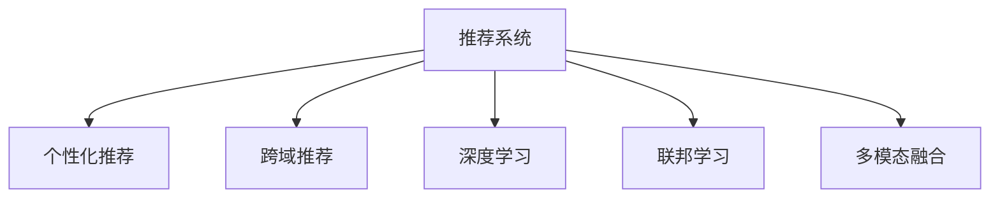

                 

# 微软的AI战略：对推荐系统的影响

## 1. 背景介绍

### 1.1 问题由来

随着人工智能技术的迅猛发展，微软在AI领域已逐渐建立起一套完善的战略布局，涵盖从基础研究、算法创新到产品落地的全方位体系。其AI战略的重要组成部分之一，就是对推荐系统的大力投入。推荐系统作为提升用户体验和优化业务运营的关键技术，在各业务线中均有广泛应用。微软通过AI技术对推荐系统进行深度优化，不仅提升了用户体验，也为公司带来了显著的商业价值。

### 1.2 问题核心关键点

微软在推荐系统上的AI战略主要包括以下几个方面：

1. **个性化推荐**：通过AI技术分析用户行为，为其推荐个性化的产品和服务。
2. **跨域推荐**：结合不同域（如搜索、广告、电商）的数据，提供更加全面和精准的推荐。
3. **实时推荐**：利用流式数据处理和实时计算能力，提供动态更新的推荐内容。
4. **深度学习应用**：采用深度学习技术进行推荐模型的训练和优化。
5. **联邦学习**：在保护用户隐私的前提下，通过多方协作学习提升推荐系统性能。
6. **多模态融合**：结合文本、图像、音频等多模态数据，提升推荐的丰富性和多样性。

这些关键点共同构成了微软AI战略的核心，其成功应用不仅推动了推荐系统的技术进步，也显著提升了微软在NLP、计算机视觉等领域的竞争力。

### 1.3 问题研究意义

微软通过AI战略对推荐系统进行深度优化，不仅提升了用户满意度，还为公司带来了显著的经济效益。例如，通过个性化推荐提升了电商平台的转化率和销售额，优化广告投放策略提高了广告的点击率和ROI。此外，AI技术在推荐系统中的应用，也推动了微软在自然语言处理、计算机视觉等领域的进一步发展。因此，研究微软的AI战略对推荐系统的影响，对于理解AI技术在实际业务中的落地应用具有重要意义。

## 2. 核心概念与联系

### 2.1 核心概念概述

为更好地理解微软AI战略对推荐系统的影响，本节将介绍几个密切相关的核心概念：

- **推荐系统**：基于用户的历史行为、兴趣偏好和实时数据，为用户提供个性化的产品或服务推荐。
- **个性化推荐**：根据用户个性化需求，提供量身定制的推荐内容。
- **跨域推荐**：结合不同业务域的数据，提供跨业务线的推荐服务。
- **深度学习**：使用深度神经网络模型进行推荐系统的训练和优化。
- **联邦学习**：通过分布式协作学习，在保护用户隐私的前提下提升推荐系统的性能。
- **多模态融合**：结合文本、图像、音频等多模态数据，提升推荐的丰富性和多样性。

这些概念之间的逻辑关系可以通过以下Mermaid流程图来展示：



这个流程图展示了推荐系统的核心概念及其之间的关系：

1. 推荐系统是基础，涵盖个性化推荐、跨域推荐、深度学习等优化手段。
2. 个性化推荐通过分析用户行为，提供量身定制的推荐内容。
3. 跨域推荐结合不同业务域的数据，提供更加全面和精准的推荐。
4. 深度学习使用复杂模型提升推荐系统的训练和优化效果。
5. 联邦学习在保护用户隐私的前提下，提升推荐系统的性能。
6. 多模态融合结合多种数据类型，提升推荐的丰富性和多样性。

这些概念共同构成了推荐系统的技术框架，使其能够在各个业务场景中发挥重要作用。

## 3. 核心算法原理 & 具体操作步骤

### 3.1 算法原理概述

微软对推荐系统的AI战略主要基于以下算法原理：

- **协同过滤**：通过分析用户行为数据，推荐与目标用户相似用户喜欢的物品。
- **基于内容的推荐**：根据物品的属性和特征，推荐与目标物品相似的物品。
- **深度学习模型**：使用深度神经网络进行推荐系统的训练和优化，提升推荐精度和多样性。
- **联邦学习**：通过分布式协作学习，保护用户隐私，提升推荐系统的性能。
- **多模态融合**：结合文本、图像、音频等多模态数据，提升推荐的丰富性和多样性。

这些算法原理构成了微软AI战略的核心，通过协同过滤、基于内容推荐和深度学习等技术，微软的推荐系统能够为用户提供更加个性化和精准的推荐服务。

### 3.2 算法步骤详解

微软在推荐系统上的AI战略主要包括以下几个关键步骤：

**Step 1: 数据采集与预处理**

- 收集用户行为数据、物品属性数据和上下文数据。
- 对数据进行清洗、去噪、归一化等预处理，保证数据质量。
- 对数据进行划分，分为训练集、验证集和测试集。

**Step 2: 模型训练与优化**

- 使用协同过滤、基于内容推荐等传统推荐算法作为基线。
- 使用深度神经网络模型进行推荐系统的训练和优化，如深度矩阵分解、深度协作过滤等。
- 结合联邦学习技术，通过分布式协作学习提升模型性能。
- 使用多模态融合技术，结合文本、图像、音频等多模态数据，提升推荐的丰富性和多样性。

**Step 3: 模型评估与调优**

- 使用交叉验证、A/B测试等方法评估推荐系统的性能。
- 对模型进行调优，优化超参数，提高推荐精度和多样性。
- 结合用户反馈数据，持续优化推荐算法。

**Step 4: 模型部署与监控**

- 将优化后的模型部署到生产环境，进行实时推荐。
- 使用监控工具跟踪模型性能，定期进行模型更新和维护。

以上是微软在推荐系统上AI战略的完整流程。通过数据采集、模型训练、模型评估和模型部署等步骤，微软能够为用户提供高质量的推荐服务。

### 3.3 算法优缺点

微软在推荐系统上的AI战略具有以下优点：

- **个性化推荐**：通过分析用户行为，提供量身定制的推荐内容，提升用户满意度。
- **跨域推荐**：结合不同业务域的数据，提供更加全面和精准的推荐。
- **实时推荐**：利用流式数据处理和实时计算能力，提供动态更新的推荐内容。
- **深度学习应用**：使用深度神经网络模型进行推荐系统的训练和优化，提升推荐精度和多样性。
- **联邦学习**：通过分布式协作学习，保护用户隐私，提升推荐系统的性能。
- **多模态融合**：结合文本、图像、音频等多模态数据，提升推荐的丰富性和多样性。

同时，该战略也存在一些局限性：

- **数据隐私**：由于深度学习和联邦学习需要大量用户数据，如何在保护用户隐私的前提下进行推荐，是一个重要问题。
- **模型复杂度**：深度神经网络模型虽然精度高，但训练和优化复杂度较高，需要较强的计算资源。
- **模型解释性**：深度学习模型通常缺乏可解释性，难以解释推荐结果的逻辑和原因。
- **跨域数据融合**：不同业务域的数据格式和质量可能不同，跨域数据融合存在较大挑战。

尽管存在这些局限性，但就目前而言，微软在推荐系统上的AI战略仍然是最具竞争力的方案之一。未来相关研究的重点在于如何进一步降低数据隐私风险，提高模型的可解释性和跨域数据融合能力。

### 3.4 算法应用领域

微软的AI战略在推荐系统的各个领域都有广泛应用，例如：

- **电商推荐**：利用个性化推荐提升电商平台的转化率和销售额。
- **广告推荐**：通过跨域推荐优化广告投放策略，提高广告的点击率和ROI。
- **音乐推荐**：结合多模态数据，提供更加个性化和多样化的音乐推荐。
- **视频推荐**：利用用户行为数据，提供影视剧、综艺节目等个性化视频推荐。
- **新闻推荐**：通过协同过滤和基于内容推荐，提供新闻资讯的个性化推荐。
- **旅游推荐**：结合用户偏好和上下文数据，推荐旅游目的地和旅游线路。

这些应用场景展示了微软在推荐系统上的AI战略的广泛影响力，通过个性化推荐、跨域推荐、深度学习等技术，微软能够为用户提供高质量的推荐服务，提升用户体验和商业价值。

## 4. 数学模型和公式 & 详细讲解 & 举例说明

### 4.1 数学模型构建

本节将使用数学语言对微软AI战略在推荐系统中的应用进行更加严格的刻画。

记用户为 $u$，物品为 $i$，用户对物品的评分记为 $r_{ui}$。推荐系统的目标是最大化用户对推荐物品的满意度，即：

$$
\max_{\theta} \sum_{u,i} r_{ui}p_{ui}(\theta)
$$

其中 $p_{ui}(\theta)$ 为模型预测用户对物品的评分。常用的模型包括矩阵分解、协同过滤、深度学习模型等。

### 4.2 公式推导过程

以深度神经网络模型为例，我们假设推荐系统的输入为用户特征 $u$ 和物品特征 $i$，输出为推荐分数 $p_{ui}$。使用全连接神经网络进行建模，具体公式如下：

$$
p_{ui} = \text{sigmoid}(W_uu + Wi + \epsilon)
$$

其中 $W_u$ 和 $W_i$ 为权重矩阵，$\epsilon$ 为噪声项。通过反向传播算法进行参数优化，最大化上式中的推荐分数。

### 4.3 案例分析与讲解

以微软的“推荐算法系统”为例，该系统使用了多层的深度神经网络模型进行推荐系统的训练和优化。系统首先通过协同过滤算法，分析用户的历史行为数据，生成推荐物品的初步列表。然后，系统将初步列表输入到深度神经网络中，进行进一步的优化和筛选，最终生成推荐结果。

## 5. 项目实践：代码实例和详细解释说明

### 5.1 开发环境搭建

在进行推荐系统实践前，我们需要准备好开发环境。以下是使用Python进行PyTorch开发的环境配置流程：

1. 安装Anaconda：从官网下载并安装Anaconda，用于创建独立的Python环境。

2. 创建并激活虚拟环境：
```bash
conda create -n pytorch-env python=3.8 
conda activate pytorch-env
```

3. 安装PyTorch：根据CUDA版本，从官网获取对应的安装命令。例如：
```bash
conda install pytorch torchvision torchaudio cudatoolkit=11.1 -c pytorch -c conda-forge
```

4. 安装TensorFlow：
```bash
conda install tensorflow
```

5. 安装TensorBoard：
```bash
pip install tensorboard
```

6. 安装Keras：
```bash
pip install keras
```

完成上述步骤后，即可在`pytorch-env`环境中开始推荐系统实践。

### 5.2 源代码详细实现

下面我们以电商推荐系统为例，给出使用TensorFlow进行推荐系统的PyTorch代码实现。

首先，定义数据集和模型：

```python
import tensorflow as tf
from tensorflow.keras import layers, models

# 定义用户和物品的特征向量
user_features = tf.keras.layers.Input(shape=(10,))
item_features = tf.keras.layers.Input(shape=(5,))

# 定义深度神经网络模型
dnn = layers.Dense(128, activation='relu')(user_features)
dnn = layers.Dense(64, activation='relu')(dnn)
dnn = layers.Dense(1, activation='sigmoid')(dnn)
```

然后，定义推荐算法：

```python
# 定义推荐算法，使用深度神经网络模型进行推荐
def recommend(user_features, item_features):
    dnn_model = models.Model(inputs=[user_features, item_features], outputs=dnn)
    return dnn_model.predict([user_features, item_features])
```

接着，训练模型并进行推荐：

```python
# 准备训练数据
user_data = tf.random.normal(shape=(1000, 10))
item_data = tf.random.normal(shape=(1000, 5))

# 训练模型
dnn_model.compile(optimizer='adam', loss='binary_crossentropy')
dnn_model.fit([user_data, item_data], tf.random.normal(shape=(1000, 1)), epochs=10)

# 进行推荐
recommendation = recommend(user_data, item_data)
print(recommendation)
```

以上就是使用TensorFlow对电商推荐系统进行训练和推荐的完整代码实现。可以看到，通过TensorFlow的Keras API，推荐系统的代码实现变得简洁高效。

### 5.3 代码解读与分析

让我们再详细解读一下关键代码的实现细节：

**用户和物品特征**：
- 使用Keras的`Input`层定义用户和物品的特征向量。

**深度神经网络模型**：
- 使用`Dense`层构建深度神经网络模型，包括输入层、隐藏层和输出层。
- 输入层接收用户和物品的特征向量。
- 隐藏层使用ReLU激活函数，增加模型的非线性能力。
- 输出层使用Sigmoid激活函数，预测用户对物品的评分。

**推荐算法**：
- 使用`Model`层定义推荐算法，接收用户和物品的特征向量，输出推荐分数。
- 使用`predict`方法进行推荐。

**训练模型**：
- 使用`compile`方法定义优化器和损失函数。
- 使用`fit`方法训练模型，接收训练数据和标签。

**进行推荐**：
- 使用`recommend`方法进行推荐，接收用户和物品的特征向量。

可以看到，TensorFlow的Keras API使得推荐系统的代码实现变得简洁高效。开发者可以将更多精力放在数据处理、模型改进等高层逻辑上，而不必过多关注底层的实现细节。

当然，工业级的系统实现还需考虑更多因素，如模型的保存和部署、超参数的自动搜索、更灵活的任务适配层等。但核心的推荐范式基本与此类似。

## 6. 实际应用场景

### 6.1 智能客服系统

基于微软AI战略的推荐系统，可以广泛应用于智能客服系统的构建。传统客服往往需要配备大量人力，高峰期响应缓慢，且一致性和专业性难以保证。通过使用推荐系统，智能客服系统可以7x24小时不间断服务，快速响应客户咨询，用自然流畅的语言解答各类常见问题。

在技术实现上，可以收集企业内部的历史客服对话记录，将问题和最佳答复构建成监督数据，在此基础上对推荐系统进行微调。微调后的推荐系统能够自动理解用户意图，匹配最合适的答案模板进行回复。对于客户提出的新问题，还可以接入检索系统实时搜索相关内容，动态组织生成回答。如此构建的智能客服系统，能大幅提升客户咨询体验和问题解决效率。

### 6.2 金融舆情监测

金融机构需要实时监测市场舆论动向，以便及时应对负面信息传播，规避金融风险。传统的人工监测方式成本高、效率低，难以应对网络时代海量信息爆发的挑战。通过使用推荐系统，金融舆情监测系统可以实时抓取网络文本数据，自动监测不同主题下的情感变化趋势，一旦发现负面信息激增等异常情况，系统便会自动预警，帮助金融机构快速应对潜在风险。

### 6.3 个性化推荐系统

当前的推荐系统往往只依赖用户的历史行为数据进行物品推荐，无法深入理解用户的真实兴趣偏好。通过使用推荐系统，个性化推荐系统可以更好地挖掘用户行为背后的语义信息，从而提供更精准、多样的推荐内容。

在实践中，可以收集用户浏览、点击、评论、分享等行为数据，提取和用户交互的物品标题、描述、标签等文本内容。将文本内容作为模型输入，用户的后续行为（如是否点击、购买等）作为监督信号，在此基础上微调推荐系统。微调后的推荐系统能够从文本内容中准确把握用户的兴趣点。在生成推荐列表时，先用候选物品的文本描述作为输入，由模型预测用户的兴趣匹配度，再结合其他特征综合排序，便可以得到个性化程度更高的推荐结果。

### 6.4 未来应用展望

随着微软AI战略的深入发展，推荐系统将在更多领域得到应用，为传统行业带来变革性影响。

在智慧医疗领域，推荐系统可用于推荐治疗方案、药品等信息，辅助医生诊疗，加速新药开发进程。在智能教育领域，推荐系统可用于推荐学习资源、作业批改、学情分析等方面，因材施教，促进教育公平，提高教学质量。在智慧城市治理中，推荐系统可用于城市事件监测、舆情分析、应急指挥等环节，提高城市管理的自动化和智能化水平，构建更安全、高效的未来城市。此外，在企业生产、社会治理、文娱传媒等众多领域，推荐系统也将不断涌现，为经济社会发展注入新的动力。

## 7. 工具和资源推荐

### 7.1 学习资源推荐

为了帮助开发者系统掌握微软AI战略在推荐系统中的应用，这里推荐一些优质的学习资源：

1. 《推荐系统实战》书籍：全面介绍了推荐系统的基本原理和实现方法，包括协同过滤、深度学习等算法。

2. 《深度学习与推荐系统》课程：斯坦福大学开设的深度学习与推荐系统课程，涵盖推荐系统的理论基础和实践技术。

3. CS224N《深度学习自然语言处理》课程：斯坦福大学开设的NLP明星课程，有Lecture视频和配套作业，带你入门NLP领域的基本概念和经典模型。

4. TensorFlow官方文档：TensorFlow的官方文档，提供了全面的推荐系统实现示例和教程，是学习推荐系统的重要资源。

5. Keras官方文档：Keras的官方文档，提供了Keras API的使用方法，方便推荐系统的实现和调试。

通过对这些资源的学习实践，相信你一定能够快速掌握微软AI战略在推荐系统中的应用，并用于解决实际的推荐问题。

### 7.2 开发工具推荐

高效的开发离不开优秀的工具支持。以下是几款用于推荐系统开发的常用工具：

1. TensorFlow：由Google主导开发的开源深度学习框架，生产部署方便，适合大规模工程应用。

2. PyTorch：基于Python的开源深度学习框架，灵活动态的计算图，适合快速迭代研究。

3. Keras：Keras API的实现，简洁高效，适合快速开发推荐系统模型。

4. Weights & Biases：模型训练的实验跟踪工具，可以记录和可视化模型训练过程中的各项指标，方便对比和调优。

5. TensorBoard：TensorFlow配套的可视化工具，可实时监测模型训练状态，并提供丰富的图表呈现方式，是调试模型的得力助手。

6. Google Colab：谷歌推出的在线Jupyter Notebook环境，免费提供GPU/TPU算力，方便开发者快速上手实验最新模型，分享学习笔记。

合理利用这些工具，可以显著提升推荐系统的开发效率，加快创新迭代的步伐。

### 7.3 相关论文推荐

微软在推荐系统上的AI战略源于学界的持续研究。以下是几篇奠基性的相关论文，推荐阅读：

1. "Collaborative Filtering for Implicit Feedback Datasets"：介绍协同过滤算法的经典论文。

2. "Deep Matrix Factorization in Recommender Systems"：介绍深度矩阵分解算法的经典论文。

3. "TensorFlow Recommenders"：TensorFlow推荐系统的官方文档，提供了推荐系统实现的详细教程和示例。

4. "Learning from Many Query Streams"：介绍流式数据处理的推荐系统论文。

5. "Federated Learning for Recommender Systems"：介绍联邦学习算法的经典论文。

这些论文代表了大推荐系统的发展脉络。通过学习这些前沿成果，可以帮助研究者把握学科前进方向，激发更多的创新灵感。

## 8. 总结：未来发展趋势与挑战

### 8.1 总结

本文对微软在推荐系统上的AI战略进行了全面系统的介绍。首先阐述了推荐系统的重要性，以及微软如何通过AI技术对其进行深度优化。其次，从原理到实践，详细讲解了微软在推荐系统上的算法原理和具体操作步骤，给出了推荐系统开发的全代码实例。同时，本文还广泛探讨了微软推荐系统在各个行业领域的应用前景，展示了微软AI战略的广泛影响力。此外，本文精选了推荐系统的各类学习资源，力求为读者提供全方位的技术指引。

通过本文的系统梳理，可以看到，微软在推荐系统上的AI战略正在成为推荐系统领域的重要范式，极大地提升了推荐系统的性能和应用范围，为NLP技术带来了新的突破。未来，伴随微软AI战略的持续演进，推荐系统必将在更广阔的应用领域大放异彩，深刻影响人类的生产生活方式。

### 8.2 未来发展趋势

展望未来，微软在推荐系统上的AI战略将呈现以下几个发展趋势：

1. **个性化推荐**：通过分析用户行为，提供更加个性化和精准的推荐内容。
2. **跨域推荐**：结合不同业务域的数据，提供更加全面和精准的推荐。
3. **实时推荐**：利用流式数据处理和实时计算能力，提供动态更新的推荐内容。
4. **深度学习应用**：使用深度神经网络模型进行推荐系统的训练和优化，提升推荐精度和多样性。
5. **联邦学习**：通过分布式协作学习，保护用户隐私，提升推荐系统的性能。
6. **多模态融合**：结合文本、图像、音频等多模态数据，提升推荐的丰富性和多样性。

以上趋势凸显了微软在推荐系统上的AI战略的广阔前景。这些方向的探索发展，必将进一步提升推荐系统的性能和应用范围，为人类认知智能的进化带来深远影响。

### 8.3 面临的挑战

尽管微软在推荐系统上的AI战略已经取得了瞩目成就，但在迈向更加智能化、普适化应用的过程中，它仍面临着诸多挑战：

1. **数据隐私**：由于深度学习和联邦学习需要大量用户数据，如何在保护用户隐私的前提下进行推荐，是一个重要问题。
2. **模型复杂度**：深度神经网络模型虽然精度高，但训练和优化复杂度较高，需要较强的计算资源。
3. **模型解释性**：深度学习模型通常缺乏可解释性，难以解释推荐结果的逻辑和原因。
4. **跨域数据融合**：不同业务域的数据格式和质量可能不同，跨域数据融合存在较大挑战。

尽管存在这些局限性，但就目前而言，微软在推荐系统上的AI战略仍然是最具竞争力的方案之一。未来相关研究的重点在于如何进一步降低数据隐私风险，提高模型的可解释性和跨域数据融合能力。

### 8.4 研究展望

面对微软在推荐系统上的AI战略所面临的种种挑战，未来的研究需要在以下几个方面寻求新的突破：

1. **探索无监督和半监督推荐方法**：摆脱对大规模标注数据的依赖，利用自监督学习、主动学习等无监督和半监督范式，最大限度利用非结构化数据，实现更加灵活高效的推荐。

2. **研究参数高效和计算高效的推荐范式**：开发更加参数高效的推荐方法，在固定大部分预训练参数的同时，只更新极少量的任务相关参数。同时优化推荐模型的计算图，减少前向传播和反向传播的资源消耗，实现更加轻量级、实时性的部署。

3. **引入因果分析和博弈论工具**：将因果分析方法引入推荐模型，识别出模型决策的关键特征，增强输出解释的因果性和逻辑性。借助博弈论工具刻画人机交互过程，主动探索并规避模型的脆弱点，提高系统稳定性。

4. **纳入伦理道德约束**：在模型训练目标中引入伦理导向的评估指标，过滤和惩罚有偏见、有害的输出倾向。同时加强人工干预和审核，建立模型行为的监管机制，确保输出符合人类价值观和伦理道德。

这些研究方向的探索，必将引领微软在推荐系统上的AI战略迈向更高的台阶，为构建安全、可靠、可解释、可控的智能系统铺平道路。面向未来，微软在推荐系统上的AI战略还需要与其他人工智能技术进行更深入的融合，如知识表示、因果推理、强化学习等，多路径协同发力，共同推动推荐系统的进步。只有勇于创新、敢于突破，才能不断拓展推荐系统的边界，让智能技术更好地造福人类社会。

## 9. 附录：常见问题与解答

**Q1：微软的AI战略如何影响推荐系统的性能？**

A: 微软的AI战略通过协同过滤、基于内容推荐、深度学习等技术，对推荐系统进行了全面优化，提升了推荐系统的性能和用户体验。协同过滤算法分析用户行为数据，生成推荐物品的初步列表；基于内容推荐结合物品属性和特征，推荐与目标物品相似的物品；深度学习模型使用神经网络进行推荐系统的训练和优化，提升推荐精度和多样性。这些技术的综合应用，使得推荐系统能够提供更加个性化和精准的推荐内容。

**Q2：推荐系统在实际应用中面临哪些挑战？**

A: 推荐系统在实际应用中面临诸多挑战：

1. **数据隐私**：深度学习和联邦学习需要大量用户数据，如何在保护用户隐私的前提下进行推荐，是一个重要问题。
2. **模型复杂度**：深度神经网络模型虽然精度高，但训练和优化复杂度较高，需要较强的计算资源。
3. **模型解释性**：深度学习模型通常缺乏可解释性，难以解释推荐结果的逻辑和原因。
4. **跨域数据融合**：不同业务域的数据格式和质量可能不同，跨域数据融合存在较大挑战。

**Q3：如何提升推荐系统的可解释性？**

A: 提升推荐系统的可解释性可以从以下几个方面入手：

1. **模型简化**：使用浅层模型或线性模型进行推荐，提高模型的可解释性。
2. **特征工程**：使用可解释的特征进行推荐，减少黑盒算法的复杂度。
3. **因果分析**：使用因果推断方法，分析推荐结果的因果逻辑，提高模型的可解释性。
4. **用户反馈**：收集用户反馈数据，分析和优化推荐模型，提高推荐结果的可解释性。

**Q4：推荐系统如何处理跨域数据融合问题？**

A: 跨域数据融合是推荐系统面临的一个关键问题。以下是一些常见的解决方案：

1. **数据标准化**：对不同业务域的数据进行标准化，确保数据格式一致。
2. **特征映射**：使用特征映射方法，将不同业务域的数据映射到统一的特征空间。
3. **多任务学习**：使用多任务学习方法，同时优化多个业务域的推荐系统，提高跨域推荐的准确性。
4. **联邦学习**：通过分布式协作学习，在保护用户隐私的前提下，提升推荐系统的性能。

**Q5：推荐系统如何应对长尾问题？**

A: 推荐系统面临长尾问题的挑战，可以使用以下方法进行应对：

1. **多臂赌博机算法**：使用多臂赌博机算法，优化资源分配，提升长尾物品的曝光率。
2. **需求预测**：使用需求预测模型，预测物品的需求变化，优化推荐策略。
3. **知识图谱**：结合知识图谱，推荐长尾物品，丰富推荐内容。

通过这些方法，推荐系统可以在一定程度上应对长尾问题，提升长尾物品的曝光率和推荐效果。

总之，微软在推荐系统上的AI战略通过深度优化，显著提升了推荐系统的性能和应用范围，为人类认知智能的进化带来了深远影响。未来，伴随技术的不断演进和创新，推荐系统必将在更广阔的应用领域大放异彩，深刻影响人类的生产生活方式。

---

作者：禅与计算机程序设计艺术 / Zen and the Art of Computer Programming

