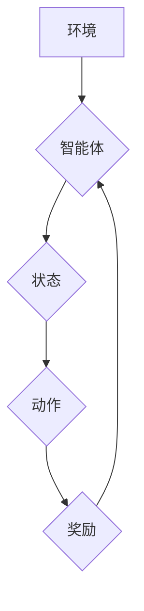

> 强化学习，深度Q网络，DQN，方差，不稳定性，探索与利用，经验回放，目标网络

## 1. 背景介绍

强化学习（Reinforcement Learning，RL）作为机器学习领域的重要分支，旨在训练智能体在环境中通过与环境交互学习最优策略，以最大化累积奖励。近年来，深度强化学习（Deep Reinforcement Learning，DRL）的兴起，结合了深度学习的强大能力和强化学习的智能决策机制，取得了令人瞩目的成果，在游戏、机器人控制、自动驾驶等领域展现出巨大的应用潜力。

然而，深度强化学习算法也面临着诸多挑战，其中不稳定性和方差问题是较为突出且需要深入研究的难题。这些问题往往导致训练过程难以收敛，学习效果不稳定，甚至可能导致训练崩溃。

## 2. 核心概念与联系

**2.1 强化学习基本概念**

强化学习的核心在于智能体与环境的交互过程。智能体通过与环境交互，获得奖励信号，并根据奖励信号调整其策略，以最大化累积奖励。

* **智能体 (Agent):**  学习和决策的实体。
* **环境 (Environment):** 智能体所处的外部世界，提供状态信息和奖励信号。
* **状态 (State):** 环境的当前描述。
* **动作 (Action):** 智能体在特定状态下可以执行的操作。
* **奖励 (Reward):** 环境对智能体动作的反馈，通常是一个标量值。
* **策略 (Policy):** 智能体在不同状态下选择动作的规则。

**2.2 深度Q网络 (DQN)**

深度Q网络 (Deep Q-Network) 是一种经典的深度强化学习算法，它将深度神经网络应用于Q值函数的估计。Q值函数表示在特定状态下执行特定动作的期望累积奖励。DQN通过学习Q值函数，可以为智能体提供最优动作选择策略。

**2.3 不稳定性和方差问题**

在深度强化学习中，不稳定性和方差问题主要源于以下几个方面：

* **Q值函数的估计误差:** 深度神经网络的学习过程存在随机性，导致Q值函数的估计存在误差。
* **探索与利用的权衡:** 强化学习算法需要在探索新动作和利用已知策略之间进行权衡。过度的探索会导致奖励信号不稳定，而过度的利用会导致算法陷入局部最优。
* **梯度更新的不稳定性:** 深度神经网络的梯度更新过程可能存在不稳定性，导致训练过程难以收敛。

**2.4 Mermaid 流程图**



## 3. 核心算法原理 & 具体操作步骤

### 3.1 算法原理概述

DQN算法的核心思想是利用深度神经网络来估计Q值函数，并通过经验回放和目标网络来解决不稳定性和方差问题。

* **经验回放:** 将训练过程中收集到的状态、动作、奖励和下一个状态存储在经验池中，并随机采样经验进行训练，从而缓解训练过程中的样本相关性问题。
* **目标网络:** 使用一个与主网络结构相同的目标网络，其权重参数是主网络权重参数的固定版本，用于计算目标Q值，从而减少训练过程中的方差。

### 3.2 算法步骤详解

1. 初始化深度神经网络，作为主网络。
2. 初始化目标网络，其权重参数与主网络相同。
3. 在环境中与智能体交互，收集状态、动作、奖励和下一个状态的经验。
4. 将收集到的经验存储在经验池中。
5. 从经验池中随机采样经验，并使用主网络估计Q值。
6. 计算目标Q值，使用目标网络估计Q值。
7. 使用经验回放和目标网络来训练主网络，最小化Q值估计误差。
8. 定期更新目标网络的权重参数，使其与主网络权重参数保持一致。
9. 重复步骤3-8，直到训练完成。

### 3.3 算法优缺点

**优点:**

* 可以有效地解决深度强化学习中的不稳定性和方差问题。
* 能够处理高维状态空间和连续动作空间。
* 在许多强化学习任务中取得了优异的性能。

**缺点:**

* 训练过程相对复杂，需要大量的计算资源。
* 经验回放机制可能会导致训练过程中的偏差。
* 算法参数的设置对性能影响较大。

### 3.4 算法应用领域

DQN算法在以下领域具有广泛的应用前景:

* **游戏:** 
* **机器人控制:**
* **自动驾驶:**
* **医疗诊断:**
* **金融交易:**

## 4. 数学模型和公式 & 详细讲解 & 举例说明

### 4.1 数学模型构建

DQN算法的核心是Q值函数，它表示在特定状态下执行特定动作的期望累积奖励。

$$Q(s, a) = E[\sum_{t=0}^{\infty} \gamma^t r_{t+1} | s_t = s, a_t = a]$$

其中：

* $s$ 表示状态。
* $a$ 表示动作。
* $r_{t+1}$ 表示在时间步$t+1$获得的奖励。
* $\gamma$ 表示折扣因子，控制未来奖励的权重。

### 4.2 公式推导过程

DQN算法使用深度神经网络来估计Q值函数，其输出为每个动作对应的Q值。

$$Q(s, a) \approx \hat{Q}(s, a)$$

其中：

* $\hat{Q}(s, a)$ 表示深度神经网络估计的Q值。

DQN算法使用经验回放和目标网络来训练深度神经网络，其目标函数为：

$$L(\theta) = E_{s, a, r, s'} [ (r + \gamma \max_{a'} \hat{Q}(s', a') - \hat{Q}(s, a))^2 ]$$

其中：

* $\theta$ 表示深度神经网络的参数。
* $E_{s, a, r, s'}$ 表示对经验池中采样的经验进行期望。

### 4.3 案例分析与讲解

假设我们有一个简单的游戏环境，智能体可以向左或向右移动，获得奖励或惩罚。

* 状态：智能体的当前位置。
* 动作：向左或向右移动。
* 奖励：到达终点获得奖励，撞墙或超出边界惩罚。

DQN算法可以学习到在不同位置下选择最佳动作的策略，从而最大化累积奖励。

## 5. 项目实践：代码实例和详细解释说明

### 5.1 开发环境搭建

* Python 3.x
* TensorFlow 或 PyTorch
* OpenAI Gym

### 5.2 源代码详细实现

```python
import tensorflow as tf
import numpy as np

# 定义深度神经网络
class DQN(tf.keras.Model):
    def __init__(self, state_size, action_size):
        super(DQN, self).__init__()
        self.dense1 = tf.keras.layers.Dense(64, activation='relu')
        self.dense2 = tf.keras.layers.Dense(32, activation='relu')
        self.output = tf.keras.layers.Dense(action_size)

    def call(self, state):
        x = self.dense1(state)
        x = self.dense2(x)
        return self.output(x)

# 定义DQN算法
class DQNAgent:
    def __init__(self, state_size, action_size, learning_rate=0.001, gamma=0.99, epsilon=1.0, epsilon_decay=0.995, epsilon_min=0.01):
        self.state_size = state_size
        self.action_size = action_size
        self.learning_rate = learning_rate
        self.gamma = gamma
        self.epsilon = epsilon
        self.epsilon_decay = epsilon_decay
        self.epsilon_min = epsilon_min
        self.model = DQN(state_size, action_size)
        self.target_model = DQN(state_size, action_size)
        self.optimizer = tf.keras.optimizers.Adam(learning_rate=self.learning_rate)

    def choose_action(self, state):
        if np.random.rand() < self.epsilon:
            return np.random.randint(self.action_size)
        else:
            q_values = self.model(state)
            return np.argmax(q_values[0])

    def train(self, state, action, reward, next_state, done):
        with tf.GradientTape() as tape:
            target_q_values = self.target_model(next_state)
            max_next_q = tf.reduce_max(target_q_values, axis=1)
            target = reward + self.gamma * max_next_q * (1 - done)
            q_values = self.model(state)
            loss = tf.keras.losses.mean_squared_error(target, q_values[0][action])
        gradients = tape.gradient(loss, self.model.trainable_variables)
        self.optimizer.apply_gradients(zip(gradients, self.model.trainable_variables))

    def update_target_model(self):
        self.target_model.set_weights(self.model.get_weights())

# ... (其他代码)
```

### 5.3 代码解读与分析

* **DQN类:** 定义了深度神经网络的结构，包括输入层、隐藏层和输出层。
* **DQNAgent类:** 定义了DQN算法的核心逻辑，包括选择动作、训练模型和更新目标网络。
* **choose_action方法:** 根据epsilon-greedy策略选择动作。
* **train方法:** 使用经验回放和目标网络训练深度神经网络。
* **update_target_model方法:** 定期更新目标网络的权重参数。

### 5.4 运行结果展示

运行代码后，可以观察到智能体在环境中学习的过程，并最终达到一定的性能水平。

## 6. 实际应用场景

DQN算法在以下领域具有广泛的应用前景:

* **游戏:** 
* **机器人控制:**
* **自动驾驶:**
* **医疗诊断:**
* **金融交易:**

### 6.4 未来应用展望

随着深度学习和强化学习技术的不断发展，DQN算法的应用场景将会更加广泛，并取得更令人瞩目的成果。

## 7. 工具和资源推荐

### 7.1 学习资源推荐

* **书籍:**
    * Reinforcement Learning: An Introduction by Richard S. Sutton and Andrew G. Barto
    * Deep Reinforcement Learning Hands-On by Maxim Lapan
* **在线课程:**
    * Deep Reinforcement Learning Specialization by DeepLearning.AI
    * Reinforcement Learning by David Silver (University of DeepMind)

### 7.2 开发工具推荐

* **TensorFlow:** https://www.tensorflow.org/
* **PyTorch:** https://pytorch.org/
* **OpenAI Gym:** https://gym.openai.com/

### 7.3 相关论文推荐

* Deep Q-Network (DQN) by Volodymyr Mnih et al. (2015)
* Dueling Network Architectures for Deep Reinforcement Learning by Hado van Hasselt et al. (2015)
* Prioritized Experience Replay by Hado van Hasselt et al. (2016)

## 8. 总结：未来发展趋势与挑战

### 8.1 研究成果总结

DQN算法及其变种算法取得了显著的成果，在许多强化学习任务中取得了优异的性能