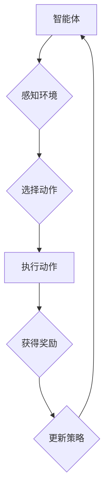

> Deep Q-Network (DQN), 仿真环境, 强化学习, 价值函数, 策略梯度, 探索与利用

## 1. 背景介绍

在人工智能领域，强化学习 (Reinforcement Learning, RL) 作为一种模仿人类学习的算法，近年来取得了显著进展。它通过在环境中与环境交互，学习最优策略来最大化累积奖励。其中，Deep Q-Network (DQN) 作为一种深度强化学习算法，将深度神经网络与 Q-learning 算法相结合，成功应用于各种复杂任务，例如游戏、机器人控制等。

仿真环境作为 RL 训练的重要平台，能够提供安全、可控的测试环境，并模拟现实世界中的复杂场景。在仿真环境中训练的智能体能够在真实世界中更好地应对挑战。然而，将 DQN 应用于仿真环境也面临着一些挑战，例如环境复杂度、数据稀疏性、训练效率等。

## 2. 核心概念与联系

**2.1 强化学习基本概念**

强化学习的核心是智能体与环境的交互过程。智能体通过与环境交互，获得奖励信号，并根据奖励信号更新其策略，以最大化累积奖励。

* **智能体 (Agent):**  学习和决策的实体。
* **环境 (Environment):** 智能体所处的外部世界。
* **状态 (State):** 环境的当前状态。
* **动作 (Action):** 智能体在特定状态下可以执行的操作。
* **奖励 (Reward):** 环境对智能体动作的反馈信号。
* **策略 (Policy):** 智能体在不同状态下选择动作的规则。

**2.2 DQN 算法原理**

DQN 算法的核心是利用深度神经网络来估计 Q 值，即在特定状态下执行特定动作的期望累积奖励。

* **Q 值 (Q-value):**  表示在状态 s 下执行动作 a 的期望累积奖励。
* **目标网络 (Target Network):** 用于计算目标 Q 值，并与主网络参数进行软更新。
* **经验回放 (Experience Replay):** 从历史经验中随机采样数据进行训练，提高训练效率。

**2.3 仿真环境与 DQN 的结合**

仿真环境为 DQN 提供了一个安全、可控的训练平台。在仿真环境中，智能体可以反复与环境交互，学习最优策略。

**2.4 Mermaid 流程图**



## 3. 核心算法原理 & 具体操作步骤

### 3.1 算法原理概述

DQN 算法的核心思想是利用深度神经网络来估计 Q 值，并通过 Q 学习算法进行训练。

* **深度神经网络:** 用于估计 Q 值，其输入是当前状态，输出是各个动作对应的 Q 值。
* **Q 学习算法:** 通过最大化 Q 值来更新策略，即选择能够获得最大奖励的动作。

### 3.2 算法步骤详解

1. **初始化:** 初始化深度神经网络参数，并设置学习率、折扣因子等超参数。
2. **环境交互:** 智能体与环境交互，获得当前状态、动作和奖励。
3. **经验存储:** 将状态、动作、奖励和下一个状态存储到经验回放缓冲区中。
4. **样本采样:** 从经验回放缓冲区中随机采样多个样本。
5. **Q 值估计:** 使用深度神经网络估计每个样本对应的 Q 值。
6. **目标 Q 值计算:** 使用目标网络计算目标 Q 值，并与估计 Q 值进行比较。
7. **损失函数计算:** 计算损失函数，衡量估计 Q 值与目标 Q 值之间的误差。
8. **参数更新:** 使用梯度下降算法更新深度神经网络参数，以最小化损失函数。
9. **策略更新:** 根据更新后的 Q 值更新策略，选择能够获得最大奖励的动作。
10. **重复步骤 2-9:** 直到训练完成或达到预设的目标。

### 3.3 算法优缺点

**优点:**

* 可以处理高维状态空间。
* 能够学习复杂的策略。
* 经验回放机制提高了训练效率。

**缺点:**

* 训练过程可能比较慢。
* 需要大量的训练数据。
* 容易陷入局部最优解。

### 3.4 算法应用领域

DQN 算法已成功应用于以下领域:

* 游戏: 围棋、Go、Atari 游戏等。
* 机器人控制: 机器人导航、机器人抓取等。
* 自动驾驶: 自动驾驶决策、自动驾驶路径规划等。

## 4. 数学模型和公式 & 详细讲解 & 举例说明

### 4.1 数学模型构建

DQN 算法的核心是 Q 值函数，它表示在状态 s 下执行动作 a 的期望累积奖励。

$$Q(s, a)$$

其中，s 表示状态，a 表示动作。

### 4.2 公式推导过程

DQN 算法的目标是最大化 Q 值函数，可以使用 Q 学习算法进行更新。

$$Q(s, a) \leftarrow Q(s, a) + \alpha [r + \gamma \max_{a'} Q(s', a') - Q(s, a)]$$

其中，

* $\alpha$ 是学习率。
* $r$ 是奖励。
* $\gamma$ 是折扣因子。
* $s'$ 是下一个状态。
* $a'$ 是下一个状态下执行的动作。

### 4.3 案例分析与讲解

假设一个智能体在玩游戏，当前状态是 "房间里有一把钥匙"，动作是 "拿起钥匙"。

* $s$ = "房间里有一把钥匙"
* $a$ = "拿起钥匙"
* $r$ = 10 (奖励)
* $s'$ = "房间里没有钥匙，手里有一把钥匙"
* $\gamma$ = 0.9 (折扣因子)

根据 Q 学习公式，可以更新 Q 值：

$$Q("房间里有一把钥匙", "拿起钥匙") \leftarrow Q("房间里有一把钥匙", "拿起钥匙") + \alpha [10 + 0.9 \max_{a'} Q(s', a') - Q("房间里有一把钥匙", "拿起钥匙")]$$

## 5. 项目实践：代码实例和详细解释说明

### 5.1 开发环境搭建

* Python 3.x
* TensorFlow 或 PyTorch
* OpenAI Gym

### 5.2 源代码详细实现

```python
import tensorflow as tf
import numpy as np
from tensorflow.keras.models import Sequential
from tensorflow.keras.layers import Dense

# 定义 DQN 网络
class DQN(tf.keras.Model):
    def __init__(self):
        super(DQN, self).__init__()
        self.dense1 = Dense(64, activation='relu')
        self.dense2 = Dense(64, activation='relu')
        self.dense3 = Dense(num_actions, activation='linear')

    def call(self, state):
        x = self.dense1(state)
        x = self.dense2(x)
        x = self.dense3(x)
        return x

# 定义训练函数
def train(dqn, experience_replay, batch_size):
    # 从经验回放缓冲区中采样数据
    states, actions, rewards, next_states, dones = experience_replay.sample(batch_size)

    # 计算目标 Q 值
    with tf.GradientTape() as tape:
        # 使用目标网络计算目标 Q 值
        target_q_values = target_dqn(next_states)
        # 计算 Q 值损失
        q_values = dqn(states)
        loss = tf.reduce_mean(tf.square(q_values[np.arange(batch_size), actions] - (rewards + gamma * tf.reduce_max(target_q_values, axis=1) * (1 - dones))))

    # 更新 DQN 网络参数
    gradients = tape.gradient(loss, dqn.trainable_variables)
    optimizer.apply_gradients(zip(gradients, dqn.trainable_variables))

# ... 其他代码 ...
```

### 5.3 代码解读与分析

* **DQN 网络:** 使用深度神经网络来估计 Q 值，包含三个全连接层。
* **训练函数:** 使用经验回放缓冲区采样数据，计算 Q 值损失，并更新 DQN 网络参数。
* **目标网络:** 用于计算目标 Q 值，并与主网络参数进行软更新。

### 5.4 运行结果展示

训练完成后，可以评估 DQN 算法的性能，例如在游戏中的得分、机器人控制中的成功率等。

## 6. 实际应用场景

### 6.1 游戏

DQN 算法已成功应用于各种游戏，例如 Atari 游戏、围棋、Go 等。

### 6.2 机器人控制

DQN 算法可以用于机器人控制，例如机器人导航、机器人抓取等。

### 6.3 自动驾驶

DQN 算法可以用于自动驾驶决策、自动驾驶路径规划等。

### 6.4 未来应用展望

DQN 算法在未来将有更广泛的应用，例如医疗诊断、金融交易、个性化推荐等。

## 7. 工具和资源推荐

### 7.1 学习资源推荐

* **书籍:**
    * Reinforcement Learning: An Introduction by Richard S. Sutton and Andrew G. Barto
    * Deep Reinforcement Learning Hands-On by Maxim Lapan
* **在线课程:**
    * Deep Reinforcement Learning Specialization by DeepLearning.AI
    * Reinforcement Learning by David Silver

### 7.2 开发工具推荐

* **TensorFlow:** 开源深度学习框架。
* **PyTorch:** 开源深度学习框架。
* **OpenAI Gym:** 强化学习环境库。

### 7.3 相关论文推荐

* Deep Q-Network (DQN) by Volodymyr Mnih et al. (2015)
* Dueling Network Architectures for Deep Reinforcement Learning by Hado van Hasselt et al. (2016)
* Double Q-Learning by  Hasselt et al. (2015)

## 8. 总结：未来发展趋势与挑战

### 8.1 研究成果总结

DQN 算法取得了显著的成果，成功应用于各种领域。

### 8.2 未来发展趋势

* **探索更有效的训练算法:** 提高训练效率，减少训练时间。
* **解决稀疏奖励问题:** 针对稀疏奖励环境，开发更有效的算法。
* **增强泛化能力:** 使 DQN 算法能够更好地泛化到新的环境。

### 8.3 面临的挑战

* **数据效率:** DQN 算法需要大量的训练数据。
* **样本复杂性:** 仿真环境中的样本可能非常复杂。
* **安全性和可靠性:** DQN 算法在实际应用中需要保证安全性和可靠性。

### 8.4 研究展望

未来，DQN 算法将继续发展，并应用于更多领域。

## 9. 附录：常见问题与解答

* **Q 值函数的定义是什么？**
* **DQN 算法的训练过程是如何进行的？**
* **DQN 算法有哪些优缺点？**
* **DQN 算法有哪些应用场景？**


作者：禅与计算机程序设计艺术 / Zen and the Art of Computer Programming 
<end_of_turn>