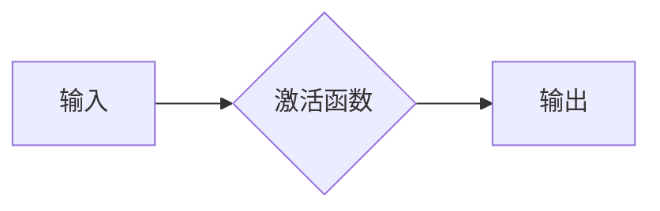

> 激活函数，神经网络，深度学习，机器学习，分类，回归，梯度下降，反向传播

## 1. 背景介绍

深度学习的蓬勃发展离不开激活函数的贡献。激活函数作为神经网络中不可或缺的组成部分，决定了神经网络的非线性表达能力，进而影响着模型的学习能力和性能。选择合适的激活函数对于构建高效、准确的深度学习模型至关重要。

传统的机器学习算法难以处理复杂非线性关系，而深度学习通过堆叠多层神经网络，利用激活函数引入非线性，从而能够学习更复杂的模式和特征。激活函数的作用是将神经元的输入信号转换为输出信号，并引入非线性，使得神经网络能够学习更复杂的映射关系。

## 2. 核心概念与联系

**2.1 激活函数的定义**

激活函数是一个将神经元的输入信号映射到输出信号的函数。它决定了神经元是否被激活，以及激活程度。

**2.2 激活函数的作用**

* **引入非线性:** 激活函数引入非线性，使得神经网络能够学习复杂的非线性关系。
* **决定神经元激活:** 激活函数决定了神经元是否被激活，以及激活程度。
* **影响梯度传播:** 激活函数的导数决定了梯度传播的速度和方向，影响着模型的训练效率。

**2.3 激活函数与神经网络架构**

激活函数的选择与神经网络的架构密切相关。不同的激活函数适用于不同的网络结构和任务类型。

**2.4 激活函数与机器学习任务**

不同的机器学习任务也需要选择不同的激活函数。例如，分类任务通常使用 sigmoid 或 softmax 激活函数，而回归任务则通常使用线性或 ReLU 激活函数。

**Mermaid 流程图**



## 3. 核心算法原理 & 具体操作步骤

**3.1 算法原理概述**

激活函数的原理是通过一个非线性函数将神经元的输入信号转换为输出信号。这个非线性函数可以是多种形式，例如 sigmoid 函数、ReLU 函数、tanh 函数等。

**3.2 算法步骤详解**

1. **计算神经元的输入信号:** 将所有连接到该神经元的上一层神经元的输出信号加权求和。
2. **应用激活函数:** 将计算得到的输入信号作为激活函数的输入，得到神经元的输出信号。
3. **传递输出信号:** 将神经元的输出信号作为下一层神经元的输入信号。

**3.3 算法优缺点**

不同的激活函数具有不同的优缺点，需要根据具体的应用场景选择合适的激活函数。

* **Sigmoid 函数:**
    * 优点: 输出范围在 0 到 1 之间，适合二分类问题。
    * 缺点: 容易出现梯度消失问题。
* **ReLU 函数:**
    * 优点: 计算速度快，避免了梯度消失问题。
    * 缺点: 容易出现死亡神经元问题。
* **tanh 函数:**
    * 优点: 输出范围在 -1 到 1 之间，可以缓解梯度消失问题。
    * 缺点: 计算速度相对较慢。

**3.4 算法应用领域**

激活函数广泛应用于各种深度学习领域，例如图像识别、自然语言处理、语音识别等。

## 4. 数学模型和公式 & 详细讲解 & 举例说明

**4.1 数学模型构建**

激活函数的数学模型通常是一个非线性函数，其输入为神经元的输入信号，输出为神经元的输出信号。

**4.2 公式推导过程**

激活函数的公式推导过程取决于具体的激活函数类型。例如，sigmoid 函数的公式为：

$$
f(x) = \frac{1}{1 + e^{-x}}
$$

**4.3 案例分析与讲解**

假设一个神经元接收三个输入信号 x1, x2, x3，权重分别为 w1, w2, w3，偏置项为 b。则该神经元的输入信号为：

$$
z = w1 * x1 + w2 * x2 + w3 * x3 + b
$$

如果使用 sigmoid 函数作为激活函数，则该神经元的输出信号为：

$$
y = \frac{1}{1 + e^{-z}}
$$

## 5. 项目实践：代码实例和详细解释说明

**5.1 开发环境搭建**

使用 Python 语言和 TensorFlow 或 PyTorch 深度学习框架搭建开发环境。

**5.2 源代码详细实现**

```python
import tensorflow as tf

# 定义一个神经网络模型
model = tf.keras.models.Sequential([
    tf.keras.layers.Dense(128, activation='relu', input_shape=(784,)),
    tf.keras.layers.Dense(10, activation='softmax')
])

# 编译模型
model.compile(optimizer='adam',
              loss='sparse_categorical_crossentropy',
              metrics=['accuracy'])

# 训练模型
model.fit(x_train, y_train, epochs=10)
```

**5.3 代码解读与分析**

* `tf.keras.layers.Dense`: 定义一个全连接层。
* `activation='relu'`: 使用 ReLU 激活函数。
* `input_shape=(784,)`: 指定输入数据的形状。
* `loss='sparse_categorical_crossentropy'`: 使用稀疏类别交叉熵损失函数。
* `metrics=['accuracy']`: 使用准确率作为评估指标。

**5.4 运行结果展示**

训练完成后，可以评估模型的性能，并可视化训练过程中的损失值和准确率变化趋势。

## 6. 实际应用场景

**6.1 图像识别**

激活函数在图像识别任务中发挥着重要作用，例如识别物体、人脸识别、场景识别等。

**6.2 自然语言处理**

激活函数在自然语言处理任务中也广泛应用，例如文本分类、情感分析、机器翻译等。

**6.3 语音识别**

激活函数在语音识别任务中用于将语音信号转换为文本。

**6.4 未来应用展望**

随着深度学习技术的不断发展，激活函数的研究和应用也将更加广泛。未来，可能会出现新的激活函数类型，以及更加高效、准确的激活函数选择方法。

## 7. 工具和资源推荐

**7.1 学习资源推荐**

* 深度学习书籍：
    * 《深度学习》
    * 《动手学深度学习》
* 在线课程：
    * Coursera 深度学习课程
    * Udacity 深度学习课程

**7.2 开发工具推荐**

* TensorFlow
* PyTorch
* Keras

**7.3 相关论文推荐**

* 《Rectified Linear Units Improve Restricted Boltzmann Machines》
* 《Batch Normalization: Accelerating Deep Network Training by Reducing Internal Covariate Shift》

## 8. 总结：未来发展趋势与挑战

**8.1 研究成果总结**

近年来，激活函数的研究取得了显著进展，出现了许多新的激活函数类型，例如 ReLU、Leaky ReLU、ELU、Swish 等。这些新的激活函数提高了神经网络的训练效率和性能。

**8.2 未来发展趋势**

未来，激活函数的研究将朝着以下几个方向发展：

* **自适应激活函数:** 根据输入数据自动调整激活函数的类型和参数。
* **可解释性激活函数:** 能够解释激活函数的输出结果，提高模型的可解释性。
* **高效计算激活函数:** 降低激活函数的计算复杂度，提高模型的训练速度。

**8.3 面临的挑战**

* **激活函数的选择:** 不同任务和数据集需要选择不同的激活函数，缺乏统一的标准和方法。
* **激活函数的解释性:** 许多激活函数的内部机制难以理解，难以解释模型的决策过程。
* **激活函数的效率:** 一些激活函数的计算复杂度较高，限制了模型的训练速度。

**8.4 研究展望**

未来，需要进一步研究新的激活函数类型，以及开发更加高效、准确、可解释的激活函数选择方法，推动深度学习技术的进一步发展。

## 9. 附录：常见问题与解答

**9.1 什么是激活函数？**

激活函数是一个将神经元的输入信号转换为输出信号的函数，它决定了神经元是否被激活，以及激活程度。

**9.2 为什么需要激活函数？**

激活函数引入非线性，使得神经网络能够学习复杂的非线性关系。

**9.3 如何选择合适的激活函数？**

激活函数的选择取决于具体的应用场景和任务类型。例如，分类任务通常使用 sigmoid 或 softmax 激活函数，而回归任务则通常使用线性或 ReLU 激活函数。

**9.4 常见的激活函数有哪些？**

常见的激活函数包括 sigmoid 函数、ReLU 函数、tanh 函数、softmax 函数等。

**9.5 激活函数的优缺点是什么？**

不同的激活函数具有不同的优缺点，需要根据具体的应用场景选择合适的激活函数。


作者：禅与计算机程序设计艺术 / Zen and the Art of Computer Programming 
<end_of_turn>