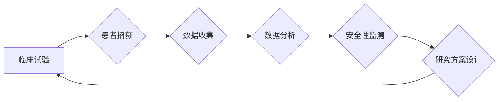

> 临床试验、LLM、人工智能、自然语言处理、数据分析、安全性、效率

## 1. 背景介绍

临床试验是药物和医疗设备开发的重要环节，其目的是评估新疗法的安全性和有效性。传统的临床试验流程耗时、成本高，且数据分析复杂。近年来，人工智能（AI）技术，特别是大型语言模型（LLM）的快速发展，为临床试验带来了新的机遇。LLM 拥有强大的文本理解和生成能力，可以有效地提高临床试验的效率和安全性。

## 2. 核心概念与联系

**2.1 临床试验**

临床试验是指在人类志愿者身上进行的科学研究，旨在评估新药物、治疗方法或医疗设备的安全性、有效性和最佳使用方案。临床试验通常分为多个阶段，从早期的小规模试验到后期的大规模随机对照试验。

**2.2 LLM**

大型语言模型（LLM）是一种基于深度学习的强大人工智能模型，能够理解和生成人类语言。LLM 通过训练海量文本数据，学习语言的语法、语义和上下文关系。

**2.3 核心概念联系**

LLM 可以应用于临床试验的各个阶段，例如：

* **患者招募:** LLM 可以分析患者的病历和症状，识别潜在的符合试验条件的患者，并通过自然语言进行沟通，提高患者参与率。
* **数据收集和分析:** LLM 可以自动提取临床试验数据，例如患者的症状、治疗方案和随访结果，并进行分析，识别潜在的治疗效果和风险因素。
* **安全性监测:** LLM 可以分析患者的报告和电子病历，识别潜在的药物不良反应，并及时提醒医生和研究人员。
* **研究方案设计:** LLM 可以帮助研究人员设计更有效的临床试验方案，例如确定合适的患者群体、治疗方案和随访时间。

**2.4 Mermaid 流程图**



## 3. 核心算法原理 & 具体操作步骤

**3.1 算法原理概述**

LLM 的核心算法是基于 Transformer 架构的深度神经网络。Transformer 模型利用注意力机制，能够捕捉文本中的长距离依赖关系，从而实现更准确的文本理解和生成。

**3.2 算法步骤详解**

1. **数据预处理:** 将临床试验数据进行清洗、格式化和标记，例如将患者的病历文本转换为数字格式，并标记关键信息，如症状、治疗方案和随访结果。
2. **模型训练:** 使用预处理后的数据训练 LLM 模型，例如使用 BERT、GPT-3 或其他 Transformer 模型。训练过程包括调整模型参数，使模型能够准确地预测文本的下一个词或句子。
3. **模型评估:** 使用测试数据评估模型的性能，例如计算准确率、召回率和 F1 分数。
4. **模型部署:** 将训练好的模型部署到生产环境中，例如将模型集成到临床试验管理系统中。

**3.3 算法优缺点**

**优点:**

* 强大的文本理解和生成能力
* 可以处理海量文本数据
* 可以自动提取关键信息
* 可以识别潜在的治疗效果和风险因素

**缺点:**

* 需要大量的训练数据
* 训练过程耗时和计算资源消耗大
* 模型解释性较差
* 可能存在偏差和错误

**3.4 算法应用领域**

* 患者招募
* 数据收集和分析
* 安全性监测
* 研究方案设计
* 临床决策支持

## 4. 数学模型和公式 & 详细讲解 & 举例说明

**4.1 数学模型构建**

LLM 的训练过程可以看作是一个优化问题，目标是找到模型参数，使模型在训练数据上的损失函数最小化。损失函数通常是交叉熵损失函数，用于衡量模型预测结果与真实结果之间的差异。

**4.2 公式推导过程**

交叉熵损失函数的公式如下：

$$
H(p, q) = - \sum_{i=1}^{n} p(i) \log q(i)
$$

其中：

* $p(i)$ 是真实标签的概率分布
* $q(i)$ 是模型预测的概率分布

**4.3 案例分析与讲解**

假设我们有一个训练数据，包含 10 个句子，每个句子都有一个对应的标签。模型预测每个句子的标签概率分布，例如：

* 句子 1: 标签概率分布为 [0.8, 0.2]
* 句子 2: 标签概率分布为 [0.5, 0.5]

真实标签分布为：

* 句子 1: [1, 0]
* 句子 2: [0, 1]

则交叉熵损失函数的值为：

$$
H(p, q) = - [(1 \log 0.8) + (0 \log 0.2)] - [(0 \log 0.5) + (1 \log 0.5)] = - \log 0.8 - \log 0.5
$$

## 5. 项目实践：代码实例和详细解释说明

**5.1 开发环境搭建**

* Python 3.7+
* TensorFlow 或 PyTorch
* CUDA 和 cuDNN (可选)

**5.2 源代码详细实现**

```python
import tensorflow as tf

# 定义模型结构
model = tf.keras.Sequential([
    tf.keras.layers.Embedding(input_dim=vocab_size, output_dim=embedding_dim),
    tf.keras.layers.LSTM(units=hidden_units),
    tf.keras.layers.Dense(units=num_classes, activation='softmax')
])

# 编译模型
model.compile(optimizer='adam',
              loss='sparse_categorical_crossentropy',
              metrics=['accuracy'])

# 训练模型
model.fit(x_train, y_train, epochs=num_epochs, batch_size=batch_size)

# 评估模型
loss, accuracy = model.evaluate(x_test, y_test)
print('Loss:', loss)
print('Accuracy:', accuracy)
```

**5.3 代码解读与分析**

* 代码首先定义了模型结构，包括嵌入层、LSTM 层和全连接层。
* 嵌入层将单词转换为向量表示。
* LSTM 层用于捕捉文本中的长距离依赖关系。
* 全连接层用于分类。
* 代码然后编译了模型，指定了优化器、损失函数和评估指标。
* 训练模型使用训练数据进行训练，并设置了训练轮数和批处理大小。
* 评估模型使用测试数据评估模型的性能。

**5.4 运行结果展示**

训练完成后，可以查看模型的损失函数和准确率，评估模型的性能。

## 6. 实际应用场景

**6.1 患者招募**

LLM 可以分析患者的病历和症状，识别潜在的符合试验条件的患者，并通过自然语言进行沟通，提高患者参与率。例如，LLM 可以自动生成个性化的患者招募邮件，并根据患者的回复进行个性化沟通。

**6.2 数据收集和分析**

LLM 可以自动提取临床试验数据，例如患者的症状、治疗方案和随访结果，并进行分析，识别潜在的治疗效果和风险因素。例如，LLM 可以分析患者的电子病历，识别潜在的药物不良反应。

**6.3 安全性监测**

LLM 可以分析患者的报告和电子病历，识别潜在的药物不良反应，并及时提醒医生和研究人员。例如，LLM 可以监控患者的社交媒体帖子，识别潜在的药物不良反应。

**6.4 未来应用展望**

LLM 在临床试验领域的应用前景广阔，未来可能在以下方面得到进一步发展：

* 更精准的患者招募
* 更高效的数据分析
* 更安全的安全性监测
* 更智能的临床决策支持

## 7. 工具和资源推荐

**7.1 学习资源推荐**

* **课程:**
    * 深度学习 Specialization (Coursera)
    * 自然语言处理 Specialization (Coursera)
* **书籍:**
    * 深度学习 (Ian Goodfellow)
    * 自然语言处理 (Jurafsky & Martin)
* **网站:**
    * TensorFlow 官网 (https://www.tensorflow.org/)
    * PyTorch 官网 (https://pytorch.org/)
    * Hugging Face (https://huggingface.co/)

**7.2 开发工具推荐**

* **Python:** 
    * TensorFlow
    * PyTorch
    * spaCy
    * NLTK

**7.3 相关论文推荐**

* BERT: Pre-training of Deep Bidirectional Transformers for Language Understanding (Devlin et al., 2018)
* GPT-3: Language Models are Few-Shot Learners (Brown et al., 2020)
* ClinicalBERT: Pre-training a Language Model for Clinical Text (Alsentzer et al., 2019)

## 8. 总结：未来发展趋势与挑战

**8.1 研究成果总结**

LLM 在临床试验领域的应用取得了显著进展，例如在患者招募、数据分析和安全性监测方面展现出强大的潜力。

**8.2 未来发展趋势**

* 更强大的 LLMs：未来将出现更强大的 LLMs，能够处理更复杂的任务，例如更精准的患者招募和更深入的数据分析。
* 更个性化的临床试验：LLM 将使临床试验更加个性化，例如根据患者的个体特征设计更合适的治疗方案。
* 更智能的临床决策支持：LLM 将帮助医生做出更智能的临床决策，例如识别潜在的药物不良反应和预测患者的治疗效果。

**8.3 面临的挑战**

* 数据隐私和安全：LLM 的训练需要大量的数据，如何保护患者的隐私和数据安全是一个重要的挑战。
* 模型解释性和可信度：LLM 的决策过程通常是黑盒式的，如何提高模型的解释性和可信度是一个重要的研究方向。
* 伦理问题：LLM 在临床试验中的应用可能引发一些伦理问题，例如算法偏见和患者自主权。

**8.4 研究展望**

未来，LLM 在临床试验领域的应用将继续发展，需要进一步研究和探索，以充分发挥其潜力，提高临床试验的效率和安全性，最终为患者带来更好的医疗服务。

## 9. 附录：常见问题与解答

**9.1 如何选择合适的 LLM 模型？**

选择合适的 LLM 模型取决于具体的应用场景和数据特点。例如，对于文本分类任务，BERT 模型效果较好；对于文本生成任务，GPT-3 模型效果较好。

**9.2 如何处理临床试验数据中的噪声和不完整性？**

临床试验数据中可能存在噪声和不完整性，可以使用数据清洗和预处理技术来解决这些问题。例如，可以使用正则表达式去除噪声，使用插值法填充缺失值。

**9.3 如何评估 LLM 在临床试验中的性能？**

可以使用准确率、召回率、F1 分数等指标来评估 LLM 在临床试验中的性能。

**9.4 LLM 是否会带来新的伦理问题？**

LLM 在临床试验中的应用可能带来一些新的伦理问题，例如算法偏见和患者自主权。需要认真考虑这些问题，制定相应的伦理规范和监管机制。


作者：禅与计算机程序设计艺术 / Zen and the Art of Computer Programming 
<end_of_turn>