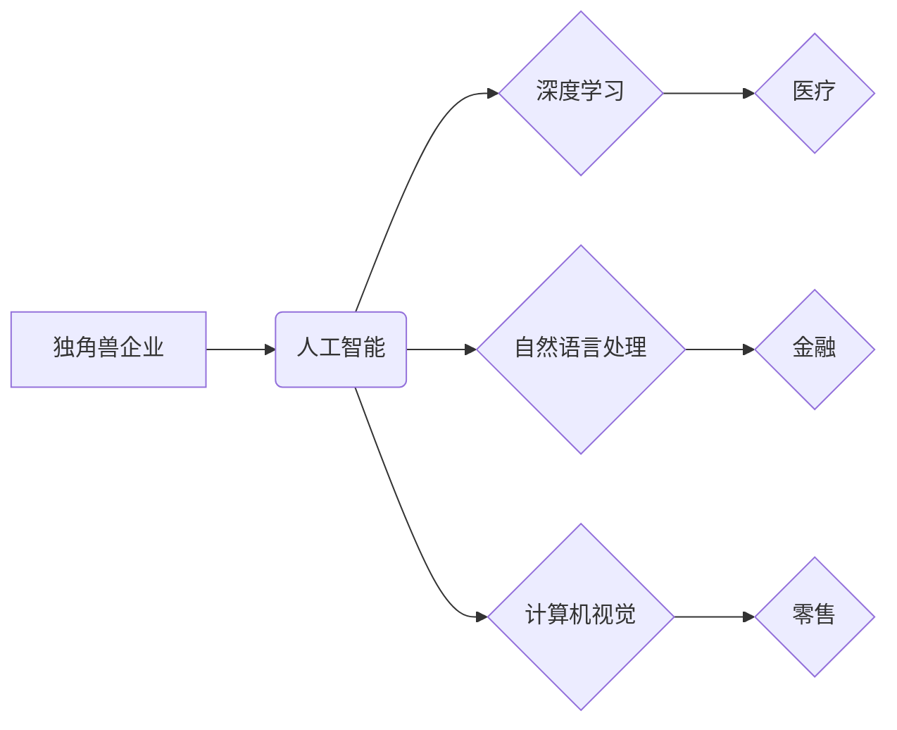

> 人工智能、独角兽企业、深度学习、自然语言处理、计算机视觉、机器学习、大数据、云计算

## 1. 背景介绍

人工智能（AI）正以惊人的速度发展，其应用领域不断拓展，深刻地改变着我们的生活和工作方式。在这一蓬勃发展的领域中，涌现出一批独角兽企业，它们凭借着创新的技术、强大的商业模式和雄厚的资金实力，迅速崛起，成为行业领军者。本文将深入探讨人工智能产业的独角兽企业，分析其核心概念、技术原理、发展趋势以及面临的挑战。

## 2. 核心概念与联系

**2.1 独角兽企业**

独角兽企业是指估值超过10亿美元的私营公司，通常具有快速增长、高盈利能力和巨大的市场潜力。

**2.2 人工智能**

人工智能是指模拟人类智能的计算机系统，其核心目标是使机器能够像人类一样学习、推理、解决问题和做出决策。

**2.3 联系**

人工智能独角兽企业是指在人工智能领域拥有领先技术和商业模式的独角兽企业。它们通常专注于特定的人工智能子领域，例如深度学习、自然语言处理、计算机视觉等，并将其应用于各个行业，如医疗、金融、零售、交通等。

**2.4  核心概念关系图**



## 3. 核心算法原理 & 具体操作步骤

**3.1 算法原理概述**

深度学习是人工智能领域的重要分支，其核心是利用多层神经网络来模拟人类大脑的学习过程。深度学习算法能够从海量数据中自动提取特征，并进行复杂的模式识别和预测。

**3.2 算法步骤详解**

1. **数据预处理:** 收集和清洗数据，将其转换为深度学习模型可以理解的格式。
2. **网络结构设计:** 根据任务需求设计多层神经网络结构，包括输入层、隐藏层和输出层。
3. **参数初始化:** 为神经网络中的参数赋予初始值。
4. **前向传播:** 将输入数据通过神经网络传递，计算输出结果。
5. **反向传播:** 计算输出结果与真实值的误差，并根据误差调整神经网络参数。
6. **迭代训练:** 重复前向传播和反向传播过程，直到模型性能达到预期水平。

**3.3 算法优缺点**

**优点:**

* 能够自动提取特征，无需人工特征工程。
* 能够处理海量数据，学习复杂模式。
* 在图像识别、语音识别、自然语言处理等领域取得了突破性进展。

**缺点:**

* 训练数据量大，计算资源消耗高。
* 模型解释性差，难以理解模型的决策过程。
* 对数据质量要求高，容易受到噪声数据的影响。

**3.4 算法应用领域**

* **图像识别:** 人脸识别、物体检测、图像分类
* **语音识别:** 语音转文本、语音助手
* **自然语言处理:** 机器翻译、文本摘要、情感分析
* **推荐系统:** 商品推荐、内容推荐
* **医疗诊断:** 病情预测、疾病诊断

## 4. 数学模型和公式 & 详细讲解 & 举例说明

**4.1 数学模型构建**

深度学习模型通常采用多层感知机（MLP）或卷积神经网络（CNN）等结构。

**4.2 公式推导过程**

深度学习模型的训练过程基于梯度下降算法，其核心公式为：

$$
\theta = \theta - \alpha \nabla L(\theta)
$$

其中：

* $\theta$：模型参数
* $\alpha$：学习率
* $\nabla L(\theta)$：损失函数对参数的梯度

**4.3 案例分析与讲解**

假设我们训练一个图像分类模型，目标是将图像分类为猫或狗。损失函数可以定义为交叉熵损失函数，其公式为：

$$
L = -\sum_{i=1}^{N} y_i \log(p_i)
$$

其中：

* $N$：图像数量
* $y_i$：真实标签（0或1）
* $p_i$：模型预测的概率

通过反向传播算法，我们可以计算损失函数对模型参数的梯度，并利用梯度下降算法更新模型参数，最终使模型的预测准确率达到最大。

## 5. 项目实践：代码实例和详细解释说明

**5.1 开发环境搭建**

使用Python语言和深度学习框架TensorFlow或PyTorch搭建开发环境。

**5.2 源代码详细实现**

```python
import tensorflow as tf

# 定义模型结构
model = tf.keras.models.Sequential([
    tf.keras.layers.Conv2D(32, (3, 3), activation='relu', input_shape=(28, 28, 1)),
    tf.keras.layers.MaxPooling2D((2, 2)),
    tf.keras.layers.Conv2D(64, (3, 3), activation='relu'),
    tf.keras.layers.MaxPooling2D((2, 2)),
    tf.keras.layers.Flatten(),
    tf.keras.layers.Dense(10, activation='softmax')
])

# 编译模型
model.compile(optimizer='adam',
              loss='sparse_categorical_crossentropy',
              metrics=['accuracy'])

# 训练模型
model.fit(x_train, y_train, epochs=10)

# 评估模型
loss, accuracy = model.evaluate(x_test, y_test)
print('Test loss:', loss)
print('Test accuracy:', accuracy)
```

**5.3 代码解读与分析**

这段代码定义了一个简单的卷积神经网络模型，用于图像分类任务。模型包含两层卷积层、两层最大池化层、一层全连接层和一层输出层。模型使用Adam优化器、交叉熵损失函数和准确率作为评估指标。

**5.4 运行结果展示**

训练完成后，模型可以用于预测新的图像类别。

## 6. 实际应用场景

**6.1 医疗诊断**

人工智能可以辅助医生进行疾病诊断，例如识别肿瘤、预测患者风险等。

**6.2 金融风险控制**

人工智能可以用于检测金融欺诈、评估信用风险等。

**6.3 自动驾驶**

人工智能可以帮助车辆感知周围环境、做出决策，实现自动驾驶功能。

**6.4 未来应用展望**

人工智能将在更多领域得到应用，例如教育、娱乐、制造业等，为人类社会带来更多便利和福祉。

## 7. 工具和资源推荐

**7.1 学习资源推荐**

* **书籍:**
    * 深度学习
    * 人工智能：一个现代方法
* **在线课程:**
    * Coursera深度学习课程
    * Udacity人工智能工程师课程

**7.2 开发工具推荐**

* **深度学习框架:** TensorFlow, PyTorch
* **编程语言:** Python
* **云计算平台:** AWS, Azure, GCP

**7.3 相关论文推荐**

* ImageNet Classification with Deep Convolutional Neural Networks
* Attention Is All You Need

## 8. 总结：未来发展趋势与挑战

**8.1 研究成果总结**

人工智能技术取得了长足进步，在多个领域取得了突破性进展。

**8.2 未来发展趋势**

* **模型更加强大:** 模型规模将继续扩大，性能将进一步提升。
* **应用更加广泛:** 人工智能将应用于更多领域，解决更多问题。
* **伦理与安全:** 人工智能伦理和安全问题将受到更多关注。

**8.3 面临的挑战**

* **数据获取和隐私保护:** 训练高质量的人工智能模型需要大量数据，如何获取和保护数据是一个挑战。
* **模型解释性和可信度:** 人工智能模型的决策过程难以解释，如何提高模型的可信度是一个重要问题。
* **算法公平性和偏见:** 人工智能算法可能存在偏见，如何确保算法公平性是一个需要解决的问题。

**8.4 研究展望**

未来人工智能研究将更加注重模型的可解释性、公平性和安全性，并探索人工智能与人类更加紧密地合作的模式。

## 9. 附录：常见问题与解答

**9.1 什么是深度学习？**

深度学习是一种机器学习方法，它使用多层神经网络来模拟人类大脑的学习过程。

**9.2 人工智能独角兽企业有哪些？**

一些知名的AI独角兽企业包括OpenAI, DeepMind, Scale AI, UiPath, DataRobot等。

**9.3 如何学习人工智能？**

可以通过阅读书籍、参加在线课程、参与开源项目等方式学习人工智能。


作者：禅与计算机程序设计艺术 / Zen and the Art of Computer Programming 
<end_of_turn>