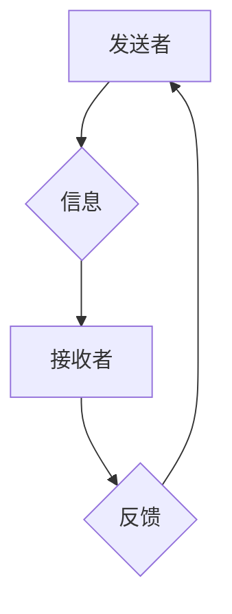

> 人际沟通、非语言沟通、倾听、反馈、情绪识别、人工智能、人机交互

## 1. 背景介绍

在当今信息爆炸的时代，人际沟通已成为人类社会发展和进步的基石。无论是个人生活还是职场工作，有效的沟通能够促进理解、建立信任、达成共识，从而推动事物的顺利进行。然而，人际沟通并非易事，它涉及到复杂的社会心理因素、文化背景差异以及个体认知模式等多重变量。

随着人工智能技术的飞速发展，人机交互领域也迎来了前所未有的机遇。人工智能技术能够帮助我们更好地理解和模拟人类的沟通行为，从而构建更加智能、高效的人机交互系统。例如，基于自然语言处理技术的聊天机器人能够与用户进行流畅自然的对话，而基于情感识别技术的虚拟助手能够感知用户的情绪状态，并提供相应的帮助和支持。

## 2. 核心概念与联系

人际沟通是一个复杂而动态的过程，它涉及到信息的发送、接收、理解和反馈等多个环节。

**2.1. 沟通模型**

一个常见的沟通模型是“发送者-信息-接收者-反馈”模型。

* **发送者:** 沟通信息的来源，负责将信息编码并发送出去。
* **信息:** 沟通的内容，可以是语言、文字、图像、声音等多种形式。
* **接收者:** 接收信息的目的地，负责解码并理解信息内容。
* **反馈:** 接收者对信息的回应，可以是言语、表情、肢体语言等形式。

**2.2. 沟通类型**

人际沟通可以分为多种类型，包括：

* **口头沟通:** 通过语音进行信息交流，例如对话、演讲、会议等。
* **书面沟通:** 通过文字进行信息交流，例如邮件、短信、报告等。
* **非语言沟通:** 通过肢体语言、表情、眼神等非语言信号进行信息交流。

**2.3. 沟通障碍**

人际沟通过程中可能会遇到各种障碍，例如：

* **语言障碍:** 语言不通、表达不清等。
* **文化差异:** 文化背景不同导致理解偏差。
* **心理障碍:** 焦虑、紧张、情绪波动等影响沟通质量。

**2.4. 沟通技巧**

为了有效地进行人际沟通，需要掌握一些沟通技巧，例如：

* **积极倾听:** 专注于对方的言辞，并给予适当的回应。
* **清晰表达:** 使用简洁明了的语言，避免歧义和误解。
* **尊重对方:** 尊重对方的观点和感受，避免冲突和争吵。
* **反馈机制:** 及时反馈信息，确认对方理解内容。

**Mermaid 流程图**



## 3. 核心算法原理 & 具体操作步骤

### 3.1  算法原理概述

人际沟通的本质是信息交换和理解。在人工智能领域，通过自然语言处理（NLP）技术，我们可以实现对文本和语音数据的分析和理解，从而模拟和辅助人际沟通。

NLP技术主要包括以下几个方面：

* **文本预处理:** 对文本数据进行清洗、分词、词性标注等处理，以便于后续分析。
* **词向量表示:** 将单词或短语映射到向量空间，以便于捕捉单词之间的语义关系。
* **语义分析:** 分析文本的语义结构和含义，例如识别句子主谓宾、提取关键词等。
* **对话系统:** 建立基于规则或机器学习的对话系统，能够与用户进行自然流畅的对话。

### 3.2  算法步骤详解

**3.2.1. 文本预处理**

1. **去除停用词:** 停用词是指一些常见的词语，例如“是”、“的”、“在”等，它们对文本的语义理解没有太大帮助，需要进行去除。
2. **分词:** 将文本分割成一个个独立的词语或短语，以便于后续分析。
3. **词性标注:** 对每个词语进行词性标注，例如名词、动词、形容词等，以便于理解词语的语法功能。

**3.2.2. 词向量表示**

可以使用Word2Vec、GloVe等算法训练词向量模型，将每个词语映射到一个低维向量空间。

**3.2.3. 语义分析**

可以使用深度学习模型，例如Transformer、BERT等，对文本进行语义分析，例如识别句子主谓宾、提取关键词、判断文本情感等。

**3.2.4. 对话系统**

可以使用基于规则或机器学习的对话系统框架，例如Rasa、Dialogflow等，构建能够与用户进行自然流畅对话的系统。

### 3.3  算法优缺点

**优点:**

* 可以自动分析和理解文本和语音数据。
* 可以构建更加智能、高效的人机交互系统。
* 可以帮助人们更好地沟通和交流。

**缺点:**

* 现有的NLP技术仍然存在一些局限性，例如理解复杂语义、处理歧义等。
* 需要大量的训练数据才能训练出高质量的模型。
* 存在伦理和安全方面的挑战，例如数据隐私、算法偏见等。

### 3.4  算法应用领域

* **聊天机器人:** 提供24小时在线客服、陪伴聊天等服务。
* **虚拟助手:** 帮助用户完成各种任务，例如日程安排、信息查询等。
* **机器翻译:** 将文本从一种语言翻译成另一种语言。
* **文本摘要:** 自动生成文本的简要概述。
* **情感分析:** 分析文本的情感倾向，例如判断用户对产品的满意度。

## 4. 数学模型和公式 & 详细讲解 & 举例说明

### 4.1  数学模型构建

在人际沟通的分析和模拟中，我们可以使用数学模型来描述沟通过程中的各个环节。例如，我们可以使用概率模型来描述信息发送和接收的成功率，使用图论模型来描述沟通网络中的关系，使用信息论来量化信息传递的效率。

### 4.2  公式推导过程

**4.2.1. 信息熵**

信息熵是衡量信息不确定性的度量，公式如下：

$$H(X) = - \sum_{i=1}^{n} p(x_i) \log_2 p(x_i)$$

其中：

* $X$ 是随机变量，表示信息内容。
* $p(x_i)$ 是 $x_i$ 出现的概率。

**4.2.2. 交叉熵**

交叉熵是衡量两个概率分布之间的差异，公式如下：

$$H(P, Q) = - \sum_{i=1}^{n} p(x_i) \log_2 q(x_i)$$

其中：

* $P$ 是真实概率分布。
* $Q$ 是预测概率分布。

**4.2.3. 准确率**

准确率是衡量分类模型性能的指标，公式如下：

$$Accuracy = \frac{TP + TN}{TP + FP + TN + FN}$$

其中：

* $TP$ 是真阳性，即预测正确为正例的样本数。
* $FP$ 是假阳性，即预测错误为正例的样本数。
* $TN$ 是真阴性，即预测正确为负例的样本数。
* $FN$ 是假阴性，即预测错误为负例的样本数。

### 4.3  案例分析与讲解

**4.3.1. 信息熵**

假设我们有一个随机变量 $X$，表示掷一枚硬币的结果，$X$ 可以取值为正面（H）或反面（T）。

* $p(H) = 0.5$
* $p(T) = 0.5$

则 $X$ 的信息熵为：

$$H(X) = - (0.5 \log_2 0.5 + 0.5 \log_2 0.5) = 1$$

**4.3.2. 交叉熵**

假设我们有一个真实概率分布 $P$ 和一个预测概率分布 $Q$，

* $P = (0.6, 0.4)$
* $Q = (0.7, 0.3)$

则 $P$ 和 $Q$ 的交叉熵为：

$$H(P, Q) = - (0.6 \log_2 0.7 + 0.4 \log_2 0.3) \approx 0.79$$

**4.3.3. 准确率**

假设一个分类模型对100个样本进行分类，其中：

* 真阳性：60个
* 假阳性：10个
* 真阴性：20个
* 假阴性：10个

则该模型的准确率为：

$$Accuracy = \frac{60 + 20}{60 + 10 + 20 + 10} = 0.7$$

## 5. 项目实践：代码实例和详细解释说明

### 5.1  开发环境搭建

* 操作系统：Windows/macOS/Linux
* Python 版本：3.6+
* 必要的库：NLTK、spaCy、TensorFlow/PyTorch

### 5.2  源代码详细实现

```python
import nltk
from nltk.tokenize import word_tokenize
from nltk.corpus import stopwords

# 下载 NLTK 数据
nltk.download('punkt')
nltk.download('stopwords')

# 文本预处理
text = "This is a sample text for demonstration purposes."
tokens = word_tokenize(text)
stop_words = set(stopwords.words('english'))
filtered_tokens = [word for word in tokens if word.lower() not in stop_words]

# 词向量表示
# 使用预训练的词向量模型，例如 Word2Vec 或 GloVe

# 语义分析
# 使用深度学习模型，例如 BERT 或 Transformer

# 对话系统
# 使用 Rasa 或 Dialogflow 等对话系统框架
```

### 5.3  代码解读与分析

* **文本预处理:** 代码首先使用 NLTK 库对文本进行分词和停用词去除，以便于后续分析。
* **词向量表示:** 代码使用预训练的词向量模型，将每个词语映射到一个低维向量空间。
* **语义分析:** 代码使用深度学习模型，例如 BERT 或 Transformer，对文本进行语义分析。
* **对话系统:** 代码使用 Rasa 或 Dialogflow 等对话系统框架，构建能够与用户进行自然流畅对话的系统。

### 5.4  运行结果展示

运行上述代码后，可以得到预处理后的文本、词向量表示、语义分析结果以及对话系统的交互结果。

## 6. 实际应用场景

### 6.1. 聊天机器人

聊天机器人可以用于提供24小时在线客服、陪伴聊天、游戏娱乐等多种场景。例如，一些电商平台会使用聊天机器人来帮助用户查询商品信息、下单购买等。

### 6.2. 虚拟助手

虚拟助手可以帮助用户完成各种任务，例如日程安排、信息查询、天气预报等。例如，Siri、Alexa 和 Google Assistant 都是常见的虚拟助手。

### 6.3. 机器翻译

机器翻译可以将文本从一种语言翻译成另一种语言，例如 Google Translate 和 DeepL。

### 6.4. 文本摘要

文本摘要可以自动生成文本的简要概述，例如新闻摘要、会议记录摘要等。

## 7. 工具和资源推荐

### 7.1  学习资源推荐

* **书籍:**
    * 《自然语言处理》 by Jurafsky & Martin
    * 《深度学习》 by Goodfellow, Bengio & Courville
* **在线课程:**
    * Coursera: Natural Language Processing Specialization
    * edX: