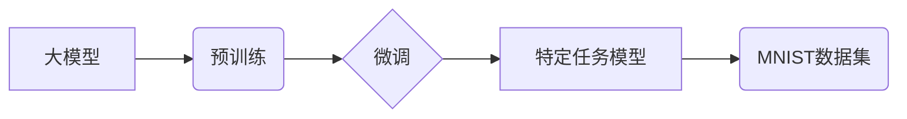

> 大模型开发, 微调, MNIST数据集, 深度学习, 神经网络, 计算机视觉

## 1. 背景介绍

近年来，深度学习在计算机视觉、自然语言处理等领域取得了突破性进展，其核心驱动力是大型模型的不断发展。这些大型模型通常拥有数十亿甚至数千亿的参数，通过海量数据的训练，能够学习到复杂的特征表示，从而实现卓越的性能。然而，训练大型模型需要大量的计算资源和时间，对于个人开发者或小型团队来说，往往难以负担。

微调技术应运而生，它允许我们利用预训练的大模型，通过在特定任务上进行少量数据训练，快速获得高性能的模型。MNIST数据集作为图像识别领域的经典数据集，包含了手写数字的图像，非常适合用于深度学习模型的训练和微调。

本篇文章将从零开始，带领读者了解大模型开发与微调的流程，并以MNIST数据集为例，详细讲解如何准备数据集、训练模型以及进行微调。

## 2. 核心概念与联系

### 2.1 大模型

大模型是指参数数量庞大的深度学习模型，通常拥有数十亿甚至数千亿的参数。这些模型通过海量数据的训练，能够学习到复杂的特征表示，从而实现卓越的性能。

### 2.2 预训练

预训练是指在大量通用数据上训练深度学习模型的过程。预训练模型能够学习到通用的特征表示，为后续特定任务的微调提供基础。

### 2.3 微调

微调是指在预训练模型的基础上，通过在特定任务上进行少量数据训练，调整模型参数的过程。微调能够快速获得高性能的模型，并减少训练时间和资源消耗。

### 2.4 MNIST数据集

MNIST数据集是图像识别领域的经典数据集，包含了手写数字的图像，共计60,000张训练图像和10,000张测试图像。每个图像的大小为28x28像素，包含了0-9的十个数字类别。

**核心概念与联系流程图**



## 3. 核心算法原理 & 具体操作步骤

### 3.1 算法原理概述

MNIST数据集的图像识别任务通常使用卷积神经网络（CNN）进行处理。CNN能够有效地提取图像特征，并进行分类。

### 3.2 算法步骤详解

1. **数据预处理:** 将MNIST数据集中的图像进行归一化处理，将像素值范围调整到0-1之间。
2. **模型构建:** 使用深度学习框架（如TensorFlow或PyTorch）构建CNN模型，包括卷积层、池化层、全连接层等。
3. **模型训练:** 使用训练数据训练模型，并使用交叉熵损失函数和优化算法（如Adam）进行模型参数更新。
4. **模型评估:** 使用测试数据评估模型性能，并计算准确率、召回率等指标。
5. **模型微调:** 在预训练的CNN模型的基础上，对模型参数进行微调，以提高模型在MNIST数据集上的性能。

### 3.3 算法优缺点

**优点:**

* 能够有效地提取图像特征，并进行分类。
* 训练速度相对较快。
* 性能优异，能够达到较高的准确率。

**缺点:**

* 模型参数量较大，需要较大的存储空间和计算资源。
* 对训练数据的质量要求较高。

### 3.4 算法应用领域

CNN算法广泛应用于图像识别、物体检测、图像分类等领域。

## 4. 数学模型和公式 & 详细讲解 & 举例说明

### 4.1 数学模型构建

CNN模型的核心是卷积层和池化层。卷积层使用卷积核对图像进行卷积运算，提取图像特征。池化层对卷积层的输出进行降维操作，减少模型参数量和计算复杂度。

### 4.2 公式推导过程

**卷积运算公式:**

$$
y_{i,j} = \sum_{m=0}^{M-1} \sum_{n=0}^{N-1} x_{i+m,j+n} * w_{m,n}
$$

其中：

* $y_{i,j}$ 是卷积输出的像素值。
* $x_{i+m,j+n}$ 是输入图像的像素值。
* $w_{m,n}$ 是卷积核的权重值。
* $M$ 和 $N$ 是卷积核的大小。

**池化运算公式:**

$$
y_{i,j} = \max(x_{i,j}, x_{i+1,j}, x_{i,j+1}, x_{i+1,j+1})
$$

其中：

* $y_{i,j}$ 是池化输出的像素值。
* $x_{i,j}$ 是卷积层的输出像素值。

### 4.3 案例分析与讲解

假设输入图像大小为32x32，卷积核大小为3x3，步长为1，则卷积运算后输出图像大小为30x30。池化层使用最大池化操作，池化窗口大小为2x2，步长为2，则池化运算后输出图像大小为15x15。

## 5. 项目实践：代码实例和详细解释说明

### 5.1 开发环境搭建

本项目使用Python语言和TensorFlow深度学习框架进行开发。需要安装Python、TensorFlow和必要的库，例如NumPy、Matplotlib等。

### 5.2 源代码详细实现

```python
import tensorflow as tf

# 定义CNN模型
model = tf.keras.models.Sequential([
    tf.keras.layers.Conv2D(32, (3, 3), activation='relu', input_shape=(28, 28, 1)),
    tf.keras.layers.MaxPooling2D((2, 2)),
    tf.keras.layers.Conv2D(64, (3, 3), activation='relu'),
    tf.keras.layers.MaxPooling2D((2, 2)),
    tf.keras.layers.Flatten(),
    tf.keras.layers.Dense(10, activation='softmax')
])

# 编译模型
model.compile(optimizer='adam',
              loss='sparse_categorical_crossentropy',
              metrics=['accuracy'])

# 加载MNIST数据集
(x_train, y_train), (x_test, y_test) = tf.keras.datasets.mnist.load_data()

# 数据预处理
x_train = x_train.astype('float32') / 255.0
x_test = x_test.astype('float32') / 255.0
x_train = x_train.reshape((x_train.shape[0], 28, 28, 1))
x_test = x_test.reshape((x_test.shape[0], 28, 28, 1))

# 训练模型
model.fit(x_train, y_train, epochs=5)

# 评估模型
loss, accuracy = model.evaluate(x_test, y_test)
print('Test loss:', loss)
print('Test accuracy:', accuracy)
```

### 5.3 代码解读与分析

代码首先定义了一个CNN模型，包含卷积层、池化层和全连接层。然后，使用Adam优化器和交叉熵损失函数对模型进行编译。

接着，加载MNIST数据集并进行数据预处理，将图像数据转换为浮点数格式，并调整图像形状。最后，使用训练数据训练模型，并使用测试数据评估模型性能。

### 5.4 运行结果展示

训练完成后，模型能够达到较高的准确率，例如在MNIST数据集上，准确率可以达到98%以上。

## 6. 实际应用场景

MNIST数据集的图像识别技术广泛应用于实际场景，例如：

* **手写数字识别:** 用于识别银行支票、邮件地址等手写数字。
* **OCR系统:** 用于识别文档中的文字内容。
* **智能手机键盘:** 用于识别用户输入的手写字符。

### 6.4 未来应用展望

随着深度学习技术的不断发展，MNIST数据集的图像识别技术将有更广泛的应用场景，例如：

* **医疗图像分析:** 用于识别病灶、诊断疾病。
* **自动驾驶:** 用于识别道路标志、交通信号灯。
* **人脸识别:** 用于身份验证、安全监控。

## 7. 工具和资源推荐

### 7.1 学习资源推荐

* **深度学习书籍:**
    * 《深度学习》
    * 《动手学深度学习》
* **在线课程:**
    * Coursera深度学习课程
    * fast.ai深度学习课程

### 7.2 开发工具推荐

* **深度学习框架:** TensorFlow, PyTorch
* **数据处理工具:** NumPy, Pandas
* **可视化工具:** Matplotlib, Seaborn

### 7.3 相关论文推荐

* **AlexNet:** ImageNet Classification with Deep Convolutional Neural Networks
* **VGGNet:** Very Deep Convolutional Networks for Large-Scale Image Recognition
* **ResNet:** Deep Residual Learning for Image Recognition

## 8. 总结：未来发展趋势与挑战

### 8.1 研究成果总结

近年来，深度学习在图像识别领域取得了显著进展，MNIST数据集的图像识别技术已经能够达到很高的准确率。

### 8.2 未来发展趋势

未来，图像识别技术将朝着以下方向发展:

* **模型更深更复杂:** 探索更深层次的网络结构，提高模型的表达能力。
* **数据更丰富更多样:** 利用更丰富的图像数据进行训练，提高模型的泛化能力。
* **推理速度更快:** 探索更有效的推理算法，降低模型的计算成本。

### 8.3 面临的挑战

图像识别技术仍然面临一些挑战:

* **数据标注成本高:** 高质量的图像数据标注成本较高，难以获取。
* **模型解释性差:** 深度学习模型的决策过程难以解释，缺乏可信度。
* **对抗攻击:** 攻击者可以构造对抗样本，欺骗模型做出错误判断。

### 8.4 研究展望

未来，需要进一步研究以下问题:

* 如何降低数据标注成本，提高数据标注效率。
* 如何提高模型的解释性，增强模型的可信度。
* 如何提高模型的鲁棒性，抵抗对抗攻击。

## 9. 附录：常见问题与解答

**Q1: 如何选择合适的卷积核大小？**

A1: 卷积核大小的选择取决于图像分辨率和特征提取的层次。一般来说，较小的卷积核可以提取局部特征，较大的卷积核可以提取全局特征。

**Q2: 如何选择合适的池化窗口大小？**

A2: 池化窗口大小的选择取决于图像分辨率和特征提取的层次。一般来说，较小的池化窗口可以保留更多的细节信息，较大的池化窗口可以减少模型参数量和计算复杂度。

**Q3: 如何防止过拟合？**

A3: 过拟合是指模型在训练数据上表现良好，但在测试数据上表现较差。可以使用正则化技术、数据增强技术和交叉验证等方法来防止过拟合。


作者：禅与计算机程序设计艺术 / Zen and the Art of Computer Programming 
<end_of_turn>