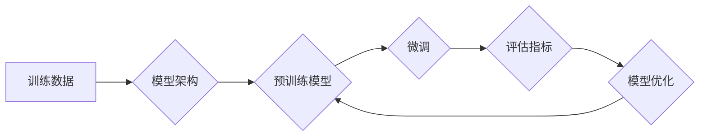

> 大模型、模型开发、微调、模型架构、深度学习、Transformer

## 1. 背景介绍

近年来，深度学习技术取得了飞速发展，大模型的出现更是掀起了人工智能领域的全新浪潮。大模型，是指参数规模庞大、训练数据海量的人工智能模型，其强大的学习能力和泛化能力使其在自然语言处理、计算机视觉、语音识别等领域展现出令人瞩目的应用潜力。

然而，大模型的开发和部署并非易事。其训练成本高昂，硬件资源要求极高，模型规模庞大，部署和推理效率也面临挑战。因此，如何高效地开发和微调大模型，使其能够在实际应用场景中发挥最大价值，成为当前人工智能领域的研究热点。

本篇文章将从零开始，深入探讨大模型的开发与微调过程，涵盖模型设计、核心算法原理、数学模型构建、代码实现、实际应用场景等多个方面，旨在为读者提供一个全面的学习指南。

## 2. 核心概念与联系

大模型的开发与微调涉及到多个核心概念和技术，这些概念相互关联，共同构成了大模型的整体框架。

**2.1 模型架构**

模型架构是决定模型性能的关键因素之一。常见的模型架构包括 Transformer、BERT、GPT 等，这些架构在设计上都充分考虑了深度学习的特性，并针对不同的任务进行了优化。

**2.2 训练数据**

大模型的训练数据是其学习和泛化能力的基础。高质量的训练数据能够帮助模型更好地理解语言、图像、音频等信息，从而提高模型的性能。

**2.3 微调技术**

微调技术是指在预训练模型的基础上，针对特定任务进行进一步的训练。微调能够有效地利用预训练模型的知识，降低训练成本和时间，同时提高模型在特定任务上的性能。

**2.4 评估指标**

评估指标是衡量模型性能的重要标准。常见的评估指标包括准确率、召回率、F1-score、BLEU 等，不同的任务可能需要使用不同的评估指标。

**2.5 硬件资源**

大模型的训练和部署需要大量的计算资源。高性能的GPU和TPU等硬件设备能够显著提高训练速度和推理效率。

**2.6 模型压缩**

模型压缩是指通过各种技术手段，减少模型参数量和模型大小，从而降低模型的存储和部署成本。

**Mermaid 流程图**



## 3. 核心算法原理 & 具体操作步骤

### 3.1  算法原理概述

大模型的训练主要基于深度学习算法，其中最常用的算法是反向传播算法。反向传播算法通过计算模型输出与真实值的误差，并根据误差反向传播，调整模型参数，从而不断优化模型的性能。

### 3.2  算法步骤详解

1. **数据预处理:** 将原始数据进行清洗、格式化、编码等操作，使其能够被模型理解。
2. **模型初始化:** 为模型参数赋予初始值。
3. **正向传播:** 将输入数据通过模型层级传递，最终得到模型输出。
4. **损失函数计算:** 计算模型输出与真实值的误差，即损失函数值。
5. **反向传播:** 根据损失函数值，计算各层参数的梯度。
6. **参数更新:** 使用梯度下降算法等优化算法，更新模型参数。
7. **迭代训练:** 重复步骤3-6，直到模型性能达到预设目标。

### 3.3  算法优缺点

**优点:**

* 能够学习到复杂的非线性关系。
* 具有较强的泛化能力。
* 能够处理海量数据。

**缺点:**

* 训练成本高昂。
* 训练时间长。
* 容易陷入局部最优解。

### 3.4  算法应用领域

* 自然语言处理 (NLP)：文本分类、情感分析、机器翻译、文本生成等。
* 计算机视觉 (CV)：图像识别、目标检测、图像分割等。
* 语音识别 (ASR)：语音转文本、语音合成等。
* 其他领域：推荐系统、医疗诊断、金融预测等。

## 4. 数学模型和公式 & 详细讲解 & 举例说明

### 4.1  数学模型构建

大模型的数学模型通常基于神经网络结构，其中每个神经元都接收来自其他神经元的输入，并通过激活函数进行处理，最终输出到下一层神经元。

**4.1.1  神经网络结构**

神经网络结构通常由输入层、隐藏层和输出层组成。输入层接收原始数据，隐藏层进行特征提取和学习，输出层输出最终结果。

**4.1.2  激活函数**

激活函数是神经网络中一个重要的组成部分，它决定了神经元的输出值。常见的激活函数包括 sigmoid 函数、ReLU 函数、tanh 函数等。

**4.1.3  损失函数**

损失函数用于衡量模型预测结果与真实值的差异。常见的损失函数包括均方误差 (MSE)、交叉熵 (Cross-Entropy) 等。

### 4.2  公式推导过程

**4.2.1  反向传播算法**

反向传播算法的核心思想是通过计算梯度，逐步更新模型参数，从而最小化损失函数值。

**公式:**

```latex
\frac{\partial L}{\partial w} = \frac{\partial L}{\partial y} \cdot \frac{\partial y}{\partial w}
```

其中：

* $L$ 是损失函数值。
* $w$ 是模型参数。
* $y$ 是模型输出。

**4.2.2  梯度下降算法**

梯度下降算法是一种常用的优化算法，它通过沿着梯度方向更新模型参数，从而降低损失函数值。

**公式:**

```latex
w = w - \alpha \cdot \frac{\partial L}{\partial w}
```

其中：

* $\alpha$ 是学习率。

### 4.3  案例分析与讲解

**4.3.1  图像分类任务**

假设我们有一个图像分类任务，目标是将图像分类为不同的类别。我们可以使用卷积神经网络 (CNN) 来解决这个问题。

CNN 的结构包含多个卷积层、池化层和全连接层。卷积层用于提取图像特征，池化层用于降低特征维度，全连接层用于分类。

**4.3.2  文本生成任务**

假设我们有一个文本生成任务，目标是生成一段符合特定风格的文本。我们可以使用 Transformer 模型来解决这个问题。

Transformer 模型的结构包含多个编码器和解码器层。编码器层用于编码输入文本，解码器层用于生成输出文本。

## 5. 项目实践：代码实例和详细解释说明

### 5.1  开发环境搭建

1. 安装 Python 3.x 及相关库 (TensorFlow, PyTorch, NumPy, Pandas 等)。
2. 安装 CUDA 和 cuDNN (如果使用 GPU 训练)。
3. 设置开发环境变量。

### 5.2  源代码详细实现

```python
# 导入必要的库
import tensorflow as tf

# 定义模型架构
model = tf.keras.models.Sequential([
    tf.keras.layers.Embedding(input_dim=vocab_size, output_dim=embedding_dim),
    tf.keras.layers.LSTM(units=hidden_size),
    tf.keras.layers.Dense(units=vocab_size, activation='softmax')
])

# 编译模型
model.compile(optimizer='adam', loss='sparse_categorical_crossentropy', metrics=['accuracy'])

# 训练模型
model.fit(x_train, y_train, epochs=epochs, batch_size=batch_size)

# 保存模型
model.save('my_model.h5')
```

### 5.3  代码解读与分析

* **模型架构:** 代码中定义了一个简单的文本生成模型，包含 Embedding 层、LSTM 层和 Dense 层。
* **Embedding 层:** 将单词映射到低维向量空间。
* **LSTM 层:** 用于处理序列数据，学习文本的上下文信息。
* **Dense 层:** 用于输出预测的下一个单词。
* **编译模型:** 使用 Adam 优化器、交叉熵损失函数和准确率作为评估指标。
* **训练模型:** 使用训练数据训练模型，设置训练轮数和批处理大小。
* **保存模型:** 将训练好的模型保存为 .h5 文件。

### 5.4  运行结果展示

训练完成后，可以使用测试数据评估模型的性能，并可视化模型的训练过程和预测结果。

## 6. 实际应用场景

### 6.1  聊天机器人

大模型可以用于构建智能聊天机器人，能够与用户进行自然流畅的对话。

### 6.2  文本摘要

大模型可以用于自动生成文本摘要，提取文本的关键信息。

### 6.3  机器翻译

大模型可以用于机器翻译，将文本从一种语言翻译成另一种语言。

### 6.4  未来应用展望

大模型的应用场景还在不断扩展，未来将应用于更多领域，例如：

* **个性化推荐:** 根据用户的喜好和行为，推荐个性化的商品、服务和内容。
* **医疗诊断:** 辅助医生进行疾病诊断，提高诊断准确率。
* **科学研究:** 加速科学研究，发现新的知识和规律。

## 7. 工具和资源推荐

### 7.1  学习资源推荐

* **书籍:**
    * 《深度学习》
    * 《自然语言处理》
    * 《机器学习》
* **在线课程:**
    * Coursera
    * edX
    * Udacity

### 7.2  开发工具推荐

* **TensorFlow:** 开源深度学习框架。
* **PyTorch:** 开源深度学习框架。
* **HuggingFace:** 提供预训练模型和工具。

### 7.3  相关论文推荐

* **BERT: Pre-training of Deep Bidirectional Transformers for Language Understanding**
* **GPT-3: Language Models are Few-Shot Learners**
* **Transformer: Attention Is All You Need**

## 8. 总结：未来发展趋势与挑战

### 8.1  研究成果总结

近年来，大模型在各个领域取得了显著的成果，展现出强大的学习能力和应用潜力。

### 8.2  未来发展趋势

* **模型规模进一步扩大:** 随着计算资源的不断发展，大模型的规模将继续扩大，模型能力将进一步提升。
* **模型架构更加复杂:** 研究人员将探索更加复杂的模型架构，例如多模态模型、自监督学习模型等。
* **模型训练效率提升:** 研究人员将致力于开发更加高效的训练算法和硬件设备，降低模型训练成本和时间。

### 8.3  面临的挑战

* **数据获取和标注:** 大模型的训练需要海量高质量的数据，数据获取和标注成本高昂。
* **模型解释性和可解释性:** 大模型的决策过程往往难以理解，缺乏可解释性。
* **模型安全性和可靠性:** 大模型可能存在安全漏洞和偏见问题，需要加强安全性和可靠性方面的研究。

### 8.4  研究展望

未来，大模型研究将继续朝着更加高效、安全、可解释的方向发展，并应用于更多领域，为人类社会带来更多福祉。

## 9. 附录：常见问题与解答

**9.1  如何选择合适的模型架构？**

选择合适的模型架构取决于具体的应用场景和数据特点。

**9.2  如何进行模型训练和评估？**

模型训练和评估需要使用训练数据和测试数据，并选择合适的损失函数和评估指标。

**9.3  如何进行模型微调？**

模型微调是指在预训练模型的基础上，针对特定任务进行进一步的训练。

**9.4  如何解决模型过拟合问题？**

模型过拟合是指模型在训练数据上表现良好，但在测试数据上表现较差。

**9.5  如何提高模型的效率？**

提高模型