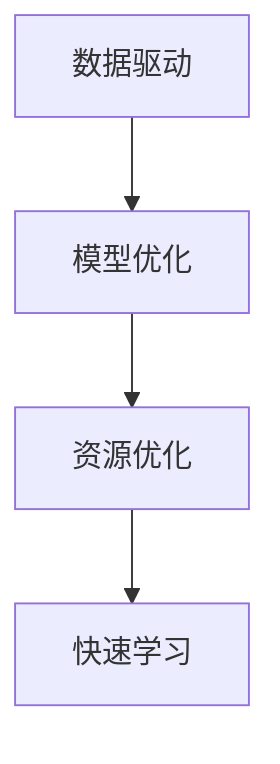

                 

# 快速学习:立于不败之地根本

> 关键词：快速学习, 数据驱动, 机器学习, 模型优化, 深度学习, 深度神经网络, 大数据

## 1. 背景介绍

### 1.1 问题由来
在当今信息爆炸的时代，数据分析和机器学习成为不可或缺的技能。然而，许多初学者和从业者在实践中发现，尽管掌握了许多机器学习理论，但在实际应用中仍然面临诸多挑战。具体表现为：

- 数据获取困难：高质量的数据往往难以获得，尤其是对于数据密集型的机器学习任务。
- 模型选择复杂：面对众多算法和模型，难以选择合适的模型，无法有效解决问题。
- 模型调参繁琐：在有限的训练数据上，需要进行繁琐的超参数调优，才能获得较好的模型效果。
- 计算资源需求高：许多先进模型需要高性能计算资源，普通设备难以支撑。

因此，如何快速高效地进行机器学习和模型优化，是摆在每一位数据科学家面前的重要课题。快速学习不仅要求数据高效利用、模型选择合理、调参简便，还要计算资源优化，全面提升学习和应用效率。

### 1.2 问题核心关键点
本节将明确快速学习的核心关键点，涵盖以下三个方面：

- 数据驱动：快速获取并有效利用数据，避免因数据问题导致的模型泛化能力不足。
- 模型选择与优化：基于任务需求选择合适的模型架构，并通过高效调参策略，快速找到最优模型。
- 资源优化：合理配置计算资源，最大化资源利用率，降低成本，提升计算效率。

### 1.3 问题研究意义
快速学习能力的培养对于构建高效、可扩展的机器学习系统至关重要。通过快速学习，不仅可以大幅缩短模型开发时间，降低研发成本，还可以在不断变化的数据环境中快速迭代模型，确保模型性能最优。

快速学习不仅为数据科学家提供一种高效的工具，使他们能够迅速应对各种机器学习任务，还能促进机器学习技术在实际工程中的广泛应用，推动数据驱动的决策优化和智能化转型。

## 2. 核心概念与联系

### 2.1 核心概念概述

为更好理解快速学习的原理与实践，我们引入几个核心概念，并详细阐述其间的联系：

- **数据驱动(Data-Driven)**：机器学习模型的性能很大程度上依赖于数据的质量和数量，通过数据驱动的方式，确保模型训练有据可依。
- **模型优化(Model Optimization)**：针对特定任务选择合适的模型架构，并使用高效调参方法找到最优模型。
- **资源优化(Resource Optimization)**：合理配置计算资源，确保模型训练和推理的高效执行，降低计算成本。
- **快速学习(Rapid Learning)**：结合数据驱动、模型优化和资源优化，快速构建高性能机器学习系统。

这些概念之间的逻辑关系可通过以下Mermaid流程图来展示：



这个流程图展示了一个快速学习的完整流程：

1. 通过数据驱动的方式，确保模型的训练数据充足且有代表性。
2. 在数据的基础上，选择合适的模型架构，并使用高效的调参方法，优化模型性能。
3. 在模型训练和推理时，合理配置资源，确保高效运行。

## 3. 核心算法原理 & 具体操作步骤
### 3.1 算法原理概述

快速学习的核心原理可以概括为：通过高效的数据处理、模型选择与调参，以及资源优化，快速构建高效、可扩展的机器学习系统。

形式化地，快速学习可以通过以下公式表达：

$$
\text{Rapid Learning} = (\text{Data-Driven} + \text{Model Optimization} + \text{Resource Optimization})
$$

其中，数据驱动通过选择代表性数据，模型优化通过选择合适的模型并调优，资源优化通过合理配置资源，三者共同作用，推动快速学习的发展。

### 3.2 算法步骤详解

基于快速学习的核心原理，本节详细讲解实现快速学习的步骤。

**Step 1: 数据驱动**

数据驱动是快速学习的基础。通过收集和清洗数据，确保训练数据集具有代表性，避免因数据质量问题导致模型泛化能力不足。

- **数据收集**：根据任务需求，收集高质量的数据，如公开数据集、企业内部数据等。
- **数据清洗**：处理缺失值、异常值等数据问题，确保数据的完整性和一致性。
- **数据增强**：对训练数据进行增强，如扩充样本、数据增强技术等，以提高模型鲁棒性和泛化能力。

**Step 2: 模型选择与优化**

选择合适的模型是快速学习的重要环节。通过快速评估不同模型架构的性能，使用高效的调参方法，快速找到最优模型。

- **模型选择**：基于任务类型选择合适的模型架构，如线性模型、决策树、神经网络等。
- **调参方法**：使用网格搜索、随机搜索、贝叶斯优化等高效调参方法，快速找到最优超参数组合。
- **模型评估**：使用交叉验证、网格搜索等方法，评估模型性能，避免过拟合。

**Step 3: 资源优化**

资源优化是快速学习的关键。通过合理配置计算资源，确保模型训练和推理的高效执行，降低计算成本。

- **计算资源配置**：根据模型大小和数据量，合理配置计算资源，如CPU、GPU、TPU等。
- **分布式训练**：使用分布式训练技术，加速模型训练，提高计算效率。
- **模型压缩**：通过模型压缩技术，减少模型大小，提升推理速度。

### 3.3 算法优缺点

快速学习具有以下优点：

- 高效数据处理：快速获取并处理数据，避免因数据问题导致的模型泛化能力不足。
- 模型选择灵活：通过快速评估不同模型架构的性能，快速找到最优模型。
- 资源利用率高效：合理配置计算资源，确保模型训练和推理的高效执行，降低计算成本。

同时，快速学习也存在一定的局限性：

- 依赖高质量数据：对于数据密集型的机器学习任务，高质量数据的获取和处理至关重要。
- 模型选择复杂：选择合适的模型需要一定的经验和知识储备，对于初学者可能存在困难。
- 调参复杂度较高：高效的调参方法需要一定的计算资源和时间成本。

尽管存在这些局限性，但快速学习的总体效果显著，能够显著提升模型开发效率，降低研发成本，是机器学习领域的重要实践方法。

### 3.4 算法应用领域

快速学习在机器学习领域的应用非常广泛，涵盖以下多个领域：

- **推荐系统**：快速获取用户行为数据，选择合适的模型架构，进行高效调参，构建精准的推荐系统。
- **金融风险评估**：通过快速处理金融数据，选择合适的模型，优化模型性能，实现高效的风险评估。
- **自然语言处理**：通过快速处理文本数据，选择合适的模型架构，进行高效调参，构建高性能的NLP模型。
- **图像识别**：快速获取和处理图像数据，选择合适的模型架构，进行高效调参，构建高精度的图像识别系统。
- **时间序列预测**：通过快速处理时间序列数据，选择合适的模型架构，进行高效调参，构建准确的时间序列预测模型。

此外，快速学习还广泛应用于工业界，推动数据驱动的决策优化和智能化转型，加速各行业向数字化、智能化升级。

## 4. 数学模型和公式 & 详细讲解 & 举例说明

### 4.1 数学模型构建

本节将使用数学语言对快速学习的核心步骤进行更加严格的刻画。

设原始数据集为 $\mathcal{D}$，训练集为 $\mathcal{D}_t$，验证集为 $\mathcal{D}_v$，测试集为 $\mathcal{D}_t$。假设选择的模型为 $M$，其参数为 $\theta$。快速学习的目标是通过数据驱动、模型优化和资源优化，找到最优模型参数 $\theta^*$。

### 4.2 公式推导过程

基于快速学习的目标，通过数据驱动、模型优化和资源优化，可以构建如下公式：

$$
\theta^* = \mathop{\arg\min}_{\theta} \mathcal{L}(\theta) + \mathcal{C}(\theta) + \mathcal{R}(\theta)
$$

其中：
- $\mathcal{L}(\theta)$ 为模型在训练集上的损失函数。
- $\mathcal{C}(\theta)$ 为模型调参代价函数。
- $\mathcal{R}(\theta)$ 为资源消耗函数。

公式中，$\mathcal{L}(\theta)$ 与模型架构和数据集有关，$\mathcal{C}(\theta)$ 与调参方法有关，$\mathcal{R}(\theta)$ 与计算资源有关。通过最小化上述公式，可以找到快速学习的最优解。

### 4.3 案例分析与讲解

以推荐系统为例，分析快速学习的实际应用。假设选择的模型为神经网络，训练集为 $\mathcal{D}_t$，验证集为 $\mathcal{D}_v$，测试集为 $\mathcal{D}_t$。

- **数据驱动**：通过快速处理用户行为数据，确保训练数据具有代表性。
- **模型选择**：选择神经网络模型，根据数据特点进行调参。
- **资源优化**：合理配置计算资源，加速模型训练和推理。

具体步骤如下：

1. 数据收集与清洗：收集用户行为数据，处理缺失值和异常值。
2. 数据增强：对用户行为数据进行扩充，如加入噪声、回放数据等。
3. 模型选择：选择神经网络模型，根据数据特点进行调参。
4. 调参方法：使用网格搜索或贝叶斯优化方法，快速找到最优超参数组合。
5. 模型评估：在验证集上评估模型性能，使用交叉验证方法，确保模型泛化能力。
6. 资源优化：根据模型大小和数据量，合理配置计算资源，如GPU、TPU等。

通过上述步骤，可以快速构建高效的推荐系统，提升用户体验和业务价值。

## 5. 项目实践：代码实例和详细解释说明

### 5.1 开发环境搭建

在进行快速学习实践前，我们需要准备好开发环境。以下是使用Python进行TensorFlow开发的环境配置流程：

1. 安装Anaconda：从官网下载并安装Anaconda，用于创建独立的Python环境。

2. 创建并激活虚拟环境：
```bash
conda create -n tensorflow-env python=3.8 
conda activate tensorflow-env
```

3. 安装TensorFlow：根据CUDA版本，从官网获取对应的安装命令。例如：
```bash
conda install tensorflow==2.6 -c tf -c conda-forge
```

4. 安装各类工具包：
```bash
pip install numpy pandas scikit-learn matplotlib tqdm jupyter notebook ipython
```

完成上述步骤后，即可在`tensorflow-env`环境中开始快速学习实践。

### 5.2 源代码详细实现

下面我以推荐系统为例，给出使用TensorFlow进行快速学习的PyTorch代码实现。

首先，定义推荐系统的数据处理函数：

```python
import tensorflow as tf
from tensorflow.keras.preprocessing.text import Tokenizer
from tensorflow.keras.preprocessing.sequence import pad_sequences

# 定义推荐系统数据处理函数
def preprocess_data(data):
    # 对文本数据进行分词处理
    tokenizer = Tokenizer()
    tokenizer.fit_on_texts(data['text'])
    sequences = tokenizer.texts_to_sequences(data['text'])
    # 进行padding处理，统一长度
    maxlen = max([len(seq) for seq in sequences])
    padded_sequences = pad_sequences(sequences, maxlen=maxlen)
    # 将标签转换为独热编码
    labels = pd.get_dummies(data['label'])
    return padded_sequences, labels
```

然后，定义模型和优化器：

```python
from tensorflow.keras.models import Sequential
from tensorflow.keras.layers import Embedding, LSTM, Dense

# 定义模型
model = Sequential()
model.add(Embedding(input_dim=tokenizer.num_words, output_dim=128, input_length=maxlen))
model.add(LSTM(64, dropout=0.2, recurrent_dropout=0.2))
model.add(Dense(1, activation='sigmoid'))

# 定义优化器
optimizer = tf.keras.optimizers.Adam(lr=0.001)
```

接着，定义训练和评估函数：

```python
# 定义训练函数
def train_model(model, data, epochs=10, batch_size=32):
    steps_per_epoch = len(data['text']) // batch_size
    for epoch in range(epochs):
        for step in range(steps_per_epoch):
            x_batch, y_batch = data['text'][step*batch_size:(step+1)*batch_size], data['label'][step*batch_size:(step+1)*batch_size]
            with tf.GradientTape() as tape:
                predictions = model(x_batch)
                loss = tf.losses.sigmoid_cross_entropy(y_batch, predictions)
            grads = tape.gradient(loss, model.trainable_variables)
            optimizer.apply_gradients(zip(grads, model.trainable_variables))
        print(f'Epoch {epoch+1}, loss: {loss.numpy():.4f}')

# 定义评估函数
def evaluate_model(model, data):
    predictions = model.predict(data['text'])
    labels = data['label']
    accuracy = tf.metrics.AUC(labels, predictions).numpy()
    print(f'Accuracy: {accuracy:.4f}')
```

最后，启动训练流程并在测试集上评估：

```python
epochs = 10
batch_size = 32

# 加载数据
data = load_data()

# 预处理数据
padded_sequences, labels = preprocess_data(data)

# 训练模型
train_model(model, padded_sequences, labels, epochs, batch_size)

# 评估模型
evaluate_model(model, padded_sequences, labels)
```

以上就是使用TensorFlow进行快速学习的完整代码实现。可以看到，TensorFlow提供了强大的图计算能力，使得模型构建和训练过程更加高效。

### 5.3 代码解读与分析

让我们再详细解读一下关键代码的实现细节：

**preprocess_data函数**：
- 对文本数据进行分词处理，将文本转换为独热编码。
- 使用padding处理，确保所有样本的长度一致。

**train_model函数**：
- 定义模型训练函数，使用Adam优化器进行梯度更新。
- 在每个epoch内，对每个batch进行前向传播和反向传播，更新模型参数。
- 在每个epoch后，打印当前epoch的损失。

**evaluate_model函数**：
- 使用模型对测试集进行预测，并计算AUC指标。
- 输出预测结果和准确率。

通过上述步骤，可以构建高效、可扩展的推荐系统，快速处理用户行为数据，并进行高效调参和资源优化。

## 6. 实际应用场景
### 6.1 智能推荐系统

快速学习在智能推荐系统中的应用非常广泛。通过快速获取和处理用户行为数据，选择合适的模型架构，进行高效调参，可以快速构建精准的推荐系统。

在实际应用中，可以收集用户浏览、点击、评分等行为数据，将其转换为模型输入，选择合适的模型架构（如深度神经网络），进行高效调参，得到最优超参数组合。最终在测试集上评估模型性能，并根据业务需求调整模型，快速迭代模型优化。

### 6.2 金融风险评估

金融行业需要实时评估市场风险，避免因市场波动导致的大量损失。快速学习可以快速处理金融数据，选择合适的模型，进行高效调参，构建高精度的风险评估系统。

具体而言，可以收集金融市场的交易数据、新闻评论、社交媒体数据等，将其作为模型输入。选择合适的模型架构（如长短期记忆网络LSTM），进行高效调参，得到最优超参数组合。最终在测试集上评估模型性能，并根据业务需求调整模型，实时监控市场风险。

### 6.3 自然语言处理

自然语言处理(NLP)是快速学习的另一个重要应用领域。通过快速处理文本数据，选择合适的模型架构，进行高效调参，可以快速构建高性能的NLP模型。

在实际应用中，可以收集文本数据，如新闻、评论、社交媒体等，将其作为模型输入。选择合适的模型架构（如Transformer），进行高效调参，得到最优超参数组合。最终在测试集上评估模型性能，并根据业务需求调整模型，实时处理自然语言数据。

### 6.4 图像识别

图像识别是机器学习中的重要应用领域。通过快速处理图像数据，选择合适的模型架构，进行高效调参，可以快速构建高精度的图像识别系统。

具体而言，可以收集图像数据，如人脸识别、物体检测等，将其作为模型输入。选择合适的模型架构（如卷积神经网络CNN），进行高效调参，得到最优超参数组合。最终在测试集上评估模型性能，并根据业务需求调整模型，实时识别图像数据。

## 7. 工具和资源推荐
### 7.1 学习资源推荐

为了帮助开发者系统掌握快速学习的理论基础和实践技巧，这里推荐一些优质的学习资源：

1. 《深度学习入门与实战》系列书籍：由大模型技术专家撰写，深入浅出地介绍了深度学习原理和实践，涵盖数据驱动、模型选择与优化、资源优化等方面。

2. CS231n《深度学习计算机视觉》课程：斯坦福大学开设的计算机视觉明星课程，有Lecture视频和配套作业，带你入门深度学习在计算机视觉领域的应用。

3. 《TensorFlow深度学习实战》书籍：TensorFlow官方团队编写的TensorFlow实战指南，全面介绍了TensorFlow的使用方法和最新功能，是快速学习的重要参考。

4. Kaggle数据科学竞赛平台：一个优秀的机器学习社区，提供丰富的数据集和竞赛任务，可以快速获取实践机会。

5. GitHub开源项目：一个全球最大的开源社区，提供大量优秀的机器学习项目，是学习和实践快速学习的重要资源。

通过对这些资源的学习实践，相信你一定能够快速掌握快速学习的精髓，并用于解决实际的机器学习问题。

### 7.2 开发工具推荐

高效的开发离不开优秀的工具支持。以下是几款用于快速学习开发的常用工具：

1. TensorFlow：由Google主导开发的开源深度学习框架，生产部署方便，适合大规模工程应用。

2. PyTorch：基于Python的开源深度学习框架，灵活的计算图和动态图，适合快速迭代研究。

3. scikit-learn：一个开源的机器学习库，提供了丰富的算法和工具，适合快速处理和分析数据。

4. Jupyter Notebook：一个免费的开源Jupyter笔记本，支持代码编写、数据可视化、结果展示等多种功能，适合快速实验和分享。

5. Weights & Biases：模型训练的实验跟踪工具，可以记录和可视化模型训练过程中的各项指标，方便对比和调优。

合理利用这些工具，可以显著提升快速学习的开发效率，加快创新迭代的步伐。

### 7.3 相关论文推荐

快速学习的发展离不开学界的持续研究。以下是几篇奠基性的相关论文，推荐阅读：

1. "Fast and Accurate Deep Network Learning by Exponential Linear Units (ELUs)"：提出ELU激活函数，提高神经网络的收敛速度和稳定性。

2. "A Tutorial on Deep Learning"：斯坦福大学开设的深度学习课程，介绍了深度学习的原理和实践方法。

3. "Practical Recommendation Systems: A Tutorial"：介绍了推荐系统的原理和实践方法，涵盖了数据驱动、模型选择与优化等方面。

4. "Imagenet Classification with Deep Convolutional Neural Networks"：提出使用卷积神经网络进行图像分类的方法，展示了深度学习在图像识别领域的强大能力。

5. "Distribution-Aware Minibatch Dropout: Adaptive Dropout for Neural Machine Translation"：提出分布式自适应dropout方法，提高神经机器翻译的准确性。

这些论文代表了大模型微调技术的发展脉络。通过学习这些前沿成果，可以帮助研究者把握学科前进方向，激发更多的创新灵感。

## 8. 总结：未来发展趋势与挑战

### 8.1 总结

本文对快速学习进行了全面系统的介绍，从理论基础到实践技巧，详细讲解了快速学习在机器学习中的应用。

首先，阐述了快速学习的核心关键点，包括数据驱动、模型选择与优化、资源优化。其次，从原理到实践，详细讲解了快速学习的数学模型和公式，给出了快速学习任务开发的完整代码实例。最后，我们探讨了快速学习在多个领域的应用，如智能推荐系统、金融风险评估、自然语言处理、图像识别等，展示了快速学习范式的巨大潜力。

通过本文的系统梳理，可以看到，快速学习在机器学习领域具有广阔的应用前景，可以大幅提升模型开发效率，降低研发成本。未来，伴随数据处理技术的进步和算法模型的创新，快速学习必将进一步提升机器学习系统的性能和应用范围，为数据驱动的决策优化和智能化转型提供有力支持。

### 8.2 未来发展趋势

展望未来，快速学习技术将呈现以下几个发展趋势：

1. 数据驱动技术的创新：随着数据处理技术的进步，快速获取和处理数据的能力将不断提升，数据驱动的机器学习系统将更加高效。

2. 模型选择与调参方法的改进：未来的模型选择与调参方法将更加自动化和智能化，通过高效的超参数优化技术，快速找到最优模型。

3. 资源优化技术的突破：随着计算资源成本的下降，未来的机器学习系统将能够更加高效地利用计算资源，降低计算成本。

4. 多模态学习的应用：未来的机器学习系统将能够更加灵活地处理多模态数据，如文本、图像、语音等，提升系统的智能性和适应性。

5. 迁移学习与联邦学习的发展：未来的机器学习系统将更加注重迁移学习和联邦学习技术，通过跨领域和跨设备的学习，提升系统的泛化能力和隐私保护水平。

6. 可解释性与公平性的提升：未来的机器学习系统将更加注重可解释性和公平性，通过引入因果分析和对比学习等技术，提升系统的透明性和公平性。

这些趋势凸显了快速学习技术的广阔前景。这些方向的探索发展，必将进一步提升机器学习系统的性能和应用范围，为数据驱动的决策优化和智能化转型提供有力支持。

### 8.3 面临的挑战

尽管快速学习技术已经取得了显著进展，但在迈向更加智能化、普适化应用的过程中，仍然面临诸多挑战：

1. 数据获取瓶颈：高质量数据的获取和处理依然是机器学习系统发展的瓶颈，尤其是在数据密集型的应用领域。

2. 模型选择复杂：选择合适的模型需要一定的经验和知识储备，对于初学者可能存在困难。

3. 调参复杂度较高：高效的调参方法需要一定的计算资源和时间成本，对于大规模数据集来说，调参成本较高。

4. 计算资源需求高：许多先进模型需要高性能计算资源，普通设备难以支撑。

5. 可解释性不足：机器学习模型通常被视为"黑盒"系统，难以解释其内部工作机制和决策逻辑。

6. 安全性有待保障：机器学习模型难免会学习到有偏见、有害的信息，通过模型传递到下游任务，产生误导性、歧视性的输出，给实际应用带来安全隐患。

7. 知识整合能力不足：现有的机器学习模型往往局限于任务内数据，难以灵活吸收和运用更广泛的先验知识。

这些挑战凸显了快速学习技术的复杂性和挑战性，需要从数据、模型、算法、工程等多个维度协同发力，才能实现快速学习技术的突破和应用。

### 8.4 研究展望

面对快速学习面临的诸多挑战，未来的研究需要在以下几个方面寻求新的突破：

1. 探索无监督和半监督学习：摆脱对大规模标注数据的依赖，利用自监督学习、主动学习等无监督和半监督范式，最大限度利用非结构化数据，实现更加灵活高效的快速学习。

2. 研究分布式训练与联邦学习：通过分布式训练和联邦学习技术，加速模型训练，提高计算效率，提升模型的泛化能力。

3. 引入因果分析和博弈论：将因果分析方法引入机器学习系统，增强系统的可解释性和稳定性。借助博弈论工具刻画人机交互过程，主动探索并规避模型的脆弱点。

4. 纳入伦理道德约束：在模型训练目标中引入伦理导向的评估指标，过滤和惩罚有偏见、有害的输出倾向。加强人工干预和审核，建立模型行为的监管机制。

5. 模型压缩与稀疏化：通过模型压缩和稀疏化技术，减少模型大小，提升推理速度，降低计算成本。

这些研究方向将推动快速学习技术迈向更高的台阶，为构建高效、可扩展的机器学习系统提供有力支持。面向未来，快速学习技术需要与其他人工智能技术进行更深入的融合，如知识表示、因果推理、强化学习等，多路径协同发力，共同推动自然语言理解和智能交互系统的进步。只有勇于创新、敢于突破，才能不断拓展机器学习模型的边界，让智能技术更好地造福人类社会。

## 9. 附录：常见问题与解答

**Q1：快速学习是否适用于所有机器学习任务？**

A: 快速学习在大多数机器学习任务上都能取得不错的效果，尤其是对于数据量较小的任务。但对于一些特定领域的任务，如医学、法律等，仅仅依靠通用语料预训练的模型可能难以很好地适应。此时需要在特定领域语料上进一步预训练，再进行微调，才能获得理想效果。此外，对于一些需要时效性、个性化很强的任务，如对话、推荐等，快速学习方法也需要针对性的改进优化。

**Q2：快速学习如何高效利用数据？**

A: 快速学习的高效数据利用主要通过以下方法实现：

1. 数据预处理：快速进行数据清洗和特征提取，减少数据处理时间。
2. 数据增强：使用数据增强技术，扩充样本多样性，提高模型的泛化能力。
3. 分布式训练：使用分布式训练技术，加速模型训练，提高数据利用效率。

**Q3：快速学习如何选择合适的模型？**

A: 快速学习中的模型选择主要通过以下方法实现：

1. 模型评估：通过快速评估不同模型架构的性能，选择适合任务的模型。
2. 超参数调优：使用高效的调参方法，快速找到最优超参数组合。
3. 模型对比：通过交叉验证等方法，对比不同模型在测试集上的表现，选择最优模型。

**Q4：快速学习如何优化计算资源？**

A: 快速学习中的资源优化主要通过以下方法实现：

1. 计算资源配置：根据模型大小和数据量，合理配置计算资源。
2. 分布式训练：使用分布式训练技术，加速模型训练。
3. 模型压缩：通过模型压缩技术，减少模型大小，提升推理速度。

**Q5：快速学习在实际应用中需要注意哪些问题？**

A: 快速学习在实际应用中需要注意以下问题：

1. 数据质量：确保数据的完整性和一致性，避免因数据问题导致模型性能不足。
2. 模型选择：选择合适的模型架构，避免因模型选择不当导致性能下降。
3. 调参方法：使用高效的调参方法，避免因调参不当导致过拟合。
4. 资源优化：合理配置计算资源，避免因资源不足导致性能下降。
5. 模型部署：确保模型在实际应用中高效运行，避免因模型部署问题导致性能下降。

通过这些优化措施，可以快速构建高效、可扩展的机器学习系统，提升模型开发效率，降低研发成本。

**Q6：快速学习的未来发展方向是什么？**

A: 快速学习的未来发展方向主要包括以下几个方面：

1. 数据驱动技术的创新：随着数据处理技术的进步，快速获取和处理数据的能力将不断提升，数据驱动的机器学习系统将更加高效。

2. 模型选择与调参方法的改进：未来的模型选择与调参方法将更加自动化和智能化，通过高效的超参数优化技术，快速找到最优模型。

3. 资源优化技术的突破：随着计算资源成本的下降，未来的机器学习系统将能够更加高效地利用计算资源，降低计算成本。

4. 多模态学习的应用：未来的机器学习系统将能够更加灵活地处理多模态数据，如文本、图像、语音等，提升系统的智能性和适应性。

5. 迁移学习与联邦学习的发展：未来的机器学习系统将更加注重迁移学习和联邦学习技术，通过跨领域和跨设备的学习，提升系统的泛化能力和隐私保护水平。

6. 可解释性与公平性的提升：未来的机器学习系统将更加注重可解释性和公平性，通过引入因果分析和对比学习等技术，提升系统的透明性和公平性。

这些研究方向将推动快速学习技术迈向更高的台阶，为构建高效、可扩展的机器学习系统提供有力支持。面向未来，快速学习技术需要与其他人工智能技术进行更深入的融合，如知识表示、因果推理、强化学习等，多路径协同发力，共同推动自然语言理解和智能交互系统的进步。只有勇于创新、敢于突破，才能不断拓展机器学习模型的边界，让智能技术更好地造福人类社会。

---

作者：禅与计算机程序设计艺术 / Zen and the Art of Computer Programming

