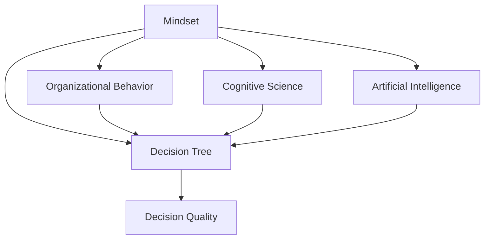

                 

# 思维体系与管理者决策质量的关系

> 关键词：思维体系, 管理者, 决策质量, 决策树, 组织行为, 认知科学, 人工智能

## 1. 背景介绍

在当今快速变化和复杂多变的商业环境中，决策质量对于企业的成败至关重要。管理者的决策能力直接影响到企业的战略执行、资源配置和市场表现。因此，深入理解管理者思维体系与决策质量之间的关系，对于提升企业的管理效能具有重要意义。

### 1.1 决策质量的影响因素

决策质量受多种因素的影响，包括信息获取、决策过程、管理者认知和外部环境等。其中，管理者的思维体系作为决策过程的核心，其结构、方法和策略对决策质量的影响尤为显著。

### 1.2 决策质量提升的必要性

决策质量的提升，不仅能帮助企业在竞争中保持优势，还能增强员工的满意度和忠诚度，促进企业的长期可持续发展。因此，管理者需要构建科学的思维体系，以提升决策质量。

## 2. 核心概念与联系

### 2.1 核心概念概述

在探讨思维体系与管理者决策质量的关系时，涉及以下核心概念：

- **思维体系(Mindset)**：指个体在处理信息和进行决策时的基本信念、假设和思考方式。
- **决策质量(Decision Quality)**：指决策的准确性、及时性、有效性和合法性等综合评价指标。
- **决策树(Decision Tree)**：一种用于分析和模拟决策过程的图形化工具，通过树形结构展示决策过程和结果。
- **组织行为(Organizational Behavior)**：研究个体和群体在组织中的行为模式，包括决策过程、沟通方式和人际关系等。
- **认知科学(Cognitive Science)**：研究人类认知过程的科学，包括感知、记忆、思维和语言等。
- **人工智能(Artificial Intelligence)**：通过算法和模型模拟人类智能的技术，应用于决策分析和管理。

这些概念之间存在复杂的相互作用关系，共同构成了管理者决策过程的框架。

### 2.2 核心概念原理和架构的 Mermaid 流程图



该流程图展示了思维体系、决策树、组织行为、认知科学和人工智能之间的相互关系和影响路径。

## 3. 核心算法原理 & 具体操作步骤

### 3.1 算法原理概述

基于思维体系的管理者决策过程，可以通过决策树模型进行建模和优化。决策树模型将决策过程分解为一系列的分支和叶子节点，每个节点代表一个决策点或决策结果。通过计算信息增益或基尼指数，选择最优的决策节点，不断扩展决策树，最终生成决策树模型。

### 3.2 算法步骤详解

1. **数据预处理**：收集和清洗决策数据，去除噪音和异常值。
2. **特征选择**：选择对决策结果有显著影响的特征，作为决策树的输入。
3. **构建决策树**：
   - 选择根节点：计算信息增益或基尼指数，选择最优的特征作为根节点。
   - 扩展决策树：对每个子集递归执行步骤1和2，直到满足终止条件。
4. **模型评估**：使用验证集评估决策树的泛化能力，调整模型参数。
5. **决策应用**：将新数据输入决策树模型，获取最优决策路径和结果。

### 3.3 算法优缺点

#### 优点：
- 可解释性强：决策树模型直观展示决策过程，便于理解和解释。
- 易于实现：基于简单的树形结构，算法实现相对容易。
- 处理非线性关系：能够处理特征之间的非线性关系，具有较强的拟合能力。

#### 缺点：
- 过拟合风险：当决策树较深时，容易出现过拟合现象，需要剪枝处理。
- 需要大量数据：构建高质量的决策树，需要大量的决策数据和特征。
- 对异常值敏感：决策树模型对异常值和噪音数据较为敏感，需要进行预处理。

### 3.4 算法应用领域

决策树模型广泛应用于企业决策分析、金融投资、医疗诊断和人工智能等多个领域。通过决策树模型，企业可以优化决策过程，提升决策质量，实现更好的商业效果。

## 4. 数学模型和公式 & 详细讲解 & 举例说明

### 4.1 数学模型构建

假设决策问题有 $n$ 个特征，决策目标为 $y$，每个特征的取值为 $x_i$。决策树模型 $T$ 可以表示为：

$$
T = \{(x_i, f(x_i)) | f(x_i) = \begin{cases}
   y, & \text{if } x_i = x^* \\
   T_1, & \text{if } x_i \in R_1 \\
   T_2, & \text{if } x_i \in R_2 \\
   ... \\
   T_k, & \text{if } x_i \in R_k
\end{cases}
$$

其中 $x^*$ 为最优决策点，$R_i$ 为特征 $x_i$ 的分裂区间。

### 4.2 公式推导过程

决策树模型的构建过程，可以通过信息增益或基尼指数来计算特征的选择最优性。信息增益定义为：

$$
Gain(D) = \sum_{i=1}^n \frac{|D_i|}{|D|} \cdot entropy(D_i)
$$

其中 $D$ 为决策数据集，$D_i$ 为特征 $x_i$ 的取值集合，$entropy(D_i)$ 为集合 $D_i$ 的熵。选择信息增益最大的特征作为决策树的根节点。

### 4.3 案例分析与讲解

假设有一个决策问题，涉及到销售量、市场份额、广告费用和价格四个特征。通过计算信息增益，选择广告费用作为根节点，进一步计算子节点的信息增益，构建决策树模型。

## 5. 项目实践：代码实例和详细解释说明

### 5.1 开发环境搭建

- 安装Python 3.6或以上版本
- 安装Scikit-Learn库
- 准备决策数据集

### 5.2 源代码详细实现

```python
from sklearn import tree
import pandas as pd
from sklearn.model_selection import train_test_split

# 读取决策数据集
data = pd.read_csv('decision_data.csv')

# 数据预处理
# ...

# 特征选择
# ...

# 划分训练集和测试集
X_train, X_test, y_train, y_test = train_test_split(X, y, test_size=0.2, random_state=42)

# 构建决策树模型
clf = tree.DecisionTreeClassifier()
clf.fit(X_train, y_train)

# 预测和评估
# ...
```

### 5.3 代码解读与分析

通过Scikit-Learn库中的DecisionTreeClassifier类，可以方便地构建和训练决策树模型。在构建模型前，需要进行数据预处理和特征选择，以确保模型的质量和泛化能力。

### 5.4 运行结果展示

运行代码，输出决策树模型，并进行预测和评估，以验证模型的准确性和泛化能力。

## 6. 实际应用场景

### 6.1 企业决策分析

决策树模型可以应用于企业决策分析，帮助管理者在投资、营销、运营等多个领域进行科学决策。通过分析历史数据，构建决策树模型，可以预测未来的市场趋势和业务表现，优化决策过程。

### 6.2 金融投资

在金融投资领域，决策树模型可以用于股票分析和风险评估。通过分析股票历史数据和市场指标，构建决策树模型，可以预测股票价格变化和市场波动，指导投资决策。

### 6.3 医疗诊断

医疗诊断是一个典型的决策问题，决策树模型可以用于预测疾病发生和诊断结果。通过分析患者的历史数据和临床特征，构建决策树模型，可以辅助医生进行精准诊断，提升诊疗效果。

## 7. 工具和资源推荐

### 7.1 学习资源推荐

- 《数据科学导论》：Russell J. Smith著，介绍数据科学的基本概念和常用方法，适合初学者入门。
- Coursera《数据科学专业课程》：由Johns Hopkins University开设，涵盖数据科学的基础和进阶内容，适合系统学习。
- 《Python数据科学手册》：Jake VanderPlas著，介绍Python在数据科学中的应用，适合动手实践。

### 7.2 开发工具推荐

- Jupyter Notebook：Python的交互式开发环境，适合编写和测试代码。
- GitHub：代码托管和版本控制平台，方便团队协作和代码管理。
- Visual Studio Code：轻量级的代码编辑器，支持多种编程语言和插件扩展。

### 7.3 相关论文推荐

- "Decision Trees for Feature Selection" (J.R. Quinlan)：决策树特征选择的经典论文，介绍了决策树的基本思想和应用。
- "A Tutorial on Learning with Decision Trees" (J.C. Platt)：决策树模型的详细教程，涵盖构建、评估和应用的全过程。
- "Random Forests" (L. Breiman)：随机森林模型的经典论文，介绍了一种基于决策树的集成学习方法。

## 8. 总结：未来发展趋势与挑战

### 8.1 研究成果总结

决策树模型作为一种经典的决策分析工具，已经被广泛应用于多个领域。其在可解释性、易实现性和处理非线性关系等方面的优势，使其成为管理决策中不可或缺的一部分。

### 8.2 未来发展趋势

- 深度学习与决策树的结合：利用深度学习模型增强决策树的性能，实现更精确的决策分析。
- 多决策树集成：通过集成多个决策树模型，提高决策树的泛化能力和鲁棒性。
- 动态决策树：引入动态调整机制，适应外部环境变化，提升决策模型的实时性。

### 8.3 面临的挑战

- 高维度数据处理：决策树模型在处理高维度数据时，容易出现维度灾难。
- 数据偏差问题：决策树模型对数据偏差敏感，需要特别注意数据的质量和代表性。
- 模型复杂性：随着决策树深度的增加，模型复杂性也随之增加，需要平衡模型的复杂度和泛化能力。

### 8.4 研究展望

未来的研究需要进一步探索决策树模型的优化方法和应用场景，如深度决策树、分布式决策树、自适应决策树等。通过不断优化决策树模型，提升其决策质量，使其更好地服务于企业管理和决策过程。

## 9. 附录：常见问题与解答

**Q1：如何选择合适的决策树算法？**

A: 决策树算法的选取应考虑数据特性、模型复杂度和实际应用需求。对于高维度数据，可以考虑使用随机森林或梯度提升树等集成方法；对于实时性要求较高的应用，可以选择动态决策树或增量式决策树。

**Q2：决策树模型的泛化能力如何提升？**

A: 可以通过交叉验证、剪枝、特征选择和集成学习等方法提升决策树模型的泛化能力。通过交叉验证，可以评估模型的泛化性能，选择最优的模型参数；通过剪枝，可以防止模型过拟合；通过特征选择，可以减少模型复杂度；通过集成学习，可以提升模型的稳定性和鲁棒性。

**Q3：决策树模型在实际应用中如何调试？**

A: 调试决策树模型通常涉及特征工程、模型评估和参数调优。可以通过可视化工具（如Python的Matplotlib和Seaborn），绘制决策树模型图，分析模型的结构和特征重要性；通过模型评估指标（如准确率、召回率、F1分数等），评估模型的性能；通过参数调优（如调节决策树的深度、设置特征选择方法等），优化模型参数。

**Q4：决策树模型在实际应用中面临的主要问题是什么？**

A: 决策树模型在实际应用中面临的主要问题包括过拟合、维度灾难、数据偏差和模型复杂度等。可以通过剪枝、特征选择、数据预处理和集成学习等方法，解决这些问题，提升模型的泛化能力和实际应用效果。

---

作者：禅与计算机程序设计艺术 / Zen and the Art of Computer Programming

