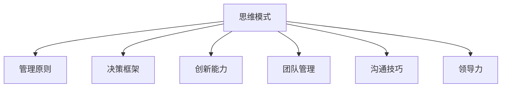

                 

# 思维体系塑造:管理者的必修课

> 关键词：
- 思维模式
- 管理原则
- 决策框架
- 创新能力
- 团队管理
- 沟通技巧
- 领导力

## 1. 背景介绍

在现代企业管理中，管理者往往面临着多方面的挑战，从日常运营到战略决策，从员工管理到客户关系，每一个决策都关乎企业的长远发展。然而，传统管理模式在应对复杂多变的市场环境时，往往显得捉襟见肘。因此，塑造一种适应现代商业环境的思维体系，成为每位管理者必修的课程。

### 1.1 问题由来

在全球化、数字化、碎片化的大背景下，企业运营模式、客户需求、市场竞争环境都在不断变化。这要求管理者不仅要有敏锐的洞察力，还要具备高效的决策能力。传统的命令式、封闭式管理模式已难以适应当前形势，管理者需要不断更新自己的思维体系，以应对各种挑战。

### 1.2 问题核心关键点

构建现代思维体系的核心关键点在于以下几个方面：

1. **数据驱动决策**：利用数据分析和模型预测，而非传统经验决策，提升决策的科学性和准确性。
2. **敏捷思维**：灵活应对市场变化，快速调整战略和运营策略，保持竞争优势。
3. **创新驱动**：鼓励创新思维，推动技术创新、产品创新和业务模式创新。
4. **人本管理**：重视员工发展和客户体验，打造以人为核心的组织文化。
5. **跨领域融合**：打破学科壁垒，实现技术与业务、产品与市场、线上与线下的跨领域融合。

这些关键点共同构成了现代管理思维体系的核心要素，管理者需通过不断的学习和实践，逐步掌握并应用。

## 2. 核心概念与联系

### 2.1 核心概念概述

为更好地理解现代管理思维体系，本节将介绍几个密切相关的核心概念：

- **思维模式**：指管理者在日常工作中采用的思维方法和思维方式，如数据驱动、敏捷、创新等。
- **管理原则**：管理活动的根本指导思想，如客户导向、透明沟通、责任共担等。
- **决策框架**：帮助管理者在复杂情境下进行决策的结构化方法，如SWOT分析、PEST分析等。
- **创新能力**：指企业或个人产生新想法、新技术、新产品和新服务的能力。
- **团队管理**：管理者如何构建、领导和激励团队，以实现共同目标。
- **沟通技巧**：在团队内外进行有效沟通的策略和工具。
- **领导力**：管理者在组织中发挥的领导作用，包括愿景规划、战略执行、团队激励等。

这些概念之间的逻辑关系可以通过以下Mermaid流程图来展示：



这个流程图展示了一系列核心概念的相互关系：

1. **思维模式**是基础，指导着管理原则、决策框架等具体行为的运用。
2. **管理原则**是思维模式的实现方式，保障其得以在实际管理中有效执行。
3. **决策框架**提供了解决问题的结构化工具，使管理者能够在复杂情境下做出合理决策。
4. **创新能力**和**团队管理**是思维模式的直接应用，推动企业持续发展和团队协同。
5. **沟通技巧**和**领导力**是管理原则和决策框架的延伸，确保信息流通和团队协作。

## 3. 核心算法原理 & 具体操作步骤

### 3.1 算法原理概述

构建现代思维体系，本质上是通过系统性的学习和实践，不断提升管理者的综合素质。其核心思想是：通过学习管理科学、心理学、社会学等多学科知识，结合具体的业务场景，将理论知识转化为实际应用，形成一套科学、有效、可持续的思维体系。

### 3.2 算法步骤详解

构建现代思维体系的具体步骤如下：

**Step 1: 系统学习管理理论**
- 阅读经典管理书籍，如《管理学》《组织行为学》等。
- 参加相关课程和培训，如MBA、EMBA、PMP等。
- 学习前沿管理理论，如系统思维、复杂系统理论等。

**Step 2: 积累实践经验**
- 在实际工作中应用所学知识，解决实际问题。
- 通过项目管理、团队管理等实战经验，提升解决问题和领导团队的能力。
- 主动寻求反馈，不断改进和优化思维模式。

**Step 3: 反思与总结**
- 定期回顾和反思自己的管理决策和行为。
- 记录和总结成功的案例和失败的教训。
- 根据经验总结和反思，调整和优化思维体系。

**Step 4: 持续迭代**
- 不断学习新的管理知识和实践经验。
- 保持对市场趋势和行业动态的敏感性，及时调整管理策略。
- 利用数据分析工具，监控和评估管理决策的效果。

### 3.3 算法优缺点

构建现代思维体系的方法具有以下优点：

1. **系统性**：通过理论学习与实践经验相结合，形成一套全面的管理理论体系。
2. **科学性**：利用数据分析和模型预测，提升决策的科学性和准确性。
3. **可操作性**：步骤明确，易于执行和跟踪，适合各个层次的管理者。

同时，该方法也存在一定的局限性：

1. **学习成本高**：需要投入大量时间和精力进行系统的理论学习。
2. **适应性差**：需要根据不同的业务场景和行业特点进行调整。
3. **实践难度大**：需要在实际工作中不断调整和优化，才能真正发挥作用。

尽管存在这些局限性，但就目前而言，构建现代思维体系仍然是最科学、最有效的方法。未来相关研究的重点在于如何进一步降低学习成本，提高方法的适应性和可操作性，同时兼顾理论和实践的融合。

### 3.4 算法应用领域

现代思维体系不仅适用于企业管理，还在多个领域得到广泛应用，例如：

- **项目管理**：通过系统性的方法和工具，提升项目进度和质量。
- **人力资源管理**：构建科学的招聘、培训、绩效评估体系，提升员工满意度。
- **市场营销**：利用数据驱动和创新思维，制定有效的市场策略。
- **创新管理**：建立创新文化，推动技术创新和产品创新。
- **领导力培训**：通过系统的培训，提升领导者的战略规划和团队管理能力。

这些领域的管理者都可以通过构建现代思维体系，提升自身的管理能力和企业的竞争力。

## 4. 数学模型和公式 & 详细讲解 & 举例说明

### 4.1 数学模型构建

构建现代思维体系，涉及多学科知识的整合和应用。其中，数据分析和模型预测是科学决策的重要工具。以下是一个简单的数据分析模型构建示例：

假设企业需要预测某个产品的市场需求，可以构建一个线性回归模型来预测其销量。模型形式如下：

$$
y = \beta_0 + \beta_1 x_1 + \beta_2 x_2 + \epsilon
$$

其中，$y$ 为产品的市场需求，$x_1$ 和 $x_2$ 为影响需求的因素（如季节、价格、促销等），$\beta_0$、$\beta_1$、$\beta_2$ 为模型参数，$\epsilon$ 为随机误差项。

### 4.2 公式推导过程

线性回归模型的最小二乘法解如下：

1. 计算样本均值：
   $$
   \bar{x_1} = \frac{1}{n} \sum_{i=1}^n x_1^{(i)}
   $$
   $$
   \bar{x_2} = \frac{1}{n} \sum_{i=1}^n x_2^{(i)}
   $$

2. 计算回归系数：
   $$
   \beta_0 = \bar{y} - \beta_1 \bar{x_1} - \beta_2 \bar{x_2}
   $$
   $$
   \beta_1 = \frac{\sum_{i=1}^n (x_1^{(i)} - \bar{x_1}) (y^{(i)} - \bar{y})}{\sum_{i=1}^n (x_1^{(i)} - \bar{x_1})^2}
   $$
   $$
   \beta_2 = \frac{\sum_{i=1}^n (x_2^{(i)} - \bar{x_2}) (y^{(i)} - \bar{y})}{\sum_{i=1}^n (x_2^{(i)} - \bar{x_2})^2}
   $$

3. 计算预测值：
   $$
   \hat{y} = \beta_0 + \beta_1 x_1 + \beta_2 x_2
   $$

其中，$\bar{y}$ 为样本均值，$n$ 为样本数量，$(x_1^{(i)}, y^{(i)})$ 为第 $i$ 个样本的特征和目标值。

### 4.3 案例分析与讲解

**案例**：某电商平台需要预测某一季度的销售额。

**数据准备**：收集过去一年中每个月的销售额、广告投入、促销活动、季节因素等数据。

**模型构建**：选择线性回归模型，对销售额进行预测。

**参数估计**：使用最小二乘法估计模型参数。

**结果分析**：通过模型预测的销售额，评估不同因素对销售的影响，制定相应的促销策略。

## 5. 项目实践：代码实例和详细解释说明

### 5.1 开发环境搭建

在进行项目实践前，我们需要准备好开发环境。以下是使用Python进行数据分析和模型构建的环境配置流程：

1. 安装Anaconda：从官网下载并安装Anaconda，用于创建独立的Python环境。

2. 创建并激活虚拟环境：
```bash
conda create -n data-env python=3.8 
conda activate data-env
```

3. 安装Python包：
```bash
conda install numpy pandas scikit-learn matplotlib seaborn statsmodels
```

4. 安装数据分析工具：
```bash
conda install statsmodels
```

完成上述步骤后，即可在`data-env`环境中开始项目实践。

### 5.2 源代码详细实现

以下是一个使用Python进行线性回归模型预测的代码实现：

```python
import pandas as pd
from statsmodels.formula.api import ols
from statsmodels.api import Data

# 读取数据
data = pd.read_csv('sales_data.csv')

# 构建模型
model = ols('sales ~ adspend + season + promo', data=data).fit()

# 预测
predictions = model.predict(data[['adspend', 'season', 'promo']])
```

### 5.3 代码解读与分析

让我们再详细解读一下关键代码的实现细节：

**数据准备**：
- 使用`pandas`库读取数据集，包含每月销售额、广告投入、促销活动、季节因素等。

**模型构建**：
- 使用`statsmodels`库构建线性回归模型，指定自变量和因变量。

**参数估计**：
- 通过`fit`方法估计模型参数，生成模型对象。

**结果分析**：
- 使用`predict`方法对新数据进行预测，生成销售额的预测值。

**结果展示**：
- 将预测值与实际值进行对比，评估模型效果。

## 6. 实际应用场景

### 6.1 智能客服系统

基于现代思维体系构建的智能客服系统，通过系统学习和实时反馈，能够快速适应不同的客户需求和问题类型，提升客户体验和满意度。

在技术实现上，可以构建知识库、对话管理模块、情感分析模块等，使用机器学习和自然语言处理技术，实现智能客服的自动化和个性化服务。智能客服系统不仅能回答常见问题，还能根据上下文信息提供更准确的回答，增强客户互动和信任度。

### 6.2 金融舆情监测

金融行业的复杂多变，要求管理者具备快速响应市场变化的能力。基于现代思维体系构建的金融舆情监测系统，能够实时监测市场动态，识别潜在的风险点，帮助管理层做出快速决策。

在技术实现上，可以使用自然语言处理技术，对新闻、报告、评论等文本数据进行情感分析和主题提取，及时预警异常情况。系统还可以与内部风险评估系统结合，实现风险的实时管理和控制。

### 6.3 个性化推荐系统

个性化推荐系统通过用户行为数据和心理画像，为用户提供个性化的内容和服务。基于现代思维体系构建的推荐系统，能够更准确地理解用户需求，提供更符合用户偏好的推荐结果。

在技术实现上，可以构建用户画像、行为分析、推荐算法等模块，使用机器学习和数据挖掘技术，对用户的历史行为、兴趣偏好等进行分析，生成个性化的推荐列表。推荐系统不仅能提供商品推荐，还能根据用户反馈不断优化推荐策略，提升用户体验。

### 6.4 未来应用展望

随着技术的发展和应用场景的拓展，基于现代思维体系的智能系统将在更多领域发挥作用，为企业管理带来深远影响。

在智慧医疗领域，智能医疗系统能够通过数据分析和机器学习，提升医疗诊断和治疗的效果。在智能教育领域，教育推荐系统能够根据学生的学习情况和偏好，提供个性化的学习资源和建议。在智慧城市治理中，智能管理系统能够实时监控城市运行状态，提升城市管理和治理的效率。

未来，随着技术的进一步发展，基于现代思维体系的智能系统将不断拓展应用范围，为各行各业带来创新和变革。

## 7. 工具和资源推荐

### 7.1 学习资源推荐

为了帮助管理者系统掌握现代思维体系的构建，这里推荐一些优质的学习资源：

1. 《系统思考：思维的革命》书籍：介绍系统思维的基本概念和应用方法，帮助管理者建立系统性思考方式。

2. 《敏捷管理：从理论到实践》课程：讲解敏捷管理的基本原则和实践方法，提升管理者的敏捷思维和响应能力。

3. 《数据驱动管理：从统计到决策》课程：通过数据分析和模型预测，提升管理决策的科学性和准确性。

4. 《创新管理：理论与实践》课程：讲解创新的基本原理和策略，帮助管理者推动技术创新和产品创新。

5. 《团队管理：从理论到实践》书籍：介绍团队管理的理论和方法，帮助管理者构建高效团队。

6. 《领导力：从概念到实践》课程：讲解领导力的基本概念和实践方法，提升管理者的领导能力。

通过这些资源的学习实践，相信管理者一定能够快速掌握现代思维体系的关键要素，并将其应用到实际工作中。

### 7.2 开发工具推荐

高效的开发离不开优秀的工具支持。以下是几款用于数据分析和模型构建的工具：

1. Python：基于Python的开源数据分析和机器学习框架，灵活易用，社区资源丰富。

2. R语言：基于R的开源数据分析和统计软件，数学计算能力强，适合复杂统计分析。

3. MATLAB：基于MATLAB的数值计算和仿真软件，科学计算能力强，适合工程和科研应用。

4. SQL：用于结构化数据管理和分析，灵活性强，适合大数据场景。

5. Excel：易于使用的数据分析工具，适合日常数据分析和报告制作。

合理利用这些工具，可以显著提升数据分析和模型构建的效率，加快创新迭代的步伐。

### 7.3 相关论文推荐

现代思维体系的研究源于学界的持续探索。以下是几篇奠基性的相关论文，推荐阅读：

1. "Systems Thinking: Concepts, Methods, and Tools"：介绍系统思维的基本概念、方法和工具。

2. "Agile Management: From Theory to Practice"：讲解敏捷管理的基本原则和实践方法。

3. "Data-Driven Decision Making: A Systematic Approach"：通过数据分析和模型预测，提升管理决策的科学性和准确性。

4. "Innovation Management: Theory and Practice"：讲解创新的基本原理和策略。

5. "Team Management: From Theory to Practice"：介绍团队管理的理论和方法。

6. "Leadership: From Concepts to Practice"：讲解领导力的基本概念和实践方法。

这些论文代表了大语言模型微调技术的发展脉络。通过学习这些前沿成果，可以帮助管理者把握学科前进方向，激发更多的创新灵感。

## 8. 总结：未来发展趋势与挑战

### 8.1 总结

本文对现代思维体系的构建进行了全面系统的介绍。首先阐述了现代管理思维体系的研究背景和意义，明确了系统性、科学性和操作性是现代管理思维体系的核心要素。其次，从理论学习、实践经验、反思总结、持续迭代四个方面，详细讲解了构建现代思维体系的具体步骤。同时，本文还广泛探讨了现代思维体系在智能客服、金融舆情、个性化推荐等诸多领域的应用前景，展示了现代思维体系的广阔前景。此外，本文精选了现代思维体系的学习资源，力求为管理者提供全方位的技术指引。

通过本文的系统梳理，可以看到，现代思维体系已成为企业管理者必修的课程。这种系统性、科学性的管理思维，能够帮助管理者应对复杂多变的市场环境，提升决策的科学性和准确性。未来，随着技术的发展和应用场景的拓展，基于现代思维体系的智能系统将不断拓展应用范围，为各行各业带来创新和变革。

### 8.2 未来发展趋势

展望未来，现代思维体系将在多个领域得到进一步发展：

1. **系统思维的普及**：系统思维将成为企业管理的基本方法，帮助管理者应对复杂多变的市场环境，提升决策的科学性和准确性。

2. **数据驱动决策的深化**：大数据和人工智能技术的发展，将进一步提升数据驱动决策的科学性和应用广度，为管理决策提供更可靠的支持。

3. **敏捷思维的实践**：敏捷思维将成为现代管理的重要原则，帮助企业快速适应市场变化，提升运营效率和响应速度。

4. **创新驱动的常态化**：创新将成为企业持续发展的核心动力，通过系统性的创新管理，推动技术创新和产品创新。

5. **人本管理的深化**：人本管理将成为企业管理的核心价值，通过系统性的员工管理和客户体验管理，提升企业的竞争力和客户满意度。

6. **跨领域融合的拓展**：跨领域融合将成为企业管理的新趋势，通过技术与业务的深度结合，提升企业的综合竞争力。

以上趋势凸显了现代思维体系在企业管理中的重要性和应用前景。这些方向的探索发展，必将进一步提升企业管理者的综合素质，推动企业向智能化、数字化、人本化方向迈进。

### 8.3 面临的挑战

尽管现代思维体系已经取得了瞩目成就，但在迈向更加智能化、普适化应用的过程中，仍面临诸多挑战：

1. **学习成本高**：现代思维体系的构建需要投入大量时间和精力进行系统学习，对于时间紧张的管理者来说，难度较大。

2. **应用难度大**：现代思维体系需要在实际管理中不断实践和调整，才能真正发挥作用。管理者的操作难度较大。

3. **适应性差**：现代思维体系需要根据不同的业务场景和行业特点进行调整，对于不同的管理对象，可能需要不同的实践路径。

4. **资源投入高**：现代思维体系的构建和应用需要投入大量的技术资源和人力资源，对于资源有限的中小企业来说，可能面临挑战。

5. **数据依赖强**：现代思维体系的构建和应用需要大量的数据支持，对于缺乏数据的企业来说，可能难以实现。

6. **文化差异大**：现代思维体系强调系统性、科学性和人本管理，对于文化差异较大的企业来说，可能需要更长时间的适应和调整。

这些挑战凸显了现代思维体系在企业管理中的复杂性和挑战性。管理者需要具备高度的适应能力和创新能力，才能成功构建和应用现代思维体系。

### 8.4 研究展望

面对现代思维体系面临的挑战，未来的研究需要在以下几个方面寻求新的突破：

1. **系统思维的普及化**：推广系统思维的理论和实践方法，提升管理者应对复杂多变环境的能力。

2. **数据驱动决策的优化**：优化数据驱动决策的流程和方法，提升决策的科学性和可靠性。

3. **敏捷思维的实践化**：通过敏捷管理工具和实践方法，提升企业的敏捷响应能力和运营效率。

4. **创新管理的系统化**：建立系统性的创新管理框架，推动企业持续创新。

5. **人本管理的深化**：通过人本管理理论和方法，提升员工的满意度和忠诚度，打造高绩效团队。

6. **跨领域融合的深入**：探索跨领域融合的方法和路径，实现技术与业务的深度结合。

这些研究方向将进一步推动现代思维体系的构建和发展，帮助管理者应对复杂多变的市场环境，提升企业的综合竞争力。

## 9. 附录：常见问题与解答

**Q1：如何构建现代思维体系？**

A: 构建现代思维体系需要系统性的学习和实践。具体步骤包括：

1. 系统学习管理理论，如《管理学》《组织行为学》等。
2. 积累实践经验，通过项目管理、团队管理等实战经验，提升解决问题和领导团队的能力。
3. 反思与总结，定期回顾和反思自己的管理决策和行为。
4. 持续迭代，不断学习新的管理知识和实践经验，优化思维体系。

**Q2：现代思维体系的优势和劣势是什么？**

A: 现代思维体系的优势包括：

1. 系统性：通过理论学习与实践经验相结合，形成一套全面的管理理论体系。
2. 科学性：利用数据分析和模型预测，提升决策的科学性和准确性。
3. 可操作性：步骤明确，易于执行和跟踪，适合各个层次的管理者。

劣势包括：

1. 学习成本高：需要投入大量时间和精力进行系统的理论学习。
2. 适应性差：需要根据不同的业务场景和行业特点进行调整。
3. 实践难度大：需要在实际工作中不断调整和优化，才能真正发挥作用。

**Q3：现代思维体系如何应用于实际管理？**

A: 现代思维体系应用于实际管理需要以下几个步骤：

1. 通过学习理论，掌握基本概念和方法。
2. 通过实践，将理论知识转化为实际应用。
3. 通过反思总结，不断优化和调整思维体系。
4. 通过持续学习，保持思维体系的更新和迭代。

通过系统性的学习和实践，管理者可以逐步构建现代思维体系，并将其应用于实际管理中。

**Q4：现代思维体系的未来发展方向是什么？**

A: 现代思维体系的未来发展方向包括：

1. 系统思维的普及化。推广系统思维的理论和实践方法，提升管理者应对复杂多变环境的能力。

2. 数据驱动决策的优化。优化数据驱动决策的流程和方法，提升决策的科学性和可靠性。

3. 敏捷思维的实践化。通过敏捷管理工具和实践方法，提升企业的敏捷响应能力和运营效率。

4. 创新管理的系统化。建立系统性的创新管理框架，推动企业持续创新。

5. 人本管理的深化。通过人本管理理论和方法，提升员工的满意度和忠诚度，打造高绩效团队。

6. 跨领域融合的深入。探索跨领域融合的方法和路径，实现技术与业务的深度结合。

通过这些方向的研究和发展，现代思维体系将进一步推动企业管理水平的提升。

---

作者：禅与计算机程序设计艺术 / Zen and the Art of Computer Programming

