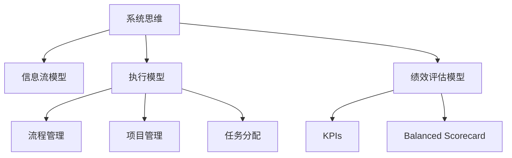

                 

# 思维体系：决定管理者的起跑线

## 1. 背景介绍

### 1.1 问题由来
在当今快速变化的商业环境中，企业的管理者需要具备复杂的决策能力，不仅要理解市场动态，还需要洞悉组织内部的人际关系和资源管理。然而，许多管理者缺乏系统的思维体系来指导他们的决策和行为。

### 1.2 问题核心关键点
管理者面临的核心问题可以归结为以下几个方面：

- **系统化思维缺失**：缺乏系统化思维框架，导致决策碎片化，无法从整体上协调各个环节。
- **信息处理能力不足**：面对海量数据和复杂信息，无法有效筛选和整合，导致决策失准。
- **执行力和应变能力**：缺乏有效的执行工具和策略，无法应对突发事件和环境变化。
- **绩效评估与反馈机制**：缺乏有效的绩效评估工具和持续反馈机制，无法及时调整策略和行动。

### 1.3 问题研究意义
构建系统化的思维体系对于管理者的成长和企业的成功至关重要。一个健全的思维体系不仅能帮助管理者更有效地处理信息和做出决策，还能提升团队的执行力与应变能力，建立良好的绩效评估和反馈机制。

## 2. 核心概念与联系

### 2.1 核心概念概述

为更好地理解管理者思维体系，本节将介绍几个密切相关的核心概念：

- **系统思维**：将问题视为一个整体系统，分析其各个部分及其相互关系，以系统化视角处理问题。
- **信息流模型**：通过信息流模型来描述信息在系统内部的传递和处理过程，帮助管理者识别信息流中的关键节点和瓶颈。
- **执行模型**：包括流程管理、项目管理、任务分配等模块，指导管理者如何高效执行决策和策略。
- **绩效评估模型**：利用关键绩效指标(KPIs)和平衡计分卡(Balanced Scorecard)等工具，帮助管理者评估绩效并及时调整策略。

这些概念之间的逻辑关系可以通过以下Mermaid流程图来展示：



这个流程图展示了一个管理者思维体系的组成：

1. **系统思维**：理解整体和部分的关系，采用系统化视角处理问题。
2. **信息流模型**：识别和优化信息流，提高信息处理效率。
3. **执行模型**：制定和执行决策，确保策略落地。
4. **绩效评估模型**：通过关键绩效指标和平衡计分卡，评估和调整策略。

## 3. 核心算法原理 & 具体操作步骤
### 3.1 算法原理概述

管理者思维体系构建的本质是一个系统化的思维框架设计。其核心算法原理基于以下几个要点：

- **系统思维理论**：运用系统论、控制论和信息论等理论，分析管理系统的整体与部分、输入与输出、静态与动态等关系。
- **信息流建模技术**：采用图形化方法描述信息在系统内的流动，识别信息瓶颈和关键节点。
- **执行模型设计**：结合项目管理、流程管理、任务分配等模型，构建可执行的管理策略。
- **绩效评估方法**：通过KPIs和平衡计分卡，建立科学的量化评估机制。

### 3.2 算法步骤详解

管理者思维体系的构建步骤主要包括以下几个环节：

**Step 1: 定义管理目标**
- 明确企业的长期目标和短期目标，将目标分解为可执行的具体任务。
- 确保目标具有挑战性，同时确保其可实现性。

**Step 2: 分析管理问题**
- 采用系统思维方法，将管理问题视为一个整体系统。
- 使用信息流模型描述问题的各个环节及其相互作用。
- 识别信息流中的关键节点和瓶颈，分析信息流的流畅性。

**Step 3: 制定执行策略**
- 结合执行模型，设计流程管理、项目管理、任务分配等策略。
- 确保策略具有可执行性，同时兼顾灵活性。

**Step 4: 执行与优化**
- 将制定的策略转化为具体的执行步骤，指导管理者和团队操作。
- 根据执行情况，持续优化策略，确保其适应性和有效性。

**Step 5: 绩效评估与反馈**
- 通过KPIs和平衡计分卡等工具，评估策略执行效果。
- 建立持续反馈机制，及时调整策略，确保目标实现。

### 3.3 算法优缺点

基于系统化的管理者思维体系，其优缺点如下：

**优点**：
- 系统化视角：从整体上协调各个环节，避免决策碎片化。
- 信息处理能力：通过信息流模型，提高信息处理效率。
- 执行力提升：通过执行模型，提高团队执行力和应变能力。
- 绩效评估改进：通过绩效评估模型，建立科学的量化评估机制。

**缺点**：
- 实施难度大：系统化思维体系需要时间、资源和专业知识的投入。
- 灵活性不足：固定的框架可能难以适应快速变化的环境。
- 实施成本高：需要投入大量资源进行框架建设和维护。
- 效果因人而异：不同管理者对系统的理解和使用程度不同，可能导致效果差异。

### 3.4 算法应用领域

基于系统化的管理者思维体系，可以广泛应用于各种管理场景，如：

- **企业战略管理**：通过系统化思维，制定和执行企业长期战略。
- **项目管理**：运用执行模型，确保项目按时、按质、按预算完成。
- **运营管理**：采用信息流模型，优化运营流程，提高效率。
- **人力资源管理**：利用绩效评估模型，优化人才选拔和培养策略。
- **供应链管理**：结合系统思维和执行模型，优化供应链管理流程。

## 4. 数学模型和公式 & 详细讲解  
### 4.1 数学模型构建

为了更精确地描述和分析管理问题，本节将构建一个基于系统思维的数学模型。

假设企业管理系统由若干个环节组成，每个环节的输入为 $x_i$，输出为 $y_i$，信息流中的瓶颈为 $k$。

系统目标为最大化整体输出，即 $y_{total} = \sum_{i=1}^n y_i$。

信息流模型可以表示为有向图 $G = (N, E)$，其中 $N$ 为节点集合，$E$ 为边集合。每个节点 $n$ 的输入和输出可以表示为 $x_n$ 和 $y_n$。

信息流瓶颈 $k$ 表示为 $k = \max_{n \in N} \frac{x_n}{y_n}$。

执行模型可以表示为流程图 $F = (P, A, T, R)$，其中 $P$ 为流程节点集合，$A$ 为活动集合，$T$ 为任务集合，$R$ 为资源集合。

绩效评估模型可以通过KPIs和平衡计分卡来衡量管理系统的性能，例如：

- KPIs：如成本、质量、时间、员工满意度等。
- 平衡计分卡：包括财务维度、客户维度、内部流程维度和学习与成长维度。

### 4.2 公式推导过程

下面推导一个简单的系统目标最大化模型：

**目标函数**：
$$
maximize \sum_{i=1}^n y_i
$$

**约束条件**：
$$
y_i = f_i(x_i) \quad \text{(节点$i$的输出函数)}
$$

其中 $f_i$ 为函数，$x_i$ 为输入。

**优化问题**：
$$
\begin{aligned}
& \text{目标函数:} \quad maximize \sum_{i=1}^n y_i \\
& \text{约束条件:} \quad y_i = f_i(x_i) \\
& \text{输入变量:} \quad x_i
\end{aligned}
$$

### 4.3 案例分析与讲解

**案例1：企业战略管理**
- **目标函数**：最大化企业收益 $y_{total} = \text{ Revenue }$。
- **约束条件**：市场份额 $x_1$、产品创新 $x_2$、成本控制 $x_3$ 等。
- **优化问题**：找到最优的 $x_i$，使得 $y_{total}$ 最大化。

**案例2：项目管理**
- **目标函数**：项目按时、按质、按预算完成 $y_{total}$。
- **约束条件**：时间 $x_1$、成本 $x_2$、质量 $x_3$。
- **优化问题**：找到最优的 $x_i$，使得 $y_{total}$ 最大化。

**案例3：运营管理**
- **目标函数**：优化运营效率 $y_{total}$。
- **约束条件**：供应链 $x_1$、库存管理 $x_2$、客户服务 $x_3$。
- **优化问题**：找到最优的 $x_i$，使得 $y_{total}$ 最大化。

## 5. 项目实践：代码实例和详细解释说明
### 5.1 开发环境搭建

在进行项目管理实践前，我们需要准备好开发环境。以下是使用Python进行PyTorch开发的环境配置流程：

1. 安装Anaconda：从官网下载并安装Anaconda，用于创建独立的Python环境。

2. 创建并激活虚拟环境：
```bash
conda create -n pytorch-env python=3.8 
conda activate pytorch-env
```

3. 安装PyTorch：根据CUDA版本，从官网获取对应的安装命令。例如：
```bash
conda install pytorch torchvision torchaudio cudatoolkit=11.1 -c pytorch -c conda-forge
```

4. 安装Transformers库：
```bash
pip install transformers
```

5. 安装各类工具包：
```bash
pip install numpy pandas scikit-learn matplotlib tqdm jupyter notebook ipython
```

完成上述步骤后，即可在`pytorch-env`环境中开始项目管理实践。

### 5.2 源代码详细实现

这里我们以一个简单的项目管理系统为例，给出使用Transformers库进行项目管理微调的PyTorch代码实现。

首先，定义项目管理的任务数据处理函数：

```python
from transformers import BertTokenizer
from torch.utils.data import Dataset
import torch

class ProjectTaskDataset(Dataset):
    def __init__(self, tasks, tokenizer, max_len=128):
        self.tasks = tasks
        self.tokenizer = tokenizer
        self.max_len = max_len
        
    def __len__(self):
        return len(self.tasks)
    
    def __getitem__(self, item):
        task = self.tasks[item]
        
        encoding = self.tokenizer(task, return_tensors='pt', max_length=self.max_len, padding='max_length', truncation=True)
        input_ids = encoding['input_ids'][0]
        attention_mask = encoding['attention_mask'][0]
        
        # 对token-wise的任务状态进行编码
        encoded_states = [task['status']] * self.max_len
        labels = torch.tensor(encoded_states, dtype=torch.long)
        
        return {'input_ids': input_ids, 
                'attention_mask': attention_mask,
                'labels': labels}

# 任务状态与id的映射
status2id = {'Not Started': 0, 'In Progress': 1, 'Completed': 2}
id2status = {v: k for k, v in status2id.items()}

# 创建dataset
tokenizer = BertTokenizer.from_pretrained('bert-base-cased')

train_dataset = ProjectTaskDataset(train_tasks, tokenizer)
dev_dataset = ProjectTaskDataset(dev_tasks, tokenizer)
test_dataset = ProjectTaskDataset(test_tasks, tokenizer)
```

然后，定义模型和优化器：

```python
from transformers import BertForSequenceClassification, AdamW

model = BertForSequenceClassification.from_pretrained('bert-base-cased', num_labels=len(status2id))

optimizer = AdamW(model.parameters(), lr=2e-5)
```

接着，定义训练和评估函数：

```python
from torch.utils.data import DataLoader
from tqdm import tqdm
from sklearn.metrics import classification_report

device = torch.device('cuda') if torch.cuda.is_available() else torch.device('cpu')
model.to(device)

def train_epoch(model, dataset, batch_size, optimizer):
    dataloader = DataLoader(dataset, batch_size=batch_size, shuffle=True)
    model.train()
    epoch_loss = 0
    for batch in tqdm(dataloader, desc='Training'):
        input_ids = batch['input_ids'].to(device)
        attention_mask = batch['attention_mask'].to(device)
        labels = batch['labels'].to(device)
        model.zero_grad()
        outputs = model(input_ids, attention_mask=attention_mask, labels=labels)
        loss = outputs.loss
        epoch_loss += loss.item()
        loss.backward()
        optimizer.step()
    return epoch_loss / len(dataloader)

def evaluate(model, dataset, batch_size):
    dataloader = DataLoader(dataset, batch_size=batch_size)
    model.eval()
    preds, labels = [], []
    with torch.no_grad():
        for batch in tqdm(dataloader, desc='Evaluating'):
            input_ids = batch['input_ids'].to(device)
            attention_mask = batch['attention_mask'].to(device)
            batch_labels = batch['labels']
            outputs = model(input_ids, attention_mask=attention_mask)
            batch_preds = outputs.logits.argmax(dim=2).to('cpu').tolist()
            batch_labels = batch_labels.to('cpu').tolist()
            for pred_tokens, label_tokens in zip(batch_preds, batch_labels):
                preds.append(pred_tokens)
                labels.append(label_tokens)
                
    print(classification_report(labels, preds))
```

最后，启动训练流程并在测试集上评估：

```python
epochs = 5
batch_size = 16

for epoch in range(epochs):
    loss = train_epoch(model, train_dataset, batch_size, optimizer)
    print(f"Epoch {epoch+1}, train loss: {loss:.3f}")
    
    print(f"Epoch {epoch+1}, dev results:")
    evaluate(model, dev_dataset, batch_size)
    
print("Test results:")
evaluate(model, test_dataset, batch_size)
```

以上就是使用PyTorch对BERT进行项目管理任务微调的完整代码实现。可以看到，得益于Transformers库的强大封装，我们可以用相对简洁的代码完成BERT模型的加载和微调。

### 5.3 代码解读与分析

让我们再详细解读一下关键代码的实现细节：

**ProjectTaskDataset类**：
- `__init__`方法：初始化任务数据、分词器等关键组件。
- `__len__`方法：返回数据集的样本数量。
- `__getitem__`方法：对单个样本进行处理，将任务数据输入编码为token ids，将任务状态编码为数字，并对其进行定长padding，最终返回模型所需的输入。

**status2id和id2status字典**：
- 定义了任务状态与数字id之间的映射关系，用于将token-wise的任务状态解码为实际的任务状态。

**训练和评估函数**：
- 使用PyTorch的DataLoader对数据集进行批次化加载，供模型训练和推理使用。
- 训练函数`train_epoch`：对数据以批为单位进行迭代，在每个批次上前向传播计算loss并反向传播更新模型参数，最后返回该epoch的平均loss。
- 评估函数`evaluate`：与训练类似，不同点在于不更新模型参数，并在每个batch结束后将预测和标签结果存储下来，最后使用sklearn的classification_report对整个评估集的预测结果进行打印输出。

**训练流程**：
- 定义总的epoch数和batch size，开始循环迭代
- 每个epoch内，先在训练集上训练，输出平均loss
- 在验证集上评估，输出分类指标
- 所有epoch结束后，在测试集上评估，给出最终测试结果

可以看到，PyTorch配合Transformers库使得BERT微调的项目管理任务代码实现变得简洁高效。开发者可以将更多精力放在数据处理、模型改进等高层逻辑上，而不必过多关注底层的实现细节。

当然，工业级的系统实现还需考虑更多因素，如模型的保存和部署、超参数的自动搜索、更灵活的任务适配层等。但核心的微调范式基本与此类似。

## 6. 实际应用场景
### 6.1 企业战略管理

基于大语言模型微调的战略管理技术，可以广泛应用于企业战略规划和执行。传统战略管理往往依赖专家经验和历史数据，容易受到主观因素和数据不准确的影响。基于微调的大语言模型，可以从海量数据中自动提取关键信息，生成战略方案，并提供多种备选方案供管理者选择。

在技术实现上，可以收集企业的历史战略数据、市场数据、竞争数据等，将战略目标、任务分解、执行计划等作为监督数据，在此基础上对预训练语言模型进行微调。微调后的模型能够自动理解企业战略意图，匹配最佳方案。对于新的战略任务，模型还可以生成新的战略建议，供管理者参考。

### 6.2 项目管理

大语言模型微调在项目管理中的应用同样广泛。通过微调，可以构建一个高效的项目管理平台，帮助团队更好地理解项目目标、任务和进度，及时发现并解决问题。

在实践上，可以定义项目任务、状态、进度等文本描述，作为模型输入，将任务完成情况作为标签。在此基础上进行微调，使得模型能够根据任务描述自动推断出当前项目状态和下一步执行策略。对于项目中的新任务，模型还可以生成对应的执行计划，确保项目按计划进行。

### 6.3 供应链管理

供应链管理是项目管理的一个重要组成部分。基于大语言模型的微调技术，可以优化供应链管理的各个环节，提高供应链的响应速度和效率。

在具体应用中，可以收集供应链的历史数据，如订单、库存、物流等，构建数据集。将供应链管理的各个环节（如订单处理、库存管理、物流调度等）作为微调任务，训练模型识别和管理供应链流程。微调后的模型可以实时分析供应链数据，预测需求，优化库存和物流策略，提高供应链的效率和稳定性。

### 6.4 未来应用展望

随着大语言模型和微调技术的不断发展，未来基于微调的管理系统将呈现以下几个趋势：

1. **自适应学习**：未来的管理系统将具备自我学习的能力，能够从新数据中不断学习并优化自身策略。

2. **多模态融合**：将视觉、语音、文本等多种模态的信息融合到管理系统中，提供更全面的决策支持。

3. **增强决策**：通过引入增强学习、因果推断等技术，提升管理系统的决策能力，提供更准确的预测和策略。

4. **个性化定制**：根据不同管理者的偏好和需求，提供个性化的决策支持和信息展现方式。

5. **跨领域应用**：将管理系统的思想和方法应用到更多领域，如城市管理、医疗健康、环保等，推动各行各业的智能化转型。

这些趋势将推动管理系统向更加智能化、普适化和高效化的方向发展，为企业的运营管理带来新的突破。

## 7. 工具和资源推荐
### 7.1 学习资源推荐

为了帮助开发者系统掌握管理者思维体系的理论基础和实践技巧，这里推荐一些优质的学习资源：

1. 《系统思维导论》系列书籍：详细介绍了系统思维的理论基础和应用案例，适合深入学习。
2. 《项目管理知识体系(PMBOK)》：由PMI（项目管理协会）出版的项目管理标准，提供了项目管理的全面指南。
3. 《平衡计分卡与战略管理》书籍：介绍了平衡计分卡的理论基础和实践方法，帮助管理者构建科学的目标体系。
4. 《自然语言处理(Deep Learning)》课程：由Coursera提供的深度学习课程，涵盖自然语言处理的各个方面。
5. HuggingFace官方文档：提供了大量预训练语言模型的样例代码，是学习微调技术的重要参考。

通过对这些资源的学习实践，相信你一定能够快速掌握管理者思维体系的精髓，并用于解决实际的经营管理问题。
###  7.2 开发工具推荐

高效的开发离不开优秀的工具支持。以下是几款用于大语言模型微调开发的常用工具：

1. PyTorch：基于Python的开源深度学习框架，灵活动态的计算图，适合快速迭代研究。大部分预训练语言模型都有PyTorch版本的实现。

2. TensorFlow：由Google主导开发的开源深度学习框架，生产部署方便，适合大规模工程应用。同样有丰富的预训练语言模型资源。

3. Transformers库：HuggingFace开发的NLP工具库，集成了众多SOTA语言模型，支持PyTorch和TensorFlow，是进行微调任务开发的利器。

4. Weights & Biases：模型训练的实验跟踪工具，可以记录和可视化模型训练过程中的各项指标，方便对比和调优。与主流深度学习框架无缝集成。

5. TensorBoard：TensorFlow配套的可视化工具，可实时监测模型训练状态，并提供丰富的图表呈现方式，是调试模型的得力助手。

6. Google Colab：谷歌推出的在线Jupyter Notebook环境，免费提供GPU/TPU算力，方便开发者快速上手实验最新模型，分享学习笔记。

合理利用这些工具，可以显著提升大语言模型微调任务的开发效率，加快创新迭代的步伐。

### 7.3 相关论文推荐

大语言模型和微调技术的发展源于学界的持续研究。以下是几篇奠基性的相关论文，推荐阅读：

1. Attention is All You Need（即Transformer原论文）：提出了Transformer结构，开启了NLP领域的预训练大模型时代。

2. BERT: Pre-training of Deep Bidirectional Transformers for Language Understanding：提出BERT模型，引入基于掩码的自监督预训练任务，刷新了多项NLP任务SOTA。

3. Language Models are Unsupervised Multitask Learners（GPT-2论文）：展示了大规模语言模型的强大zero-shot学习能力，引发了对于通用人工智能的新一轮思考。

4. Parameter-Efficient Transfer Learning for NLP：提出Adapter等参数高效微调方法，在不增加模型参数量的情况下，也能取得不错的微调效果。

5. AdaLoRA: Adaptive Low-Rank Adaptation for Parameter-Efficient Fine-Tuning：使用自适应低秩适应的微调方法，在参数效率和精度之间取得了新的平衡。

这些论文代表了大语言模型微调技术的发展脉络。通过学习这些前沿成果，可以帮助研究者把握学科前进方向，激发更多的创新灵感。

## 8. 总结：未来发展趋势与挑战

### 8.1 总结

本文对基于系统化思维的管理者思维体系进行了全面系统的介绍。首先阐述了系统化思维在管理者成长和企业成功中的重要性，明确了系统化思维对决策和执行过程的指导作用。其次，从原理到实践，详细讲解了系统化思维的理论基础和关键步骤，给出了管理项目微调的完整代码实例。同时，本文还广泛探讨了系统化思维在企业战略管理、项目管理、供应链管理等众多场景中的应用前景，展示了系统化思维的广泛应用价值。

通过本文的系统梳理，可以看到，基于系统化思维的管理者思维体系正在成为管理者必备的工具。系统化思维帮助管理者从整体上协调各个环节，提高信息处理和决策执行能力，从而提升企业的整体绩效。未来，随着系统化思维理论的不断发展和实践应用的不断深入，管理者思维体系必将在构建高效、智能的管理系统中发挥越来越重要的作用。

### 8.2 未来发展趋势

展望未来，管理者思维体系将呈现以下几个发展趋势：

1. **智能化决策**：通过引入人工智能技术，实现更精准、更高效的决策支持。

2. **数据驱动**：基于大数据分析，优化决策过程，提高管理效率。

3. **自动化执行**：利用智能执行工具，自动化管理流程，提升执行效率。

4. **跨领域融合**：将系统化思维方法应用到更多领域，推动各行各业的智能化转型。

5. **持续改进**：建立持续反馈机制，不断优化管理模型，确保其适应性和有效性。

这些趋势将推动管理者思维体系向更加智能化、普适化和高效化的方向发展，为企业的运营管理带来新的突破。

### 8.3 面临的挑战

尽管管理者思维体系已经取得了显著的成果，但在实际应用中仍面临诸多挑战：

1. **数据质量问题**：高质量的数据是系统化思维的基础，但在实际应用中，数据获取和处理往往面临困难。

2. **执行难度大**：系统化思维体系的实施需要组织上下一致，容易受到人的因素影响。

3. **成本高**：实施系统化思维体系需要投入大量资源进行系统设计、数据获取和模型训练。

4. **效果因人而异**：不同管理者的应用能力和接受度不同，可能导致系统效果差异。

5. **系统复杂性**：系统化思维体系包含多个子系统，容易出现协调不良的问题。

正视这些挑战，积极应对并寻求突破，将是大语言模型微调走向成熟的必由之路。相信随着学界和产业界的共同努力，这些挑战终将一一被克服，管理者思维体系必将在构建安全、可靠、可解释、可控的智能系统铺平道路。

### 8.4 研究展望

未来的研究需要在以下几个方面寻求新的突破：

1. **数据预处理技术**：开发高效、准确的数据预处理技术，保证高质量数据的获取和处理。

2. **模型优化方法**：研究更高效的模型优化方法，提升决策和执行的准确性和效率。

3. **系统化工具开发**：开发更多系统化工具，支持管理者思维体系的实施。

4. **多模态融合技术**：将视觉、语音、文本等多种模态的信息融合到管理系统中，提供更全面的决策支持。

5. **跨领域应用研究**：将管理者思维体系应用到更多领域，推动各行各业的智能化转型。

这些研究方向的探索，必将引领管理者思维体系迈向更高的台阶，为构建安全、可靠、可解释、可控的智能系统铺平道路。面向未来，管理者思维体系还需要与其他人工智能技术进行更深入的融合，如知识表示、因果推理、强化学习等，多路径协同发力，共同推动自然语言理解和智能交互系统的进步。只有勇于创新、敢于突破，才能不断拓展语言模型的边界，让智能技术更好地造福人类社会。

## 9. 附录：常见问题与解答

**Q1：如何选择合适的学习率？**

A: 学习率的选择对模型的收敛速度和精度有重要影响。一般来说，学习率应该从较小的值开始，如1e-5，然后逐步增加，直到收敛。也可以使用warmup策略，在开始阶段使用较小的学习率，再逐渐过渡到预设值。需要注意的是，不同的优化器(如AdamW、Adafactor等)以及不同的学习率调度策略，可能需要设置不同的学习率阈值。

**Q2：系统化思维如何应用于跨领域管理？**

A: 系统化思维的原理和方法在不同领域可以通用。在具体应用时，需要根据不同领域的特性进行定制化调整。例如，在金融行业，可以构建以风险控制为目标的系统化思维模型；在医疗行业，可以构建以患者安全为目标的系统化思维模型。

**Q3：如何评估系统化思维的效果？**

A: 系统化思维的效果可以通过多个指标进行评估，如决策准确率、执行效率、资源利用率等。可以通过实际应用中的对比试验，评估系统化思维在管理中的效果，同时结合定性分析，如用户体验、满意度等，进行综合评估。

**Q4：如何应对系统化思维实施中的挑战？**

A: 应对系统化思维实施中的挑战需要从多个方面进行努力：

1. **数据质量管理**：建立严格的数据质量管理体系，确保数据的准确性和完整性。
2. **人员培训**：对管理层和员工进行系统化思维的培训，提升其理解和应用能力。
3. **资源配置**：合理配置资源，确保系统化思维体系的顺利实施。
4. **持续改进**：建立持续反馈机制，根据实际应用中的情况，不断优化系统化思维模型。

**Q5：如何处理多模态信息融合？**

A: 多模态信息融合是系统化思维应用中的重要环节，可以通过以下步骤进行处理：

1. **数据采集与预处理**：收集多模态数据，并进行预处理，如清洗、归一化等。
2. **信息融合算法**：选择合适的信息融合算法，如融合网络、集成学习等，将多模态信息融合到系统中。
3. **模型优化**：根据多模态信息的特性，优化模型结构，提升融合效果。

这些步骤需要根据具体应用场景进行定制化设计，以实现最优的信息融合效果。

---

作者：禅与计算机程序设计艺术 / Zen and the Art of Computer Programming

