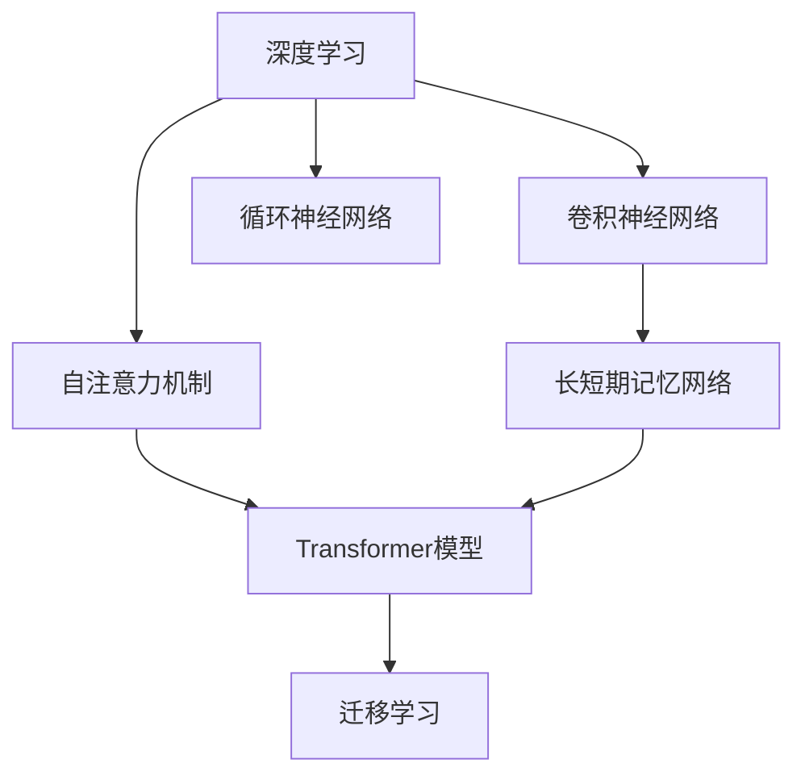

                 

## 1. 背景介绍

### 1.1 问题由来

在信息爆炸的现代社会，人们每天都在面对海量的数据和信息。如何在海量数据中找到有效的信息，并从中提取有用的知识，成为了一个巨大的挑战。传统的信息获取方式往往依赖于人工筛选，效率低且容易出错。然而，随着人工智能技术的发展，尤其是深度学习技术的成熟，通过机器学习的方法来辅助信息筛选和知识提取变得越来越可行。

### 1.2 问题核心关键点

在信息处理和知识提取的过程中，模型设计、特征提取、算法选择等方面都至关重要。一个合理的思维模型可以帮助我们更好地理解复杂的数据结构和信息流动，从而提高信息处理的效率和质量。本文将详细介绍几种常用的思维模型，探讨其原理和应用，并给出代码实例和实际应用场景。

## 2. 核心概念与联系

### 2.1 核心概念概述

以下列出了几个核心概念及其相互联系：

- **深度学习（Deep Learning）**：一种基于人工神经网络（Artificial Neural Network, ANN）的机器学习技术，通过多层次的非线性变换对复杂数据进行建模和分析。

- **卷积神经网络（Convolutional Neural Network, CNN）**：一种适用于图像、视频等数据处理的深度学习模型，通过卷积操作提取局部特征。

- **循环神经网络（Recurrent Neural Network, RNN）**：一种适用于序列数据处理的深度学习模型，通过循环连接捕捉序列间的依赖关系。

- **长短期记忆网络（Long Short-Term Memory, LSTM）**：一种特殊的RNN模型，通过门控机制解决传统RNN的梯度消失问题，适用于长时间序列的数据处理。

- **自注意力机制（Self-Attention Mechanism）**：一种在Transformer模型中使用的机制，通过注意力机制提高模型的泛化能力和适应性。

- **Transformer模型**：一种基于自注意力机制的深度学习模型，具有高效率、高准确性和良好的泛化能力，广泛应用于自然语言处理（Natural Language Processing, NLP）等任务。

- **迁移学习（Transfer Learning）**：一种通过在某个任务上训练的模型，将学习到的知识迁移到另一个任务上，以减少在新任务上训练所需的数据量和计算资源的技术。

这些核心概念相互联系，共同构成了深度学习的基础框架，帮助我们理解和处理复杂数据。

### 2.2 核心概念原理和架构的 Mermaid 流程图(Mermaid 流程节点中不要有括号、逗号等特殊字符)



这个流程图展示了核心概念之间的相互关系和架构。深度学习是基础，CNN和RNN是其重要分支，LSTM是RNN的改进，自注意力机制是Transformer模型的核心，Transformer模型是深度学习的重要应用之一，迁移学习则通过知识迁移来优化模型的泛化能力。

## 3. 核心算法原理 & 具体操作步骤

### 3.1 算法原理概述

本节将详细介绍深度学习模型的核心算法原理，包括CNN、RNN、LSTM和Transformer模型的工作原理，以及迁移学习的基本概念和流程。

### 3.2 算法步骤详解

**深度学习模型：**

1. **模型搭建**：选择合适的深度学习框架（如TensorFlow、PyTorch等），搭建深度神经网络模型，包括输入层、隐藏层和输出层。

2. **特征提取**：使用CNN提取图像、视频等数据的特征，或使用RNN、LSTM提取序列数据的特征。

3. **模型训练**：使用训练数据对模型进行训练，调整权重和偏置，优化损失函数。

4. **模型评估**：使用测试数据对模型进行评估，计算准确率、召回率等指标。

**CNN模型：**

1. **卷积层**：通过卷积操作提取局部特征。

2. **池化层**：通过最大池化或平均池化减少特征图的大小，提高模型的鲁棒性。

3. **全连接层**：将特征图展开成向量，输入到全连接层进行分类或回归。

**RNN模型：**

1. **循环连接**：通过循环连接捕捉序列间的依赖关系。

2. **门控机制**：通过LSTM等门控机制解决梯度消失问题。

3. **反向传播**：通过反向传播算法更新权重和偏置。

**LSTM模型：**

1. **输入门**：决定当前输入是否加入网络。

2. **遗忘门**：决定哪些信息应该被遗忘。

3. **输出门**：决定哪些信息应该被输出。

**Transformer模型：**

1. **自注意力机制**：通过自注意力机制捕捉输入序列的依赖关系。

2. **多头注意力**：通过多头注意力机制提高模型的泛化能力。

3. **位置编码**：通过位置编码处理序列位置信息。

**迁移学习：**

1. **数据准备**：收集目标任务的标注数据。

2. **模型微调**：在预训练模型上微调，适应目标任务的特征。

3. **评估和优化**：使用测试数据对模型进行评估，调整超参数。

### 3.3 算法优缺点

**深度学习模型：**

- **优点**：强大的表达能力和泛化能力，适用于复杂的非线性关系建模。

- **缺点**：计算量大，需要大量的标注数据和计算资源，容易过拟合。

**CNN模型：**

- **优点**：适用于图像、视频等数据处理，特征提取能力强。

- **缺点**：处理序列数据时，难以捕捉序列间的依赖关系。

**RNN模型：**

- **优点**：适用于序列数据处理，能够捕捉序列间的依赖关系。

- **缺点**：存在梯度消失问题，难以处理长时间序列数据。

**LSTM模型：**

- **优点**：解决了梯度消失问题，适用于长时间序列数据处理。

- **缺点**：计算量大，训练时间长。

**Transformer模型：**

- **优点**：高效率、高准确性、良好的泛化能力，适用于自然语言处理等任务。

- **缺点**：需要大量的计算资源，模型结构复杂。

**迁移学习：**

- **优点**：减少了在新任务上训练所需的数据量和计算资源，提高了模型的泛化能力。

- **缺点**：预训练模型的性能往往依赖于训练数据的质量和数量，需要进行微调。

### 3.4 算法应用领域

深度学习模型和其分支广泛应用于计算机视觉、自然语言处理、语音识别、推荐系统等诸多领域。CNN模型适用于图像识别、医学影像分析等任务，RNN和LSTM模型适用于语音识别、时间序列预测等任务，Transformer模型适用于自然语言处理、机器翻译等任务，迁移学习则广泛应用于知识图谱构建、多任务学习等领域。

## 4. 数学模型和公式 & 详细讲解 & 举例说明

### 4.1 数学模型构建

本节将使用数学语言对深度学习模型的构建过程进行严格的刻画。

- **CNN模型**：
  - 输入：$x$，输出：$y$。

  - 卷积层公式：
    $$
    H = \sigma(\sum_k w_k \ast x_k)
    $$

  - 池化层公式：
    $$
    H' = \max_{i} H[i]
    $$

  - 全连接层公式：
    $$
    y = W^T H'
    $$

- **RNN模型**：
  - 输入：$x_t$，输出：$y_t$。

  - 循环连接公式：
    $$
    h_{t+1} = f(x_t, h_t)
    $$

  - 门控机制公式：
    $$
    g = \sigma(W_g x_t + U_g h_t)
    $$
    $$
    r = \sigma(W_r x_t + U_r h_t)
    $$
    $$
    o = \sigma(W_o x_t + U_o h_t)
    $$

- **LSTM模型**：
  - 输入：$x_t$，输出：$y_t$。

  - 输入门公式：
    $$
    i = \sigma(W_i x_t + U_i h_{t-1})
    $$

  - 遗忘门公式：
    $$
    f = \sigma(W_f x_t + U_f h_{t-1})
    $$

  - 输出门公式：
    $$
    o = \sigma(W_o x_t + U_o h_{t-1})
    $$

  - 细胞状态更新公式：
    $$
    C_t = f \odot C_{t-1} + i \odot tanh(W_c x_t + U_c h_{t-1})
    $$

- **Transformer模型**：
  - 输入：$x$，输出：$y$。

  - 自注意力机制公式：
    $$
    A = \text{softmax}(QK^T)
    $$

  - 多头注意力公式：
    $$
    H = \text{softmax}(A) KV^T
    $$

  - 位置编码公式：
    $$
    P = \text{sin}(\frac{2\pi i}{d} \frac{h}{d})
    $$

- **迁移学习**：
  - 数据准备：$D_s$，目标任务数据：$D_t$。

  - 微调公式：
    $$
    \theta_t = \theta_s - \eta \nabla_{\theta} \mathcal{L}(\theta_s, D_t)
    $$

### 4.2 公式推导过程

以下我们以CNN模型为例，推导卷积层、池化层和全连接层的公式。

- **卷积层公式**：
  - 卷积操作：
    $$
    H_{i,j} = \sum_k w_k \ast x_{i,j,k}
    $$

  - 激活函数：
    $$
    H'_{i,j} = \sigma(H_{i,j})
    $$

- **池化层公式**：
  - 最大池化：
    $$
    H'_{i,j} = \max_{k} H_{i,j,k}
    $$

- **全连接层公式**：
  - 矩阵乘法：
    $$
    y = W^T H'
    $$

### 4.3 案例分析与讲解

以手写数字识别为例，展示CNN模型的应用过程。

- **数据准备**：MNIST数据集，包含60000个训练样本和10000个测试样本。

- **模型搭建**：搭建一个包含2个卷积层和2个池化层的CNN模型，输出层为10个神经元，使用softmax函数进行分类。

- **训练过程**：使用训练集对模型进行训练，调整权重和偏置，优化交叉熵损失函数。

- **测试过程**：使用测试集对模型进行测试，计算准确率。

## 5. 项目实践：代码实例和详细解释说明

### 5.1 开发环境搭建

在进行深度学习模型开发前，我们需要准备好开发环境。以下是使用Python进行TensorFlow开发的环境配置流程：

1. 安装Anaconda：从官网下载并安装Anaconda，用于创建独立的Python环境。

2. 创建并激活虚拟环境：
```bash
conda create -n tf-env python=3.7
conda activate tf-env
```

3. 安装TensorFlow：根据CUDA版本，从官网获取对应的安装命令。例如：
```bash
pip install tensorflow
```

4. 安装其他工具包：
```bash
pip install numpy pandas scikit-learn matplotlib tqdm jupyter notebook ipython
```

完成上述步骤后，即可在`tf-env`环境中开始深度学习模型开发。

### 5.2 源代码详细实现

下面我们以手写数字识别为例，给出使用TensorFlow实现CNN模型的代码实现。

```python
import tensorflow as tf
from tensorflow.keras import datasets, layers, models

# 加载数据集
(train_images, train_labels), (test_images, test_labels) = datasets.mnist.load_data()

# 数据预处理
train_images = train_images.reshape((60000, 28, 28, 1))
train_images = train_images / 255.0

test_images = test_images.reshape((10000, 28, 28, 1))
test_images = test_images / 255.0

# 构建模型
model = models.Sequential()
model.add(layers.Conv2D(32, (3, 3), activation='relu', input_shape=(28, 28, 1)))
model.add(layers.MaxPooling2D((2, 2)))
model.add(layers.Conv2D(64, (3, 3), activation='relu'))
model.add(layers.MaxPooling2D((2, 2)))
model.add(layers.Flatten())
model.add(layers.Dense(64, activation='relu'))
model.add(layers.Dense(10, activation='softmax'))

# 编译模型
model.compile(optimizer='adam',
              loss='sparse_categorical_crossentropy',
              metrics=['accuracy'])

# 训练模型
model.fit(train_images, train_labels, epochs=5, validation_data=(test_images, test_labels))

# 评估模型
test_loss, test_acc = model.evaluate(test_images, test_labels)
print('Test accuracy:', test_acc)
```

### 5.3 代码解读与分析

让我们再详细解读一下关键代码的实现细节：

- **数据准备**：加载MNIST数据集，并将图像数据进行归一化处理，将其转换为TensorFlow支持的张量格式。

- **模型搭建**：使用Sequential模型搭建CNN模型，包含2个卷积层和2个池化层，以及2个全连接层。

- **模型编译**：使用Adam优化器，交叉熵损失函数，准确率作为评估指标。

- **模型训练**：使用训练集对模型进行训练，设置迭代次数为5次。

- **模型评估**：使用测试集对模型进行评估，输出测试集上的准确率。

## 6. 实际应用场景

### 6.1 智能推荐系统

智能推荐系统通过深度学习模型分析用户的历史行为数据和兴趣爱好，为用户提供个性化的内容推荐。在大规模数据集上预训练深度学习模型，然后在特定用户数据集上进行微调，可以显著提高推荐系统的效果。

### 6.2 语音识别

语音识别是将语音信号转换为文本的过程，是自然语言处理的重要应用之一。通过深度学习模型（如RNN、LSTM、Transformer）进行语音信号的特征提取和处理，可以实现高精度的语音识别。

### 6.3 医学影像分析

医学影像分析通过深度学习模型对医学影像进行自动分类和标注，辅助医生进行诊断和治疗。在大规模医疗影像数据上预训练深度学习模型，然后在特定病种数据集上进行微调，可以显著提高诊断的准确性和效率。

### 6.4 未来应用展望

深度学习模型在未来将有更广泛的应用场景，例如：

- 自动驾驶：通过深度学习模型对传感器数据进行分析和处理，实现车辆的自动驾驶。

- 工业检测：通过深度学习模型对生产过程中的图像和数据进行分析和处理，实现智能检测和质量控制。

- 游戏智能：通过深度学习模型对游戏中的策略和决策进行分析和处理，实现智能游戏对手。

## 7. 工具和资源推荐

### 7.1 学习资源推荐

为了帮助开发者系统掌握深度学习模型的理论基础和实践技巧，这里推荐一些优质的学习资源：

1. 《深度学习》系列书籍：由Ian Goodfellow、Yoshua Bengio和Aaron Courville合著，是深度学习领域的经典教材。

2. CS231n《卷积神经网络》课程：斯坦福大学开设的计算机视觉课程，涵盖深度学习模型的基础知识和前沿技术。

3. DeepLearning.ai《深度学习专项课程》：由Andrew Ng教授主讲的深度学习课程，涵盖深度学习模型的基础知识和实践技巧。

4. TensorFlow官方文档：TensorFlow的官方文档，提供了丰富的学习资源和实践样例。

5. Kaggle数据集和竞赛：Kaggle提供了大量的数据集和竞赛，可以用于实践深度学习模型的开发和评估。

通过对这些资源的学习实践，相信你一定能够快速掌握深度学习模型的精髓，并用于解决实际的NLP问题。

### 7.2 开发工具推荐

高效的开发离不开优秀的工具支持。以下是几款用于深度学习模型开发常用的工具：

1. TensorFlow：由Google主导开发的开源深度学习框架，生产部署方便，适合大规模工程应用。

2. PyTorch：基于Python的开源深度学习框架，灵活动态的计算图，适合快速迭代研究。

3. Keras：Keras是一个高层次的神经网络API，可以运行在TensorFlow、Theano、CNTK等深度学习框架上。

4. Jupyter Notebook：一个交互式的开发环境，支持Python代码的编写和执行。

5. Visual Studio Code：一个轻量级的代码编辑器，支持深度学习模型的开发和调试。

合理利用这些工具，可以显著提升深度学习模型开发的效率，加快创新迭代的步伐。

### 7.3 相关论文推荐

深度学习模型的发展源于学界的持续研究。以下是几篇奠基性的相关论文，推荐阅读：

1. AlexNet：ImageNet 2012比赛冠军模型，引入了卷积神经网络和池化层，奠定了深度学习在图像处理领域的基础。

2. ResNet：解决了深度神经网络的梯度消失问题，使训练深度神经网络成为可能。

3. InceptionNet：通过多分支的卷积层结构，提高了深度神经网络的特征提取能力。

4. LSTM：解决了RNN的梯度消失问题，适用于长时间序列数据的处理。

5. Transformer：引入了自注意力机制，提升了深度神经网络的泛化能力和适应性。

这些论文代表了大深度学习模型发展的历程，通过学习这些前沿成果，可以帮助研究者把握学科前进方向，激发更多的创新灵感。

## 8. 总结：未来发展趋势与挑战

### 8.1 总结

本文对深度学习模型进行了全面系统的介绍。首先阐述了深度学习模型的背景和意义，明确了深度学习在复杂数据处理中的重要作用。其次，从原理到实践，详细讲解了CNN、RNN、LSTM和Transformer模型的工作原理和实现细节，给出了代码实例和实际应用场景。同时，本文还探讨了深度学习模型在智能推荐、语音识别、医学影像分析等领域的广泛应用前景，展示了深度学习模型的强大潜力。

通过本文的系统梳理，可以看到，深度学习模型已经成为信息处理和知识提取的重要工具，广泛应用于计算机视觉、自然语言处理、语音识别等诸多领域。未来，伴随深度学习模型的不断发展，其应用范围将更加广泛，影响也将更加深远。

### 8.2 未来发展趋势

展望未来，深度学习模型将呈现以下几个发展趋势：

1. **模型规模持续增大**：随着算力成本的下降和数据规模的扩张，深度神经网络的参数量还将持续增长。超大规模深度神经网络蕴含的丰富特征提取能力，有望进一步提升数据处理的效果。

2. **模型结构更加多样**：未来的深度学习模型将更加注重结构和算法的创新，如Transformer模型的变种（如MLP-Mixer）、自适应深度神经网络（Adaptive Deep Neural Networks）等。

3. **模型效率不断提升**：未来的深度学习模型将更加注重计算效率和推理速度，如模型压缩、稀疏化存储、模型并行等技术将得到广泛应用。

4. **模型训练更加自动化**：未来的深度学习模型将更加注重模型的自动化训练和优化，如自动化超参数搜索、模型蒸馏、模型融合等技术将得到广泛应用。

5. **模型应用更加普适**：未来的深度学习模型将更加注重模型的普适性，适用于更广泛的领域和任务，如自动驾驶、工业检测、游戏智能等。

以上趋势凸显了深度学习模型的广阔前景，这些方向的探索发展，必将进一步提升深度学习模型的性能和应用范围，为人类认知智能的进化带来深远影响。

### 8.3 面临的挑战

尽管深度学习模型已经取得了瞩目成就，但在迈向更加智能化、普适化应用的过程中，它仍面临着诸多挑战：

1. **模型复杂度问题**：深度神经网络的参数量巨大，训练和推理需要大量的计算资源和存储资源，容易过拟合。

2. **数据质量问题**：深度学习模型对数据质量要求较高，低质量数据可能导致模型训练效果不佳。

3. **模型解释性问题**：深度神经网络的决策过程难以解释，难以应用于医疗、金融等高风险领域。

4. **模型公平性问题**：深度神经网络可能存在偏见和歧视，需要采取措施确保模型的公平性。

5. **模型安全问题**：深度神经网络容易受到对抗样本的攻击，需要采取措施增强模型的鲁棒性。

6. **模型可扩展性问题**：深度神经网络难以大规模扩展，需要开发新的技术支持模型的可扩展性。

正视深度学习模型面临的这些挑战，积极应对并寻求突破，将是大深度学习模型走向成熟的必由之路。相信随着学界和产业界的共同努力，这些挑战终将一一被克服，深度学习模型必将在构建人机协同的智能时代中扮演越来越重要的角色。

### 8.4 研究展望

面对深度学习模型所面临的种种挑战，未来的研究需要在以下几个方面寻求新的突破：

1. **模型简化与优化**：开发更加高效的模型结构，如结构化深度神经网络（Structured Deep Neural Networks）、稀疏化深度神经网络（Sparse Deep Neural Networks）等，提高模型的计算效率和可扩展性。

2. **数据增强与清洗**：开发更加高效的数据增强和清洗技术，提高数据质量，增强模型的泛化能力。

3. **模型解释性与可控性**：开发更加可解释和可控的深度神经网络，增强模型的透明度和可信度。

4. **模型公平性与鲁棒性**：开发更加公平和鲁棒的深度神经网络，确保模型的公平性和安全性。

5. **跨模态学习**：开发跨模态深度学习模型，将深度学习模型应用于更加广泛的领域和任务。

这些研究方向的探索，必将引领深度学习模型的发展方向，为构建智能、安全、可信的深度学习系统提供新的思路和方法。面向未来，深度学习模型还将与其他人工智能技术进行更深入的融合，共同推动人工智能技术的发展。

## 9. 附录：常见问题与解答

**Q1：深度学习模型是否适用于所有数据类型？**

A: 深度学习模型适用于结构化数据和非结构化数据，如图像、语音、文本等。但不适合处理无序数据，如时间序列数据。

**Q2：如何选择合适的深度学习模型？**

A: 根据数据类型和任务特点选择合适的深度学习模型。例如，图像数据适合使用CNN模型，序列数据适合使用RNN或LSTM模型，文本数据适合使用Transformer模型。

**Q3：深度学习模型如何进行特征提取？**

A: 深度学习模型通过卷积层、池化层、全连接层等结构进行特征提取，自动学习输入数据的特征表示。

**Q4：如何提高深度学习模型的泛化能力？**

A: 通过数据增强、正则化、对抗训练等技术提高深度学习模型的泛化能力，避免过拟合。

**Q5：深度学习模型在落地部署时需要注意哪些问题？**

A: 在模型训练和推理时，需要注意计算资源、存储资源、模型大小等问题，合理优化模型结构，提高模型的效率和可扩展性。

---

作者：禅与计算机程序设计艺术 / Zen and the Art of Computer Programming

