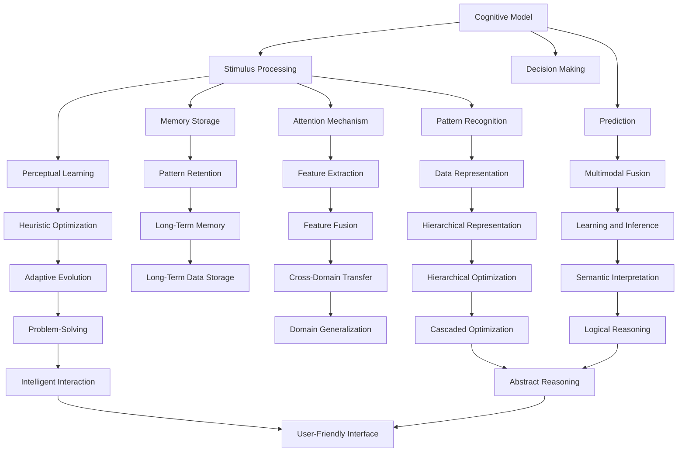

                 

# 思维模型：提升理解力的认知工具

> 关键词：认知模型、启发式算法、信息处理、神经网络、深度学习

## 1. 背景介绍

### 1.1 问题由来

在当今信息爆炸的时代，人类如何从海量信息中提取有用的知识，做出合理的决策，是认知科学领域面临的重大挑战。近年来，随着人工智能和大数据技术的发展，许多认知模型被引入到决策支持系统中，以帮助人类更好地理解和处理信息。

### 1.2 问题核心关键点

认知模型是人工智能与认知科学交叉领域的研究成果，它试图通过计算机模拟人类认知过程，提升信息处理和决策能力。认知模型基于一系列启发式算法和神经网络架构，能够从数据中学习并抽象出模式，进而用于推理、决策和预测。这些模型被广泛应用于医疗诊断、金融预测、智能推荐、智能交互等多个领域。

### 1.3 问题研究意义

研究认知模型，对于提升人类决策质量和信息处理效率，具有重要意义：

1. 提升决策质量：认知模型通过模拟人类认知过程，能够捕捉到信息中的关键特征，辅助决策者做出更科学、合理的决策。
2. 优化信息处理：认知模型能够自动学习和抽象出数据中的复杂模式，帮助人类更高效地处理和理解信息。
3. 促进智能交互：认知模型与自然语言处理、计算机视觉等技术的结合，能够实现更智能、自然的对话和交互。
4. 推动技术进步：认知模型的研究促进了人工智能技术的发展，推动了更多基于认知科学的创新应用。
5. 赋能产业升级：认知模型在实际应用中能够显著提升企业运营效率和服务质量，助力各行各业数字化转型。

## 2. 核心概念与联系

### 2.1 核心概念概述

为更好地理解认知模型的工作原理和应用场景，本节将介绍几个关键概念：

- 认知模型：指基于人类认知过程的启发式算法和神经网络架构，用于处理和理解复杂信息，辅助决策和预测。
- 启发式算法：指模拟人类直觉和经验，通过迭代优化逐步接近最优解的算法，包括遗传算法、粒子群算法、模拟退火等。
- 神经网络：指由大量神经元（节点）组成的网络结构，通过反向传播算法进行训练，用于学习和处理复杂数据。
- 深度学习：指多层次神经网络的组合，通过层级化的特征抽取和变换，学习数据的抽象表示，用于复杂任务的预测和决策。
- 计算机视觉：指通过计算机对图像和视频数据进行处理和分析，实现图像识别、目标检测等任务。
- 自然语言处理：指通过计算机对文本数据进行处理和分析，实现文本分类、情感分析、机器翻译等任务。

这些核心概念之间的逻辑关系可以通过以下Mermaid流程图来展示：



这个流程图展示了几大核心概念及其之间的联系：

1. 认知模型从外界刺激开始，通过感知学习、记忆存储和注意力机制，处理和编码输入数据。
2. 在处理数据的同时，认知模型通过多模态融合、特征提取和抽象表示，构建对数据的复杂理解。
3. 认知模型通过启发式优化、层次优化和逻辑推理，进行决策和预测。
4. 最终，认知模型通过智能交互和问题解决，输出解决方案或推荐结果。

这些概念共同构成了认知模型的核心框架，使其能够高效处理和理解复杂信息，辅助人类做出更加科学的决策。

## 3. 核心算法原理 & 具体操作步骤
### 3.1 算法原理概述

认知模型的工作原理基于一系列启发式算法和神经网络架构，通过对数据的处理和抽象，实现复杂信息的理解和决策。其核心思想是：通过学习数据中的模式和规律，自动推断和推理，辅助人类做出合理的决策。

具体而言，认知模型的工作流程如下：

1. 数据收集与预处理：从不同来源收集数据，并对数据进行清洗、标准化和特征提取，构建训练集和测试集。
2. 模型设计：选择合适的模型架构，如多层感知器、卷积神经网络、循环神经网络等，用于处理和理解输入数据。
3. 模型训练：使用训练集数据，通过反向传播算法对模型参数进行优化，最小化损失函数，使模型能够准确地预测目标变量。
4. 模型评估：使用测试集数据，评估模型的性能和泛化能力，确保模型在新数据上的表现良好。
5. 应用部署：将训练好的模型部署到实际应用中，实现智能决策和信息处理。

### 3.2 算法步骤详解

认知模型的具体操作步骤如下：

**Step 1: 数据收集与预处理**

- 收集来自不同来源的数据，如传感器、文本记录、视频图像等。
- 对数据进行清洗和标准化，去除噪声和异常值，确保数据质量。
- 进行特征提取，将原始数据转化为可供模型处理的形式。

**Step 2: 模型设计**

- 选择合适的神经网络架构，如多层感知器、卷积神经网络、循环神经网络等，用于处理输入数据。
- 设计合适的网络结构，包括层数、节点数和激活函数等，确定模型的超参数。
- 选择适当的损失函数，如均方误差、交叉熵、对数损失等，用于衡量模型预测结果的准确性。

**Step 3: 模型训练**

- 将预处理后的数据划分为训练集和测试集，使用训练集数据对模型进行训练。
- 通过反向传播算法对模型参数进行优化，最小化损失函数。
- 使用学习率、批大小等超参数进行调优，确保模型能够稳定收敛。

**Step 4: 模型评估**

- 使用测试集数据对训练好的模型进行评估，计算各项指标，如准确率、召回率、F1值等。
- 进行交叉验证，确保模型在不同数据集上的泛化能力。
- 进行误差分析和结果可视化，发现模型的问题和改进方向。

**Step 5: 应用部署**

- 将训练好的模型部署到实际应用中，如医疗诊断、金融预测、智能推荐等。
- 对输入数据进行预处理和特征提取，将数据送入模型进行推理和预测。
- 根据输出结果，进行决策或推荐，实现智能处理和信息理解。

### 3.3 算法优缺点

认知模型具有以下优点：

1. 自动学习：通过数据驱动的方式，认知模型能够自动学习和抽象出数据的复杂模式，无需人工干预。
2. 鲁棒性强：认知模型具备较强的泛化能力，能够处理和理解不同类型的数据。
3. 可解释性高：认知模型通过特征提取和层次优化，能够提供详细的决策依据和推理过程。
4. 应用广泛：认知模型可应用于医疗、金融、智能推荐等多个领域，推动行业数字化转型。

同时，认知模型也存在以下局限：

1. 数据依赖性强：认知模型的效果依赖于数据的质量和数量，数据不足可能导致模型过拟合或欠拟合。
2. 计算资源消耗大：神经网络模型需要大量的计算资源进行训练和推理，大规模部署可能面临性能瓶颈。
3. 模型复杂度高：复杂的神经网络结构可能导致过拟合和计算资源的浪费，模型调参和优化难度大。
4. 可解释性不足：认知模型通常是一个"黑盒"系统，难以解释其内部工作机制和决策逻辑。
5. 伦理道德问题：认知模型可能学习到有偏见、有害的信息，输出可能存在歧视性，需要伦理道德约束。

尽管存在这些局限性，但认知模型仍然是目前最先进的信息处理和决策工具之一。未来，认知模型的设计和优化方向将围绕提升模型鲁棒性、降低资源消耗、提高可解释性等展开。

### 3.4 算法应用领域

认知模型已经广泛应用于多个领域，以下是其中几个典型的应用场景：

- 医疗诊断：利用图像和文本数据，认知模型能够辅助医生进行疾病诊断和治疗方案推荐。
- 金融预测：通过对历史交易数据的分析，认知模型能够预测股票市场趋势、风险等。
- 智能推荐：基于用户行为和商品信息，认知模型能够实现个性化推荐，提升用户体验。
- 自然语言处理：通过文本数据的学习，认知模型能够实现情感分析、机器翻译、语音识别等任务。
- 计算机视觉：通过对图像和视频数据的处理，认知模型能够实现目标检测、图像分类、行为识别等任务。
- 智能交互：结合自然语言处理和计算机视觉技术，认知模型能够实现智能客服、智能助手等功能。

以上应用场景展示了认知模型的强大潜力，随着技术的不断进步，认知模型将在更多领域发挥重要作用，推动社会的进步和创新。

## 4. 数学模型和公式 & 详细讲解 & 举例说明

### 4.1 数学模型构建

认知模型通常使用多层感知器(MLP)和深度神经网络进行建模，以下是其数学模型构建的基本步骤：

- 输入层：将原始数据转化为神经网络可处理的向量形式。
- 隐藏层：通过多个非线性变换，对数据进行特征提取和抽象。
- 输出层：根据任务需求，输出结果。

认知模型通过反向传播算法进行训练，其目标是最小化损失函数。以二分类任务为例，目标函数为：

$$
\min_{\theta} \frac{1}{N} \sum_{i=1}^N \ell(y_i, \hat{y}_i)
$$

其中，$y_i$ 为真实标签，$\hat{y}_i$ 为模型预测结果，$\ell$ 为损失函数。常见的损失函数包括均方误差、交叉熵等。

### 4.2 公式推导过程

以二分类任务为例，进行详细推导：

假设输入样本为 $x$，输出结果为 $\hat{y}$，真实标签为 $y$，模型的输出层由 $k$ 个神经元组成。则输出层的激活函数为：

$$
\hat{y} = f(Wx + b)
$$

其中，$W$ 为权重矩阵，$b$ 为偏置向量，$f$ 为激活函数，如 sigmoid 或 ReLU 函数。

在训练过程中，通过反向传播算法更新权重矩阵 $W$ 和偏置向量 $b$，使模型能够准确地预测目标变量。反向传播算法通过链式法则，计算损失函数对各参数的梯度，并更新模型参数。

### 4.3 案例分析与讲解

这里以二分类任务为例，进行案例分析：

假设数据集包含 $N$ 个样本，每个样本包含 $d$ 个特征。使用 MLP 进行建模，设隐藏层神经元数为 $h$，输出层神经元数为 $k$。则模型结构如下：


给定训练集 $D=\{(x_i,y_i)\}_{i=1}^N$，目标是最小化损失函数：

$$
\min_{\theta} \frac{1}{N} \sum_{i=1}^N \ell(y_i, \hat{y}_i)
$$

其中，$\ell$ 为损失函数，$y_i$ 为真实标签，$\hat{y}_i$ 为模型预测结果。

以均方误差损失函数为例，损失函数计算如下：

$$
\ell(y_i, \hat{y}_i) = \frac{1}{2}(y_i - \hat{y}_i)^2
$$

模型训练的目标是最小化损失函数，通过反向传播算法更新权重矩阵 $W$ 和偏置向量 $b$：

$$
\begin{aligned}
& \frac{\partial \ell(y_i, \hat{y}_i)}{\partial W} = x_i (\delta_{\hat{y}_i})^T \\
& \frac{\partial \ell(y_i, \hat{y}_i)}{\partial b} = \delta_{\hat{y}_i} \\
& \frac{\partial \ell(y_i, \hat{y}_i)}{\partial x_i} = W^T \delta_{\hat{y}_i}
\end{aligned}
$$

其中，$\delta_{\hat{y}_i}$ 为输出层误差向量，计算如下：

$$
\delta_{\hat{y}_i} = \frac{\partial \ell(y_i, \hat{y}_i)}{\partial \hat{y}_i} f'(\hat{y}_i) = -(y_i - \hat{y}_i) f'(\hat{y}_i)
$$

通过上述公式，可以计算出损失函数对各参数的梯度，并使用梯度下降等优化算法更新模型参数。

## 5. 项目实践：代码实例和详细解释说明

### 5.1 开发环境搭建

在进行认知模型开发前，我们需要准备好开发环境。以下是使用Python进行TensorFlow开发的环境配置流程：

1. 安装Anaconda：从官网下载并安装Anaconda，用于创建独立的Python环境。

2. 创建并激活虚拟环境：
```bash
conda create -n tensorflow-env python=3.8 
conda activate tensorflow-env
```

3. 安装TensorFlow：从官网获取对应的安装命令。例如：
```bash
conda install tensorflow -c conda-forge
```

4. 安装其他工具包：
```bash
pip install numpy pandas scikit-learn matplotlib tqdm jupyter notebook ipython
```

完成上述步骤后，即可在`tensorflow-env`环境中开始认知模型开发。

### 5.2 源代码详细实现

下面我们以二分类任务为例，给出使用TensorFlow实现认知模型的PyTorch代码实现。

首先，定义模型结构：

```python
import tensorflow as tf
from tensorflow.keras import layers

model = tf.keras.Sequential([
    layers.Dense(64, activation='relu', input_shape=(d,)),
    layers.Dense(64, activation='relu'),
    layers.Dense(k, activation='sigmoid')
])
```

然后，定义损失函数和优化器：

```python
loss_fn = tf.keras.losses.BinaryCrossentropy(from_logits=True)
optimizer = tf.keras.optimizers.Adam(learning_rate=0.001)
```

接着，定义训练和评估函数：

```python
def train_step(x, y):
    with tf.GradientTape() as tape:
        logits = model(x)
        loss = loss_fn(y, logits)
    gradients = tape.gradient(loss, model.trainable_variables)
    optimizer.apply_gradients(zip(gradients, model.trainable_variables))

def evaluate_step(x, y):
    logits = model(x)
    loss = loss_fn(y, logits)
    accuracy = tf.reduce_mean(tf.cast(tf.equal(tf.round(logits), y), tf.float32))
    return loss, accuracy
```

最后，启动训练流程并在测试集上评估：

```python
epochs = 10
batch_size = 32

for epoch in range(epochs):
    for (x, y) in train_dataset:
        train_step(x, y)
    test_loss, test_accuracy = evaluate_step(x_test, y_test)
    print(f'Epoch {epoch+1}, test loss: {test_loss:.3f}, test accuracy: {test_accuracy:.3f}')

print(f'Test accuracy: {test_accuracy:.3f}')
```

以上就是使用TensorFlow对认知模型进行二分类任务微调的完整代码实现。可以看到，得益于TensorFlow的强大封装，我们可以用相对简洁的代码完成认知模型的加载和训练。

### 5.3 代码解读与分析

让我们再详细解读一下关键代码的实现细节：

**MLP结构定义**：
- 使用`tf.keras.Sequential`定义一个顺序的神经网络模型，包含三个全连接层。
- 第一层使用 `64` 个神经元，激活函数为ReLU。
- 第二层同样使用 `64` 个神经元，激活函数为ReLU。
- 输出层使用 `k` 个神经元，激活函数为Sigmoid，用于二分类任务。

**损失函数和优化器**：
- 使用 `tf.keras.losses.BinaryCrossentropy` 定义二分类任务的损失函数。
- 使用 `tf.keras.optimizers.Adam` 定义优化器，设置学习率为 `0.001`。

**训练和评估函数**：
- `train_step` 函数：对每个批次的数据进行前向传播和反向传播，更新模型参数。
- `evaluate_step` 函数：对测试集数据进行前向传播，计算损失和准确率。
- 在训练循环中，对训练集数据进行迭代，调用 `train_step` 函数进行训练。
- 在每个epoch结束后，调用 `evaluate_step` 函数在测试集上评估模型性能，输出测试集损失和准确率。

可以看到，TensorFlow配合Keras API使得认知模型的代码实现变得简洁高效。开发者可以将更多精力放在模型设计、数据处理等高层逻辑上，而不必过多关注底层实现细节。

当然，工业级的系统实现还需考虑更多因素，如模型的保存和部署、超参数的自动搜索、更灵活的任务适配层等。但核心的认知模型微调范式基本与此类似。

## 6. 实际应用场景
### 6.1 医疗诊断

认知模型在医疗诊断领域有着广泛的应用。通过医疗影像数据和病历文本，认知模型能够辅助医生进行疾病诊断和治疗方案推荐。

以乳腺癌诊断为例，使用图像识别技术，认知模型可以从乳腺X光片或超声图像中自动识别出病灶区域，辅助医生进行初步诊断。进一步地，使用自然语言处理技术，认知模型可以从病历文本中提取关键信息，如病史、症状、实验室检查结果等，辅助医生制定个性化治疗方案。

### 6.2 金融预测

认知模型在金融预测领域也有着重要应用。通过对历史交易数据和市场信息的分析，认知模型能够预测股票市场趋势、风险等。

以股票预测为例，使用时间序列数据，认知模型可以构建多层神经网络模型，预测未来股票价格的变化趋势。结合深度学习中的RNN和LSTM等技术，认知模型可以捕捉时间序列数据的长期依赖关系，提升预测精度。

### 6.3 智能推荐

认知模型在智能推荐领域同样表现出色。通过用户行为和商品信息，认知模型能够实现个性化推荐，提升用户体验。

以电商平台推荐为例，使用用户浏览记录和商品信息，认知模型可以构建用户商品关联矩阵，进行协同过滤推荐。结合深度学习中的神经网络技术，认知模型可以学习到用户和商品的隐含特征，提升推荐效果。

### 6.4 自然语言处理

认知模型在自然语言处理领域有着广泛应用，如情感分析、机器翻译、语音识别等。

以情感分析为例，使用文本数据，认知模型可以构建多层神经网络模型，对文本进行情感分类。结合深度学习中的LSTM和GRU等技术，认知模型可以捕捉文本的语义信息，提升情感分析精度。

## 7. 工具和资源推荐
### 7.1 学习资源推荐

为了帮助开发者系统掌握认知模型的理论基础和实践技巧，这里推荐一些优质的学习资源：

1. 《深度学习》系列书籍：Ian Goodfellow等著，系统介绍了深度学习的原理和应用，是深度学习领域的经典教材。

2. 《认知模型与人工智能》系列博客：由认知模型领域的专家撰写，介绍了认知模型的基本原理和前沿技术。

3. 《机器学习实战》系列书籍：Peter Harrington等著，提供了丰富的机器学习项目实践案例，涵盖分类、回归、聚类等任务。

4. Kaggle竞赛平台：提供大量机器学习和认知模型竞赛任务，通过实战项目提升技能。

5. Coursera、edX等在线课程：提供系统的机器学习和认知模型课程，涵盖理论基础和实践技巧。

通过对这些资源的学习实践，相信你一定能够快速掌握认知模型的精髓，并用于解决实际的智能决策和信息处理问题。

### 7.2 开发工具推荐

高效的开发离不开优秀的工具支持。以下是几款用于认知模型开发常用的工具：

1. PyTorch：基于Python的开源深度学习框架，灵活动态的计算图，适合快速迭代研究。

2. TensorFlow：由Google主导开发的开源深度学习框架，生产部署方便，适合大规模工程应用。

3. Keras：基于TensorFlow的高层API，提供了简洁的模型定义接口，适合快速原型开发。

4. Jupyter Notebook：交互式的Python开发环境，支持代码和文档的混合编写，适合研究和实验。

5. Weights & Biases：模型训练的实验跟踪工具，可以记录和可视化模型训练过程中的各项指标，方便对比和调优。

6. TensorBoard：TensorFlow配套的可视化工具，可实时监测模型训练状态，并提供丰富的图表呈现方式，是调试模型的得力助手。

合理利用这些工具，可以显著提升认知模型的开发效率，加快创新迭代的步伐。

### 7.3 相关论文推荐

认知模型和深度学习技术的发展源于学界的持续研究。以下是几篇奠基性的相关论文，推荐阅读：

1. LeCun等人的《深度学习》论文：提出了深度学习的基本框架，详细介绍了多层神经网络的结构和训练算法。

2. Hinton等人的《深度学习与认知科学》论文：探讨了深度学习与认知科学的结合，提出了卷积神经网络等经典模型。

3. Goodfellow等人的《生成对抗网络》论文：提出了生成对抗网络模型，用于生成和生成对抗样本，提升了模型的泛化能力。

4. Simonyan等人的《非常深的卷积网络》论文：提出了深度卷积神经网络模型，提升了图像识别任务的精度。

5. Bengio等人的《深度学习与认知科学》论文：探讨了深度学习与认知科学的结合，提出了循环神经网络等经典模型。

这些论文代表了大规模认知模型的发展脉络。通过学习这些前沿成果，可以帮助研究者把握学科前进方向，激发更多的创新灵感。

## 8. 总结：未来发展趋势与挑战

### 8.1 总结

本文对认知模型的基本原理和应用实践进行了全面系统的介绍。首先阐述了认知模型的研究背景和意义，明确了认知模型在信息处理和智能决策中的重要作用。其次，从原理到实践，详细讲解了认知模型的数学模型和操作步骤，给出了认知模型开发的完整代码实例。同时，本文还探讨了认知模型在医疗、金融、推荐等多个领域的应用前景，展示了认知模型的强大潜力。最后，本文精选了认知模型的各类学习资源，力求为读者提供全方位的技术指引。

通过本文的系统梳理，可以看到，认知模型在智能决策和信息处理中发挥着重要作用，其工作原理和应用场景值得深入研究。

### 8.2 未来发展趋势

展望未来，认知模型将呈现以下几个发展趋势：

1. 多模态融合：认知模型将更多地融合图像、语音、文本等多种模态数据，提升对复杂信息的理解和推理能力。

2. 参数高效优化：认知模型将寻求更加参数高效的优化算法，如深度强化学习、对抗训练等，提升模型训练效率和性能。

3. 自适应学习：认知模型将通过自适应学习机制，动态调整模型参数和结构，适应不同场景下的任务需求。

4. 跨领域迁移：认知模型将通过跨领域迁移学习，实现不同任务间的知识迁移，提升模型的泛化能力。

5. 实时推理：认知模型将通过分布式计算和推理加速技术，实现实时推理和决策，满足高实时性需求。

6. 可解释性和透明性：认知模型将通过可解释性和透明性技术，提高模型的可解释性和可信度，增强用户信任。

以上趋势凸显了认知模型的广阔前景，这些方向的探索发展，必将进一步提升认知模型的性能和应用范围，为人类认知智能的进化带来深远影响。

### 8.3 面临的挑战

尽管认知模型已经取得了瞩目成就，但在迈向更加智能化、普适化应用的过程中，它仍面临着诸多挑战：

1. 数据依赖性强：认知模型依赖高质量的数据进行训练，数据不足可能导致模型性能下降。

2. 模型复杂度高：大规模神经网络模型需要大量的计算资源进行训练和推理，部署可能面临性能瓶颈。

3. 可解释性不足：认知模型通常是一个"黑盒"系统，难以解释其内部工作机制和决策逻辑。

4. 伦理道德问题：认知模型可能学习到有偏见、有害的信息，输出可能存在歧视性，需要伦理道德约束。

5. 资源消耗大：神经网络模型的资源消耗大，需要高性能设备进行支持，数据处理和存储成本高。

尽管存在这些挑战，但认知模型仍然是目前最先进的信息处理和决策工具之一。未来，认知模型的设计和优化方向将围绕提升模型鲁棒性、降低资源消耗、提高可解释性等展开。

### 8.4 研究展望

面向未来，认知模型的研究需要在以下几个方面寻求新的突破：

1. 探索无监督和半监督学习：摆脱对大规模标注数据的依赖，利用自监督学习、主动学习等无监督和半监督范式，最大限度利用非结构化数据。

2. 研究参数高效和计算高效的优化方法：开发更加参数高效的认知模型，在固定大部分预训练参数的情况下，只更新极少量的任务相关参数。同时优化模型计算图，减少前向传播和反向传播的资源消耗。

3. 引入更多先验知识：将符号化的先验知识，如知识图谱、逻辑规则等，与神经网络模型进行巧妙融合，引导认知模型学习更准确、合理的语言模型。

4. 结合因果分析和博弈论工具：将因果分析方法引入认知模型，识别出模型决策的关键特征，增强输出解释的因果性和逻辑性。借助博弈论工具刻画人机交互过程，主动探索并规避模型的脆弱点，提高系统稳定性。

5. 纳入伦理道德约束：在模型训练目标中引入伦理导向的评估指标，过滤和惩罚有偏见、有害的输出倾向。加强人工干预和审核，建立模型行为的监管机制，确保输出符合人类价值观和伦理道德。

这些研究方向的探索，必将引领认知模型技术迈向更高的台阶，为构建安全、可靠、可解释、可控的智能系统铺平道路。面向未来，认知模型还需要与其他人工智能技术进行更深入的融合，如知识表示、因果推理、强化学习等，多路径协同发力，共同推动自然语言理解和智能交互系统的进步。只有勇于创新、敢于突破，才能不断拓展认知模型的边界，让智能技术更好地造福人类社会。

## 9. 附录：常见问题与解答

**Q1：认知模型是否适用于所有任务？**

A: 认知模型在大多数任务上都能取得不错的效果，特别是对于数据量较小的任务。但对于一些特定领域的任务，如医学、法律等，仅仅依靠通用语料预训练的模型可能难以很好地适应。此时需要在特定领域语料上进一步预训练，再进行微调，才能获得理想效果。

**Q2：如何选择合适的认知模型？**

A: 选择合适的认知模型需要综合考虑任务类型、数据规模、计算资源等因素。常见的认知模型包括多层感知器、卷积神经网络、循环神经网络、深度学习中的RNN、LSTM、GAN等。对于文本分类、情感分析等任务，多层感知器或卷积神经网络通常表现较好；对于序列数据，RNN和LSTM等循环神经网络效果更佳。

**Q3：认知模型在训练过程中如何避免过拟合？**

A: 认知模型在训练过程中容易过拟合，特别是在数据集较小的情况下。常见的缓解策略包括：

1. 数据增强：通过回译、近义替换等方式扩充训练集。
2. 正则化：使用L2正则、Dropout、Early Stopping等避免过拟合。
3. 对抗训练：引入对抗样本，提高模型鲁棒性。
4. 参数高效微调：只调整少量参数(如Adapter、Prefix等)，减小过拟合风险。
5. 多模型集成：训练多个认知模型，取平均输出，抑制过拟合。

这些策略往往需要根据具体任务和数据特点进行灵活组合。只有在数据、模型、训练、推理等各环节进行全面优化，才能最大限度地发挥认知模型的威力。

**Q4：认知模型在实际应用中需要注意哪些问题？**

A: 将认知模型转化为实际应用，还需要考虑以下因素：

1. 模型裁剪：去除不必要的层和参数，减小模型尺寸，加快推理速度。
2. 量化加速：将浮点模型转为定点模型，压缩存储空间，提高计算效率。
3. 服务化封装：将模型封装为标准化服务接口，便于集成调用。
4. 弹性伸缩：根据请求流量动态调整资源配置，平衡服务质量和成本。
5. 监控告警：实时采集系统指标，设置异常告警阈值，确保服务稳定性。
6. 安全防护：采用访问鉴权、数据脱敏等措施，保障数据和模型安全。

认知模型为NLP应用开启了广阔的想象空间，但如何将强大的性能转化为稳定、高效、安全的业务价值，还需要工程实践的不断打磨。只有从数据、算法、工程、业务等多个维度协同发力，才能真正实现人工智能技术在垂直行业的规模化落地。总之，认知模型需要开发者根据具体任务，不断迭代和优化模型、数据和算法，方能得到理想的效果。

---

作者：禅与计算机程序设计艺术 / Zen and the Art of Computer Programming

