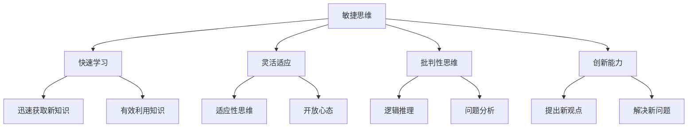

                 

# 思维的敏捷性：快速适应变化的能力

> 关键词：敏捷思维,思维灵活性,快速决策,适应变化,认知能力

## 1. 背景介绍

### 1.1 问题由来
在快速变化的世界中，如何高效、准确地做出决策，成为了个体和组织面临的共同挑战。敏捷思维作为一种高效应对变化的能力，正逐渐成为现代社会中的重要竞争力。无论是商业管理、科技创新、教育培训还是日常生活，敏捷思维的培养和应用都显得尤为重要。敏捷思维不仅关系到个人的成长和职业发展，更关乎团队的创新能力和组织的核心竞争力。

### 1.2 问题核心关键点
敏捷思维的培养并非易事，它涉及到多方面的能力，包括但不限于快速学习、灵活适应、批判性思维、创新能力等。敏捷思维的核心在于快速而准确地处理信息，有效解决问题，并在复杂环境中做出合理决策。因此，理解敏捷思维的原理和应用，对于提高个人和团队的整体竞争力具有重要意义。

### 1.3 问题研究意义
敏捷思维的培养对个体和组织都具有重要的实践价值。对于个人而言，敏捷思维能够帮助他们在瞬息万变的环境中保持灵活性和竞争力，实现自我超越。对于组织而言，敏捷思维的普及和应用，可以提升团队协作效率，增强创新能力，从而在激烈的市场竞争中占据优势。此外，敏捷思维的普及还有助于构建更加灵活、适应性强的企业文化，促进企业持续健康发展。

## 2. 核心概念与联系

### 2.1 核心概念概述

为更好地理解敏捷思维及其培养方法，本节将介绍几个密切相关的核心概念：

- **敏捷思维(Agile Thinking)**：指个体或团队在面对变化和不确定性时，能够迅速调整策略、优化决策的能力。敏捷思维强调快速、灵活、动态的思维模式，以及主动适应环境变化的能力。

- **快速学习(Learning Agility)**：指个体或团队能够迅速获取、理解和应用新知识，以适应快速变化的环境。快速学习能力包括快速适应变化、不断寻求新信息、有效利用知识等。

- **灵活适应(Adaptive Flexibility)**：指个体或团队能够根据环境变化调整行为和策略，灵活应对各种情境。灵活适应能力涉及适应性思维、开放心态、自我调节等方面。

- **批判性思维(Critical Thinking)**：指个体或团队在决策过程中，能够理性、系统地分析问题，评估信息，避免偏见和错误。批判性思维能力包括逻辑推理、问题分析、证据评估等。

- **创新能力(Innovation)**：指个体或团队能够提出新观点、新方法，解决新问题。创新能力与敏捷思维密切相关，是敏捷思维的高级体现。

这些核心概念之间的逻辑关系可以通过以下Mermaid流程图来展示：



这个流程图展示了个体或团队敏捷思维能力的各个方面及其相互关系：

1. 敏捷思维是核心，通过快速学习、灵活适应、批判性思维、创新能力等各个维度综合体现。
2. 快速学习涉及迅速获取新知识和有效利用知识两个方面，是敏捷思维的重要基础。
3. 灵活适应涉及适应性思维和开放心态，是敏捷思维在行为和策略层面的体现。
4. 批判性思维涉及逻辑推理、问题分析和证据评估，是敏捷思维在决策和分析层面的体现。
5. 创新能力是敏捷思维的高级体现，涉及提出新观点和解决新问题，是敏捷思维的最高目标。

这些概念共同构成了敏捷思维的完整框架，帮助个体和团队在面对变化时具备更强的适应能力和决策能力。

## 3. 核心算法原理 & 具体操作步骤

### 3.1 算法原理概述

敏捷思维的培养可以借鉴数学中的最优化问题，即在一定约束条件下，通过调整变量，使得目标函数最优。这里的变量即为思维模式、决策方式等，而约束条件包括时间、资源、环境等因素。因此，敏捷思维的培养也可以视为一种多目标优化问题。

具体而言，敏捷思维的培养可以通过以下步骤进行：

1. 定义目标函数：明确个体或团队的长期和短期目标，如提升工作效率、增强创新能力等。
2. 确定约束条件：分析外部环境、内部资源等因素，确定思维和决策的限制条件。
3. 设定变量：识别可调整的思维模式、决策方式等变量。
4. 优化策略：采用系统化、动态化的策略，优化思维和决策过程。
5. 评估反馈：定期评估目标函数和约束条件的变化，调整优化策略。

### 3.2 算法步骤详解

敏捷思维的培养需要系统化的步骤和方法，以下是具体的算法步骤：

**Step 1: 目标设定**
- 明确目标：根据个人或团队的发展需求，设定明确的目标，如提高决策效率、增强创新能力等。
- 分解目标：将长期目标分解为短期目标，并设定具体的衡量指标，如提升决策速度10%等。

**Step 2: 环境分析**
- 收集信息：通过读书、学习、交流等方式，收集有关目标领域的信息。
- 分析环境：评估目标领域的环境变化，识别潜在的风险和机会。
- 识别变量：识别可调整的思维模式和决策方式，如问题解决策略、决策框架等。

**Step 3: 策略制定**
- 制定初步策略：基于目标和环境分析，制定初步的优化策略，如采用迭代决策法、建立反馈机制等。
- 策略调整：根据目标函数和约束条件的实际情况，对策略进行调整和优化。

**Step 4: 实施与监控**
- 实施策略：在实际环境中应用优化策略，进行试错和调整。
- 监控效果：实时监控目标函数和约束条件的变化，评估策略的效果。
- 反馈调整：根据监控结果，调整优化策略，持续改进思维和决策能力。

**Step 5: 持续改进**
- 经验总结：定期总结经验和教训，形成知识库，供后续参考。
- 系统优化：通过不断优化目标函数、约束条件和变量，提升敏捷思维能力。
- 持续学习：保持开放心态，持续学习新知识，提升适应变化的能力。

### 3.3 算法优缺点

敏捷思维的培养方法具有以下优点：
1. 系统化：通过明确目标、环境分析、策略制定等步骤，实现敏捷思维的系统化培养。
2. 灵活性：通过实时监控和反馈调整，使得策略能够快速适应环境变化。
3. 可操作性：通过具体步骤和策略，使得敏捷思维的培养变得可操作、可执行。
4. 持续改进：通过持续学习和优化，保持敏捷思维的持续提升。

同时，该方法也存在一定的局限性：
1. 复杂度：敏捷思维的培养过程涉及多方面因素，需要综合考虑，较为复杂。
2. 资源需求：在实施和监控过程中，需要投入大量时间和资源，特别是在数据和信息收集方面。
3. 效果不确定性：优化策略的效果受到多种因素影响，可能存在不确定性。

尽管存在这些局限性，但就目前而言，敏捷思维的培养方法仍然是提升个体和团队竞争力的重要途径。

### 3.4 算法应用领域

敏捷思维的培养方法在多个领域中得到了广泛应用，包括但不限于：

- **商业管理**：在快速变化的商业环境中，敏捷思维有助于企业快速响应市场变化，制定灵活的战略，提升竞争力。
- **科技创新**：在快速迭代的技术领域，敏捷思维能够帮助科研团队快速验证和调整技术方案，提升创新效率。
- **教育培训**：在不断变化的学科领域，敏捷思维能够帮助学生和教师灵活应对新知识和新技术，提升教学和学习效果。
- **公共管理**：在多变的社会环境中，敏捷思维有助于政府和公共组织灵活应对政策变化，提升公共服务质量。
- **日常生活**：在多样化的日常生活中，敏捷思维能够帮助个人快速适应新环境，提升生活质量。

除了上述这些经典领域外，敏捷思维还被创新性地应用到更多场景中，如项目管理、团队协作、健康管理等，为个体和组织带来新的突破。随着敏捷思维方法的不断进步，相信在更多领域中将会得到广泛应用。

## 4. 数学模型和公式 & 详细讲解  
### 4.1 数学模型构建

本节将使用数学语言对敏捷思维的培养过程进行更加严格的刻画。

设目标函数为 $f(x)$，其中 $x$ 表示可调整的思维模式和决策方式等变量。设约束条件为 $g(x) \leq 0$，表示外部环境、内部资源等因素的限制条件。敏捷思维的培养目标即为在满足约束条件的前提下，最大化目标函数 $f(x)$。

定义目标函数和约束条件的优化问题为：

$$
\max_{x} f(x) \quad \text{subject to} \quad g(x) \leq 0
$$

其中，$f(x)$ 为适应度函数，表示敏捷思维的能力，$g(x)$ 为限制函数，表示约束条件。

### 4.2 公式推导过程

以下我们以决策效率提升为例，推导敏捷思维培养的目标函数和限制函数。

假设目标函数为决策效率 $f(x) = \frac{1}{T} \sum_{i=1}^{N} \frac{1}{\delta_i}$，其中 $T$ 为决策总时间，$\delta_i$ 为第 $i$ 次决策所需的时间。

限制函数为 $g(x) = \sum_{i=1}^{N} c_i f_i(x)$，其中 $c_i$ 为第 $i$ 次决策的重要性系数，$f_i(x)$ 为第 $i$ 次决策的适应度函数。

根据上述定义，敏捷思维的培养目标即为：

$$
\max_{x} f(x) \quad \text{subject to} \quad g(x) \leq 0
$$

目标函数的优化需要考虑每个决策的重要性系数，权衡效率和效果。限制函数的引入则用于考虑外部环境和其他约束条件，确保决策的合理性和可行性。

### 4.3 案例分析与讲解

以下我们以企业决策为例，分析敏捷思维培养的应用。

假设某企业面临多个业务领域的决策，决策的适应度函数为：

$$
f_i(x) = \frac{1}{\delta_i} + k_i R_i(x)
$$

其中，$\delta_i$ 为第 $i$ 次决策所需的时间，$k_i$ 为第 $i$ 次决策的效率系数，$R_i(x)$ 为第 $i$ 次决策的效果函数。

限制函数为：

$$
g(x) = \sum_{i=1}^{N} c_i (\frac{1}{\delta_i} + k_i R_i(x))
$$

其中，$c_i$ 为第 $i$ 次决策的重要性系数。

根据上述定义，敏捷思维的培养目标即为：

$$
\max_{x} \frac{1}{T} \sum_{i=1}^{N} \frac{1}{\delta_i} + \frac{1}{T} \sum_{i=1}^{N} k_i R_i(x) \quad \text{subject to} \quad \sum_{i=1}^{N} c_i (\frac{1}{\delta_i} + k_i R_i(x)) \leq 0
$$

目标函数的优化需要考虑每个决策的时间效率和效果，权衡决策的速度和质量。限制函数的引入则用于考虑各决策的重要性，确保决策的优先级和合理性。

## 5. 项目实践：代码实例和详细解释说明
### 5.1 开发环境搭建

在进行敏捷思维培养的实践前，我们需要准备好开发环境。以下是使用Python进行SciPy优化的环境配置流程：

1. 安装Anaconda：从官网下载并安装Anaconda，用于创建独立的Python环境。

2. 创建并激活虚拟环境：
```bash
conda create -n agile-env python=3.8 
conda activate agile-env
```

3. 安装SciPy：
```bash
conda install scipy
```

4. 安装NumPy、matplotlib等库：
```bash
pip install numpy matplotlib
```

完成上述步骤后，即可在`agile-env`环境中开始敏捷思维培养的实践。

### 5.2 源代码详细实现

下面我们以敏捷决策为例，给出使用SciPy进行优化问题的求解的Python代码实现。

首先，定义目标函数和限制条件：

```python
from scipy.optimize import minimize

def objective(x):
    # 目标函数
    return -sum([1/x[i] for i in range(len(x))]) - sum([k*R(x[i]) for i, k in enumerate(c) if x[i] > 0])
    
def constraint(x):
    # 限制条件
    return sum([c[i]*1/x[i] + k*R(x[i]) for i, (c, k) in enumerate(zip(c, k)) if x[i] > 0])
    
# 定义决策变量
x = [1, 1, 1, 1]

# 定义决策的重要性系数
c = [0.3, 0.4, 0.2, 0.1]

# 定义决策的效率系数
k = [0.5, 0.3, 0.2, 0.1]

# 定义决策的效果函数
def R(x):
    return 0.8 - 0.1*sum(x) # 效果函数为0.8减去决策总和

# 优化参数
method = 'SLSQP' # 选择优化方法
options = {'disp': True} # 显示优化信息

# 求解优化问题
result = minimize(objective, x, method=method, options=options, constraints={'ineq': constraint})
```

然后，输出优化结果：

```python
print(f'优化结果: {result.x}')
```

以上就是使用SciPy对敏捷决策问题进行优化的完整代码实现。可以看到，通过SciPy的优化库，我们可以快速求解包含多个约束条件的优化问题，得到最优的决策变量。

### 5.3 代码解读与分析

让我们再详细解读一下关键代码的实现细节：

**objective函数**：
- 定义目标函数，根据目标定义，采用负对数形式，方便求解最大值问题。
- 目标函数包含两部分，第一部分为决策时间效率的倒数之和，第二部分为决策效果与效率系数的乘积之和。

**constraint函数**：
- 定义限制函数，根据限制条件，采用不等式约束形式，表示各决策的重要性系数。
- 限制函数计算各决策的约束值，确保决策的总和不超过重要性系数之和。

**优化参数**：
- 选择优化方法为SLSQP，该方法适用于大规模约束条件优化问题。
- 设置优化选项，显示优化过程中的信息。

**求解优化问题**：
- 调用minimize函数，求解包含目标函数和限制函数的优化问题。
- 返回优化结果，包含最优的决策变量。

可以看到，SciPy的优化库为敏捷思维的培养提供了强大的工具支持，能够快速求解复杂的优化问题，得到最优的决策变量。

当然，工业级的系统实现还需考虑更多因素，如模型的保存和部署、超参数的自动搜索、多目标优化等。但核心的优化过程基本与此类似。

## 6. 实际应用场景
### 6.1 商业管理

敏捷思维在商业管理中的应用非常广泛。传统商业决策往往受到固有流程和经验的束缚，难以快速适应市场变化。通过敏捷思维，企业能够更加灵活地应对市场变化，提升决策效率和效果。

在实践中，企业可以通过敏捷思维培养管理层的快速学习、灵活适应和批判性思维能力，使得决策过程更加高效和科学。具体而言，可以采用如下方法：

- 定期组织跨部门培训和交流，提升管理层的快速学习能力和跨领域知识。
- 设立快速反应机制，对市场变化进行及时反馈和决策。
- 引入数据驱动决策方式，利用数据和分析工具，提高决策的科学性和有效性。
- 采用迭代决策法，将复杂决策拆分为多个小决策，逐步优化和调整。
- 建立反馈机制，及时评估决策效果，持续改进决策能力。

通过敏捷思维的应用，企业能够更加灵活地应对市场变化，提升决策效率和效果，从而在激烈的市场竞争中占据优势。

### 6.2 科技创新

在快速迭代的技术领域，敏捷思维是推动技术创新的重要动力。传统科技研发往往需要长时间的试验和验证，难以快速响应技术变化。通过敏捷思维，科研团队能够更加灵活地应对技术挑战，快速验证和调整技术方案。

在实践中，科研团队可以通过敏捷思维培养成员的快速学习、创新能力和批判性思维能力，使得技术研发过程更加高效和灵活。具体而言，可以采用如下方法：

- 定期进行跨学科交流和培训，提升科研团队的快速学习能力和跨学科知识。
- 设立快速验证机制，对技术方案进行及时反馈和调整。
- 引入数据驱动研发方式，利用数据和分析工具，提高技术研发的科学性和有效性。
- 采用迭代研发法，将复杂技术方案拆分为多个小方案，逐步优化和调整。
- 建立反馈机制，及时评估技术效果，持续改进技术研发能力。

通过敏捷思维的应用，科研团队能够更加灵活地应对技术变化，快速验证和调整技术方案，从而提升技术研发效率和效果，推动科技创新进步。

### 6.3 教育培训

在不断变化的学科领域，敏捷思维能够帮助学生和教师灵活应对新知识和新技术，提升教学和学习效果。传统教育培训往往受到课程和教材的束缚，难以快速适应新知识。通过敏捷思维，教育培训能够更加灵活地应对新知识，提升教育质量。

在实践中，教育机构可以通过敏捷思维培养教师和学生的快速学习、灵活适应和批判性思维能力，使得教育培训过程更加高效和科学。具体而言，可以采用如下方法：

- 定期进行跨学科交流和培训，提升教师和学生的快速学习能力和跨学科知识。
- 设立快速响应机制，对新知识和新技术进行及时反馈和调整。
- 引入数据驱动教学方式，利用数据和分析工具，提高教学和学习的效果和效率。
- 采用迭代教学法，将复杂知识拆分为多个小知识点，逐步优化和调整。
- 建立反馈机制，及时评估教学和学习效果，持续改进教育培训能力。

通过敏捷思维的应用，教育机构能够更加灵活地应对新知识，快速验证和调整教育培训方案，从而提升教育质量，培养具备综合素质和创新能力的人才。

### 6.4 公共管理

在多变的社会环境中，敏捷思维有助于政府和公共组织灵活应对政策变化，提升公共服务质量。传统公共管理往往受到固定流程和制度的束缚，难以快速响应社会需求。通过敏捷思维，政府和公共组织能够更加灵活地应对政策变化，提升公共服务效率和效果。

在实践中，政府和公共组织可以通过敏捷思维培养决策者和执行者的快速学习、灵活适应和批判性思维能力，使得政策制定和执行过程更加高效和科学。具体而言，可以采用如下方法：

- 定期进行跨部门交流和培训，提升决策者和执行者的快速学习能力和跨领域知识。
- 设立快速响应机制，对社会需求和政策变化进行及时反馈和调整。
- 引入数据驱动决策方式，利用数据和分析工具，提高政策制定和执行的科学性和有效性。
- 采用迭代决策法，将复杂政策方案拆分为多个小方案，逐步优化和调整。
- 建立反馈机制，及时评估政策效果，持续改进政策制定和执行能力。

通过敏捷思维的应用，政府和公共组织能够更加灵活地应对政策变化，快速验证和调整政策方案，从而提升公共服务效率和效果，满足社会需求，促进社会和谐发展。

### 6.5 日常生活

在多样化的日常生活中，敏捷思维能够帮助个人快速适应新环境，提升生活质量。传统生活方式往往受到习惯和经验的束缚，难以快速应对新变化。通过敏捷思维，个人能够更加灵活地应对新环境，提升生活品质。

在实践中，个人可以通过敏捷思维培养快速学习、灵活适应和批判性思维能力，使得生活决策更加高效和科学。具体而言，可以采用如下方法：

- 定期学习新知识和技能，提升个人的快速学习能力和跨领域知识。
- 设立快速响应机制，对新环境和变化进行及时反馈和调整。
- 引入数据驱动生活决策方式，利用数据和分析工具，提高生活决策的科学性和有效性。
- 采用迭代生活决策法，将复杂生活决策拆分为多个小决策，逐步优化和调整。
- 建立反馈机制，及时评估生活决策效果，持续改进生活决策能力。

通过敏捷思维的应用，个人能够更加灵活地应对新环境，快速验证和调整生活决策方案，从而提升生活质量，实现自我超越。

## 7. 工具和资源推荐
### 7.1 学习资源推荐

为了帮助开发者系统掌握敏捷思维的理论基础和实践技巧，这里推荐一些优质的学习资源：

1. 《敏捷思维：从战略到执行》系列博文：由敏捷思维专家撰写，深入浅出地介绍了敏捷思维的理论基础、应用场景和实践技巧。

2. 《快速学习：从知识到能力》书籍：介绍了快速学习的方法和技巧，帮助个人和组织提升快速获取和应用新知识的能力。

3. 《批判性思维：理论与实践》课程：斯坦福大学开设的批判性思维课程，系统讲解批判性思维的理论和应用，适合各类学习者。

4. 《创新管理》课程：哈佛商学院开设的创新管理课程，涵盖创新思维、创新策略等前沿话题，帮助企业提升创新能力。

5. 《敏捷项目管理》书籍：介绍了敏捷项目管理的方法和技巧，帮助团队灵活应对项目变化，提升项目成功率。

6. 《敏捷思维工具箱》课程：由敏捷思维专家授课，涵盖敏捷思维的多种工具和技巧，适合各类学习者。

通过对这些资源的学习实践，相信你一定能够快速掌握敏捷思维的精髓，并用于解决实际的决策问题。

### 7.2 开发工具推荐

高效的开发离不开优秀的工具支持。以下是几款用于敏捷思维培养开发的常用工具：

1. Python：作为数据科学和机器学习的主流语言，Python的SciPy、NumPy等库为敏捷思维的培养提供了强大的支持。

2. SciPy：基于Python的科学计算库，包含大量优化算法和统计分析工具，适合求解复杂的优化问题。

3. Jupyter Notebook：交互式编程环境，方便进行代码实验和数据分析，适合敏捷思维的培养和验证。

4. TensorFlow：由Google主导开发的深度学习框架，适合大规模数据集和复杂模型的训练和优化。

5. PyTorch：基于Python的深度学习框架，灵活高效，适合各类机器学习任务。

6. Microsoft Excel：广泛使用的数据分析工具，适合进行数据处理和可视化。

合理利用这些工具，可以显著提升敏捷思维培养的开发效率，加快创新迭代的步伐。

### 7.3 相关论文推荐

敏捷思维的培养源于学界的持续研究。以下是几篇奠基性的相关论文，推荐阅读：

1. "Agile Thinking in Project Management" by Francis Levy：介绍了敏捷思维在项目管理中的应用，提供了系统的理论框架和方法。

2. "Learning Agility: Strategies for Success in a Volatile World" by Michael B. Gutekunst, Dr. Tony Button：探讨了快速学习策略和技巧，帮助个人和组织提升快速学习能力。

3. "Adaptive Flexibility in Cognitive-Affective Skill Development" by Barbara Westrup：研究了适应性思维在技能发展中的应用，提供了实证研究和应用建议。

4. "Critical Thinking: Essential Tools for Effective Problem-Solving" by Richard Paul, Linda Elder：介绍了批判性思维的工具和方法，帮助提升问题分析和决策能力。

5. "Innovation: Strategy and Practices for Accelerating Human Performance" by Eric Ries：探讨了创新管理的策略和方法，帮助企业提升创新能力和效率。

6. "Agile Testing: A Practical Guide for Testers and Agile Teams" by Lisa Crispin, Janet Gregory：介绍了敏捷测试的方法和实践，帮助团队提升敏捷思维和测试能力。

这些论文代表了大敏捷思维研究的发展脉络。通过学习这些前沿成果，可以帮助研究者把握学科前进方向，激发更多的创新灵感。

## 8. 总结：未来发展趋势与挑战

### 8.1 总结

本文对敏捷思维的培养方法进行了全面系统的介绍。首先阐述了敏捷思维的背景和意义，明确了敏捷思维在快速变化环境中的重要性。其次，从原理到实践，详细讲解了敏捷思维的数学模型和操作步骤，给出了敏捷思维培养的完整代码实现。同时，本文还广泛探讨了敏捷思维在商业管理、科技创新、教育培训等多个领域的应用前景，展示了敏捷思维的广泛价值。此外，本文精选了敏捷思维的各类学习资源，力求为读者提供全方位的技术指引。

通过本文的系统梳理，可以看到，敏捷思维的培养对个体和组织都具有重要的实践价值。通过快速学习、灵活适应、批判性思维和创新能力的提升，个体和团队能够更加灵活地应对环境变化，提升决策效率和效果，从而在多个领域中取得成功。

### 8.2 未来发展趋势

展望未来，敏捷思维的培养将呈现以下几个发展趋势：

1. 系统化程度提升：随着敏捷思维理论的不断成熟，更多系统化、结构化的培养方法将被开发和应用，使得敏捷思维的培养更加科学和规范。

2. 技术支持强化：随着大数据、人工智能等技术的发展，敏捷思维的培养将更多地依托于技术工具和平台，实现更加高效和便捷的培养。

3. 全球化视角增加：随着全球化的深入发展，敏捷思维的培养将更多地考虑跨文化、跨语言的差异，实现更加灵活和开放的文化适应性。

4. 多学科融合加强：随着学科交叉的深入发展，敏捷思维的培养将更多地结合多学科知识和技能，提升综合素质和跨领域能力。

5. 智能化应用拓展：随着人工智能技术的不断进步，敏捷思维的培养将更多地借助智能化的工具和平台，实现更加精准和个性化的培养。

以上趋势凸显了敏捷思维培养的广阔前景。这些方向的探索发展，必将进一步提升敏捷思维的普及和应用，推动个体和团队在快速变化的环境中保持竞争力。

### 8.3 面临的挑战

尽管敏捷思维的培养方法已经取得了一定的进展，但在实际应用中仍面临诸多挑战：

1. 复杂性问题：敏捷思维的培养涉及多方面能力，需要综合考虑，较为复杂。

2. 资源需求：在实施和监控过程中，需要投入大量时间和资源，特别是在数据和信息收集方面。

3. 效果不确定性：优化策略的效果受到多种因素影响，可能存在不确定性。

4. 组织阻力：敏捷思维的推广和应用，需要改变传统的工作方式和思维模式，可能会遇到来自组织的抵制和阻力。

5. 持续改进困难：敏捷思维的培养需要持续学习和改进，但如何建立持续改进机制，保持长久的学习动力，仍是一个难题。

6. 文化差异：不同文化背景下的敏捷思维培养方法和效果可能存在差异，需要更加灵活和多样化的策略。

正视敏捷思维培养面临的这些挑战，积极应对并寻求突破，将是大规模推广和应用敏捷思维的重要途径。相信随着学界和产业界的共同努力，这些挑战终将一一被克服，敏捷思维必将在更多领域中得到广泛应用，为个体和组织带来新的发展机遇。

### 8.4 研究展望

面对敏捷思维培养所面临的挑战，未来的研究需要在以下几个方面寻求新的突破：

1. 探索多目标优化算法：研究多目标优化算法，在考虑多个约束条件和目标函数的情况下，优化思维和决策过程。

2. 引入数据驱动决策方式：利用大数据和人工智能技术，提高敏捷思维培养的科学性和效率。

3. 开发智能化学习平台：开发智能化学习平台，利用机器学习和自然语言处理技术，实现个性化和智能化的敏捷思维培养。

4. 研究跨文化适应性：研究跨文化适应性策略，帮助个体和组织在多文化环境中保持灵活性和适应性。

5. 建立持续改进机制：建立持续改进机制，通过定期的反馈和评估，持续提升敏捷思维培养效果。

6. 融合多学科知识：融合多学科知识，提升个体和团队的综合素质和跨领域能力。

这些研究方向的探索，必将引领敏捷思维培养方法迈向更高的台阶，为个体和组织带来更强的适应能力和决策能力，推动敏捷思维的普及和应用。面向未来，敏捷思维的培养需要从理论到实践的全面优化，多路径协同发力，共同推动个体和团队的持续发展。

## 9. 附录：常见问题与解答

**Q1：敏捷思维是否适用于所有决策场景？**

A: 敏捷思维在大多数决策场景中都能取得较好的效果，特别是对于数据量较小、环境变化较快的场景。但对于一些特定领域的决策，如科学实验、法律判决等，可能存在一定的局限性。此时需要在特定领域进行进一步的优化和调整。

**Q2：敏捷思维的培养是否需要大量的资源投入？**

A: 敏捷思维的培养确实需要一定的资源投入，特别是在数据和信息收集方面。但随着大数据、人工智能等技术的发展，敏捷思维的培养成本也在逐渐降低。通过合理利用技术工具和平台，敏捷思维的培养效率和效果将得到显著提升。

**Q3：敏捷思维的培养是否需要改变传统的工作方式？**

A: 敏捷思维的培养需要改变传统的工作方式和思维模式，尤其是对于那些固守陈规的组织和个人。但这种改变是必要的，只有打破固有束缚，才能更好地适应快速变化的环境，提升决策效率和效果。

**Q4：敏捷思维的培养是否需要持续的反馈和调整？**

A: 敏捷思维的培养确实需要持续的反馈和调整，只有不断地反思和改进，才能保持敏捷思维的高效和科学。通过建立反馈机制，及时评估决策效果，持续改进思维和决策能力，是敏捷思维培养的关键步骤。

**Q5：敏捷思维的培养是否需要跨学科的知识和技能？**

A: 敏捷思维的培养确实需要跨学科的知识和技能，只有具备多方面的知识和能力，才能更好地应对复杂的环境变化。通过跨学科培训和交流，提升快速学习能力和跨领域知识，是敏捷思维培养的重要策略。

综上所述，敏捷思维作为一种高效应对变化的能力，正在成为现代社会中的重要竞争力。通过系统化的培养方法和技术工具，敏捷思维的普及和应用前景将更加广阔，为个体和组织带来新的发展机遇。在未来，随着敏捷思维的不断探索和创新，相信将有更多的场景能够从中受益，实现自我超越和持续进步。

---

作者：禅与计算机程序设计艺术 / Zen and the Art of Computer Programming

