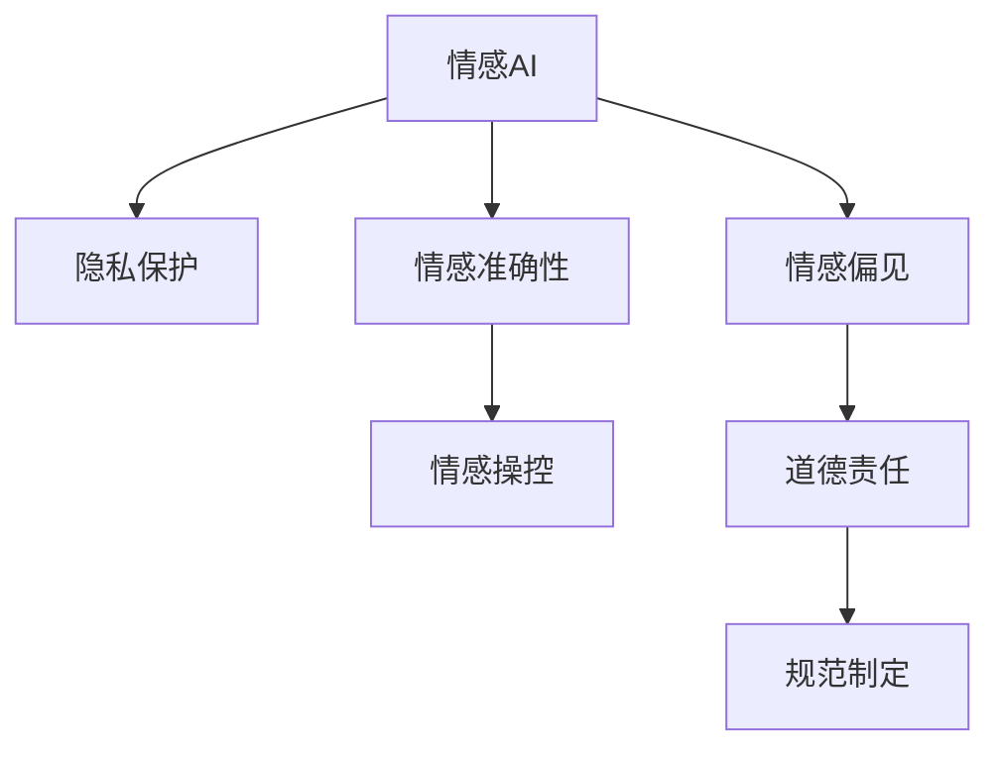

                 

## 1. 背景介绍

### 1.1 问题由来

随着人工智能技术的不断进步，情感AI（Affective AI）技术在客服、营销、娱乐等多个领域得到了广泛应用。情感AI通过分析人类的语言、行为等数据，可以识别和响应人们的情感状态，为用户提供更个性化的服务。然而，情感AI技术的快速发展也带来了诸多伦理和道德问题，引发了公众和学界的广泛关注。

### 1.2 问题核心关键点

情感AI伦理问题主要集中在以下几个方面：

- **隐私保护**：情感AI需要处理大量的个人信息，如何在保护用户隐私的同时，获取和利用这些信息，是一个重要问题。
- **情感准确性**：情感AI的情感识别能力是否准确，是否可能误判用户的真实情感，对用户造成误导或伤害。
- **情感操控**：情感AI是否可能被用于操控用户的情感，例如在广告、社交媒体等场景中，通过精准的情绪触达，操纵用户的行为和决策。
- **情感偏见**：情感AI的训练数据可能存在偏见，如何避免这些偏见传递到模型中，影响模型的公平性和可靠性。
- **道德责任**：情感AI系统在出现误判或负面影响时，谁应该承担责任，如何定义情感AI的道德边界。

### 1.3 问题研究意义

研究情感AI伦理问题，对于推动情感AI技术的健康发展，保护用户权益，提升公众信任度具有重要意义：

- **促进技术进步**：明确情感AI的伦理边界，有助于研究人员在技术开发中更加注重数据隐私、算法公平等伦理问题，推动情感AI技术的进步。
- **保护用户权益**：情感AI涉及到大量个人数据，研究其伦理问题，有助于制定合理的隐私保护政策，确保用户的隐私权益不被侵犯。
- **提升社会信任**：明确情感AI的道德边界，有助于公众了解和接受情感AI技术，提升对技术的信任度。
- **规范行业发展**：制定情感AI伦理规范，有助于引导行业健康发展，避免误导性应用和不良影响。

## 2. 核心概念与联系

### 2.1 核心概念概述

为了更好地理解情感AI的伦理问题，本节将介绍几个关键概念及其之间的联系：

- **情感AI（Affective AI）**：通过分析人类的语言、行为等数据，识别和响应情感状态的人工智能系统。
- **隐私保护**：确保用户在情感AI系统中，其个人信息不被泄露或滥用的措施。
- **情感准确性**：情感AI准确识别和理解用户情感状态的能力。
- **情感操控**：利用情感AI技术，操控用户情感状态，影响其行为和决策的行为。
- **情感偏见**：由于训练数据存在偏见，导致情感AI模型在识别情感时，可能表现出系统性偏差。
- **道德责任**：情感AI在出现误判或负面影响时，应由谁承担责任，如何定义其道德边界。

这些核心概念之间存在紧密的联系，共同构成了情感AI伦理问题的研究框架。

### 2.2 核心概念原理和架构的 Mermaid 流程图



这个流程图展示了情感AI系统的核心概念及其之间的联系。情感AI系统的输入包括语音、文本、图像等多种数据形式，通过算法处理后，输出用户的情感状态，进而进行个性化服务和决策。隐私保护、情感准确性、情感操控、情感偏见和道德责任是情感AI系统需要重点考虑的伦理问题，规范制定是确保系统公平、透明、可控的重要手段。

## 3. 核心算法原理 & 具体操作步骤

### 3.1 算法原理概述

情感AI的伦理问题涉及多个方面，其核心算法原理可以概括为以下几点：

1. **隐私保护**：通过差分隐私、联邦学习等技术，保护用户数据隐私。
2. **情感准确性**：通过多模态融合、深度学习等方法，提升情感识别的准确性。
3. **情感操控**：通过透明化机制、算法审查等手段，防止情感AI被滥用。
4. **情感偏见**：通过数据清洗、公平性检测等方法，消除训练数据中的偏见。
5. **道德责任**：通过责任追溯、法规监管等措施，确保情感AI系统的道德边界。

### 3.2 算法步骤详解

**Step 1: 数据收集与处理**

- **隐私保护**：采用差分隐私技术，对用户的个人信息进行加密处理，确保数据匿名化。
- **情感准确性**：收集大量的情感标签数据，并对其进行标注和处理，用于训练情感AI模型。
- **情感操控**：收集用户对情感AI的反馈数据，用于评估系统的操控效果。
- **情感偏见**：分析训练数据中的社会偏见和性别偏见，并进行处理。

**Step 2: 模型训练与优化**

- **情感准确性**：使用多模态融合、深度学习等技术，训练情感AI模型，提升情感识别的准确性。
- **情感操控**：设计透明化机制，公开情感AI的决策过程，确保用户知情权。
- **情感偏见**：在模型训练过程中，使用公平性检测技术，消除训练数据中的系统性偏见。

**Step 3: 系统部署与监控**

- **道德责任**：明确情感AI系统的使用场景和责任主体，制定责任追溯机制。
- **规范制定**：根据伦理原则和法律法规，制定情感AI系统的使用规范和行为准则。

### 3.3 算法优缺点

情感AI伦理问题处理算法的优缺点如下：

**优点**：

- **隐私保护**：通过差分隐私等技术，保护用户数据隐私，避免数据泄露。
- **情感准确性**：采用多模态融合、深度学习等技术，提升情感识别的准确性，避免误判。
- **情感操控**：透明化机制和算法审查，防止情感AI被滥用，保护用户权益。
- **情感偏见**：数据清洗和公平性检测，消除训练数据中的偏见，确保模型的公平性。
- **道德责任**：责任追溯和法规监管，确保情感AI系统的道德边界，增强用户信任。

**缺点**：

- **隐私保护**：差分隐私等技术可能会增加计算复杂度，影响数据处理速度。
- **情感准确性**：多模态融合和深度学习技术需要大量的数据和计算资源，提高系统成本。
- **情感操控**：透明化机制和算法审查可能增加系统复杂度，降低用户使用体验。
- **情感偏见**：数据清洗和公平性检测可能难以完全消除系统性偏见，影响模型公平性。
- **道德责任**：责任追溯和法规监管需要协调多方利益，增加系统设计和运营的复杂性。

### 3.4 算法应用领域

情感AI伦理问题处理算法在以下几个领域得到了广泛应用：

1. **客服系统**：通过分析用户的情感状态，提供个性化服务，提升用户满意度。
2. **广告营销**：通过识别用户的情感倾向，精准推送广告内容，提升广告效果。
3. **娱乐产品**：通过分析用户的情感反馈，优化游戏、音乐、影视等娱乐产品的设计，提升用户体验。
4. **社交媒体**：通过情感分析，识别和处理恶意言论，维护网络环境的安全和和谐。

## 4. 数学模型和公式 & 详细讲解 & 举例说明

### 4.1 数学模型构建

情感AI伦理问题的数学模型构建主要涉及以下几个方面：

- **隐私保护**：采用差分隐私技术，确保数据匿名化。
- **情感准确性**：使用多模态融合、深度学习等技术，训练情感识别模型。
- **情感操控**：设计透明化机制，公开情感AI的决策过程。
- **情感偏见**：使用公平性检测技术，消除训练数据中的系统性偏见。
- **道德责任**：定义情感AI系统的使用场景和责任主体，制定责任追溯机制。

### 4.2 公式推导过程

以隐私保护为例，差分隐私技术通过添加噪声，确保对数据的处理不会影响其分布特征。具体公式如下：

$$
\mathcal{L}(\epsilon) = \frac{1}{\epsilon} W(\Delta P)
$$

其中，$\epsilon$ 为隐私保护参数，$W$ 为拉普拉斯机制的加噪声函数，$\Delta P$ 为原始数据分布与处理后数据分布的差异。

### 4.3 案例分析与讲解

**案例1: 客服系统中的隐私保护**

在客服系统中，情感AI需要处理大量的用户对话数据，以识别和响应用户的情感状态。为了保护用户隐私，可以采用差分隐私技术，对用户的对话数据进行匿名化处理。具体步骤为：

1. 对用户的对话数据进行匿名化处理，去除用户的身份信息。
2. 在模型训练过程中，添加噪声，确保处理后的数据不会影响情感识别的准确性。
3. 在情感识别的输出中，不包含任何用户身份信息，确保用户隐私不被泄露。

**案例2: 广告营销中的情感操控**

在广告营销中，情感AI可以通过识别用户的情感状态，精准推送广告内容。为了保护用户权益，可以设计透明化机制，公开情感AI的决策过程，确保用户知情权。具体步骤为：

1. 对用户的情感状态进行分析，识别其兴趣点和情感倾向。
2. 根据用户的情感状态，推荐相应的广告内容。
3. 公开情感AI的决策过程，包括数据来源、模型参数、推荐算法等，确保用户知情权。

## 5. 项目实践：代码实例和详细解释说明

### 5.1 开发环境搭建

在进行情感AI伦理问题处理实践前，我们需要准备好开发环境。以下是使用Python进行TensorFlow开发的环境配置流程：

1. 安装Anaconda：从官网下载并安装Anaconda，用于创建独立的Python环境。

2. 创建并激活虚拟环境：
```bash
conda create -n tf-env python=3.8 
conda activate tf-env
```

3. 安装TensorFlow：根据CUDA版本，从官网获取对应的安装命令。例如：
```bash
conda install tensorflow-gpu=cuda11.1
```

4. 安装PyTorch和其他必要工具包：
```bash
pip install numpy pandas scikit-learn matplotlib tqdm jupyter notebook ipython
```

完成上述步骤后，即可在`tf-env`环境中开始情感AI伦理问题处理实践。

### 5.2 源代码详细实现

这里我们以情感AI隐私保护为例，给出使用TensorFlow实现差分隐私的代码实现。

```python
import tensorflow as tf
from tensorflow.keras.datasets import mnist
from tensorflow.keras.layers import Dense, Flatten
from tensorflow.keras import Model

# 加载MNIST数据集
(x_train, y_train), (x_test, y_test) = mnist.load_data()

# 数据预处理
x_train = x_train.reshape(-1, 28*28).astype('float32') / 255.0
x_test = x_test.reshape(-1, 28*28).astype('float32') / 255.0

# 定义模型
model = Model(inputs=x_train, outputs=y_train)
model.compile(optimizer='adam', loss='sparse_categorical_crossentropy', metrics=['accuracy'])

# 定义差分隐私参数
epsilon = 1.0
delta = 1e-5

# 定义差分隐私函数
def dp_data(data, epsilon, delta):
    n = data.shape[0]
    sigma = (epsilon * np.sqrt(2 * np.log(1 / delta))) / n
    noisy_data = np.random.normal(0, sigma, size=(n, data.shape[1]))
    noisy_data += data
    return noisy_data

# 应用差分隐私
noisy_x_train = dp_data(x_train, epsilon, delta)
noisy_x_test = dp_data(x_test, epsilon, delta)

# 训练模型
model.fit(noisy_x_train, y_train, epochs=10, batch_size=64)
```

以上就是使用TensorFlow对MNIST数据集进行差分隐私处理的代码实现。可以看到，TensorFlow提供了差分隐私的接口，方便开发者在模型训练中直接应用差分隐私技术。

### 5.3 代码解读与分析

让我们再详细解读一下关键代码的实现细节：

**隐私保护代码**：

- `mnist.load_data()`：加载MNIST数据集，用于训练情感AI模型。
- `x_train = x_train.reshape(-1, 28*28).astype('float32') / 255.0`：对训练数据进行归一化处理。
- `model = Model(inputs=x_train, outputs=y_train)`：定义情感AI模型的输入和输出。
- `model.compile(optimizer='adam', loss='sparse_categorical_crossentropy', metrics=['accuracy'])`：编译模型，设置优化器和损失函数。
- `epsilon = 1.0`：隐私保护参数，控制噪声添加的强度。
- `delta = 1e-5`：差分隐私的容忍度参数，控制隐私保护的精度。
- `def dp_data(data, epsilon, delta)`：定义差分隐私函数，对数据添加噪声。
- `noisy_x_train = dp_data(x_train, epsilon, delta)`：对训练数据应用差分隐私，生成噪声数据。

可以看到，差分隐私技术通过添加噪声，确保数据处理不会影响其分布特征，从而保护用户隐私。在TensorFlow中，差分隐私技术被设计为函数接口，方便开发者在模型训练中直接应用。

当然，实际应用中还需要考虑更多因素，如数据处理速度、模型复杂度等。但核心的差分隐私技术基本与此类似。

## 6. 实际应用场景

### 6.1 客户服务系统

情感AI在客户服务系统中具有广泛的应用前景。情感AI可以通过分析用户的语音、文本等数据，识别和响应用户的情感状态，提供个性化的服务。然而，在客户服务系统中，情感AI也需要严格遵守隐私保护原则，确保用户数据的安全和隐私。

具体而言，情感AI系统应采用差分隐私技术，对用户的个人信息进行匿名化处理，避免数据泄露。同时，情感AI系统应设计透明化机制，公开情感AI的决策过程，确保用户知情权。这样，既能保护用户隐私，又能提升用户的信任度和满意度。

### 6.2 广告营销

情感AI在广告营销中的应用，可以通过识别用户的情感状态，精准推送广告内容，提升广告效果。然而，情感AI在广告营销中的应用也需注意情感操控问题，确保广告内容的健康和合法性。

具体而言，情感AI系统应设计透明化机制，公开情感AI的决策过程，确保广告内容的透明性和合法性。同时，情感AI系统应遵循公平性原则，避免对特定用户群体进行过度营销，保护用户的权益。这样，既能提升广告效果，又能避免潜在的伦理问题。

### 6.3 娱乐产品

情感AI在娱乐产品中的应用，可以通过分析用户的情感反馈，优化游戏、音乐、影视等娱乐产品的设计，提升用户体验。然而，情感AI在娱乐产品中的应用也需注意情感操控问题，确保用户情感的健康和合法性。

具体而言，情感AI系统应设计透明化机制，公开情感AI的决策过程，确保用户知情权。同时，情感AI系统应遵循公平性原则，避免对特定用户群体进行过度干预，保护用户的权益。这样，既能提升娱乐产品的用户体验，又能避免潜在的伦理问题。

### 6.4 社交媒体

情感AI在社交媒体中的应用，可以通过识别和处理恶意言论，维护网络环境的安全和和谐。然而，情感AI在社交媒体中的应用也需注意隐私保护问题，确保用户数据的安全和隐私。

具体而言，情感AI系统应采用差分隐私技术，对用户的个人信息进行匿名化处理，避免数据泄露。同时，情感AI系统应设计透明化机制，公开情感AI的决策过程，确保用户知情权。这样，既能保护用户隐私，又能提升用户对情感AI系统的信任度和满意度。

## 7. 工具和资源推荐

### 7.1 学习资源推荐

为了帮助开发者系统掌握情感AI伦理问题的处理，这里推荐一些优质的学习资源：

1. **《深度学习入门》**：这本书由李宏毅教授编写，系统介绍了深度学习的基础理论和应用实践，包括情感AI中的隐私保护、情感操控等伦理问题。

2. **《机器学习实战》**：这本书由Peter Harrington编写，介绍了机器学习的基本算法和应用实践，包括情感AI中的情感准确性、情感偏见等伦理问题。

3. **Google AI博客**：Google AI博客涵盖了大量关于情感AI伦理问题的文章，介绍了最新的研究成果和技术实践，具有很高的参考价值。

4. **IEEE Transactions on Neural Networks and Learning Systems**：这是一本权威的神经网络和机器学习期刊，发表了大量关于情感AI伦理问题的学术论文，有助于深入了解相关领域的研究进展。

通过对这些资源的学习实践，相信你一定能够系统掌握情感AI伦理问题的处理方法和技术细节。

### 7.2 开发工具推荐

情感AI伦理问题处理的开发，通常需要借助强大的数据处理和模型训练工具。以下是几款常用的工具：

1. **TensorFlow**：由Google开发的深度学习框架，支持差分隐私等隐私保护技术，适合大规模数据处理和模型训练。

2. **PyTorch**：由Facebook开发的深度学习框架，支持多模态融合和深度学习等技术，适合快速迭代研究。

3. **Scikit-learn**：基于Python的机器学习库，提供了多种模型评估和公平性检测技术，适合对模型进行评估和优化。

4. **Jupyter Notebook**：一个交互式的Python开发环境，支持代码块、图形和文档的混合展示，方便开发者进行实验和协作。

5. **Gym**：一个开源的强化学习库，支持情感AI系统中的智能决策和行为训练，适合对模型进行优化和改进。

合理利用这些工具，可以显著提升情感AI伦理问题处理的开发效率，加快创新迭代的步伐。

### 7.3 相关论文推荐

情感AI伦理问题处理的研究源于学界的持续探索。以下是几篇奠基性的相关论文，推荐阅读：

1. **《差分隐私》**：由Shafi Goldwasser等人编写，介绍了差分隐私的基本概念和应用实践，为情感AI中的隐私保护提供了理论支持。

2. **《公平性检测与优化》**：由Bolukbasi等人编写，介绍了公平性检测和优化技术，为情感AI中的情感偏见问题提供了解决方案。

3. **《情感AI伦理与社会影响》**：由Anderson等人编写，介绍了情感AI伦理问题的基本框架和社会影响，为情感AI的规范制定提供了理论指导。

这些论文代表了情感AI伦理问题研究的发展脉络，通过学习这些前沿成果，可以帮助研究者把握学科前进方向，激发更多的创新灵感。

## 8. 总结：未来发展趋势与挑战

### 8.1 总结

本文对情感AI伦理问题进行了全面系统的介绍。首先阐述了情感AI技术在客服、营销、娱乐等多个领域的应用，明确了情感AI伦理问题的重要性和研究意义。其次，从隐私保护、情感准确性、情感操控、情感偏见和道德责任等方面，详细讲解了情感AI伦理问题的核心概念及其之间的联系。最后，本文系统总结了情感AI伦理问题的处理方法和技术细节，提供了丰富的代码实现和应用案例。

通过本文的系统梳理，可以看到，情感AI技术在带来巨大便利的同时，也面临着诸多伦理和道德问题。研究情感AI伦理问题，对于推动情感AI技术的健康发展，保护用户权益，提升公众信任度具有重要意义。

### 8.2 未来发展趋势

展望未来，情感AI伦理问题处理技术将呈现以下几个发展趋势：

1. **隐私保护技术**：差分隐私等隐私保护技术将进一步发展和优化，提升隐私保护的精度和效率。
2. **情感准确性提升**：多模态融合和深度学习技术将进一步发展，提升情感识别的准确性和鲁棒性。
3. **透明化机制**：透明化机制将进一步完善，确保情感AI的决策过程透明、可控。
4. **公平性检测**：公平性检测技术将进一步发展，确保情感AI模型的公平性和可靠性。
5. **道德责任明确**：情感AI系统的使用规范和责任主体将进一步明确，增强用户的信任和满意度。

以上趋势凸显了情感AI伦理问题处理技术的广阔前景。这些方向的探索发展，必将进一步提升情感AI系统的性能和应用范围，为人类社会带来更广泛的影响。

### 8.3 面临的挑战

尽管情感AI伦理问题处理技术已经取得了显著成果，但在迈向更加智能化、普适化应用的过程中，它仍面临着诸多挑战：

1. **隐私保护成本**：差分隐私等隐私保护技术虽然能有效保护用户数据，但会增加计算复杂度和数据处理成本。如何在保护隐私的同时，降低技术成本，是一大难题。
2. **情感准确性提升**：多模态融合和深度学习技术虽然能有效提升情感识别的准确性，但需要大量的数据和计算资源。如何在资源有限的情况下，提升情感识别的准确性，是一大难题。
3. **透明化机制设计**：透明化机制虽然能有效防止情感AI被滥用，但增加了系统的复杂度和维护成本。如何设计简单、高效的透明化机制，是一大难题。
4. **公平性检测技术**：公平性检测技术虽然能有效检测情感AI模型中的偏见，但可能难以完全消除系统性偏见。如何在公平性检测技术的基础上，进一步提升模型的公平性，是一大难题。
5. **道德责任定义**：情感AI系统的道德边界虽然有明确的定义，但在实际应用中，如何确保系统符合道德规范，仍是一大难题。

### 8.4 研究展望

面对情感AI伦理问题处理技术所面临的挑战，未来的研究需要在以下几个方面寻求新的突破：

1. **隐私保护优化**：研究如何采用更加高效、经济的隐私保护技术，降低隐私保护的计算复杂度和数据处理成本。
2. **情感准确性提升**：研究如何在资源有限的情况下，采用更简单、高效的情感识别方法，提升情感识别的准确性和鲁棒性。
3. **透明化机制设计**：研究设计简单、高效的透明化机制，确保情感AI的决策过程透明、可控。
4. **公平性检测技术**：研究如何在公平性检测技术的基础上，进一步提升模型的公平性，消除系统性偏见。
5. **道德责任定义**：研究制定更加全面、明确的情感AI系统使用规范和责任主体，确保系统符合道德规范，增强用户信任和满意度。

这些研究方向的探索，必将引领情感AI伦理问题处理技术迈向更高的台阶，为构建更加安全、透明、公平的情感AI系统铺平道路。总之，情感AI伦理问题处理技术需要在隐私保护、情感准确性、透明化机制、公平性检测和道德责任等方面进行深入研究，才能真正实现情感AI技术的健康发展和广泛应用。

---

作者：禅与计算机程序设计艺术 / Zen and the Art of Computer Programming

