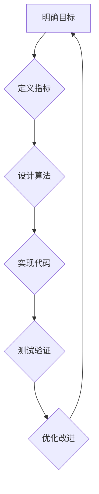

> 目标驱动编程，软件优化，算法设计，数学建模，代码实践，应用场景，未来趋势

## 1. 背景介绍

软件开发行业正处于一个前所未有的变革时期。随着人工智能、云计算、大数据等技术的蓬勃发展，软件系统变得越来越复杂，传统的开发模式已经难以满足日益增长的需求。如何更高效、更智能地开发出高质量的软件，成为业界共同关注的焦点。

目标驱动编程 (Objective-Driven Programming, ODP) 作为一种新兴的软件开发方法，旨在通过明确定义软件的目标，并将其转化为可量化的指标，从而指导软件的设计、开发和优化。它强调从用户的需求出发，以目标为导向，不断迭代改进软件，最终实现预期的价值。

## 2. 核心概念与联系

目标驱动编程的核心概念是将软件开发过程从功能实现转向目标优化。传统的软件开发方法往往侧重于实现具体的软件功能，而忽略了软件的整体性能、效率和用户体验等方面。目标驱动编程则将目标作为软件开发的出发点和终点，通过优化目标的实现路径，最终提升软件的整体质量。

**目标驱动编程的流程:**



**目标驱动编程与其他软件开发方法的联系:**

* **面向对象编程 (OOP):** ODP 可以与 OOP 相结合，将目标分解为多个面向对象的模块，并通过模块之间的交互实现目标的实现。
* **敏捷开发 (Agile):** ODP 与敏捷开发理念相契合，强调迭代开发、持续改进和用户反馈。
* **DevOps:** ODP 可以促进 DevOps 的实践，通过自动化测试和部署，提高软件开发效率和质量。

## 3. 核心算法原理 & 具体操作步骤

### 3.1  算法原理概述

目标驱动编程的核心算法是基于目标的优化算法。这些算法旨在通过不断调整软件的各个参数和配置，以实现预期的目标。常见的目标驱动编程算法包括：

* **遗传算法 (Genetic Algorithm):** 借鉴自然进化机制，通过选择、交叉和变异等操作，不断优化软件的性能。
* **粒子群算法 (Particle Swarm Optimization):** 模拟粒子群的运动轨迹，通过粒子之间的协作和竞争，找到最优解。
* **模拟退火算法 (Simulated Annealing):** 借鉴金属退火的原理，通过随机搜索和温度控制，找到局部最优解。

### 3.2  算法步骤详解

以遗传算法为例，目标驱动编程的具体操作步骤如下：

1. **编码:** 将软件的各个参数和配置编码成基因，构成个体。
2. **初始化种群:** 生成初始种群，每个个体代表一种可能的软件配置。
3. **评估适应度:** 计算每个个体的适应度，即其实现目标的程度。
4. **选择:** 根据适应度选择部分个体进行交叉和变异。
5. **交叉:** 将两个父代个体进行交叉操作，产生两个子代个体。
6. **变异:** 对子代个体进行随机变异操作，增加算法的探索能力。
7. **更新种群:** 将新生成的个体加入种群，构成新的种群。
8. **重复步骤3-7:** 重复上述步骤，直到达到预设的迭代次数或目标适应度。

### 3.3  算法优缺点

**优点:**

* **全局搜索能力强:** 能够探索整个搜索空间，找到全局最优解。
* **适应性强:** 可以应用于各种类型的目标优化问题。
* **并行化能力强:** 可以利用多核处理器进行并行计算，提高效率。

**缺点:**

* **计算复杂度高:** 迭代次数多，计算量大。
* **收敛速度慢:** 找到全局最优解可能需要很长时间。
* **参数设置敏感:** 算法的性能受参数设置的影响较大。

### 3.4  算法应用领域

目标驱动编程算法广泛应用于以下领域:

* **软件性能优化:** 优化软件的运行速度、内存使用和响应时间。
* **软件可靠性提升:** 提高软件的稳定性和抗故障能力。
* **软件资源管理:** 优化软件的资源分配和利用。
* **机器学习模型训练:** 优化机器学习模型的精度和效率。

## 4. 数学模型和公式 & 详细讲解 & 举例说明

### 4.1  数学模型构建

目标驱动编程的核心是建立数学模型，将软件的目标和性能指标量化。常见的数学模型包括：

* **目标函数:** 用于度量软件实现目标的程度，通常是一个需要被最大化的或最小化的函数。
* **约束条件:** 用于限制软件的开发和运行，例如资源限制、时间限制等。

### 4.2  公式推导过程

以软件性能优化为例，目标函数可以定义为软件的运行时间，约束条件可以定义为软件的功能需求。

假设软件的运行时间为 T，功能需求为 F，则目标函数可以表示为：

$$
T(F)
$$

其中，T(F) 是软件运行时间与功能需求 F 的函数关系。

目标是找到一个最优的软件配置，使得 T(F) 最小，同时满足所有约束条件。

### 4.3  案例分析与讲解

假设我们要优化一个图像处理软件的运行速度。我们可以将目标函数定义为软件处理图像的时间，约束条件可以定义为软件必须满足一定的图像处理精度要求。

通过使用遗传算法等目标驱动编程算法，我们可以不断调整软件的算法参数和数据结构，找到一个最优的配置，使得软件的运行速度最快，同时满足图像处理精度要求。

## 5. 项目实践：代码实例和详细解释说明

### 5.1  开发环境搭建

目标驱动编程的项目实践需要以下开发环境:

* **编程语言:** Python, Java, C++ 等
* **算法库:** Scikit-learn, TensorFlow 等
* **版本控制系统:** Git
* **代码编辑器:** VS Code, Atom 等

### 5.2  源代码详细实现

以下是一个使用 Python 和 Scikit-learn 库实现目标驱动编程的简单代码实例，用于优化一个机器学习模型的精度:

```python
from sklearn.datasets import load_iris
from sklearn.model_selection import train_test_split
from sklearn.linear_model import LogisticRegression
from sklearn.metrics import accuracy_score

# 加载数据
iris = load_iris()
X = iris.data
y = iris.target

# 将数据分成训练集和测试集
X_train, X_test, y_train, y_test = train_test_split(X, y, test_size=0.2, random_state=42)

# 定义目标函数: 模型精度
def objective_function(model):
    model.fit(X_train, y_train)
    y_pred = model.predict(X_test)
    return accuracy_score(y_test, y_pred)

# 使用遗传算法优化模型参数
from deap import base, creator, tools, algorithms

# 定义个体
creator.create("FitnessMax", base.Fitness, weights=(1.0,))
creator.create("Individual", list, fitness=creator.FitnessMax)

# 定义遗传算法
toolbox = base.Toolbox()
toolbox.register("attr_float", random.uniform, 0, 1)
toolbox.register("individual", tools.initRepeat, creator.Individual, toolbox.attr_float, n=10)
toolbox.register("population", tools.initRepeat, list, toolbox.individual)
toolbox.register("evaluate", objective_function)
toolbox.register("mate", tools.cxTwoPoint)
toolbox.register("mutate", tools.mutGaussian, mu=0, sigma=1, indpb=0.1)
toolbox.register("select", tools.selTournament, tournsize=3)

# 运行遗传算法
pop = toolbox.population(n=100)
hof = tools.HallOfFame(1)
stats = tools.Statistics(lambda ind: ind.fitness.values)
stats.register("avg", numpy.mean)
stats.register("std", numpy.std)
algorithms.eaSimple(pop, toolbox, cxpb=0.5, mutpb=0.2, ngen=100, stats=stats, halloffame=hof)

# 打印最优解
print(hof[0])
```

### 5.3  代码解读与分析

这段代码演示了如何使用遗传算法优化机器学习模型的精度。

* 首先，定义了目标函数 `objective_function`，该函数计算模型的精度。
* 然后，使用 DEAP 库定义了个体、遗传算法工具箱和遗传算法流程。
* 最后，运行遗传算法，并打印最优解。

### 5.4  运行结果展示

运行这段代码后，会输出最优解，即能够使模型精度最高的模型参数。

## 6. 实际应用场景

目标驱动编程在各个领域都有广泛的应用场景:

### 6.1  软件性能优化

目标驱动编程可以用于优化软件的运行速度、内存使用和响应时间。例如，可以优化数据库查询速度、网页加载速度等。

### 6.2  软件可靠性提升

目标驱动编程可以用于提高软件的稳定性和抗故障能力。例如，可以优化软件的错误处理机制、数据备份机制等。

### 6.3  软件资源管理

目标驱动编程可以用于优化软件的资源分配和利用。例如，可以优化服务器资源分配、网络带宽分配等。

### 6.4  未来应用展望

随着人工智能、云计算等技术的不断发展，目标驱动编程将有更广泛的应用场景。例如，可以用于优化自动驾驶系统、医疗诊断系统等。

## 7. 工具和资源推荐

### 7.1  学习资源推荐

* **书籍:**
    * 《目标驱动编程》
    * 《软件优化》
* **在线课程:**
    * Coursera: "Optimization Algorithms"
    * edX: "Machine Learning"

### 7.2  开发工具推荐

* **算法库:** Scikit-learn, TensorFlow, PyTorch
* **版本控制系统:** Git
* **代码编辑器:** VS Code, Atom

### 7.3  相关论文推荐

* "Objective-Driven Programming: A New Paradigm for Software Development"
* "Genetic Algorithms for Software Optimization"

## 8. 总结：未来发展趋势与挑战

### 8.1  研究成果总结

目标驱动编程是一种新兴的软件开发方法，它将目标作为软件开发的出发点和终点，通过优化目标的实现路径，最终提升软件的整体质量。

### 8.2  未来发展趋势

目标驱动编程的未来发展趋势包括:

* **更智能的算法:** 开发更智能、更有效的目标驱动编程算法。
* **更广泛的应用场景:** 将目标驱动编程应用于更多领域，例如自动驾驶、医疗诊断等。
* **更强大的工具支持:** 开发更强大的目标驱动编程工具，例如自动代码生成工具、性能分析工具等。

### 8.3  面临的挑战

目标驱动编程也面临一些挑战:

* **算法复杂度:** 目标驱动编程算法的复杂度较高，需要更强大的计算能力。
* **参数设置:** 目标驱动编程算法的参数设置对性能影响较大，需要更有效的参数优化方法。
* **可解释性:** 目标驱动编程算法的决策过程往往难以解释，需要提高算法的可解释性。

### 8.4  研究展望

未来，目标驱动编程的研究将继续深入，探索更智能、更有效的算法，并将其应用于更多领域，推动软件开发的创新发展。

## 9. 附录：常见问题与解答

### 9.1  目标驱动编程与传统软件开发方法有什么区别？

目标驱动编程将目标作为软件开发的出发点和终点，而传统软件开发方法往往侧重于实现具体的软件功能。目标驱动编程强调从用户的