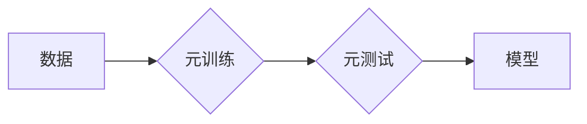

> 元学习，迁移学习，快速学习，few-shot learning，meta-training，meta-testing

## 1. 背景介绍

在机器学习领域，模型的训练通常需要大量的 labeled 数据和大量的计算资源。然而，在现实世界中，获取大量 labeled 数据往往困难且昂贵。为了解决这个问题，元学习 (Meta-Learning) 应运而生。

元学习，也称为“学习如何学习”，是一种机器学习范式，旨在学习学习算法，使其能够快速适应新的任务。换句话说，元学习的目标不是直接学习一个特定的任务，而是学习一个能够快速学习新任务的模型。

元学习的优势在于：

* **快速适应新任务:** 元学习模型能够在看到少量新任务数据后快速学习，无需大量的训练数据。
* **数据效率:** 元学习模型能够更有效地利用有限的 labeled 数据。
* **泛化能力:** 元学习模型能够更好地泛化到新的任务和领域。

## 2. 核心概念与联系

元学习的核心概念是“学习算法”。它学习如何学习，而不是直接学习特定任务。

**元学习流程:**



**元训练:**

* 使用多个任务的数据进行训练，每个任务都包含少量 labeled 数据。
* 学习一个能够泛化到新任务的模型参数。

**元测试:**

* 使用一个新的任务的数据进行测试，该任务在元训练阶段没有见过。
* 评估模型在新的任务上的性能。

**元学习模型:**

* 学习如何从少量数据中快速学习新任务的模型。

## 3. 核心算法原理 & 具体操作步骤

### 3.1  算法原理概述

元学习算法的核心思想是利用“学习如何学习”的机制，通过在多个任务上进行训练，学习一个能够快速适应新任务的模型。

常见的元学习算法包括：

* **MAML (Model-Agnostic Meta-Learning):** 是一种通用的元学习算法，可以应用于各种机器学习模型。
* **Prototypical Networks:** 是一种基于原型学习的元学习算法，适用于图像分类等任务。
* **Matching Networks:** 是一种基于匹配网络的元学习算法，也适用于图像分类等任务。

### 3.2  算法步骤详解

以 MAML 算法为例，其具体操作步骤如下：

1. **初始化模型参数:** 随机初始化模型参数。
2. **元训练:**
    * 随机选择多个任务。
    * 对于每个任务，使用少量 labeled 数据进行训练，更新模型参数。
    * 在每个任务上进行多次训练，以学习如何快速适应新任务。
3. **元测试:**
    * 选择一个新的任务，该任务在元训练阶段没有见过。
    * 使用元训练阶段学习到的模型参数，在少量新任务数据上进行训练。
    * 评估模型在新的任务上的性能。

### 3.3  算法优缺点

**优点:**

* **数据效率:** 元学习模型能够在少量数据上快速学习。
* **泛化能力:** 元学习模型能够更好地泛化到新的任务和领域。

**缺点:**

* **计算成本:** 元学习算法的训练过程通常需要更多的计算资源。
* **算法复杂度:** 元学习算法的实现相对复杂。

### 3.4  算法应用领域

元学习算法在以下领域具有广泛的应用前景:

* **图像分类:** 元学习算法可以用于快速学习新的图像分类任务。
* **自然语言处理:** 元学习算法可以用于快速学习新的自然语言处理任务，例如文本分类和机器翻译。
* **机器人控制:** 元学习算法可以用于快速学习新的机器人控制任务。
* **药物发现:** 元学习算法可以用于加速药物发现过程。

## 4. 数学模型和公式 & 详细讲解 & 举例说明

### 4.1  数学模型构建

元学习模型通常可以看作是一个函数映射，将输入数据映射到输出结果。

**输入:**

* $x$: 输入数据

**输出:**

* $y$: 输出结果

**模型:**

* $f(x; \theta)$: 模型函数，其中 $\theta$ 是模型参数。

### 4.2  公式推导过程

元学习算法的目标是学习模型参数 $\theta$，使其能够在新的任务上快速学习。

**损失函数:**

* $L(\theta; D)$: 模型在数据集 $D$ 上的损失函数。

**优化目标:**

* $\min_{\theta} \sum_{i=1}^{N} L(\theta; D_i)$

其中，$N$ 是训练任务的数量，$D_i$ 是第 $i$ 个训练任务的数据集。

### 4.3  案例分析与讲解

以 MAML 算法为例，其优化目标可以表示为:

$$
\theta^* = \arg \min_{\theta} \sum_{i=1}^{N} \mathbb{E}_{D_i} [L(\theta; D_i')]
$$

其中，$D_i'$ 是在任务 $i$ 上进行少量数据训练后的数据。

## 5. 项目实践：代码实例和详细解释说明

### 5.1  开发环境搭建

* Python 3.6+
* PyTorch 1.0+
* CUDA 10.0+

### 5.2  源代码详细实现

```python
import torch
import torch.nn as nn
import torch.optim as optim

# 定义一个简单的模型
class SimpleModel(nn.Module):
    def __init__(self):
        super(SimpleModel, self).__init__()
        self.linear = nn.Linear(10, 1)

    def forward(self, x):
        return self.linear(x)

# 定义 MAML 算法
class MAML(nn.Module):
    def __init__(self, model, lr=0.01):
        super(MAML, self).__init__()
        self.model = model
        self.optimizer = optim.Adam(self.model.parameters(), lr=lr)

    def meta_train(self, tasks):
        for task in tasks:
            # inner loop
            for step in range(5):
                # 计算梯度
                loss = task['loss']
                self.optimizer.zero_grad()
                loss.backward()
                # 更新参数
                self.optimizer.step()
            # 更新 meta-parameters
            self.optimizer.zero_grad()
            loss.backward()
            self.optimizer.step()

    def meta_test(self, task):
        # 使用 meta-parameters 在新任务上进行测试
        loss = task['loss']
        return loss.item()

# 实例化模型和 MAML 算法
model = SimpleModel()
maml = MAML(model)

# 定义训练任务
tasks = [
    {'data': torch.randn(10, 10), 'target': torch.randn(10, 1)},
    {'data': torch.randn(10, 10), 'target': torch.randn(10, 1)},
    # ...
]

# 元训练
maml.meta_train(tasks)

# 元测试
test_task = {'data': torch.randn(10, 10), 'target': torch.randn(10, 1)}
loss = maml.meta_test(test_task)
print(f'Test Loss: {loss}')
```

### 5.3  代码解读与分析

* 代码首先定义了一个简单的模型 `SimpleModel`，以及一个 MAML 算法实例 `MAML`。
* `meta_train` 函数模拟了元训练过程，在每个任务上进行少量数据训练，更新模型参数。
* `meta_test` 函数模拟了元测试过程，使用元训练阶段学习到的模型参数，在新的任务上进行测试。
* 代码最后实例化模型和 MAML 算法，定义训练任务，进行元训练和元测试。

### 5.4  运行结果展示

运行代码后，会输出元测试的损失值。

## 6. 实际应用场景

元学习算法在以下领域具有广泛的应用前景:

* **个性化推荐:** 元学习算法可以学习每个用户的个性化偏好，并推荐更符合用户需求的商品或服务。
* **医疗诊断:** 元学习算法可以学习从少量病历数据中诊断疾病的知识，并辅助医生进行诊断。
* **自动驾驶:** 元学习算法可以学习从少量驾驶数据中掌握驾驶技能，并提高自动驾驶系统的安全性。

### 6.4  未来应用展望

随着元学习算法的不断发展，其应用场景将会更加广泛。未来，元学习算法有望在以下领域发挥更大的作用:

* **人工智能的通用性:** 元学习算法可以帮助人工智能系统学习更广泛的任务，并提高其通用性。
* **机器学习的效率:** 元学习算法可以提高机器学习模型的训练效率，并减少对 labeled 数据的需求。
* **人工智能的安全性:** 元学习算法可以帮助开发更安全可靠的人工智能系统，并降低其潜在风险。

## 7. 工具和资源推荐

### 7.1  学习资源推荐

* **书籍:**
    * 《Meta-Learning with Differentiable Learning Algorithms》 by Timothy Hospedales, Antreas Antoniou, and Fabio Viola
    * 《Deep Learning》 by Ian Goodfellow, Yoshua Bengio, and Aaron Courville
* **论文:**
    * 《Model-Agnostic Meta-Learning for Fast Adaptation of Deep Networks》 by Finn et al.
    * 《Prototypical Networks for Few-Shot Learning》 by Snell et al.
* **在线课程:**
    * Coursera: Deep Learning Specialization
    * Udacity: Machine Learning Engineer Nanodegree

### 7.2  开发工具推荐

* **PyTorch:** 一个开源的深度学习框架，支持元学习算法的实现。
* **TensorFlow:** 另一个开源的深度学习框架，也支持元学习算法的实现。
* **JAX:** 一个基于 NumPy 的高性能机器学习库，支持元学习算法的实现。

### 7.3  相关论文推荐

* 《Meta-Learning with Differentiable Learning Algorithms》
* 《Model-Agnostic Meta-Learning for Fast Adaptation of Deep Networks》
* 《Prototypical Networks for Few-Shot Learning》
* 《Matching Networks for One Shot Learning》

## 8. 总结：未来发展趋势与挑战

### 8.1  研究成果总结

元学习算法取得了显著的进展，在 few-shot learning、快速适应新任务等方面展现出强大的潜力。

### 8.2  未来发展趋势

* **更有效的元学习算法:** 研究更有效的元学习算法，提高其数据效率和泛化能力。
* **元学习与其他机器学习方法的结合:** 将元学习与其他机器学习方法结合，例如强化学习和迁移学习，进一步提高其性能。
* **元学习在实际应用中的推广:** 将元学习算法应用于更多实际场景，例如医疗诊断、自动驾驶等。

### 8.3  面临的挑战

* **算法复杂度:** 元学习算法的实现相对复杂，需要更多的计算资源和专业知识。
* **数据需求:** 尽管元学习算法能够提高数据效率，但仍然需要一定的 labeled 数据进行训练。
* **泛化能力:** 元学习算法的泛化能力仍然需要进一步提高，使其能够更好地适应新的任务和领域。

### 8.4  研究展望

元学习是一个充满潜力的研究领域，未来将会有更多的研究成果涌现。相信元学习算法将在人工智能领域发挥越来越重要的作用。

## 9. 附录：常见问题与解答

**Q1: 元学习和迁移学习有什么区别？**

**A1:** 元学习和迁移学习都是机器学习中的重要范式，但它们的目标不同。迁移学习的目标是将已学习到的知识应用于新的任务，而元学习的目标是学习如何学习，以便能够快速适应新的任务。

**Q2: 元学习算法需要多少 labeled 数据？**

**A2:** 元学习算法比传统的机器学习算法需要更少的 labeled 数据，但仍然需要一定的