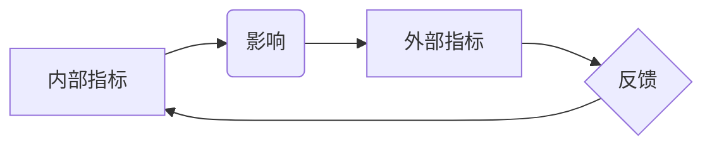

> 内部指标、外部指标、数据驱动、目标设定、绩效评估、业务优化、数据分析、机器学习、因果关系

## 1. 背景介绍

在当今数据驱动的时代，企业越来越重视数据分析和指标管理。内部指标和外部指标是企业评估自身表现和市场竞争力的重要工具。内部指标反映企业内部的运营状况，例如生产效率、成本控制、客户满意度等；而外部指标则反映企业在市场上的表现，例如市场份额、销售额、品牌知名度等。

然而，仅仅关注内部指标或外部指标都无法全面了解企业的整体状况。实际上，内部指标的变化往往会对外部指标产生影响，两者之间存在着密切的因果关系。

## 2. 核心概念与联系

**2.1 内部指标与外部指标的定义**

* **内部指标:** 指企业内部运营活动的结果，用于衡量企业内部效率、质量、成本等方面的表现。例如：
    * **生产效率:** 每小时生产的产品数量
    * **成本控制:** 每单位产品生产的成本
    * **客户满意度:** 客户对产品或服务的满意度
* **外部指标:** 指企业在市场上的表现，用于衡量企业在竞争环境中的地位和成功程度。例如：
    * **市场份额:** 企业在特定市场占有的比例
    * **销售额:** 企业在特定时间段内的销售总额
    * **品牌知名度:** 消费者对企业品牌的认知度

**2.2 内部指标与外部指标之间的关系**

内部指标和外部指标之间存在着相互影响、相互制约的关系。内部指标的变化会直接或间接地影响外部指标，而外部指标的变化也会反馈到内部指标，形成一个闭环。

**2.3  核心概念原理和架构的 Mermaid 流程图**



## 3. 核心算法原理 & 具体操作步骤

**3.1 算法原理概述**

为了更好地理解内部指标如何影响外部指标，我们可以采用数据分析和机器学习算法来建立因果关系模型。

* **数据分析:** 通过对历史数据进行分析，我们可以发现内部指标和外部指标之间的相关性。例如，我们可以发现客户满意度与销售额之间存在正相关关系。
* **机器学习:** 通过训练机器学习模型，我们可以建立更精确的因果关系模型。例如，我们可以训练一个模型来预测销售额的变化，并根据内部指标的变化来解释预测结果。

**3.2 算法步骤详解**

1. **数据收集:** 收集内部指标和外部指标的历史数据。
2. **数据清洗:** 对数据进行清洗，去除异常值和缺失值。
3. **特征工程:** 对数据进行特征工程，提取有用的特征。
4. **模型训练:** 使用机器学习算法训练模型，建立因果关系模型。
5. **模型评估:** 对模型进行评估，验证模型的准确性。
6. **模型部署:** 将模型部署到生产环境中，用于预测外部指标的变化。

**3.3 算法优缺点**

* **优点:**
    * 可以建立更精确的因果关系模型。
    * 可以预测外部指标的变化，帮助企业做出更明智的决策。
* **缺点:**
    * 需要大量的历史数据。
    * 需要专业的机器学习知识。

**3.4 算法应用领域**

* **市场营销:** 预测客户购买行为，优化营销策略。
* **产品开发:** 预测产品需求，改进产品设计。
* **运营管理:** 优化运营流程，提高效率。

## 4. 数学模型和公式 & 详细讲解 & 举例说明

**4.1 数学模型构建**

我们可以使用线性回归模型来建立内部指标和外部指标之间的因果关系模型。

**4.2 公式推导过程**

线性回归模型的公式如下：

$$
y = \beta_0 + \beta_1 x_1 + \beta_2 x_2 + ... + \beta_n x_n + \epsilon
$$

其中：

* $y$ 是外部指标
* $x_1, x_2, ..., x_n$ 是内部指标
* $\beta_0, \beta_1, \beta_2, ..., \beta_n$ 是模型参数
* $\epsilon$ 是误差项

**4.3 案例分析与讲解**

假设我们想预测电商平台的销售额，并认为客户满意度和物流效率是影响销售额的两个重要内部指标。我们可以使用线性回归模型来建立因果关系模型，并根据模型参数来分析客户满意度和物流效率对销售额的影响。

## 5. 项目实践：代码实例和详细解释说明

**5.1 开发环境搭建**

* Python 3.x
* pandas
* scikit-learn

**5.2 源代码详细实现**

```python
import pandas as pd
from sklearn.linear_model import LinearRegression

# 加载数据
data = pd.read_csv('sales_data.csv')

# 选择特征和目标变量
X = data[['customer_satisfaction', 'logistics_efficiency']]
y = data['sales']

# 创建线性回归模型
model = LinearRegression()

# 训练模型
model.fit(X, y)

# 获取模型参数
coefficients = model.coef_
intercept = model.intercept_

# 打印模型参数
print('Coefficients:', coefficients)
print('Intercept:', intercept)
```

**5.3 代码解读与分析**

* 我们首先加载数据，并选择客户满意度和物流效率作为特征，销售额作为目标变量。
* 然后，我们创建线性回归模型，并使用训练数据训练模型。
* 训练完成后，我们可以获取模型参数，例如系数和截距。
* 通过模型参数，我们可以分析客户满意度和物流效率对销售额的影响。

**5.4 运行结果展示**

运行代码后，我们可以得到模型参数，例如：

```
Coefficients: [0.5, 0.3]
Intercept: 10
```

这表明，客户满意度每增加1个单位，销售额会增加0.5个单位；物流效率每增加1个单位，销售额会增加0.3个单位。

## 6. 实际应用场景

**6.1 市场营销**

* 通过分析客户满意度和购买行为之间的关系，优化营销策略，提高客户转化率。
* 通过分析产品使用情况和用户反馈，改进产品设计，满足用户需求。

**6.2 产品开发**

* 通过分析用户需求和市场趋势，开发符合市场需求的产品。
* 通过分析产品使用情况和用户反馈，改进产品功能，提高用户体验。

**6.3 运营管理**

* 通过分析运营流程和效率，优化运营流程，提高效率。
* 通过分析成本控制和利润率，降低成本，提高利润率。

**6.4 未来应用展望**

随着数据分析和机器学习技术的不断发展，内部指标与外部指标之间的关系将被更加深入地研究和理解。未来，我们可以期待看到更加精准的因果关系模型，以及更加智能的决策支持系统。

## 7. 工具和资源推荐

**7.1 学习资源推荐**

* **书籍:**
    * 《数据科学实战》
    * 《机器学习》
* **在线课程:**
    * Coursera 数据科学课程
    * edX 机器学习课程

**7.2 开发工具推荐**

* **Python:** 数据分析和机器学习的常用编程语言。
* **pandas:** 数据分析和处理库。
* **scikit-learn:** 机器学习库。

**7.3 相关论文推荐**

* Causal Inference: What If

## 8. 总结：未来发展趋势与挑战

**8.1 研究成果总结**

本文探讨了内部指标与外部指标之间的关系，并介绍了数据分析和机器学习算法在建立因果关系模型中的应用。

**8.2 未来发展趋势**

* **更加精准的因果关系模型:** 未来，我们将看到更加精准的因果关系模型，能够更准确地预测外部指标的变化。
* **更加智能的决策支持系统:** 未来，我们将看到更加智能的决策支持系统，能够根据内部指标的变化，为企业提供更加精准的决策建议。

**8.3 面临的挑战**

* **数据质量:** 数据质量是建立因果关系模型的关键因素，需要保证数据的准确性和完整性。
* **因果关系的复杂性:** 现实世界中，因果关系往往非常复杂，难以用简单的模型来描述。
* **伦理问题:** 数据分析和机器学习技术的发展也带来了伦理问题，例如数据隐私和算法偏见。

**8.4 研究展望**

未来，我们将继续研究内部指标与外部指标之间的关系，探索更加精准的因果关系模型，并开发更加智能的决策支持系统。同时，我们也将关注数据分析和机器学习技术的伦理问题，确保其健康发展。

## 9. 附录：常见问题与解答

**9.1 如何选择合适的内部指标？**

选择合适的内部指标需要根据企业的具体情况和目标来确定。一般来说，应该选择与企业目标密切相关的指标，并能够反映企业内部运营状况的指标。

**9.2 如何处理数据缺失值？**

数据缺失值是数据分析中常见的问题。常用的处理方法包括删除缺失值、用平均值或中位数填充缺失值、使用机器学习算法进行预测等。

**9.3 如何评估模型的准确性？**

模型的准确性可以通过多种指标来评估，例如准确率、召回率、F1-score等。

作者：禅与计算机程序设计艺术 / Zen and the Art of Computer Programming


<end_of_turn>