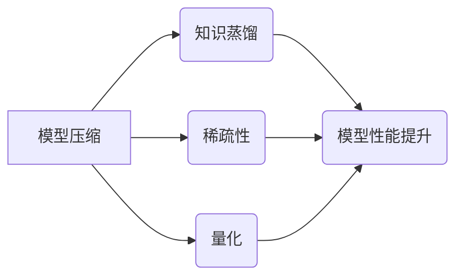

> 参数效率训练, 模型压缩, 知识蒸馏, 稀疏性, 量化, 联邦学习, 深度学习

## 1. 背景介绍

深度学习在过去十年取得了令人瞩目的成就，在图像识别、自然语言处理、语音识别等领域取得了突破性的进展。然而，深度学习模型的训练和部署也面临着一些挑战，其中之一就是模型规模庞大，参数数量巨大。这导致模型训练需要大量的计算资源和时间，并且部署到资源有限的设备上也存在困难。

为了解决这个问题，参数效率训练应运而生。参数效率训练是指通过各种技术手段，在不牺牲模型性能的前提下，减少模型参数数量或训练所需的计算资源。这对于推动深度学习技术的普及和应用至关重要。

## 2. 核心概念与联系

参数效率训练的核心目标是优化模型的训练过程，使其更加高效，同时保持或提高模型性能。

**2.1 核心概念**

* **模型压缩:** 通过各种技术手段，例如权重剪枝、量化、知识蒸馏等，减少模型参数数量。
* **知识蒸馏:** 将知识从大型模型迁移到小型模型，从而提高小型模型的性能。
* **稀疏性:** 利用模型参数的稀疏性，减少计算量。
* **量化:** 将模型参数的精度降低，例如从32位浮点数降至8位整数，从而减少内存占用和计算量。

**2.2 核心概念联系**

参数效率训练的各种技术手段相互关联，可以相互补充，共同提高模型的训练效率。例如，知识蒸馏可以将大型模型的知识迁移到小型模型，而模型压缩可以进一步减少小型模型的参数数量，从而实现更有效的参数效率训练。



## 3. 核心算法原理 & 具体操作步骤

### 3.1 算法原理概述

参数效率训练的算法原理主要基于以下几个方面：

* **模型结构优化:** 通过设计更紧凑的模型结构，减少参数数量。例如，使用深度可分离卷积、混合精度训练等技术。
* **权重剪枝:** 通过移除模型中不重要的权重，减少参数数量。
* **知识蒸馏:** 将大型模型的知识迁移到小型模型，从而提高小型模型的性能。
* **量化:** 将模型参数的精度降低，例如从32位浮点数降至8位整数，从而减少内存占用和计算量。

### 3.2 算法步骤详解

以下以权重剪枝为例，详细介绍参数效率训练的具体操作步骤：

1. **训练初始模型:** 首先使用完整的模型训练一个初始模型。
2. **计算权重重要性:** 使用一些方法，例如梯度下降的绝对值、权重连接的次数等，计算每个权重的重要性。
3. **选择权重进行剪枝:** 根据权重重要性，选择一些不重要的权重进行剪枝，例如移除绝对值较小的权重。
4. **重新训练模型:** 使用剪枝后的模型进行重新训练，以恢复模型性能。
5. **重复步骤2-4:** 可以重复上述步骤，逐步剪枝模型，直到达到预期的参数数量。

### 3.3 算法优缺点

**优点:**

* 可以有效减少模型参数数量，降低模型的存储和计算成本。
* 可以提高模型的推理速度。

**缺点:**

* 剪枝操作可能会导致模型性能下降。
* 需要反复训练模型，增加训练时间。

### 3.4 算法应用领域

权重剪枝算法广泛应用于各种深度学习领域，例如：

* **图像识别:** 压缩图像识别模型，使其能够部署在移动设备上。
* **自然语言处理:** 压缩自然语言处理模型，例如机器翻译、文本摘要等。
* **语音识别:** 压缩语音识别模型，使其能够实时识别语音。

## 4. 数学模型和公式 & 详细讲解 & 举例说明

### 4.1 数学模型构建

参数效率训练的数学模型主要基于优化问题，目标是找到一个最优的模型参数，使得模型性能达到最大化，同时参数数量最小化。

### 4.2 公式推导过程

假设模型的损失函数为L(θ)，θ表示模型参数，则参数效率训练的目标函数可以表示为：

$$
min_{\theta} L(\theta) + \lambda ||\theta||_p
$$

其中，λ为正则化参数，||θ||_p表示模型参数的L_p范数，p通常为1或2。

### 4.3 案例分析与讲解

例如，在权重剪枝算法中，可以将剪枝操作看作是将一些参数设置为零，从而减少模型参数的数量。

假设模型参数为θ，剪枝操作将θ中的某些元素设置为零，得到新的参数θ'，则可以将剪枝操作表示为：

$$
\theta' = \text{prune}(\theta)
$$

其中，prune()函数表示剪枝操作。

## 5. 项目实践：代码实例和详细解释说明

### 5.1 开发环境搭建

* 操作系统：Ubuntu 20.04
* Python 版本：3.8
* 深度学习框架：TensorFlow 2.x

### 5.2 源代码详细实现

以下是一个使用TensorFlow实现权重剪枝的代码示例：

```python
import tensorflow as tf

# 定义模型
model = tf.keras.models.Sequential([
    tf.keras.layers.Conv2D(32, (3, 3), activation='relu', input_shape=(28, 28, 1)),
    tf.keras.layers.MaxPooling2D((2, 2)),
    tf.keras.layers.Flatten(),
    tf.keras.layers.Dense(10, activation='softmax')
])

# 训练模型
model.compile(optimizer='adam',
              loss='sparse_categorical_crossentropy',
              metrics=['accuracy'])
model.fit(x_train, y_train, epochs=10)

# 剪枝操作
pruned_model = tf.keras.models.clone_model(model)
for layer in pruned_model.layers:
    if isinstance(layer, tf.keras.layers.Conv2D):
        # 剪枝操作，例如移除绝对值较小的权重
        pruned_weights = tf.where(tf.abs(layer.weights[0]) > 0.5, layer.weights[0], 0.0)
        layer.set_weights([pruned_weights])

# 重新训练模型
pruned_model.compile(optimizer='adam',
                    loss='sparse_categorical_crossentropy',
                    metrics=['accuracy'])
pruned_model.fit(x_train, y_train, epochs=10)
```

### 5.3 代码解读与分析

* 代码首先定义了一个简单的卷积神经网络模型。
* 然后使用Adam优化器和交叉熵损失函数训练模型。
* 之后，使用剪枝操作移除模型中一些权重，从而减少模型参数数量。
* 最后，重新训练剪枝后的模型。

### 5.4 运行结果展示

通过运行上述代码，可以观察到剪枝后的模型参数数量减少，同时模型性能也可能有所下降。

## 6. 实际应用场景

参数效率训练在许多实际应用场景中发挥着重要作用，例如：

* **移动设备上的深度学习:** 由于移动设备的资源有限，需要压缩深度学习模型，使其能够在移动设备上运行。
* **嵌入式系统上的深度学习:** 嵌入式系统通常具有有限的计算资源和内存，需要使用参数效率训练技术来部署深度学习模型。
* **边缘计算:** 边缘计算需要在边缘设备上进行深度学习推理，参数效率训练可以帮助减小模型大小，提高推理速度。

### 6.4 未来应用展望

随着深度学习技术的不断发展，参数效率训练将发挥越来越重要的作用。未来，参数效率训练可能会应用于以下领域：

* **自动驾驶:** 压缩自动驾驶模型，使其能够在车载设备上实时运行。
* **医疗诊断:** 压缩医疗诊断模型，使其能够在医疗设备上进行快速诊断。
* **工业自动化:** 压缩工业自动化模型，使其能够在工业设备上进行实时控制。

## 7. 工具和资源推荐

### 7.1 学习资源推荐

* **论文:**
    * "Deep Compression: Compressing Deep Neural Networks with Pruning, Trained Quantization and Huffman Coding"
    * "Knowledge Distillation"
    * "Lottery Ticket Hypothesis: Finding Sparse, Trainable Neural Networks"
* **博客:**
    * https://towardsdatascience.com/
    * https://blog.openai.com/

### 7.2 开发工具推荐

* **TensorFlow:** https://www.tensorflow.org/
* **PyTorch:** https://pytorch.org/
* **Keras:** https://keras.io/

### 7.3 相关论文推荐

* "Pruning Filters for Efficient ConvNets"
* "Quantization-aware Training"
* "EfficientNet: Rethinking Model Scaling for Convolutional Neural Networks"

## 8. 总结：未来发展趋势与挑战

### 8.1 研究成果总结

参数效率训练取得了显著的成果，有效地降低了深度学习模型的训练成本和部署成本，推动了深度学习技术的普及和应用。

### 8.2 未来发展趋势

未来，参数效率训练的研究将朝着以下方向发展：

* **更有效的压缩算法:** 开发更有效的模型压缩算法，例如基于神经网络的剪枝算法、量化算法等。
* **自动化参数效率训练:** 自动化参数效率训练流程，使其更加易于使用。
* **跨平台参数效率训练:** 将参数效率训练技术应用于不同的深度学习框架和硬件平台。

### 8.3 面临的挑战

参数效率训练仍然面临一些挑战，例如：

* **模型性能下降:** 压缩模型可能会导致模型性能下降，需要找到一种平衡压缩率和模型性能的方法。
* **训练效率:** 某些参数效率训练算法的训练效率较低，需要进一步优化算法。
* **可解释性:** 一些参数效率训练算法的原理比较复杂，缺乏可解释性，需要进一步研究算法的可解释性。

### 8.4 研究展望

参数效率训练是一个充满挑战和机遇的领域，未来将会有更多的研究成果涌现，推动深度学习技术的进一步发展。

## 9. 附录：常见问题与解答

### 9.1 什么是参数效率训练？

参数效率训练是指通过各种技术手段，在不牺牲模型性能的前提下，减少模型参数数量或训练所需的计算资源。

### 9.2 参数效率训练有哪些方法？

常见的参数效率训练方法包括：模型压缩、知识蒸馏、稀疏性、量化等。

### 9.3 参数效率训练有什么优势？

参数效率训练可以有效降低模型的存储和计算成本，提高模型的推理速度，从而推动深度学习技术的普及和应用。


作者：禅与计算机程序设计艺术 / Zen and the Art of Computer Programming 
<end_of_turn>